# 投机采样 — 直观且全面的解释

> 原文：[`towardsdatascience.com/speculative-sampling-intuitively-and-exhaustively-explained-2daca347dbb9`](https://towardsdatascience.com/speculative-sampling-intuitively-and-exhaustively-explained-2daca347dbb9)

## 机器学习 | 自然语言处理 | 数据科学

## 探索加速语言模型 3 倍的替代策略

[](https://medium.com/@danielwarfield1?source=post_page-----2daca347dbb9--------------------------------)[](https://towardsdatascience.com/?source=post_page-----2daca347dbb9--------------------------------) [Daniel Warfield](https://medium.com/@danielwarfield1?source=post_page-----2daca347dbb9--------------------------------)

·发表于 [Towards Data Science](https://towardsdatascience.com/?source=post_page-----2daca347dbb9--------------------------------) ·阅读时间 12 分钟·2023 年 12 月 15 日

--


“投机者”由 Daniel Warfield 使用 MidJourney 和 Affinity Design 2 制作。所有图像均由作者提供，除非另有说明。

在本文中，我们将讨论“投机采样”，这是一种使文本生成更快、更经济的策略，同时不妨碍性能。为此，我们将深入探讨语言模型的一些更微妙的方面。

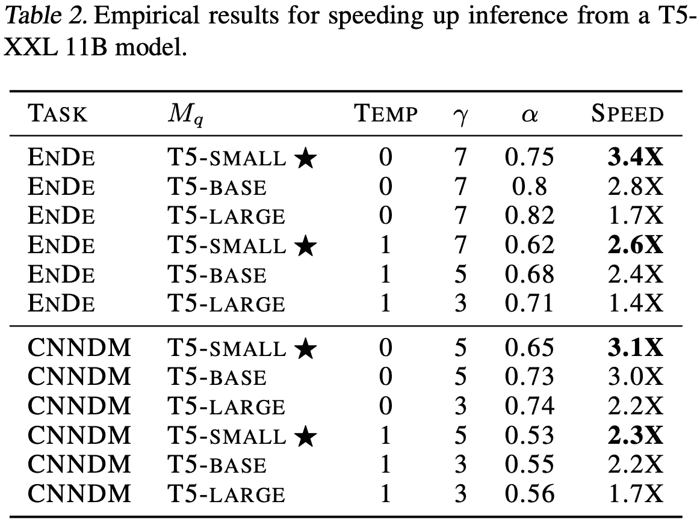

使用投机采样在各种文本生成任务中的实证结果。请注意，在所有情况下，生成时间都显著更快。 [来源](https://arxiv.org/pdf/2211.17192.pdf)

首先，我们将讨论一个拖慢现代语言模型的主要问题，然后建立对投机采样如何优雅加速它们的直观理解，最后我们将用 Python 从头实现投机采样。

**这对谁有用？** 对自然语言处理（NLP）或前沿人工智能进展感兴趣的任何人。

**这篇文章的难度如何？** 本文中的概念对机器学习爱好者来说是可以接受的，同时足够前沿，能引起经验丰富的数据科学家的兴趣。文末的代码可能对开发者有用。

**前提条件：** 了解变换器、OpenAI 的 GPT 模型或两者之一可能会有帮助。如果你感到困惑，可以参考这两篇文章：

[](/gpt-intuitively-and-exhaustively-explained-c70c38e87491?source=post_page-----2daca347dbb9--------------------------------) ## GPT — 直观且全面的解释

### 探索 OpenAI 生成预训练变换器的架构。

towardsdatascience.com [](/transformers-intuitively-and-exhaustively-explained-58a5c5df8dbb?source=post_page-----2daca347dbb9--------------------------------) ## 变换器 — 直观且详尽的解释

### 探索现代机器学习的潮流：一步步拆解变换器

towardsdatascience.com

# 语言模型变得过于庞大

在过去四年中，OpenAI 的 GPT 模型从 2018 年的 1.17 亿参数增长到 2023 年估计的 1.8 万亿参数。这一快速增长在很大程度上归因于在语言建模中，更大的模型效果更好。

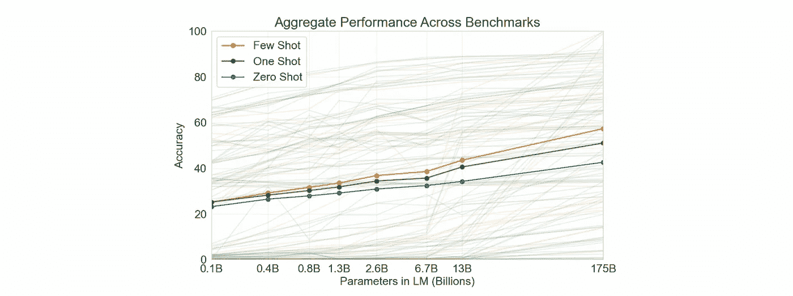

模型规模与性能的图表，显示出更大的模型效果更好。来自 [我关于 GPT 的文章](https://medium.com/towards-data-science/gpt-intuitively-and-exhaustively-explained-c70c38e87491)。 [原始来源](https://arxiv.org/pdf/2005.14165.pdf)

因此，过去几年中，行业变成了一场军备竞赛。众多公司在炫酷的显卡上投入了数十亿美元，这让 Fortnite 玩家感到不满。

问题在于，这些模型变得过于庞大。像 ChatGPT 使用的语言模型，需要通过一种称为“自回归生成”的过程逐字生成响应。模型越大，生成逐字输出所需的金钱和时间就越多。

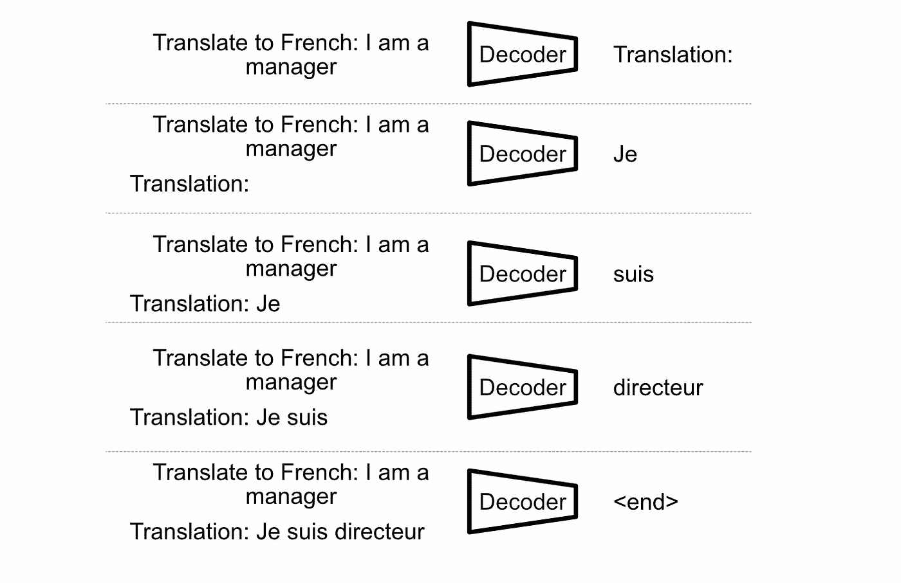

像 GPT 这样的解码器单模型，通过逐步构建输出。模型接受输入“翻译成法语：我是一个经理”，并通过将之前的输出作为输入的一部分，逐字生成响应。这种文本生成方式称为“自回归生成”。 [来自我关于 GPT 的文章](https://medium.com/towards-data-science/gpt-intuitively-and-exhaustively-explained-c70c38e87491)

OpenAI 的 GPT-4，[基于某人在 Twitter 上的泄露信息](https://archive.is/2RQ8X#selection-833.1-873.202)，使用了一些技术来绕过这个问题。其中之一，就是本文的主题——投机采样。

# 投机采样简要概述

投机采样（也称为“投机解码”或“投机生成”）在两篇论文中同时被提出，两者都建议通过投机采样将文本生成速度提高约 3 倍：

+   “[加速大型语言模型解码的投机采样](https://arxiv.org/pdf/2302.01318.pdf)”，这是 DeepMind 发表的一篇论文，

+   “[通过投机解码实现变换器的快速推断](https://arxiv.org/pdf/2211.17192.pdf)”，这是 Google 发表的一篇论文。

尽管两种方法是独立发布的，但功能上是相同的，因此我们将它们视为同义词。

推测采样的基本思想是，较大的语言模型更好，因为*有些*文本生成的例子是困难的，但不是*所有*例子。例如，假设你问一个语言模型关于月球的地质组成。为了形成一个连贯的回答，模型不仅需要理解复杂的科学内容，还需要将“a”、“and”和“of”等词放在正确的位置。知道月球由一种叫“Breccias”的物质组成比知道“are”可能会跟在“which”之后要困难。


生成难度的概念性演示。当模型逐字预测响应序列时，一些词难以预测，因为它们需要深入的知识，而一些词则容易预测，因为可以通过简单的语法或上下文线索推断。在这个例子中，红色文本可能比蓝色文本更难预测。

推测采样利用了通过使用两个语言模型的不同难度程度的概念；一个目标模型和一个草稿模型：

+   目标模型是我们试图加速的超大、超智能模型。

+   草稿模型是一个较小、较简单且更快的模型。

这个想法是使用草稿模型来预测序列中的多个词，然后让目标模型确认所有生成的词都是好的。我们可以丢弃所有不一致的部分，从而得到一个与目标模型独立工作时输出的结果相同的输出。

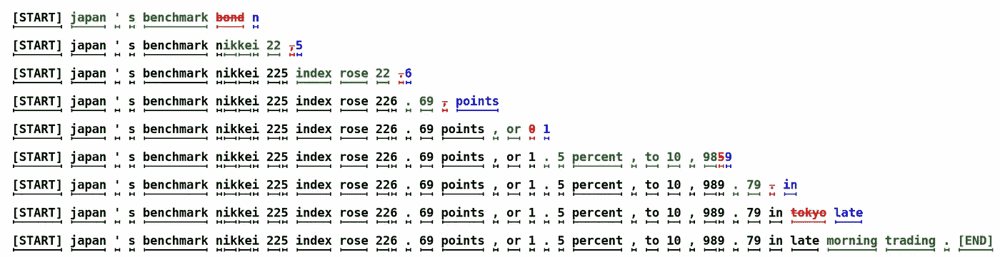

一个具有推测生成的实际例子。在第一行中，草稿模型输出了“日本的基准债券”，但目标模型不同意“债券”，选择了“n”。词语“债券”被替换为“n”，草稿模型在“债券”之后可能预测的任何内容都被丢弃。实际上，这使得推测生成系统可以为目标模型的每次通过输出多个词。[source](https://arxiv.org/pdf/2211.17192.pdf)

# 一个自然的问题

如果你和我一样，可能会感到有些困惑。常见的直觉，以及我在我的[变压器文章](https://medium.com/towards-data-science/transformers-intuitively-and-exhaustively-explained-58a5c5df8dbb)和我的[GPT 文章](https://medium.com/towards-data-science/gpt-intuitively-and-exhaustively-explained-c70c38e87491)中传达的直觉，是语言模型逐字预测输出。在这种直觉下，目标模型如何高效地“二次检查”草稿模型的输出并不明显；如果目标模型必须逐个检查预测，那么最初使用草稿模型有什么意义呢？


如果像 GPT 这样的模型逐字输出文本，难道它不能像检查草稿模型的输出那样逐字检查吗？不会，我们将在下一节讨论原因。

推测性采样的思想需要对 Transformer 的确切输出有透彻的理解。有一些通常不相关的细节，但对于推测性采样来说非常相关。

# Transformer 的秘密输出，以及推测性采样如何使用它们

正如我在[我关于原始 Transformer 架构的文章](https://medium.com/towards-data-science/transformers-intuitively-and-exhaustively-explained-58a5c5df8dbb)中讨论的那样，Transformer 的特别之处在于它们能够并行化训练。在 Transformer 之前，像 LSTM 这样的模型必须逐字训练，这是一种缓慢且昂贵的过程。

当像 GPT 这样的模型进行训练时，会将整个输入序列提供给模型，模型被要求预测相同的序列，只是偏移了一个单词。然后，模型被训练以最小化其预测的缺陷。

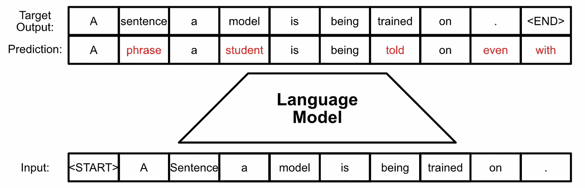

语言模型（如 GPT）训练过程的一个例子。模型被给定一个输入序列，该序列向右移动一个标记以指示序列的开始，然后模型被要求在一次传递中预测相同的序列。任何错误都用于训练模型。本质上，模型被训练来预测*所有下一个单词同时出现*。

所以，如果模型可以访问整个输入序列，它是否会通过将每个单词移到一个空间来作弊？不会，这要归功于掩码。

Transformer 使用“掩码”自注意力，这本质上是阻止未来单词的信息到达给定单词的信息。我可能会在专门的文章中详细介绍掩码，这绝对值得深入探讨，但直观理解是：通过将自注意力机制中的某些值设为零，给定单词的预测不会受到未来单词的影响。

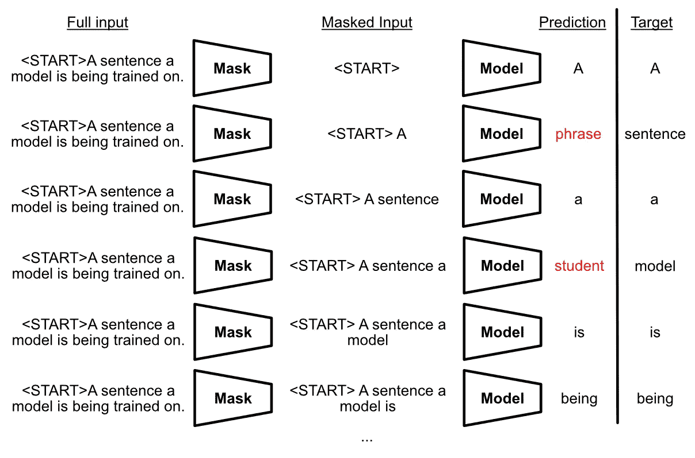

使用掩码的训练概念图。实际上，使用掩码时，语言模型被要求同时预测所有下一个单词。

通常，当使用 Transformer 时，我们只关心序列中下一个单词的预测；这就是我们生成文本并促使风险投资家掏钱的方式。然而，技术上讲，模型的输出对于整个序列来说，就好像序列中的下一个单词不存在一样，这是由于模型的训练方式。


基于 Transformer 的语言模型（如 GPT）的真实输出。虽然我们通常只关心最终的最后一个单词预测，但技术上它预测了序列中的所有下一个单词。

这就是目标模型如何快速检查草稿模型的众多预测的方法。如果我们将草稿模型的输出作为输入提供给目标模型，并要求目标模型预测下一个词，我们可以比较序列中每个词的预测值。如果存在差异，我们可以停在那里并使用目标模型的输出。

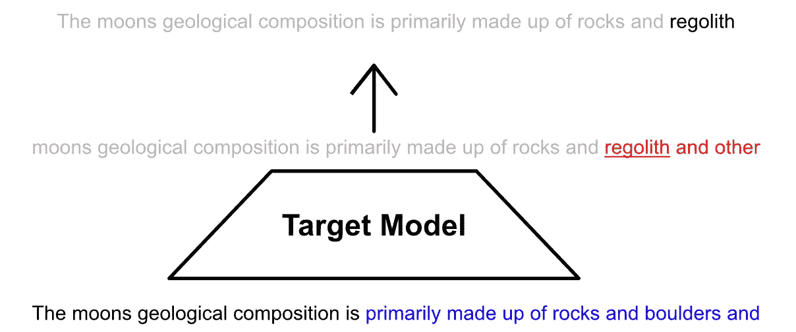

假设蓝色的文本是由草稿模型生成的，而目标模型不同意序列中某些用红色高亮和下划线标记的词。所有在分歧前生成的草稿都可以接受，而分歧后生成的所有文本必须被拒绝。在第一次分歧时我们使用目标模型的输出。实际上，我们通过目标模型的一次运行生成了“主要由岩石和月壤组成”。

关于这个过程的一点有趣说明。每次我们运行目标模型时，它都会预测序列中的下一个词。目标模型可能会确认草稿模型的所有预测，或者与所有预测不一致。无论如何，目标模型总是会预测一个新词。因此，在草稿模型持续输出错误信息的最坏情况下，整个系统的速度与仅使用目标模型时一样。换句话说，**推测采样不会减慢生成速度，它只能使生成速度更快**（至少，当它正确实现时）。

# 序列、标记、标记 ID、逻辑值和概率

这就是理论。在我们深入代码之前，我们应该讨论一些关于变换器如何工作的技术细节。

从语言建模的角度来看，文本被概念化为**序列**；一个一个接着的“元素”列表。通常这些“元素”可以被概念化为词，但实际上它们比这更抽象。

机器学习模型首先将输入序列拆分为**标记**，这些标记是构成序列的“元素”。这可以通过多种算法完成，但最终结果是输入序列被分割成原子级的块。这些块可能是单个词、词的一部分、多个词、标点符号、数字或空格。

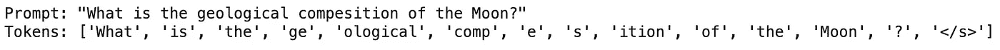

一个使用名为“sentencepiece”的分词器进行标记化的示例

从分词器提取的每个标记都有一个独特的编号，称为**TokenId**。通常，变换器风格的模型会为每个 TokenId 学习一个代表向量，该向量随后成为模型的输入。每个 TokenId 都有一个与之关联的向量，模型在训练过程中对该向量进行优化。

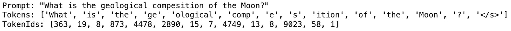

相同的标记及其关联的 ID

数据经过模型内部多个自注意力轮次后，数据变成了每个输出一个的抽象向量序列。这有时被称为“最终隐藏状态”。

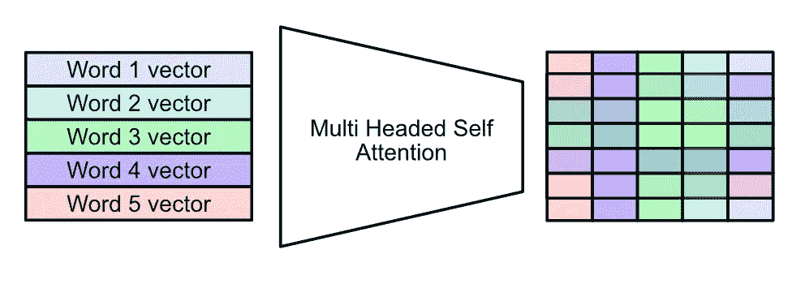

输入的向量与每个单词干净地对应，通过多个自注意力层。这一过程创建了高度抽象的表示。[来自我关于变换器的文章。](https://medium.com/towards-data-science/transformers-intuitively-and-exhaustively-explained-58a5c5df8dbb)

这通过一个语言建模头传递，该头将模型的抽象表示转换为与分词器直接对应的表示。对于给定的分词器，有一个固定数量的 TokenIds，语言建模头将模型的输出转换为包含相同数量值的向量。

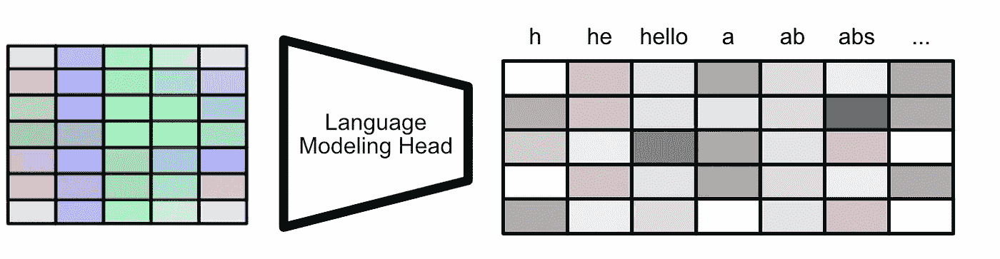

在变换器完成其任务后，模型的最终隐藏状态通过语言建模头，该头将数据重构为直接对应于模型所训练的分词器的格式。

这些输出被称为**logits**。通常，“logit”这个术语用来指代模型的未过滤、未处理的真实输出。这通常是被优化的内容。logits 通常通过 softmax 函数进行比较，将 logits 转换为**概率**。大 logit 值变成大概率，小 logit 值变成小概率。

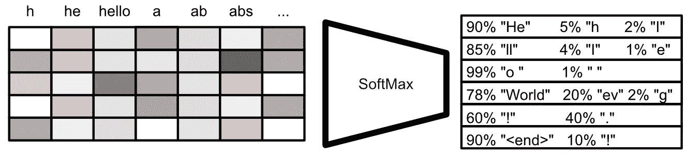

logits 转换为概率的概念图。

这些概率可以被转换为令牌，然后可以用来构建输出序列。不过，有几种方法可以做到这一点。

+   你可以简单地总是选择使用最高概率的令牌。

+   你可以以加权概率的方式随机选择输出。

+   你可以采用更复杂的策略，例如“top K 采样”。

无论如何，概率变成了一个 tokenId，这个 tokenId 变成了令牌本身，从这些令牌中可以构建输出。

所以，总结一下：

+   **Sequence：** 这通常用来指代输入和输出文本，但也可以概念化为令牌序列、TokenIds 序列、logits 序列、概率序列等。“序列”可以根据讨论的上下文有几种含义。

+   **Token：** 文本可以通过分词器分割成原子令牌。这些用于将文本拆分成原子预定义的块。有时这些块与单词干净地对应，有时则不然。

+   **TokenId：** 每个令牌都有一个对应的 TokenId，这只是一个数字。模型使用这个数字来检索该令牌的学习向量，从而构建模型的输入。

+   **Logits 和概率：** 在模型完成其操作后，它会输出一系列值。这些值通常会经过 softmax 处理，从而转化为概率。这些概率用于选择输出令牌。

# PyTorch 中的猜测性抽样

现在我们理解了 logits、概率和令牌，我们可以开始深入了解猜测性抽样的实际例子。

让我们保持简单：我们将使用最大 logit 值来决定每一步生成哪个令牌。如果草稿模型和目标模型都输出相同的最大值，我们将说它们达成了一致。

完整的代码可以在这里找到：

[## MLWritingAndResearch/SpeculativeSampling.ipynb at main · DanielWarfield1/MLWritingAndResearch

### 机器学习写作和研究中使用的笔记本示例 - MLWritingAndResearch/SpeculativeSampling.ipynb at…

[github.com](https://github.com/DanielWarfield1/MLWritingAndResearch/blob/main/SpeculativeSampling.ipynb?source=post_page-----2daca347dbb9--------------------------------)

## 加载模型

首先，我们需要一个草稿模型和一个目标模型。在这个例子中，我使用的是 T5，它代表“Text to Text Transfer Transformer”。它是一种编码器-解码器风格的变换器（就像我在这篇文章中讨论的那样），与仅解码器模型（[就像我在这篇文章中讨论的那样](https://medium.com/p/c70c38e87491)）不同。不过，它有一个解码器，所以它可以满足我们的需求。此外，方便的是，T5 有多种尺寸，经过预训练，并且在 huggingface 上很容易获得。

```py
"""Loading the draft model
"""

from transformers import T5Tokenizer, T5ForConditionalGeneration

#loading the draft model
draft = "google/flan-t5-large"
draft_tokenizer = T5Tokenizer.from_pretrained(draft)
draft_model = T5ForConditionalGeneration.from_pretrained(draft)
```

```py
"""Loading the target model
"""

#loading the target model
target = "google/flan-t5-xl"
target_tokenizer = T5Tokenizer.from_pretrained(target)
target_model = T5ForConditionalGeneration.from_pretrained(target)
```

猜测性解码的整个概念依赖于草稿模型和目标模型具有相同的令牌。因此，为了双重确认，我确认了两个模型的分词器行为相似。

```py
"""Ensuring the tokenizers are identical
in order for speculative sampling to work, tokenization for both the draft
and target model must be identical. This is a sanity check to make sure they are.
"""

#tokenizing a test sequence
tokenizer_test = "this, is, some [text] for 1234comparing, tokenizers adoihayyuz"
ex1 = target_tokenizer(prompt, return_tensors="pt").input_ids
ex2 = draft_tokenizer(prompt, return_tensors="pt").input_ids

#zero means all tokenized values are the same, so the tokenizers are
#more than likely identical
print((ex1-ex2).abs().max())
```


在这种情况下，“0”表示两个分词器的行为相似

## 构建猜测性抽样

一旦你拥有了模型，你只需要进行一些…猜测性抽样。正如之前提到的，要有效地进行猜测性抽样，你需要一个可以处理并行信息提示的完整架构。在这个例子中，我只是简单地在同一台机器上进行草稿和检查。这并不是一个非常复杂的过程，但确实有一些循环和逻辑需要实现才能使其正常工作。以下是代码：

```py
"""Performing Speculative Sampling
"""

#initializing an empty input to feed to the decoder.
#this is updated each loop with valid generations
decoder_ids = draft_model._shift_right(draft_tokenizer("", return_tensors="pt").input_ids)

#defining input. T5 is an encoder-decoder model, so input and output are handled seperatly
input_ids = draft_tokenizer("Translate to German \n Battle not with monsters, lest ye become a monster, and if you gaze into the abyss, the abyss gazes also into you.", return_tensors="pt").input_ids

#defining the number of draft generations
k = 5

#keeps track of generation information, for later printouts
generated = []

#Generating Text
iter = 0
for _ in range(15):
    print('========== Speculative Sampling Iteration {} =========='.format(iter))
    iter+=1

    #creating a holding place for the generated draft
    decoder_ids_draft = decoder_ids.clone()

    before_text = draft_tokenizer.decode(decoder_ids_draft[0])
    initial_length = decoder_ids.shape[1]

    #generating draft
    for i in range(k):

        #predicting the next token with the draft model
        with torch.no_grad():
            logits = draft_model(input_ids=input_ids, decoder_input_ids=decoder_ids_draft).logits
            genid = torch.argmax(logits, dim=2)[0][-1]

        #appending the generated id to the draft
        genid = genid.expand(1,1)
        decoder_ids_draft = torch.cat((decoder_ids_draft,genid),1)

    print('=== Draft Generation')
    current_draft = draft_tokenizer.decode(decoder_ids_draft[0])
    print('generated draft tokens: {}'.format(decoder_ids_draft))
    print('generated draft text: {}'.format(current_draft))

    #Generating all next token predictions with the target
    logits = target_model(input_ids=input_ids, decoder_input_ids=decoder_ids_draft).logits
    genids = torch.argmax(logits, dim=2)[0]
    print('=== Target Generation')
    current_target = draft_tokenizer.decode(genids)
    print('generated target tokens: {}'.format(genids))
    print('generated target text: {}'.format(current_target))

    #checking draft against target
    for i, (dv, tv) in enumerate(zip(decoder_ids_draft[0,1:],genids[:-1])):
        #target does not agree with the draft
        if dv != tv:
            #genids is next word, so this is done to preserve the first token
            first_token = decoder_ids[0][:1]
            decoder_ids = genids[:i+1]
            decoder_ids = torch.cat((first_token,decoder_ids),0)
            break
    else:
        #no disagreements
        decoder_ids = genids

    print('=== Validated Generation')
    current_target = draft_tokenizer.decode(decoder_ids)
    print('generated target tokens: {}'.format(decoder_ids))
    print('generated target text: {}'.format(current_target))

    #expanding dimensions so that the shape of the tensor is the same
    decoder_ids = decoder_ids.expand(1,len(decoder_ids))

    #logging
    numgen = decoder_ids.shape[1] - initial_length
    generated.append({'tokens generated': numgen, 'text before': before_text, 'text after': current_target})
```

一旦得出结论，我们可以观察每个循环生成了多少个令牌。在这个例子中，我们要求模型将一句名言从英语翻译成德语：

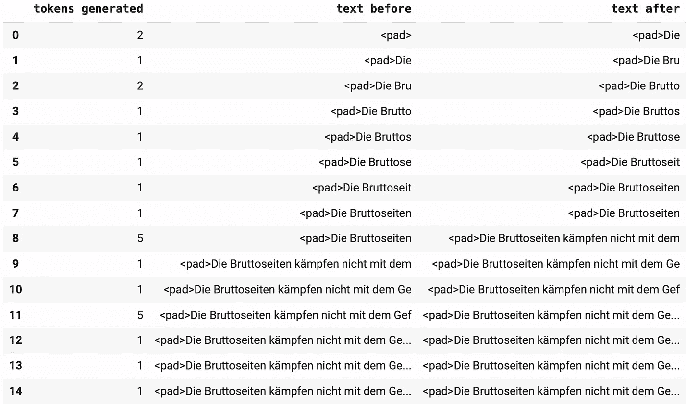

每次猜测性抽样的迭代。

如你所见，使用所选择的任务和模型，大多数迭代并没有产生有用的草稿输出。然而在某些例子中，例如第 8 和第 11，草稿模型允许系统在一次目标模型运行中有效地生成五个标记。这个例子中使用的模型相当小。我想象，当处理更大的模型时，草稿模型会更经常地发挥作用。

# **结论**

就这样。推测性采样是一种极其优雅的方法，可以大幅度加快文本生成速度。我们使用一个小型语言模型快速生成输出，然后（通过利用训练期间掩蔽注意力的一个特性）我们可以使用大型语言模型来几乎免费地对这些工作进行双重检查。我们只保留大型模型认同的生成文本，因此最后得到的输出是相同的，只是更快。

# 关注以获取更多更新！

我描述了 ML 领域的论文和概念，重点是实用和直观的解释。

[](https://medium.com/@danielwarfield1/subscribe?source=post_page-----2daca347dbb9--------------------------------) [## 订阅 Daniel Warfield 的最新邮件

### 订阅 Daniel Warfield 的最新邮件，注册后，如果你还没有 Medium 账户，你将创建一个…

medium.com](https://medium.com/@danielwarfield1/subscribe?source=post_page-----2daca347dbb9--------------------------------) 

从未预期，总是感激。通过捐赠，你使我能够投入更多时间和资源来创作更频繁和更高质量的文章。[了解更多](https://www.buymeacoffee.com/danielwarfield)

**版权声明：** 本文档中的所有图片均由 Daniel Warfield 创建，除非另有说明。你可以将本帖子中的任何图片用于自己的非商业用途，只要你引用了这篇文章，[`danielwarfield.dev`](https://danielwarfield.dev/)，或两者都引用。
