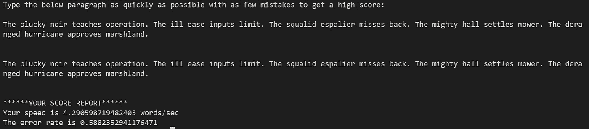

# 使用 Python 的速度打字测试项目

> 原文：[`towardsdatascience.com/speed-typing-test-project-with-python-da1a56987a5b`](https://towardsdatascience.com/speed-typing-test-project-with-python-da1a56987a5b)

## 使用 Python 开发速度打字测试项目以评估准确性和打字速度

[](https://bharath-k1297.medium.com/?source=post_page-----da1a56987a5b--------------------------------)[](https://towardsdatascience.com/?source=post_page-----da1a56987a5b--------------------------------) [Bharath K](https://bharath-k1297.medium.com/?source=post_page-----da1a56987a5b--------------------------------)

·发表于 [Towards Data Science](https://towardsdatascience.com/?source=post_page-----da1a56987a5b--------------------------------) ·阅读时间 8 分钟·2023 年 3 月 22 日

--


图片来源 [Spencer Davis](https://unsplash.com/@spencerdavis?utm_source=medium&utm_medium=referral) 于 [Unsplash](https://unsplash.com/?utm_source=medium&utm_medium=referral)

每个拥有电子设备的个人通常都会在其各自的设备上打字，无论是笔记本电脑、手机还是个人电脑。在现代世界中，通过项目打字是一种更为广泛使用且方便的方法，可以完成各种任务。

就我个人而言，我打字的频率相当高，打字的内容和材料也各不相同。这些内容的范围从在 Medium 上打字的文章、分析和编写数据科学项目，到写重要的邮件，或者只是浏览互联网。虽然写作有助于产生想法和有效思考，但我不能否认我在打字上花费的时间比写作要多。

无论人们是否与我处于同一范围，或者每个人的情况是否不同，保持在打字时的‘A’状态总是一个好主意。在这个项目中，我们将使用 Python 设计一个简单的速度打字测试，以帮助评估你的准确性、错误率和打字速度。

我们将在控制台界面上开发这个项目，并以每秒字数的形式打印错误率和总体得分。对于那些更有好奇心的开发者，我推荐查看使用 Python 开发的高级 GUI 界面，这样可以使项目更具吸引力和美观。我已经在下面提供了相关文章的链接。

[](/advanced-gui-interface-with-python-cb04ef2e29b9?source=post_page-----da1a56987a5b--------------------------------) ## 使用 Python 的高级 GUI 界面

### 使用更现代的 Python 开发接口来开始你的项目

towardsdatascience.com

# 开发速度测试项目：


由[Fiona Murray](https://unsplash.com/es/@fsmurrayphotography?utm_source=medium&utm_medium=referral)拍摄，[Unsplash](https://unsplash.com/?utm_source=medium&utm_medium=referral)

在这部分文章中，我们将开发“速度测试”软件，以报告用户打字的分数和错误率。测试应当进行多次，以获得平均评分，从而准确确定真正的数值。

这个项目有多种不同的方法来处理，我将使用最直接、最简单的方法来实现预期的解决方案。我建议安装下面提供的库来简化这个过程。

> *pip install wonderwords*

你可以通过以下[链接](https://pypi.org/project/wonderwords/)访问官方 pip 安装 Python 包索引网站，了解更多关于该库的信息，或者通过以下快速入门文档[网站](https://wonderwords.readthedocs.io/en/latest/quickstart.html)了解更多内容。为了让自然语言处理任务更易于理解，我建议查看下面链接提供的我之前关于正则表达式操作符的文章。

[](/natural-language-processing-made-simpler-with-4-basic-regular-expression-operators-5002342cbac1?source=post_page-----da1a56987a5b--------------------------------) ## 用 4 种基本正则表达式操作符简化自然语言处理！

### 理解四种基本正则操作来清理几乎任何类型的数据。

towardsdatascience.com

## 导入所需的库：

使用 Python 构建我们的速度测试软件的第一步是导入所有必要的库。我们将使用 wonder words 库导入随机句子类，这将允许我们生成随机句子，供用户进行打字测试。我更喜欢使用这个库作为一种更通用的方法，以便每次需要进行速度测试时随机生成不同的段落。

对于那些希望采用不同方法的开发者，如果不想使用之前提到的库，我们可以使用随机库并自己输入句子和创建列表。随机库中的选择功能对于将各种段落选项随机显示给测试者非常有用。时间库模块对跟踪用户的打字速度至关重要。以下是所有所需库导入的列表。

```py
from wonderwords import RandomSentence
import random
import time
```

## 随机句子生成：

一旦导入了所有必要的库，我们可以继续下一步。我们将创建一个句子列表和一个作为字符串变量的句子段落。然后我们将创建一个 for 循环，通过这个循环我们将使用“wonder words”库中的随机句子模块。一旦将以下类分配给所需的变量，我们可以生成随机句子。

每个随机生成的句子都被附加到一个列表中，然后转换成一个字符串段落，其中所有包含相应句子的段落被一起存储。这些随机生成的段落将展示给用户。展示后，用户可以进行打字测试，以测试适当的速度和错误率。

```py
sent_list = []
sent_para = ""

for i in range(5):
    sent = RandomSentence()
    random_sent = sent.sentence()
    sent_list.append(random_sent)
    sent_para += random_sent +  " "
```

## 错误率计算：

一旦随机段落存储在一个变量中，我们可以继续定义计算测试者打字错误率的下一步。我使用了一种简单的方法来计算错误率，以便于这个项目的简单性。请注意，这可能不是计算错误率的最有效方法。我将在即将到来的部分中涵盖更多的改进和进一步的发展。

在这种方法中，我们计算句子段落的长度，并在此范围内创建一个循环。然后，我们将比较每次输入的原始句子段落与输入的段落。每次字符不匹配时，错误计数会增加。总错误百分比通过将错误计数除以总长度，并乘以 100 来计算。以下是执行该功能的代码片段。

```py
def error_rate(sent_para, typed_para):
    error_count = 0

    length = len(sent_para)

    for character in range(length):
        try: 
            if sent_para[character] != typed_para[character]:
                error_count += 1

        except:
            error_count += 1

    error_percent = error_count/length * 100
    return error_percent
```

## 最终得分和错误百分比：

在这个项目的最后一步，我们将输入一个句子，表示速度测试即将开始，且必须在规定时间内准确打印出适当的段落，以达到最佳分数。开始时间和结束时间会被记录，直到用户输入了相应的段落。总时间通过从结束时间中减去开始时间来计算。错误率通过本文节中之前定义的函数来计算。

我增加了一个创建 if 循环的额外步骤，以测量输入句子的错误百分比。如果错误百分比超过 50，那么计算出的分数可能不准确，可能需要重新测试。如果错误百分比低于 50%，我们可以报告每秒单词数和总单词数。以下是执行速度测试操作的代码块。

```py
print("Type the below paragraph as quickly as possible with as few mistakes to get a high score: \n")
print(sent_para)
print("\n")

start_time = time.time()
typed_para = input()
end_time = time.time()

time_taken = end_time - start_time

error_percent = error_rate(sent_para, typed_para)
print("\n")

if error_percent > 50:
    print(f"Your error rate {error_percent} was quite high and hence your accurate speed could not be computed.")

else:
    speed = len(typed_para)/time_taken
    print("******YOUR SCORE REPORT******")
    print(f"Your speed is {speed} words/sec")
    print(f"The error rate is {error_percent}")
```

速度测试项目现在已完成。读者可以继续进行自己的测试并检查他们的打字速度！然而，对于那些更好奇和感兴趣的开发者，我们将进行一次测试运行。我还会建议一些额外的改进，以使这个项目在即将到来的部分中变得更加有趣和用户友好。

# 测试运行和额外改进：



作者截图

一旦你在各自的控制台中运行程序（我使用的是 Visual Studio Code 编辑器，但也可以使用命令提示符），你应该能够相应地测试工作代码。在上面的截图中，读者可以注意到由 wonder words 库生成的随机句子，原始段落下面是我输入的段落。

一旦我输入所需段落并按下回车键，我们可以相应地查看评分报告。从上面的截图中，我们可以注意到我的单词速度约为每秒 4.3 个单词，错误率为 0.59\。为了获得更精确的测试分数，我建议运行上述程序并取至少五次测试的平均值。

我们在本节中将讨论的另一个重要话题是进一步增强此项目功能和风格方面的不同改进。一些建议如下：

1.  为了更具自定义性地生成句子，使用自己定制的句子和随机选择函数是一个不错的选项。然而，如果读者想更进一步，Open AI 提供了一个用于高级故事集成的绝佳选项。

1.  错误率的计算可能略有偏差，因为一个字符错误可能导致多个故障。更好的方法可能是考虑原始段落和输入段落中的所有单词，然后比较两个列表。

1.  最后的建议是将整个项目转移到 GUI 界面上，因为控制台界面可能显得平淡。我推荐查看我之前关于 GUI 的文章，以快速了解一些在 Python 中可用的值得注意的 GUI 选项的入门代码。

[](/7-best-ui-graphics-tools-for-python-developers-with-starter-codes-2e46c248b47c?source=post_page-----da1a56987a5b--------------------------------) ## Python 开发者的 7 款最佳 UI 图形工具及入门代码

### Python 中开发酷炫用户界面技术的七款最佳 UI 图形工具

towardsdatascience.com

# 结论：


图片来源于 [Paul Kansonkho](https://unsplash.com/@studio_alexander?utm_source=medium&utm_medium=referral) 于 [Unsplash](https://unsplash.com/?utm_source=medium&utm_medium=referral)

> “打字是说话的未来，不要忘记它，是特性的兄弟。”
> 
> — ***Deyth Banger***

打字现在是我们生活中的重要部分，是我们不断进行的必要活动。虽然我们打字的次数很多，而且随着时间的推移变得越来越自然，但人们可能会好奇他们打字的速度和准确度。了解这一点的一个好方法是不断提高打字速度，以提高生产力。

在这个项目中，我们开发了一个用 Python 制作的速度测试软件，使我们能够输入建议的特定段落，并在输入错误百分比低于 50 的段落后，获得我们的打字分数和百分比错误。我们还讨论了可以进一步改进和提升这个项目的其他方法。

如果你希望在我的文章发布后第一时间收到通知，请查看以下[链接](https://bharath-k1297.medium.com/subscribe)来订阅电子邮件推荐。如果你希望支持其他作者和我，请订阅以下链接。

[](https://bharath-k1297.medium.com/membership?source=post_page-----da1a56987a5b--------------------------------) [## 通过我的推荐链接加入 Medium - Bharath K

### 阅读 Bharath K 的每个故事（以及 Medium 上成千上万的其他作家的故事）。你的会员费直接支持…

bharath-k1297.medium.com](https://bharath-k1297.medium.com/membership?source=post_page-----da1a56987a5b--------------------------------)

如果你对本文中提到的各个要点有任何疑问，请随时在下方评论区告诉我。我会尽快回复你。查看一些我的其他文章，看看我的观众们还喜欢阅读什么！

[](/the-ultimate-replacements-to-jupyter-notebooks-51da534b559f?source=post_page-----da1a56987a5b--------------------------------) ## Jupyter Notebooks 的终极替代方案

### 讨论一个优秀的 Jupyter Notebooks 替代方案，用于解释数据科学项目

towardsdatascience.com [](/7-best-research-papers-to-read-to-get-started-with-deep-learning-projects-59e11f7b9c32?source=post_page-----da1a56987a5b--------------------------------) ## 阅读 7 篇最佳研究论文，以开始深度学习项目

### 七篇经得起时间考验的最佳研究论文，将帮助你创建出色的项目

towardsdatascience.com [](/visualizing-cpu-memory-and-gpu-utilities-with-python-8028d859c2b0?source=post_page-----da1a56987a5b--------------------------------) ## 使用 Python 可视化 CPU、内存和 GPU 工具

### 分析 CPU、内存使用情况和 GPU 组件，以监控你的 PC 和深度学习项目

towardsdatascience.com

感谢大家坚持看到最后。我希望你们都喜欢阅读这篇文章。祝你们度过美好的一天！
