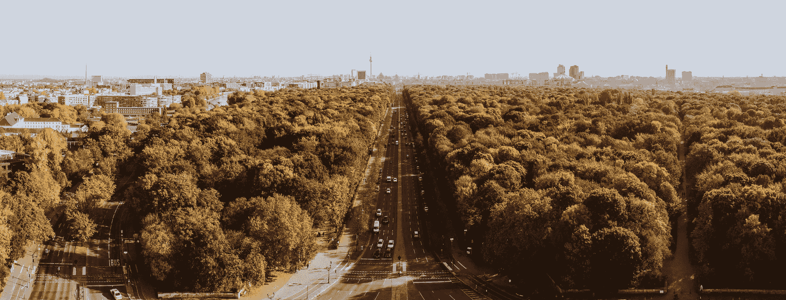
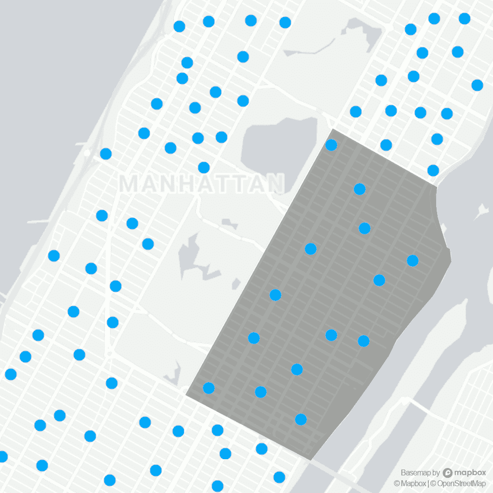
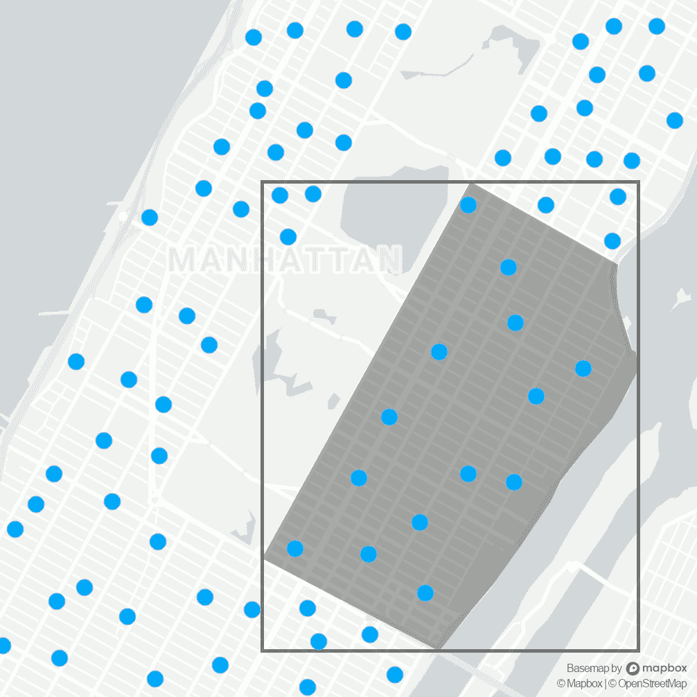
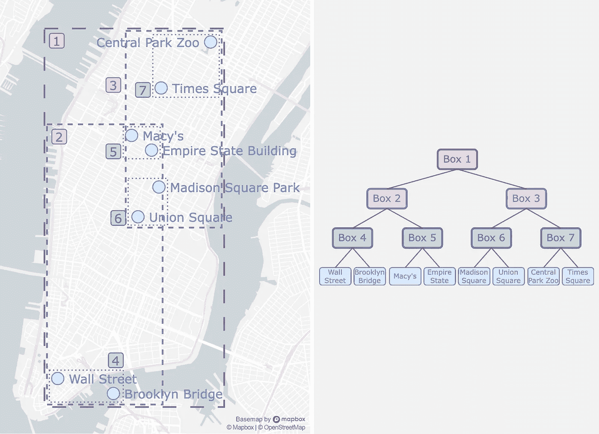
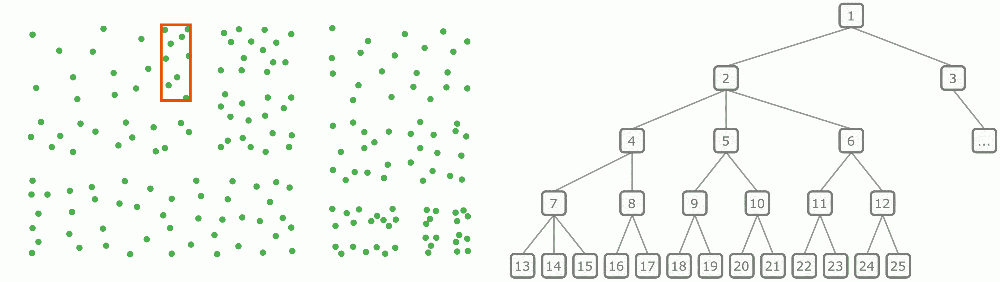
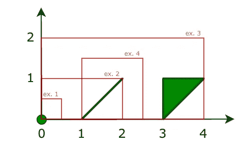
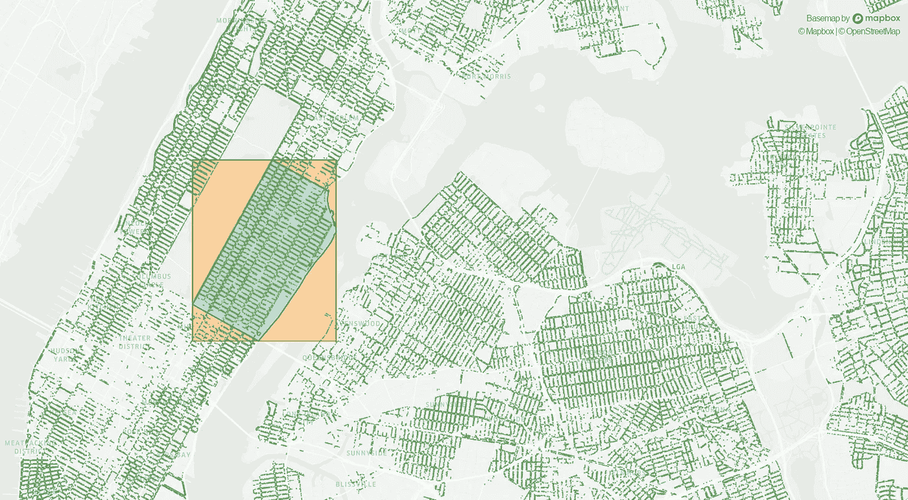

# 使用 R 树加速你的地理空间数据分析

> 原文：[`towardsdatascience.com/speed-up-your-geospatial-data-analysis-with-r-trees-4f75abdc6025?source=collection_archive---------0-----------------------#2023-05-21`](https://towardsdatascience.com/speed-up-your-geospatial-data-analysis-with-r-trees-4f75abdc6025?source=collection_archive---------0-----------------------#2023-05-21)



图片由 [Mathias Arlund](https://unsplash.com/@arlund?utm_source=medium&utm_medium=referral) 提供，来自 [Unsplash](https://unsplash.com/?utm_source=medium&utm_medium=referral)

## 学习如何大幅提升空间搜索的性能

[](https://medium.com/@markushubrich?source=post_page-----4f75abdc6025--------------------------------)[](https://towardsdatascience.com/?source=post_page-----4f75abdc6025--------------------------------) [Markus Hubrich](https://medium.com/@markushubrich?source=post_page-----4f75abdc6025--------------------------------)

·

[关注](https://medium.com/m/signin?actionUrl=https%3A%2F%2Fmedium.com%2F_%2Fsubscribe%2Fuser%2F3b63a2f93113&operation=register&redirect=https%3A%2F%2Ftowardsdatascience.com%2Fspeed-up-your-geospatial-data-analysis-with-r-trees-4f75abdc6025&user=Markus+Hubrich&userId=3b63a2f93113&source=post_page-3b63a2f93113----4f75abdc6025---------------------post_header-----------) 发表在 [Towards Data Science](https://towardsdatascience.com/?source=post_page-----4f75abdc6025--------------------------------) · 8 分钟阅读 · 2023 年 5 月 21 日[](https://medium.com/m/signin?actionUrl=https%3A%2F%2Fmedium.com%2F_%2Fvote%2Ftowards-data-science%2F4f75abdc6025&operation=register&redirect=https%3A%2F%2Ftowardsdatascience.com%2Fspeed-up-your-geospatial-data-analysis-with-r-trees-4f75abdc6025&user=Markus+Hubrich&userId=3b63a2f93113&source=-----4f75abdc6025---------------------clap_footer-----------)

--

[](https://medium.com/m/signin?actionUrl=https%3A%2F%2Fmedium.com%2F_%2Fbookmark%2Fp%2F4f75abdc6025&operation=register&redirect=https%3A%2F%2Ftowardsdatascience.com%2Fspeed-up-your-geospatial-data-analysis-with-r-trees-4f75abdc6025&source=-----4f75abdc6025---------------------bookmark_footer-----------)

几年前，我在做一个副项目。我想创建一个推荐本地珍宝的网页应用，例如咖啡馆、书店或隐秘酒吧。这个想法是将所有这些用户可触及的兴趣点显示在地图上。由于数据集中有成千上万的兴趣点，我必须巧妙地过滤出用户指定范围内的数据点。最简单的方法是计算用户与每个兴趣点之间的距离，并丢弃所有超出指定范围的点。特别是对于像我这样的大数据集，这种方法通常会导致较长的处理时间。

当然，必须有更好的方法，因为响应时间在互动应用程序中非常重要。这时我遇到了数据结构*R-tree*。这些树用于快速的空间访问和搜索。使用 R-tree，我能够快速隔离靠近用户位置的兴趣点，并将其显示在地图上。这大大提升了我的网页应用的响应时间——仅仅**四行额外的代码！**

在这篇文章中，我解释了 R-trees 是什么以及它们是如何工作的。前两部分通过纽约市的街道树示例进行了说明。第三部分展示了如何在 Python 中使用这种数据结构来加速地理空间数据处理例程。

# 通过分析纽约市的树木来学习 R-trees

假设我们被要求分析纽约市的社区与其树木健康之间是否存在相关性。[NYC 开放数据门户](https://opendata.cityofnewyork.us/)提供了一个街道树普查数据集，包括每棵树的物种、直径、健康状况的感知和地理位置。

[](https://data.cityofnewyork.us/Environment/2015-Street-Tree-Census-Tree-Data/pi5s-9p35?source=post_page-----4f75abdc6025--------------------------------) [## 2015 街道树普查 - 树木数据 | NYC 开放数据

### 数据来自 TreesCount! 2015 街道树普查，由志愿者和纽约市公园部组织的工作人员进行…

data.cityofnewyork.us](https://data.cityofnewyork.us/Environment/2015-Street-Tree-Census-Tree-Data/pi5s-9p35?source=post_page-----4f75abdc6025--------------------------------)

首先，我们想统计上东区的街道树数量。下面的伪代码片段遍历数据集`trees`，并检查一棵树是否落在`upper_east_side`边界内：

```py
total_count, tree_count = 0, 0
for tree in trees:
    total_count += 1
    if upper_east_side.contains(tree):
        tree_count += 1print_results(num_tests=total_count, num_trees=tree_count)
**>>>** Total number of trees tested: 683,788
**>>>** Number of trees in Upper East Side: 8,807
```

我们发现上东区大约有 9 千棵树。然而，我们必须测试总共 68 万棵树才能得到这个结果。下方的动画可视化了我们测试那些距离目标社区几英里的树，因此可以很容易地被忽略。但我们如何能排除远离的树木以减少昂贵的计算，从而实现显著的性能提升呢？

我们几乎可以免费获得的一项信息是多边形的边界框（可以通过其节点的最小值和最大值来确定）。此外，测试一个点是否落在矩形内非常简单，只需进行四次比较操作（点必须大于或等于左下角，并且小于或等于右上角）。现在，假设 `bounding_box` 是一个数据集，包含了上东区周围紧密矩形内的所有树木（在下一节中我们将学习如何轻松获得这样的矩形）。考虑到这一点，可以得出：

```py
total_count, tree_count = 0, 0
for tree in bounding_box:
    total_count += 1
    if upper_east_side.contains(tree):
        tree_count += 1print_results(num_tests=total_count, num_trees=tree_count)
**>>>** Total number of trees tested: 10,768
**>>>** Number of trees in Upper East Side: 8,807
```

动画的右侧演示了我们现在仅测试*潜在*候选者。这些是位于多边形附近的树，即落在其边界框内的点。通过忽略远离的树木，我们将测试数量从 684k 减少到 11k —— **降低了 60 倍！** 在下一节中，我们将看到 R-trees 正是利用了这一点。



(**左**) 纽约市的所有树木都经过测试 | (**右**) 仅测试位于上东区边界框内的树木。图像由作者提供，地图数据来自 © [Mapbox](https://www.mapbox.com/about/maps/) 和 © [OpenStreetMap](https://www.openstreetmap.org/copyright)。

# 用于空间搜索的数据结构：R-tree

R-trees 是基于树的数据结构，用于高效地创建空间索引。R-tree 通常用于快速空间查询或加速最近邻搜索 [1]。一个常见的应用场景是存储兴趣点的空间信息（例如餐馆、加油站、街道等）。借助 R-trees，可以快速检索到某位置一定距离内的所有兴趣点。反过来，这些结果可以在地图上或导航系统中显示。

R-tree 的基本思想很简单：树的叶节点保存空间数据，而分支节点对应于包含所有子节点的最小边界框。通过这种结构，R-tree 将空间划分为矩形，随着树的增长这些矩形变得更为精细。以下示例对此进行了说明。



(**左**) R-tree 将曼哈顿划分为多个矩形 | (**右**) 对应的树结构。图像由作者提供，地图数据来自 © [Mapbox](https://www.mapbox.com/about/maps/) 和 © [OpenStreetMap](https://www.openstreetmap.org/copyright)。

R 树被查询以获取一个矩形，即我们想要检索包含在此搜索窗口内的所有数据。请记住，每个非叶节点对应一个包含其所有子节点的边界框。为了执行搜索查询，我们只需沿着树的分支移动，并且沿着与给定矩形相交的路径直到到达叶节点。这些叶节点，因此我们的数据点，包含在搜索矩形内并完成查询。下面的动画演示了我们可以通过忽略不符合搜索条件的整个分支大大减少搜索操作的数量。



(**左侧**) 不与搜索矩形（红色）相交的边界框（黑色）被逐步忽略 | (**右侧**) 搜索查询通过遵循与搜索矩形相交的路径来完成。图片由作者提供。

# Python 中的 R 树

Python 包`Rtree`提供了 R 树数据结构的实现，并提供了许多方便的功能，如最近邻搜索、交集搜索或多维索引。

[## Rtree: Spatial indexing for Python - Rtree 0.9.4 documentation

### Rtree 是 libspatialindex 的 ctypes Python 包装器，为 Python 提供了许多先进的空间索引功能。

[rtree.readthedocs.io](https://rtree.readthedocs.io/en/latest/?source=post_page-----4f75abdc6025--------------------------------)

我们可以方便地使用 Python 的包管理器[pip](https://pip.pypa.io/en/stable/)安装这个包：`pip install Rtree`。

## 基础知识

在处理像点或多边形这样的几何体之前，我们先了解一下`Rtree`包的基本用法。

`index`模块帮助我们构建空间索引。这个索引通过插入我们对象的边界框自动构建起来。边界框通过指定它们的左侧、底部、右侧和顶部坐标来定义。请注意，在执行查询时，我们将边界框与一个*标识符*（在上面的示例中为`0`和`1`）一起插入。该 ID 将帮助我们在执行查询时识别边界框：

该索引被查询以获取给定矩形内的对象，再次由其左侧、底部、右侧和顶部坐标指定。`intersection`方法的结果是在搜索窗口内包含的对象的 ID（示例 1-3）。如果搜索窗口超出我们在索引中的数据范围，结果为空（示例 4）。类似地，我们使用`nearest`方法来找到离给定搜索窗口最近的*k*个对象：

## 处理点、线和多边形

在前面的部分中，我们看到索引是通过插入对象的边界框来构建的。现在，我们希望继续使用点、线和多边形来处理这些对象。包[Shapely](https://pypi.org/project/Shapely/)提供了一种在 Python 中处理这些类型几何体的简单方法：

上面，我们首先创建一个点，一个线和一个多边形。接下来，这些对象的边界框被使用 ID `0`、`1`和`2`插入索引中。我们现在查询不同的搜索窗口：

下面的插图显示了几何图形和搜索窗口：



**绿色：** 点、线和多边形。**红色：** 搜索窗口。图片由作者提供。

## 搜索上东区的所有树木

我们终于具备了提取上东区所有树木所需的一切！我们将通过下面的代码片段进行说明，完整版本可以在[这里](https://gist.github.com/mhubrich/da9b5cf085af7cc207ce101f54fc4b69)找到。



**绿色：** 纽约市的树木。**蓝色：** 上东区。**橙色：** 上东区的边界框。图片由作者提供，地图数据来自© [Mapbox](https://www.mapbox.com/about/maps/)和© [OpenStreetMap](https://www.openstreetmap.org/copyright)。

首先，我们使用[GeoPandas](https://pypi.org/project/geopandas/)包加载所有所需的几何图形：

接下来，我们创建一个包含纽约市所有树木的 R 树索引：

现在，我们生成一个潜在候选项的列表，即所有在上东区边界框内的树木：

最后，我们遍历所有潜在的候选项，提取完全位于上东区内的那些：

# 结论

在这篇文章中，我们了解了 R 树如何通过将底层空间划分为矩形来组织地理信息。这种结构使 R 树在空间查找中极其快速。在我们的纽约市街道树木示例中，使用 R 树将操作次数减少了 60 倍。我们还看到了如何在 Python 中使用 R 树。我们的示例中的加速仅通过四行代码实现：初始化索引（1 行），构建索引（2 行），以及使用`intersection`函数找到附近的候选项（1 行）。

那么，为什么 R 树不是无处不在呢？虽然通过减少搜索操作次数节省了时间，但我们在构建索引时却浪费了时间。后者我们必须实际遍历整个数据集。这使得 R 树不适合只需要少量搜索的应用程序或索引经常变化的应用程序（由于树的重新平衡）。

自 1984 年 Antonin Guttman 发明 R 树以来，它们已经取得了长足的进步。如今，它们被广泛应用于各种领域，例如计算机图形学[2]、视频游戏[3]、交通控制系统[4]，以及最显著的空间数据管理数据库[5]。也许在你下一次的地理空间数据分析中也会用到！

## **参考文献**

[1] A. Guttman，[R-Trees: A Dynamic Index Structure for Spatial Searching](http://www-db.deis.unibo.it/courses/SI-LS/papers/Gut84.pdf)（1984），1984 年 ACM SIGMOD 国际数据管理会议论文集，第 47-57 页

[2] D. Feldmann，[使用 R 树加速光线追踪](https://www.scitepress.org/papers/2015/53048/53048.pdf)（2015），第十届计算机图形学理论与应用国际会议论文集，第 247–257 页

[3] A. Kinziabulatov，[在 Unity 中优化 R 树插入：一个类似 Bomberman 的例子](https://medium.com/my-games-company/optimizing-r-tree-inserts-in-unity-a-bomberman-like-example-81d2576efd75)（2023），Medium

[4] Y. Manolopoulos, A. Nanopoulos, A. Papadopoulos 和 Y. Theodoridis，[R 树：理论与应用](https://link.springer.com/book/10.1007/978-1-84628-293-5)（2006），Springer

[5] S. Bressan, J. Küng 和 R. Wagner，[数据库与专家系统应用](https://link.springer.com/book/10.1007/11827405)（2006），Springer

## **数据集**

纽约市公园与娱乐部，[2015 年街道树木普查——树木数据](https://data.cityofnewyork.us/Environment/2015-Street-Tree-Census-Tree-Data/pi5s-9p35)（2016），纽约市开放数据

纽约市城市规划部，[2010 年社区划分区域（NTAs）](https://data.cityofnewyork.us/City-Government/2010-Neighborhood-Tabulation-Areas-NTAs-/cpf4-rkhq)（2013），纽约市开放数据
