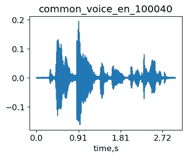
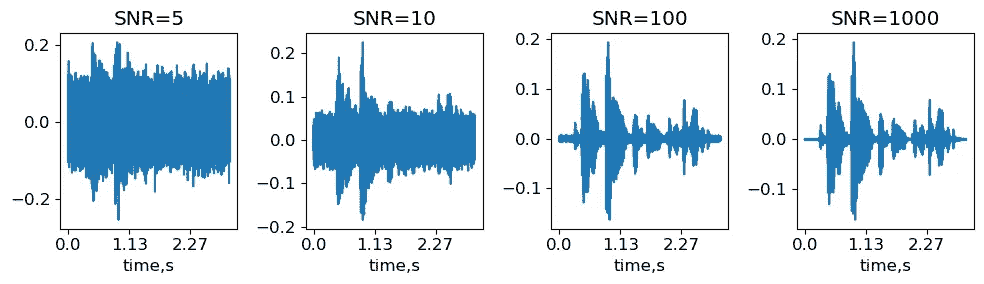
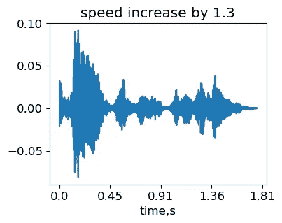
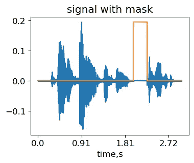
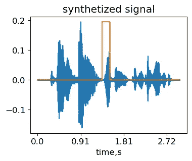
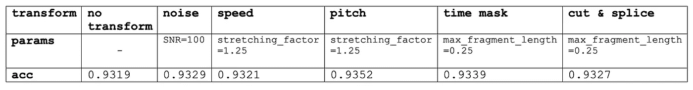

# 在 Mozilla Common Voice 上的口语语言识别——音频变换。

> 原文：[`towardsdatascience.com/spoken-language-recognition-on-mozilla-common-voice-audio-transformations-24d5ceaa832b?source=collection_archive---------1-----------------------#2023-08-13`](https://towardsdatascience.com/spoken-language-recognition-on-mozilla-common-voice-audio-transformations-24d5ceaa832b?source=collection_archive---------1-----------------------#2023-08-13)

[](https://medium.com/@sergeyvilov?source=post_page-----24d5ceaa832b--------------------------------)[](https://towardsdatascience.com/?source=post_page-----24d5ceaa832b--------------------------------) [Sergey Vilov](https://medium.com/@sergeyvilov?source=post_page-----24d5ceaa832b--------------------------------)

·

[关注](https://medium.com/m/signin?actionUrl=https%3A%2F%2Fmedium.com%2F_%2Fsubscribe%2Fuser%2F33297faf768d&operation=register&redirect=https%3A%2F%2Ftowardsdatascience.com%2Fspoken-language-recognition-on-mozilla-common-voice-audio-transformations-24d5ceaa832b&user=Sergey+Vilov&userId=33297faf768d&source=post_page-33297faf768d----24d5ceaa832b---------------------post_header-----------) 发表于 [Towards Data Science](https://towardsdatascience.com/?source=post_page-----24d5ceaa832b--------------------------------) ·5 min read·2023 年 8 月 13 日[](https://medium.com/m/signin?actionUrl=https%3A%2F%2Fmedium.com%2F_%2Fvote%2Ftowards-data-science%2F24d5ceaa832b&operation=register&redirect=https%3A%2F%2Ftowardsdatascience.com%2Fspoken-language-recognition-on-mozilla-common-voice-audio-transformations-24d5ceaa832b&user=Sergey+Vilov&userId=33297faf768d&source=-----24d5ceaa832b---------------------clap_footer-----------)

--

[](https://medium.com/m/signin?actionUrl=https%3A%2F%2Fmedium.com%2F_%2Fbookmark%2Fp%2F24d5ceaa832b&operation=register&redirect=https%3A%2F%2Ftowardsdatascience.com%2Fspoken-language-recognition-on-mozilla-common-voice-audio-transformations-24d5ceaa832b&source=-----24d5ceaa832b---------------------bookmark_footer-----------)

图片由 [Kelly Sikkema](https://unsplash.com/@kellysikkema?utm_source=medium&utm_medium=referral) 提供，来源于 [Unsplash](https://unsplash.com/?utm_source=medium&utm_medium=referral)

这是基于 [Mozilla Common Voice](https://commonvoice.mozilla.org/en) 数据集的第三篇关于语音语言识别的文章。在 第一部分，我们讨论了数据选择和数据预处理，在 第二部分 中我们分析了几种神经网络分类器的性能。

最终模型达到了 92% 的准确率和 97% 的配对准确率。由于此模型存在较高的方差，通过添加更多数据可能会提高准确率。获取额外数据的一种非常常见的方法是通过对现有数据集执行各种变换来合成数据。

在本文中，我们将考虑 5 种流行的音频数据增强变换：添加噪声、改变速度、改变音调、时间掩蔽和剪切 & 拼接。

**教程笔记本可以在** [**这里**](https://github.com/sergeyvilov/ML-tutorials/blob/main/audio_transforms/audio_transforms.ipynb) **找到**。

为了说明，我们将使用来自 [Mozilla Common Voice](https://commonvoice.mozilla.org/)（MCV）数据集的样本 *common_voice_en_100040*。这是句子 *The burning fire had been extinguished*。

```py
import librosa as lr
import IPython

signal, sr = lr.load('./transformed/common_voice_en_100040.wav', res_type='kaiser_fast') #load signal

IPython.display.Audio(signal, rate=sr)
```

原始样本 *common_voice_en_100040 来自 MCV*。



原始信号波形（作者提供的图像）

# 添加噪声

添加噪声是最简单的音频增强方法。噪声量由信噪比（SNR）来表征——即最大信号幅度与噪声标准差的比率。我们将生成几个定义为 SNR 的噪声水平，并查看它们如何改变信号。

```py
SNRs = (5,10,100,1000) #Signal-to-noise ratio: max amplitude over noise std

noisy_signal = {}

for snr in SNRs:

    noise_std = max(abs(signal))/snr #get noise std
    noise =  noise_std*np.random.randn(len(signal),) #generate noise with given std

    noisy_signal[snr] = signal+noise

IPython.display.display(IPython.display.Audio(noisy_signal[5], rate=sr))
IPython.display.display(IPython.display.Audio(noisy_signal[1000], rate=sr))
```

通过将噪声 SNR=5 和 SNR=1000 叠加到原始 MCV 样本 common_voice_en_100040 上获取的信号。



几种噪声水平的信号波形（作者提供的图像）

因此，SNR=1000 听起来几乎像未受干扰的音频，而在 SNR=5 时只能区分信号的最强部分。在实践中，SNR 级别是一个超参数，取决于数据集和选择的分类器。

# 改变速度

改变速度的最简单方法就是假装信号有不同的采样率。然而，这也会改变音调（声音的频率高低）。增加采样率会使声音听起来更高。为了说明这一点，我们将对我们的示例“增加”采样率 1.5 倍：

```py
IPython.display.Audio(signal, rate=sr*1.5)
```

使用虚假采样率获取的信号用于原始 MCV 样本 common_voice_en_100040（作者生成）。

改变速度而不影响音高更具挑战性。需要使用[相位声码器](https://en.wikipedia.org/wiki/Phase_vocoder)(PV)算法。简言之，输入信号首先被分割成重叠的帧。然后，通过应用快速傅里叶变换（FFT）计算每帧内的频谱。播放速度通过以不同的速率重新合成帧来修改。由于每帧的频率内容未受影响，因此音高保持不变。PV 在帧之间进行插值，并使用相位信息实现平滑。

对于我们的实验，我们将使用来自[这个](https://github.com/gaganbahga/time_stretch)PV 实现的*stretch_wo_loop*时间伸缩函数。

```py
stretching_factor = 1.3

signal_stretched = stretch_wo_loop(signal, stretching_factor)
IPython.display.Audio(signal_stretched, rate=sr)
```

通过改变原始 MCV 样本 common_voice_en_100040 的速度获得的信号（由作者生成）。



速度增加后的信号波形（图片由作者提供）

因为我们增加了速度，所以信号的持续时间减少了。然而，可以听到音高没有变化。请注意，当伸缩因子很大时，帧间的相位插值可能效果不好。因此，变换后的音频可能会出现回声伪影。

# 改变音高

要在不改变速度的情况下改变音高，我们可以使用相同的 PV 时间伸缩，但假装信号具有不同的采样率，以使信号的总持续时间保持不变：

```py
IPython.display.Audio(signal_stretched, rate=sr/stretching_factor)
```

通过改变原始 MCV 样本 common_voice_en_100040 的音高获得的信号（由作者生成）。

为什么我们还要使用这个 PV，而[*librosa*](https://librosa.org/)已经有*time_stretch*和*pitch_shift*函数？这些函数会将信号变换回时间域。当你需要后续计算嵌入时，你将浪费时间在冗余的傅里叶变换上。另一方面，很容易修改*stretch_wo_loop*函数，使其产生傅里叶输出而不进行逆变换。也可以尝试深入*librosa*代码以获得类似的结果。

# 时间掩蔽和切割&拼接

这两种变换最初在*频率*域中提出（[Park 等，2019](https://www.isca-speech.org/archive_v0/Interspeech_2019/pdfs/2680.pdf)）。其想法是通过使用预计算的频谱进行音频增强以节省 FFT 的时间。为了简单起见，我们将演示这些变换如何在*时间*域中工作。所列操作可以通过用帧索引替换时间轴轻松转移到频率域。

## 时间掩蔽

时间掩蔽的想法是遮盖信号中的随机区域。神经网络将更少地学习到无法泛化的信号特定时间变化。

```py
max_mask_length = 0.3 #maximum mask duration, proportion of signal length

L = len(signal)

mask_length = int(L*np.random.rand()*max_mask_length) #randomly choose mask length
mask_start = int((L-mask_length)*np.random.rand()) #randomly choose mask position

masked_signal = signal.copy()
masked_signal[mask_start:mask_start+mask_length] = 0

IPython.display.Audio(masked_signal, rate=sr)
```

通过对原始 MCV 样本 common_voice_en_100040 应用时间掩蔽变换获得的信号（由作者生成）。



时间掩蔽后的信号波形（掩蔽区域用橙色标示）（图片由作者提供）

## Cut & splice

这个想法是用另一个具有相同标签的信号的随机片段替换信号的随机选定区域。实现几乎与时间掩蔽相同，只是用另一个信号的片段代替了掩蔽。

```py
other_signal, sr = lr.load('./common_voice_en_100038.wav', res_type='kaiser_fast') #load second signal

max_fragment_length = 0.3 #maximum fragment duration, proportion of signal length

L = min(len(signal), len(other_signal))

mask_length = int(L*np.random.rand()*max_fragment_length) #randomly choose mask length
mask_start = int((L-mask_length)*np.random.rand()) #randomly choose mask position

synth_signal = signal.copy()
synth_signal[mask_start:mask_start+mask_length] = other_signal[mask_start:mask_start+mask_length]

IPython.display.Audio(synth_signal, rate=sr)
```

通过对原始 MCV 样本 common_voice_en_100040（由作者生成）应用 cut&splice 变换得到的合成信号。



cut&splice 变换后的信号波形（从其他信号中插入的片段用橙色标示）（图片由作者提供）

下表显示了 AttNN 模型在验证集上对每个变换的准确率及其典型参数值：



Mozilla Common Voice 数据集上每个变换的 AttNN 准确率及其典型参数（图片由作者提供）。

如所见，这些变换没有显著改变我们基于 MCV 的语音识别系统的准确性。然而，这些变换有可能在某些其他数据集上提升性能。最后，在寻找最佳超参数时，逐个尝试这些变换而不是随机/网格搜索是有意义的。之后，可以将有效的变换结合在一起。
