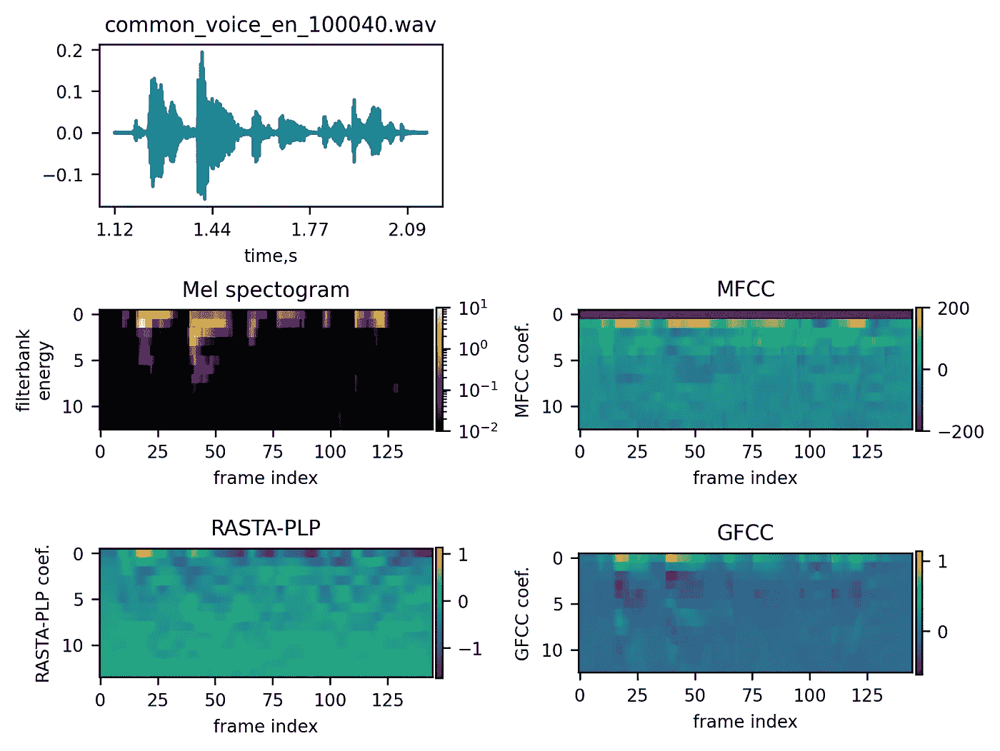

# Mozilla Common Voice 上的口语语言识别——第一部分。

> 原文：[`towardsdatascience.com/spoken-language-recognition-on-mozilla-common-voice-part-i-3f5400bbbcd8?source=collection_archive---------9-----------------------#2023-08-02`](https://towardsdatascience.com/spoken-language-recognition-on-mozilla-common-voice-part-i-3f5400bbbcd8?source=collection_archive---------9-----------------------#2023-08-02)

[](https://medium.com/@sergeyvilov?source=post_page-----3f5400bbbcd8--------------------------------)[](https://towardsdatascience.com/?source=post_page-----3f5400bbbcd8--------------------------------) [Sergey Vilov](https://medium.com/@sergeyvilov?source=post_page-----3f5400bbbcd8--------------------------------)

·

[关注](https://medium.com/m/signin?actionUrl=https%3A%2F%2Fmedium.com%2F_%2Fsubscribe%2Fuser%2F33297faf768d&operation=register&redirect=https%3A%2F%2Ftowardsdatascience.com%2Fspoken-language-recognition-on-mozilla-common-voice-part-i-3f5400bbbcd8&user=Sergey+Vilov&userId=33297faf768d&source=post_page-33297faf768d----3f5400bbbcd8---------------------post_header-----------) 发表在 [Towards Data Science](https://towardsdatascience.com/?source=post_page-----3f5400bbbcd8--------------------------------) ·6 min read·2023 年 8 月 2 日[](https://medium.com/m/signin?actionUrl=https%3A%2F%2Fmedium.com%2F_%2Fvote%2Ftowards-data-science%2F3f5400bbbcd8&operation=register&redirect=https%3A%2F%2Ftowardsdatascience.com%2Fspoken-language-recognition-on-mozilla-common-voice-part-i-3f5400bbbcd8&user=Sergey+Vilov&userId=33297faf768d&source=-----3f5400bbbcd8---------------------clap_footer-----------)

--

[](https://medium.com/m/signin?actionUrl=https%3A%2F%2Fmedium.com%2F_%2Fbookmark%2Fp%2F3f5400bbbcd8&operation=register&redirect=https%3A%2F%2Ftowardsdatascience.com%2Fspoken-language-recognition-on-mozilla-common-voice-part-i-3f5400bbbcd8&source=-----3f5400bbbcd8---------------------bookmark_footer-----------)

图片由 [Sebastian Unrau](https://unsplash.com/@sebastian_unrau?utm_source=medium&utm_medium=referral) 在 [Unsplash](https://unsplash.com/?utm_source=medium&utm_medium=referral) 提供

其中一个最具挑战性的人工智能任务是识别说话者的语言，以便进行后续的语音转文字转换。例如，当同一家人中讲不同语言的人使用同一个语音控制设备，如车库锁或智能家居系统时，这个问题可能会出现。

在这一系列文章中，我们将尝试通过使用[Mozilla Common Voice](https://commonvoice.mozilla.org/en)（MCV）数据集来最大化口语语言识别的准确性。特别是，我们将比较几种神经网络模型，这些模型被训练用来区分德语、英语、西班牙语、法语和俄语。

在第一部分中，我们将讨论数据选择、预处理和嵌入。

# **数据选择**

MCV 迄今为止是最大的公开语音数据集，包括多达 112 种语言的短录音（平均时长 = 5.3 秒）。

对于我们的语言识别任务，我们选择了 5 种语言：德语、英语、西班牙语、法语和俄语。对于德语、英语、西班牙语和法语，我们仅考虑 MCV 中标注的口音，即*Deutschland Deutsch*、*United States English*、*España*和*Français de France*。对于每种语言，我们从[验证过的](https://github.com/common-voice/cv-dataset)样本中选择一部分成人记录。

我们使用了 40K/5K/5K 的训练/验证/测试划分。为了获得客观评价，我们确保三组之间的说话者（*client_id*）不重叠。在数据拆分时，我们首先将测试和验证集填充来自表现不佳的说话者的记录，然后将剩余的数据分配到训练集中。这提高了验证/测试集中说话者的多样性，并导致了对泛化误差的更客观估计。为了避免单一说话者在训练集中占主导地位，我们将每个*client_id*的记录最大数量限制为 2000 个。平均来说，我们得到了每个说话者 26 个记录。我们还确保女性记录的数量与男性记录的数量匹配。最后，如果最终记录数量低于 40K，我们对训练集进行了上采样。最终的记录分布如下面的图所示。


训练集中的类别分布（图像由作者提供）。

带有指示拆分的最终数据框架可以在[这里](https://github.com/sergeyvilov/MCV-spoken-language-recognition/tree/master)找到。

# **数据预处理**

所有 MCV 音频文件都以.mp3 格式提供。虽然.mp3 非常适合音乐的紧凑存储，但它在音频处理库（如 python 中的 librosa）中支持有限。因此，我们首先需要将所有文件转换为.wav 格式。此外，原始 MCV 采样率为 44kHz。这意味着最大编码频率为 22kHz（根据[奈奎斯特定理](https://en.wikipedia.org/wiki/Nyquist%E2%80%93Shannon_sampling_theorem)）。对于口语语言识别任务来说，这样的频率有些过高：例如，在英语中，大多数音素在会话语音中不会超过 3kHz。因此，我们也可以将采样率降低到 16kHz。这不仅会减少文件大小，还会加快嵌入生成的速度。

这两个操作可以通过[ffmpeg](https://github.com/FFmpeg/FFmpeg)的一条命令来执行：

```py
ffmpeg -y -nostdin -hide_banner -loglevel error -i $input_file.mp3 -ar 16000 $output_file.wav
```

# **特征工程**

相关信息通常通过计算嵌入从音频片段中提取。我们将考虑四种或多或少常见的用于语音识别/口语语言识别任务的嵌入：梅尔频谱图、MFCC、RASTA-PLP 和 GFCC。

## **梅尔频谱图**

梅尔频谱图的原理已广泛讨论 [在 Medium](https://medium.com/analytics-vidhya/understanding-the-mel-spectrogram-fca2afa2ce53)上。关于梅尔频谱图和 MFCC 的精彩逐步教程也可以在[此处](http://practicalcryptography.com/miscellaneous/machine-learning/guide-mel-frequency-cepstral-coefficients-mfccs/#eqn2)找到。

为了获得梅尔频谱图，首先对输入信号进行预加重滤波。然后，对滑动窗口应用于获得的波形进行连续的傅里叶变换。之后，频率尺度被转换为梅尔尺度，这与人类对间隔的感知是线性的。最后，应用一组重叠的三角滤波器的[滤波器组](https://jonathan-hui.medium.com/speech-recognition-feature-extraction-mfcc-plp-5455f5a69dd9)到梅尔尺度上的功率谱，以模拟人耳对声音的感知。

## **MFCC**

梅尔系数高度相关，这可能对一些机器学习算法不利（例如，高斯混合模型更方便使用对角协方差矩阵）。 [去相关](https://dsp.stackexchange.com/questions/15938/is-this-a-correct-interpretation-of-the-dct-step-in-mfcc-calculation/15945#15945)梅尔滤波器组，梅尔频率倒谱系数（MFCC）通过对对数滤波器组能量进行离散余弦变换（DCT）获得。通常只使用前几个 MFCC。确切步骤详见[此处](https://haythamfayek.com/2016/04/21/speech-processing-for-machine-learning.html)。

## **RASTA-PLP**

知觉线性预测（PLP）（Hermansky 和 Hynek，1990）是计算音乐片段嵌入的另一种方法。

PLP 和 MFCC 之间的差异在于滤波器组、等响预加重、强度到响度的转换以及线性预测的应用（Hönig 等，2005）。


PLP 和 MFCC 技术概述（来自 Hönig 等，2005）

有报告称，PLP（Woodland 等，1996）在训练和测试数据之间存在声学不匹配时，比 MFCC 更具鲁棒性。

与 PLP 相比，RASTA-PLP（Hermansky 等，1991）在对数频谱域中执行额外的滤波，这使得该方法对通信通道引入的线性频谱失真更为鲁棒。

## **GFCC**

有报告称，伽玛音调频谱系数（GFCC）比 MFCC 对噪声的敏感性更低（Zhao，2012；Shao，2007）。与 MFCC 相比，伽玛音调滤波器是在等效矩形带宽尺度上计算的（而不是梅尔尺度），并且在计算 DCT 之前应用了立方根操作（而不是对数）。

下图显示了一个示例信号及其不同的嵌入：



示例音频文件及其嵌入（图片由作者提供）。

**比较嵌入**

为了选择最有效的嵌入，我们训练了 De Andrade 等人（2018 年）提出的注意力 LSTM 网络。由于时间原因，我们只训练了 5000 个剪辑。

下图比较了所有嵌入的验证准确性。


不同嵌入在 5000 个数据集上的表现（图片由作者提供）。

因此，前 13 个滤波器组的 mel 频谱图的表现接近于*model_order*=13 的 RASTA-PLP。

值得注意的是，mel 频谱图的表现优于 MFCC。这符合之前的说法（见[这里](https://haythamfayek.com/2016/04/21/speech-processing-for-machine-learning.html)，以及[这里](https://stackoverflow.com/questions/60439741/why-do-mel-filterbank-energies-outperform-mfccs-for-speech-commands-recognition)），即 mel 频谱图是神经网络分类器的更好选择。

另一个观察是，通常系数数量越多，性能会下降。这可能是由于过拟合，因为高阶系数通常[代表](https://jonathan-hui.medium.com/speech-recognition-feature-extraction-mfcc-plp-5455f5a69dd9)与说话者相关的特征，这些特征在测试集中（不同说话者被选择）不可泛化。

由于时间限制，我们没有测试任何嵌入组合，尽管之前有[观察](https://from-mfccs-xor-gfccs-to-mfccs-and-gfccs-urban-sounds-classification-case-study-a087ac007901)到它们可能提供更好的准确性。

由于 mel 频谱图的计算速度远快于 RASTA-PLP，我们将在进一步的实验中使用这些嵌入。

**在第二部分，我们将运行几个神经网络模型，并选择分类效果最佳的模型。**

**参考文献**

+   De Andrade, Douglas Coimbra, 等. “用于语音命令识别的神经注意力模型。” *arXiv 预印本 arXiv:1808.08929*（2018 年）。

+   Hermansky, Hynek. “语音的感知线性预测（PLP）分析。” *美国声学学会期刊* 87.4（1990 年）：1738–1752。

+   Hönig, Florian, 等. “修订感知线性预测（PLP）。” *第九届欧洲语音通信与技术会议*。2005 年。

+   Hermansky, Hynek, 等. “RASTA-PLP 语音分析。” *IEEE 国际声学、语音与信号处理会议论文集*。第 1 卷。1991 年。

+   Shao, Yang, Soundararajan Srinivasan, 和 DeLiang Wang. “在鲁棒说话人识别中引入听觉特征不确定性。” *2007 年 IEEE 国际声学、语音与信号处理会议-ICASSP’07*。第 4 卷。IEEE，2007 年。

+   Woodland, Philip C., Mark John Francis Gales, 和 David Pye. “在大词汇量语音识别中提高环境鲁棒性。” *1996 IEEE 国际声学、语音与信号处理会议论文集*。第 1 卷\. IEEE, 1996.

+   Zhao, Xiaojia, Yang Shao, 和 DeLiang Wang. “基于 CASA 的鲁棒说话人识别。” *IEEE 音频、语音与语言处理汇刊* 20.5 (2012): 1608–1616.
