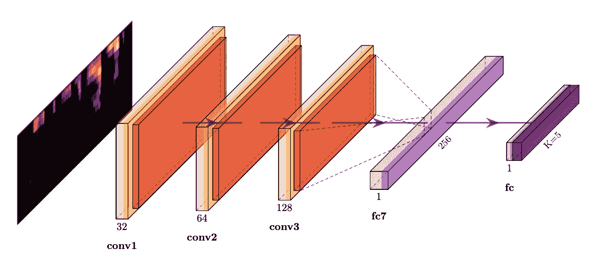
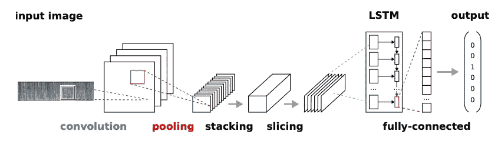
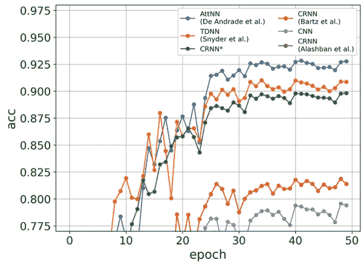
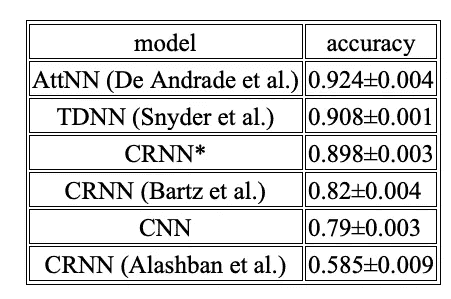
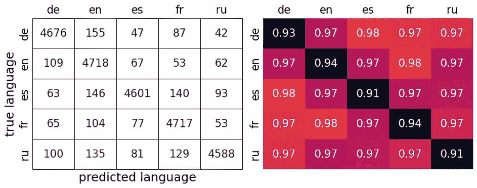
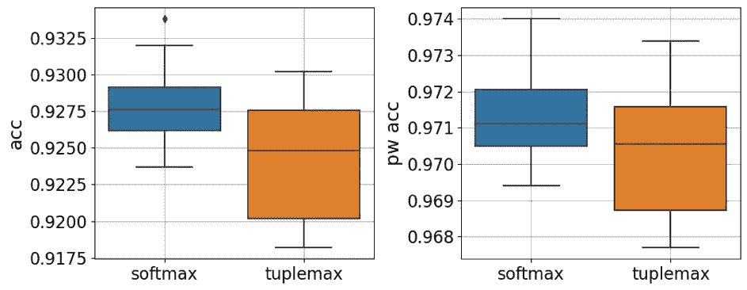
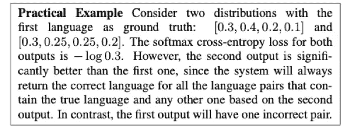

# 在 Mozilla Common Voice 上的语音语言识别 — 第二部分：模型。

> 原文：[`towardsdatascience.com/spoken-language-recognition-on-mozilla-common-voice-part-ii-models-b32780ea1ee4?source=collection_archive---------6-----------------------#2023-08-06`](https://towardsdatascience.com/spoken-language-recognition-on-mozilla-common-voice-part-ii-models-b32780ea1ee4?source=collection_archive---------6-----------------------#2023-08-06)

 [Sergey Vilov](https://medium.com/@sergeyvilov?source=post_page-----b32780ea1ee4--------------------------------)

·

[关注](https://medium.com/m/signin?actionUrl=https%3A%2F%2Fmedium.com%2F_%2Fsubscribe%2Fuser%2F33297faf768d&operation=register&redirect=https%3A%2F%2Ftowardsdatascience.com%2Fspoken-language-recognition-on-mozilla-common-voice-part-ii-models-b32780ea1ee4&user=Sergey+Vilov&userId=33297faf768d&source=post_page-33297faf768d----b32780ea1ee4---------------------post_header-----------) 发布于 [Towards Data Science](https://towardsdatascience.com/?source=post_page-----b32780ea1ee4--------------------------------) · 7 分钟阅读 · 2023 年 8 月 6 日

--

图片由 [Jonathan Velasquez](https://unsplash.com/@jonathanvez?utm_source=medium&utm_medium=referral) 提供，来源于 [Unsplash](https://unsplash.com/?utm_source=medium&utm_medium=referral)

这是基于 [Mozilla Common Voice](https://commonvoice.mozilla.org/) 数据集的语音语言识别系列文章的第二篇。在 [第一部分](https://medium.com/towards-data-science/spoken-language-recognition-on-mozilla-common-voice-part-i-3f5400bbbcd8) 中，我们讨论了数据选择并选择了最佳嵌入。现在让我们训练几个模型并选择最佳模型。

# **模型比较**

我们现在将对以下模型在完整数据（40K 样本，请参见[第一部分](https://medium.com/towards-data-science/spoken-language-recognition-on-mozilla-common-voice-part-i-3f5400bbbcd8)获取更多数据选择和预处理信息）上进行训练和评估：

· 卷积神经网络（CNN）模型。我们简单地将语言分类问题视为 2 维图像的分类。基于 CNN 的分类器在语言识别 TopCoder 比赛中[显示](https://github.com/pietz/language-recognition)了有希望的结果。

CNN 架构（图像由作者提供，使用[PlotNeuralNet](https://github.com/HarisIqbal88/PlotNeuralNet)创建）

· 来自 Bartz 等人 2017 的 CRNN 模型。CRNN 结合了 CNN 的描述能力和 RNN 捕捉时间特征的能力。

CRNN 架构（图像来自 Bartz 等，2017）

· 来自 Alashban 等人 2022 的 CRNN 模型。这只是 CRNN 架构的另一个变体。

· AttNN：来自 De Andrade 等人 2018 的模型。该模型最初用于语音识别，后来在智能博物馆项目中[应用](https://github.com/zkmkarlsruhe/language-identification/tree/main)于口语语言识别。除了卷积和 LSTM 单元，该模型还有一个后续的注意力块，经过训练以根据其分类相关性对输入序列的部分（即计算傅里叶变换的帧）进行加权。

· CRNN* 模型：与 AttNN 相同的架构，但没有注意力块。

· 时间延迟神经网络（TDNN）模型。我们在这里测试的模型用于生成 Snyder 等人 2018 的口语语言识别的 X-vector 嵌入。在我们的研究中，我们绕过 X-vector 生成，直接训练网络来分类语言。

所有模型均基于相同的训练/验证/测试拆分和相同的梅尔谱图嵌入（前 13 个梅尔滤波器组系数）进行训练。模型可以在[这里](https://github.com/sergeyvilov/MCV-spoken-language-recognition/tree/master)找到。

验证集上的学习曲线如下图所示（每个“epoch”指的是数据集的 1/8）。

各种模型在 Mozilla Common Voice 数据集上的表现（图像由作者提供）。

下表显示了基于 10 次运行的准确率的均值和标准差。

每个模型的准确性（图像由作者提供）

可以清楚地看到，AttNN、TDNN 和我们的 CRNN* 模型表现相似，其中 AttNN 以 92.4% 的准确率排名第一。另一方面，CRNN（Bartz 等人 2017）、CNN 和 CRNN（Alashban 等人 2022）表现相当逊色，CRNN（Alashban 等人 2022）以仅 58.5% 的准确率位列末尾。

然后我们在训练和验证集上训练了获胜的 AttNN 模型，并在测试集上进行了评估。92.4%的测试准确率（男性 92.4%，女性 92.3%）与验证准确率接近，这表明模型没有在验证集上过拟合。

为了理解评估模型之间的性能差异，我们首先注意到，TDNN 和 AttNN 是专门为语音识别任务设计的，并已针对先前的基准进行了测试。这可能是这些模型表现优异的原因。

AttNN 模型与我们的 CRNN 模型（相同架构但没有注意力块）之间的性能差距证明了注意力机制在口语语言识别中的相关性。接下来的 CRNN 模型（Bartz et al. 2017）尽管架构类似，但表现较差。这可能只是因为默认的模型超参数不适合 MCV 数据集。

CNN 模型不具有特定的记忆机制，紧随其后。严格来说，CNN 有某种记忆的概念，因为计算卷积涉及固定数量的连续帧。因此，由于 CNN 的层次结构，较高层会封装更长时间间隔的信息。实际上，得分第二的 TDNN 模型，可以视为 1-D CNN。因此，如果在 CNN 架构搜索上投入更多时间，CNN 模型的表现可能会接近 TDNN。

Alashban 等人 2022 年的 CRNN 模型意外地显示出最差的准确率。有趣的是，该模型最初设计用于在 MCV 中识别语言，并显示出约 97%的准确率，如原始研究所报告。由于原始代码未公开，因此很难确定这种巨大差异的来源。

# **成对准确率**

在许多情况下，用户通常使用不超过 2 种语言。在这种情况下，更合适的模型性能指标是成对准确率，它仅仅是计算在给定语言对上的准确率，忽略所有其他语言的得分。

测试集中 AttNN 模型的成对准确率如下面的表格所示，混淆矩阵旁边，个别语言的召回率在对角线上。平均成对准确率为 97%。成对准确率总是高于准确率，因为只需要区分 2 种语言。

混淆矩阵（左）和 AttNN 模型的成对准确率（右）（图像由作者提供）。

因此，该模型在德语（de）和西班牙语（es）以及法语（fr）和英语（en）之间的区分能力最佳（98%）。这并不令人惊讶，因为这些语言的语音系统差异很大。

尽管我们使用了 softmax 损失来训练模型，但之前有报道指出，使用[tuplemax 损失](https://arxiv.org/abs/1811.12290)（Wan et al. 2019）在成对分类中可能获得更高的准确率。

为了研究 tuplemax 损失的影响，我们在 PyTorch 中实现了 tuplemax 损失，并重新训练了我们的模型（详见[这里](https://github.com/sergeyvilov/MCV-spoken-language-recognition/blob/master/tuplemax_loss.py)）。下图比较了在验证集上评估时 softmax 损失和 tuplemax 损失对准确率和成对准确率的影响。

使用 softmax 和 tuplemax 损失计算的 AttNN 模型的准确率和成对准确率（作者提供的图片）。

可以观察到，当比较整体准确率（成对 t 检验 p 值=0.002）或成对准确率时，tuplemax 损失的表现更差（成对 t 检验 p 值=0.2）。

实际上，即使原始研究也未能清楚地解释为何 tuplemax 损失应该表现更好。以下是作者提出的例子：

tuplemax 损失的解释（来自于 Wan 等人，2019 年的图片）

损失的绝对值实际上并不意味着太多。通过足够的训练迭代，这个例子可能会用一个或另一个损失函数正确分类。

无论如何，tuplemax 损失并非一种通用解决方案，损失函数的选择应该针对每个特定的问题进行谨慎利用。

# **结论**

我们在 Mozilla Common Voice（MCV）数据集的短音频剪辑中实现了 92%的准确率和 97%的成对准确率，涉及德语、英语、西班牙语、法语和俄语。

在初步研究中，比较了 mel 频谱图、MFCC、RASTA-PLP 和 GFCC 嵌入，我们发现带有前 13 个滤波器组分的 mel 频谱图具有最高的识别准确率。

接下来，我们比较了 5 个神经网络模型的泛化性能：CNN、CRNN（Bartz 等人，2017）、CRNN（Alashban 等人，2022）、AttNN（De Andrade 等人，2018）、CRNN*和 TDNN（Snyder 等人，2018）。在所有模型中，AttNN 展示了最佳性能，突显了 LSTM 和注意力模块在语音语言识别中的重要性。

最后，我们计算了成对准确率并研究了 tuplemax 损失的影响。结果表明，与 softmax 相比，tuplemax 损失同时降低了准确率和成对准确率。

总之，我们的结果为 Mozilla Common Voice 数据集上的语音语言识别建立了新的基准。通过结合不同的嵌入和广泛探索有前景的神经网络架构，例如变压器，未来研究可以取得更好的结果。

**在第三部分中，我们将讨论哪些音频转换可能有助于提高模型性能。**

# **参考文献**

+   Alashban, Adal A., 等人。"使用卷积递归神经网络进行语音识别系统。" *应用科学* 12.18 (2022): 9181。

+   Bartz, Christian 等人。“使用深度卷积递归神经网络进行语言识别。” *Neural Information Processing: 24th International Conference, ICONIP 2017, Guangzhou, China, November 14–18, 2017, Proceedings, Part VI 24*。Springer International Publishing, 2017 年。

+   De Andrade, Douglas Coimbra 等人。“用于语音命令识别的神经注意力模型。” *arXiv 预印本 arXiv:1808.08929*（2018 年）。

+   Snyder, David 等人。“使用 x-vectors 进行口语语言识别。” *Odyssey*。第 2018 卷。2018 年。

+   Wan, Li 等人。“用于语言识别的 Tuplemax 损失。” *ICASSP 2019–2019 IEEE 国际声学、语音与信号处理会议（ICASSP）*。IEEE, 2019 年。
