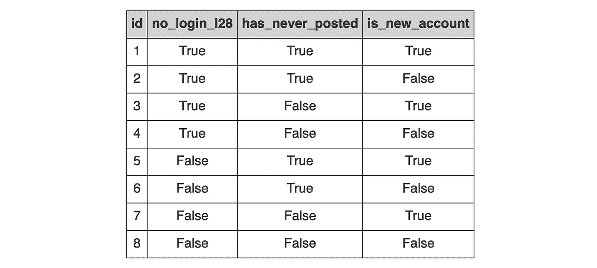
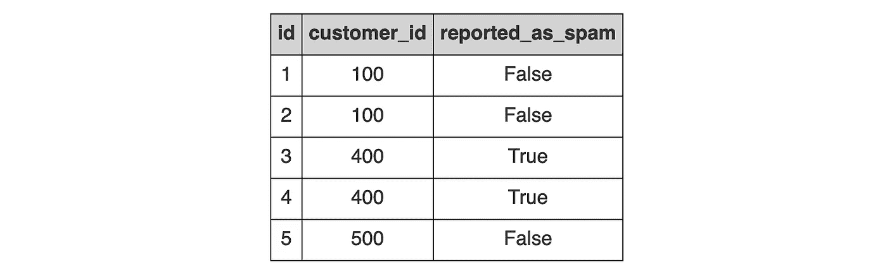

# 测试你的智慧的 SQL 谜题

> 原文：[`towardsdatascience.com/sql-riddles-to-test-your-wits-8ce31202ae7f`](https://towardsdatascience.com/sql-riddles-to-test-your-wits-8ce31202ae7f)

## 时间戳、依赖过滤器和表现异常的左连接

[](https://mgsosna.medium.com/?source=post_page-----8ce31202ae7f--------------------------------)[](https://towardsdatascience.com/?source=post_page-----8ce31202ae7f--------------------------------) [Matt Sosna](https://mgsosna.medium.com/?source=post_page-----8ce31202ae7f--------------------------------)

·发布于 [Towards Data Science](https://towardsdatascience.com/?source=post_page-----8ce31202ae7f--------------------------------) ·阅读时长 8 分钟·2023 年 2 月 22 日

--


图片由 [Saffu](https://unsplash.com/@saffu?utm_source=medium&utm_medium=referral) 提供，来源于 [Unsplash](https://unsplash.com/?utm_source=medium&utm_medium=referral)

SQL 是一种看似简单的语言。通过其多种方言，用户可以使用类似英语的语法查询数据库。**你看到的就是你得到的……直到你发现不是。**

我时不时会遇到一些查询，它们的结果与我预期的完全不同，这教会了我一些语言中的细微差别。我在这篇文章中汇编了三个最近的难题，并将它们以谜题的形式排列，使其更有趣。尝试在阅读每个部分的结尾之前找出答案！

我还包含了快速的 [**公共表表达式（CTEs）**](https://learnsql.com/blog/what-is-common-table-expression/) 来生成每个示例中的表格，因此你不需要尝试查询你公司的生产表格！但要真正熟练掌握 SQL，我实际上建议你创建自己的数据库和表格进行练习。查看 [这篇文章](https://medium.com/towards-data-science/intermediate-sql-for-everyone-fe35c541147a) 了解如何操作。

请注意，所有查询均为 Postgres 语法 —— 在其他方言中你可能会得到不同的结果。最后，必须说明的是，每个查询中的实际数据和主题仅为示例。 🙂


图片由 [Akram Huseyn](https://unsplash.com/@akramhuseyn?utm_source=medium&utm_medium=referral) 提供，来源于 [Unsplash](https://unsplash.com/?utm_source=medium&utm_medium=referral)

# 谜题 1：时间戳的具体性

假设我们有一个名为 `purchases` 的表，其中包含购买 ID、金额以及购买时间。假设它看起来是这样的：


图片由作者提供

作为 CTE，它大致看起来像这样。请注意，我们需要指定`dt`列是时间戳，以免被解释为字符串。我们只需要为其中一行指定数据类型；其余的会被推断。

```py
WITH purchases(id, amount, dt) AS (
    VALUES
    (1::bigint, 0.99::float, '2023-02-15 00:00:00 GMT'::timestamp),
    (2, 9.99, '2023-02-15 07:15:00 GMT'),
    (3, 15.99, '2023-02-15 23:01:15 GMT'),
    (4, 7.99, '2023-02-16 14:22:09 GMT')
)
...
```

现在让我们计算 2 月 15 日的购买总额。我们可以写一个如下的查询：

```py
...
SELECT
    SUM(amount) AS sum
FROM purchases
WHERE
    dt = '2023-02-15'
```

我们神秘地收到以下响应。


作者提供的图片

发生了什么？2 月 15 日有三笔购买：ID 1、2 和 3。总和应该是$26.97。然而，只计算了第一笔购买。

# 提示

如果你将过滤器更改为`2023-02-16`，则没有行返回。

# 答案

`dt`列格式是包含日期和时间的时间戳。我们的`WHERE`过滤器只指定了日期。Postgres 不会拒绝此查询，而是自动将日期字符串重新格式化为`2023-02-15 00:00:00`。这仅匹配表中的第一笔交易，因此我们只计算了一行的总和。

如果我们想选择对应于 2 月 15 日的所有行，我们应该首先将时间戳转换为日期。

```py
SELECT
    SUM(amount) AS sum
FROM purchases
WHERE
    DATE(dt) = '2023-02-15'
```

我们现在得到了预期的结果。


作者提供的图片


照片由[Womanizer Toys](https://unsplash.com/es/@womanizer?utm_source=medium&utm_medium=referral)提供，来源于[Unsplash](https://unsplash.com/?utm_source=medium&utm_medium=referral)

# 谜题 2：依赖过滤器与独立过滤器

好的，下一个谜题。我们有一个名为`users`的表，我们的目标是**删除符合*任意一个*三种条件的所有行**。在下表中，例如，假设我们只想返回有职位并且活跃的用户，即那些*在过去 28 天内*登录过，*曾经*发过帖，并且*不是*新账户。



作者提供的图片

换句话说，我们希望我们的查询仅使用 8 号用户，该用户在`no_login_l28`、`has_never_posted`和`is_new_account`上都有 False 值。

让我们从查询的顶部开始。

```py
WITH users(id, no_login_l28, has_never_posted, is_new_account) AS (
    VALUES
    (1, True, True, True),
    (2, True, True, False),
    (3, True, False, True),
    (4, True, False, False),
    (5, False, True, True),
    (6, False, True, False),
    (7, False, False, True),
    (8, False, False, False)
)
SELECT
    id
FROM users
WHERE
    ...
```

我们应该如何构建查询的`WHERE`子句？考虑一下——**我们需要小心不要返回*任何*列为** `**False**`**的行**。

当你准备好时，查看下面的选项。**两个是正确的，两个是错误的。**

**选项 1：多个** `**AND NOT**`

```py
WHERE
    NOT no_login_l28
    AND NOT has_never_posted
    AND NOT is_new_account
```

**选项 2：多个** `**OR NOT**`

```py
WHERE
    NOT no_login_l28
    OR NOT has_never_posted
    OR NOT is_new_account
```

**选项 3：** `**NOT**` **+ 分组** `**OR**`

```py
WHERE
    NOT (
        no_login_l28
        OR has_never_posted
        OR is_new_account
    )
```

**选项 4：** `**NOT**` **+ 分组** `**AND**`

```py
WHERE
    NOT (
        no_login_l28
        AND has_never_posted
        AND is_new_account
    )
```

# 提示

条件在过滤器中是分别评估还是一起评估？如果它们一起评估，我们能否将所有条件浓缩为一个`True`或`False`值？

# 答案

**选项 1.** 这个让我有点困惑。我的团队中的一位数据科学家提交了一个包含这个过滤器的 PR，我确信它会提取行 2–7，因为查询只会移除所有三个列的值为 `False` 的用户。但令我惊讶的是，选项 1 实际上有效 **因为三个过滤器是独立评估的。** ✅

**选项 2.** 这是我最初认为正确的过滤器，因为我没有意识到这些过滤器会被独立评估。但实际上这个过滤器会返回用户 2–8，因为任何在 `no_login_l28`、`has_never_posted` 和 `is_new_account` 中至少有一个 `True` 的用户都会被允许通过。 ❌

**选项 3.** 这是我最初认为过滤器需要这样表达的方式。如果用户在 `no_login_l28`、`has_never_posted` 或 `is_new_account` 中有 *任何* 一个 `True`，那么第 3 行到第 5 行评估为 `True`，`NOT` 将其翻转为 `False`，这些行最终会被排除。这确实有效，我发现这比选项 1 更容易理解，但两者都是有效的。 ✅

**选项 4.** 这会返回与选项 2 相同的错误结果。第 3 行到第 5 行仅对用户 1 评估为 `True`，这意味着当我们用 `NOT` 取反时，所有剩余用户都会被提取出来。 ❌


[Nick Fewings](https://unsplash.com/@jannerboy62?utm_source=medium&utm_medium=referral) 在 [Unsplash](https://unsplash.com/?utm_source=medium&utm_medium=referral) 上的照片

# 谜题 3：左连接像内连接一样工作

看一下下面的查询。我们有两个表，`customers` 和 `reviews`。`customers` 包含客户 ID 及其在平台上花费的终身金额。


作者提供的图片

`reviews` 包含客户留下的评论信息：评论 ID、客户 ID 和评论是否被报告为垃圾评论。



作者提供的图片

这是生成两个 CTE 的子查询：

```py
WITH customers(id, total_spend) AS (
    VALUES
    (100, 1583.49),
    (200, 8739.03),
    (300, 431.00),
    (400, 1.00),
    (500, 22.27)
),
reviews(id, customer_id, reported_as_spam) AS (
    VALUES
    (1, 100, False),
    (2, 100, False),
    (3, 400, True),
    (4, 400, True),
    (5, 500, False)
)
...
```

现在假设我们对客户的总消费与他们写的非垃圾评论数量之间的关系感到好奇。由于不是每个客户都留下了评论，我们希望将 `reviews` 左连接到 `customers`。我们可以这样构建我们的查询：

```py
...
SELECT
    c.id,
    c.total_spend,
    COALESCE(COUNT(r.id), 0) AS n_reviews
FROM customers c
LEFT JOIN reviews r
    ON c.id = r.customer_id
WHERE
    NOT r.reported_as_spam
GROUP BY
    1, 2
ORDER BY
    1
```

准备好了吗？看看结果吧。


作者提供的图片

等一下。用户 200、300 和 400 去哪里了？为什么它们被移除了，我们怎么能把它们找回来呢？

# 提示

如果你创建一个过滤掉垃圾评论的 `reviews` CTE，然后在这个 CTE 上进行连接，我们会得到相同的结果吗？

# 答案

仔细查看，我们可以看到用户 200 和 300 从未留下任何评论。400 只有垃圾评论，但它们也被完全移除。由于我们进行了左连接，这些用户仍应存在于表中，并且 `n_reviews` 应为 0。相反，我们的左连接 [表现得像内连接](https://trevorscode.com/why-is-my-left-join-behaving-like-an-inner-join-and-filtering-out-all-the-right-side-rows/)。

问题是，`**WHERE**` **子句是在连接操作*之后*进行评估的**。我们的左连接带来了用户 200 和 300 的`reported_as_spam`的空值。然后，`WHERE`过滤器移除所有`reported_as_spam`为 True 的行，这样用户 400 就被移除。然而，这个过滤器也会移除空值，因此用户 200 和 300 也被移除。

为了正确完成这一点，我们需要在与`customers`连接之前预先过滤`reviews`。正如提示所述，我们可以为`reviews`创建一个 CTE，并在那里进行过滤。但更有效的是，[我们可以在连接*内部*进行过滤](https://mode.com/sql-tutorial/sql-joins-where-vs-on/)。

我们可以通过在`LEFT JOIN`块中添加`AND NOT r.reported_as_spam`来实现。见下文：

```py
...
SELECT
    c.id,
    c.total_spend,
    COALESCE(COUNT(r.id), 0) AS n_reviews
FROM customers c
LEFT JOIN reviews r
    ON c.id = r.customer_id
    AND NOT r.reported_as_spam
GROUP BY
    1, 2
ORDER BY
    1
```

现在我们得到了预期的结果。


作者提供的图像


由[Laura Chouette](https://unsplash.com/@laurachouette?utm_source=medium&utm_medium=referral)拍摄，来源于[Unsplash](https://unsplash.com/?utm_source=medium&utm_medium=referral)

# 结论

本文分享了三种可能导致意外结果的 SQL 难点：时间戳的具体性、依赖性与独立性过滤器，以及左连接表现得像内连接。我特别提供了简单的示例，以保持对语法的关注，但你可能会在大型复杂查询中遇到类似的 SQL 细微差别。

这些错误可能非常难以识别，尤其是对于包含多个组件的查询。当我对结果感到困惑时，我会尝试将查询拆分成各个部分，并验证每个组件的结果。但是如果有疑问，写一些简单的 CTE 并用测试数据进行验证，确认结果是否符合预期。

祝查询愉快！

Matt
