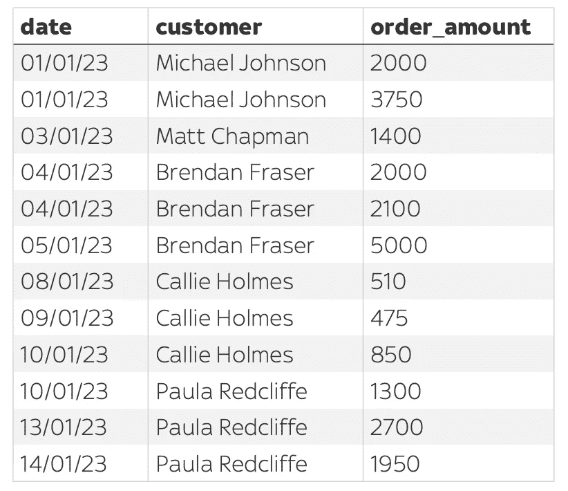
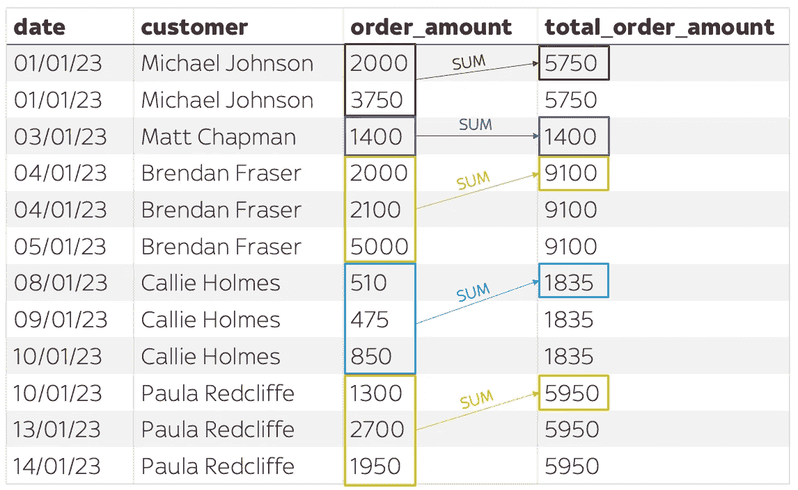
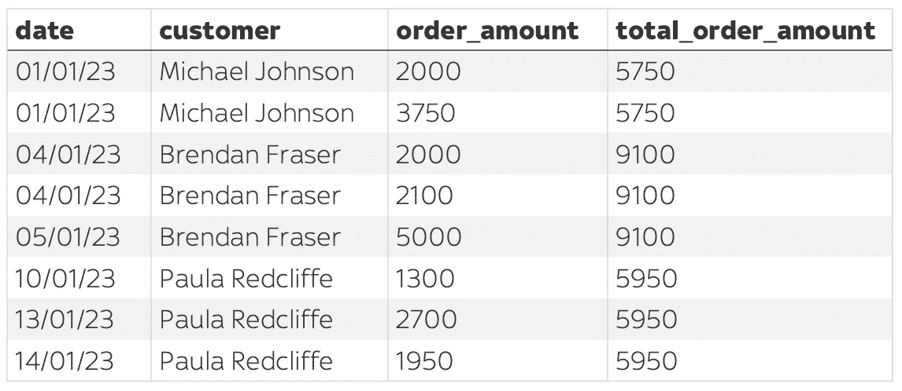
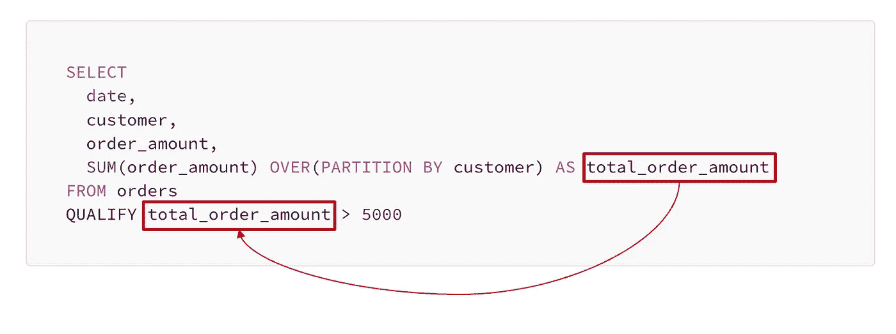
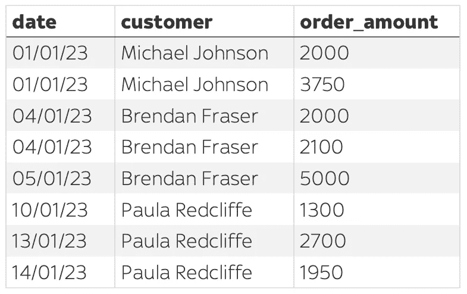
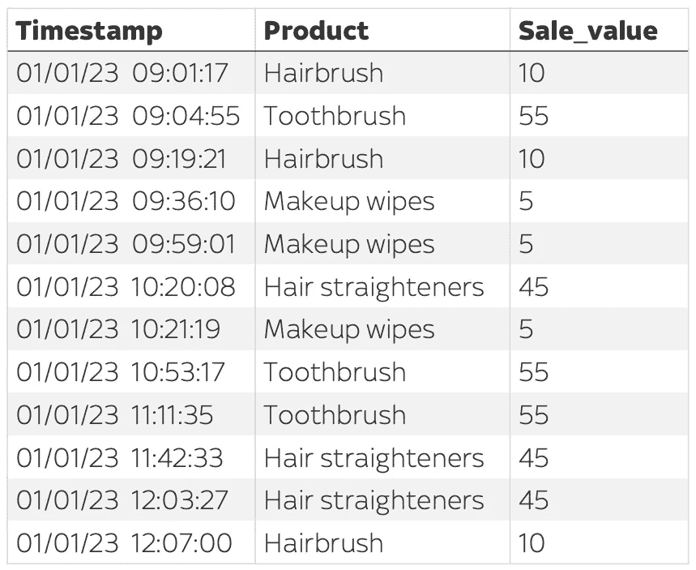
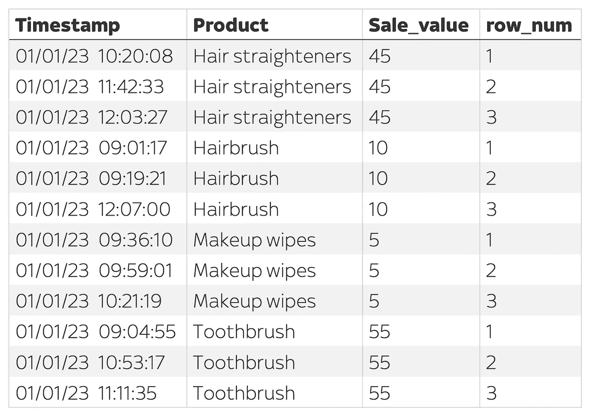
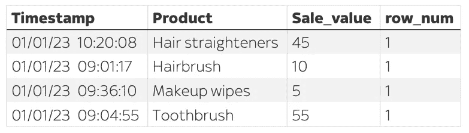

# SQL 用户：使用这一技巧将你的查询长度缩短一半

> 原文：[`towardsdatascience.com/sql-users-halve-the-length-of-some-of-your-queries-with-this-one-trick-c3c2c226cb35`](https://towardsdatascience.com/sql-users-halve-the-length-of-some-of-your-queries-with-this-one-trick-c3c2c226cb35)

## `QUALIFY` 子句纯粹是语法糖

[](https://medium.com/@mattchapmanmsc?source=post_page-----c3c2c226cb35--------------------------------)[](https://towardsdatascience.com/?source=post_page-----c3c2c226cb35--------------------------------) [Matt Chapman](https://medium.com/@mattchapmanmsc?source=post_page-----c3c2c226cb35--------------------------------)

·发布于 [Towards Data Science](https://towardsdatascience.com/?source=post_page-----c3c2c226cb35--------------------------------) ·阅读时间 6 分钟·2023 年 3 月 29 日

--


图片由 [Joanna Kosinska](https://unsplash.com/@joannakosinska) 提供，来源于 [Unsplash](https://unsplash.com/photos/-ayOfwsd9mY)

在这篇文章中，我将向你介绍 SQL `QUALIFY` 子句：一种帮助你编写更简洁、可读性更高的 SQL 查询的技巧。

如果你从事数据科学/分析或机器学习，这是一个必备的 SQL 工具，原因有四：

1.  首先，因为它可以帮助你编写更 ***简短*** 的查询，简化你的数据收集流程。在我的经验中，`QUALIFY` 将许多查询的长度减少了多达 50%。

1.  其次，因为它会帮助你编写更 ***简洁*** 的查询。这很重要，因为正如保罗·格雷厄姆所说，[简洁就是力量](http://www.paulgraham.com/power.html)，它使你的代码更具可读性和可维护性。

1.  第三，`QUALIFY` 帮助你编写更 ***高效*** 的查询，从而降低成本并加快开发速度。

1.  第四，它是一个展示技巧的好方法。我并不是说你会因为使用 `QUALIFY` 赢得任何创新奖，但因为它是一个 [相对较新的子句](https://modern-sql.com/caniuse/qualify)，你的老板可能还没有听说过。无论如何，展示给你的团队一个新技巧会很有趣。

# `QUALIFY` 子句的作用是什么？

简单来说，`QUALIFY` 子句使你可以筛选窗口函数的结果，*无需* 使用嵌套子查询或 `WITH` 子句。它允许你用 **一行代码** 替代这些冗长的代码块。这有点类似于 `HAVING` 子句如何使你能够筛选 `GROUP BY` 聚合的结果。

> `QUALIFY` 子句使你能够筛选窗口函数的结果

如果这听起来像胡言乱语，给我 2 分钟的时间，我会尽力解释清楚。

# 一切从窗口函数开始

如果你不熟悉窗口函数，你可能想看看[这篇文章](https://medium.com/learning-sql/sql-window-functions-explained-through-4-real-world-examples-91db9972b6bc)，它通过 4 个实际使用案例介绍了 SQL 窗口函数。但简而言之，窗口函数可以用来对表中的一组行进行计算，而无需聚合或合并这些行，这在你想保留表的原始结构时非常有用。

例如，假设我们有一个名为`orders`的表，它列出了公司收到的所有产品订单。每一行代表一个订单，并记录了订单下达的`date`、下订单的`customer`和`order_amount`（以美元计）。



图片来源于作者

使用窗口函数，我们可以添加一个新的列`total_order_amount`，表示每个客户的总订单金额。我们可以简单地写：

```py
SELECT
  date,
  customer,
  order_amount, 
  SUM(order_amount) OVER(PARTITION BY customer) AS total_order_amount
FROM orders
ORDER BY date
```

这将返回：



图片来源于作者

如你所见，窗口函数`SUM(order_amount) OVER(PARTITION BY customer)`有效地将我们的表分区为不同的“窗口”（每个客户一个窗口），然后计算这些窗口的`total_order_amount`。所有这些都在不使用`GROUP BY`聚合的情况下完成，使我们能够保留相同数量的行。

# 输入 QUALIFY 子句

现在我们已经设置好了窗口函数，假设我们想向我们花费最多的客户发送感谢邮件。在此之前，我们需要筛选这个表，查看`total_order_amount`超过$5,000 的客户订单。换句话说，我们想生成这样的内容：



图片来源于作者

一种生成这个结果的典型方法是使用`WITH`子句：

```py
WITH my_order_table AS (
  SELECT
    date,
    customer,
    order_amount, 
    SUM(order_amount) OVER(PARTITION BY customer) AS total_order_amount
  FROM orders
)

SELECT
  *
FROM my_order_table
WHERE total_order_amount > 5000
ORDER BY date
```

…或者一个嵌套子查询：

```py
SELECT
  *
FROM 
    (SELECT
      date,
      customer,
      order_amount, 
      SUM(order_amount) OVER(PARTITION BY customer) AS total_order_amount
    FROM orders) AS A

WHERE A.total_order_amount > 5000
ORDER BY A.date
```

然而，虽然这两种方法都是完全可接受的解决方案，但`QUALIFY`子句使我们能够显著简化和缩短这段代码。我们可以简单地写：

```py
SELECT
  date,
  customer,
  order_amount, 
  SUM(order_amount) OVER(PARTITION BY customer) AS total_order_amount
FROM orders
QUALIFY total_order_amount > 5000
```

这将返回**完全相同的结果**。

# QUALIFY 语句是纯粹的语法糖

`QUALIFY` 子句的一个好处是它在窗口函数计算*之后*被评估。这意味着你可以使用你分配给窗口函数列的别名进行引用。在上面的例子中，我通过编写`QUALIFY total_order_amount..`演示了这一点，引用了我在创建原始窗口函数时分配的别名`total_order_amount`。



图片来源于作者

在 `SELECT` 子句中不必写窗口函数。例如，如果我不想实际将总订单金额显示为单独的列，但仍需在这个窗口函数上进行过滤，我可以这样写：

```py
SELECT
  date,
  customer,
  order_amount, 
FROM orders
QUALIFY SUM(order_amount) OVER(PARTITION BY customer) > 5000
```

这将返回相同的结果，但没有 `total_order_amount` 列：



作者提供的图片

除此之外，`QUALIFY` 子句也可以比使用子查询或 `WITH` [稍微更高效](https://stackoverflow.com/a/70149163)。这不仅会加快你的开发时间；它还对成本优化有很大帮助。

# 另一个例子：选择每组中的前 N 名

`QUALIFY` 子句的一个常见用例是选择每组中的前 N 名。例如，假设我们有一个记录每个商店在某一天进行的每笔销售的 `sales` 表。每一行代表一次交易，并包含销售的时间戳、购买的产品以及该笔销售中花费的总金额。



使用窗口函数：

```py
SELECT
  Timestamp,
  Product,
  Sale_value,
  ROW_NUMBER() OVER(PARTITION BY Product ORDER BY Timestamp ASC) as row_num
FROM sales
ORDER BY Product, row_num
```

我们可以在每个产品类别内给每笔销售分配一个行号：



作者提供的图片

然后，使用 `QUALIFY` 语句，我们可以过滤结果，只显示每个类别中的第一行：

```py
SELECT
  Timestamp,
  Product,
  Sale_value,
  ROW_NUMBER() OVER(PARTITION BY Product ORDER BY Timestamp ASC) as row_num
FROM sales
QUALIFY row_num = 1
ORDER BY Product
```



作者提供的图片

就是这样——`QUALIFY` 的魔力。

# 最后一个事情

`QUALIFY` 子句在所有 SQL 方言中尚不可用。在撰写时，它已被许多大型平台如 BigQuery、Databricks、Snowflake 和 H2\ 支持。如果你的平台/方言不兼容，你现在需要依赖子查询/`WITH`，但你可以关注[现代 SQL](https://modern-sql.com/caniuse/qualify)以查看它何时可用。
