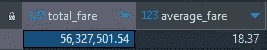
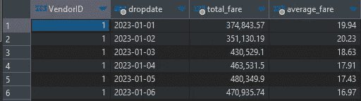
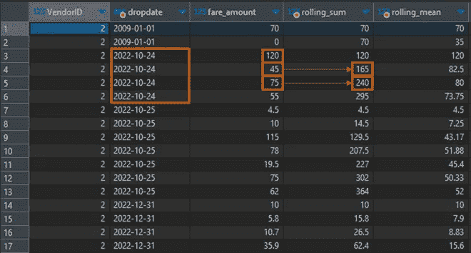
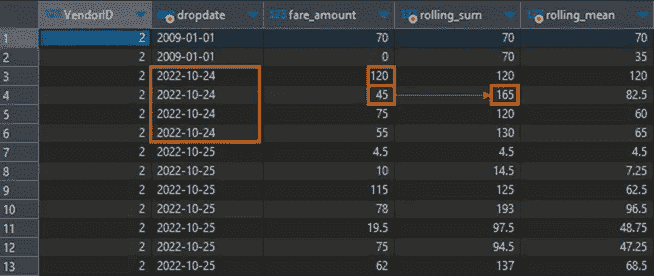
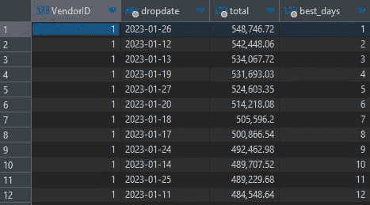

# 利用 SQL 中的分析函数加速数据提取

> 原文：[`towardsdatascience.com/sql-window-functions-939ed24c9752`](https://towardsdatascience.com/sql-window-functions-939ed24c9752)

## 分析函数提供了一种极其强大且易于实现的数据处理和分析方式。本文将展示如何在 SQL 语句中使用分析函数。

[](https://guenterroehrich.medium.com/?source=post_page-----939ed24c9752--------------------------------)[](https://towardsdatascience.com/?source=post_page-----939ed24c9752--------------------------------) [Günter Röhrich](https://guenterroehrich.medium.com/?source=post_page-----939ed24c9752--------------------------------)

·发布在 [Towards Data Science](https://towardsdatascience.com/?source=post_page-----939ed24c9752--------------------------------) ·8 分钟阅读·2023 年 7 月 18 日

--

作为一名分析师，你很可能会遇到需要查询数据以进行分析的情景。数据通常来自 SQL 数据库，然后通过像 Python 这样的编程语言和 Pandas 或 NumPy 等强大框架导入。这是一种处理数据的完全有效的管道，但重的计算主要依赖于你的本地机器。对于小数据集，这不是问题，但对于较大的数据集，可能会遇到仅依靠 PC 本地内存处理大量数据的困难。

*你可能认为这不是一个常见的问题。因此，让我给出一个日常的例子来证明这个假设是错误的：*

想象一下，你在一家制造公司工作，并且对收集机器传感器数据感兴趣。这些数据通常被频繁收集，而且可能非常嘈杂。为了更好地理解你的机器状态，对密集收集的数据进行平滑和预处理（例如，测量可能每秒收集几次）很快就会产生庞大的数据集！假设我们在一台机器旁边放置了 150 个传感器，每个传感器每秒读取 4 次数据。那么一天的数据将会产生

4×60×60×24x150 ≈ 52 百万条记录（读取次数 × 秒 × 分钟 × 小时 × 传感器）

数据点。通常，作为经验法则，我们会查看至少一周的数据（但我们也可能增加读取次数或传感器数量）……你能理解这点。

因此，你可能更好地将计算成本高的聚合操作转移到源数据库中。特别是，分析或窗口函数的语法直接明了，却是读取、转换和提取数据的强大工具，适用于更高层次的聚合。

> **关键要点**：
> 
> 每当你看到需要滚动/移动窗口或在逻辑分区内进行计算（例如，持续排名，从最低到最高值，在某些传感器组内），直接在 SQL 查询中应用窗口函数通常是值得考虑的，而不是使用 Pandas 中实现的更昂贵的函数来实现类似的功能。

## 这篇简短的文章是如何结构化的？

1.  一个 简短的介绍 例子和窗口函数如何工作的理论

1.  一个 快速指南来安装一些 SQL 演示数据 以及一个可以在电脑上直接使用的数据库（这很简单！）。我们将使用著名的 **纽约出租车** 数据。

1.  示例 让你熟悉这些函数


一些窗口函数的 [Julio César Bosch](https://unsplash.com/@jcbossch?utm_source=medium&utm_medium=referral)

# 介绍

**为什么你需要窗口函数？**

在数据科学更具吸引力的领域引起的轰动中，我们常常忽视了数据科学家大部分时间花费在获取、处理和清洗数据上。每当你看到需要计算成本高的运行总和或移动平均时，你应该考虑将这些转换操作转移到数据库中。

这种 **函数是对一系列语境上相关的行进行操作**。通常，当涉及此类事务时，我们会考虑总和、平均值、最小值或最大值计算。

**窗口函数一般是如何结构的？**

首先，了解使用窗口函数的查询结构，我们来看一个使用滚动总和的 SQL 语句——只需查看代码块，不需要完全理解概念，暂时把代码当作简单演示：

```py
select
   VendorID,
   tpep_dropoff_datetime as dropdate,
   passenger_count,
 sum(passenger_count) over (
     partition by date(tpep_dropoff_datetime)
     order by tpep_dropoff_datetime
     rows between unbounded preceding and current row
 ) as day_running_sum
from trip_data td 
```

1.  首先，我们指定我们希望执行的分析类型。一般来说，**有三种类型的函数** 可供使用：

+   **聚合函数**，如 min()、max()、count() 或 avg()——这在上面的第一个示例中展示过

+   **编号函数**，如 rank() 或 row_number()

+   **导航函数** 如 lead()、lag() [返回后续或前值]

2\. 在下一步中，我们开始考虑 **逻辑分区**。例如，我们可以选择用户 ID 作为分区示例，因此我们查看用户块，并对每个用户子集执行进一步操作。必须将分区传递给函数！

3\. 类似于 group by 语句，我们还应在分析函数中考虑排序参数。排序应用于之前定义的选定子块。排序是可选的，可以省略。

4. 最后，分析（或窗口）函数的核心元素：窗口框架子句。这个子句指定了我们希望查看的滚动时间窗口。

要深入了解更多理论，请访问下面的链接 — 请注意，窗口函数在不同的 SQL 数据库中可能会有所不同，但它们的一般结构基本相同。

[## 窗口函数

### 窗口函数是 SQL 函数，其中输入值来自一个或多个行的“窗口”中的...

[www.sqlite.org](https://www.sqlite.org/windowfunctions.html?source=post_page-----939ed24c9752--------------------------------)

# 快速安装指南

为了说明窗口函数如何工作，我将提供一些使用著名的纽约出租车数据集的子集的示例。通常，你需要以下工具来自己完成这些示例：

+   已安装 Python（用于提取，需 sqlite3 和 pandas 库）

+   一种编写查询和查看数据的工具（谈到 SQL，[DBeaver](https://dbeaver.io/) 是一个功能强大的数据查询工具，但易于使用且开源。

就这样！

如果你想复制所展示的步骤，只需访问下面的链接并下载即可：

[## TLC 行程记录数据

### 黄绿出租车的行程记录包括捕捉接送日期/时间的字段、接送...

[www.nyc.gov](https://www.nyc.gov/site/tlc/about/tlc-trip-record-data.page?source=post_page-----939ed24c9752--------------------------------)

*法律说明：* [***只要使用目的合法***](https://opendata.cityofnewyork.us/faq/) *，数据使用没有限制*，如使用条款中所述。更多许可证详细信息和数据集引用请见* ***文章结尾****。

下载成功后，我建议将 parquet 文件转换为 sqlite3 数据库。使用 Python 以及 Pandas 和 sqlite3 包，这很快就能实现——只需将代码复制粘贴到脚本中，你就准备好了：

```py
import pandas
import sqlite3

data = pd.read_parquet('yellow_tripdata_2023-01.parquet')

con = sqlite3.connect('taxi.db')  # creates a database "taxi.db"
data.to_sql('trip_data', con)     # name of the table
```

完成了！我们现在可以在存储在硬盘上的非常简单的 SQL 数据库中工作了。

# 示例

让我们从获取整个数据的费用总和和平均值这一简单任务开始。为此，我们可以使用 SUM 和 AVG 参数，并在 over 语句后的括号中省略分组标准。由于我们只是对整个数据集进行聚合，因此尚无需使用窗口函数。

```py
SELECT  
       SUM(fare_amount) AS total_fare,
       AVG(fare_amount) AS average_fare
FROM trip_data td;
```



假设我们想了解每一天每个供应商（*VendorID*）的总费用和平均费用——这个任务会变得稍微有些挑战：

```py
SELECT
 VendorID,
 date(tpep_dropoff_datetime) as dropdate,
 SUM(fare_amount) AS total_fare,
    AVG(fare_amount) AS average_fare
FROM trip_data td
group by VendorID, dropdate
```



如我们所见，为了实现分组效果，我们需要使用分组关键字，使我们能够根据*VendorId*和*dropdate*进行汇总。虽然分组非常强大，但它**不能进一步将单独行拆分为拖尾总和或移动平均值**——这时窗口函数就派上用场了。

现在假设我们想计算*fare_amount*的滚动总和和均值，并按*VendorID*和相关的每日行程进行分类。

我们的窗口操作在我们指定的“分区”内。我们定义一个分区为整天，因此，我们期望看到每一天和每个供应商的滚动总和和均值（或等效地，在每个分区内）。

```py
select
   VendorID,
   date(tpep_dropoff_datetime) as dropdate,
   fare_amount,
   sum(fare_amount) over (
      partition by date(tpep_dropoff_datetime), VendorID 
      order by tpep_dropoff_datetime
      rows between unbounded preceding and current row
   ) as rolling_sum,
   avg(fare_amount) over (
      partition by date(tpep_dropoff_datetime), VendorID 
      order by tpep_dropoff_datetime
      rows between unbounded preceding and current row
 ) as rolling_mean
from trip_data td;
```



每个分区（dropdate + VendorID）显示每行的票价以及滚动总和。

注意以下事项，我们使用了“*unbounded preceding*”作为框架子句。这意味着我们查看在我们分区内的所有前置值——再说一次，我们的分区定义为*Date* + *VendorID*。

如果我们只想查看一个滚动总和/均值，该均值考虑到**之前和当前的票价**（再次在*Date*+*VendorID*的分区内），我们需要将框架子句调整为*仅 1 行之前和当前行*。

```py
select
 VendorID,
 date(tpep_dropoff_datetime) as dropdate,
 fare_amount,
 round(sum(fare_amount) over (
  partition by date(tpep_dropoff_datetime), VendorID 
  order by tpep_dropoff_datetime
  rows between 1 preceding and current row --> NOW 1 Preceding row only
 ),2) as rolling_sum,
 round(avg(fare_amount) over (
  partition by date(tpep_dropoff_datetime), VendorID 
  order by tpep_dropoff_datetime
  rows between 1 preceding and current row --> NOW 1 Preceding row only
 ),2) as rolling_mean
from trip_data td 
```



“1 Preceding”结果是一个移动总和/均值，仅查看当前和之前的行程票价——再说一次，这始终在分区内。

在最后一个示例中，我们将结合所有之前的步骤，展示如何优雅地查询简单的汇总数据，并使用这些数据执行 rank()语句——这是一种分析编号函数。

我们希望按每个供应商收取的总票价的最高值对天数进行排名。因此，我们将这分为两个步骤：

1.  通过简单的“*group by*”按天和供应商汇总票价

1.  使用分析函数对“*VendorID*”分区内的天数进行排名

```py
with aggregated as (
 select
    VendorID,
    date(tpep_dropoff_datetime) as dropdate,
    round(sum(fare_amount),2) as total
 from trip_data td 
 where dropdate like '2023%' -- this to remove wrong 2020 data in the dataset
 group by VendorID, dropdate
 order by dropdate asc
) -- here our "aggregated" data subset is created
select 
  VendorID,
  dropdate,
  total,
  rank() over (
      partition by VendorID
      order by total desc
  ) as best_days
from aggregated -- we rank() based on "aggregated"
```



从*VendorID=1*开始，1 月份最好的日子是 26 号，它排名第一（收入最高）。

# 结论

到现在为止，我相信你已经掌握了分析函数的工作原理以及它们如何灵活地实现相当复杂的查询结果。

虽然数据现在通常在本地机器或云实例上转换，但在实际导入到后续软件之前修改数据通常是更好的选择——也就是说，SQL 是一种非常强大的语言来完成这项任务！

**如果你觉得这篇文章对你有帮助，我会很感激你的“关注”🫀，直到那时：**

*{照顾好自己，如果可以的话，也照顾好别人}*

*—— 借用自斯蒂芬·杜布纳*

## **数据集引用**和使用条款：

纽约市出租车和豪华轿车委员会（TLC）的行程记录数据于 7 月 13 日从[`www.nyc.gov/site/tlc/about/tlc-trip-record-data.page`](https://www.nyc.gov/site/tlc/about/tlc-trip-record-data.page)访问。

完整的使用条款可以在这里找到：

[](https://www.nyc.gov/home/terms-of-use.page?source=post_page-----939ed24c9752--------------------------------) [## 使用条款

### 欢迎访问纽约市官方网站。在使用之前，请仔细阅读以下使用条款（“条款”）…

www.nyc.gov](https://www.nyc.gov/home/terms-of-use.page?source=post_page-----939ed24c9752--------------------------------)
