# SquirrelML：预测纽约中央公园的松鼠接近行为

> 原文：[`towardsdatascience.com/squirrelml-predicting-squirrel-approach-in-nycs-central-park-8c3719d8ff65`](https://towardsdatascience.com/squirrelml-predicting-squirrel-approach-in-nycs-central-park-8c3719d8ff65)

## 通过机器学习探索纽约中央公园的松鼠行为：聚类观察和预测互动见面

[](https://victormurcia-53351.medium.com/?source=post_page-----8c3719d8ff65--------------------------------)[](https://towardsdatascience.com/?source=post_page-----8c3719d8ff65--------------------------------) [Victor Murcia](https://victormurcia-53351.medium.com/?source=post_page-----8c3719d8ff65--------------------------------)

·发表于[Towards Data Science](https://towardsdatascience.com/?source=post_page-----8c3719d8ff65--------------------------------) ·18 分钟阅读·2023 年 12 月 20 日

--


照片由[Tj Holowaychuk](https://unsplash.com/@tjholowaychuk?utm_content=creditCopyText&utm_medium=referral&utm_source=unsplash)拍摄，发布于[Unsplash](https://unsplash.com/photos/brown-and-white-squirrel-on-brown-tree-trunk-D18ZnjlhVqM?utm_content=creditCopyText&utm_medium=referral&utm_source=unsplash)。

[NYCOpenData](http://opendata.cityofnewyork.us/)拥有丰富的有趣数据集，涉及健康、环境、商业和教育等话题。我偶然发现了[2018 Central Park Squirrel Census](https://data.cityofnewyork.us/Environment/2018-Central-Park-Squirrel-Census-Squirrel-Data/vfnx-vebw)数据集，并立即决定要对其进行一些处理。该数据集记录了志愿者在两周内在中央公园收集的松鼠观察数据。浏览数据字典后，我被一个名为‘Approaches’的特征吸引，该特征表示是否观察到松鼠接近人类。我认为训练一个机器学习（ML）模型来帮助我判断位于中央公园范围内的松鼠是否会接近我会很有趣。本文将详细介绍这个周末项目的整个过程。这个项目涉及许多内容：地理空间数据处理、聚类、可视化、特征工程、非结构化文本、模型训练、模型校准和模型部署。

我在 streamlit 应用中部署了该模型，你可以输入你的坐标和其他特征，这将告诉你松鼠接近你的概率。你可以在[这里](https://squirrelml.streamlit.app/)玩这个应用。如果你对查看一些代码感兴趣，我已将.ipynb 文件发布在[这里](https://github.com/victormurcia/SquirrelML/blob/main/Squirrel_ML.ipynb)。

# 数据加载和初步 EDA

数据加载相当标准。

```py
ini_squirrel_df = pd.read_csv('/content/drive/MyDrive/SquirrelML/NYC_Squirrels.csv')
```

为了进行初步的 EDA，我使用了 dataprep 来快速了解原始数据集中存在的特征分布、基数、模式、缺失数据和相关性。你可以查看报告[这里](https://github.com/victormurcia/SquirrelML/blob/main/EDA/Initial%20EDA.html)。从中获得了几个有用的见解，这些见解帮助我规划后续的特征工程，并移除冗余/不必要的特征。以下是我从这次 EDA 中获得的一些显著观察结果：

+   数据集由 3023 个独特观察值、31 列组成，其中 13%的单元格缺失。

+   大多数特征是分类的和布尔值的。

+   纬度和经度条目似乎有一个大致的四峰分布

+   “移位”列相当平衡（~55%的观测是在下午/晚上进行的）

+   “漠不关心”列相当平衡（~51%的条目为 False）

+   大多数松鼠是成年松鼠，主要毛色为灰色

+   观察到的最常见的位置是树木

+   颜色备注、具体位置、其他活动和其他互动是有大量缺失数据的文本列

+   “接近”高度不平衡（94.11%的观测值为负）

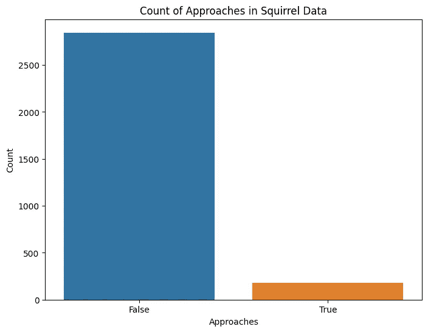

目标变量‘接近’的巨大类别不平衡。图片由作者提供

这些都是有用的观察，因为现在我知道我尝试解决的问题是一个不平衡的二分类问题。此外，我现在知道使用聚类方法对松鼠观测进行分组可能在未来会有用。此外，文本列可能包含可以创建新、潜在有用特征的信息。

# 松鼠观测的聚类

如下所示，松鼠观测似乎具有大致的三峰或四峰分布。我认为尝试根据位置对松鼠观测进行分组会很有趣。

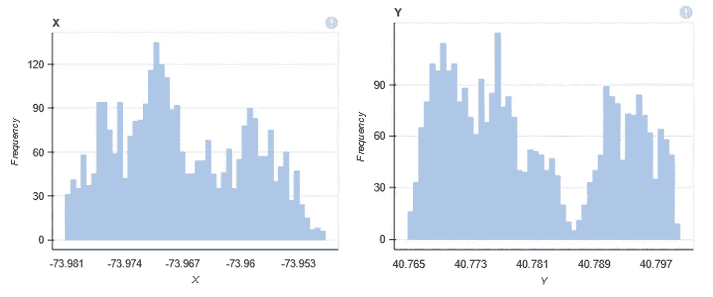

中央公园范围内松鼠观测的经度和纬度。图片由作者提供。

虽然我们可以通过轮廓系数或肘部法则来尝试确定最佳的簇数，但在这种情况下，我想将观测结果简单地划分为 4 个区域。我使用纬度和经度运行了 K 均值算法，如下所示：

```py
# Function for Applying Clustering
def apply_clustering(df, num_clusters=4):
    kmeans = KMeans(n_clusters=num_clusters, n_init='auto')
    df['Cluster'] = kmeans.fit_predict(df[['X', 'Y']])
    centroids = kmeans.cluster_centers_

    # Assuming 'kmeans' is your trained KMeans model
    joblib.dump(kmeans, '/content/drive/MyDrive/SquirrelML/squirrel_kmeans.pkl')

    return df, centroids
```

K-Means 算法的结果如下所示。有一些明显的边界，我通过 Voronoi 图进行了强调。你还可以看到每个簇的质心通过红色 X 标记出来。我还使得那些接近松鼠的点没有被包围在暗圈中，而那些没有接近的点则被包围在内。

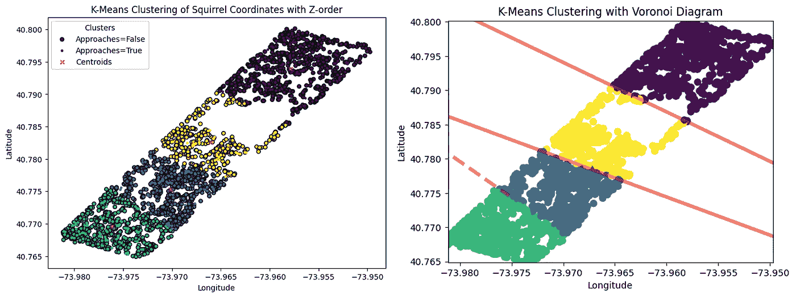

松鼠普查数据集的纬度和经度上的 K-Means 聚类结果。图片由作者提供。

# 松鼠观测的地理空间可视化

地理空间数据处理起来很有趣。如果你查看中央公园的鸟瞰图，或者对其布局比较熟悉，你就会看到布局的逐一对应。例如，中央公园有三个主要的水体，这些水体出现在图上的空白区域。你可以在[这里](https://en.wikivoyage.org/wiki/Manhattan/Central_Park)找到中央公园的标注布局。例如，位于‘黄色’簇中的那个大‘空旷’区域实际上是‘水库’。右上方，我们还可以看到一个接近空白的区域，对应于‘哈莱姆湖’。最后，在蓝色簇的左下角，我们可以看到被称为‘湖泊’的水体。

为了更好地利用这些数据，我认为将这些观测结果直接可视化在地理空间准确的纽约市地图上会很有趣。为此，我再次转向 NYCOpenData，并从[这里](https://data.cityofnewyork.us/Housing-Development/Shapefiles-and-base-map/2k7f-6s2k)下载了纽约市的 shape (.shp)文件。你的下载应该包括 4 个不同的文件：一个.shp 文件、一个.prj 文件、一个.dbf 文件和一个.shx 文件。在加载这些文件之前，请确保所有文件都在同一个目录中。下载这些文件后，我用 Geopandas 将它们加载到环境中。这些文件通常比较大，加载可能需要几分钟（在我的情况下大约需要 5 分钟）。

```py
nyc_map = gpd.read_file('geo_export_0a3d2fab-a76c-40da-bc23-6e335dd753dd.shp')
```

为了使.shp 文件更加轻量化并提高工作速度，我使用 Geofeather 将 Geopandas 框架转换为 feather 对象。

```py
geofeather.to_geofeather(nyc_map,'nyc_map.feather')
```

现在，我可以从 feather 文件中重新生成 nyc_map 并绘制它，这比使用原始的.shp 文件要快很多。我们可以如下绘制 nyc_map：

```py
nyc_map = geofeather.from_geofeather('nyc_map.feather')
nyc_map.plot()
```

结果如下：

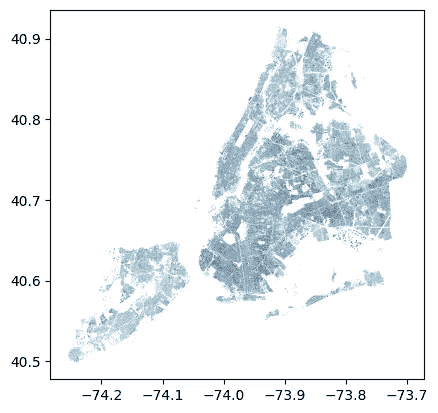

地理空间准确的纽约市地图。图片由作者提供。

看起来很棒！你还可以在纽约市陆块的左上角看到中央公园。尽管这个视图很酷，但我想更多地关注中央公园区域。因此，我也不需要整个数据集，只需根据松鼠观测坐标进行过滤。这还将加速所有后续操作，因为我们将处理纽约市地图的一个更小的子集。

质心是形状的几何中心。在地理空间数据的上下文中，它指的是地理特征的中心点。这个点是形状中所有点的平均位置。对于简单的形状如多边形（例如城市或公园的边界），质心通常位于形状内部。对于更复杂的形状，尤其是那些有凹部的形状，质心可能位于形状的物理边界之外。有几种方法可以用来计算质心。这里我只是使用了 shapely 包和 nyc_map：

```py
from shapely.geometry import Point
# Calculate the centroid for each geometry
nyc_map['centroid'] = nyc_map.geometry.centroid
```

然后，我可以使用松鼠目击的坐标范围来过滤 nyc_map。

```py
# Filter based on centroid's longitude and latitude
filtered_nyc_map = nyc_map[(nyc_map['centroid'].x >= -74.0) &
                           (nyc_map['centroid'].x <= -73.94) &
                           (nyc_map['centroid'].y >= 40.75) &
                           (nyc_map['centroid'].y <= 40.82)]
```

现在我们可以绘制过滤后的纽约市地图，如果我们做对了的话，它应该以中央公园为中心。

```py
# Plot the filtered DataFrame
filtered_nyc_map.plot(figsize=(10, 10), aspect='auto')
```

结果如下：

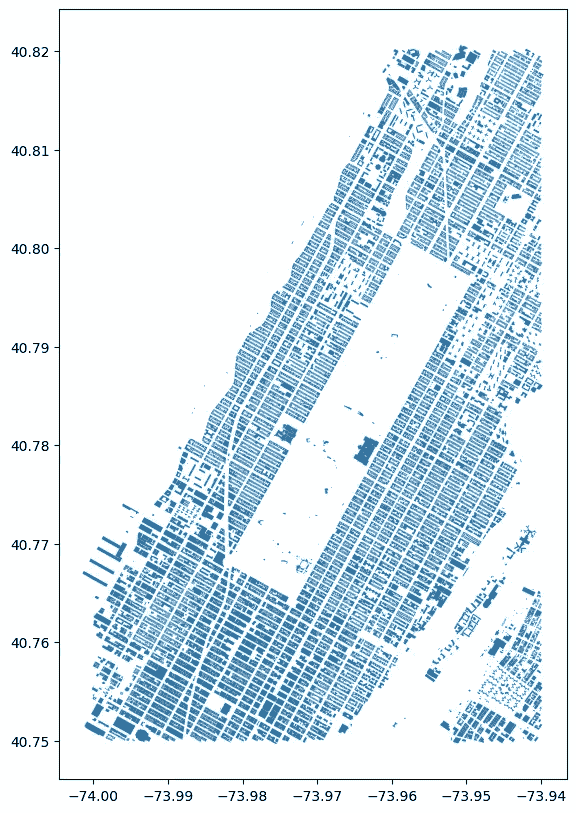

纽约中央公园的地理空间准确图。图片由作者提供。

成功了！不过，我们还有一件事要做。我想在这个图上包括按集群着色的松鼠目击情况，并根据松鼠的接近程度进行强调。我们可以使用下面的代码来实现：

```py
# Convert the 'X' and 'Y' columns into a GeoSeries of Points
points = gpd.GeoSeries([Point(xy) for xy in zip(squirrel_df['X'], squirrel_df['Y'])])

# Create a new GeoDataFrame
squirrel_geo_df = gpd.GeoDataFrame(squirrel_df, geometry=points)

# Plotting the filtered NYC map
fig, ax = plt.subplots(figsize=(10, 10))

filtered_nyc_map.plot(ax=ax, color='#207388')  # Base map in light grey

# Overlay the squirrel data points, color-coded by 'Cluster'
squirrel_geo_df.plot(ax=ax, column='Cluster', categorical=True, markersize=20,
                     cmap='viridis', legend=True, legend_kwds={'title':'Cluster', 'loc': 'upper left'},
                     facecolors='none' if True else 'black', edgecolors='black')

# Adding labels and title
ax.set_xlabel('Longitude')
ax.set_ylabel('Latitude')
ax.set_title('Squirrel Sightings in Central Park by Cluster')
plt.show()
```

这个结果如下：

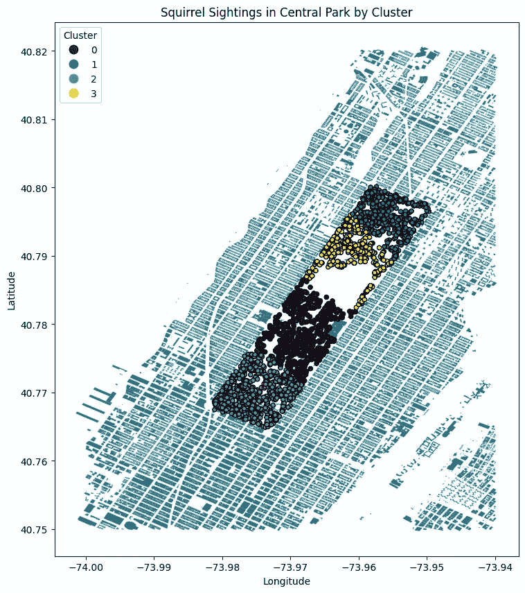

按集群着色的松鼠目击情况，在地理空间准确的纽约中央公园地图上。图片由作者提供。

这真不错！我对这个结果非常满意。我还想做一个可视化。我找到了中央公园的一张非常酷的航拍照片。我认为将松鼠目击情况覆盖到航拍视图上会很有趣，但是，有一些其他效果使得绘图变得复杂，所以我决定将这个任务留到以后再做。

# 特征工程

正如我在介绍中提到的，这个数据集有很多特征工程的机会。我创建的大多数新特征都是从文本列派生出来的。这些文本列包含了志愿者们对每次松鼠目击的额外描述。我识别出了一些关键类别和与每个类别相关的术语，并结合正则表达式创建了如下的新特征：

```py
# Define lists of terms for various features
tree_terms = ['tree', 'trees', 'maple', 'log', 'branch', 'oak', 'willow', 'trunk', 'stump', 'elm']
shrubbery_terms = ['shrub', 'bush', 'weeds']
rock_terms = ['rock', 'stone']
grassland_terms = ['lawn', 'grass', 'field', 'glen']
path_terms = ['path', 'road', 'pavement', 'street']
structure_terms = ['conservatory', 'fountain', 'bench', 'fence', 'statue', 'bin', 'carousel', 'trellis',
                  'structure', 'car', 'table', 'ledge', 'railing', 'overpass', 'post', 'can', 'house',
                  'arch', 'bar', 'sanctuary', 'bridge', 'bike', 'rack', 'construction', 'playground']
water_terms = ['water', 'shore', 'pond', 'pool', 'stream']

# Function to create a matching column based on specified terms
def create_matching_column(df, column_name, source_column, terms):
    pattern = '|'.join(terms)
    df[column_name] = df[source_column].str.contains(pattern, case=False, na=False)
    return df
```

在上面的例子中，我能够创建出像‘树上出现’、‘灌木丛中出现’和‘岩石上出现’等新特征。除此之外，一些列如‘主要毛色’和‘突出毛色’等被进行了独热编码，因为它们有几个类别（例如，主要毛色包括灰色、黑色、肉桂色和未知）。还有其他特征，如果你对查看完整的 EDA 报告以及查看创建的所有特征感兴趣，可以查看[这里](https://github.com/victormurcia/SquirrelML/blob/main/EDA/Preprocessed%20EDA.html)的报告。

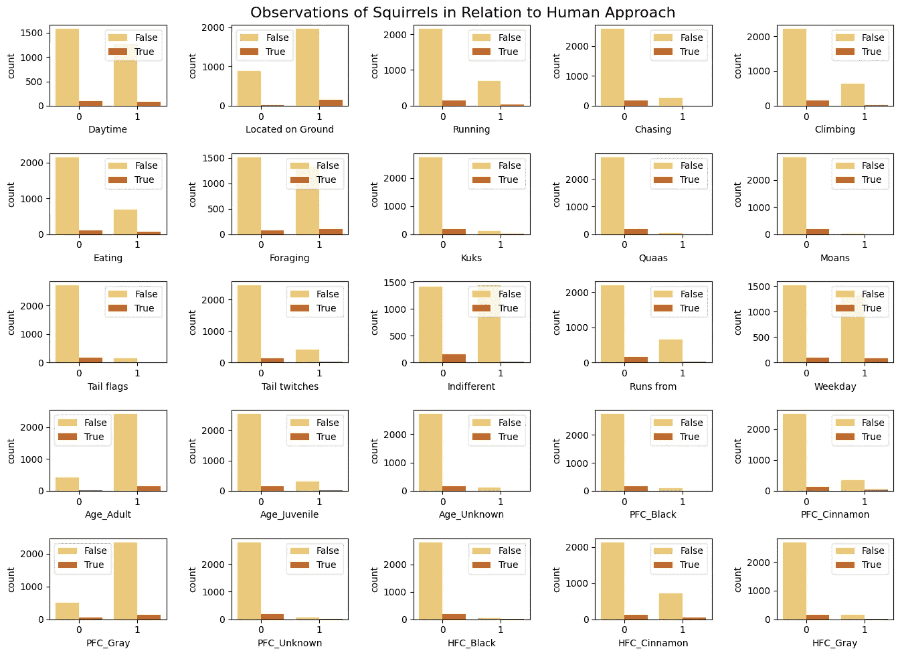

预处理数据集的各种特征的依赖图。图片由作者提供。

我创建了一个管道来进行所有必要的清理、格式化等，这是我在处理数据集后决定必要的。你可以查看我在文章开头链接的笔记本中的所有工作。值得一提的几点是：

+   我们现在有 44 个特征（原始数据集有 31 个）。

+   没有删除任何观察值，因此我们仍然有 3023 行。

+   现在没有缺失数据了。没有进行插补或删除行。大部分缺失数据出现在文本列中。这些列在用于特征工程后被删除。在像 Primary Fur Color 或 Age 这样的列中，我简单地将 NaNs 视为一个名为“未知”的新类别。

下面的相关图并没有特别有用。它主要揭示了我已经预料到的相关性/关系。例如，大多数强反相关是与 Primary Fur Color（即，灰色与肉桂色）或 Squirrel Age（即，成人与幼年）的变量之间的。

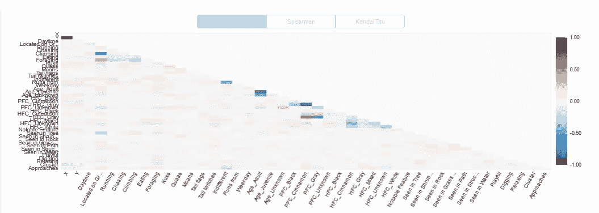

预处理数据集中特征的皮尔逊相关图。图像由作者提供。

此时，我想查看像主成分分析（PCA）和 t-分布随机邻域嵌入（tSNE）这样的降维技术，以尝试识别数据中的附加模式/簇，并评估哪些特征具有最重要的权重。tSNE 图并没有特别揭示出什么，尽管我可以在数据中看到一些分组。我也进行了 PCA，加载图和解释方差图在告诉我 30 个特征占了大约 90%的方差方面非常有用，还可以看到像 Cluster、PFC_Gray、X、Y、PFC_Cinnamon 和 HFC_Gray 这样的特征是数据集中一些最强的成分。

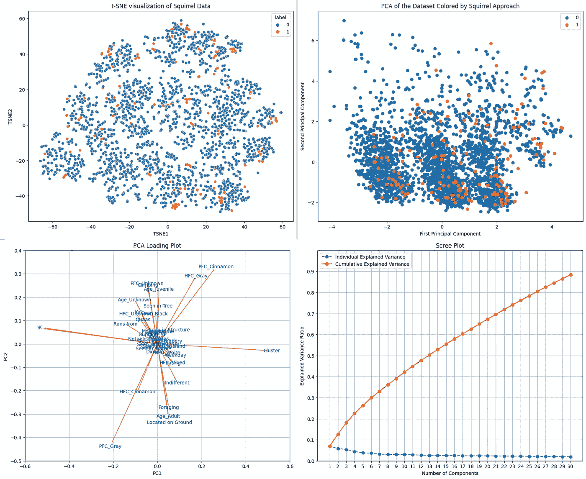

降维技术和处理过的松鼠数据分析。图像由作者提供。

# 训练模型

从我决定采取机器学习方法的那一刻起，我就知道我只会考虑两个算法：决策树和随机森林。原因是……松鼠喜欢树，这个笑话是我决定做这个项目的主要原因。虽然其他算法可能表现更好，但它们的选择就没那么有趣了。如果你有任何有趣的建议，请告诉我 :)

无论如何，接下来我们开始建模。首先，这是我目前的数据框的视图。

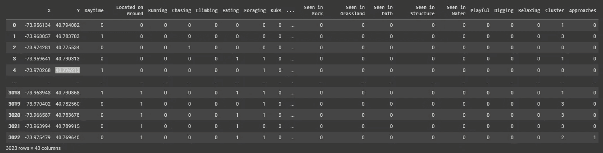

清理、工程化和预处理的松鼠普查数据集。图像由作者提供。

首先，我们需要创建我们的训练集和测试集。在进行拆分时需要记住的一点是，我们必须使用目标变量进行分层拆分，因为数据集严重不平衡。分层拆分将保留每个类别的样本百分比。

```py
# Assuming squirrel_df is your DataFrame and 'Approaches' is the target variable
X = squirrel_df.drop('Approaches', axis=1)  # Features
y = squirrel_df['Approaches']  # Target

# Stratify the split to maintain the class distribution in train and test sets
X_train, X_test, y_train, y_test = train_test_split(X, y, test_size=0.2, random_state=42, stratify=y)
```

鉴于数据集的不平衡性，我考虑使用数据增强技术。然而，我将这些内容留待未来的迭代，因为引入合成样本可能会带来其他复杂情况，而且根据我的经验，这些样本通常泛化效果不佳。

在此期间，我将通过在训练模型时使用平衡权重来处理不平衡问题。关于指标，我将关注接收者操作特征曲线下面积（ROC-AUC）得分和精确度召回曲线下面积（PR-AUC）得分。特别是 PR-AUC 得分在不平衡分类问题中很有用，因为它关注少数类，而 ROC 曲线则涵盖了两个类别。

我对决策树和随机森林模型进行了网格搜索。我使用了 5 折分层交叉验证，因为我想在分割间保留类别百分比。我还使用了 PR-AUC 和 ROC-AUC 作为超参数调优过程中的优化指标。对于随机森林，我查看了 n_estimators、max_depth、min_samples_split 和 min_samples_leaf，使用了保守的数值范围。随机森林超参数调优的代码如下所示：

```py
from sklearn.model_selection import GridSearchCV, StratifiedKFold
from sklearn.ensemble import RandomForestClassifier
from sklearn.metrics import make_scorer, average_precision_score, roc_auc_score

# Define the parameter grid for Random Forest
rf_param_grid = {
    'n_estimators': [50, 100, 200, 500],  # Number of trees in the forest
    'max_depth': [None, 5, 10, 20],  # Maximum depth of the tree
    'min_samples_split': [2, 5, 7, 10],  # Minimum number of samples required to split a node
    'min_samples_leaf': [1, 3, 5, 10]  # Minimum number of samples required at each leaf node
}

# Initialize Stratified K-Fold
stratified_kfold = StratifiedKFold(n_splits=5, shuffle=True, random_state=42)

# Define multiple scoring metrics
scoring_metrics = {
    'PR-AUC': make_scorer(average_precision_score, needs_proba=True),
    'ROC-AUC': 'roc_auc'
}

# Initialize the GridSearchCV object with Stratified K-Fold
rf_grid_search = GridSearchCV(
    estimator=RandomForestClassifier(random_state=42, class_weight='balanced'),
    param_grid=rf_param_grid,
    cv=stratified_kfold,  # Using Stratified K-Fold here
    scoring=scoring_metrics,
    refit='PR-AUC',
    n_jobs=-1,
    verbose=2
)

rf_grid_search.fit(X_train, y_train)

# Best parameters and scores
print("Best parameters for Random Forest:", rf_grid_search.best_params_)
print("Best PR-AUC score:", rf_grid_search.best_score_)

# To access the results for each metric
cv_results = rf_grid_search.cv_results_

# Find the index of the best score based on the refit criterion
best_index = rf_grid_search.best_index_

# Display the best hyperparameters and corresponding scores
print("Best Hyperparameters:", rf_grid_search.best_params_)
print(f"Best Mean Test PR-AUC: {cv_results['mean_test_PR-AUC'][best_index]:.4f}")
print(f"Best Mean Test ROC-AUC: {cv_results['mean_test_ROC-AUC'][best_index]:.4f}")
```

对于决策树，我也使用了小范围的 max_depth、min_samples_split 和 min_samples_leaf 值。决策树超参数调优的代码如下所示：

```py
from sklearn.model_selection import GridSearchCV, StratifiedKFold
from sklearn.tree  import DecisionTreeClassifier
from sklearn.metrics import make_scorer, average_precision_score, roc_auc_score

# Define the parameter grid for Decision Tree
dt_param_grid = {
    'max_depth': [10, 20, None],  # Maximum depth of the tree
    'min_samples_split': [2, 5],  # Minimum number of samples required to split a node
    'min_samples_leaf': [1, 2]  # Minimum number of samples required at each leaf node
}

# Initialize Stratified K-Fold
stratified_kfold = StratifiedKFold(n_splits=5, shuffle=True, random_state=42)

# Define multiple scoring metrics
scoring_metrics = {
    'PR-AUC': make_scorer(average_precision_score, needs_proba=True),
    'ROC-AUC': 'roc_auc'
}

# Initialize the GridSearchCV object with Stratified K-Fold
dt_grid_search  = GridSearchCV(
    estimator=DecisionTreeClassifier(random_state=42, class_weight='balanced'),
    param_grid=dt_param_grid,
    cv=stratified_kfold,  # Using Stratified K-Fold here
    scoring=scoring_metrics,
    refit='PR-AUC',
    n_jobs=-1,
    verbose=2
)

dt_grid_search.fit(X_train, y_train)

# Best parameters and scores
print("Best parameters for Decision Tree:", dt_grid_search.best_params_)
print("Best PR-AUC score:", dt_grid_search.best_score_)

# To access the results for each metric
dt_cv_results = dt_grid_search.cv_results_

# Find the index of the best score based on the refit criterion
best_index = dt_grid_search.best_index_

# Display the best hyperparameters and corresponding scores
print("Best Hyperparameters:", dt_grid_search.best_params_)
print(f"Best Mean Test PR-AUC: {dt_cv_results['mean_test_PR-AUC'][best_index]:.4f}")
print(f"Best Mean Test ROC-AUC: {dt_cv_results['mean_test_ROC-AUC'][best_index]:.4f}")
```

# 评估和解释模型

在评估最佳随机森林和决策树模型在高度不平衡数据集上的表现时，我观察到了 ROC-AUC 和 PR-AUC 评分的明显差异。随机森林模型以 0.91 的 ROC-AUC 得分表现优异，显著超过了决策树 0.77 的体面得分。这表明其在区分类别方面的能力更强。然而，由于 PR-AUC 评分在不平衡数据集的背景下关注精确度与召回率的平衡，结果却有所不同。两个模型的 PR-AUC 得分都超过了‘无技能’分类器的基线表现（该分类器在所有情况下都预测主要类别），但在精确度和召回率上仍有改进空间：随机森林的 PR-AUC 得分为 0.46，而决策树仅为 0.20。这些结果强调了在不平衡场景下将 PR-AUC 作为目标指标的重要性，并建议了未来改进的方向，如尝试不同的类别不平衡缓解技术、调整决策阈值或探索更适合不平衡数据的算法。

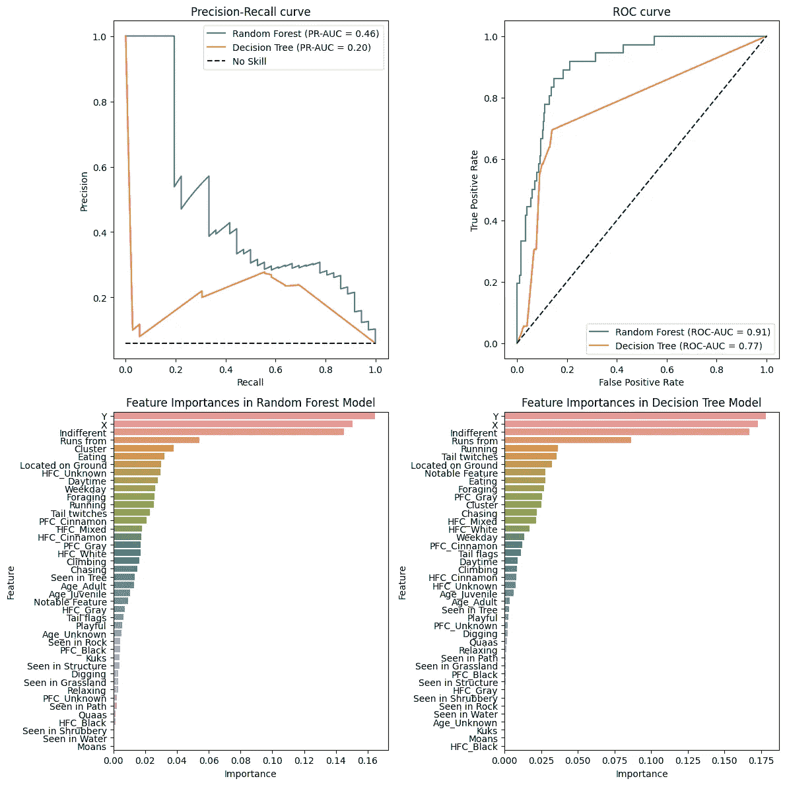

随机森林和决策树模型在松鼠普查数据上的训练和超参数调优结果。图片由作者提供。

特征重要性分析还显示，纬度、经度和 Indifferent 是对模型预测贡献最大的主要特征。这一点通过两种模型的 SHAP 值图进一步得到了支持。

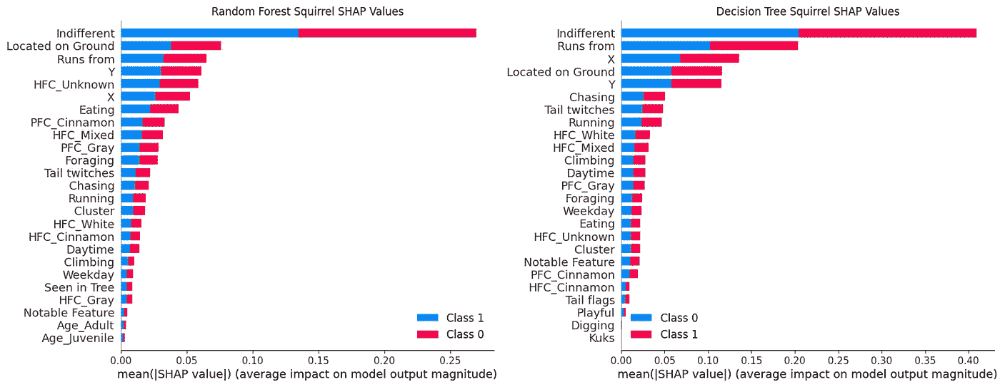

随机森林和决策树模型在松鼠普查数据集上的 SHAP 值。图片由作者提供。

随机森林和决策树模型的概率分布如下所示。直方图显示了预测概率的分布，峰值在 0.1 到 0.2 之间，并有一个长尾延伸至 0.8。这表明随机森林模型倾向于预测许多实例为低概率正类，但存在不确定性，因为它没有在 0 或 1 附近达到峰值。较高概率的尾部存在，表明模型对某些预测有一定的信心，但总体上预测较为谨慎，因为概率并未集中在 0 或 1 附近。决策树直方图显示了在概率 0 处极为集中的分布，以及很少有概率为 1 的实例。这表明模型对大多数实例属于负类非常自信。缺乏中间概率的实例表明决策树模型的预测非常确定——它要么非常确信一个实例是正类，要么非常确信它不是。这是决策树的典型特征，因为它们往往会产生更极端的概率估计。

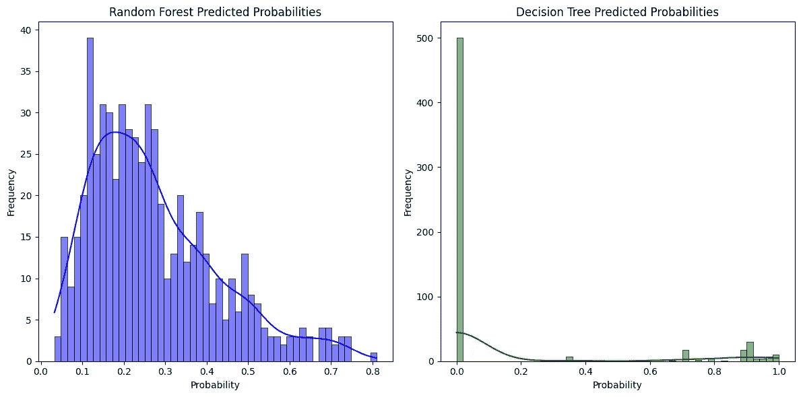

随机森林和决策树模型在松鼠普查数据上的概率分布。图片由作者提供。

随机森林模型可能会更好地进行校准，因为它提供了更平滑的概率分布，并不像决策树那样趋向极端。决策树的极端自信可能是过拟合的迹象，即模型过于精确地学习了训练数据，包括噪声，从而导致过于自信的预测。两个模型都没有显示出理想的双峰分布，这会表明在区分类别方面的高自信。这可能表明模型没有完美地捕捉到潜在模式，可能需要进一步调优、添加特征或采用更复杂的建模技术。我当然可以多尝试一些特征，但我会将其留到将来的迭代中。因此，我决定对表现更好的随机森林模型进行概率校准是一个好的下一步。

# 校准模型

校准机器学习模型是调整预测概率以更好地与数据中的观测频率对齐的过程。这是一个在训练模型时常常被忽视的步骤，限制了其可用性。校准模型很重要，因为机器学习模型的原始估计可能无法表示事件的真实可能性。如果你的模型用于任何类型的决策过程（特别是那些涉及高风险的），这一点尤为关键。此外，如果你的概率经过良好校准，这也可以使不同模型之间的比较更具意义。

为了进行校准，我使用了 Platt Scaling（也称为 Sigmoid 校准）。该方法将逻辑回归模型拟合到分类器的输出。基本工作流程如下：

1.  训练模型

1.  划分数据

1.  拟合校准模型

1.  评估校准

该过程的代码如下所示。

```py
from sklearn.calibration import CalibratedClassifierCV
from sklearn.model_selection import train_test_split
from sklearn.metrics import brier_score_loss
from sklearn.calibration import calibration_curve
import matplotlib.pyplot as plt

# Split your data into training and calibration sets
X_train_2, X_calib, y_train_2, y_calib = train_test_split(X_train, y_train, test_size=0.2)

# Fit the model on the training data
best_rf_classifier.fit(X_train_2, y_train_2)

# Calibrate the model on the calibration data
# Using Platt scaling (method='sigmoid') or Isotonic regression (method='isotonic')
calibrated_rf  = CalibratedClassifierCV(estimator=best_rf_classifier, method='isotonic', cv='prefit')
calibrated_rf.fit(X_calib, y_calib)

# Now you can use calibrated_model to make predictions with calibrated probabilities
calibrated_probs = calibrated_rf.predict_proba(X_test)

# Predict probabilities on the test set
brier_probs = calibrated_rf.predict_proba(X_test)[:, 1]

# Evaluate calibration performance
brier_score = brier_score_loss(y_test, brier_probs)
print(f"Brier score: {brier_score:.4f}")

# Get the calibrated probabilities for the positive class
prob_true, prob_pred = calibration_curve(y_test, calibrated_probs[:, 1], n_bins=20)
```

校准结果如下所示。一个完全校准的模型应将所有点精确地位于橙色曲线之上。总体而言，概率校准较好，唯一的显著例外是在 ~ 0.25 处，模型明显低估了概率。此外，我还计算了校准过程中的 Brier 分数。Brier 分数范围在 0 和 1 之间，0 代表完美准确，1 代表完全不准确。此次校准的 Brier 分数为 0.0445，比较低，因此表现良好。

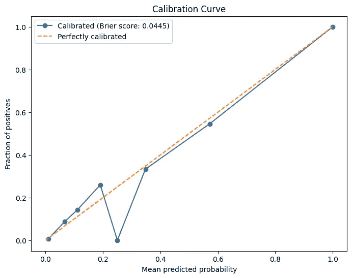

使用 Platt scaling 对随机森林模型进行概率校准。图片来源于作者。

尽管我可以对这一过程进行进一步改进，但这将是我在未来的迭代中精细化的内容。目前，我会简单地保存模型并继续。

```py
import joblib

# Save the model to a file
joblib.dump(calibrated_rf, '/content/drive/MyDrive/SquirrelML/cal_Squirrel_RF.pkl')
```

# 将模型部署为 Streamlit 应用

尽管有很多机器学习模型被创建，但遗憾的是，很多都被束之高阁。我认为，无论你在进行 ML 项目时都应有一种方式，使你的模型能够被部署并被人们使用。这样，即使只是像我这里做的那种简单应用，你的工作也有机会得到认可，发挥更大的作用。我发现人们通常会更记得你的工作，如果他们能以某种方式与之互动（这对于求职时尤其有用）。将模型部署为 Streamlit 应用是一种很好地展示你工作的方式。

这个应用的基本前提是给用户提供各种功能的操作体验，用于训练模型并输出一个松鼠接近他们的概率。模型的输入之一是用户的经纬度。用户可以直接在应用中输入这些数据，不过，我还使用了 Folium 来包含一个交互式地图，初始时中心定位在中央公园，并且当你点击地图上的位置时，会显示该位置的经纬度。

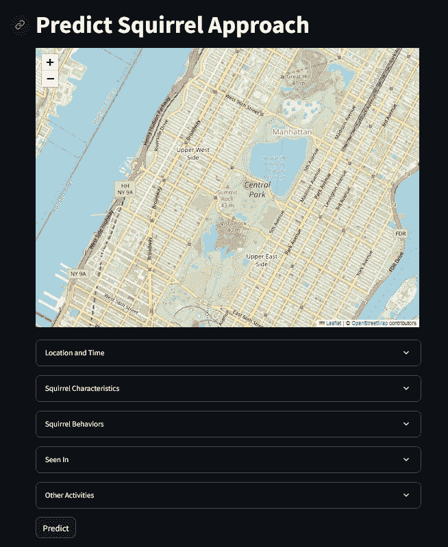

SquirrelML Streamlit 应用，用于预测中央公园松鼠的接近情况。图像由作者提供。

用户可以在下拉菜单中尝试不同的功能，一旦他们配置好所需的功能，可以点击预测按钮。点击预测按钮将返回松鼠接近概率（SAP）以及一张附带的图片（如果概率超过 50%，则会是一只开心的松鼠；如果概率等于或低于 50%，则会是一只伤心的松鼠图片）。你可以在下面看到一个示例输出：

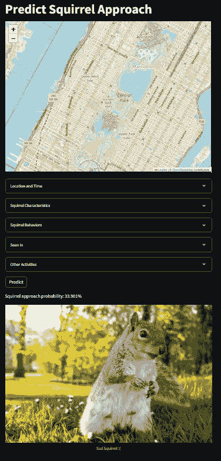

# 结论

这是一个有趣的小项目。模型当然可以改进，我可能会在未来重新审视以进一步优化。例如，我可以尝试将我的 PCA 分析结果与 SHAP 值结合使用，尝试将数据集的维度降至核心特征。还有一些与松鼠普查相关的数据集，包含了如垃圾量、活动水平、观察时长和天气条件等信息。我在处理完数据后才发现这些数据集，但我很希望将它们整合到我的模型中，因为它们似乎很有用。这些数据集可以在 NYCOpenData 的[这里](https://data.cityofnewyork.us/Environment/2018-Central-Park-Squirrel-Census-Hectare-Data/ej9h-v6g2)和[这里](https://data.cityofnewyork.us/Environment/2018-Central-Park-Squirrel-Census-Stories/gfqj-f768)找到。我还可以尝试使用数据增强技术。

一如既往，希望你喜欢我的工作，谢谢阅读！

来自 NYCOpenData 的所有数据在使用上没有限制。请查看以下链接了解其[常见问题](https://opendata.cityofnewyork.us/faq/)和[使用条款](https://opendata.cityofnewyork.us/overview/#termsofuse)。
