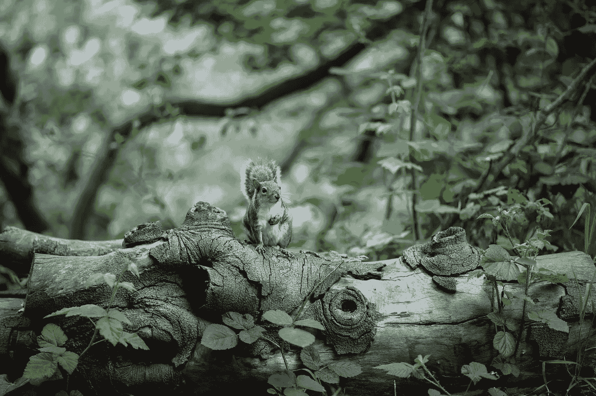

# SquirrelML：预测纽约中央公园的松鼠接近行为

> 原文：[`towardsdatascience.com/squirrelml-predicting-squirrel-approach-in-nycs-central-park-8c3719d8ff65?source=collection_archive---------6-----------------------#2023-12-20`](https://towardsdatascience.com/squirrelml-predicting-squirrel-approach-in-nycs-central-park-8c3719d8ff65?source=collection_archive---------6-----------------------#2023-12-20)

## 通过机器学习探索纽约中央公园松鼠的行为：聚类观察和预测互动洞察

 [Victor Murcia](https://victormurcia-53351.medium.com/?source=post_page-----8c3719d8ff65--------------------------------)

·

[关注](https://medium.com/m/signin?actionUrl=https%3A%2F%2Fmedium.com%2F_%2Fsubscribe%2Fuser%2F5a3b921bcf52&operation=register&redirect=https%3A%2F%2Ftowardsdatascience.com%2Fsquirrelml-predicting-squirrel-approach-in-nycs-central-park-8c3719d8ff65&user=Victor+Murcia&userId=5a3b921bcf52&source=post_page-5a3b921bcf52----8c3719d8ff65---------------------post_header-----------) 发表在 [Towards Data Science](https://towardsdatascience.com/?source=post_page-----8c3719d8ff65--------------------------------) ·18 分钟阅读·2023 年 12 月 20 日

--

图片来源：[Tj Holowaychuk](https://unsplash.com/@tjholowaychuk?utm_content=creditCopyText&utm_medium=referral&utm_source=unsplash) 于 [Unsplash](https://unsplash.com/photos/brown-and-white-squirrel-on-brown-tree-trunk-D18ZnjlhVqM?utm_content=creditCopyText&utm_medium=referral&utm_source=unsplash)

[NYCOpenData](http://opendata.cityofnewyork.us/) 拥有丰富有趣的数据集，涵盖健康、环境、商业和教育等主题。我偶然发现了 [2018 Central Park Squirrel Census](https://data.cityofnewyork.us/Environment/2018-Central-Park-Squirrel-Census-Squirrel-Data/vfnx-vebw) 数据集，并立即知道我必须利用它。这个数据集记录了在中央公园由志愿者在两周内收集的松鼠目击信息。在查看数据字典后，我被一个名为‘Approaches’的特征吸引，它表示是否观察到松鼠接近人类。我觉得训练一个机器学习（ML）模型来帮助我判断在中央公园范围内的松鼠是否会接近我，会很有趣。本文将介绍这个周末项目，详细描述了构建该模型的整个过程。这个项目涉及到很多内容：地理空间数据处理、聚类、可视化、特征工程、非结构化文本、模型训练、模型校准和模型部署。

我将模型部署在一个 streamlit 应用中，你可以输入你的坐标…
