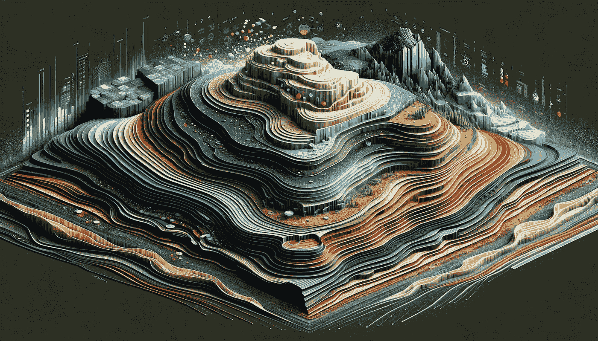

# 如何通过堆叠集成方法在欧洲最大机器学习比赛中取得前 10%的成绩

> 原文：[`towardsdatascience.com/stacked-ensembles-for-advanced-predictive-modeling-with-h2o-ai-and-optuna-8c339f8fb602?source=collection_archive---------0-----------------------#2023-12-18`](https://towardsdatascience.com/stacked-ensembles-for-advanced-predictive-modeling-with-h2o-ai-and-optuna-8c339f8fb602?source=collection_archive---------0-----------------------#2023-12-18)

## 一份关于如何使用 H2O.ai 和 Optuna 训练堆叠集成模型的概念性与实操编码指南

 [Sheila Teo](https://medium.com/@sheilateozy?source=post_page-----8c339f8fb602--------------------------------)

·

[关注](https://medium.com/m/signin?actionUrl=https%3A%2F%2Fmedium.com%2F_%2Fsubscribe%2Fuser%2Ffca9db1c7da0&operation=register&redirect=https%3A%2F%2Ftowardsdatascience.com%2Fstacked-ensembles-for-advanced-predictive-modeling-with-h2o-ai-and-optuna-8c339f8fb602&user=Sheila+Teo&userId=fca9db1c7da0&source=post_page-fca9db1c7da0----8c339f8fb602---------------------post_header-----------) 发布于 [Towards Data Science](https://towardsdatascience.com/?source=post_page-----8c339f8fb602--------------------------------) ·13 分钟阅读·2023 年 12 月 18 日

--

图像由 DALL·E 3 生成

我们都知道，集成模型在预测建模中优于任何单一模型。你可能听说过 Bagging 和 Boosting 这两种常见的集成方法，以随机森林和梯度提升机作为各自的例子。

那么将不同模型组合在一起，并在更高层次的模型下进行集成呢？这就是堆叠集成的用武之地。**本文是关于如何使用流行的机器学习库 H2O 训练堆叠集成的逐步指南。**

为了展示堆叠集成的强大功能，我将提供一个完整代码的演示，该代码用于训练一个由 40 个深度神经网络、XGBoost 和 LightGBM 模型组成的堆叠集成，用于预测 2023 年 Cloudflight 编程竞赛（人工智能类别）中的任务，这是欧洲最大的编程竞赛之一，在训练时间仅 1 小时内我在竞赛排行榜上名列前 10%！

**本指南将涵盖：**

1.  **什么是堆叠集成，它们是如何工作的？**

1.  **如何使用 H2O.ai 训练堆叠集成** **—

    与 a**…
