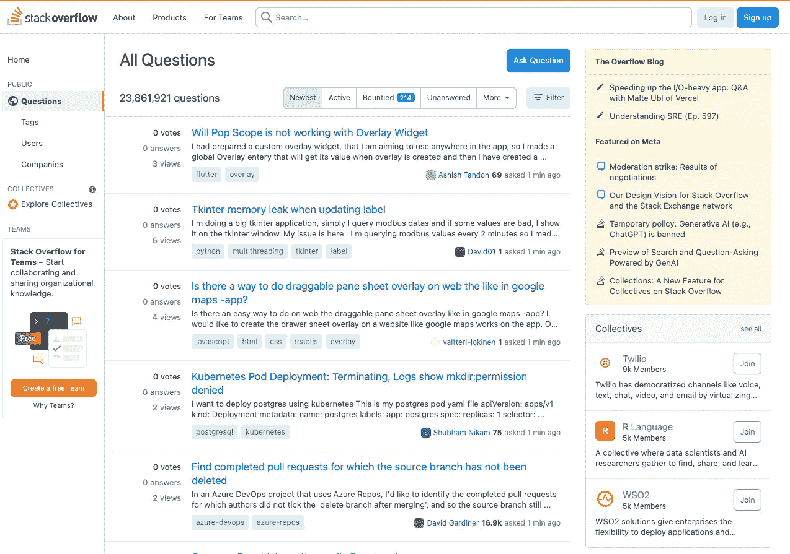
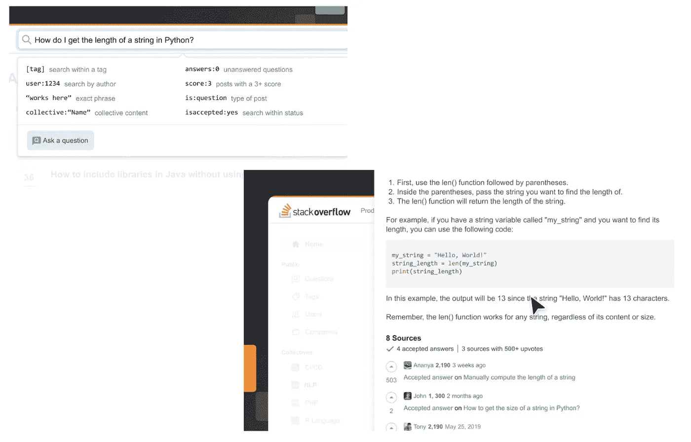
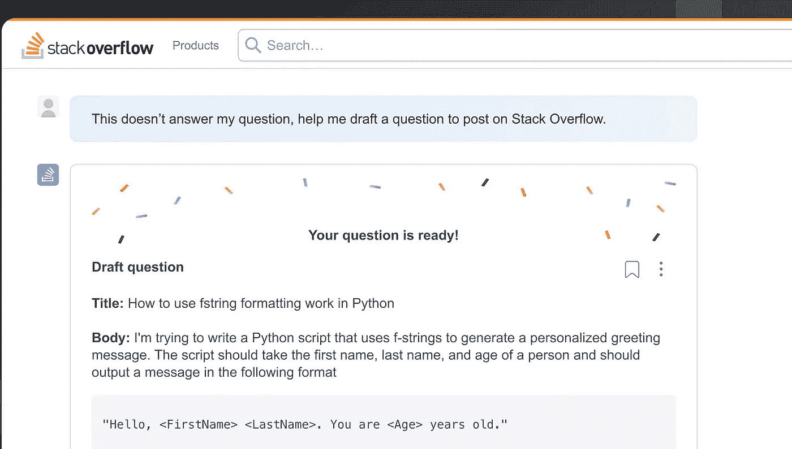
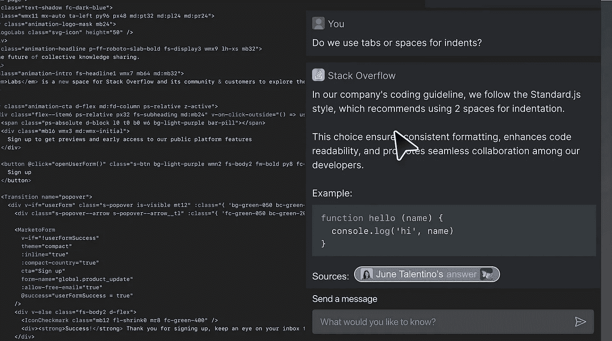
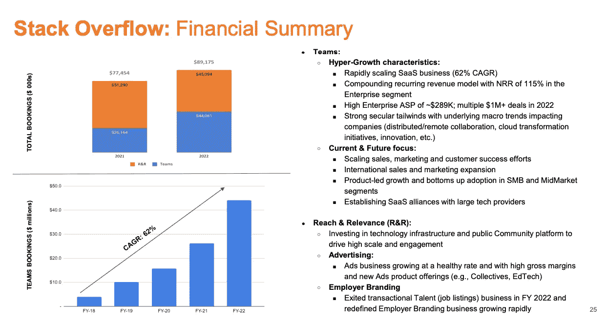

# StackOverflow 的转型：从颠覆到机遇

> 原文：[`towardsdatascience.com/stackoverflows-pivot-from-disruption-to-opportunity-8831dfbd9df?source=collection_archive---------10-----------------------#2023-08-14`](https://towardsdatascience.com/stackoverflows-pivot-from-disruption-to-opportunity-8831dfbd9df?source=collection_archive---------10-----------------------#2023-08-14)

## *OverFlowAI 利用公司的核心资产，将答案呈现在一个可用的界面中，并创建一个生成 AI 循环来创造新内容*

 [Viggy Balagopalakrishnan](https://medium.com/@viggybala?source=post_page-----8831dfbd9df--------------------------------)

·

[关注](https://medium.com/m/signin?actionUrl=https%3A%2F%2Fmedium.com%2F_%2Fsubscribe%2Fuser%2Fb3366eb9a0cf&operation=register&redirect=https%3A%2F%2Ftowardsdatascience.com%2Fstackoverflows-pivot-from-disruption-to-opportunity-8831dfbd9df&user=Viggy+Balagopalakrishnan&userId=b3366eb9a0cf&source=post_page-b3366eb9a0cf----8831dfbd9df---------------------post_header-----------) 发表在 [Towards Data Science](https://towardsdatascience.com/?source=post_page-----8831dfbd9df--------------------------------) ·9 min read·2023 年 8 月 14 日

--

图片来源：[Pakata Goh](https://unsplash.com/@pakata?utm_source=medium&utm_medium=referral) 在 [Unsplash](https://unsplash.com/?utm_source=medium&utm_medium=referral)

随着像 GPT4 这样的高效模型推动生成性 AI 的发展，数据专业人士如何为他们所参与的组织提供长期价值正在演变。真正的价值不仅来自于成为房间里最具技术能力的人，还包括能够塑造这些技术如何影响产品和业务成果。这包括能够引导你的组织制定正确的数据战略，并塑造数据产品如何无缝地融入产品体验。本文对 StackOverflow 变革的分析提供了一个有力的案例研究，以实现这一目标。

[StackOverflow](https://stackoverflow.com/) 是软件开发人员获取编程支持的最常用平台，最近经历了一些波折。如果你以前没有使用过 StackOverflow，它是一个类似于 Quora 或 Reddit 的问答论坛，你可以在这里提出与编程相关的问题。虽然我已经好几年没有写过生产级代码，但在我写代码的时候，StackOverflow 确实非常棒。例如，如果你在编译代码时遇到了最晦涩的错误，并且收到了一条你无法理解的错误消息，你会将其放入 Google 搜索中。通常，你会找到一个 StackOverflow 页面，上面有人问了同样的问题并得到了回答。更少见的是，你会发现另一个人遇到了完全相同的晦涩问题但没有得到答案——在这种情况下，祝好运。更准确地说，[69% 的问题](https://devclass.com/2023/05/15/stack-overflow-traffic-drops-as-developers-turn-to-ai-coding-assistants/) 在 StackOverflow 上得到了回答，这确实很令人印象深刻。

[StackOverflow 首页](https://stackoverflow.com/questions)

然而，最近 StackOverflow 的流量一直在下降。Similarweb 的数据表明，他们的流量 [同比下降了 14%](https://www.similarweb.com/blog/insights/ai-news/stack-overflow-chatgpt/)（StackOverflow 表示 [更接近 5%](https://stackoverflow.blog/2023/08/08/insights-into-stack-overflows-traffic/)）。尽管如此，这一趋势仍然是下降的，主要原因是 AI 编程产品如 ChatGPT 和 GitHub Copilot 的出现。这些产品具有有意义的代码编写能力，因此能够提供编程支持，至少在某种程度上不亚于 StackOverflow。具有讽刺意味的是，支撑这些 AI 产品的几个大型语言模型（LLMs）是使用爬取的 StackOverflow 数据进行训练的。

这些发展使得公司受到了相当严厉的媒体报道。Business Insider 在他们的文章 [死亡于 LLM](https://www.businessinsider.com/stack-overflow-crisis-future-of-online-data-ai-world-2023-7) 中写道：

> 欢迎来到 AI 世界中的互联网未来。像 Stack Overflow 和 Wikipedia 这样的在线社区曾作为专家和好奇浏览者聚集并自由分享信息的中心而繁荣。现在，这些数字聚会场所正被大科技公司掠夺，用于训练他们的大型语言模型。
> 
> 从这次生成型 AI 繁荣中出现的新产品正在使这些在线论坛的未来充满疑问。聊天机器人可以清晰、自动且通常愉快地回答问题——因此人们无需与其他人接触即可获取信息。

在所有这些关注中，StackOverflow 采取了稳健的措施，并阐明了他们应对这一挑战的双管齐下的方法：

1.  几周前，他们宣布将开始向使用平台上 5000 万+ 问题和答案进行模型训练的大型 AI 开发者收费（我们在之前的[数据抓取](https://thisisunpacked.substack.com/p/data-scraping-in-the-spotlight-language-models)文章中讨论了这个问题）

1.  上周，他们推出了[OverflowAI](https://www.cio.com/article/648086/stack-overflow-announces-overflowai.html)产品，这是一组实际有用的生成型 AI 功能，可以帮助他们开启第二个篇章——我们今天将重点关注这一点

在本文中，我们将深入探讨：

+   AI 代码编写工具颠覆 StackOverflow

+   OverflowAI 的功能

+   StackOverflow 策略中的潜在趋势

# AI 代码编写工具颠覆 StackOverflow

当前市场上有几种 AI [代码编写和编辑工具](https://beebom.com/best-ai-coding-tools/)。这些工具要么是独立的产品（如 OpenAI Codex、ChatGPT、Google Bard），要么是原生集成在现有平台中的产品（如 GitHub Copilot、Replit Ghostwriter、Amazon CodeWhisperer）。它们具有广泛的功能，包括代码生成、代码编辑、自动完成和调试。

原生分发的产品（如 GitHub Copilot）具有很大的优势，因为它们可以在程序员今天已经使用的环境中无缝操作，我们将看到更多产品尝试集成到现有环境中。例如，CodeGPT 有一个插件，可以让开发人员从[Visual Studio Code](https://beebom.com/how-install-use-codegpt-vs-code/)（一个流行的代码编辑工具）中使用该产品。

现有的 AI 代码编写工具在某些任务上表现良好。例如，这个[Reddit 线程](https://www.reddit.com/r/webdev/comments/11hmsqp/github_copilot_whats_your_experience_been_like/)记录了几位网页开发人员关于 GitHub Copilot 的反馈——总体主题是，该产品在开发人员需要编写全新代码并且不想从头开始编写的特定情况下非常有用。即便在这些情况下，它也经常会有成功和失败。

原因并不令人惊讶。从概念上讲，**大型语言模型（LLMs）接收大量数据，并基于这个结构生成输出：在特定上下文中，对于你问的问题，最可能的单词/文本是什么**。它本质上是在计算一个单词跟随另一个单词的概率，并基于此生成输出。尽管有这一结构，鉴于用于训练这些模型的数据量，ChatGPT 在更一般的用例（如起草电子邮件或总结页面）中的结果仍然令人印象深刻。但重要的是要记住，语言模型在设计上具有有限的分析/数学能力。换句话说，当你问模型“2+2 是多少”时，它可能会给出正确答案——不是因为它知道数学，而是因为它在训练数据中见过这个文本模式。

同样，在代码生成方面，**模型并不真正“了解”编程背后的基本概念**，而是基于大量文本数据的训练来预测结果。这导致了上面提到的 GitHub Copilot 反馈——它有时能生成你需要的基础代码，但**其实际理解代码、调试和提供解释的能力有限**。这随着时间的推移会有所改善，但很难说它是否会达到高准确性/高可靠性的程度。

StackOverflow CEO Prashanth Chandrasekar [简洁地描述了](https://devclass.com/2023/05/15/stack-overflow-traffic-drops-as-developers-turn-to-ai-coding-assistants/)：

> 现代 LLM 系统的一个问题是，它们会以与正确答案相同的信心提供错误答案，并且如果感觉符合用户寻求的答案模式，它们会“虚构”事实和数据。
> 
> 在某些时候，你需要了解自己在构建什么。你可能需要调试它，但对刚刚构建的内容毫无头绪，并且很难通过捷径跳过学习过程。

这就是 StackOverflow 的机会——他们的流量下降可能是永久性的，程序员可能更少地访问 StackOverflow 以解决简单问题（例如，他们可能不再访问 StackOverflow 以获取现成的排序算法）。但**产品能够闪光的地方**是：1）对语言模型可能无法回答的复杂问题提供**高准确性/高可靠性答案**，以及 2）对语言模型没有先前数据进行训练的新技术/问题领域提供**答案**。OverflowAI 的设计就是为了直接抓住这个机会。

# OverflowAI 的作用

他们押注的三个关键方面是——直接回答问题、在开发环境中的可用性，以及提升企业内的知识。

**OverflowAI 搜索**提供了**以问答格式直接回答用户**（类似于 ChatGPT），但提供了多个**实际 StackOverflow 帖子的链接**。除了帮助建立信任外，这还为用户提供了深入了解的机会，当 AI 提供的答案无法完全解决用户的问题时。这在简单问题时提供直接答案，而在复杂问题时引导用户沿着更探索性的路径前进，达到了微妙的平衡。

OverflowAI 搜索（来源：[OverflowAI 演示视频](https://stackoverflow.blog/2023/07/27/announcing-overflowai/)）

如果用户对回应不满意，他们可以进入一个**聊天式界面以询问后续问题**。如果答案都不令人满意，他们可以请求 StackOverflow**代他们起草问题**，准备好发布到问答论坛。这种体验还能避免用户提问时，问题已经被回答过的半常见情况。

自动问题草稿（来源：[OverflowAI 演示视频](https://stackoverflow.blog/2023/07/27/announcing-overflowai/)）

该产品还通过扩展**在 Visual Studio Code 中提供所有这些功能**，进一步提升了可用性。这帮助 StackOverflow 更有效地与原生集成的编码助手竞争，使开发人员能够在编码环境中获取答案（而不是需要切换上下文并从浏览器中搜索）。

Visual Studio Code 内的扩展（来源：[OverflowAI 演示视频](https://stackoverflow.blog/2023/07/27/announcing-overflowai/)）

除此之外，对于企业客户，OverflowAI 正在创建将**公司内部多个不同信息来源**（内部问答、维基页面、文档库）集成的能力，为开发人员提供一个连贯的问答体验。能够利用内部和 StackOverflow 数据，并且将其轻松地展示在问答式界面中，对于工程组织来说，可以大大提高生产力。他们还计划推出一个 Slack 集成，以无缝界面展示这一功能。

OverFlowAI 的产品方法令人印象深刻，它利用公司核心资产（对难题的回答），在用户所在的任何地方（无论是 Slack 还是开发环境中）提供高度可用的界面，并创造了一个用户可以利用生成式 AI 提交新问题的循环。

# StackOverflow 策略中的潜在趋势

StackOverflow 并不是一个公开上市的公司——它由 Prosus 所拥有，Prosus 又是更大控股公司 Naspers 的一部分，而 Naspers 是上市公司。因此，很难获得准确的收入数据，但 Prosus 在[2022 年 5 月](https://www.naspers.com/~/media/Files/N/Naspers-Corp-V2/investor/results-reports-events/results-reports-and-events-archive/deepdive-call-series/edtech/edtech-deep-dive-presentation.pdf)发布的报告提供了一些线索：

+   公司在 2022 年的收入约为 8900 万美元，其中 50%来自企业产品 StackOverflow for Teams，50% 来自 Reach 产品（广告和雇主品牌）。

+   从 2021 年到 2022 年，StackOverflow for Teams 的收入增长了 69%，而 Reach 产品的收入下降了 12%（2022 年的收入可能受到其他因素的影响，如招聘放缓）。

来自 StackOverflow 所有者 Prosus 的收入数据（[报告于 2022 年 5 月](https://www.naspers.com/~/media/Files/N/Naspers-Corp-V2/investor/results-reports-events/results-reports-and-events-archive/deepdive-call-series/edtech/edtech-deep-dive-presentation.pdf)）

这些收入数据结合 OverflowAI 产品的功能指向了 StackOverflow 在生成式 AI 领域的发展趋势（这些趋势也可以扩展到其他问答平台）：

1.  他们的广告业务，其成功直接与流量挂钩，正在下滑。这并不一定意味着严重问题，只是指出了一个更广泛的趋势——消费者会直接获得更简单问题的答案（这很好），因此**广告成为了一个不那么关键的收入来源**。

1.  StackOverflow 将**继续成为解决困难问题的宝贵来源**，并且问题和答案的数量将随着公司推动生成式 AI 自动草拟/提交问题而继续增长。此外，如果 StackOverflow 能够维持内容引擎的运转，**平台上的内容质量将会提高**，因为重复/简单的问题将不再是内容的最高量。

1.  StackOverflow 将**加倍努力构建能够为用户提供最大价值的体验**（如 OverflowAI 搜索和 Visual Studio Code 扩展），并专注于那些客户愿意为这些优质体验付费的产品线（例如 StackOverflow for Teams）。

1.  **数据许可项目**，即他们向 AI 公司收费以用于培训其数据，将会加速发展。

所有趋势都指向一个方向，即 StackOverflow 正在成功转型进入公司下一个阶段，公司已经做出了正确的产品/业务投资，以应对可能的干扰。此外，他们还提供了宝贵的社区服务，并为其他问答平台制定了可供借鉴的操作手册。总体来说，我对他们的发展方向感到乐观，并相信这将激发未来蓬勃发展的内容生态系统。

🚀 如果你喜欢这篇文章，可以考虑订阅[**我的每周通讯**](https://thisisunpacked.substack.com/)**。** 每周，我会发布一篇**深度分析**关于**当前技术话题/产品策略**的文章，阅读时间约为 10 分钟。最好的祝愿，Viggy。

[Unpacked | Viggy Balagopalakrishnan | Substack](https://thisisunpacked.substack.com/?source=post_page-----8831dfbd9df--------------------------------)

### 对当前技术和商业话题的深入分析，帮助你保持领先地位。每周送到你的收件箱…

[Unpacked | Viggy Balagopalakrishnan | Substack](https://thisisunpacked.substack.com/?source=post_page-----8831dfbd9df--------------------------------)
