# 时间序列的平稳性——全面指南

> 原文：[`towardsdatascience.com/stationarity-in-time-series-a-comprehensive-guide-8beabe20d68`](https://towardsdatascience.com/stationarity-in-time-series-a-comprehensive-guide-8beabe20d68)

## 如何在 Python 中检查时间序列是否平稳，以及如果非平稳时可以做什么

[](https://medium.com/@iamleonie?source=post_page-----8beabe20d68--------------------------------)[](https://towardsdatascience.com/?source=post_page-----8beabe20d68--------------------------------) [Leonie Monigatti](https://medium.com/@iamleonie?source=post_page-----8beabe20d68--------------------------------)

·发表于[Towards Data Science](https://towardsdatascience.com/?source=post_page-----8beabe20d68--------------------------------) ·8 分钟阅读·2023 年 4 月 11 日

--

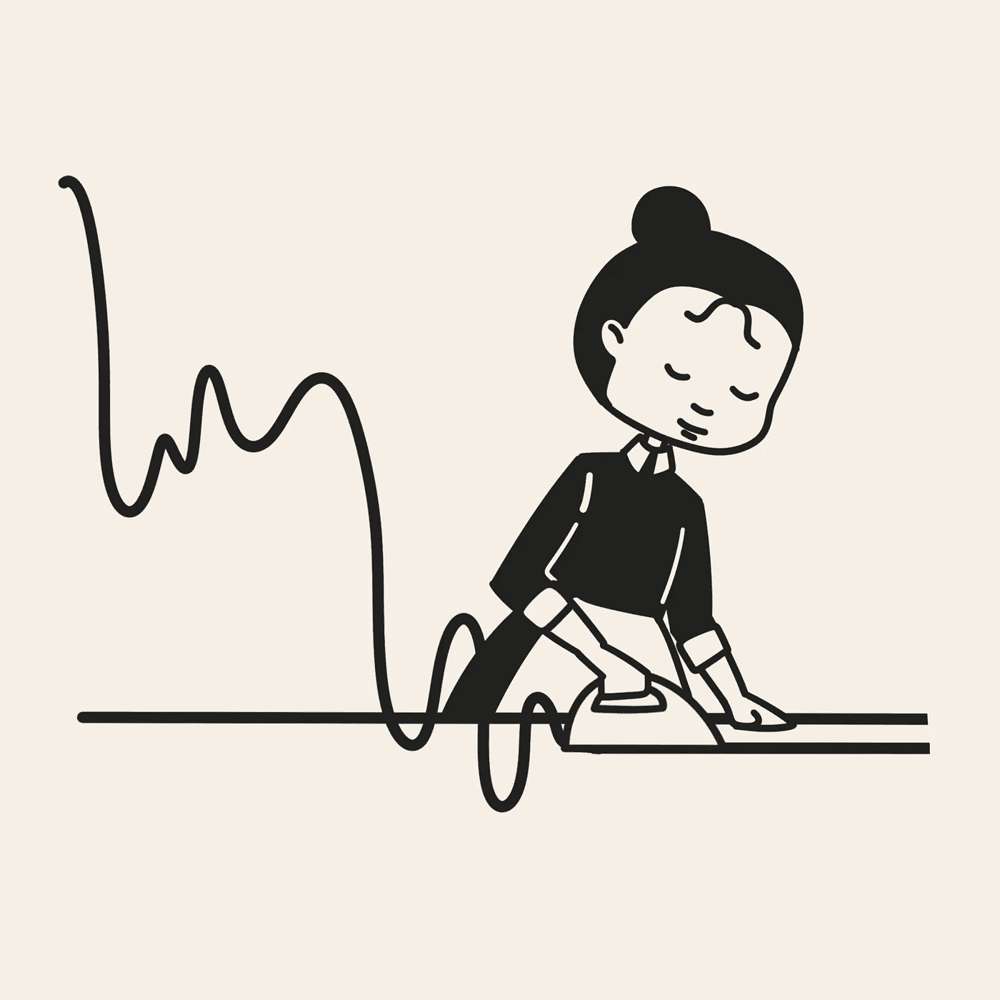

时间序列的平稳性（图由作者绘制）

未来更容易建模当它类似于现在时[3]。平稳性描述了时间序列的统计特征随着时间不会发生变化。因此，一些时间序列预测模型，如自回归模型，依赖于时间序列的平稳性。

在本文中，你将学到：

+   什么是平稳性，

+   为什么这很重要，

+   检查平稳性的 3 种方法，以及

+   当时间序列非平稳时可以应用的 3 种技术

# 什么是平稳性？

平稳性描述了一个概念，即时间序列如何变化将会在未来保持不变[3]。用数学术语来说，当时间序列的**统计特性与时间无关**时，它就是平稳的[3]：

+   恒定均值，

+   恒定方差，

+   以及协方差与时间无关。

这就是**弱平稳性**的定义。另一种平稳性是**严格平稳性**。它意味着相同大小的样本具有相同的分布[5]。由于严格平稳性具有限制性且较为罕见，本文将仅关注弱平稳性。

# 为什么平稳性很重要？

一些时间序列预测模型（例如自回归模型）需要平稳的时间序列，因为由于其统计特性恒定，它们更易于建模[3]。因此，如果时间序列不平稳，你应该使其平稳（参见当时间序列不平稳时你可以做什么？）。

# 你如何测试平稳性？

你可以通过两种方式测试时间序列的平稳性：

1.  直观方法：视觉评估

1.  统计方法：单位根检验

在这一部分，我们将重现 Hyndman 和 Athanasopoulos [3] 用于解释平稳性视觉评估的一些示例，并扩展它们的使用，以解释使用单位根测试进行平稳性检验。数据取自相关的`fma` R 包 [1]。

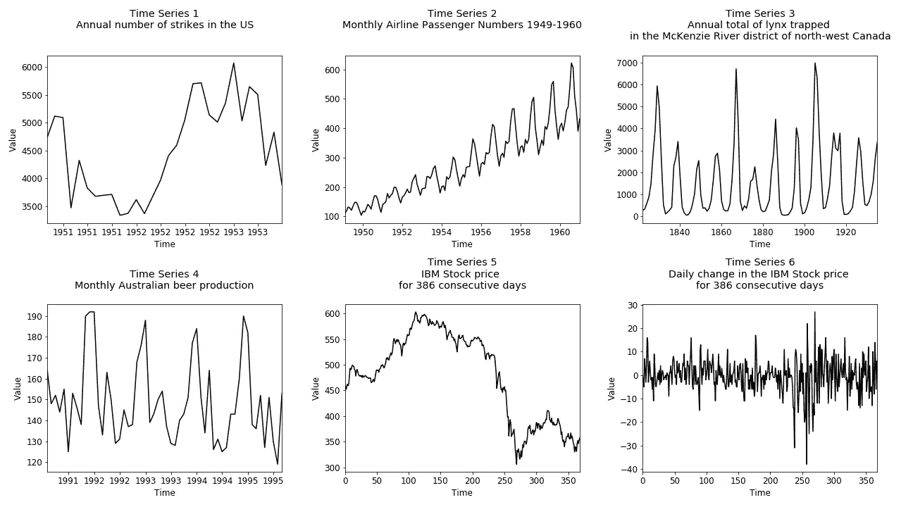

展示平稳性测试的示例时间序列（作者提供的图像，受到 Hyndman 和 Athanasopoulos [3]的高度启发）

## 如何进行视觉平稳性评估

你可以通过心理上将时间序列分成两半来评估时间序列的平稳性，并比较前半部分与后半部分的均值、幅度和周期长度。

+   **常数均值** — 时间序列前半部分的均值应与后半部分相似。

+   **常数方差** — 时间序列前半部分的幅度应与后半部分相似。

+   **协方差与时间无关** — 时间序列前半部分的周期长度应与后半部分相似。周期应与时间无关（例如，不按周或月等）。

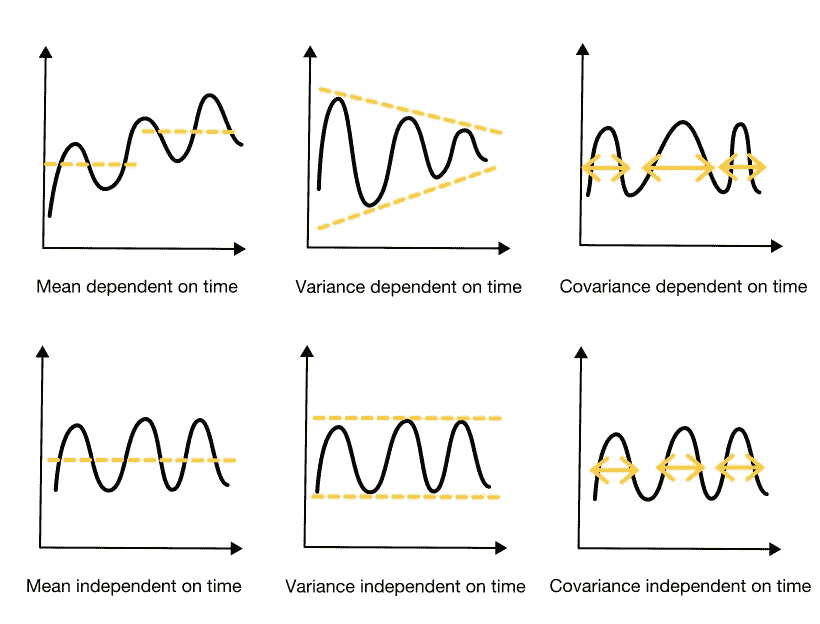

如何进行视觉平稳性测试（作者提供的图像）

对于我们的示例，评估结果如下所示：

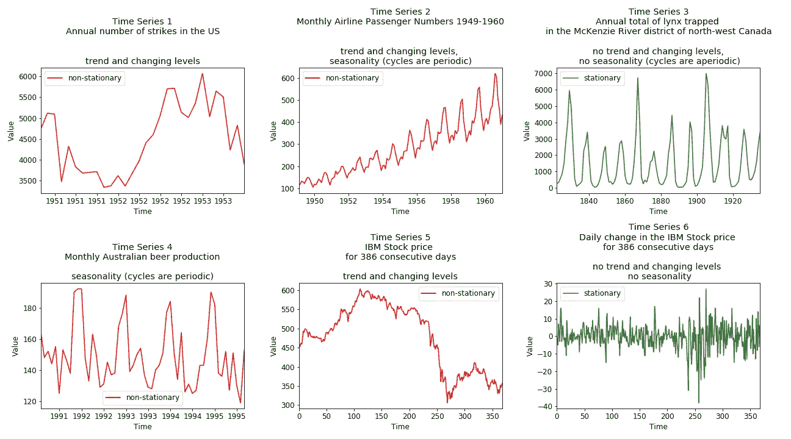

在示例时间序列上的视觉平稳性评估（作者提供的图像，受到 Hyndman 和 Athanasopoulos [3]的高度启发）

## 如何统计性地评估平稳性 — 单位根检验的绕行

**单位根**是一个被称为“带漂移的随机游走”的随机趋势。由于随机性无法预测，这意味着：

+   单位根存在：非平稳（不可预测）

+   单位根不存在：平稳

要使用单位根检验进行平稳性测试，你需要以两种竞争假设的形式陈述你的初始假设 [6]：

+   **原假设（H0）—** 例如，时间序列是平稳的（没有单位根）

+   **替代假设（H1）** — 例如，时间序列是非平稳的（存在单位根）

然后你将根据两种方法来评估是否拒绝原假设：

+   **p 值方法：**

    如果 p 值 > 0.05，则未能拒绝原假设。

    如果 p 值 ≤ 0.05，拒绝原假设。

+   **临界值方法：**

    如果检验统计量小于临界值，则未能拒绝原假设。

    如果检验统计量比临界值更极端，则拒绝原假设。

    当 p 值接近显著水平（例如，约为 0.05）时，应该使用临界值方法 [8]。

有几种单位根检验可以用来检查平稳性。本文将重点介绍最流行的几种：

+   扩展的迪基-福勒检验 [2]

+   Kwiatkowski-Phillips-Schmidt-Shin 检验 [4]。

## 如何使用**扩展的迪基-福勒检验**来测试平稳性

扩展的迪基-富勒（ADF）测试的假设为[2]：

1.  **原假设（H0）：** 时间序列**非平稳**，因为存在单位根（如果 p 值 > 0.05）

1.  **备择假设（H1）：** 时间序列**平稳**，因为不存在单位根（如果 p 值 ≤ 0.05）

在 Python 中，我们可以使用`statsmodels.tsa.stattools`库中的`adfuller`方法[8]。

```py
from statsmodels.tsa.stattools import adfuller

result = adfuller(df["example"].values)
```

如果我们能拒绝 ADF 测试的原假设，则时间序列是平稳的：

+   如果 p 值（`result[1]`）≤ 0.05

+   如果测试统计量（`result[0]`）比临界值（`result[4]["1%"]`、`result[4]["5%"]`和`result[4]["10%"]`）更极端

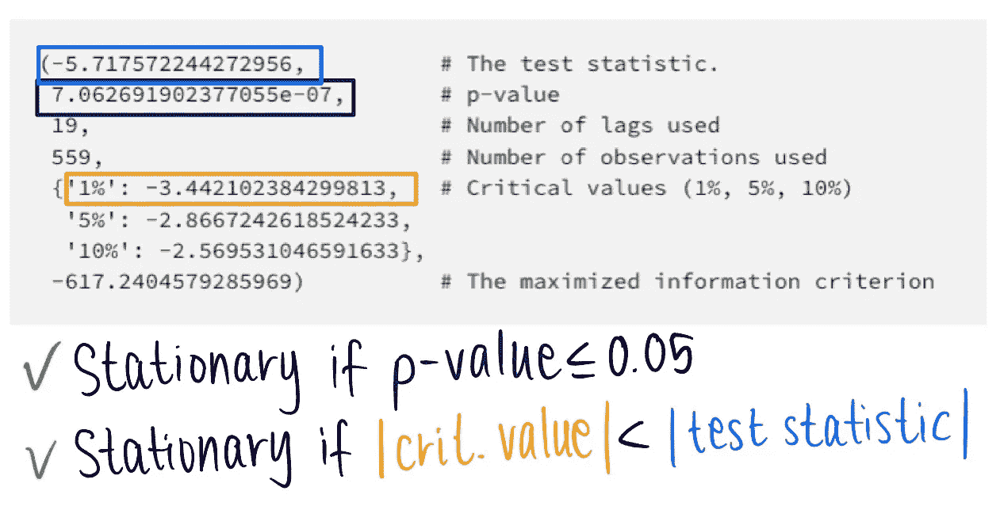

使用 stattools Python 库进行 ADF 平稳性测试（图片由作者提供）

以下是样本数据集的 ADF 测试结果：

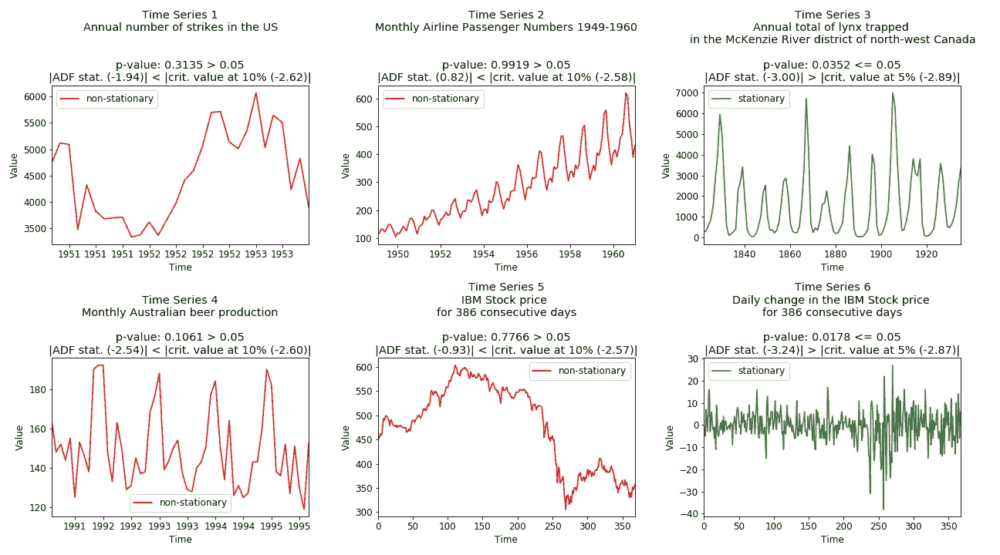

单位根（ADF 测试）对示例时间序列的平稳性评估（图片由作者提供）

## **如何使用 Kwiatkowski-Phillips-Schmidt-Shin 测试检验平稳性**

Kwiatkowski-Phillips-Schmidt-Shin（KPSS）测试的假设为[4]：

1.  **原假设（H0）：** 时间序列**平稳**，因为不存在单位根（如果 p 值 > 0.05）

1.  **备择假设（H1）：** 时间序列**非平稳**，因为存在单位根（如果 p 值 ≤ 0.05）

这个统计量越大，我们就越可能拒绝原假设（即我们有一个非平稳时间序列）。

在 Python 中，我们可以使用`statsmodels.tsa.stattools`库中的`kpss`方法[9]。我们必须使用参数`regression = 'ct'`来指定测试的原假设是数据是趋势平稳的。[9]

```py
from statsmodels.tsa.stattools import kpss

result = kpss(df["example"].values, 
              regression = "ct")
```

如果我们无法拒绝 KPSS 测试的原假设，则时间序列是平稳的：

+   如果 p 值（`result[1]`）> 0.05

+   如果测试统计量（`result[0]`）比临界值（`result[3]["1%"]`、`result[3]["2.5%"]`、`result[3]["5%"]`和`result[3]["10%"]`）不那么极端

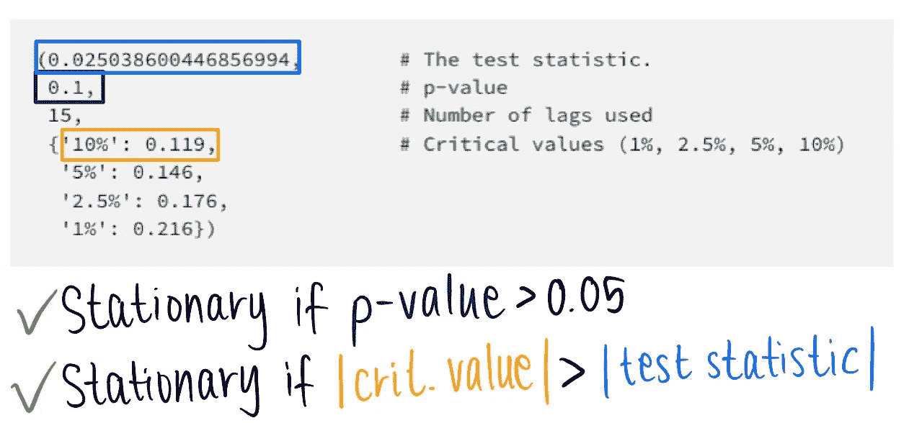

使用 stattools Python 库进行 KPSS 平稳性测试（图片由作者提供）

以下是样本数据集的 KPSS 测试结果：

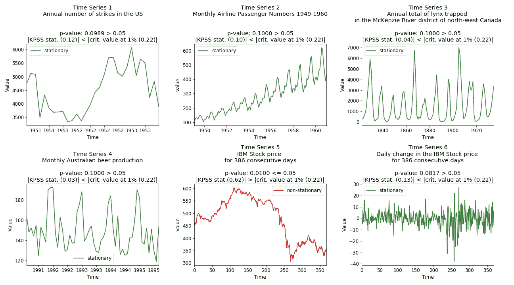

单位根（KPSS 测试）对示例时间序列的平稳性评估（图片由作者提供）

# 当时间序列非平稳时你可以做什么？

你可以对非平稳时间序列应用不同的变换以尝试使其平稳：

+   差分

+   通过模型拟合去趋势

+   对数变换

由于平稳性有几种类型，我们可以结合使用 ADF 和 KPSS 测试来确定需要进行什么变换[7]：

+   如果 ADF 测试结果为平稳而 KPSS 测试结果为非平稳，则时间序列是**差分平稳**——对时间序列进行差分处理，并再次检查平稳性[7]。

+   如果 ADF 检验结果是非平稳的，而 KPSS 检验结果是平稳的，则时间序列是**趋势平稳**的——去趋势时间序列并再次检查平稳性 [7]。

## 差分

差分计算两个连续观察值之间的差值。它使时间序列的均值稳定，从而减少趋势 [3]。

```py
df["example_diff"] = df["example"].diff()
```

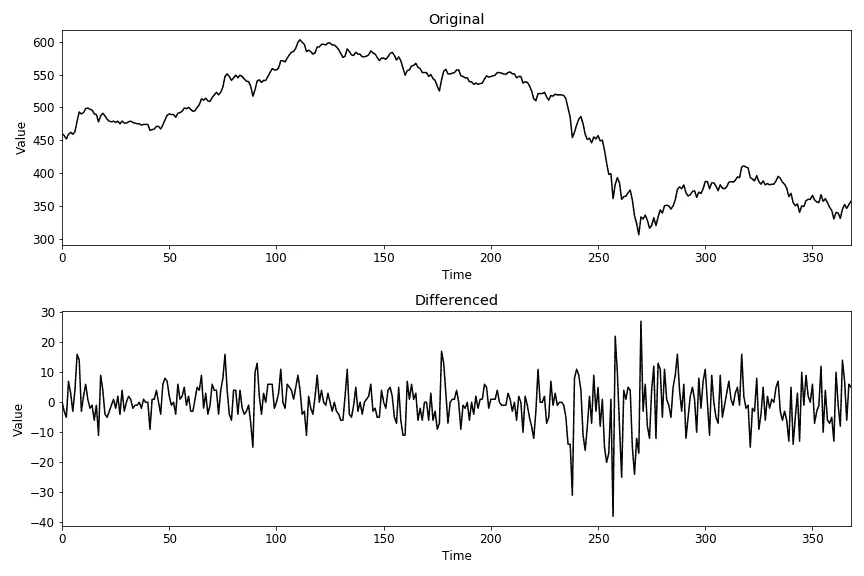

差分后的时间序列（图像作者提供）

如果你想扩展对差分的了解，你应该查看 fractional differencing。

## 通过模型拟合去趋势

去除非平稳时间序列中的趋势的另一种方法是对数据拟合一个简单模型（例如线性回归），然后对该拟合的残差进行建模。

```py
from sklearn.linear_model import LinearRegression

# Fit model (e.g., linear model)
X = [i for i in range(0, len(airpass_df))]
X = numpy.reshape(X, (len(X), 1))
y = df["example"].values
model = LinearRegression()
model.fit(X, y)

# Calculate trend
trend = model.predict(X)

# Detrend
df["example_detrend"] = df["example"].values - trend
```

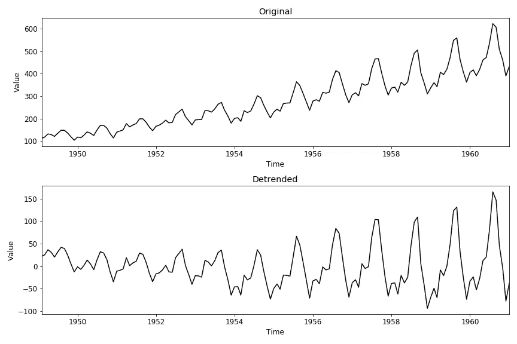

通过模型拟合去趋势时间序列（图像作者提供）

## 对数转换

对数转换使时间序列的方差稳定 [8]。

```py
df["example_diff"] = np.log(df["example"].value)
```

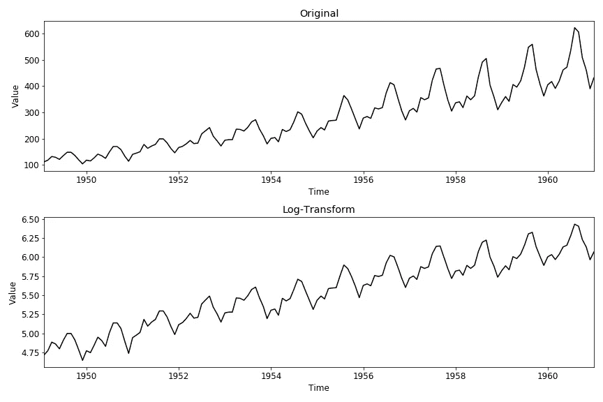

对数转换后的时间序列（图像作者提供）

如你所见，模型拟合去趋势以及单独的对数转换都没有使我们的示例时间序列平稳。你还可以结合不同的技术来使时间序列平稳：

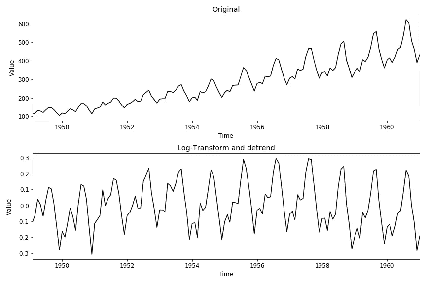

通过模型拟合去趋势对数转换后的时间序列（图像作者提供）

# 摘要

在时间序列预测中，一个具有**恒定统计属性（均值、方差和协方差）**的时间序列，即与时间无关的时间序列，被描述为平稳的。

由于具有恒定的统计特性，平稳时间序列比非平稳时间序列更容易建模。因此，许多时间序列预测模型**假设平稳性**。

平稳性可以通过**视觉评估或统计方法**来检查。统计方法检查单位根，这是非平稳性的一个指标。两个最流行的单位根检验是 ADF 和 KPSS。两者都可以在 Python 的`stattools`库中找到 [8,9]。

如果时间序列是非平稳的，你可以尝试通过差分、对数转换或去除趋势来**使其平稳**。

# 喜欢这个故事吗？

[*免费订阅*](https://medium.com/subscribe/@iamleonie) *以便在我发布新故事时收到通知。*

[](https://medium.com/@iamleonie/subscribe?source=post_page-----8beabe20d68--------------------------------) [## 每当 Leonie Monigatti 发布时收到电子邮件。

### 每当 Leonie Monigatti 发布时收到电子邮件。通过注册，如果你还没有，你将创建一个 Medium 账户……

medium.com](https://medium.com/@iamleonie/subscribe?source=post_page-----8beabe20d68--------------------------------)

*在* [*LinkedIn*](https://www.linkedin.com/in/804250ab/)、[*Twitter*](https://twitter.com/helloiamleonie)*和* [*Kaggle*](https://www.kaggle.com/iamleonie)*上找到我！*

# 数据集

所有数据集均来自 fma R 包。

[1] Hyndman RJ (2023). *fma: 取自“预测：方法与应用”由 Makridakis, Wheelwright & Hyndman (1998)编写的数据集*。R 包版本 2.5，[`pkg.robjhyndman.com/fma/`](http://pkg.robjhyndman.com/fma/)。

**许可证：** [GPL-3](https://cran.r-project.org/web/licenses/GPL-3) ([`cran.r-project.org/web/packages/fma/index.html`](https://cran.r-project.org/web/packages/fma/index.html))

# 参考文献

[2] Dickey, D. A. 和 Fuller, W. A. (1979). 具有单位根的自回归时间序列估计值的分布。*J. Am. Stat. Assoc.* **74**，427–431。

[3] R. J. Hyndman, & G. Athanasopoulos (2021) *预测：原理与实践*，第 3 版，OTexts：墨尔本，澳大利亚。OTexts.com/fpp3。（访问于 2022 年 9 月 26 日）。

[4] Kwiatkowski, D., Phillips, P. C., Schmidt, P., & Shin, Y. (1992). 对单位根的替代理论进行平稳性零假设检验：我们对经济时间序列存在单位根的确定性有多高？《计量经济学杂志》，54(1–3)，159–178。

[5] D. C. Montgomery, C. L. Jennings, Murat Kulahci (2015) 《时间序列分析与预测简介》，第 2 版，John Wiley & Sons。

[6] PennState (2023). [S.3 假设检验](https://online.stat.psu.edu/statprogram/reviews/statistical-concepts/hypothesis-testing)（访问于 2022 年 9 月 26 日）。

[7] statsmodels (2023). [平稳性与去趋势（ADF/KPSS）](https://www.statsmodels.org/stable/examples/notebooks/generated/stationarity_detrending_adf_kpss.html)（访问于 2023 年 3 月 10 日）。

[8] statsmodels (2023). [statsmodels.tsa.stattools.adfuller](https://www.statsmodels.org/stable/generated/statsmodels.tsa.stattools.adfuller.html)（访问于 2022 年 9 月 26 日）。

[9] statsmodels (2023). [statsmodels.tsa.stattools.kpss](https://www.statsmodels.org/dev/generated/statsmodels.tsa.stattools.kpss.html)（访问于 2022 年 9 月 26 日）。
