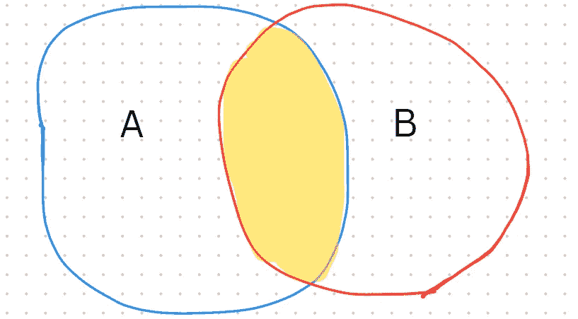
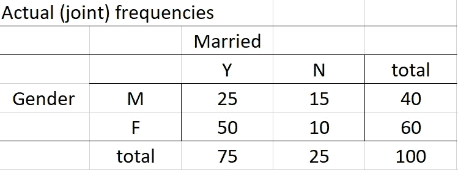
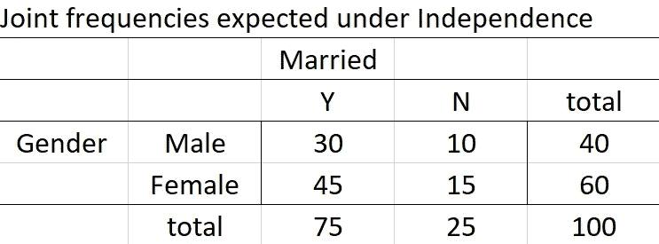
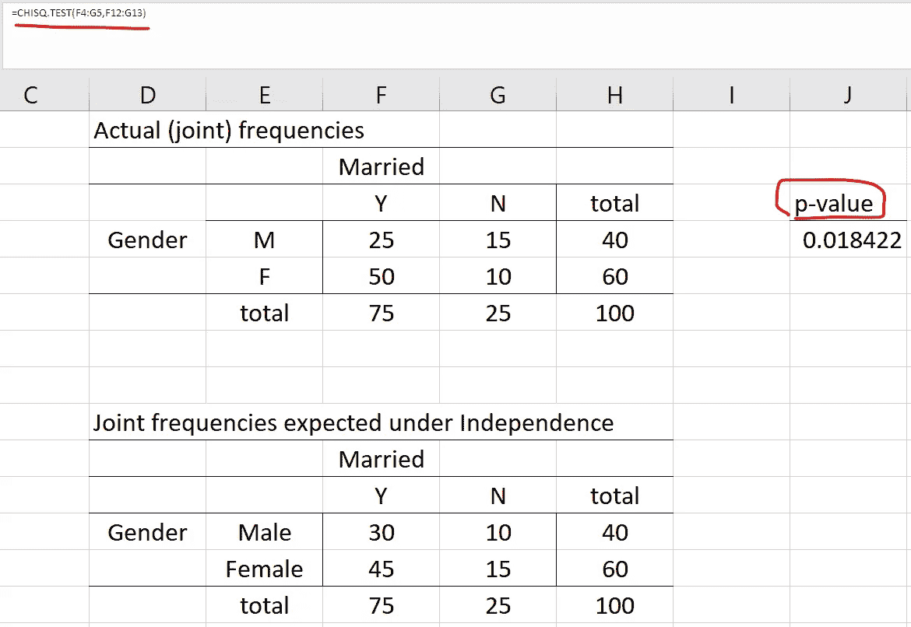

# 统计独立性入门

> 原文：[`towardsdatascience.com/statistical-independence-for-beginners-69534ce04641`](https://towardsdatascience.com/statistical-independence-for-beginners-69534ce04641)

## 使用 R 和 Excel 函数的直观解释

[](https://medium.com/@jaekim8080?source=post_page-----69534ce04641--------------------------------)[](https://towardsdatascience.com/?source=post_page-----69534ce04641--------------------------------) [Jae Kim](https://medium.com/@jaekim8080?source=post_page-----69534ce04641--------------------------------)

·发表于[Towards Data Science](https://towardsdatascience.com/?source=post_page-----69534ce04641--------------------------------) ·5 分钟阅读·2023 年 3 月 21 日

--


图片由[Naser Tamimi](https://unsplash.com/ja/@tamiminaser?utm_source=medium&utm_medium=referral)在[Unsplash](https://unsplash.com/?utm_source=medium&utm_medium=referral)提供

统计独立性是统计学中的一个基本概念。它构成了许多（有监督的）机器学习算法的基础假设，如 logit 模型和朴素贝叶斯分类器。它也与人工智能中的关键方法紧密相关，如最大熵和神经网络。有关更多见解，请参见[这篇文章](https://torstenvolk.medium.com/the-next-frontier-in-ai-replacing-statistical-independence-with-human-intuition-a39789f8c737)。

在这篇文章中，我通过直观解释、示例和统计独立性测试资源（R 代码和 Excel 函数）来说明其定义。

# **Probabilities**

为简单起见，考虑两个事件 A 和 B，并定义以下概率：

**Prob(A)**: 事件 A 的（边际）概率

**Prob(B)**: 事件 B 的（边际）概率

**Prob(A ∩ B)**: 事件 A 和 B 的联合概率，即 A 和 B 同时发生的概率；

**Prob(A|B)**: 事件 A 在给定 B 的条件下的条件概率，即在事件 B 已发生的情况下，事件 A 的概率；

**Prob(B|A)**: 事件 B 在给定 A 的条件下的条件概率。

这些概率之间的关系为

由作者创建的图片

如下方维恩图所示，**Prob(A|B)** 表示*事件 A 对事件 B 的贡献比例（黄色区域：A ∩ B），以概率的形式*。



由作者创建的图片

例如，

A: 已婚，B: 男性

P(A|B) = 男性中的婚姻概率；

A: 失业，B: 大学毕业生

P(A|B) = 大学毕业生失业的概率

# 统计独立性

统计独立性有两个等效条件。首先，如果事件 A 和 B 是统计独立的

**Prob(A ∩ B) = Prob(A) × Prob(B)**

A 和 B 同时发生的概率是概率的乘积。这意味着*如果它们同时发生，那纯粹是偶然的，两者之间没有系统性的关联*。

其次，如果事件 A 和 B 是统计独立的

**Prob(A|B) = Prob(A)。**

该条件来源于上述关系：

图片由作者创建

事件 B 的发生条件下的 A 的概率与 A 的概率相同。这意味着，*在事件 B 已经发生的情况下，你对事件 A 的了解不会影响事件 A 的概率*。

类似地，**Prob(B|A) = Prob(B)。**

## 简单的例子

你连续抛两枚（公平的）硬币，每枚硬币显示 H（正面）或 T（反面），Prob(H) = Prob(T) = 0.5。你将会有以下结果：

(H, H), (H, T), (T, H), (T, T)。

例如，

Prob(H ∩ T) = 0.25，这等于

Prob(H) × Prob(T) = 0.5 × 0.5。

即，如果你得到结果(H, T)，那纯粹是偶然的，没有系统性的关联。或者，

Prob(T | H) = 0.25 = Prob(T ∩ H)/P(H) = 0.25/0.5 = Prob(T)

如果你从第一枚硬币中得到 H，这对第二枚硬币得到 T 或 H 的概率没有影响。

## 现实世界的例子

A：已婚，B：男性

Prob(A ∩ B) = Prob(A) × Prob(B)；随机选择一个人是男性且已婚，这种联合发生纯粹是偶然的。

Prob(A|B) = Prob(A)；男性的婚姻概率与婚姻的概率相同。成为男性对婚姻概率没有影响。

## 测试独立性：卡方检验

进行了一项调查，以检查个人的婚姻状态与性别之间是否存在任何关联。在 100 名随机选择的个体中，40 名是男性，60 名是女性。其中 75 人已婚，25 人未婚。下表展示了婚姻状态和性别的联合频率。



图片由作者创建

例如，

Prob(Y ∩ M) = 25/100；Prob(M) = 40/100

Prob(Y|M) = Prob(Y ∩ M)/Prob(M) = 25/40

这些频率与统计独立下的预期频率进行比较：



图片由作者创建

在独立性下，预期的联合概率列如上：

例如，

Prob(Y ∩ M) = Prob(Y) × Prob(M) = 75/100 × 40/100 = 0.3；

Prob(Y ∩ F) = Prob(Y) × Prob(F) = 75/100 × 60/100 = 0.45。

实际频率与预期值类似，但它们是否足够接近以证明统计独立性？要检验统计独立性的零假设，我们需要进行独立性检验。

卡方检验广泛用于此目的，它比较实际频率（Oi）与预期频率（Ei）

图片由作者创建

其中 n 是表中单元格的数量，N 是总响应数，*pi*是独立性下的期望概率（或相对频率）。上述统计量遵循自由度为 df = (行数−1)×(列数−1)的卡方分布，其中行数和列数是表的行数和列数。

以下 R 代码显示了测试结果，包括检验统计量和 p 值。对象**table**定义为上述实际频率的 2 × 2 矩阵，并输入到函数**chisq.test**中。在 5%的显著性水平下，性别和婚姻之间的独立性零假设被拒绝，p 值为 0.018，检验统计量为 5.56。选项**correct= FALSE**与连续性修正有关，在这里没有使用，以与 Excel 函数保持一致。

```py
table=matrix(c(25,50,15,10),nrow=2)
> table
     [,1] [,2]
[1,]   25   15
[2,]   50   10
> chisq.test(table,correct = FALSE)

 Pearson's Chi-squared test

data:  table
X-squared = 5.5556, df = 1, p-value = 0.01842
```

Excel 函数**CHISQ.TEST**返回检验的 p 值。该函数要求输入实际范围和期望范围，如下所示：


图像由作者创建



图像由作者创建

统计独立性是统计学、机器学习和人工智能中许多方法和概念的基础。它意味着两个或更多的随机变量没有系统的关联，即

+   它们的联合发生完全是偶然的；或者

+   一些随机变量的发生对其他变量的概率没有影响。

结果是，这些随机变量之间的相关性为零。

作为数据科学家，对这一基本概念有深入的理解非常重要。本文旨在提供统计独立性的直观解释，包括示例和计算资源。
