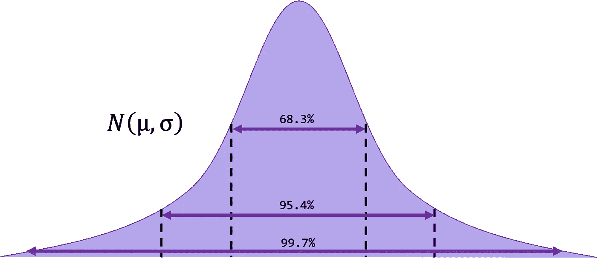
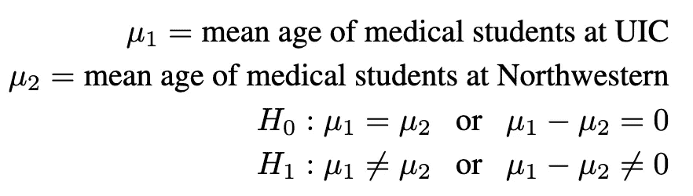

# 统计学速成班第 8 期：两个均值的故事

> 原文：[`towardsdatascience.com/statistics-bootcamp-8-a-tale-of-two-means-ecec013ae414?source=collection_archive---------10-----------------------#2023-01-04`](https://towardsdatascience.com/statistics-bootcamp-8-a-tale-of-two-means-ecec013ae414?source=collection_archive---------10-----------------------#2023-01-04)

## [统计学速成班](https://towardsdatascience.com/tagged/statistics-bootcamp)

## 学习你作为数据科学家每日使用的库背后的数学和方法

 [Adrienne Kline](https://medium.com/@askline1?source=post_page-----ecec013ae414--------------------------------)

·

[关注](https://medium.com/m/signin?actionUrl=https%3A%2F%2Fmedium.com%2F_%2Fsubscribe%2Fuser%2F7cd59d41e4d7&operation=register&redirect=https%3A%2F%2Ftowardsdatascience.com%2Fstatistics-bootcamp-8-a-tale-of-two-means-ecec013ae414&user=Adrienne+Kline&userId=7cd59d41e4d7&source=post_page-7cd59d41e4d7----ecec013ae414---------------------post_header-----------) 发表在 [Towards Data Science](https://towardsdatascience.com/?source=post_page-----ecec013ae414--------------------------------) ·13 分钟阅读·2023 年 1 月 4 日 

--

作者提供的图片

本文是一个更大系列速成班的一部分（见最后的链接获取完整列表！）。这一期专注于学习如何比较两个总体，建立在我们对样本均值与总体均值的知识基础上。

我们可能想要调查两个群体（或两个样本）之间是否存在某个方面的差异。例如，西北大学和芝加哥大学的医学院学生的年龄是否有差异？在这里，我们试图*比较*这两个平均值，而不是在之前的训练营中，我们试图看看样本的平均值与总体的平均值是否存在差异。

我们将提出关于年龄和医学生的问题如下：

1.  人口 1 = 所有注册在 UIC 的医学生

    人口 1 = 所有注册在西北医学生

1.  假设（在双尾检验的情况下）：

# 比较两个…
