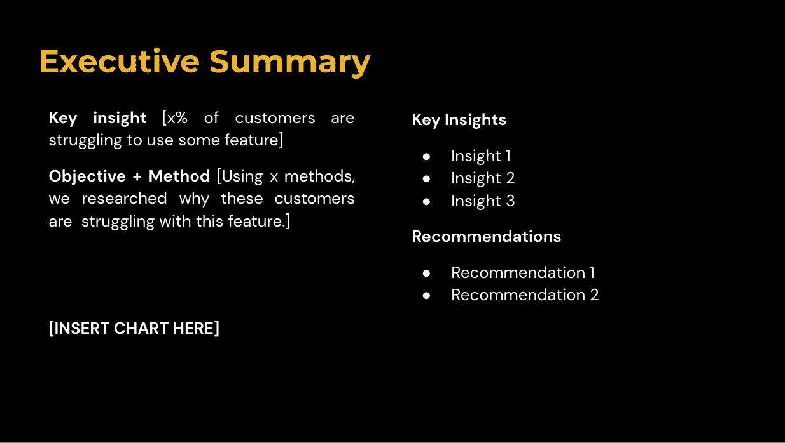
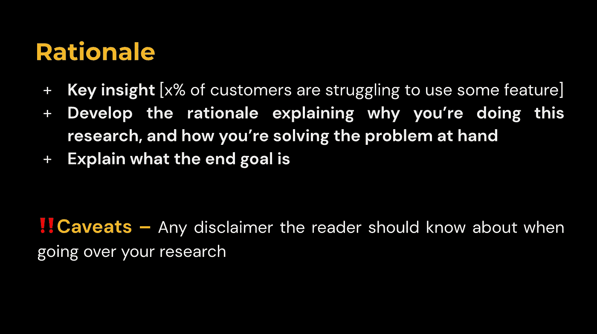
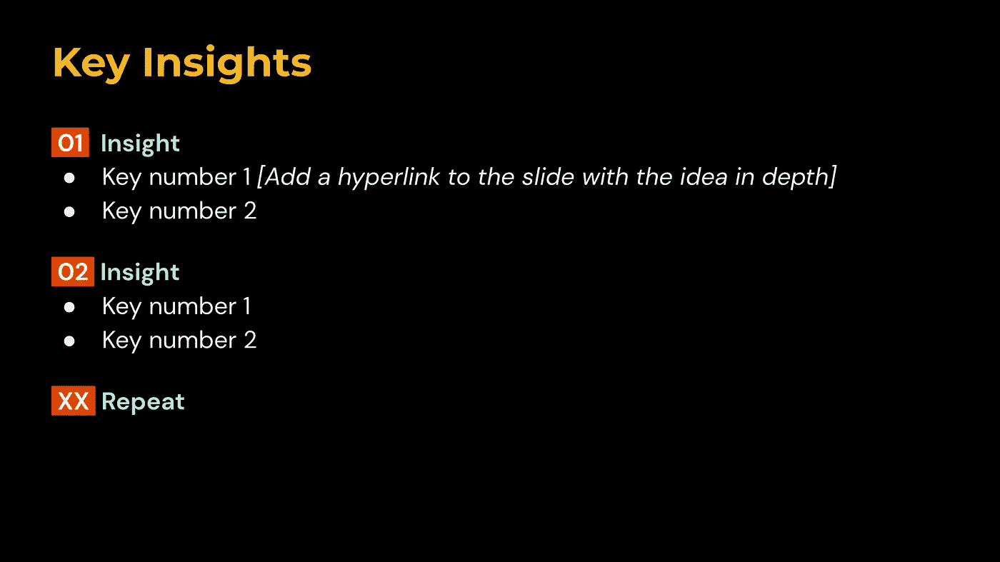
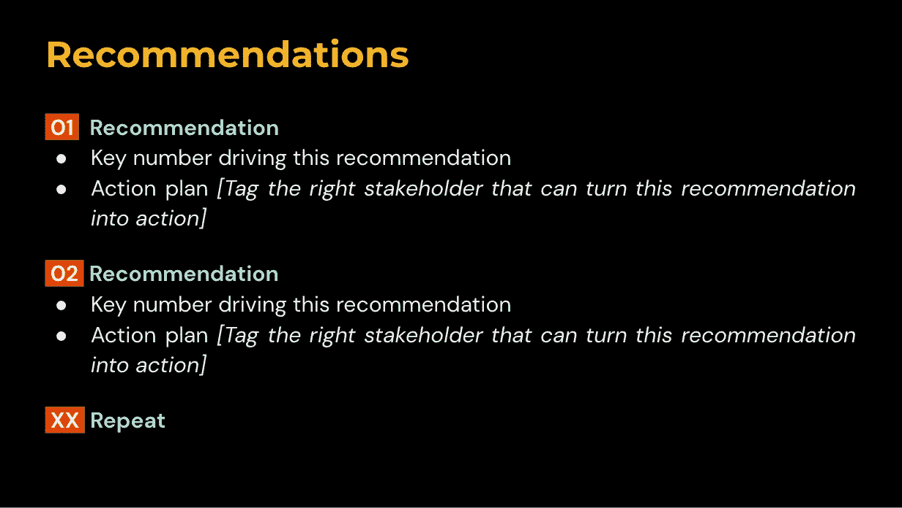
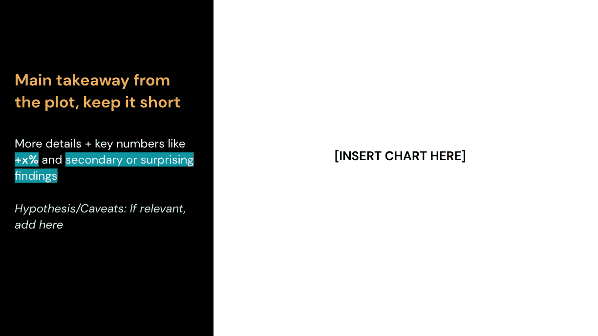
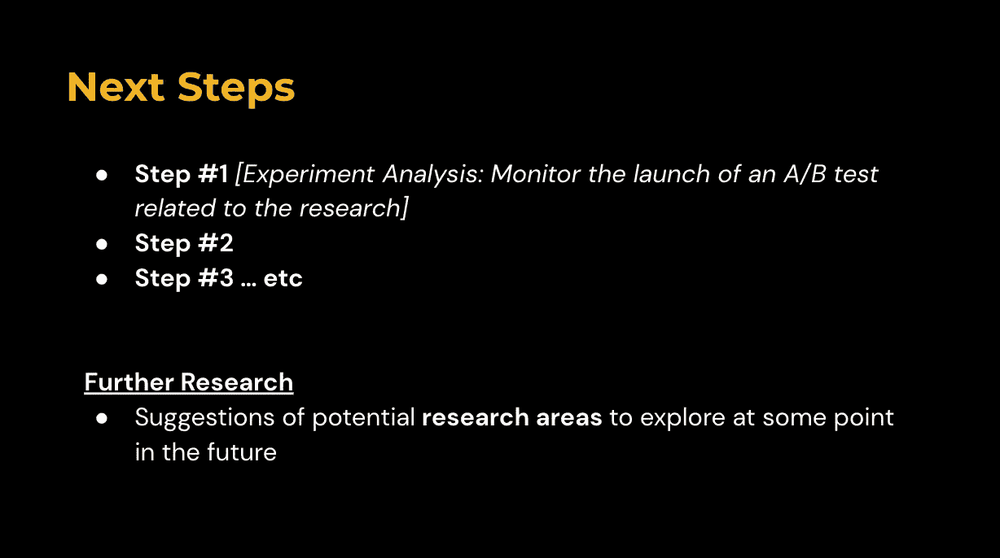

# 数据科学家的指南：将洞察力转化为有影响力的行动

> 原文：[`towardsdatascience.com/step-by-step-guide-the-art-of-winning-stakeholders-as-a-data-scientist-to-drive-impact-8dbb4e4a5179`](https://towardsdatascience.com/step-by-step-guide-the-art-of-winning-stakeholders-as-a-data-scientist-to-drive-impact-8dbb4e4a5179)

## 数据科学家在科技行业的第一年编年史

## **将你的工作转化为有意义成果的杀手技能组合**

 [Khouloud El Alami](https://medium.com/@elalamik?source=post_page-----8dbb4e4a5179--------------------------------)

·发表于[Towards Data Science](https://towardsdatascience.com/?source=post_page-----8dbb4e4a5179--------------------------------) ·阅读时间 10 分钟·2023 年 7 月 8 日

--

想象一下，花费数月心血投入到一个项目中，却看到其内容被搁置。**这是许多数据科学家面临的情景。**

这种情况不止发生过一次。这让我感到深深的苦涩，疑惑为什么一开始会发生这种事。

> *这通常发生在* ***商业目标发生变化时。***

项目被降低了优先级，*你的贡献也一样*。这就是我在这种情况下遇到的情况。对于公司赌注的变化，我无能为力。

> *其他时候，是因为* ***利益相关者没有跟进你的工作。***

即使你的信息是相关的，当利益相关者*无法理解你的洞察*或*不被说服*时，也会发生这种情况。可能是因为你在某处搞砸了。好消息是，有**方法可以防止这种情况发生**。

这也发生在我身上，我在这里详细讲述了我如何搞砸了，以及在过程中学到了哪些**技能**来**将我的洞察力转化为行动。**

图片来源：作者（Midjourney）

## 成为数据科学家的公式从未改变。它非常直接——归结为：

> 数学 + 代码 + 商业头脑 + 软技能 = 数据科学家公式

轰！没什么疯狂的。

唯一稍显疯狂的部分是**软技能**。它们在项目范围的所有阶段都会发挥作用，尤其是当你需要交付你的洞察力并确保它们转化为行动时。公式并不简单明了。

*(另外，如果你是初级数据科学家，务必查看我下面的文章，了解作为一名初级数据科学家在 Spotify 学到的 5 个重要课程)*

 ## 我在 Spotify 学到的初级数据科学家五个必备课程（第一部分）

### 成为数据科学家早期阶段的内行指南，并提升你的技能水平。

towardsdatascience.com

# 不那么软的技能

我不明白为什么我们称这些技能为*软技能*。它们比那些技术技能更难培养。没有教科书公式会告诉你确切的方法。

如果这些技能不是由你的仙女教母🪄赐予你的，那么你需要开始努力把它们赋予自己。

如果你的仙女教母看起来不是这样，那么我不想听 — 作者提供的图片（Midjourney）

有些技能你会在被投身实际工作中并亲自动手时学到。而其他技能则会在你与专家们相处时自然获得。

> 当你想将洞察转化为行动时，软技能尤为重要，因为你需要说服决策者这些洞察为何重要

但我们说的并不仅仅是任何软技能。你需要培养一套特别的技能，以确保你的洞察不会陷入困境。

# **1\.** 翻译的艺术**✨**

有一天，我需要解释我们进行的复杂 A/B 测试的分析，这涉及使用统计术语如“卡方检验”和“p 值”。

对大多数非技术人员来说，技术术语听起来像是天书。为了让他们更容易理解，我专注于结果是否[*统计显著*](https://medium.com/towards-data-science/fooled-by-statistical-significance-7fed1bc2caf9)。通常，人们知道它与结果的可靠性有关。

当你完成了项目中所有的技术工作后，剩下的就是与利益相关者分享你的劳动成果。

> **记住你是在对非技术人员讲话**

这些人将把你的洞察或模型转化为产品。他们根本不知道什么是*随机森林*，他们只知道这不是一堆在非洲的树木。

> *因此，学会* ***将复杂信息转化为简单语言*** *以确保你的工作能顺利推进到下一阶段*

很容易以为每个人都会理解你认为简单的术语。但仅仅因为他们也在从事或涉及技术工作，并不意味着他们会理解，所以一定要用**简单的语言**交流。这是传达信息的第一步，否则可能一切都徒劳无功。

作者提供的图片（Midjourney）

# 2\. 说服的力量 🫱🏼‍🫲🏾

我最近花了几个月时间进行深入研究。目标是了解体验的一部分质量，并提出基于数据的改进建议。

一个关键的建议对某些人来说似乎很荒唐，但我的直觉告诉我我们在做对的事。因此，我联系了一个在该项目的完全不同方面工作的团队。我深入研究了他们过去的研究，并收集了任何可以支持我立场的论据。

我最终成功地说服了我的受众，说明我的见解值得追求。如果我一开始没有接受这一点，我将无法通过研究产生影响。

是的，他有三只手，你怎么期望只用两只手完成这些任务？这需要努力，所以你需要尽可能多的手——作者提供的图像（Midjourney）

> 当你希望你的工作变成真实而有影响的东西时，**说服力成为你的新盟友**。这不是一种容易学会的技能，但它会帮助你脱颖而出，成为一名卓越的数据科学家。

你的受众在听你说话。这是真的。**但这并不意味着他们已经信服。他们为什么要在乎？**

他们也必须付出额外的努力来说服*你*为什么值得花时间研究一些东西。因此，你*也*不应该不做同样的事情。每个人的时间都很宝贵。

## *这里有 4 件事你可以做，也应该做，以引起他们的关注*

1.  **不要放弃你强有力的见解。** 无论它们对其他人来说多么牵强。相信你的直觉，并为它们辩护，**但只有在你对它们的潜力有信心时！！**

1.  **提供针对特定受众的有说服力的论点。** 通过用他们的语言讲解来打动他们，让你的见解与他们产生共鸣。确保有数据支持。*如果你面对的是产品经理，那就展示你的见解如何与产品相关。*

1.  **制定战略计划。** 你需要概述你提出的将这一愿景付诸实践的关键步骤。

1.  **对成功实施类似项目的团队或公司进行深入研究**。强调不落后于人的重要性，并营造紧迫感。

1.  **重复，重复，再重复。** 固定的受众需要多次听到某些内容才能整合进来。但也因为你需要将这些见解重复传达给不同的受众。你永远不知道哪个关键利益相关者会接收到这些信息并解锁下一步。

## 小心 🚨

> 在你追求影响力的过程中，记住**不是所有东西都可以被人为地强行变得有用**

如果你发现自己必须过多地说服他人，这可能表明与你的利益相关者的期望和假设不一致。但当你的见解与他们的需求无缝对接，你的故事在他们的背景下闪耀时，就无需说服——影响力会自己证明。

# 3\. 讲故事的魔力 🤯

还记得我之前提到的深度研究吗？

它引起了我部门 VP 的兴趣，因此我和我的经理必须确保故事流畅且完全合理后再进行展示。

我们在这上面花了时间，因为每个细节都必须有数据支持——我们说的任何内容都可能影响重大决策。

> 在向决策者展示你的见解时，讲故事的技巧是决定它们是否会进入排行榜的**终极差异**。

在几周或几个月内深入一个主题后，区分哪些内容真正有价值分享变得具有挑战性。学习如何挑选重要的数据部分并将其与产品建议联系起来，然后说服决策者采取行动是一项关键技能。

> 成功的演示是技巧性传递和战略性策划相关且引人注目的内容的结果

到目前为止，你知道你想与股东讨论什么。但你是否知道***如何***讨论它？

如果你是初级人员，你可能不记得。即使是最资深的技术数据科学家也仍在磨练这一技能。

作者提供的图片（Midjourney）

## 这些是我在为 VP 的审查准备演示时获得的讲故事技巧

首先，确保你了解**业务目标**、**主要战略方向**、**关注领域**以及你的项目如何与之对齐。

这将使你创建一个不孤立的故事。它与公司活跃的生态系统相关联。你的研究不是一项独立的工作。它旨在为更广泛的使命和愿景做出贡献。

在演示中清楚地表述**你的工作如何直接与这一宏观目标对齐**。

## **幻灯片 1 — 执行摘要**

它概述了你的工作，并包括关键见解和建议的总结。它为你的观众设定了期望。

**这通常应包括：**

1.  关键见解、数字或总结当前问题的观点

1.  研究目标 + 达成此目标所用的方法

1.  一张展示推动研究的关键统计数据的图表

1.  关键见解和建议的要点

执行摘要的模板 – 作者提供的图片

## **幻灯片 2 — 理由 + 免责声明/警告**

1.  更详细地描述那个关键见解/数字，并解释你的研究试图进一步实现的*最终目标*

1.  任何*值得分享*的内容，股东应了解以理解你的研究，均符合**警告**的标准。*例如，这可能是关于数据质量问题的免责声明*

作者提供的图片

## **幻灯片 3 — 关键见解总结**

用数据支持每个关键要素。

**🔊 一条建议 🔊：** 在每个要点旁边添加一个*超链接*，指向你深入分析该见解的幻灯片。这使得浏览你的幻灯片*简单*。

作者图片

## **第 4 页 — 推荐总结**

用相应的关键数字支持每个建议。

**🔊 一条建议 🔊：** 标记*相关利益相关者*。在这一部分，你需要解释如何将你的建议付诸实践给那个有能力实施的人。

作者图片

## **正文 — 将你的故事分成章节 + 在每一章末尾插入回顾**

每个部分都作为你故事的*章节*。以下是如何在章节中展示每个发现的示例。

1.  确保每个部分为下一个部分铺平道路。记住你在讲述一个故事，因此这些需要*无缝衔接*。

1.  在每章末尾包含回顾。这有助于信息在你观众的脑海中**更牢固**地留下。

作者图片

## **最后一页 — 下一步**

列出未来需要采取的行动。例如：

*“监控 A/B 测试的启动”*

作者图片

> *最后，记住你的故事需要自说自话。* 这意味着即使没有你的干预，任何人也应该能够随时获得见解。

讲故事是**数据科学家的持续旅程。** 随着时间的推移，你将发展出自己的风格。

# 总结

成为数据科学家的真正成功不仅在于你的技术能力，还在于你有效沟通、影响和激励的能力。你可以通过以下方式做到这一点：

1.  **将技术术语翻译成英语。** 简化复杂概念，以确保非技术人员理解你的见解及其价值。

1.  **说服你的观众为什么你的见解值得关注。** 你让利益相关者支持你的事业的能力可以将单纯的概念转化为行动，创造持久的影响。

1.  **不断磨练你的讲故事技巧。** 成功不仅在于演讲的呈现，还在于内容的精心策划。

掌握这些软技能将推动你的职业生涯迈向新高峰，并使你的工作真正产生影响。

# 即将推出：揭示**终极技能**，使数据科学家在技术领域脱颖而出，获得最佳工作

+   技术领域所有数据科学家共有的一项技能

+   一项能开启你梦想数据科学工作的大门的技能

+   一项重要到值得单独讲述的技能

所以，请继续关注，因为你不会想错过。

好吧，现在我开始听起来像个吸引点击的标题了。

下次见👋🏼

# 我有礼物送给你🎁！

注册我的 [**newsletter**](https://levelupwithk.substack.com/) **K’s DataLadder**，你将自动获得我的**终极 SQL 备忘单**，其中包含我在大型科技公司每天使用的所有查询+另一个神秘礼物！

我每周分享作为科技行业数据科学家的经历，以及实用的技巧、技能和故事，旨在帮助你提升自己——因为没人真正了解，直到他们自己亲身经历！

## 如果你还没有做的话

+   订阅我的[**YouTube**](https://rebrand.ly/tdf62uv)频道。新视频很快就会发布！

+   在[**Instagram**](https://www.instagram.com/elalamikhouloud/)、[**LinkedIn**](https://www.linkedin.com/in/elalamik/)、[**X**](https://twitter.com/elalamik)上关注我，选择你喜欢的方式

很快见！
