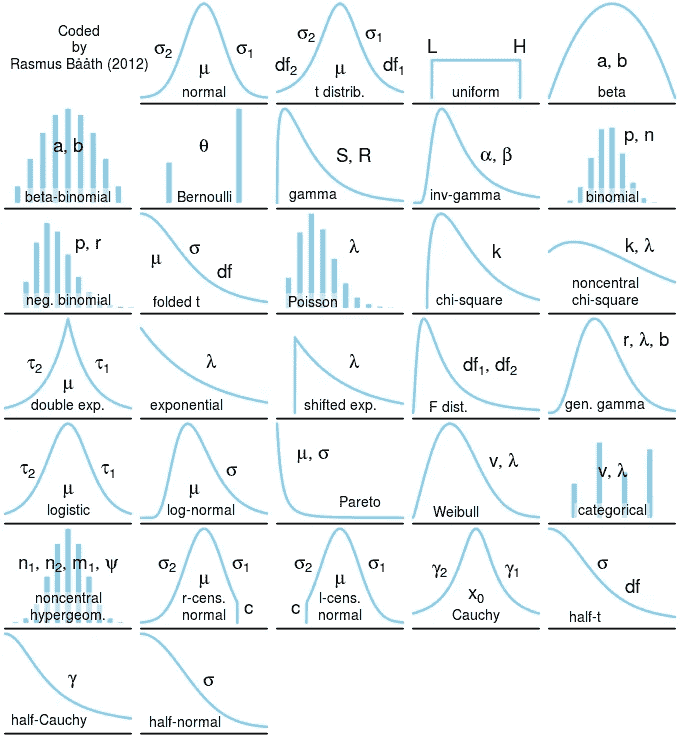
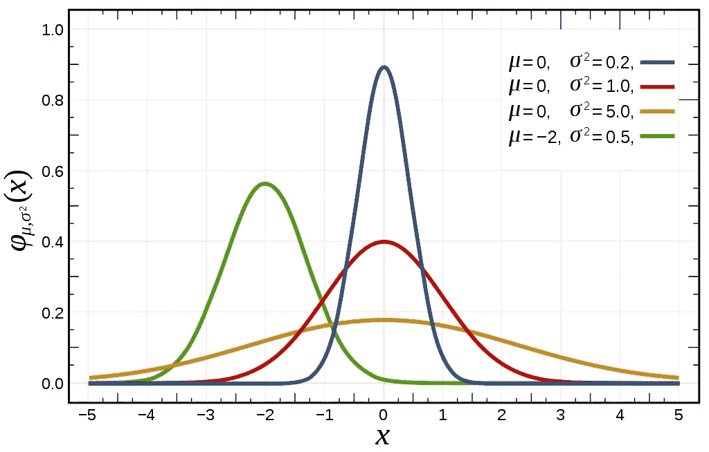
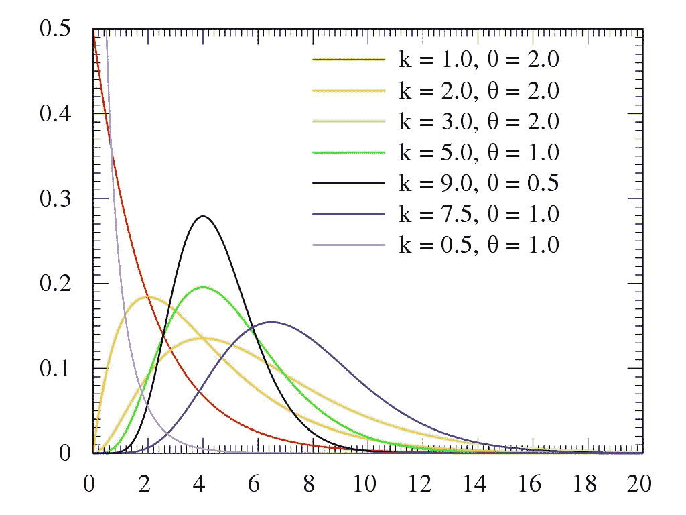
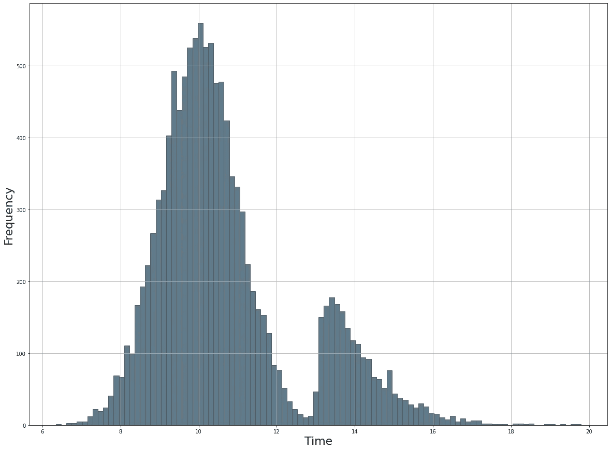
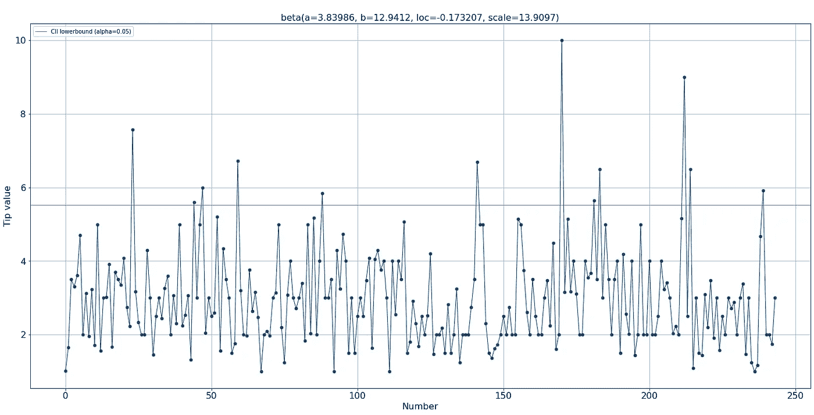
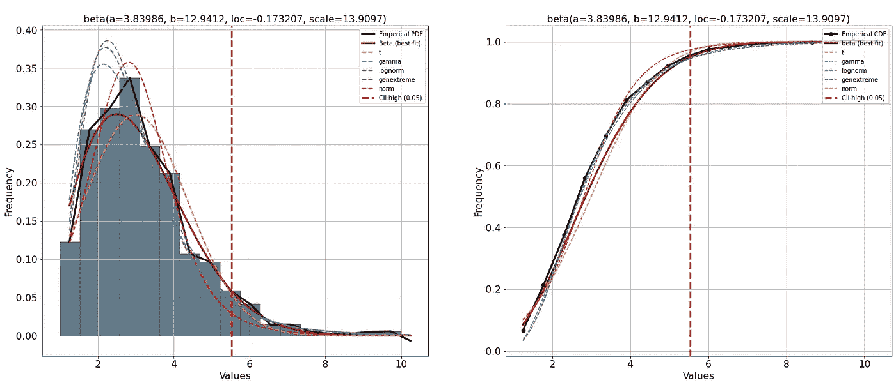
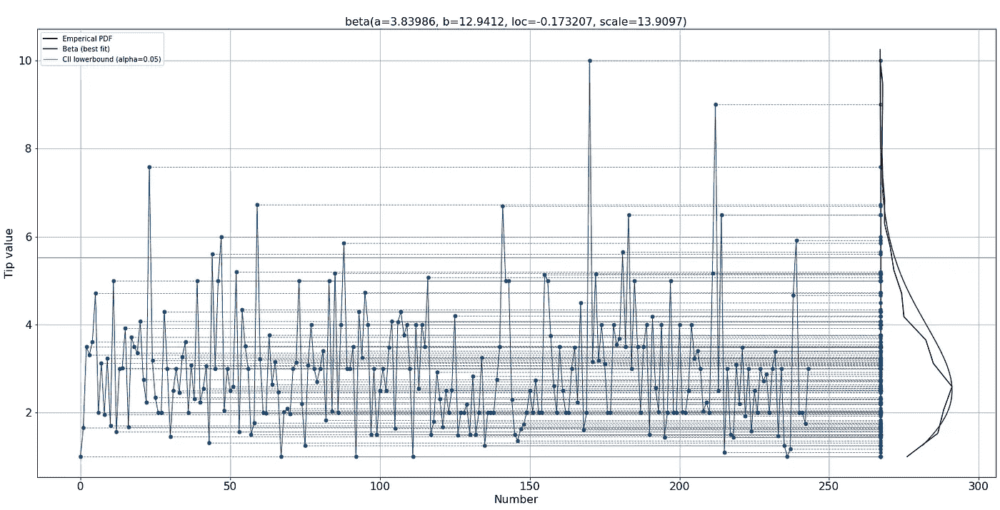
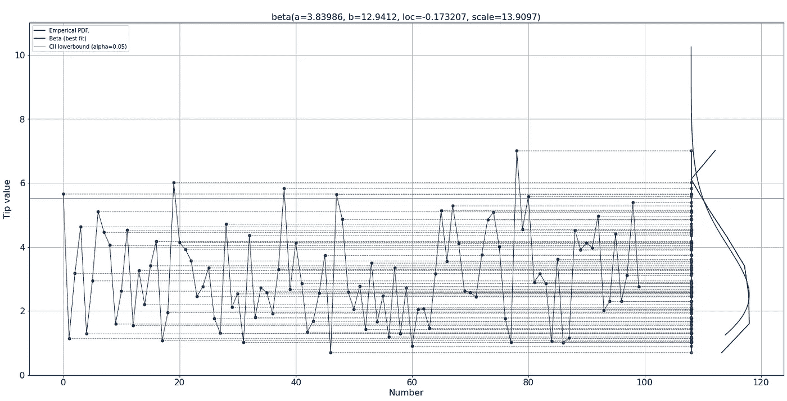

# 逐步指南：通过从单变量分布中采样生成合成数据

> 原文：[`towardsdatascience.com/step-by-step-guide-to-generate-synthetic-data-by-sampling-from-univariate-distributions-6b0be4221cb1`](https://towardsdatascience.com/step-by-step-guide-to-generate-synthetic-data-by-sampling-from-univariate-distributions-6b0be4221cb1)

## 学习如何创建合成数据，以防你的项目数据不足或用于模拟

[](https://erdogant.medium.com/?source=post_page-----6b0be4221cb1--------------------------------)[](https://towardsdatascience.com/?source=post_page-----6b0be4221cb1--------------------------------) [Erdogan Taskesen](https://erdogant.medium.com/?source=post_page-----6b0be4221cb1--------------------------------)

·发表于 [Towards Data Science](https://towardsdatascience.com/?source=post_page-----6b0be4221cb1--------------------------------) ·阅读时间 10 分钟·2023 年 3 月 27 日

--


图片来源：[Debby Hudson](https://unsplash.com/@hudsoncrafted?utm_source=unsplash&utm_medium=referral&utm_content=creditCopyText) 于 [Unsplash](https://unsplash.com/s/photos/create?utm_source=unsplash&utm_medium=referral&utm_content=creditCopyText)

数据是数据科学项目中的燃料。但如果观察数据稀少、昂贵或难以测量怎么办？合成数据可以是解决方案。合成数据是人工生成的数据，模拟真实世界事件的统计特性。***我将演示如何通过从单变量分布中采样来创建连续合成数据。*** *首先，我将展示如何通过模拟评估系统和过程，在此过程中我们需要选择概率分布并指定参数。其次，我将演示如何生成模拟现有数据集特性的样本，即根据概率模型分布的随机变量。所有示例均使用* ***scipy*** *和* ***distfit*** *库创建。*

*如果你觉得这篇文章有帮助，请使用我的* [*推荐链接*](https://medium.com/@erdogant/membership) *继续无限制地学习并注册 Medium 会员。此外，* [*关注我*](http://erdogant.medium.com/) *以便及时获取我的最新内容！*

# 合成数据 — 背景。

在过去十年中，数据量迅速增长，并导致了一个认识，即数据的质量比数量更为重要。更高的质量可以帮助得出更准确的结论和做出更明智的决策。许多组织和领域中，合成数据都能发挥作用，但有一个特别重视合成数据的领域，那就是自动驾驶汽车。在这里，数据被生成用于许多边缘案例，随后用来训练模型。像 Gartner 这样的公司强调了合成数据的重要性，Gartner 预测真实数据将很快被超越[1]。周围已经有很多清晰的例子，如由生成对抗网络（GANs）生成的虚假图像。在这个博客中，我将不会关注由 GANs 生成的图像，而是关注更基本的技术，即基于概率分布创建合成数据。

***合成数据可以通过两大类抽样技术来创建：***

1.  ***概率抽样；*** 创建与真实数据分布紧密相似的合成数据，这对于训练机器学习模型和进行统计分析非常有用。

1.  ***非概率抽样；*** 包括在没有已知选择概率的情况下选择样本，例如便利抽样、滚雪球抽样和配额抽样。这是一种快速、简单且廉价的数据获取方式。

我将重点讨论 ***概率抽样***，其中估计总体的分布参数是关键。换句话说，我们在单变量数据集的情况下寻找最佳拟合的理论分布。通过估计的理论分布，我们可以生成新的样本，即我们的合成数据集。

# 概率密度函数概述。

找到最适合模拟真实世界事件的理论分布可能具有挑战性，因为存在许多不同的概率分布。像*distfit [2]*这样的库在这种情况下非常有帮助。

[## 如何找到最适合你数据的理论分布](https://example.org/how-to-find-the-best-theoretical-distribution-for-your-data-a26e5673b4bd?source=post_page-----6b0be4221cb1--------------------------------)

### 了解基础数据分布是数据建模的重要一步，并有许多应用，例如…

[towardsdatascience.com](https://example.org/how-to-find-the-best-theoretical-distribution-for-your-data-a26e5673b4bd?source=post_page-----6b0be4221cb1--------------------------------)

图 1 展示了概率密度函数（PDF）的一个很好的概述，其中捕捉了分布的“*规范*”形状。这样的概述有助于更好地理解和决定哪种分布可能最适合特定的使用案例。在接下来的两个部分中，我们将尝试不同的分布及其参数，看看我们能多好地生成合成数据。

> 合成数据是使用统计模型生成的人工数据。



图 1\. 概率密度函数及其参数概述。创建者：[Rasmus Bááth (2012)](https://github.com/rasmusab/distribution_diagrams)。

# 创建用于模拟的合成数据。

使用合成数据是生成大型和多样化数据集以进行模拟的理想选择，这使得测试和探索不同场景成为可能。这有助于获得通过其他手段可能难以或不可能获得的见解和知识，或者在我们需要确定系统和过程的边缘情况时。然而，创建合成数据可能具有挑战性，因为它需要*通过使用理论分布和人口参数来模拟现实世界事件*。

> 使用合成数据，我们的目标是*通过估计理论分布和人口参数来模拟现实世界事件*。

为了演示合成数据的创建，我创建了一个假设用例，我们在安全领域工作，需要了解网络活动的行为。一位安全专家提供了以下信息；***大多数网络活动在 8 点开始，并在 10 点左右达到高峰。一些活动会在 8 点之前出现，但不多。下午，活动逐渐减少，并在下午 6 点左右停止。然而，1 点到 2 点之间也有一个小高峰。*** 请注意，一般来说，描述*异常*事件比描述*正常/预期行为*要困难得多，因为正常行为是最常见的，因此观测数据的比例最大。让我们将这些信息转化为统计模型。

## 将领域知识转化为统计模型。

根据描述，我们需要决定最佳匹配的理论分布。然而，选择最佳理论分布需要调查许多分布的特性（见图 1）。此外，你可能需要多个分布；*即概率密度函数的混合*。在我们的示例中，我们将创建两个分布的混合，一个用于早晨，一个用于下午活动。

> **描述早晨**：“**大多数网络活动在 8 点开始，并在 10 点左右达到高峰。一些活动会在 8 点之前出现，但不多。**”
> 
> 为了对早晨网络活动进行建模，我们可以使用正态分布。它是对称的，没有重尾。我们可以设置以下参数：均值为上午 10 点，且相对较窄的范围，如 sigma=0.5。图 2 中显示了一些具有不同均值和 sigma 参数的正态 PDF。尝试感受 sigma 参数变化对斜率的影响。



图 2\. 具有各种参数的正态分布。来源：[维基百科](https://en.m.wikipedia.org/wiki/Normal_distribution)

> **下午描述：“活动逐渐减少并在下午 6 点左右停止。然而，1 到 2 点之间也有一个小峰值。”**
> 
> 适合下午活动的分布可能是一个具有重右尾的偏斜分布，可以捕捉逐渐减少的活动。韦布尔分布可以是一个候选，因为它用于建模具有单调递增或递减趋势的数据。然而，如果我们**并不总是**期望网络活动单调递减（因为在周二或其他情况中不同），那么考虑如**伽马**这样的分布可能更好（图 3）。在这里，我们也需要调整参数，以便它最符合描述。为了更好地控制分布的形状，我更喜欢使用广义伽马分布**。**



图 3\. 一个具有不同参数的伽马分布。来源：[维基百科](https://en.m.wikipedia.org/wiki/Gamma_distribution)

在下一部分中，我们将尝试这两种候选分布（正态分布和广义伽马分布），并设置参数以创建代表网络活动用例的 PDF 混合。

## 优化参数以创建最符合场景的合成数据。

在下面的代码部分，我们将从均值为 10（代表上午 10 点的峰值）和标准差为 0.5 的正态分布中生成 10,000 个样本。接下来，我们从广义伽马分布中生成 2,000 个样本，我将第二个峰值设置在`loc=13`。我们本来也可以选择`loc=14`，但这会导致两个分布之间的间隔更大。下一步是将两个数据集结合起来并打乱它们。请注意，打乱并不是必须的，但如果不这样做，样本将首先按 10,000 个正态分布样本排序，然后按 1,000 个广义伽马分布样本排序。这种顺序可能会在对数据集进行任何分析或建模时引入偏差。

```py
import numpy as np
from scipy.stats import norm, gengamma
# Set seed for reproducibility
np.random.seed(1)

# Generate data from a normal distribution
normal_samples = norm.rvs(10, 1, 10000)
# Create a generalized gamma distribution with the specified parameters
dist = gengamma(a=1.4, c=1, scale=0.8, loc=13)
# Generate random samples from the distribution
gamma_samples = dist.rvs(size=2000)

# Combine the two datasets by concatenation
dataset = np.concatenate((normal_samples, gamma_samples))
# Shuffle the dataset
np.random.shuffle(dataset)

# Plot
bar_properties={'color': '#607B8B', 'linewidth': 1, 'edgecolor': '#5A5A5A'}
plt.figure(figsize=(20, 15)); plt.hist(dataset, bins=100, **bar_properties)
plt.grid(True)
plt.xlabel('Time', fontsize=22)
plt.ylabel('Frequency', fontsize=22)Let’s plot the distribution and see what it looks like (Figure 3). Usually, it takes a few iterations to tweak parameters and fine-tuning. 
```



图 4\. 正态分布和广义伽马分布的概率密度函数混合。作者提供的图像。

我们使用两种分布的混合来创建合成数据，以模拟特定人群网络活动的正常/预期行为（图 4）。我们在上午 10 点模拟了一个主要的峰值，网络活动从早上 6 点开始，一直到下午 1 点。第二个峰值在下午 1 到 2 点左右，右尾很重，延续到晚上 8 点。下一步可能是设置置信区间并追求异常值检测。有关异常值检测的更多细节可以在以下博客 [3] 中找到：

[](/outlier-detection-using-distribution-fitting-in-univariate-data-sets-ac8b7a14d40e?source=post_page-----6b0be4221cb1--------------------------------) ## 使用分布拟合进行异常值检测

### 学习如何使用概率密度函数检测异常值，以实现快速、轻量的模型和可解释的结果。

[towardsdatascience.com

# 创建与真实数据分布高度一致的合成数据。

到目前为止，我们创建了允许通过模拟探索不同场景的合成数据。这里，我们将创建与真实数据分布高度一致的合成数据。作为演示，我将使用 *Seaborn* 的*消费小费*数据集 [4] 并使用 [*distfit library [2]*](/how-to-find-the-best-theoretical-distribution-for-your-data-a26e5673b4bd) 估算参数。*如果你是第一次估算概率密度函数*，*我推荐阅读关于* *distfit* *的博客。* *tips* 数据集仅包含 244 个数据点。让我们首先初始化库，加载数据集并绘制值（见代码部分）。

```py
# Install distfit
pip install distfit

# Initialize distfit
dfit = distfit(distr='popular')

# Import dataset
df = dfit.import_example(data='tips')

print(df)
#        tip
# 0      1.01
# 1      1.66
# 2      3.50
# 3      3.31
# 4      3.61

# 239    5.92
# 240    2.00
# 241    2.00
# 242    1.75
# 243    3.00
# Name: tip, Length: 244, dtype: float64

# Make plot
dfit.lineplot(df['tip'], xlabel='Number', ylabel='Tip value')
```

## 对数据集进行可视化检查。

加载数据后，我们可以进行可视化检查，以了解范围和可能的异常值（图 5）。244 个小费的范围主要在 2 到 4 美元之间。基于这个图，我们还可以建立预期分布的直观印象，当我们将所有数据点投影到 y 轴时（我将稍后演示）。



图 5\. 244 位客户的消费小费数据集。

*distfit* 的搜索空间设置为*流行*的 PDF，平滑参数设置为 3。样本量过少会使直方图出现不平滑，并导致分布拟合不佳。

```py
# Import library
from distfit import distfit

# Initialize with smoothing and upperbound confidence interval
dfit = distfit(smooth=3, bound='up')

# Fit model
dfit.fit_transform(df['tip'], n_boots=100)

# Plot PDF/CDF
fig, ax = plt.subplots(1,2, figsize=(25, 10))
dfit.plot(chart='PDF', n_top=10, ax=ax[0])
dfit.plot(chart='CDF', n_top=10, ax=ax[1])

# Show plot
plt.show()

# Create line plot
dfit.lineplot(df['tip'], xlabel='Number', ylabel='Tip value', projection=True)
```

最佳拟合的 PDF 是*beta*（图 6，红线）。上界置信区间 `alpha=0.05` 为 5.53，根据视觉检查，这似乎是一个合理的阈值（红色垂直线）。



图 6\. 左：PDF，右：CDF。顶部 5 个拟合的理论分布以不同颜色显示。最佳拟合为 Beta，用红色标记。（图片由作者提供）

找到最佳分布后，我们可以将估算的 PDF 投影到我们的折线图上，以获得更好的直观感受（图 7）。请注意，PDF 和经验 PDF 与图 6 中完全一致。



图 7\. 244 位客户的消费小费数据集。基于当前数据估算的经验 PDF。理论 PDF 是最佳拟合分布。（图片由作者提供）

使用最佳拟合分布的估计参数，我们可以开始创建关于小费的合成数据（见下方代码部分）。让我们创建 100 个新样本并绘制数据点（见图 8）。*合成数据提供了许多机会，即它可以用于训练模型，也可以帮助我们了解诸如使用小费储蓄特定金额所需的时间等问题。*

```py
# Create synthetic data
X = dfit.generate(100)

# Ploy the data
dfit.lineplot(X, xlabel='Number', ylabel='Tip value', grid=True)
```



图 8。合成数据。我们可以看到值在 2-4 之间，有一些离群值。红色水平线是先前估计的 alpha=0.05 的置信区间。经验 PDF 是基于当前数据估计的。理论 PDF 是基于我们之前的拟合。这允许快速比较生成的数据和拟合的理论 PDF。（图片由作者提供）

# 最后的话。

我展示了如何通过使用概率密度函数以单变量方式创建合成数据。使用*distfit*库，可以评估 89 种理论分布，估计的参数可以用于模拟现实世界事件。尽管这很棒，但创建合成数据也存在一些局限性。首先，合成数据可能无法完全捕捉现实世界事件的复杂性，缺乏多样性可能导致模型在训练时无法泛化。此外，由于不正确的假设或参数估计，合成数据可能会引入偏差。务必始终对你的合成数据进行合理性检查。

*保持安全。保持冷静。*

***干杯，E.***

*如果你觉得这篇文章有帮助，可以使用我的* [*推荐链接*](https://medium.com/@erdogant/membership) *继续无限学习并注册 Medium 会员。还有，* [*关注我*](http://erdogant.medium.com/) *以保持最新内容的更新！*

## 软件

+   [Distfit Github/文档](https://erdogant.github.io/distfit/)

+   [Distfit notebook 示例](https://erdogant.github.io/distfit/pages/html/Documentation.html#colab-notebook)

## 让我们联系！

+   [在 LinkedIn 上联系我](https://www.linkedin.com/in/erdogant/)

+   [在 Github 上关注我](https://github.com/erdogant)

+   [在 Medium 上关注我](https://erdogant.medium.com/)

## 参考文献

1.  Gartner, *Maverick Research: 忘掉你的真实数据——合成数据是 AI 的未来*, Leinar Ramos, Jitendra Subramanyam, 2021 年 6 月 24 日。

1.  E. Taskesen, *如何找到最适合你数据的理论分布*, 2023 年 2 月 Medium。

1.  E. Taskesen, *在单变量数据集中使用分布拟合进行离群值检测*, Medium 2023

1.  Michael Waskom, [Seaborn](https://github.com/mwaskom/seaborn-data), [*Tips 数据集*](https://github.com/mwaskom/seaborn-data), [*BSD-3 许可证*](https://github.com/mwaskom/seaborn/blob/master/LICENSE.md)
