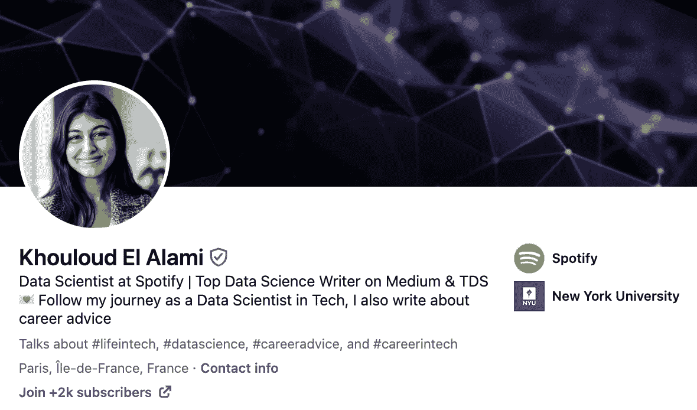

# 网络交流让我找到工作，即使我曾被拒绝，看看我是怎么做到的。

> 原文：[`towardsdatascience.com/stop-being-bad-at-networking-6-must-do-steps-to-stand-out-in-a-crowded-data-science-job-market-cec48aa847be`](https://towardsdatascience.com/stop-being-bad-at-networking-6-must-do-steps-to-stand-out-in-a-crowded-data-science-job-market-cec48aa847be)

## 别低估 LinkedIn 网络交流的重要性，它阻碍了你找到数据科学工作的机会。

 [Khouloud El Alami](https://medium.com/@elalamik?source=post_page-----cec48aa847be--------------------------------)

·发表于 [Towards Data Science](https://towardsdatascience.com/?source=post_page-----cec48aa847be--------------------------------) ·12 分钟阅读·2023 年 11 月 5 日

--

欢迎来到 LinkedIn 101 — 图片由作者提供 (Dall.E)

三年前，当我还是一名学生时，我申请了一个在科技领域非常有竞争力且真的很酷的数据科学实习职位，这是我非常渴望的。

剧透警告：我被拒绝了。*两次*。

> 但我还是得到了实习机会。

怎么做？我把 LinkedIn 网络交流技巧付诸实践。在这篇文章中，我将向你展示如何自己做到这一点，并让你更接近梦想中的工作。然后，我会详细讲述我获得这个实习职位的故事！

现在，作为一名 Spotify 数据科学家，我每天都被渴望成为数据科学家的消息淹没。他们知道，就像我一样，LinkedIn 上的网络交流不仅有用，而且对职业发展至关重要。

**没有它你不会走得远。**

如果你是一名寻找数据科学职位的求职者，这篇文章可能会改变你的游戏规则。在这里，我将深入探讨*有效的网络交流策略*，这些策略帮助我获得了想要的机会，即使在申请过程中被拒绝之后。

## 说到 LinkedIn，你可以在[这里](https://www.linkedin.com/in/elalamik/)找到我。

# 职场竞争激烈，极其竞争，而且不总是公平的。

根据《福布斯》，[*75% 的简历*](https://www.forbes.com/sites/nextavenue/2014/03/18/how-to-get-your-resume-read-by-an-employer/#35aca74a6865) *被申请跟踪软件* **在**招聘经理看到之前就已被拒绝。

这对你意味着两件事：

1.  如果你不利用社交关系，你的职业生涯可能不会走得太远。

1.  如果你不这样做，确保别人会做到，他们会让你一无所有。

你必须做的远远不止按下发送按钮。

我也经历过——发了数千份申请，但都无济于事。

> 要成功，你需要脱颖而出，为此你需要一个策略。

仍然不信服？这里有四个统计数据会让你完全重新思考你如何申请工作以及为什么人际网络如此重要：

+   [80%的职位](http://www.forbes.com/sites/jacquelynsmith/2013/04/17/7-things-you-probably-didnt-know-about-your-job-search/)从未被发布，仅通过人际网络才能找到。

+   在 2016 年，[70%的人](https://news.linkedin.com/2017/6/eighty-percent-of-professionals-consider-networking-important-to-career-success)在他们已经与公司里的某个人建立了联系的公司获得了聘用。

+   [仅有 7%的求职者获得员工推荐，但这些推荐导致了 40%的聘用](http://theundercoverrecruiter.com/infographic-employee-referrals-hire/)! 基本上，来自内部人士的好话可以大大提高你的成功几率。

+   [80%的专业人士](https://news.linkedin.com/2017/6/eighty-percent-of-professionals-consider-networking-important-to-career-success)将人际网络归功于他们的职业成功。

> 注意 — 在求职的情况下，人际网络只能帮助你让申请更引人注目，其余的还是要靠你自己。如果你对你所瞄准的工作不够资格，人际网络就没有意义了。
> 
> 就我而言，我被录用是因为我已经具备了技能，唯一的问题是让他们知道我存在。这就是人际网络改变游戏规则的地方。

申请陷入困境 vs. 人际网络的力量 — 作者（Dall.E）的图片

# 你在人际网络方面很差

或者至少，你很可能不擅长这方面。大多数人不知道如何进行人际网络。我甚至会说，很多人在人际网络方面表现得*很糟糕*。你可能也是其中之一。

这没关系。我们从学校毕业时没人给我们一本*操作手册*。我自己也不是很棒，但当我意识到成功需要这些技巧时，我很早就学到了许多窍门。**这确实有效。**

当你还在求职者的另一边游泳时，人际网络更加困难——这是一个几乎没有职业经验的求职者的侧面。

**让我们做一个思维实验**——假设你想申请*xyz*公司，你已经找到了一些可以在 LinkedIn 上联系以获取更多信息或帮助的人。

如果你发送的消息内容是：“我们可以聊聊你的数据科学职业历程吗？”或者“我很想了解你是如何做到现在的位置的？”，那你做错了。

> 你可能已经在自我设限，因为你很可能以错误的方式接近他们。

我怎么知道的？我曾经在池子的两边。当我还是一个寻找第一个工作的挣扎的学生时，现在作为一个被希望获得第一个工作的人的 Data Scientist。

这是我用来正确开展人际网络的策略。

# 步骤 1\. 利用您的网络

您的网络是一个金矿。这里的“网络”指的是您已经认识的人：朋友、家人、同学和同事。

让他们了解您的职业目标和抱负。我相信您一定在动态中见过一两条类似的帖子，里面的人在向他们的网络寻求更多曝光。

不要羞于做同样的事情。在最坏的情况下，您将继续失业，这与目前的状态没有区别。在最好情况下，您将获得一个机会，那就是您所追求的胜利！

## **您可以做的具体事情：**

+   **列出您认为可以帮助或指导您的亲密联系人**。也许是以前的同事或同学。

+   **组织一次随意的咖啡会面或虚拟见面会**，讨论您的职业目标。

+   **明确地问**“您是否认识[行业/角色]中的任何人，我应该与他们交谈？”

+   **发布一条询问您网络曝光的帖子。** 您可以在其中分享您的抱负和简历。

您会惊讶于您的网络中有多少人会认识某些人或可以将您推荐给一个符合您寻找的角色的机会。

> 网络中的某人的推荐至少可以提升您被注意到的机会。

# 步骤 2\. 投网更广

当这不起作用时，就该投网更广了。

致力于扩展您的网络。

## 如何做到？

+   **注册数据/人工智能或感兴趣公司的网络研讨会、工作坊或研讨会。** 我在加入俱乐部之前参加了很多 Spotify 的网络研讨会，不要害怕这样做。参加后，您可以通过 LinkedIn 与演讲者或参与者建立联系，发送一条提到活动的个性化消息。

+   **参加数据/人工智能活动或会议。** 这将让您获得幕后访问权限，并有机会结识相关人员。确保与尽可能多的人建立联系。您永远不知道谁会给您带来胜利的机会！

在与新朋友建立联系时，总是要带上背景介绍自己。与其简单地说“你好”，不如说“你好，我参加了同一个关于 AI 进展的网络研讨会，我很想与您讨论 x 事”。

让我们更深入地探讨如何在 LinkedIn 上与您的网络建立联系⬇

# 步骤 3\. 不要含糊其辞。问实质性的问题

现在您准备扩展您的网络。您找到了一些有兴趣联系的人。那么该如何做呢？

## 最宝贵的经验教训——不要在提问时含糊其辞！

具体明确地说明，您成功的机会会增加 —— 图片来源：作者（Dall.E）

您要尽量减少您与专业人士之间的摩擦。

> **泛泛的问题会得到泛泛的回答，** 或者更糟的是，根本没有回答。如果您要联系某人，请做好功课。

我必须承认，我总是避免回答那些问我“在 Spotify 工作是什么感觉？”、“能告诉我你的职业经历吗？”、“你做了什么才能成为今天的你？”这样的问题。

这些问题听起来像是存在主义的问题，需要我花费大量的精力来回答，更重要的是 — 时间，这对我来说是最宝贵的资产。

## 所以规则 #1，直截了当。

与其问“在 Spotify 工作是什么感觉？”，不如尝试问“我注意到 Spotify 最近整合了 AI 以改善播放列表建议。你能分享一下你在这个项目中的角色吗？”，但前提是你确定对方确实参与了这个项目。

我在 Spotify 负责汽车体验方面的工作，因此对播放列表的情况了解不多。将你的问题专门针对你联系的对象。使问题对他们相关，以最大限度地提高得到回复的机会。

## 你可以做的一些额外事情：

+   **在联系之前，花 10–15 分钟研究一下对方的当前角色、公司或任何最近的成就。** 这是你想要你的社交媒体跟踪技能最闪光的时候（ — 而不是你的前任）。

+   **提出展示你已做功课的问题：** “我看到你最近的项目涉及[具体细节]。你是如何处理[具体方面]的？”

+   避免宽泛的问题。与其问“对像我这样的人有什么建议？”，不如问“我应该专注于哪些具体技能才能在[具体角色/行业]中表现出色？”

这应该能让你顺利开始！

# 第 4 步。专业礼仪是必须的

在做这些事情时，你要注意信息的呈现方式。

## 在给你不认识的人发消息时，要记住两个重要规则：

1.  **始终仔细检查名字。** 这看起来可能微不足道，但它对信息的接收方式以及信息是否会被接收有很大的影响。我遇到过许多人弄错我的名字，这让我感到非常不快。既然你没有花时间正确拼写他们的名字，为什么他们要花时间帮助你呢？这是他们的身份，所以从一开始就要做对。

1.  **当他们给你提供了你所要求的信息时，请回复。** 回复是一种基本的礼仪。如果有人从他们的日程中抽出时间为你提供见解或建议，务必表示感谢。我遇到过许多人在得到他们想要的东西后完全不再回复我的消息，这也让人感到非常不悦。

## 为什么这些都很重要？

不要让他们的信息陷入沉寂，表示感激 — 图片由作者提供（Dall.E）

这是合乎体面的做法。这表现出你对联系人的尊重和关怀。如果他们第一次回复了，你更有可能在未来得到他们的帮助。

不要破坏未来的机会。

# 第 5 步。保持更新

如果有人帮助了你，确保他们投入了一些时间和精力，所以要确保通过提供进展更新来跟进。

人们会欣赏与你一起庆祝你的胜利，尤其是当他们在其中发挥了作用时。

他们会看到努力帮助你所带来的影响，这会让他们觉得有意义。这不仅能保持关系的温暖，还鼓励他们在未来帮助更多的人。

## 你可以做的具体事项：

+   如果有人为你推荐了工作或其他联系，请**更新他们**结果，即使没有成功。

+   **分享里程碑或成就，**特别是如果他们的建议对其有所贡献。像“感谢你对[具体细节]的建议，我成功地[具体成就]”这样的简短信息就足够了！

# 第 6 步：优雅地退出

礼貌往往会有很大帮助。这是体面之举。

自从我开始在网上写关于我的经验后，LinkedIn 上向我寻求帮助的人数激增。全职工作、我的博客和个人承诺使得我的时间有限。

我们常听说时间是我们最宝贵的资产，今年我比以往任何时候都更能体会到这一点。时间是我生活中最重视的东西，这对你寻找的其他专业人士来说可能也是如此。

当我确实分配时间来帮助他人时，这是一个有意识的决定，通常意味着其他任务被搁置。大多数情况下，我选择帮助的人都很友好，一直到他们得到想要的东西，那时这种友好突然消失得无影无踪。

> 这不是期望不断的感激，而是保持基本的人性尊严。记住，网络拓展是关于培养和维护真实关系。

外面的世界很小。匆忙离开或不经过深思可能会回来伤害我们。因此，始终保持高尚的离开方式是好的，这为未来的机会留下了大门。

## 你可以做的事情：

+   如果有人将你与另一位专业人士联系起来，无论结果如何，都要回头**感谢**原始联系人。*TopResume 于 2021 年进行的一项研究显示，68% 的招聘专业人士承认，面试者的感谢信会影响他们的决定。*

+   如果有人花时间回答了你的问题，请花时间回复他们，并且要准时。

保持尊重，重视他人的时间，并且不要忘记表达感激。

# 成功时回馈

网络圈：从学生到导师 — 作者图像（Dall.E）

当你也成为其他人的资源时，网络圈就完成了。

一旦你成功了，务必记住你的出发点。我见过许多人由于其他专业人士的支持和帮助而取得成功，但没有将同样的礼貌延伸给新的参与者。

在 Medium 上写作是我回馈社区的方式，为了感谢社区在某种程度上给予我的帮助。这是我回报在我最困难时给予我善意的方式。

网络的美妙之处在于共同成长——当你帮助他人成长时，你也在他们的职业旅程中巩固了自己的足迹。他们不会忘记你，你也很可能不会忘记他们。

## 你怎么做呢？

+   提供指导年轻的专业人士或来自你母校的学生。

+   在你的网络或 LinkedIn 上分享职位空缺或机会。

+   主持或参与网络研讨会、播客，或撰写文章分享你的专业知识和经验。

看到有人因为你的小帮助而成功，这种满足感是无可比拟的。

# 那么，我是怎么被录用的呢？

我实施了我在这篇文章中提到的大多数步骤。

1.  我**参加了一次会议**，其中一位我感兴趣的公司的高级数据科学家正在演讲。

1.  在被拒绝后，我**在 LinkedIn 上联系了他**。我保持了礼貌和专业。

1.  我问他是否可以进一步讨论我的申请，但他把我引导到了招聘人员那里。然后我**优雅地结束了对话**。

1.  与此同时，我被拒绝了申请过程。

1.  十天后，**他再次联系了我**。他告诉我他们正在进行新一轮的招聘，并提出推荐我担任该职位。

1.  我给他发送了我的简历，**专门为那家公司量身定做**。

1.  一周后，我已经**获得了加入团队的邀请！**

我最后没有加入这家公司，因为我随后收到了 Spotify 的录用通知，但正如你所见，除了我刚刚与你分享的内容，没有其他大的秘密。

我最初被拒绝的原因是因为我的简历没有通过筛选测试。造成这种情况的原因有很多：系统没有挑选到简历、招聘人员没有看到简历等等。

我有资格获得这份工作，这也是为什么网络在我这里奏效的原因，所以确保你也是如此。

如果我没有采取额外的步骤进行联系和网络，我就不会有机会通过筛选过程、面试并证明自己是值得的！

# 要进一步了解，请查看我关于如何破解当前数据科学职位市场的完整指南！

 ## 导航当前数据科学职位市场的指南

### 为什么现在很难找到数据科学的工作，以及你可以做些什么

[towardsdatascience.com

# 总结 — 打造你的网络游戏的步骤

+   **利用你现有的网络** — 触及朋友、家人、同学和同事。公开分享你的职业目标，寻求介绍或推荐。

+   **扩展你的网络** — 参加行业活动、网络研讨会和会议。与与会者和演讲者互动，并在 LinkedIn 上与他们建立联系。

+   **提出具体问题 —** 联系时要直接明确。一般性的问题往往被忽视。做些研究，并根据对方的经验或当前角色提出有针对性的问题。

+   **保持职业礼仪 —** 注意细节，例如正确拼写名字。当有人提供见解或帮助时，总是要表示感谢。注意他人的时间。

+   **提供更新 —** 如果有人帮助了你，与你分享你的进展和里程碑。这样可以保持关系的温暖，并鼓励他们在必要时进一步帮助你。

+   **优雅地结束 —** 当你结束互动时，要礼貌和尊重。记住，网络关系是关于建立真实的、长期的关系。

+   **传递善意 —** 一旦你在职业生涯中取得了进展，记得帮助他人。分享知识、指导他人，甚至仅仅是传递工作机会，都可以对他人的旅程产生重大影响。

# 我为你准备了礼物 🎁！

注册我的[**新闻通讯**](https://levelupwithk.substack.com/) **K's DataLadder**，你将自动获得我的**终极 SQL 备忘单**，包含我在大科技公司工作中每天使用的所有查询 + 另一个神秘礼物！

我每周分享在科技行业担任数据科学家的经历，以及实用技巧、技能和故事，旨在帮助你提升自己 —— 因为没有人真正了解，直到他们身临其境！

## 如果你还没有这样做

+   订阅我的[**YouTube**](https://rebrand.ly/tdf62uv)频道。新视频即将上线！

+   关注我的[**Instagram**](https://www.instagram.com/elalamikhouloud/)、[**LinkedIn**](https://www.linkedin.com/in/elalamik/)、[**X**](https://twitter.com/elalamik)，随你选择

再见啦！
