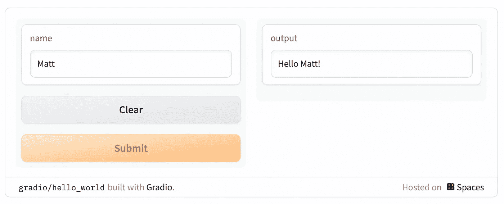
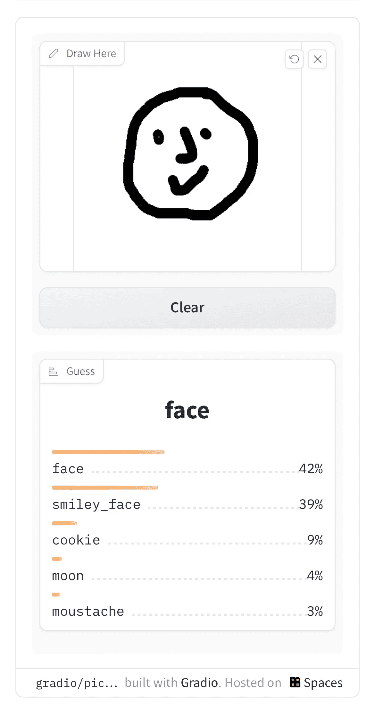
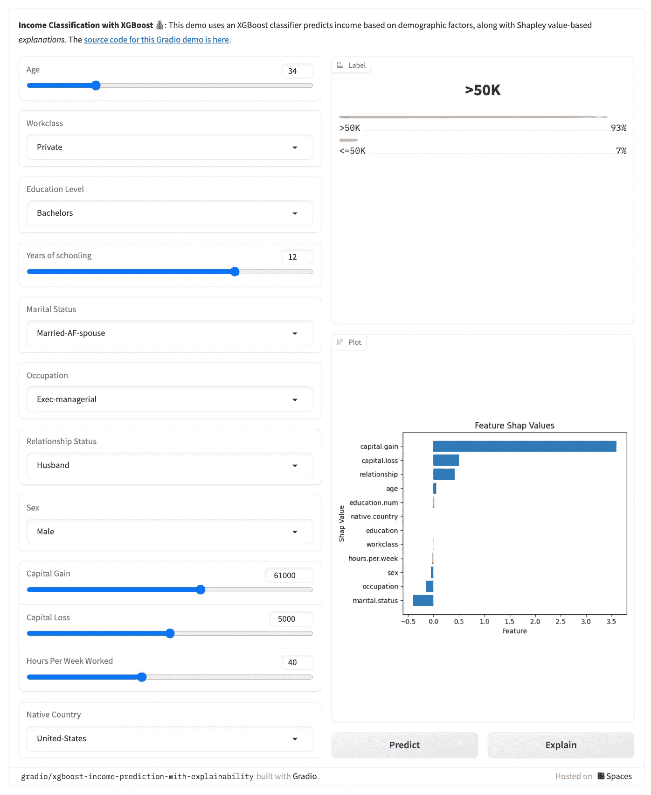

# 停止使用 PowerPoint 来做你的机器学习演示，试试这个替代工具

> 原文：[`towardsdatascience.com/stop-using-powerpoint-for-your-ml-presentations-and-try-this-instead-f943c2e9e284`](https://towardsdatascience.com/stop-using-powerpoint-for-your-ml-presentations-and-try-this-instead-f943c2e9e284)

## Gradio 是打动技术和非技术利益相关者的可靠方式——为什么更多的数据科学家和机器学习工程师不使用它呢？

[](https://medium.com/@mattchapmanmsc?source=post_page-----f943c2e9e284--------------------------------)[](https://towardsdatascience.com/?source=post_page-----f943c2e9e284--------------------------------) [Matt Chapman](https://medium.com/@mattchapmanmsc?source=post_page-----f943c2e9e284--------------------------------)

·发表于 [Towards Data Science](https://towardsdatascience.com/?source=post_page-----f943c2e9e284--------------------------------) ·6 分钟阅读·2023 年 7 月 3 日

--


图片来自 [Will Porada](https://unsplash.com/@will0629) 在 [Unsplash](https://unsplash.com/photos/ZaGcU6BxJEc)

PowerPoint 演示文稿很糟糕。

至少，差的确实如此。

不好的 PowerPoint 会让观众分心（他们会关闭摄像头并进行多任务处理），而且容易让演讲者养成使用过多技术术语和长时间冗长讲解等不良习惯。

那么为什么数据科学家会如此频繁地使用 PowerPoint 呢？

在最近一个关于这个话题的 Reddit [讨论串](https://www.reddit.com/r/datascience/comments/v7k36h/data_scientists_how_much_time_do_you_actually/) 中，从事数据科学的受访者报告称，他们花费了 10% 到 60% 的时间制作幻灯片或进行演讲。我意识到这不是一个非常可靠的统计数据，但不论真实分布如何，这种情绪对于许多从事数据科学工作的人来说是准确的：我们使用 PowerPoint——非常多——来展示从模型卡片到 ROC 曲线和 Shapley 值的截图。

无论你喜欢与否，**PowerPoint 是现代机器学习技术栈的重要组成部分**，它不会消失。

或者它并非如此？

在这篇文章中，我将向你介绍 Gradio，一个免费的工具，允许你：

1.  **通过你的浏览器或 Jupyter Notebook 可视化机器学习模型**

1.  **通过互动且易于理解的可视化给你的非技术利益相关者留下深刻印象**

1.  测试你的模型并**识别弱点**和特征重要性

我与 Gradio 没有任何关联，也不试图向你推销任何东西——我只是想展示一个在我作为数据科学家的工作中效果良好的工具，**特别是对于使用表格数据的模型，如 XGBoost**。

# 介绍 Gradio：一个免费的、互动的方式来展示和测试您的机器学习模型

在开发者自己的[话语](https://gradio.app)中，

> Gradio 是演示机器学习模型的最快方法，它提供了一个友好的网络界面，使任何人都可以在任何地方使用它！

这怎么运作的？其实非常简单。

# 你好，世界！

首先，[通过 pip 安装 Gradio](https://gradio.app/getting_started/)。

```py
pip install gradio
```

接下来，导入 Gradio 并定义一个可以接受输入的函数。然后，将您的模型包装在‘gradio.Interface()’类中，——瞧——您的模型就拥有了一个友好的互动界面，可以嵌入到笔记本或网页中。这里是一个使用非常简单的“Hello {user}！”函数的示例：

```py
import gradio as gr

def greet(name):
    return "Hello " + name + "!"

demo = gr.Interface(fn=greet, inputs="text", outputs="text")

demo.launch() 
```



图片由作者提供

如果您在 Jupyter Notebook 中运行它，上面的演示将自动出现在新单元格中。如果您在脚本中运行，它将出现在您的浏览器中，网址为 http://localhost:7860。如果您愿意，您还可以“自动生成一个公共链接，您可以与同事分享，让他们通过自己的设备远程与您计算机上的模型进行互动”（[docs](https://gradio.app)）。

# 如何将 Gradio 与您的机器学习模型一起使用

举一个稍微复杂一点的例子，假设我们有一个可以识别手绘图像的机器学习模型。使用 Gradio，我们可以创建一个接受用户输入的草图板……

```py
import gradio as gr
def sketch_recognition(img):
    pass# Implement your sketch recognition model here...

gr.Interface(fn=sketch_recognition, inputs="sketchpad", outputs="label").launch()
```

…给我们提供了一种巧妙的方法来绘制草图，将其传递给模型，并实时演示模型：



图片由作者提供

*注意：为了保持本文的长度在可管理范围内，我没有包括有关模型本身的详细信息；如果您正在寻找模型，您可能想查看* [*HuggingFace*](https://huggingface.co/docs/transformers/index)*，这是一个很棒的预训练模型库，可以很容易地加载到 Jupyter 笔记本或 Python 脚本中，并与 Gradio 一起使用。*

只需几行代码，Gradio 就能轻松地以任何人都能理解的互动方式展示您的模型。想想您团队中的可能性——这将使您向团队或利益相关者展示模型变得多么容易？

*如果您喜欢这个故事，点击我的‘关注’按钮对我意义重大——只有 1%的读者这样做！感谢阅读。*

# 那 XGBoost 呢？

是的，我知道——用一些炫酷的图像识别模型做演示很好，但实际上，XGBoost 通常在实际的数据科学团队中占据主导地位。

好吧，如果这是您在想的，我有一些好消息要告诉您：Gradio 可以与各种模型一起使用，包括像 XGBoost 这样的表格数据模型。

这是一个[示例](https://huggingface.co/spaces/gradio/xgboost-income-prediction-with-explainability/blob/main/app.py)，展示了一个用 Gradio 展示的 XGBoost 模型，该模型用于预测人们的收入：



图片由作者提供。代码可在 [此处](https://huggingface.co/spaces/gradio/xgboost-income-prediction-with-explainability/blob/main/app.py) 获取。

如你所见，Gradio 使得通过调整开关和滑块与模型互动成为可能，并观察这些调整如何影响预测。你甚至可以使用 Shapley 值来查看不同特征在确定模型预测中的重要性！

# 我如何使用 Gradio

Gradio 永远不会取代传统的模型测试和评估方法（例如分类报告和使用适当的样本外测试数据集），但我发现它在我日常工作中有两个方面很有用：

1.  **向非技术利益相关者解释模型**——Gradio 帮助我回答利益相关者的临时问题，比如“如果我们改变这个变量，模型的预测会发生什么？”而且，你不需要拥有 AI 博士学位来调整开关，因此每个人都可以尝试操作模型，建立自己对模型工作的理解，无论他们是否有技术背景或懂得编码。

1.  **测试我的模型**——Gradio 让你实时查询模型，测试你的假设，并迅速识别模型中的隐藏弱点（例如发现意外行为）。这是比批量测试更快速的替代方案，而且——至关重要的是——它使测试过程民主化。使用 Gradio，你不需要依赖一个孤立的数据科学家来运行笔记本中的批量测试——你可以公开托管模型（例如在 [HuggingFace Spaces](https://huggingface.co/docs/hub/spaces-sdks-gradio) 上），分享模型的链接，每个团队成员都可以参与并尝试探测模型。

# Gradio 是预言中的 PowerPoint 杀手吗？

不——但这并不是重点。

PowerPoint 的多功能性意味着像 Gradio 这样的狭窄工具不能完全替代它。此外，如果 PowerPoint 使用得*好*，它实际上可以是展示 ML 生命周期部分（如模型卡和业务案例）的极其有效的方法。

但是对于 ML 生命周期的其他部分（如展示特征重要性和模型结果），PowerPoint 并不总是效果很好，你可能会发现 Gradio 有助于解决它的一些弱点，防止观众在演示过程中打瞌睡。

所以，如果你是一个数据科学家或机器学习工程师，觉得 PowerPoint 无聊或效果不好，为什么不试试 Gradio 呢？对我来说，它确实帮助很大。

# 哦，还有一件事——

我开设了一个名为 [AI in Five](https://aiinfive.substack.com/) 的免费通讯，每周分享 5 个要点，涵盖最新的 AI 新闻、编码技巧和数据科学家/分析师的职业故事。没有炒作，没有“数据是新石油”的废话，也没有来自埃隆的推文——只有实用的技巧和见解，帮助你在职业发展中进步。如果这对你有吸引力，[点击这里订阅](https://aiinfive.substack.com/)！

[](https://aiinfive.substack.com/?source=post_page-----f943c2e9e284--------------------------------) [## AI in Five | Matt Chapman | Substack

### 最新的数据科学和人工智能领域的新闻、职业故事和编码技巧，**总结**为 5 个要点…

aiinfive.substack.com](https://aiinfive.substack.com/?source=post_page-----f943c2e9e284--------------------------------)
