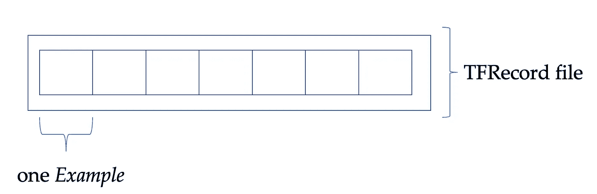

# 在 TensorFlow Record 文件中存储图像

> 原文：[`towardsdatascience.com/storing-images-in-tensorflow-record-files-166d030269fb?source=collection_archive---------11-----------------------#2023-03-02`](https://towardsdatascience.com/storing-images-in-tensorflow-record-files-166d030269fb?source=collection_archive---------11-----------------------#2023-03-02)

## 如何使用 TFRecord 文件，一种 TensorFlow 特定的数据格式，用于高效的数据存储和读取，处理图像时

[](https://pascaljanetzky.medium.com/?source=post_page-----166d030269fb--------------------------------)[](https://towardsdatascience.com/?source=post_page-----166d030269fb--------------------------------) [Pascal Janetzky](https://pascaljanetzky.medium.com/?source=post_page-----166d030269fb--------------------------------)

·

[阅读原文](https://medium.com/m/signin?actionUrl=https%3A%2F%2Fmedium.com%2F_%2Fsubscribe%2Fuser%2F672b95fdf976&operation=register&redirect=https%3A%2F%2Ftowardsdatascience.com%2Fstoring-images-in-tensorflow-record-files-166d030269fb&user=Pascal+Janetzky&userId=672b95fdf976&source=post_page-672b95fdf976----166d030269fb---------------------post_header-----------) 发表在 [Towards Data Science](https://towardsdatascience.com/?source=post_page-----166d030269fb--------------------------------) ·6 分钟阅读·2023 年 3 月 2 日[](https://medium.com/m/signin?actionUrl=https%3A%2F%2Fmedium.com%2F_%2Fvote%2Ftowards-data-science%2F166d030269fb&operation=register&redirect=https%3A%2F%2Ftowardsdatascience.com%2Fstoring-images-in-tensorflow-record-files-166d030269fb&user=Pascal+Janetzky&userId=672b95fdf976&source=-----166d030269fb---------------------clap_footer-----------)

--

[](https://medium.com/m/signin?actionUrl=https%3A%2F%2Fmedium.com%2F_%2Fbookmark%2Fp%2F166d030269fb&operation=register&redirect=https%3A%2F%2Ftowardsdatascience.com%2Fstoring-images-in-tensorflow-record-files-166d030269fb&source=-----166d030269fb---------------------bookmark_footer-----------)

你知道 TensorFlow 有一种自定义格式来存储数据吗？它叫做 TensorFlowRecords——简称 TFRecords——并基于一个简单的原则：

> 按顺序存储数据（在一个文件中），以便快速访问连续的数据块。

这种方法基于 [协议缓冲区](https://protobuf.dev)，这是一种跨平台的结构数据存储方式。我们在这里无需深入背景；我们需要知道的是，数据以字典类似的映射方式存储：

```py
{"string": value}
```

单个文件可能包含许多这样的“字典”，在 TensorFlow 中称为 *Examples*，如以下图形所示：



TensorFlow 记录文件背后的概念概述。图像由作者提供。

在每个*示例*——或字典——中，单独的数据条目被存储。这种格式非常灵活：你可以存储图像、文本、音频以及任何可以转换为字节表示的数据。此外，数据类型可以混合，使我们可以同时保留图像和边界框以及文本描述。然而，在过早深入之前，我们将专注于单一的模态：图像。其余的模态，如音频和文本数据，将会…
