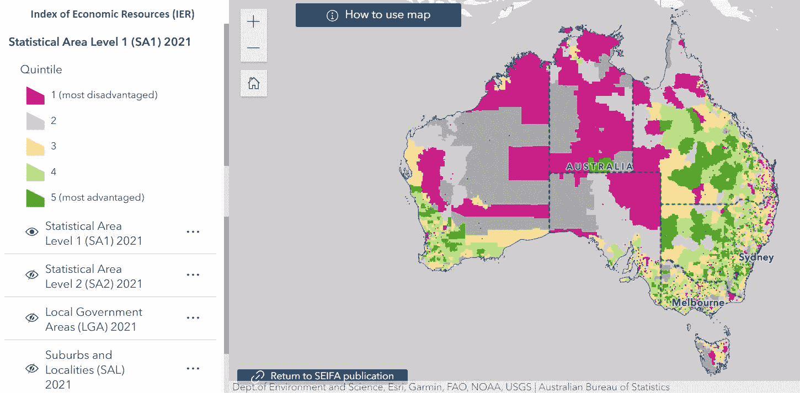
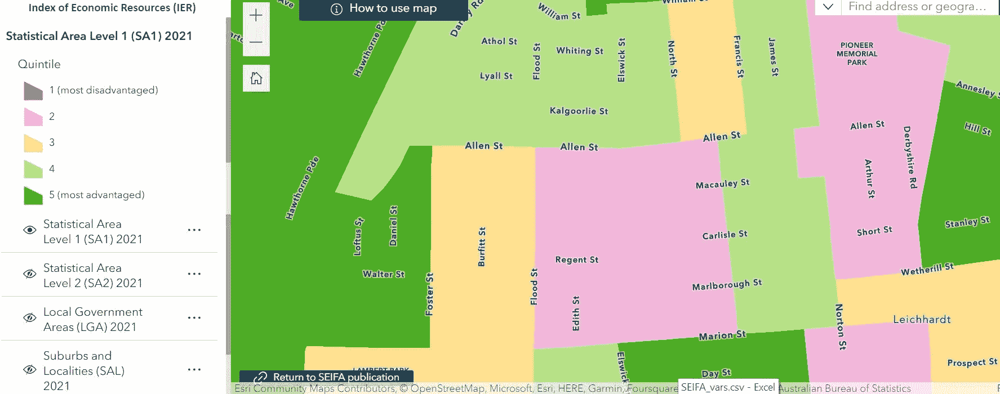
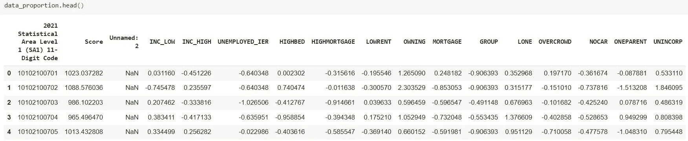
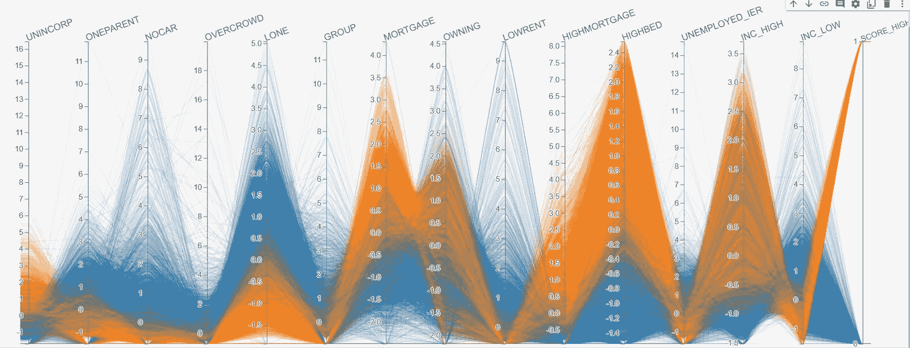
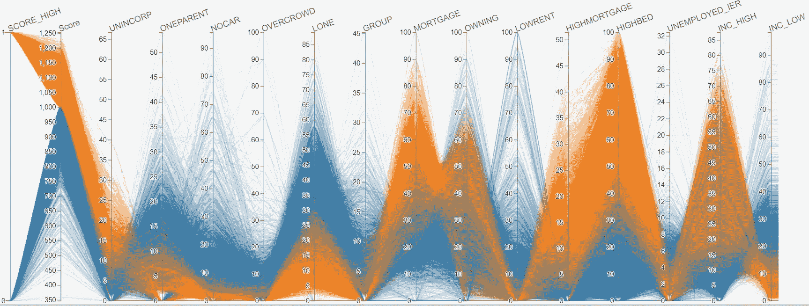
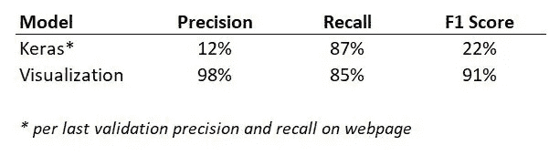

# 可视化故事讲述——哪个区域的社会经济评分最高，为什么

> 原文：[`towardsdatascience.com/story-telling-with-visualization-which-area-has-the-highest-socio-economic-score-and-why-c1205b2450c7`](https://towardsdatascience.com/story-telling-with-visualization-which-area-has-the-highest-socio-economic-score-and-why-c1205b2450c7)

## 使用实际地理数据演示

[](https://jin-cui.medium.com/?source=post_page-----c1205b2450c7--------------------------------)[](https://towardsdatascience.com/?source=post_page-----c1205b2450c7--------------------------------) [Jin Cui](https://jin-cui.medium.com/?source=post_page-----c1205b2450c7--------------------------------)

·发表于[Towards Data Science](https://towardsdatascience.com/?source=post_page-----c1205b2450c7--------------------------------) ·阅读时间 8 分钟·2023 年 12 月 26 日

--


图片由[Joash Viriah](https://unsplash.com/@joashzn?utm_source=medium&utm_medium=referral)拍摄，来源于[Unsplash](https://unsplash.com/?utm_source=medium&utm_medium=referral)

# 背景

有时，为了更有效地分配资源，政府可能会收集个人或家庭的关于人口统计特征的数据，例如年龄、性别和出生国，以及他们的社会经济特征，例如收入、职业和支出。这些数据的一部分会被按地理区域汇总，并向公众提供。

在我居住的澳大利亚，政府通过澳大利亚统计局（ABS）校准一个称为[**经济资源指数（IER）**](https://www.abs.gov.au/statistics/people/people-and-communities/socio-economic-indexes-areas-seifa-australia/latest-release#index-of-economic-resources-ier-)**的指标，该指标利用来自五年一次的人口普查数据的多种变量评分地理区域的相对社会经济状态。**

IER 可以通过将澳大利亚划分为不同大小的地理区域的各种数字边界进行汇总。例如，州界（图 1 中的虚线）将澳大利亚划分为 8 个州和领地，而[统计区域 1](https://www.abs.gov.au/ausstats/abs@.nsf/Lookup/2901.0Chapter23002016#SA1)（SA1）边界（图 2 中）则将澳大利亚划分为更细的区域，有时是几条街道的集群。

在检查 ABS 提供的[互动地图](https://experience.arcgis.com/experience/32dcbb18c1d24f4aa89caf680413c741/page/IER/)中的 IER 时，如下图所示，我发现 IER 在不同地区甚至街道级别上差异很大，我思考这可能是由什么因素驱动的。



图像 1 — 按 SA1 划分的 IER，全国视图。澳大利亚统计局，[人口与住房普查：地区社会经济指数（SEIFA）](https://experience.arcgis.com/experience/32dcbb18c1d24f4aa89caf680413c741/page/IER/)，澳大利亚，2021 年，ABS 网站，访问日期 2023 年 12 月 24 日。



图像 2 — 按 SA1 划分的 IER，街道视图。澳大利亚统计局，[人口与住房普查：地区社会经济指数（SEIFA）](https://experience.arcgis.com/experience/32dcbb18c1d24f4aa89caf680413c741/page/IER/)，澳大利亚，2021 年，ABS 网站，访问日期 2023 年 12 月 24 日

我们能否通过可视化揭示 ABS 如何根据地理区域区分 IER 得分？继续阅读！

# 数据

感谢 ABS，我们可以很方便地在一个地方获取 SA1 的 IER 得分及其支持变量，这在此[网页](https://www.abs.gov.au/statistics/people/people-and-communities/socio-economic-indexes-areas-seifa-australia/latest-release#data-downloads)的数据下载部分，“标准化变量比例数据立方体”[1]。

为了本文的目的，我将提供创建一系列可视化图表的 Python 代码，这可能有助于读者理解每个支持变量对 SA1 的 IER 得分的贡献。

我将从加载所需的包、读取和检查数据开始。

```py
## Load the required packages

import matplotlib as mpl
import matplotlib.pyplot as plt
import seaborn as sns

import numpy as np
import pandas as pd

import polars as pl
import hiplot as hip
```

```py
## Read and inspect data

data_proportion = pd.read_excel('/content/gdrive/MyDrive/SEIFA/Statistical Area Level 1 (SA1), Standardised Variable Proportions, SEIFA 2021.xlsx', 
sheet_name = 'Table 4', header = 5, usecols = 'A:Q')

data_proportion.head()
```

初看下面的图像，支持变量的列命名规则似乎不够直观。



图像 3 — 示例数据。作者提供的图像。

为了解决这个问题，ABS 提供了用于校准 IER 得分的 14 个变量的数据字典，[点击这里](https://www.abs.gov.au/statistics/detailed-methodology-information/concepts-sources-methods/socio-economic-indexes-areas-seifa-technical-paper/2021/construction-indexes#technical-details-of-each-index-variables-and-loadings)查看。总结如下：

+   INC_LOW: 年收入在$1 和$25,999 AUD 之间的家庭中居住的人的比例

+   INC_HIGH: 年收入大于$91,000 AUD 的人的比例

+   UNEMPLOYED_IER: 15 岁及以上失业者的比例

+   HIGHBED: 占用私人物业中有四间或更多卧室的比例

+   HIGHMORTGAGE: 占用私人物业中每月按揭金额大于$2,800 AUD 的比例

+   LOWRENT: 占用私人物业中每周租金低于$250 AUD 的比例

+   OWNING: 没有抵押贷款的私有住房的百分比

+   MORTGAGE: 有抵押贷款的私有住房的百分比

+   GROUP: 被群体占用的私有住房的百分比（例如公寓或单元房）

+   LONE: 孤身占用的私有住房的百分比

+   OVERCROWD: 根据加拿大国家居住标准，要求额外卧室的私有住房占比

+   NOCAR: 没有汽车的私有住房占比

+   ONEPARENT: 单亲家庭的百分比

+   UNINCORP: 至少有一个是企业主的物业的百分比

另外，ABS 出版物中‘Score’列的 IER 评分经过标准化，均值为 1,000，标准差为 100，以显示特定区域的相对社会经济状况。

现在让我们来看看一些视觉效果！

# 可视化

下面的 Python 代码对数据进行了一些小的转换，以便将数据转换为适合可视化的格式。

```py
## Rename the first column (optional)
data_proportion.rename(columns = {'2021 Statistical Area Level 1  (SA1) 11-Digit Code': 'SA1'}, inplace = True)

## Create a SCORE_HIGH class column with 1 indicating a high score based on standardised mean
data_proportion['SCORE_HIGH'] = np.where(data_proportion['Score'] > 1000, 1, 0)

## Select only the columns needed for visualization
column_select = [
                 'SCORE_HIGH', 'INC_LOW', 'INC_HIGH',
                 'UNEMPLOYED_IER', 'HIGHBED', 'HIGHMORTGAGE', 'LOWRENT', 'OWNING',
                 'MORTGAGE', 'GROUP', 'LONE', 'OVERCROWD', 'NOCAR', 'ONEPARENT',
                 'UNINCORP'
                ]

data = data_proportion[column_select]

## Remove rows with missing value (113 out of 60k rows)
data_dropna = data.dropna().reset_index(drop = True)

## Create a Polars dataframe 
df = pl.from_pandas(data_dropna) 
```

现在我们有效地拥有一个包含 14 个特征和一个类别变量的数据框，我们正在尝试对其进行可视化。与其在数据科学工作流程中通常对单一特征和目标变量进行低维度单向分析，不如使用下面的 Python 代码，可以交互式地可视化所有 14 个特征与目标变量之间的关系。

```py
df_ml = pl.concat([
    df.filter(pl.col("SCORE_HIGH") == 0).sample(5_000),
    df.filter(pl.col("SCORE_HIGH") == 1).sample(5_000),
]
) # Note that I'm selecting a sample of 5,000 data points for each class
  # as I don't want the visual to look too busy for the purpose of this demonstration

hip.Experiment.from_iterable(df_ml.to_dicts()).display()
```

如下图所示，通过选择‘SCORE_HIGH’列进行着色：

+   可视化中的每一条线代表一行数据。特别是，橙色线代表 IER 评分相对较高的 SA1 区域，蓝色线代表 IER 评分相对较低的 SA1 区域。

+   通过检查每个单独特征的颜色分布（回顾一下，这些特征是根据数据字典的某些特征的百分比），我们可以轻松判断特定特征与 IER 评分之间的关系。

+   例如，有证据表明，IER 评分与 SA1 区域内高收入人群的百分比（由 INC_HIGH 变量表示）呈正相关，而 IER 评分与 SA1 区域内单亲家庭的百分比（由 ONEPARENT 变量表示）呈负相关。这些观察结果都是直观上合理的。

+   从高层次来看，IER 评分可以通过与收入、物业价值和家庭构成相关的变量进行校准。



图像 4 — 可视化输出。图片由作者提供。

令人惊讶的是，除了少数几个 SA1 区域，大多数变量与 IER 评分的关系相对明确。

# 增强

由于上图所示每个变量的数值（即百分比）被标准化为均值 0 和标准差 1，如 ABS 方法论所述，因此可能很难确切解释某一特定变量的百分比对高或低 IER 分数的贡献。例如，高收入人群或具有 4 间或更多卧室的房产，在特定地区需要多少百分比才能获得高于平均水平的 IER 分数？

幸运的是，应要求，ABS 能够提供这些变量的非标准化（即原始）值，这提供了更全面的视角，如下所示。



图 5 — 可视化输出，原始百分比。图像由作者提供。

# 有用的可视化示例

你知道仅仅通过可视化也可以进行预测建模，这可能会超越某些更先进的模型（如神经网络）下的预测吗？

使用与上述类似的高维度可视化技术，目的是“记录”可能对特定类别有预测性的值范围。

例如，在上面的可视化中，为了预测高 IER 分数，我们可能需要的值范围是 UNINCORP >15%，HIGHBED > 50%，INC_LOW < 10% 等，这些可以用来制定一个简单的嵌套 IF ELSE 语句（在任何编程语言中）。

以下视频演示了如何使用上图中的可视化进行交互式操作。

视频 6 — 如何识别高 IER 分数的预测变量

为了进一步实验，我将其应用于 Google 开发的欺诈检测分类问题，该问题用于推广[**Keras 包**](https://keras.io/examples/structured_data/imbalanced_classification/)（用于构建神经网络模型），并产生了以下比较模型评估结果。



表 7 — 评估指标比较。表格由作者提供。

不仅可视化超越了神经网络，而且通过记录影响“IF-ELSE”规则的特征值，我们能够比一些其他不易解释的模型（如神经网络）更清晰地向预测者提供建议。

# 结论思考

在本演示中，除了创建有助于揭示各种特征与目标变量之间关系的可视化外，我还希望强调能够解释模型和解释输出的重要性，这可能与仅基于评估指标拟合模型一样重要。

我是可视化的忠实粉丝，我坚信每一个统计数据都有一个故事。如在 [这篇文章](https://medium.com/gitconnected/create-extraordinary-visualizations-with-ggplot2-in-r-32eb17a3a54f) 中提到的另一个使用案例，我的经验是良好的可视化大大有助于讲故事，*从而最终提升了我个人品牌的可信度并与利益相关者建立了信任*。因此，不论单独还是作为数据科学管道中的重要环节，可视化都是至关重要的。

# 参考资料

[1] 澳大利亚统计局 (2021)，[地区社会经济指数 (SEIFA)](https://www.abs.gov.au/statistics/people/people-and-communities/socio-economic-indexes-areas-seifa-australia/latest-release#data-downloads)，ABS 网站，访问日期 2023 年 12 月 24 日（[创意共享许可](https://www.abs.gov.au/privacy-and-legals)）

我之前在以下文章中博文过其他可视化技术。如果你喜欢这些，确保关注 Medium 上的作者 [Medium](https://jin-cui.medium.com/)！

***在 PowerBI 中使用形状图可视化进行互动地理空间可视化***

***用 Python 创建互动地理空间可视化***

*当我顺应 AI/ML 浪潮时，我喜欢用全面的语言编写和分享逐步指南和操作教程，并附有现成的代码。如果你想访问我所有的文章（以及其他 Medium 上的从业者/作者的文章），可以使用* [*这个链接*](https://medium.com/@jin-cui/membership) *注册！*
