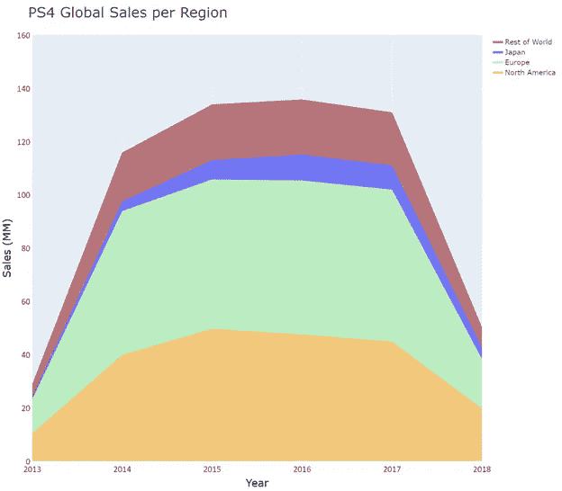
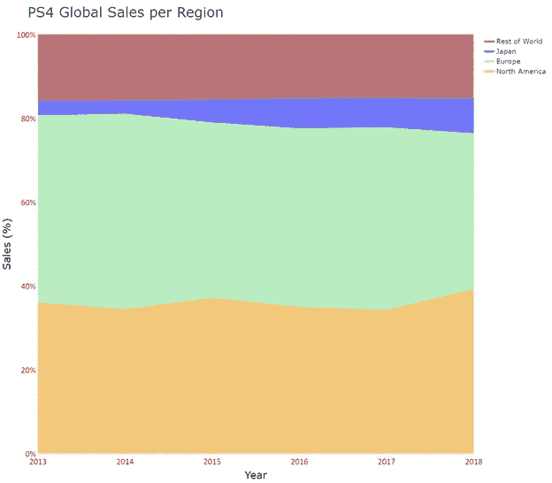
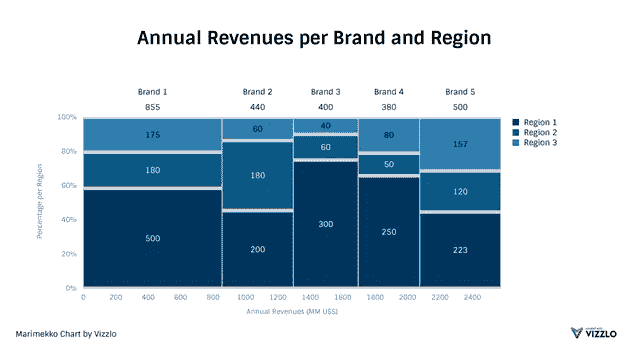
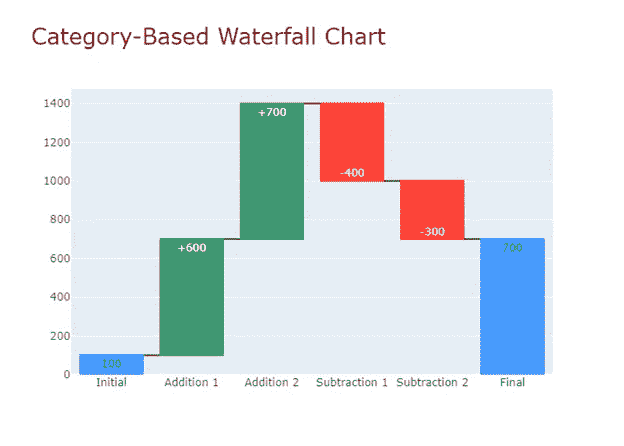
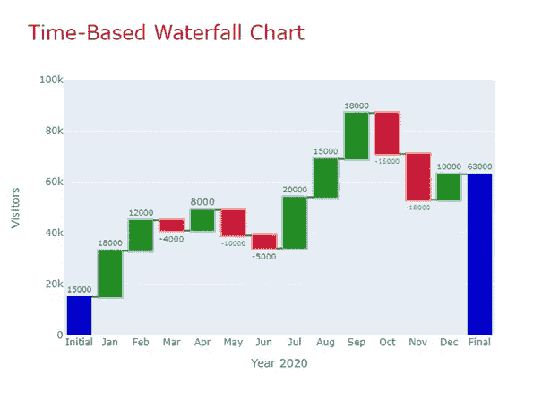

# 用图表讲故事

> 原文：[`towardsdatascience.com/storytelling-with-charts-29e233182be6`](https://towardsdatascience.com/storytelling-with-charts-29e233182be6)

## 第四部分（II）：你想展示组成吗？

 [Darío Weitz](https://medium.com/@dar.wtz?source=post_page-----29e233182be6--------------------------------)

·发布于[Towards Data Science](https://towardsdatascience.com/?source=post_page-----29e233182be6--------------------------------) ·阅读时间 7 分钟·2023 年 7 月 1 日

--

照片由[Jonatan Pie](https://unsplash.com/fr/@r3dmax?utm_source=medium&utm_medium=referral)在[Unsplash](https://unsplash.com/?utm_source=medium&utm_medium=referral)上提供

这是**第二部分**（第四篇文章中的一部分），其目的是指明当传达给受众的消息目的是**展示数据的组成**时，最佳的数据可视化技术。

为了更好地理解本文内容，强烈建议阅读（或重温）[上一篇文章](https://medium.com/towards-data-science/storytelling-with-charts-fbd23ebb70ee)，其中描述了**组成**的概念及其一些分析元素。

在上一篇文章中，我们指出，以下是最常用于展示组成的六种图表：饼图；堆叠条形图；树图；堆叠面积图；瀑布图；Marimekko 图表。

列表中的前三种已在[那篇文章](https://medium.com/towards-data-science/storytelling-with-charts-fbd23ebb70ee)中详细描述。现在，我们将集中讨论列表中的后三种（堆叠面积图；Marimekko 图表；瀑布图）。

# **堆叠面积图**

首先，让我们定义一下什么是[面积图](https://medium.com/towards-data-science/area-charts-standard-stacked-overlapping-d9b77df5dec8)：它是一种线图，其中连接数据点的线与水平轴之间的区域**填充了特定颜色**。

有**四**种不同类型的面积图：1) 标准面积图；2) 堆叠面积图；3) 百分比堆叠面积图；4) 重叠面积图。只有**堆叠面积图**（StACs）和**百分比堆叠面积图**（%StACs）用于显示组成。

在两个堆叠区域图中，**多个区域堆叠在一起。** 它们展示了随时间变化的数值变量（动态组成），并使用**通常是分类的**第三个变量来显示组成。

与 StAC 相关，这是一种**部分与整体图表**，其中每个区域表示相对于类别总量的每个部分的**绝对值**。与 %StAC 相关，这也是一种**部分与整体图表**，其中每个区域表示相对于类别总量的每个部分的**百分比**。**不同区域之间没有重叠。** 在 StAC 中，纵轴的最终高度与所表示的所有数值之和相关。在 %StAC 中，纵轴的最终高度始终为 100%。

图 1 显示了一个 StAC，表示 2013 年至 2018 年间四个不同地区的 PS4 销售情况。图表右上角显示的图例指示不同颜色区域属于哪个地区。可以看到每个地区（每个区域，每个部分）如何对总销售（整体，总销售额）做出贡献。每个区域的高度代表了每个特定地区的销售**绝对值**，而最终高度是这些值的总和，表示每年的总销售额。可以看出，StAC 应主要用于传达整体趋势和每个部分对整体的相对贡献，而不必关注显示每个部分的精确数值。

图 1：堆叠区域图。图表由作者使用 Plotly Express 制作。

图 2 是一个 %StAC，表示相同的 PS4 销售数据。每个区域表示每个地区相对于全球 PS4 销售总量的**百分比**。如上所述，最终高度为 100%。毫无疑问，这种图表比图 1 中的图表更好地分析了全球销售的组成。

图 2：百分比堆叠区域图。图表由作者使用 Plotly Express 制作。

最终警告：StAC 和 %StAC 相对难以读取和理解，因为它们依赖于观众通过比较堆叠区域解码数据信息的能力。我们建议仅使用它们来传达整体趋势和每个部分对整体的相对贡献。

# **Marimekko 图表**

它们是一种特殊的**可变宽度**条形图。 [Marimekko 图表](https://medium.com/towards-data-science/mekko-charts-f38311c576e2)（MCs）类似于 100% 堆叠条形图，但不同之处在于它们的矩形条可以有不同的宽度。

MC 用于显示数据集中每个类别的**两个数值变量**。它们有两个轴：垂直轴有 100% 数值刻度，而水平轴可以是分类的或数值的。矩形条形图以垂直方向排列，中间没有空隙。水平轴的整个宽度都被占据。

图 3 显示了一个 Marimekko 图表。该图表显示了每个品牌和地区的年度收入。百分比垂直轴表示每个地区的百分比，而水平轴表示每个品牌的年度收入。我们在一个图表中指示了每个类别和子类别的两个数值。

图 3：一个 Marimekko 图表。由 Vizzlo 制作并获得许可 (#1)。

如我之前所述的[我之前提到的](https://medium.com/towards-data-science/mekko-charts-f38311c576e2)： “Marimekko 图表的特点包括：一个矩形区域被划分为不同宽度的小矩形；垂直堆叠的矩形；占据整个图表宽度的水平轴；带有百分比刻度的垂直轴；顶部基线上的每个品牌的总收入；不同的条形宽度可以计算每个品牌对总收入的相对贡献”。

Marimekko 图表可以用作 100% 堆叠条形图的替代品，但仅用于静态分析（展示某一时刻的组成）。它们绝不应用于展示随时间变化的组成。

与堆叠面积图相同的警告：MCs 难以解释，因为人类不擅长计算面积，特别是当矩形数量增加时。

# **瀑布图**

[瀑布图](https://medium.com/towards-data-science/waterfall-charts-with-plotly-43822918e9eb)（WCs）是一种特殊类型的条形图，表示数据在添加和减去之间的累积效应。其信息是讲述**两个数据点之间的组成变化**。

WC 由一个初始垂直条形图、一组中间垂直条形图和一个最终垂直条形图组成。通常（且建议的）布局是初始和最终的垂直条形图（列）具有相同的颜色，而中间条形图（**浮动条形图**）显示添加的绿色值和减少的红色值。第一列和最后一列通常从零基线开始。

图 4 显示了一个基于类别的瀑布图，具有上述特征。这种类型的 WC 通常用于人力资源（显示某个部门的招聘和离职情况）、特定业务（显示收入和支出）、仓库（库存增加、库存减少）以及许多其他数据在正负值之间波动的情况。**基于时间的 WC** 用于金融行业（显示在单个时间段内的收益和损失）。

图 4：作者使用 Plotly 制作的基于类别的瀑布图。

瀑布图提供比标准条形图更多的上下文信息。后者仅显示初始值和最终值，而前者则指示加法和减法元素对总量的贡献，以及这些初始值和最终值之间变化的组成。

讲述初始值与最终值之间变化的这一显著能力，其复杂性在于正确解读这些变化的幅度。这是因为浮动列中缺乏共同的基准，使得比较连续的加法和减法的具体大小变得困难。最佳做法是在列中添加数字注释，并通过连接的水平线将它们连接起来（图 4 和图 5）。

图 5 显示了一个基于时间的瀑布图，展示了一个虚拟网页每月访客数量变化的故事。任何其他视觉表现形式对普通观众理解这种特定情况会更复杂。

图 5：作者使用 Plotly 制作的基于时间的瀑布图。

# **结论**

在任何数据可视化项目中，一个关键问题是：“我选择了正确的图表来讲述我的故事吗？”

选择最合适的图表取决于要传达给观众的消息的性质。

当传达的消息是组成时，使用六种不同类型的图表：饼图；堆积条形图；树图；堆积面积图；瀑布图；马里梅科图。

我们的建议是，对于静态组成使用饼图，对于动态组成使用堆积条形图。当整体由十个或数千个部分组成时，树图是一个有效的替代方案。马里梅科图适用于表示两个数值变量，包括一个主要类别及其子类别。最后，瀑布图仅显示初始值和最终值之间变化的组成。

如果您觉得这篇文章有趣，请阅读我之前的 56 篇文章中的任何一篇：[`medium.com/@dar.wtz`](https://medium.com/@dar.wtz)。**关于数据可视化、模拟、蒙特卡罗技术、仪表盘等的浏览量超过 30 万次。**

#1: [`vizzlo.com/`](https://vizzlo.com/)
