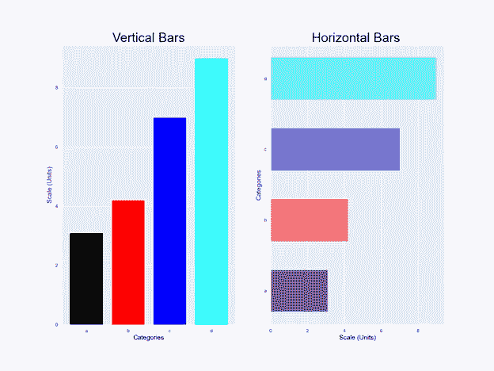
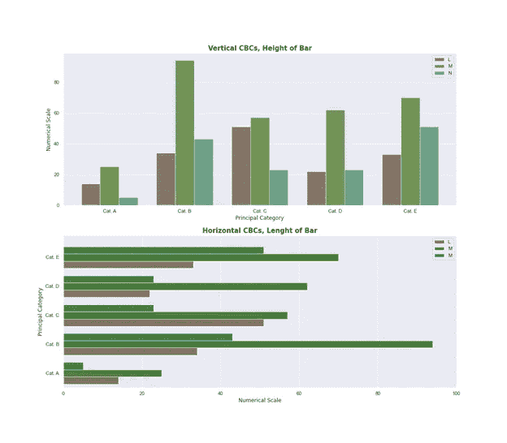
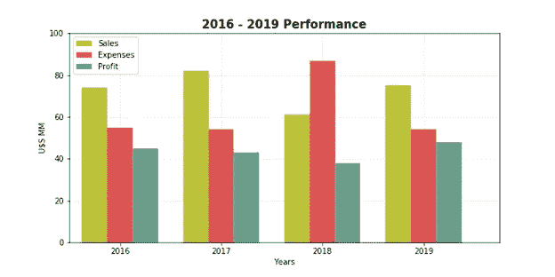
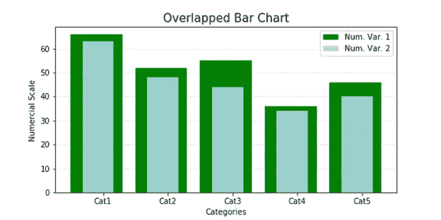
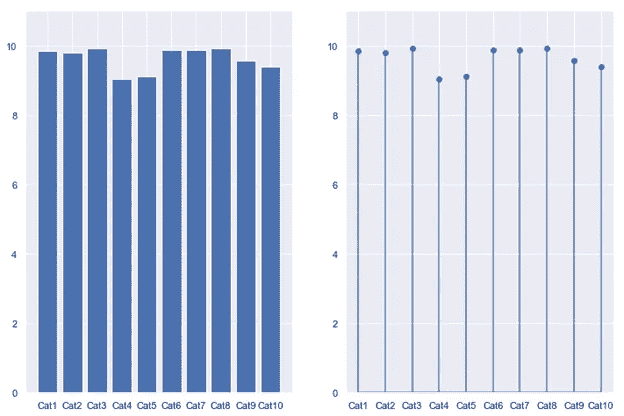
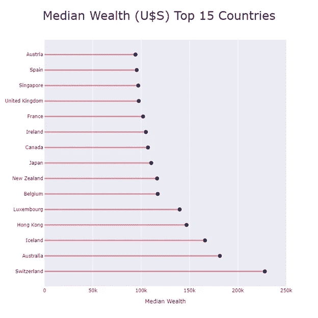
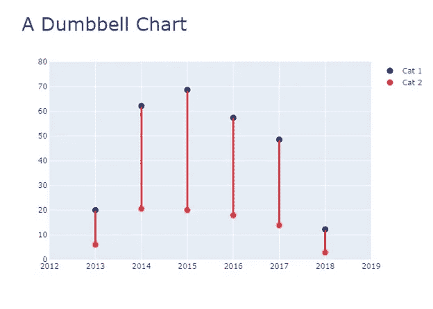
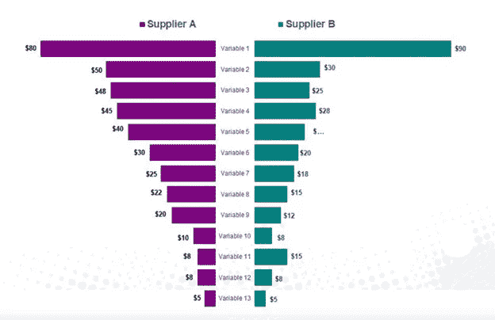

# 用图表讲故事

> 原文：[`towardsdatascience.com/storytelling-with-charts-c59c52c49871`](https://towardsdatascience.com/storytelling-with-charts-c59c52c49871)

## 第三部分：你想要比较项目吗？

 [Darío Weitz](https://medium.com/@dar.wtz?source=post_page-----c59c52c49871--------------------------------)

·发布于 [Towards Data Science](https://towardsdatascience.com/?source=post_page-----c59c52c49871--------------------------------) ·阅读时间 7 分钟·2023 年 5 月 8 日

--

图片由 [charlesdeluvio](https://unsplash.com/@charlesdeluvio?utm_source=medium&utm_medium=referral) 提供，来源于 [Unsplash](https://unsplash.com/?utm_source=medium&utm_medium=referral)

这是系列中的第三篇文章，旨在帮助从事数据可视化活动的人选择最合适的图表，以便向他们的观众展示他们试图传达的信息类型。

在系列的[第一篇文章](https://medium.com/towards-data-science/storytelling-with-charts-23dd41096721)中，指出了三种基于 Python 的图表，这些图表允许展示**单个定量变量的分布**。

在信息包括**显示一组特定数字的大小**时，最合适的图表在系列的[第二篇文章](https://medium.com/towards-data-science/storytelling-with-charts-dae59034f60)中已有指示。

现在信息是**比较项目**。以下是**常用的**图表，用于呈现这种图形表示：

+   · 标准条形图

+   · 聚类条形图

+   · 重叠条形图

+   · 棒棒糖图

+   · 哑铃图

+   · 分歧条形图

# **标准条形图**

标准条形图（SBCs）**每个项目或类别只比较一个数字变量**。它们试图回答这样一个问题：“每个类别有多少？” 请记住，类别或项目指的是诸如国家、城市、姓氏、公司、品牌、年份、月份、日期、数据科学方法等定性元素。

图 1：垂直和水平 SBC 的示意图。由作者使用 Matplotlib 制作。

有垂直条形图（柱状图）和水平条形图。柱状图通过垂直矩形条形的高度比较项目。水平条形图通过水平矩形条形的长度比较数量。矩形的最终值（每个条形的长度或高度）与打算比较的数值成正比。每个条形代表一个单一项目，条形之间通常留有一定的空间。

观众对这些类型的图表很熟悉，因此可以专注于信息而无需浪费时间理解图示。更多细节可以在我的[上一篇文章](https://medium.com/nightingale/bar-graphs-why-how-8c031c224c9f)中找到。

# **聚类条形图**

聚类条形图（CBCs）展示了主要项目或类别与其子组之间存在的相对比例的数据信息，这些子组属于第二个分类变量。一个变量被称为分类变量，如果其观察值可以分配到不重叠的类别中。通常，它们只能取有限（通常是固定）的值。

与 SBCs 类似，它们可以水平或垂直排列。每个主要项目被分为一个**条形图簇**，表示第二个分类变量的子组。每个子类别的数量由一些相邻的矩形条形的高度或长度表示，这些条形排列在一起形成簇，簇之间的间隙略宽于单个标准条形。

CBCs 用于讲述比较和比例，但重点在于组成（**整体分析的一部分**）。因此，当整体被划分为**多个部分**时，CBCs 特别有效。它们可以进行**跨子组的比较**（堆积条形图进行子组内的比较）。

图 2：垂直和水平 CBCs 的示意布局。由作者使用 Matplotlib 制作。

下图显示了一个虚拟公司在 2016–2019 年期间的销售、支出和利润信息。这是一个垂直排列的 CBC，以年份作为主要类别。销售、支出和利润每年以条形簇的形式表示。图表显示，尽管 2018 年支出显著增加，但利润仅减少了少量。

图 3：虚拟公司在 2016–2019 年期间的经济表现。该图由作者使用 Matplotlib 开发。

观众也对这些类型的图表很熟悉，因此可以专注于信息而无需浪费时间理解图示。更多细节可以在我的[上一篇文章](https://medium.com/towards-data-science/clustered-overlapped-bar-charts-94f1db93778e)中找到。

# **重叠条形图**

当我们希望**在单一图表中比较每个项目**或类别的两个数值变量时，可以使用重叠条形图（OVCs）。当然，这两个数值变量必须具有足够的相关性以证明比较的合理性。

概念上，通过重叠的方式对比两个变量的数值。这种重叠允许我们以更强的表达力讲述故事。

与 SBCs 和 CBCs 类似，经典布局包括两个轴和可以水平或垂直定向的矩形条。一个轴显示类别，另一个轴显示与待比较变量相关的数值。当然，这两个数值变量必须共享相同的数值尺度。每个数值变量的条宽不同，较小的条在前以便于阅读，尽管这种情况并不总是适用于所有图表。

图 4：作者使用 Matplotlib 开发的重叠条形图。

可以用**部分重叠的条形图**来比较两个以上的数值变量。在这种类型的图表中，表示不同数值变量的条形图会被前面位置的其他矩形部分遮挡。从概念上讲，部分重叠的条形图类似于 CBC，只不过表示不同子组的矩形开始重叠而不是并排放置。在这方面，必须非常小心，以免混淆观众。因此，建议仅用于比较最多三个不同的数值变量。

更多细节可以在我的[上一篇文章](https://medium.com/towards-data-science/clustered-overlapped-bar-charts-94f1db93778e)中找到。

# **棒棒糖图**

从概念上讲，与 SBCs 类似，棒棒糖图（LCs）用于对不同项目或类别之间进行**比较**。它们只比较每个项目的一个数值变量。不同之处在于 LCs 用一条末端带点的线代替了矩形条。该点的**位置**表示相应的数值。因此，这些线末端的点的位置等同于垂直或水平标准条的高度或长度。

图 5：标准条形图与棒棒糖图的比较。由作者使用 Matplotlib 制作。

经典布局包括两个轴和可以垂直或水平定向的非常细的线条。一个轴表示类别，另一个轴具有与待比较项目相关的数值尺度（最好带单位）。

当需要显示**大量相似值**时，建议使用 LCs 作为 SBCs 的替代方案。这样，我们可以避免显示杂乱的图表，也可以防止观众经历一种令人烦恼的光学效应，称为摩尔纹。

图 6：作者使用 Plotly 制作的棒棒糖图。

# **哑铃图**

虽然哑铃图与棒棒糖图相似，但它们的主要目标是表示两个数据点之间的变化。在这方面，它们通常用于**对比两个类别。**

图 7：作者使用 Plotly 制作的哑铃图。

我们建议将它们用于比较范围、分布、变化和两个数值变量之间的差异或点之间的距离。

# **发散条形图**

发散条形图（DBC）基本上由两个水平矩形（条形）组成，它们对齐，使得一个矩形从右到左延伸，另一个从左到右延伸，并且两个矩形都从一个共同的垂直基线开始，通常位于图表的中心。如前所述，每个矩形（条形）的长度与其显示的数值成比例。每个条形表示一个项目或分类变量，并且它们之间必须留有一些空间。对于 DBC 的最佳编码是当需要比较两个数值选项时。

蝴蝶图是一种特殊的 DBC。通常，它们在条形之间留有一些空间，以放置被比较的变量名称。

图 8：蝴蝶图。来源：#1。

另一组图表也可以用来比较项目：雷达图、Mekko 图和 Marimekko 图。问题是它们很难解释，因为它们依赖于受众通过比较角度或面积解码数字信息的能力。因此，总是更倾向于选择之前提到的图表。更多细节请参见我的[上一篇文章。](https://medium.com/towards-data-science/mekko-charts-f38311c576e2)

数据可视化是讲述数据背后故事的最强有力工具。但如果我们没有正确选择最适合我们想要展示的信息的可视化技术，我们的受众可能会感到困惑。

这系列文章的目的就是指出哪些图表和图示最适合特定类型的信息。

在本文中，我们指出了六种不同的图表[标准条形图、簇状条形图、重叠条形图、棒棒糖图、哑铃图、发散条形图]**，旨在对比项目。**我们指出了它们之间的相似性和差异。

数据科学家和数据分析师接受与受众所需信息类型相关的培训是至关重要的。与上述内容相关的是选择最适合讲述我们数字背后故事的图表。

敬请关注即将发布的文章。

*#1:*[*https://www.slideteam.net/butterfly-chart-tornado-chart-for-price-comparison-powerpoint-slide.html*](https://www.slideteam.net/butterfly-chart-tornado-chart-for-price-comparison-powerpoint-slide.html)
