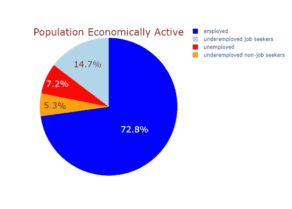
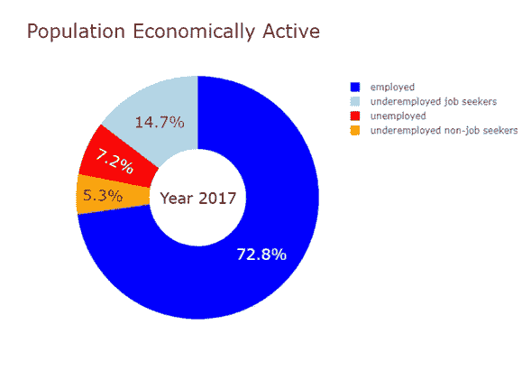
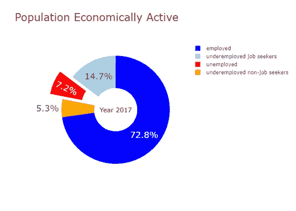
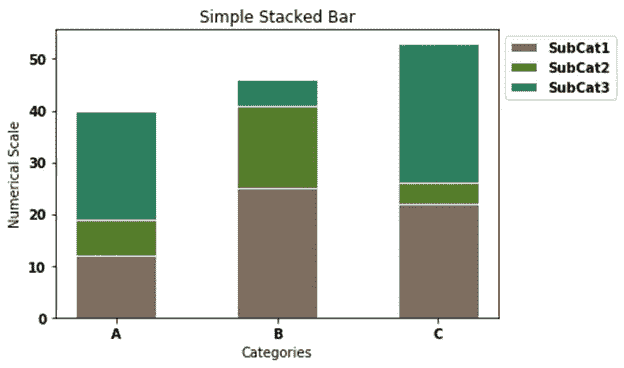
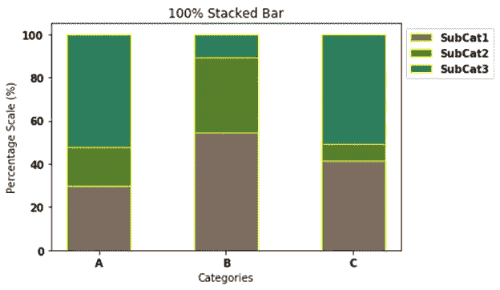
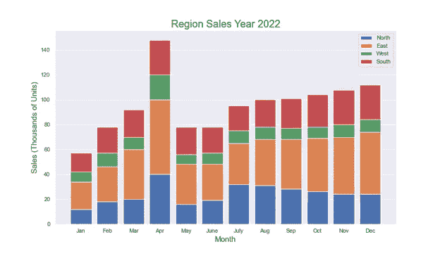
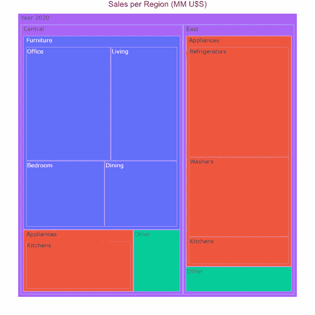
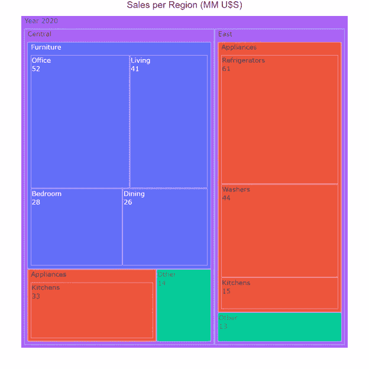

# 图表讲故事

> 原文：[`towardsdatascience.com/storytelling-with-charts-fbd23ebb70ee`](https://towardsdatascience.com/storytelling-with-charts-fbd23ebb70ee)

## 第四部分（I）：你想展示组成部分吗？

 [达里奥·维茨](https://medium.com/@dar.wtz?source=post_page-----fbd23ebb70ee--------------------------------)

· 发表在 [Towards Data Science](https://towardsdatascience.com/?source=post_page-----fbd23ebb70ee--------------------------------) · 阅读时间 7 分钟 · 2023 年 6 月 1 日

--

图片由 [Hiral Parikh](https://unsplash.com/@hiral_parikh98?utm_source=medium&utm_medium=referral) 提供，来源于 [Unsplash](https://unsplash.com/?utm_source=medium&utm_medium=referral)

这是系列中的**第四篇文章**，旨在帮助人们根据他们试图向特定观众展示的信息来决定使用哪种类型的图表。

前三篇文章聚焦于以下内容：[文章 1](https://medium.com/towards-data-science/storytelling-with-charts-23dd41096721)，展示了单一数值变量的分布；[文章 2](https://medium.com/towards-data-science/storytelling-with-charts-dae59034f60)，显示了一系列数字的大小；[文章 3](https://medium.com/towards-data-science/storytelling-with-charts-c59c52c49871)，比较了各项。

本文的目的是指示在展示**组成部分**时最常用的图表。请记住，组成部分涉及一个可以分为各个部分的整体，以及每个部分与该整体的关系（**绝对或相对**）。分析可以是**静态**（显示某一时刻的组成部分）或**动态**（显示组成部分随时间的变化）。

常用于展示组成部分的图表如下：

· 饼图

· 堆叠条形图

· 堆叠面积图

· 瀑布图

· Mekko 图

· 树状图

本文将集中描述以下图表类型：饼图；堆叠条形图；以及树状图。在接下来的文章中，我们将描述剩余的三种图表。

# **饼图**

饼图（**PCs**）（图 1）是圆形图表，分成楔形扇区，用于显示**整体的部分**，这些部分是互斥的且不重叠的类别。完整的圆表示**整体**，而楔形（切片、扇区、段）表示**部分**。因此，完整的圆必须表示所有数据的总和，并且必须始终加总到 100%。包含在一个切片中的数值不能包含在另一个切片中，因为如前所述，扇区必须是互斥的，重叠是禁止的。从概念上讲，它们表示整体的简单份额。

图 1：作者使用 Plotly Express 制作的饼图。

饼图通过两个视觉标记来编码数值：1) 每个扇区的面积；2) 每个扇区沿圆周的长度。与大多数其他图表不同，饼图的轴和刻度不是线性的。

人类在视觉上计算曲线周围的面积或距离并不容易。这是对这类图表的主要反对意见，也是无休止争议的源头：它们非常简单易制，观众也习惯了它们的使用，但如果没有注释和百分比来澄清上下文，它们的解释则非常困难。

有时，可以通过以下替代方案增强饼图传达的信息：A1）甜甜圈图；A2）扇区分离。

A1: **甜甜圈图**（图 2），概念上等同于饼图，但与饼图不同的是，它们在图表的中心有一个空白区域（类似于一个洞），其中显示某种附加信息，以增强叙事效果。

图 2：作者使用 plotly.graph_objects 制作的带注释的甜甜圈图。

中心的空白区域不允许进行面积比较，因此甜甜圈图只有一个视觉标记：每个扇区的数值仅通过圆周上的弧长进行编码。

A2: **扇区分离**，通过从标准饼图或甜甜圈图中拉出或分离一个（或几个）扇区，可以增强信息传达效果。

图 3：作者使用 plotly.graph_objects 制作的带有拉出扇区的甜甜圈图。

当然，必须有充分的理由来证明这种分离的合理性，因为观众的注意力不可避免地会集中在该扇区。此外，还有一种视觉失真，使得与其他扇区进行直接比较变得困难。

最后，饼图只显示某一时刻的组成（静态组成）。有关饼图的更多细节可以在我的[上一篇文章](https://medium.com/towards-data-science/pie-donut-charts-with-plotly-d5524a60295b)中找到。

# **堆叠条形图**

堆叠条形图（SBCs）（图 4）是可以垂直（水平）排列的矩形条形图。它们有两个轴：一个轴显示类别，另一个轴显示数值及其对应的刻度。每个条形代表一个主要类别，并被分割成代表第二个分类变量子类别的矩形扇区。这些矩形段的高度（长度）显示了每个子类别的数值，这些矩形段垂直（水平）堆叠在一起。每个主要条形的最终高度（长度）表示每个类别的总量（百分比堆叠条形图除外）。

图 4：作者使用 Matplotlib 制作的简单堆叠条形图。

有两种特定类型的 SBCs：1）简单堆叠条形图（图 4）；2）百分比堆叠条形图（图 5）。

简单 SBs 将每个子类别的**绝对值**堆叠在前一个子类别上，而百分比 SBs 将每个子类别的**百分比**堆叠在前一个子类别上。简单 SBs 中的主要条形通常具有不同的高度（长度），而在百分比 SBs 中，所有主要条形具有相同的高度。当仅**相对差异**重要时，必须使用百分比 SBs；当**相对和绝对差异**都重要时，使用简单 SBs。

图 5：作者使用 Matplotlib 制作的百分比堆叠条形图。

**SBCs 在** **展示随时间变化的组成**（动态组成）方面表现出色。** 对于这种类型的动态分析，必须使用**垂直方向**堆叠条形图，并且与时间（天、月、年、时间范围）相关的变量**始终** **放在横轴上**（图 6）。

图 6：作者使用 Matplotlib 制作的堆叠条形图。

在堆叠扇区数量或长时间绘制图表时应当谨慎。建议每个主要条形上堆叠的扇区不超过四个或五个。当主要条形过多或很长时间内扇区超过三个时，观众可能会感到困惑。在这种情况下，我们建议使用**堆叠面积图**，当你需要展示大量的时间数据和/或每个主要条形上有四个或更多的扇区时。

更多细节可以在我的[上一篇文章](https://medium.com/towards-data-science/stacked-bar-graphs-why-how-f1b68a7454b7)中找到。

# **树形图**

这种特定类型的图表由马里兰大学计算机科学教授 Ben Shneiderman 发明，他在寻找“目录树结构的紧凑可视化”时发明了它（#2）。

用我自己的话说：“树形图是一种基于矩形的可视化工具，允许你表示一个层次结构（树状结构）数据集。概念是比较数量并在物理限制的空间中展示某些层次结构的模式。为此，使用不同大小和颜色的矩形从不同角度展示数据集。目标不是指示确切的数值，而是将数据集‘拆解’成其组成部分，并快速识别出其较大和较小的组件” (#3)。

图 7：作者使用 Plotly Express 制作的树形图。

后来发现它们可以**作为饼图的替代方案**，显示部分与整体的关系。由于每个矩形的面积与其所代表的数值成正比，它们开始用于指示部分之间的相对比例和差异。整个矩形的面积必须表示所有数据的总和。树形图仅显示某一时刻的组成情况（**静态组成**）。

相比饼图，树形图有**两个主要优点**：1）它们可以在相对较小的空间内包含十个或上千个部分的嵌套矩形；2）它们用面积编码数值，这是比圆周上的弧长更好的视觉属性。

必须始终用适当的注释标明数值，因为缺乏共同的基线严重影响了部分矩形之间的比较。

图 8：作者使用 Plotly Express 制作的带注释的树形图。

更多详细信息请参见我的[上一篇文章](https://medium.com/towards-data-science/treemaps-why-and-how-cfb1e1c863e8)。

# **待续**

我们很多时候需要向观众展示组成情况。这种部分与整体的分析对我们的特定观众并不总是容易解读的。因此，事先我们必须分析我们有哪些方法及其优缺点，如何与我们的数据和信息相关联。

如前所述，展示组成情况可以使用六种不同类型的图表：饼图；堆叠条形图；树形图；堆叠面积图；Mekko 图；瀑布图。这里，我们描述了其中的三种，特别是它们的特性、优点以及需要注意的一些事项。

请关注接下来的文章，描述其余图表。

参考文献

*#1:* [*https://serialmentor.com/dataviz/visualizing-proportions.html*](https://serialmentor.com/dataviz/visualizing-proportions.html)

#2 Ben Shneiderman (1992). “使用树形图的树形可视化：2D 空间填充方法”。ACM Transactions on Graphics. 11: 92–99\. [doi:10.1145/102377.115768](https://doi.org/10.1145%2F102377.115768)。

#3 [`medium.com/towards-data-science/treemaps-why-and-how-cfb1e1c863e8`](https://medium.com/towards-data-science/treemaps-why-and-how-cfb1e1c863e8)

如果你觉得这篇文章有趣，请阅读我之前的 55 篇文章中的任何一篇：[`medium.com/@dar.wtz`](https://medium.com/@dar.wtz)
