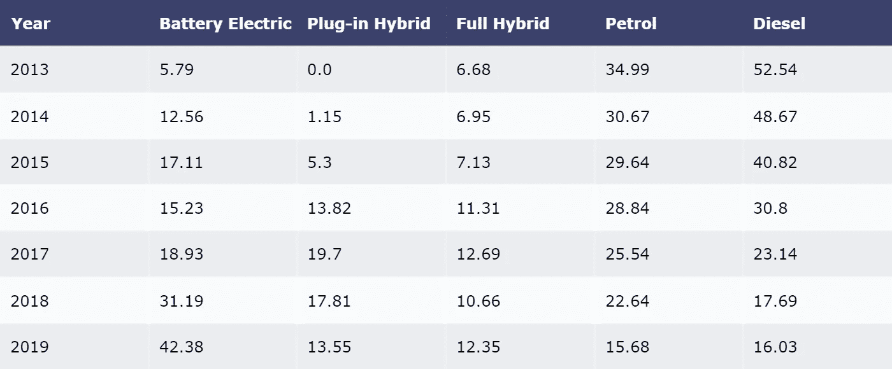
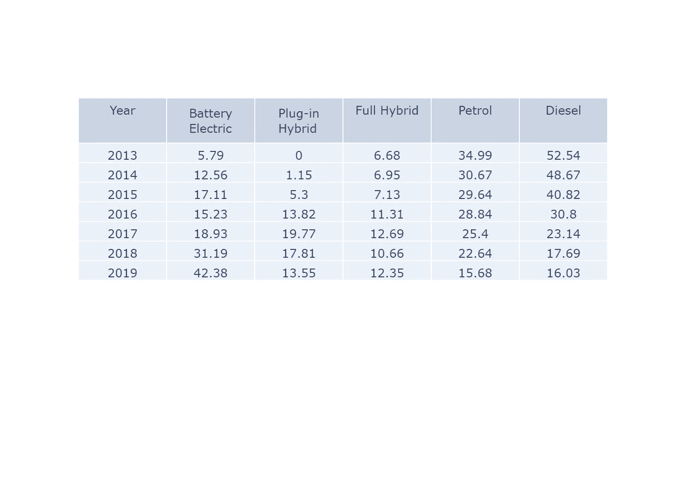
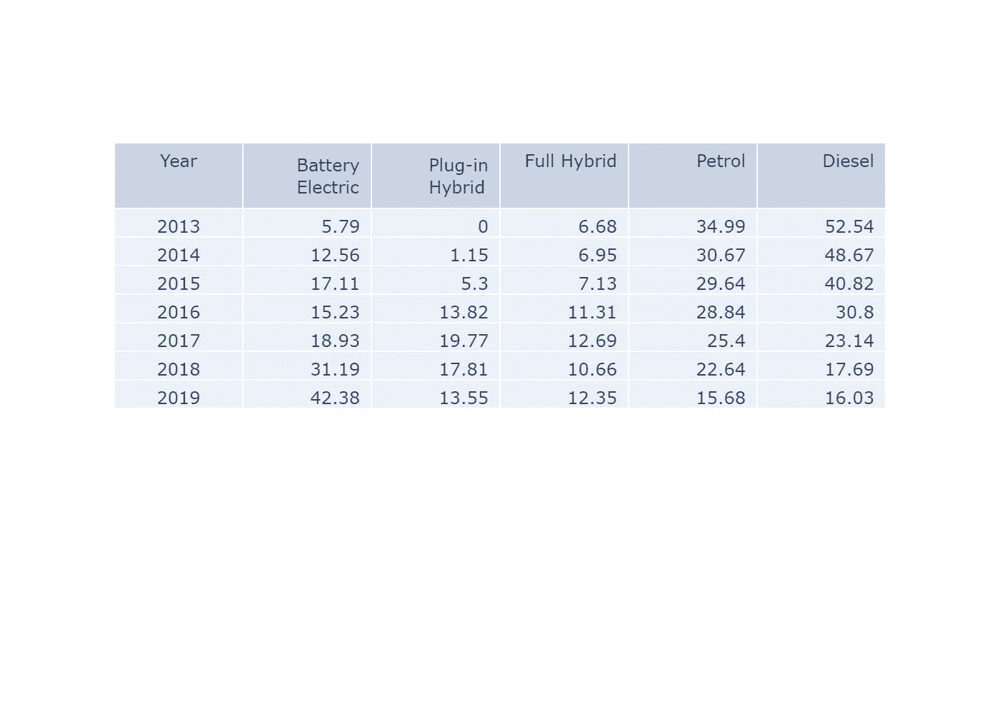
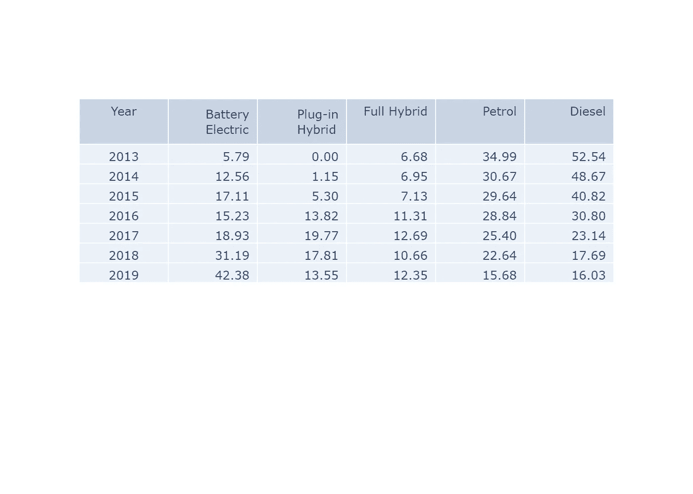
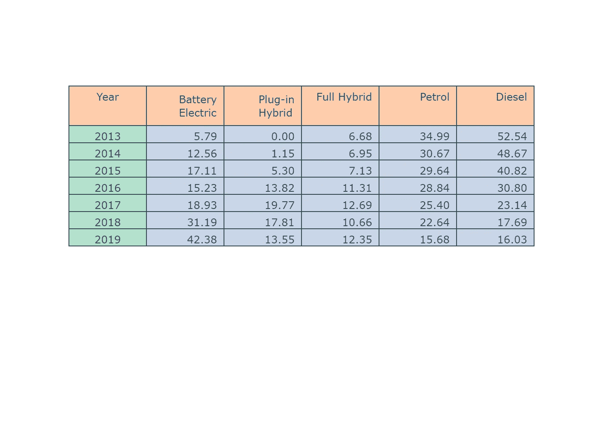
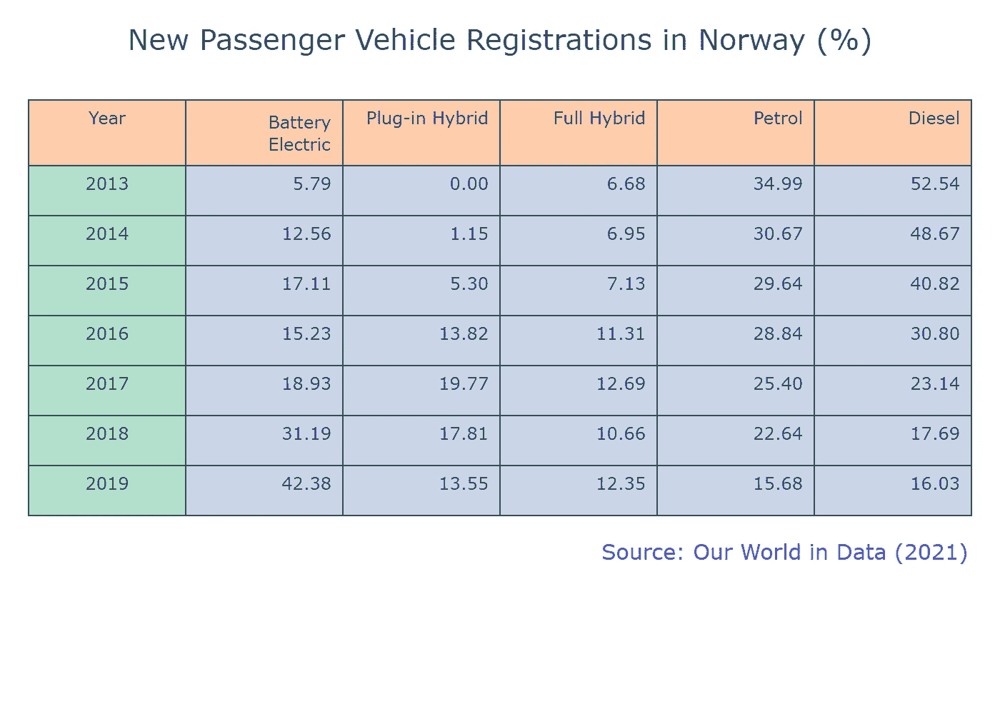
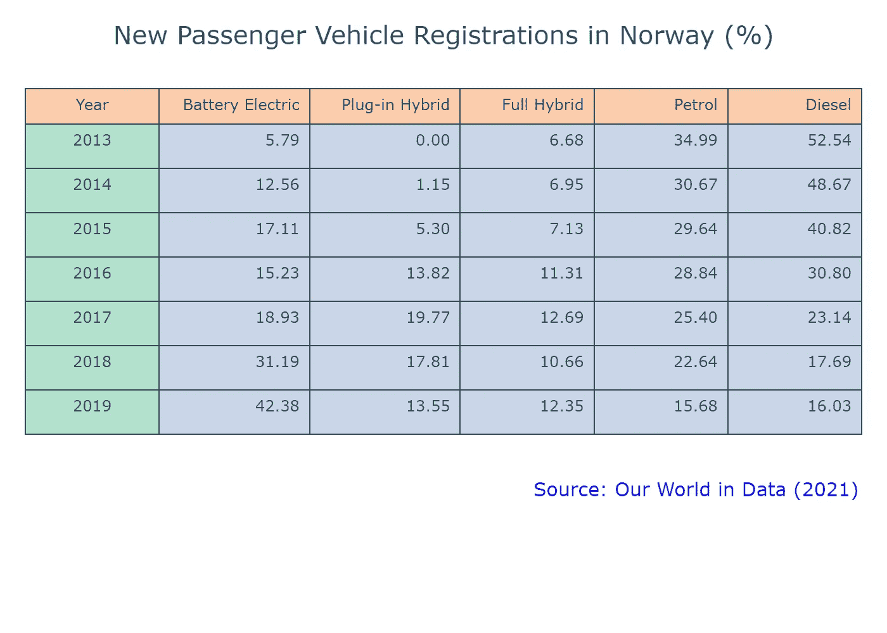

# 用表格讲故事

> 原文：[`towardsdatascience.com/storytelling-with-tables-514412adc4b7`](https://towardsdatascience.com/storytelling-with-tables-514412adc4b7)

## **第二部分：良好表格的建议指南**

[](https://medium.com/@dar.wtz?source=post_page-----514412adc4b7--------------------------------)[](https://towardsdatascience.com/?source=post_page-----514412adc4b7--------------------------------) [Darío Weitz](https://medium.com/@dar.wtz?source=post_page-----514412adc4b7--------------------------------)

·发表于[Towards Data Science](https://towardsdatascience.com/?source=post_page-----514412adc4b7--------------------------------) ·8 分钟阅读·2023 年 1 月 10 日

--


图片由[Joao Viegas](https://unsplash.com/@joaovgs?utm_source=medium&utm_medium=referral)提供，来源于[Unsplash](https://unsplash.com/?utm_source=medium&utm_medium=referral)

我们已经努力工作了几个月，我们相信有一些非常重要的报告。

我们如何让观众理解我们贡献的深度？

简单：通过恰当地讲述我们的故事。

为了更好的讲述故事，我们通常使用视觉元素，如图表、图解、表格、插图和图片。

你可以查看我在 Medium 上的[**为什么与如何**](https://medium.com/@dar.wtz/list/why-how-fbca0113d3aa)列表，了解使用经典图表（**条形图、散点图、饼图、直方图**）以及不常见图表（**平行坐标图、Mekko 图、面积图、仪表盘图表**）时的基本概念、技巧和需要避免的陷阱。

你还可以查看我在 Medium 上[**使用 Plotly 进行数据可视化**](https://medium.com/@dar.wtz/list/data-visualization-with-plotly-bc703f15fc44)的列表，其中展示了如何使用**Plotly Express**和**Plotly.graph_objects**来实现类似的目的。

但如果你需要使用表格，强烈建议**你首先阅读以下指南**。

# **表格**

记住，表格是一种由行和列组成的结构，其主要目的是在标记的列中显示数字和/或文本的列表。

在这一系列的[第一篇文章](https://medium.com/towards-data-science/storytelling-with-tables-part-1-tables-with-plotly-f1b8f77cdf4c)中，我指出了一个设计良好的表格应该具备的内容，并建议了使用表格的合适时机。

现在，我会提供一些建议和需要避免的陷阱。

# **表格的 10 个技巧**

每个表格必须能够让观众理解，而无需参考周围的文本；

所有表格必须按照它们在文本中引用的准确顺序使用阿拉伯数字进行顺序编号；

将数值右对齐，以便比较它们的大小；

将包含文本的列的标题和内容左对齐；

使用适当且有意义的小数位数。统一小数位数并右对齐；

根据列内容对齐列名称。每列标题的首字母应大写；

设计表格时，确保要比较的数据是连续的或接近彼此的；

每个表格必须有一个标题或自解释的标题；

始终包括脚注以提供额外的说明、解释缩写或不常见的定义；

始终包括一个来源行，以指示表格中数据的来源；

# **避免的 10 个陷阱**

首先问自己 **你的观众是否需要表格来帮助他们理解你的故事**；

如果你的表格只有一到两列且行数很少，也许可以在文本中展示这些数据；

如果数据已经在文本中，不要在表格中重复它；

表格不应占据整个屏幕（整页）。另一方面，表格也不应小到难以阅读；

“Table” 这个词不应该像“Fig.”用于图表那样被缩写；

始终在每一列中使用相同的小数位数。同时，不要在每列中更改计量单位；

使用不同背景颜色交替的行时要谨慎（**斑马条纹**）。它们通常在大型数据集中的使用是合适的，以帮助数据的可读性。尽量使用柔和的色彩调色板；

尽量避免使用垂直线来分隔列；

列标题不应明显宽于列中最宽的数据；

始终记住，表格 **比图表需要更多的处理时间**。给观众足够的时间来理解。

# **使用 plotly.figure.factory 的表格**

如果你确实急需用最少的代码绘制表格，我建议你使用 *plotly.figure_factory* 模块。该模块包含一些包装函数，用于扩展 Plotly 的绘图功能。让我们来看看它是如何工作的：

```py
# Tables with Plotly Figure Factory

import plotly.figure_factory as ff

data_to_table1 = [['Year', 'Battery Electric', 'Plug-in Hybrid', 'Full Hybrid', 'Petrol', 'Diesel'],
                  [2013, 5.79, 0.00, 6.68, 34.99, 52.54],
                  [2014, 12.56, 1.15, 6.95, 30.67,48.67],
                  [2015, 17.11, 5.30, 7.13, 29.64, 40.82],
                  [2016, 15.23, 13.82,11.31,28.84, 30.80],
                  [2017, 18.93, 19.70, 12.69, 25.54, 23.14],
                  [2018, 31.19, 17.81, 10.66, 22.64, 17.69],
                  [2019, 42.38, 13.55, 12.35, 15.68, 16.03]]

fig_ff1 = ff.create_table(data_to_table1)

fig_ff1.write_image(your_path + 'FF_Table1.png', scale = 2)
fig_ff1.show()
```



表格 1：由作者使用 plotly.figure.factory 制作

表格中显示的数据对应于 2013 年至 2019 年挪威按类型分类的新乘用车注册 [1]。

这是一个漂亮的表格，具有清晰的标题、易读的字体类型和大小、充足的空白空间，以及适当的**斑马条纹**颜色调色板。此外，你可以改变字体颜色和大小、背景颜色以及行高。

但该模块有一些限制，如果你需要更详细的表格，你必须求助于 Plotly Express。

# **使用 Plotly 图形对象的表格**

参考 [文章 1](https://medium.com/towards-data-science/storytelling-with-tables-part-1-tables-with-plotly-f1b8f77cdf4c)： “你可以使用 *Table* 方法在 Plotly 中创建表格。在其最基本的变体中，程序是使用 *fig.add_trace()*、*go.Table* 和两个参数：*header* 和 *cells*。前者如其名所示，代表**表格的标题**（第一行），而 *cells* 代表我们想展示给观众的数值或非数值” [2]。

首先，我们需要转置在 *data_to_table1* 列表中的数字数据。

```py
# Plotly Table 1

import numpy as np
import plotly.graph_objects as go

headers_tb1 = ['Year', 'Battery Electric', 'Plug-in Hybrid', 'Full Hybrid', 'Petrol', 'Diesel']

values_tb1 = [[2013, 5.79,  0.00,  6.68,  34.99, 52.54],
              [2014, 12.56, 1.15,  6.95,  30.67, 48.67],
              [2015, 17.11, 5.30,  7.13,  29.64, 40.82],
              [2016, 15.23, 13.82, 11.31, 28.84, 30.80],
              [2017, 18.93, 19.77, 12.69, 25.40, 23.14],
              [2018, 31.19, 17.81, 10.66, 22.64, 17.69],
              [2019, 42.38, 13.55, 12.35, 15.68, 16.03]]

transposed_tb1 = np.array(values_tb1).T.tolist()

fig_tb1 = go.Figure()
fig_tb1.add_trace( 
                go.Table(
                         header = dict(values = headers_tb1 ),
                         cells  = dict(values = transposed_tb1) 
                         ))

fig_tb1.write_image(your_path + 'Table_tb1.png', scale = 2)
fig_tb1.show()
```



表 2：由作者使用 plotly.graph.objects 制作

我们还有很多工作要做，直到我们的表格准备好展示给观众。

然后，我们必须解决对齐问题：年份列将居中对齐，因为它是**有序的**，而其余的数字值将右对齐。

```py
# Plotly Table 2                    

aligns = ['center','right', 'right','right','right', 'right']

fig_tb2 = go.Figure()
fig_tb2.add_trace( 
                  go.Table(
                     header = dict(values = headers_tb1,    align = aligns ),
                     cells  = dict(values = transposed_tb1, align = aligns )
                           ))

fig_tb2.write_image(your_path + 'Table_tb2.png', scale = 2)
fig_tb2.show()
```



表 3：由作者使用 plotly.graph.objects 制作

虽然有所改善，但我们仍然面临某些单元格小数位数不同的问题。

```py
# Plotly Table 3

fig_tb3 = go.Figure()
fig_tb3.add_trace( 
                go.Table(
                   header = dict(values = headers_tb1,    align = aligns ),
                   cells  = dict(values = transposed_tb1, align = aligns,
                                 format = [None, ",.2f"])
                         ))

fig_tb3.write_image(your_path + 'Table_tb3.png', scale = 2)
fig_tb3.show()
```



表 4：由作者使用 plotly.graph.objects 制作

现在是时候进行装饰和最终细节的调整了。

首先，我们使用了 Plotly Express 模块 *px.colors.qualitative* 更改了颜色调色板，该模块包含内置的颜色序列，如 Pastel2\。我们使用了‘*darkslategray*’作为边框颜色，背景颜色则使用了三种不同的柔和色调：

```py
# Plotly Table 4

fill_color_h = px.colors.qualitative.Pastel2[1]
line_color_h = 'darkslategray'

fill_color_c = [px.colors.qualitative.Pastel2[0], px.colors.qualitative.Pastel2[2],
                px.colors.qualitative.Pastel2[2], px.colors.qualitative.Pastel2[2],
                px.colors.qualitative.Pastel2[2], px.colors.qualitative.Pastel2[2]]
line_color_c = 'darkslategray'

fig_tb4 = go.Figure()
fig_tb4.add_trace( 
                go.Table(
                   header = dict(values = headers_tb1,    align = aligns,
                                 fill_color = fill_color_h,
                                 line_color = line_color_h),
                   cells  = dict(values = transposed_tb1, align = aligns,
                                 fill_color = fill_color_c,
                                 line_color = line_color_c,
                                 format = [None, ",.2f"])
                         ))

fig_tb4.write_image(your_path + 'Table_tb4.png', scale = 2)
fig_tb4.show()
```



表 5：由作者使用 plotly.graph.objects 制作

接下来，我们按照上面的说明（**技巧 8 和 9**）添加了标题和来源行。我们还通过**增加单元格高度**来增加了空白空间。

```py
# Plotly Table 5

fig_tb5 = go.Figure()
fig_tb5.add_trace( 
                go.Table(
                   header = dict(values = headers_tb1,    align = aligns,
                                 fill_color = fill_color_h,
                                 line_color = line_color_h),

                   cells  = dict(values = transposed_tb1, align = aligns,
                                 fill_color = fill_color_c,
                                 line_color = line_color_c,
                                 height = 35, format = [None, ",.2f"])
                         ))

fig_tb5.update_layout(title =  "New Passenger Vehicle Registrations in Norway (%)", 
                      title_font_size = 20, title_x = 0.5)
fig_tb5.add_annotation(x=1, yref= 'paper', y = 0.01,
                       text="Source: Our World in Data (2021)",
                       showarrow=False, 
                       font_size = 15, font_color = 'blue')  
fig_tb5.update_layout(autosize = False, 
                      margin=dict(l=20, r=20, t=70, b=100))

fig_tb5.write_image(your_path + 'Table_tb5.png', scale = 2)
fig_tb5.show()
```



表 6：由作者使用 plotly.graph.objects 制作

第 2 和第 3 列（电池电动和插电式混合动力）的标题字符数多于其他列。增加这两列的宽度（*columnwidth=*）会使视觉效果更加美观。

```py
# Plotly Table 6

fig_tb6 = go.Figure()
fig_tb6.add_trace( 
                go.Table(
                   columnwidth = [80,90,90,80, 80,80], 
                   header = dict(values = headers_tb1,    align = aligns,
                                 fill_color = fill_color_h,
                                 line_color = line_color_h),

                   cells  = dict(values = transposed_tb1, align = aligns,
                                 fill_color = fill_color_c,
                                 line_color = line_color_c,
                                 height = 35, format = [None, ",.2f"])
                         ))

fig_tb6.update_layout(title =  "New Passenger Vehicle Registrations in Norway (%)", 
                      title_font_size = 20, title_x = 0.5)
fig_tb6.add_annotation(x=1, yref= 'paper', y = 0.01,
                       text="Source: Our World in Data (2021)",
                       showarrow=False, 
                       font_size = 15, font_color = 'blue')  
fig_tb6.update_layout(autosize = False, 
                      margin=dict(l=20, r=20, t=70, b=100))

fig_tb6.write_image(your_path + 'Table_tb6.png', scale = 2)
fig_tb6.show()
```



表 7：由作者使用 plotly.graph.objects 制作

# **结论**

表格是数据分析师向技术、商业或管理观众展示其发现时的基本工具。因此，其准备工作必须非常细致。

在这篇文章中，我们提供了 10 个改进表格设计的提示和 10 个准备过程中应避免的陷阱。我们还介绍了如何使用 *plotly.figure_factory* 准备一个基本表格。最后，我们描述了一系列在设计表格时应遵循的步骤，使用 *plotly.graph_objects*。

**不要让设计糟糕的表格毁掉你的叙述。**

# **参考文献**

[1]: [`ourworldindata.org/transport#passenger-vehicle-registrations-by-type`](https://ourworldindata.org/transport#passenger-vehicle-registrations-by-type)

[2]: [`medium.com/towards-data-science/storytelling-with-tables-part-1-tables-with-plotly-f1b8f77cdf4c`](https://medium.com/towards-data-science/storytelling-with-tables-part-1-tables-with-plotly-f1b8f77cdf4c)
