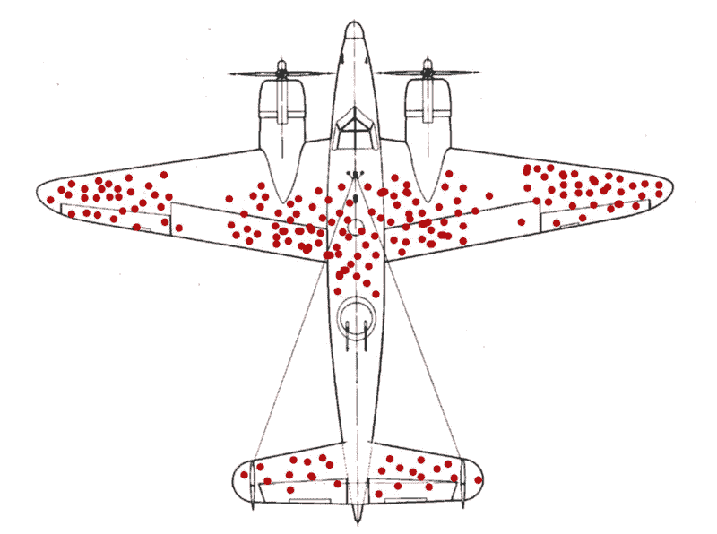
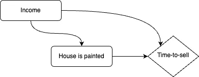
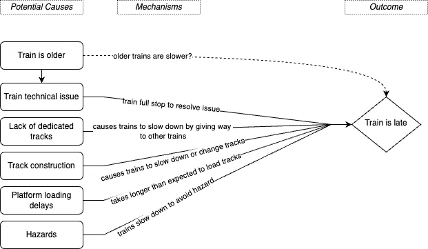

# 《战略数据分析（第三部分）：诊断性问题》

> 原文：[`towardsdatascience.com/strategic-data-analysis-part-3-diagnostic-questions-c0fcb840294b?source=collection_archive---------6-----------------------#2023-10-26`](https://towardsdatascience.com/strategic-data-analysis-part-3-diagnostic-questions-c0fcb840294b?source=collection_archive---------6-----------------------#2023-10-26)

## 深入探讨回答“为什么”问题的方法

 [Viyaleta Apgar](https://viyaleta.medium.com/?source=post_page-----c0fcb840294b--------------------------------)

·

[关注](https://medium.com/m/signin?actionUrl=https%3A%2F%2Fmedium.com%2F_%2Fsubscribe%2Fuser%2Fccae8864d5a4&operation=register&redirect=https%3A%2F%2Ftowardsdatascience.com%2Fstrategic-data-analysis-part-3-diagnostic-questions-c0fcb840294b&user=Viyaleta+Apgar&userId=ccae8864d5a4&source=post_page-ccae8864d5a4----c0fcb840294b---------------------post_header-----------) 发表在 [Towards Data Science](https://towardsdatascience.com/?source=post_page-----c0fcb840294b--------------------------------) ·14 分钟阅读·2023 年 10 月 26 日

--

*这是《战略数据分析》系列的一部分。*

[*战略数据分析（第一部分）*](https://medium.com/towards-data-science/strategic-data-analysis-part-1-fb2df3a43831)*战略数据分析（第二部分）：描述性问题****→ 《战略数据分析（第三部分）：诊断性问题》*** *战略数据分析（第四部分）：预测性问题 ← 敬请期待！*

《战略数据分析（第五部分）：处方性问题》← 敬请期待！*

回答“为什么”问题对于任何数据分析师来说都可能很困难。缺乏主题知识、技术储备不足和缺乏战略性方法都可能对帮助决策者找到正确答案产生不利影响。然而，凭借扎实的基础和方向，这些诊断问题可以被任何人轻松解决。

诊断问题通常紧随描述性问题的答案。在提出诊断问题时，决策者的目的是了解某些信息是如何产生的或是什么导致了某件事的发生。因此，当我们考虑诊断问题时，我们通常会想到因果推断。因此，熟悉因果推断的一般原则是很好的。

在本文中：

1.  因果推断简介

1.  诊断问题回答策略

1.  案例研究

1.  一些最后的备注

# 因果推断简介

因果推断旨在揭示干预（或对现状的变化）如何影响结果。在因果推断中，我们假设因果关系发生在某个干预，即“处理”，施加到某个单位上，并导致该单位结果的变化。如果我们比较有无处理的单位的结果，我们将能够观察到处理的效果（即因果关系）。

例如，如果我们想知道在房屋上市出售之前是否粉刷外墙会使其更快出售，最理想的情况是我们需要同时比较粉刷和未粉刷房屋的销售时间。在这里，房屋是我们的单位，粉刷外墙是我们的处理，销售时间是我们的结果。然而，不可能同时对同一房屋进行粉刷和不粉刷。因此，“我们无法同时观察到同一单位的处理与未处理”[1]。

这就是因果推断发挥作用的地方。我们不是直接测量特定单位上的处理效果，而是测量关联性和偏差。关联性是接受处理的所有单位与未接受处理的所有单位之间结果的平均差异。偏差通过捕捉所有结果不同的因素，将关联性与因果关系区分开来。

在我们的房屋出售示例中，我们可以比较所有粉刷过的房屋和所有未粉刷的房屋，并记录它们的销售时间。两组房屋之间的销售时间差异称为“关联”。*如果没有偏差，我们可以确定在出售前粉刷房屋会使其更快出售*。

然而，大多数决定在出售前粉刷房屋的原房主也有能力这么做，因为他们住在更好的社区；而更好的社区中的房屋通常销售得更快。因此，偏差可能是房屋销售更快的原因*不仅仅*是因为新刷的油漆，还因为它们位于更好的社区。如果我们能消除这种偏差（以及其他偏差），我们可以确定在出售前粉刷房屋是否会导致它销售更快。

这是因果推断的核心。要深入了解，我强烈推荐 Matheus Facure Alves 的书籍：[Causal Inference for the Brave and True](https://matheusfacure.github.io/python-causality-handbook/landing-page.html)，该书详细讲解了这一主题。因果推断的基础构建了回答诊断问题的策略，因此让我们更详细地探讨一下。

# 解决诊断问题的策略

诊断问题难以回答的原因是，它们可能需要对主题有深刻的了解。揭示某事发生或正在发生原因的一般策略需要理解所有可能的原因和偏差，然后通过严格的技术方法评估它们的效果。理解所有可能的原因需要付出努力和时间。因此，回答诊断问题的大部分时间都花在研究上。不幸的是，研究有时会将分析师引向各种死胡同。采用战略方法和严谨性有助于使过程更顺利。

一般来说，回答诊断问题的方法包括：

1.  识别结果

1.  识别可能的原因和潜在的偏差

1.  评估因果关系

图片由 [Mediamodifier](https://unsplash.com/@mediamodifier?utm_source=medium&utm_medium=referral) 提供，来源于 [Unsplash](https://unsplash.com/?utm_source=medium&utm_medium=referral)

在开始之前，需要注意的是，在几乎所有情况下，我们可能无法确定某件事的确切根本原因。相反，我们可以识别出最可能的影响因素，并评估它们的影响概率。

不仅要理解这一点，还要制定沟通策略，以便决策者在我们甚至还未开始回答他们的诊断问题之前，就能了解这一警告。在寻找诊断问题的答案时，决策者承受着风险。答案越不确定——风险越大。因此，决策者必须知道在基于所提供的答案做出决策时，必须权衡这种风险。

说明完毕，让我们详细看看这个策略。

## 步骤 1：识别结果

问题中的结果是经历了某种潜在原因影响的因变量。通常，诊断问题应该只有一个因变量。识别结果非常重要，以便明确它并验证它是否可以被测量。如果问题有多个因变量，则应该将问题拆分成不同的问题。

例如，在第一部分的“是什么导致了热浪”这个问题中，结果是热浪，这可以定义为温度的突然和剧烈升高。在“为什么我们的客户取消了他们的订阅”这个问题中，我们想要调查的结果是订阅取消。如果我们遇到一个类似于“为什么房价在上涨而租金在下降”的问题，我们应该回答两个独立的诊断问题：“为什么房价在上涨”和“为什么租金在下降”。

## 步骤 2：识别可能的原因和潜在的偏见

一旦我们确定了问题中的结果，我们必须列出所有可能解释它的因素，并帮助我们回答“为什么”。通常，这个过程可以分解为识别三件事：原因、偏见和因果机制。应构建图形因果模型来辅助识别过程。

图片由[Mark Rabe](https://unsplash.com/@itsrahbee?utm_source=medium&utm_medium=referral)提供，来源于[Unsplash](https://unsplash.com/?utm_source=medium&utm_medium=referral)

**潜在原因**可以通过研究、专业知识、访谈和关联来确定。如果没有适当的主题知识或专家的帮助，这很难实现。因此，有必要尽可能多地收集有关该主题的知识（有关为什么建立知识很重要的更多细节，请查看我的文章[首先我们必须发现，然后我们可以探索](https://medium.com/towards-data-science/first-we-must-discover-only-then-we-can-explore-8334b764535e)）。

在列出潜在原因的清单时，一个很好的工具是头脑风暴。头脑风暴的一种新颖方法是一个重复的过程，首先：列出尽可能多的原因，而不对其有效性进行判断，其次：遍历清单，确保列出的原因是合理和逻辑的。

例如，为了回答[第一部分](https://medium.com/towards-data-science/strategic-data-analysis-part-1-fb2df3a43831)中的一个问题：“为什么我们的客户取消了他们的订阅”，我们可以首先进行调研，了解我们的流失客户是否报告了他们取消订阅的原因。我们可以采访客户成功团队，以了解他们经常收到的客户投诉。然后，我们可以通过与决策者的头脑风暴会议，提出任何额外的原因。

**潜在偏差**可能比潜在原因更难发现，但对答案有重大影响。就像原因一样，偏差可以通过建立主题专长来确定。然而，与主要依赖知识的潜在原因不同，偏差识别通常需要创造性和建设性的思维。

一个好的起点是熟悉数据分析中常见的偏差类型，并推测这些偏差是否出现在你的使用案例中。一些常见的偏差类型包括确认偏差、选择偏差、历史偏差、生存者偏差、可得性偏差和异常值偏差[2]（更多信息请查看[这篇文章](https://www.metabase.com/blog/6-most-common-type-of-data-bias-in-data-analysis)）。

一个非常突出的生存者偏差例子涉及了亚伯拉罕·瓦尔德在二战期间的工作。作为哥伦比亚大学统计研究小组的一部分，瓦尔德及其团队被委托优化战机应携带的装甲量：如果战机装甲过多——由于重量过大，它们将无法飞行；如果装甲过少——它们将没有保护。在分析了安全返回但有弹孔的战机后，亚伯拉罕·瓦尔德建议将装甲添加到战机上*没有*弹孔的地方（而不是弹孔所在的位置）。为什么？因为分析只包括了幸存的战机，因此那些没有幸存的战机可能在一些关键区域有弹孔。如果这些关键区域被击中，它们未能返回，所以在关键区域增加装甲是有意义的[3]。了解整个故事请查看[这篇文章](https://www.cantorsparadise.com/survivorship-bias-and-the-mathematician-who-helped-win-wwii-356b174defa6)作者[亚历山德罗·巴齐](https://medium.com/u/7f6922738871?source=post_page-----c0fcb840294b--------------------------------)。

来源： [维基共享资源](https://commons.wikimedia.org/wiki/File:Survivorship-bias.png)

**因果机制**构成了潜在原因如何影响结果。没有因果机制，很难区分因果关系与巧合。这在选择推断因果关系的模型时起着重要作用。

一个很好的巧合例子是缅因州离婚率与人造黄油消费之间的相关性（见[原始文章](https://www.snexplores.org/article/explainer-correlation-causation-coincidence-and-more)）。这两个趋势可能是平行的，但没有合理的机制来解释为什么一个会导致另一个。因此，我们不能认为缅因州离婚率的增加会导致人造黄油消费的增加，反之亦然。

**图形因果模型**应该被开发出来，以帮助识别原因和偏差，以及构成因果关系的机制。实质上，这些模型是包括所有原因和结果的有向图。开发一个图形模型以理解因果关系也可以帮助我们加深对主题的理解，并可以用来帮助我们与决策者沟通。

例如，图形因果模型可以帮助我们揭示混杂偏差。我们来自原因和偏差的变量不一定只是影响结果——它们实际上可以互相影响。如果某些变量影响我们的潜在原因和结果，那么我们就涉及到混杂偏差。为了消除这种偏差，我们应该控制所有共同的潜在原因。

假设我们正在研究在房屋上市出售之前进行粉刷是否会影响销售时间。我们可以假设收入较高可能会影响房主是否决定在出售之前粉刷房屋。然而，我们也可以认识到更高的收入意味着房主还可以利用减少销售时间的资源。这是混杂偏差的一个例子，我们应该在最终模型中控制收入因素。

由我在 draw.io 制作的图示

## 第 3 步：评估因果关系

现在我们有了一个结果、原因和偏差，以及构成我们依赖关系的机制，我们可以评估因果关系。这一步要求我们验证我们假设的观点是否合理。根据情况和可用资源，我们可以通过两种方式实现这一目标：1\. 进行随机实验并比较结果，或 2\. 利用历史数据开发统计模型来测量因果关系。

照片来自 [Bradyn Trollip](https://unsplash.com/@bradyn?utm_source=medium&utm_medium=referral) 在 [Unsplash](https://unsplash.com/?utm_source=medium&utm_medium=referral)

**进行随机实验**，包括处理组和对照组，可以帮助我们通过确保实验中的两个（或更多）组具有相似的人群代表性来减少偏差。如果这些组在组成上相似且我们的样本量足够，我们应该能够比较组间的结果，并识别出结果差异是否显著。

在我们的房屋销售示例中，我们可以抽取两组房屋卖家（确保两组在房主人群中具有相同的代表性）。我们可以要求其中一组在上市前粉刷他们的房子，而要求另一组保持外墙涂料不变。然后，我们将比较两组之间的销售时间分布。通过统计测试，我们可以查看销售时间指标是否存在显著差异。

在实践中，由于许多原因，这可能很难实现，其中一些原因包括让志愿的房主参与我们的实验、确保实验有足够的资金以及确保我们的样本是随机的并且代表了房屋销售人群。然而，即使我们无法进行这样的实验，我们仍然有选择。

**建立统计模型**使用历史数据可以帮助我们控制混杂原因和偏差，并估计直接原因对结果的影响。使用回归等技术，我们可以为每个原因和通用偏差度量分配权重。我们可以通过使用历史数据训练模型来估计模型的参数（模型中的权重）。最终结果应该帮助我们理解变量对最终结果的因果效应。“即使我们不能使用随机对照试验来保持处理组和对照组之间的其他因素相等，回归也可以通过将这些相同的因素包括在模型中来做到这一点，即使数据不是随机的！” [1]

然而，无论我们选择什么技术来测量因果关系，都需要注意我们的模型不能*确定*因果关系。我们可以在回归模型中包括数百个特征，但**仅仅因为它们被包括在内**以及因为它们有一定的权重**并不能保证它们是结果的原因**。因此，捕捉图形因果模型中的可能因果机制是很重要的，这样我们可以避免包括不相关的特征，并确保我们获得充分的结果。

# 案例研究

让我们继续讨论[第二部分](https://medium.com/towards-data-science/strategic-data-analysis-for-descriptive-questions-b6c9e469b32f)的案例研究，在那里我提出了一个关于火车迟到的描述性问题的回答策略。假设我们的决策者现在想知道“*为什么*火车会迟到？”按照本文中概述的步骤，我们可以制定以下策略来回答这个问题：

**识别结果。** 问题“火车为什么迟到”的结果是火车迟到（我们定义为“如果火车实际到达时间与预期到达时间之间的差异大于 1 分钟，则设置为 1 的二进制标志”）

**识别潜在的原因和偏差。**

1.  为了识别潜在的**原因**，我们可以与决策者进行一些访谈和头脑风暴会议，我们可以在平台上观察火车并进行火车旅行，还可以与列车员和乘客交谈。潜在原因的示例包括平台装卸时间延迟、轨道施工、缺乏专用轨道导致的火车交会和超车延迟、危险（如树叶、冰雪）、火车年龄和技术问题。对于每个原因，我们还应该识别一个机制，通过该机制原因对结果产生影响。

1.  为了识别潜在的**偏差**，我们可以熟悉各种偏差类型，并评估这些偏差是否适用于我们的用例。例如，选择偏差可能不会对我们造成问题，因为我们可以将所有火车纳入研究，而不是仅选择一部分火车。另一方面，我们可能存在幸存者偏差的情况，因为某些火车的机械问题可能导致火车从未到达，因此被排除在晚点火车数据集之外。

1.  为了识别潜在的**因果机制**，我们应该识别*每个*潜在原因如何影响或冲击结果。例如，某种危险（如落叶或雪）可能导致火车晚点，因为它会让火车因危险而减速。我们可以假设火车的年龄影响火车的晚点情况，因为老旧的火车较慢。但这是真的吗？收集相关数据并进行探索性数据分析可以帮助我们验证这一因果机制是否合理。

我们可以整理一个图形因果模型，以评估我们提出的原因和偏差与结果的关系，并为每个原因概述一个潜在机制。此时，我们还可以进行更多的探索性数据分析，以发现我们原因之间的隐性关联，并选择最终的潜在原因纳入模型。例如，如果我们发现有技术问题的火车大多数是老旧火车，我们就不需要将火车年龄作为模型参数，因为它已经通过技术问题参数得到了暗示。

来源：由我在 draw.io 中制作

**评估因果关系。** 最后，我们准备评估因果关系。对我们而言，进行一系列实验以测试每个潜在原因将会是困难且成本高昂的。然而，由于我们有详细的火车时刻表、火车问题以及天气和轨道条件记录，我们应该努力构建一个回归模型，以验证可能的原因。在我们的案例中，我们可以使用可能的原因构建一个逻辑回归模型，以预测火车是否确实晚点。模型训练后，与模型参数相关的权重应指示每个原因对结果的影响。

在选择了具有非零权重的原因后，我们可以向决策者展示我们的发现，并回答他们最初的问题：“为什么火车会晚点？”

# 几个最终说明

这篇文章较长，但我希望它能够阐明一个复杂的主题，并使其更容易处理。几点说明：

+   我们可能无法确定过去或当前事件的确切原因。在大多数情况下，我们可以识别出最可能或最有可能的原因。因此，决策者需要承担一定的风险，并应对此有所了解。

+   图形因果模型可以成为与决策者沟通的一个极好工具，帮助揭示潜在情况之间的关联，并有助于识别偏差。

+   如果没有因果机制，一个与结果有非零关联的潜在原因可能只是巧合。

+   作为分析师，运用批判性思维技能非常重要，特别是在处理诊断问题时。这些问题可能有很多曲折，可能会将你引向错误的路径。

*感谢阅读！在我的下一篇文章中，我将深入探讨预测问题，请保持关注，并在评论中告诉我你的想法！*

## 来源

[1] [`matheusfacure.github.io/python-causality-handbook/01-Introduction-To-Causality.html`](https://matheusfacure.github.io/python-causality-handbook/01-Introduction-To-Causality.html)

[2] [`www.metabase.com/blog/6-most-common-type-of-data-bias-in-data-analysis`](https://www.metabase.com/blog/6-most-common-type-of-data-bias-in-data-analysis)

[3] [`www.cantorsparadise.com/survivorship-bias-and-the-mathematician-who-helped-win-wwii-356b174defa6`](https://www.cantorsparadise.com/survivorship-bias-and-the-mathematician-who-helped-win-wwii-356b174defa6)
