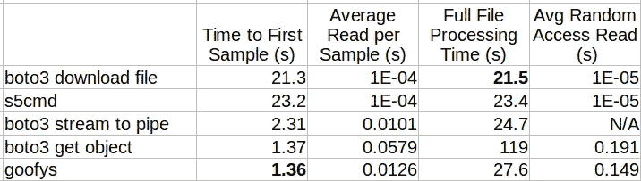

# 从云存储中流式传输大数据文件

> 原文：[`towardsdatascience.com/streaming-big-data-files-from-cloud-storage-634e54818e75?source=collection_archive---------9-----------------------#2023-01-25`](https://towardsdatascience.com/streaming-big-data-files-from-cloud-storage-634e54818e75?source=collection_archive---------9-----------------------#2023-01-25)

## 高效处理大型文件的方法

[](https://chaimrand.medium.com/?source=post_page-----634e54818e75--------------------------------)[](https://towardsdatascience.com/?source=post_page-----634e54818e75--------------------------------) [Chaim Rand](https://chaimrand.medium.com/?source=post_page-----634e54818e75--------------------------------)

·

[关注](https://medium.com/m/signin?actionUrl=https%3A%2F%2Fmedium.com%2F_%2Fsubscribe%2Fuser%2F9440b37e27fe&operation=register&redirect=https%3A%2F%2Ftowardsdatascience.com%2Fstreaming-big-data-files-from-cloud-storage-634e54818e75&user=Chaim+Rand&userId=9440b37e27fe&source=post_page-9440b37e27fe----634e54818e75---------------------post_header-----------) 发表于 [Towards Data Science](https://towardsdatascience.com/?source=post_page-----634e54818e75--------------------------------) ·13 分钟阅读·2023 年 1 月 25 日[](https://medium.com/m/signin?actionUrl=https%3A%2F%2Fmedium.com%2F_%2Fvote%2Ftowards-data-science%2F634e54818e75&operation=register&redirect=https%3A%2F%2Ftowardsdatascience.com%2Fstreaming-big-data-files-from-cloud-storage-634e54818e75&user=Chaim+Rand&userId=9440b37e27fe&source=-----634e54818e75---------------------clap_footer-----------)

--

[](https://medium.com/m/signin?actionUrl=https%3A%2F%2Fmedium.com%2F_%2Fbookmark%2Fp%2F634e54818e75&operation=register&redirect=https%3A%2F%2Ftowardsdatascience.com%2Fstreaming-big-data-files-from-cloud-storage-634e54818e75&source=-----634e54818e75---------------------bookmark_footer-----------)

图片由 [Aron Visuals](https://unsplash.com/@aronvisuals?utm_source=medium&utm_medium=referral) 提供，来源于 [Unsplash](https://unsplash.com/?utm_source=medium&utm_medium=referral)

处理非常大的文件可能会给应用程序开发人员带来与高效资源管理和运行时性能相关的挑战。例如，文本文件编辑器可以分为能够处理大文件的编辑器和那些让你的 CPU 卡顿、让你的 PC 冻结、让你想尖叫的编辑器。当大型文件存储在远程存储位置时，这些挑战会更加严重。在这种情况下，必须考虑文件如何被拉取到应用程序中，同时考虑：带宽容量、网络延迟和应用程序的文件访问模式。在这篇文章中，我们考虑了我们的数据应用程序需要访问存储在**云对象存储**中的一个或多个大文件的情况。这是关于高效从云中获取数据的一系列文章中的一篇（例如，这里，这里 和 [这里](https://julsimon.medium.com/deep-dive-on-tensorflow-training-with-amazon-sagemaker-and-amazon-s3-12038828075c)）。

在开始之前，让我们明确一下……在使用云存储时，通常**不**建议处理特别大的文件。如果你正在处理多个数据文件，也建议**不要**选择特别小的文件大小（因为对存储服务发出的多个请求会产生额外开销）。最佳文件大小因平台而异，但通常在几 MB 到几百 MB 之间。（如果你严重依赖云存储，可能需要设计一个简单的实验来测试这一点。）不幸的是，我们并不总是能控制数据设计过程，有时只能接受现有的条件。

另一个好的实践，特别是在处理大文件时，是选择支持部分文件读取的格式——也就是说，选择一种不需要加载整个文件即可处理其任何部分的格式。这类文件的几个例子包括：

+   一个简单的文本文件，

+   一个顺序数据集——一个包含按顺序分组到单个文件中的单独记录的数据集，

+   以列式格式存储的数据集，例如 [Apache Parquet](https://parquet.apache.org/)，这种格式专门设计用于仅加载选定的列，

+   允许从任意时间偏移播放的视频文件（大多数格式都支持这种功能）。

在这篇文章中，我们假设我们的大文件允许部分读取。我们将考虑几种在 Python 中读取文件内容的选项，并测量它们在不同应用场景下的表现。尽管我们的演示将基于 AWS 的对象存储服务 [Amazon S3](https://aws.amazon.com/s3/)，但我们所写的内容同样适用于任何其他对象存储服务。请注意，我们选择的具体服务、API、库等，不应被视为对这些选项的偏好。云端数据流的最佳解决方案很大程度上依赖于项目和环境的细节，强烈建议在得出任何结论之前进行深入分析。

# 从 Amazon S3 直接下载

在这篇文章中，我们将假设我们直接从 Amazon S3 下载文件。然而，需要注意的是，有许多服务和/或解决方案在对象存储和应用程序之间包括一个中间步骤。例如，AWS 提供了 [Amazon FSx](https://aws.amazon.com/fsx/) 和 [Amazon EFS](https://aws.amazon.com/efs/) 等服务，将数据镜像到云中的高性能文件系统中。[AI Store](https://github.com/NVIDIA/aistore) 提供了一种基于 [kubernetes](https://kubernetes.io/) 的解决方案，用于与数据消费应用程序相邻的轻量级存储堆栈。这些解决方案可能会缓解使用大文件时的一些挑战，例如，它们可能会减少延迟并支持更高的带宽。另一方面，它们通常会引入一系列与部署、维护、扩展性等相关的新挑战。此外，它们还会增加额外的费用。

# 比较性能测量指标

在接下来的几节中，我们将描述在 Python 中从 Amazon S3 拉取大文件的不同方法。为了比较这些方法的行为，我们将使用以下指标：

+   **首次采样时间** — 读取文件中第一个样本需要多长时间。

+   **平均顺序读取时间** — 在顺序遍历所有样本时，每个样本的平均读取时间是多少。

+   **总处理时间** — 整个数据文件的总处理时间是多少。

+   **平均随机读取时间** — 在读取任意偏移量的样本时的平均读取时间是多少。

不同的应用程序将对这些指标的优先级有不同的偏好。例如，视频流应用可能会优先考虑较低的首次样本时间，以提高观众体验。它还需要在任意偏移量处进行高效读取，以支持快进等功能。另一方面，只要平均每样本时间超过某个阈值（例如，每秒 30 帧），优化此指标就不那么重要。相比之下，深度学习训练应用可能会优先考虑减少平均顺序读取时间和总处理时间，以最小化训练流程中的潜在性能瓶颈。

# 玩具示例

为了方便讨论，我们创建了一个 2 GB 的二进制文件，并假设该文件包含 2,048 个数据样本，每个样本大小为 1 MB。下面的代码块包括以下片段：创建一个包含随机数据的文件并将其上传到 Amazon S3（使用 boto3），按顺序遍历所有样本，以及在非顺序文件偏移量处采样数据。对于此及所有后续代码片段，我们假设您的 AWS 账户和本地环境已被适当地 [配置](https://boto3.amazonaws.com/v1/documentation/api/latest/guide/credentials.html) 以访问 Amazon S3。

```py
import os, boto3

KB = 1024
MB = KB * KB

def write_and_upload():
    # write 2 GB file
    with open('2GB.bin', 'wb') as f:
        for i in range(2*KB):
            f.write(os.urandom(MB))

    # upload to S3
    bucket = '<s3 bucket name>'
    key = '<s3 key>'
    s3 = boto3.client('s3')
    s3.upload_file('2GB.bin', bucket, key)

def read_sequential(f, t0):
    t1 = time.time()
    x = f.read(MB)
    print(f'time of first sample: {time.time() - t1}')
    print(f'total to first sample: {time.time() - t0}')
    t1 = time.time()
    count = 0
    while True:
        x = f.read(MB)
        if len(x) == 0:
            break
        count += 1
    print(f'time of avg read: {(time.time() - t1)/count}')

def fast_forward(f):
    t1 = time.time()
    total = 10
    for i in range(total):
        f.seek(i * 100 * MB)
        t1 = time.time()
        x = f.read(MB)
    print(f'time of avg random read: {(time.time() - t1)/total}')
```

# 从 S3 下载到本地磁盘

我们考虑的第一个选项是将大型文件下载到本地磁盘，然后以读取任何其他本地文件的方式从那里读取它。有多种方法可以将文件下载到本地磁盘。我们在这里评估的三种方法是：Python boto3 API、AWS CLI 和 S5cmd。

## **Boto3 文件下载**

在 Python 中从 Amazon S3 拉取文件的最直接方法是使用专用的 [Boto3](https://boto3.amazonaws.com/v1/documentation/api/latest/index.html) Python 库。在下面的代码块中，我们展示了如何定义一个 *S3* *客户端* 并使用 [下载文件](https://boto3.amazonaws.com/v1/documentation/api/latest/reference/services/s3.html#S3.Client.download_file) API 将文件从 S3 拉取到本地路径。该 API 接受一个 [TransferConfig](https://boto3.amazonaws.com/v1/documentation/api/latest/reference/customizations/s3.html#boto3.s3.transfer.TransferConfig) 对象，其中包含调节下载行为的控制项。在我们的示例中，我们将设置保留为默认值。

```py
import boto3, time

bucket = '<s3 bucket name>'
key = '<s3 key>'
local_path = '<local path>'

s3 = boto3.client('s3')

config = boto3.s3.transfer.TransferConfig(
    multipart_threshold=8 * MB,
    max_concurrency=10,
    multipart_chunksize=8 * MB,
    num_download_attempts=5,
    max_io_queue=100,
    io_chunksize=256 * KB,
    use_threads=True,
    max_bandwidth=None)

t0 = time.time()
s3.download_file(bucket, key, local_path, Config=config)

with open(local_path, 'rb') as f:
    read_sequential(f,t0)

print(f'total time: {time.time()-t0}')
```

我们在本地环境中运行了这个脚本（以及所有后续脚本），并将结果在 10 次试验中取了平均值。不出所料，平均首次样本时间相对较高，约为 21.3 秒。这是因为我们需要等待整个文件下载完成后才能打开。一旦下载完成，顺序和任意样本的平均读取时间都非常微小，就像我们从其他本地文件中预期的一样。

Boto3 包含一个类似的 API，[download_fileobj](https://boto3.amazonaws.com/v1/documentation/api/latest/reference/services/s3.html#S3.Client.download_fileobj)，用于将文件直接下载到内存中（例如，使用[io.BytesIO](https://docs.python.org/3/library/io.html#io.BytesIO)对象）。然而，这在处理大文件时通常**不**推荐。

## AWS CLI

[AWS CLI](https://docs.aws.amazon.com/cli/latest/index.html)工具提供了类似的命令行功能。AWS CLI 是用 Python 编写的，使用与 Boto3 相同的底层 API。一些开发者对这种使用方式感到更加舒适。下载配置设置通过[AWS 配置文件](https://docs.aws.amazon.com/cli/latest/topic/s3-config.html)进行控制。

```py
import shlex, time
from subprocess import Popen

bucket = '<s3 bucket name>'
key = '<s3 key>'
local_path = '<local path>'

cmd = f'aws s3 cp s3://{bucket}/{key} {local_path}'
p = Popen(shlex.split(cmd)).wait()

with open(local_path, 'rb') as f:
    read_sequential(f,t0)

print(f'total time: {time.time()-t0}')
```

不出所料，运行此脚本（使用默认配置设置）的结果与之前的 Boto3 结果几乎完全相同。

## **S5cmd**

我们在之前的文章中详细介绍了[S5cmd](https://github.com/peak/s5cmd)命令行工具，展示了它在并行从云存储中下载数百个小文件的价值。与之前的方法不同，S5cmd 是用[Go 编程语言](https://go.dev/)编写的，因此能够更好地利用底层资源（例如，CPU 核心和 TCP 连接）。有关 S5cmd 如何工作及其显著性能优势的更多细节，请查看[这篇信息丰富的博客](https://joshua-robinson.medium.com/s5cmd-for-high-performance-object-storage-7071352cc09d)。S5cmd 的[*concurrency*](https://github.com/peak/s5cmd#concurrency)标志允许控制下载速度。下面的代码块演示了将 S5cmd 的*concurrency*设置为 10 的使用方法。

```py
import shlex, time
from subprocess import Popen

bucket = '<s3 bucket name>'
key = '<s3 key>'
local_path = '<local path>'

s5cmd = f's5cmd cp --concurrency 10 s3://{bucket}/{key} {local_path}'
p = Popen(shlex.split(cmd)).wait()

with open(local_path, 'rb') as f:
    read_sequential(f,t0)

print(f'total time: {time.time()-t0}')
```

很遗憾，我们未能再现 S5cmd 在[50 GB 文件上的卓越性能提升](https://joshua-robinson.medium.com/s5cmd-for-high-performance-object-storage-7071352cc09d)。平均首次样本时间约为 23.1 秒，稍高于我们之前的结果。

## **多线程与单线程下载**

之前的每种方法都在后台使用了多线程下载。在多线程下载中，多个线程并行运行，每个线程负责下载文件的一个不重叠的块。多线程下载对于及时从云端拉取大文件至关重要。为了演示其重要性，我们重新进行了 Boto3 实验，将*use_threads*标志设置为*False*，实际上禁用了多线程下载。这导致结果的平均首次样本时间飙升至 156 秒。

## **数据文件预取的艺术**

预取是一种常用技术，用于遍历多个大型文件时。当进行预取时，应用程序会开始并行下载一个或多个后续文件，同时处理当前文件。通过这种方式，应用程序可以避免除第一个文件之外的所有文件的下载延迟。有效的预取需要适当的调整以达到最优结果。许多框架通过从云中预取数据来加速数据摄取速度。例如，[PyTorch](https://www.google.com/url?sa=t&rct=j&q=&esrc=s&cd=&cad=rja&uact=8&ved=2ahUKEwiHkcyujc_8AhV0g_0HHTphBe8QFnoECAkQAQ&url=https%3A%2F%2Fpytorch.org%2F&usg=AOvVaw2mABY6VbqZdRJYnleMzDSb)和[TensorFlow](https://www.google.com/url?sa=t&rct=j&q=&esrc=s&cd=&cad=rja&uact=8&ved=2ahUKEwjzjMS_jc_8AhVvi_0HHWgpBPQQFnoECAkQAQ&url=https%3A%2F%2Fwww.tensorflow.org%2F&usg=AOvVaw0TGZBeXHx2CVPI2FiDZclR)都支持预取训练数据文件以优化深度学习训练。

# 从 S3 流式传输数据

一些应用程序可能愿意在平均每个样本的读取时间上做出妥协，以换取较低的首样本时间。在这一节中，我们演示了一种 Boto3 选项，用于从 S3 流式传输文件，以便在完成文件下载之前就开始处理它。我们描述的方法涉及创建一个[Linux FIFO 管道](https://www.gnu.org/software/libc/manual/html_node/Pipes-and-FIFOs.html)，并将其传递给 Boto3 的[download_fileobj](https://boto3.amazonaws.com/v1/documentation/api/latest/reference/services/s3.html#S3.Client.download_fileobj) API：

```py
import os, boto3, time, multiprocessing as mp

bucket = '<s3 bucket name>'
key = '<s3 key>'

t0 = time.time()

os.mkfifo(local_path)

def stream_file():
    s3 = boto3.client('s3')
    with open(local_path, 'wb') as f:
        s3.download_fileobj(bucket, key, f)

proc = mp.Process(target=stream_file)
proc.start()

with open(local_path, 'rb') as f:
    read_sequential(f, t0)

print(f'total time: {time.time()-t0}')
```

确实，平均首样本时间降至约 2.31 秒（从超过 20 秒降下）。另一方面，平均每样本时间和总文件处理时间分别增加到约 0.01 秒和 24.7 秒。

# 从任意偏移量读取数据

一些应用程序要求能够在任意偏移量处仅读取文件的特定部分。对于这些用例，下载整个文件可能是极其浪费的。在这里，我们展示了如何使用 Boto3 的[get_object](https://boto3.amazonaws.com/v1/documentation/api/latest/reference/services/s3.html#S3.Client.get_object)数据流 API 下载文件的特定[字节范围](https://docs.aws.amazon.com/whitepapers/latest/s3-optimizing-performance-best-practices/use-byte-range-fetches.html)。下面的代码块演示了 API 在流式传输整个文件和读取任意数据块时的使用。

```py
import boto3, time

bucket = '<s3 bucket name>'
key = '<s3 key>'

s3 = boto3.client('s3')

# stream entire file
t0 = time.time()
response = s3.get_object(
    Bucket=bucket,
    Key=key
)
f = response['Body']
read_sequential(f,t0)

print(f'total time: {time.time()-t0}')

# fast forward
total = 10
t0 = time.time()

for i in range(total):
    response = s3.get_object(
        Bucket=bucket,
        Key=key,
        Range=f'bytes={i*100*MB}-{i*100*MB+MB-1}'
    )
    f = response['Body']
    x = f.read()

print(f'time of avg random read: {(time.time() - t0)/total}')
```

尽管此解决方案的首样本时间结果约为 1.37 秒，但总文件处理时间（约 119 秒）使其不适合顺序读取。其价值体现在读取任意样本的平均时间上——约 0.191 秒。

请注意，我们的示例没有利用任意偏移量是预先确定的这一事实。现实世界中的应用程序将使用这些信息来预取文件段并提升性能。

如上所述，从云中高效拉取大型文件依赖于并行多部分下载。实现这一点的一种方法是使用 Boto3 的[get_object](https://boto3.amazonaws.com/v1/documentation/api/latest/reference/services/s3.html#S3.Client.get_object) API 以刚刚展示的方式读取不连续的文件块。

## 使用 Amazon S3 Select 过滤数据

有时，我们所寻求的部分数据是从存储在 CSV、JSON 或 Apache Parquet 文件格式的大文件中提取的少量行和/或列。在这种情况下，我们可以简单地使用专用服务，如[Amazon S3 Select](https://docs.aws.amazon.com/AmazonS3/latest/userguide/selecting-content-from-objects.html)来应用 SQL 过滤器。要对多个文件运行 SQL 过滤器，你可以考虑使用[Amazon Athena](https://aws.amazon.com/athena/)。这两种服务都允许你将数据检索限制为所需的特定信息，避免了拉取一个或多个大型文件的高开销。请务必查看文档以了解更多信息。

# 使用 Goofys 挂载 S3 数据

到目前为止，我们讨论的所有解决方案都涉及直接从云存储中提取数据。其他解决方案则将云存储访问暴露给应用程序，作为（类似 POSIX 的）文件系统。[Goofys](https://github.com/kahing/goofys)是一个流行的基于[FUSE](https://en.wikipedia.org/wiki/Filesystem_in_Userspace)的库，用于从 Amazon S3 中读取数据。下面的命令演示了如何将 S3 桶挂载到本地文件路径。

```py
goofys -o ro -f <s3 bucket name> <local path>
```

一旦配置了 goofys 挂载，应用程序可以通过指向本地路径的方式访问大型文件，如下面的代码块所示：

```py
bucket = '<s3 bucket name>'
key = '<s3 key>'
mount_dir = '<local goofys mount>'
sequential = True # toggle flag to run fast_forward

t0 = time.time()
with open(f'{mount_dir}/{key}', 'rb') as f:
    if sequential:
        read_sequential(f, t0)
        print(f'total time: {time.time()-t0}')
    else:
        fast_forward(f)
```

基于 goofys 的解决方案导致了约 1.36 秒的首次样本时间、约 27.6 秒的总文件处理时间和约 0.149 秒的读取任意样本的平均时间。

应该注意的是，在底层，goofys 尝试优化响应时间，即使是以增加对 Amazon S3 的额外调用为代价（例如，预取数据块，即使在它们被请求之前）。根据你的设置和应用程序的数据访问模式的细节，这可能导致相对于其他解决方案，Amazon S3 成本略有增加。Goofys 包括多个设置来控制其行为，例如，“ — cheap”标志用于在性能和潜在较低成本之间进行权衡。请注意，这些控制是在定义挂载时应用的。与基于 Boto3 的解决方案相反，goofys 不允许你在运行时调整控制（例如，块大小、预取行为等），以支持不同的数据摄取模式。

另一个需要注意的点是，goofys 读取的数据部分会被缓存。因此，如果在缓存中仍然存在相同的数据部分时再次读取，该响应将是即时的。在运行测试时请记住这一点，并确保在每次实验之前重置 goofys 挂载。

确保查看[文档](https://github.com/kahing/goofys)以获取更多关于 goofys 如何工作、如何控制其行为、其限制等方面的详细信息。

# 比较结果

下表总结了我们进行的实验结果：



从 S3 拉取 2GB 文件的比较结果（作者提供）

结果表明，处理大数据文件的最佳方法可能取决于应用程序的具体需求。根据这些结果，旨在最小化首次样本时间的应用程序将从基于 goofys 的解决方案中获益最大，而旨在最小化总处理时间的应用程序则会选择使用 Boto3 将文件下载到本地磁盘。

我们强烈建议不要依赖此表格来为你的应用程序做出任何决策。测试是在一个非常特定的环境下进行的，使用的是本文撰写时可用的工具版本。比较结果可能会因以下因素而有很大差异：设置、网络负载、与云存储设施的距离、所用工具的版本、应用程序的资源需求等。

我们的结果没有考虑不同解决方案之间 CPU、内存和其他系统资源的使用差异。在实际应用中，系统资源的负载应予以考虑，因为它们可能会影响应用程序的行为。

在做出任何设计决策之前，请务必进行自己的深入、基于用例的实验。

# 总结

在这篇文章中，我们讨论了从云存储中提取大型数据文件的话题。我们看到，最佳的方法可能会根据数据应用的具体需求而有所不同。我们的讨论突显了一个在所有关于云服务的文章中都存在的主题——尽管*云*为技术发展和进步开辟了广泛的新机会，但它也带来了许多独特而令人兴奋的挑战，并促使我们重新思考常见的应用设计原则。

一如既往，欢迎提出评论、问题和更正。
