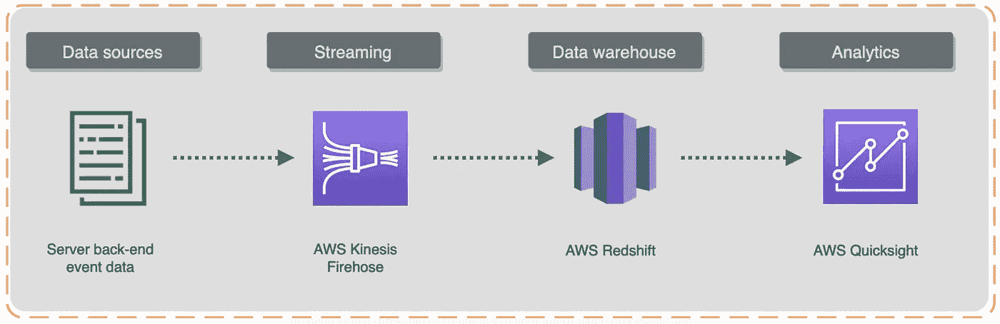
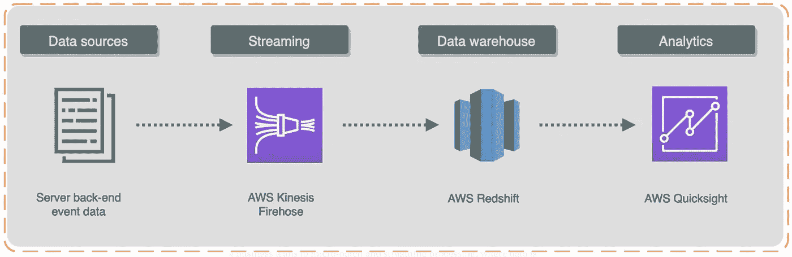
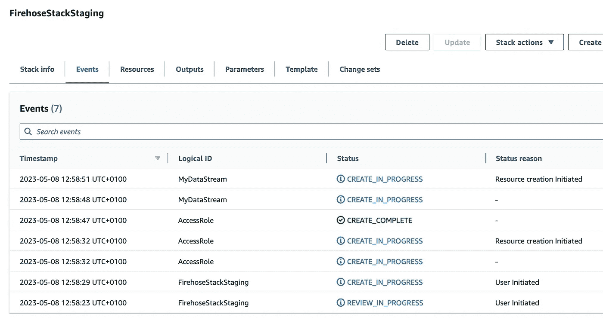
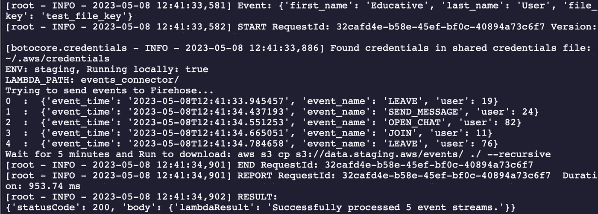

# 数据工程中的流数据

> 原文：[`towardsdatascience.com/streaming-in-data-engineering-2bb2b9b3b603`](https://towardsdatascience.com/streaming-in-data-engineering-2bb2b9b3b603)

## 流数据管道和实时分析

[](https://mshakhomirov.medium.com/?source=post_page-----2bb2b9b3b603--------------------------------)[](https://towardsdatascience.com/?source=post_page-----2bb2b9b3b603--------------------------------) [💡Mike Shakhomirov](https://mshakhomirov.medium.com/?source=post_page-----2bb2b9b3b603--------------------------------)

·发表于[Towards Data Science](https://towardsdatascience.com/?source=post_page-----2bb2b9b3b603--------------------------------) ·阅读时间 9 分钟·2023 年 12 月 12 日

--


图片由[DESIGNECOLOGIST](https://unsplash.com/@designecologist?utm_source=medium&utm_medium=referral)提供，在[Unsplash](https://unsplash.com/?utm_source=medium&utm_medium=referral)上

**流数据**是最受欢迎的数据管道设计模式之一。将事件作为单个数据点创建了从一个点到另一个点的持续数据流，从而为实时数据摄取和分析提供了机会。如果你想了解数据流并学习如何构建实时数据管道，这篇文章适合你。了解如何测试解决方案，并模拟事件流的测试数据。这篇文章是一个绝佳的机会，让你掌握一些受欢迎的数据工程技能，使用流行的流处理工具和框架，即 Kinesis、Kafka 和 Spark。我想谈谈数据流的好处、示例和用例。

## 数据流究竟是什么？

流数据，也称为事件流处理，是一种数据管道设计模式，当数据点不断从源头流向目的地时使用。这可以实时处理，使实时分析功能能够快速对数据流和分析事件作出反应。由于流处理，应用程序可以对新数据事件触发即时响应，通常这将是处理企业级数据最受欢迎的解决方案之一。

> 只要在点 A 和点 B 之间进行数据处理，就会有一个数据管道 [1]。



流数据管道示例。图片由作者提供

在这个例子中，我们可以创建一个**ELT 流处理**数据管道到**AWS Redshift**。AWS **Firehose delivery stream**可以提供这种无缝集成，将数据直接创建到数据仓库表中。然后，数据将被转化，以使用**AWS Quicksight**作为 BI 工具生成报告。

假设我们需要创建一个报告仪表盘来展示公司中的收入来源。在许多场景中，业务需求是实时生成洞察。这正是我们需要使用**流处理**的情况。

数据流可以由各种数据源生成，例如物联网、服务器数据流、营销应用内事件、用户活动、支付交易等。这些数据可以以不同格式流动，并且经常变化。流处理模式的理念是实时应用 ETL 并无缝处理事件流。

每当我们需要处理毫秒级的数据延迟时，流处理是正确的选择。

考虑下面的例子以更好地理解它。所有应用程序都使用 OLTP 数据库[4]，例如 MySQL。你的应用程序也是其中之一，但你需要将这些数据存储到数据仓库解决方案（DWH），即 Snowflake 或 BigQuery。

[## 数据建模为数据工程师](https://example.org/data-modelling-for-data-engineers-93d058efa302?source=post_page-----2bb2b9b3b603--------------------------------)

### 初学者的终极指南

[towardsdatascience.com](https://example.org/data-modelling-for-data-engineers-93d058efa302?source=post_page-----2bb2b9b3b603--------------------------------)

使用批量数据管道解决方案，我们可能希望从 MySQL 加载到 DWH 一次/每天/每小时/每五分钟等。流处理则相反，它将使用专用系统，例如 Kafka Connect。它会在数据进入数据库时立即处理数据。

## 流行的数据流工具

让我们深入了解过去几年中被证明最有用的流数据平台和框架。

+   **Apache Spark** — 用于大规模分析和复杂数据转换的分布式数据计算框架

+   **Apache Kafka** — 一个实时数据管道工具，具有分布式消息系统用于应用程序

+   **AWS Kinesis** — 一个用于分析和应用程序的实时流平台

+   **Google Cloud Dataflow** — 谷歌的实时事件处理和分析管道的流平台

+   **Apache Flink** — 一个分布式流数据平台，旨在进行低延迟数据处理。

几乎所有这些平台都有它们的托管云服务（如 AWS Kinesis、Google Cloud Dataflow），并且可以与其他服务（如存储（S3）、队列（SQS、pub/sub）、数据仓库（Redshift）或 AI 平台）无缝集成。

所有这些工具都可以部署在 Kubernetes、Docker 或 Hadoop 上，旨在解决一个问题——处理高容量和高速度的数据流。

## 数据流的好处

流数据管道设计模式帮助组织主动减轻与数据处理延迟相关的不利业务事件的影响，例如各种损失和中断、客户流失和财务衰退。由于今天业务需求的复杂性，传统的**批处理数据处理**是‘不可行’的解决方案，因为它只能处理累积时间的事务数据组。

所以使用数据流的业务优势如下：

+   **提高客户满意度**，进而提高客户保留率

+   **减少操作损失**，因为它可以提供关于系统中断和漏洞的实时洞察。

+   **投资回报率提高**，因为公司现在可以更快地对业务数据做出反应，对客户需求和市场趋势的响应能力提高。

主要的**技术优势**在于数据处理，因为它以严格的***逐个处理***方式运行事件处理。与批处理处理相比，它具有更好的故障容忍性，如果管道中的一个事件因某些原因无法处理，那么只有这个事件会受到影响。在批处理管道中，由于单个数据点可能具有错误的模式或数据格式，整个数据处理块会因此失败。

> 流数据管道的主要缺点是成本

每次我们的流处理器达到端点时，它都需要计算能力。通常，流数据处理会导致与特定数据管道相关的更高成本。

## 构建流数据管道的挑战

+   **故障容忍性** — 我们能否设计和构建一个能够处理单一数据事件处理失败的数据平台？数据通常来自不同的数据源，甚至可能以不同的格式出现。在设计带有流组件的数据平台时，数据的可用性和持久性成为重要的考虑因素[3]。

## 数据平台架构类型

### 它能多好地满足你的业务需求？选择的困境。

towardsdatascience.com

+   **排队和排序** — 数据流中的事件必须正确排序。否则，数据处理可能会失败。例如，如果排序不正确，应用内消息将没有意义。

+   **可扩展性** — 应用程序需要扩展。就这么简单。设计一个能够很好应对来自源的事件数量增加的数据管道并非易事。能够为数据管道添加更多资源和数据处理能力是一个强大数据平台的重要组成部分。

+   **数据一致性 —** 在分布式数据平台中，数据经常是并行处理的。这可能会成为挑战，因为在一个数据处理器中数据可能已经被修改，而在另一个处理器中变得陈旧。

## 现实世界中的一个例子

让我们看一下这个使用 AWS Kinesis 和 Redshift 构建的流数据管道示例。



示例管道。图片由作者提供

Amazon Kinesis Data Firehose 是一个 ETL 服务，可以高可靠性地收集、转换并分发流数据到数据湖、数据存储和分析服务。

我们可以用它将数据流传输到 Amazon S3，并将数据转换为分析所需的格式，无需开发处理管道。它对于机器学习（ML）管道也非常适合，其中模型用于检查数据并预测推断端点，因为数据流向其目标。

**Kinesis Data Streams 与 Kinesis Data Firehose**

Kinesis Data Streams 主要关注于消费和存储数据流。Kinesis Data Firehose 旨在将数据流传递到特定的目标。两者都可以消费数据流，但使用哪个取决于我们希望数据流去往何处。

AWS Kinesis Data Firehose 允许我们将数据流重定向到 AWS 数据存储。Kinesis Data Firehose 是收集、处理和加载数据流到 AWS 数据存储的最直接方法。

Amazon Kinesis Data Firehose 支持批处理操作、加密和流数据压缩，以及自动化的每秒 TB 级别的可扩展性。Firehose 可以无缝集成 S3 数据湖、RedShift 数据仓库解决方案或 ElasticSearch 服务。

AWS Kinesis Data Streams 是一个 Amazon Kinesis 实时数据流解决方案，具有卓越的可扩展性和耐用性，数据流全天候 24/7 可用给任何消费者。这使得它比 Kinesis Data Firehose 更昂贵。

**如何使用 AWS CloudFormation 创建 Firehose 资源**

请查看下面的 CloudFormation 模板。它部署了包括我们需要的 Firehose 在内的所有必要资源。

```py
AWSTemplateFormatVersion: 2010-09-09
Description: >
  Firehose resources relating to data generation.

Parameters:
  Environment:
    AllowedValues:
      - staging
      - production
    Description: Target environment
    Type: String
    Default: 'staging'
  DataLocation:
    Description: S3 data lake bucket name.
    Type: String
    Default: data.staging.aws

Resources:
  MyDataStream:
    Type: AWS::KinesisFirehose::DeliveryStream
    Properties: 
      DeliveryStreamName: !Sub 'my-event-${Environment}'
      DeliveryStreamType: DirectPut
      ExtendedS3DestinationConfiguration: 
        BucketARN: 
          - !Sub 'arn:aws:s3:::${DataLocation}' # For example: 'arn:aws:s3:::data.staging.aws'
        BufferingHints:
          IntervalInSeconds: 300
          SizeInMBs: 30
        CompressionFormat: UNCOMPRESSED
        Prefix: !Sub 'events/my-event-${Environment}/'
        RoleARN: !GetAtt AccessRole.Arn

  AccessRole:
    Type: AWS::IAM::Role
    Properties:
      AssumeRolePolicyDocument:
        Statement:
          - Effect: Allow
            Principal:
              Service:
                - firehose.amazonaws.com
            Action:
              - sts:AssumeRole
      Path: /
      Policies:
        - PolicyName: !Sub '${AWS::StackName}-AccessPolicy'
          PolicyDocument:
            Statement:
              - Effect: Allow
                Action:
                  - s3:AbortMultipartUpload
                  - s3:GetBucketLocation
                  - s3:GetObject
                  - s3:ListBucket
                  - s3:ListBucketMultipartUploads
                  - s3:PutObject
                Resource:
                  - !Sub 'arn:aws:s3:::${DataLocation}'
                  - !Sub 'arn:aws:s3:::${DataLocation}/*'
                  # - 'arn:aws:s3:::data.staging.aws' # replace with your S3 datalake bucket
                  # - 'arn:aws:s3:::data.staging.aws/*'
              - Effect: Allow
                Action:
                  - kinesis:DescribeStream
                  - kinesis:GetShardIterator
                  - kinesis:GetRecords
                Resource:
                  - !Sub 'arn:aws:kinesis:${AWS::Region}:${AWS::AccountId}:stream/my-event-${Environment}'
```

可以使用 AWS CLI 工具在 AWS 中部署它。我们需要在命令行中运行这个（在你的账户中替换为唯一的存储桶名称）：

```py
./deploy-firehose-staging.sh s3-lambda-bucket s3-data-lake-bucket
```

我们的 shell 脚本如下所示：

```py
#!/usr/bin/env bash
# chmod +x ./deploy-firehose-staging.sh
# Run ./deploy-firehose-staging.sh s3-lambda-bucket s3-data-lake-bucket
STACK_NAME=FirehoseStackStaging
LAMBDA_BUCKET=$1 #datalake-lambdas.aws # Replace with unique bucket name in your account
S3_DATA_LOCATION=$2 #data.staging.aws # S3 bucket to save data, i.e. datalake
# Deploy using AWS CLI:
aws \
cloudformation deploy \
--template-file firehose_stack.yaml \
--stack-name $STACK_NAME \
--capabilities CAPABILITY_IAM \
--parameter-overrides \
"Environment"="staging" \
"DataLocation"=$S3_DATA_LOCATION #"data.staging.aws"
```



已创建 Firehose 资源。图片由作者提供

现在我们需要创建一个事件生产者。我们可以使用 Python 完成这个操作，`app.py` 的代码如下：

```py
import boto3
kinesis_client = boto3.client('firehose', region_name='eu-west-1')
...
response = client.put_record_batch(
    DeliveryStreamName='string',
    Records=[
        {
            'Data': b'bytes'
        },
    ]
)
```

`put_record_batch` 方法可以在一次调用中将多个数据记录写入交付流，这比单条记录写入方式能提供更好的每生产者吞吐量。`PutRecord` 用于将单条数据记录写入交付流。在本教程中选择哪个方法由你决定。

我们可以在 `app.py` 中使用下面的辅助函数生成一些合成数据。

```py
def get_data():
    '''This function will generate random data for Firehose stream.'''
    return {
        'event_time': datetime.now().isoformat(),
        'event_name': random.choice(['JOIN', 'LEAVE', 'OPEN_CHAT', 'SUBSCRIBE', 'SEND_MESSAGE']),
        'user': round(random.random() * 100)}
```

现在这些数据可以通过以下方式发送到我们的事件生产者：

```py
 try:
        print('Sending events to Firehose...')
        for i in range(0, 5):
            data = get_data()
            print(i, " : ", data)
            kinesis_client.put_record(
                DeliveryStreamName=STREAM_NAME,
                Record={
                    "Data":json.dumps(data)
                }
            )
            processed += 1
        print('Wait for 5 minutes and Run to download: aws s3 cp s3://{}/events/ ./ --recursive'.format(S3_DATA))
        # For example, print('Wait for 5 minutes and Run to download: aws s3 cp s3://data.staging.aws/events/ ./ --recursive')
    except Exception as e:
        print(e)
```

完成！我们已经创建了一个简单的流数据管道，将汇总结果输出到云存储（AWS S3）。

在命令行中运行 `python app.py`：



事件连接器示例。作者提供的图片

查看下面的教程，了解更高级的数据管道示例 [2]

[](/building-a-streaming-data-pipeline-with-redshift-serverless-and-kinesis-04e09d7e85b2?source=post_page-----2bb2b9b3b603--------------------------------) ## 使用 Redshift Serverless 和 Kinesis 构建流数据管道

### 面向初学者的端到端教程

towardsdatascience.com

## 结论

项目理想的流数据平台并不存在。流设计有其好处，但在使用时也会遇到一些明显的挑战。选择哪个流工具不是一个容易的决定。这取决于你的业务目标和功能数据需求。你可能需要尝试并比较多个流平台，考虑功能、性能、成本、易用性和兼容性等特征。它会是一个机器学习管道吗？我们需要处理分区、窗口和连接吗？我们需要高吞吐量、容错性还是低延迟？

> 不同的流框架具有不同的能力，例如，Kafka 有一个方便的**会话** **库**，可以很容易地集成到你的分析管道中。

我们的管道需要什么频率的数据传输和消费？它将交付到数据仓库解决方案还是数据湖中？一些平台比其他平台提供更好的集成功能。

另一个重要的考虑因素是必须对流数据进行的**数据处理**和分析的类型和**复杂性**。

我建议根据你自己数据管道场景和公司主要利益相关者收集的需求来创建一个原型。最终的流数据管道应该是能够为业务增值并满足你的数据工程目标的。

## 推荐阅读：

[1] `towardsdatascience.com/data-pipeline-design-patterns-100afa4b93e3`

[2] `towardsdatascience.com/building-a-streaming-data-pipeline-with-redshift-serverless-and-kinesis-04e09d7e85b2`

[3] [`medium.com/towards-data-science/data-platform-architecture-types-f255ac6e0b7`](https://medium.com/towards-data-science/data-platform-architecture-types-f255ac6e0b7)

[4] [`medium.com/towards-data-science/data-modelling-for-data-engineers-93d058efa302`](https://medium.com/towards-data-science/data-modelling-for-data-engineers-93d058efa302)
