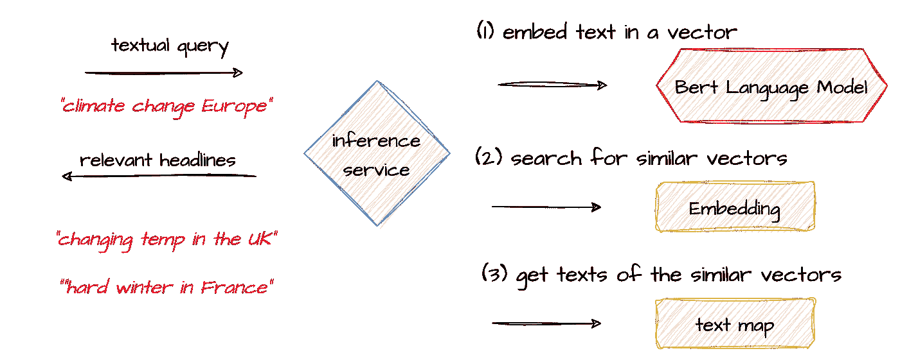

# 精简无服务器 ML 推理：释放 Candle 框架在 Rust 中的力量

> 原文：[`towardsdatascience.com/streamlining-serverless-ml-inference-unleashing-candle-frameworks-power-in-rust-c6775d558545?source=collection_archive---------4-----------------------#2023-12-21`](https://towardsdatascience.com/streamlining-serverless-ml-inference-unleashing-candle-frameworks-power-in-rust-c6775d558545?source=collection_archive---------4-----------------------#2023-12-21)

## 使用 Hugging Face 的新 Candle 框架构建一个精简且强大的模型服务层，用于向量嵌入和搜索

[](https://medium.com/@alon.agmon?source=post_page-----c6775d558545--------------------------------)[](https://towardsdatascience.com/?source=post_page-----c6775d558545--------------------------------) [Alon Agmon](https://medium.com/@alon.agmon?source=post_page-----c6775d558545--------------------------------)

·

[关注](https://medium.com/m/signin?actionUrl=https%3A%2F%2Fmedium.com%2F_%2Fsubscribe%2Fuser%2Fbcd1e3126cdc&operation=register&redirect=https%3A%2F%2Ftowardsdatascience.com%2Fstreamlining-serverless-ml-inference-unleashing-candle-frameworks-power-in-rust-c6775d558545&user=Alon+Agmon&userId=bcd1e3126cdc&source=post_page-bcd1e3126cdc----c6775d558545---------------------post_header-----------) 发表在 [Towards Data Science](https://towardsdatascience.com/?source=post_page-----c6775d558545--------------------------------) · 14 分钟阅读 · 2023 年 12 月 21 日 [](https://medium.com/m/signin?actionUrl=https%3A%2F%2Fmedium.com%2F_%2Fvote%2Ftowards-data-science%2Fc6775d558545&operation=register&redirect=https%3A%2F%2Ftowardsdatascience.com%2Fstreamlining-serverless-ml-inference-unleashing-candle-frameworks-power-in-rust-c6775d558545&user=Alon+Agmon&userId=bcd1e3126cdc&source=-----c6775d558545---------------------clap_footer-----------)

--

[](https://medium.com/m/signin?actionUrl=https%3A%2F%2Fmedium.com%2F_%2Fbookmark%2Fp%2Fc6775d558545&operation=register&redirect=https%3A%2F%2Ftowardsdatascience.com%2Fstreamlining-serverless-ml-inference-unleashing-candle-frameworks-power-in-rust-c6775d558545&source=-----c6775d558545---------------------bookmark_footer-----------)

图片由 [Clay Banks](https://unsplash.com/@claybanks?utm_source=medium&utm_medium=referral) 提供，发布于 [Unsplash](https://unsplash.com/?utm_source=medium&utm_medium=referral)

# 1\. 介绍

在过去十年中，AI 研究和工具的惊人进展催生了更准确、更可靠的机器学习模型，以及使将 AI 功能集成到现有应用程序中变得越来越简单的库和框架。

然而，在要求高的生产环境中，推理规模仍然是一个相当大的挑战。例如，假设我们有一个简单的搜索服务，它接收几个关键词，然后使用语言模型将其嵌入到向量中，并在某个向量数据库中搜索类似的文本或文档。这是一个相当流行的用例，也是 RAG 架构的核心部分，RAG 架构通常用于将生成型 AI 应用于特定领域的知识和数据。

从本身来看，这似乎是一个相对简单的实现用例。我们可以使用许多开源语言模型和模型中心，几行代码就可以用作嵌入模型。如果我们进一步假设需要存储和查询的向量数量相对适中（例如少于 1M），那么有很多简单的向量存储和搜索选项：从纯内存存储到数据库如 Postgres、Redis 或 Elastic。

但，如果我们的服务需要每秒处理数千或数十万的请求怎么办？如果我们需要在每个请求上保持相对较低的 — 毫秒级 — 延迟呢？如果我们需要快速扩展以应对请求的高峰怎么办？

尽管我们的使用案例确实相当简单，但规模和负载要求无疑使其成为一项挑战。可扩展的高吞吐量系统通常基于多个小而高效的二进制文件实例，这些实例可以快速启动、扩展并处理请求。在机器学习系统，尤其是深度学习的背景下，这带来了挑战，因为常见的库通常比较笨重，部分原因是大多数库是用 Python 实现的，而 Python 在要求高的环境中扩展性较差。

因此，面对这些挑战时，我们要么选择使用一些付费服务平台来处理规模问题，要么不得不使用多种技术创建自己的专用服务层。

针对这些挑战，Hugging Face 引入了[Candle](https://github.com/huggingface/candle)框架，它被描述为“一个注重性能和易用性的 Rust 轻量级 ML 框架”。Candle 使我们能够在 Rust 中构建稳健且轻量的模型推理服务，使用类似 torch 的 API。基于 Candle 的推理服务将能够轻松扩展、快速启动，并以极快的速度处理请求，使其更适合于旨在应对规模和弹性挑战的云原生无服务器环境。

本帖的目的是展示如何使用 Candle 框架实现之前描述的流行用例，从头到尾。我们将深入探讨基于 Candle 和 Axum（作为我们的 Web 框架）的相对简单但强大的向量嵌入和搜索 REST 服务实现。我们将使用一个特定的新闻头条数据集，但代码可以很容易扩展到任何文本数据集。

这将是一个非常实践和实用的帖子。第二部分展示了我们服务的主要设计或流程，以及我们将开发和使用的相关组件。第三部分聚焦于 Candle 框架，并展示如何使用 Bert 模型实现向量嵌入和搜索功能。第四部分展示了如何使用 Axum 将模型推断功能封装在 REST Web 服务中。第五部分解释了如何创建我们服务所需的实际嵌入和工件。第六部分总结。

# 2\. 高级服务设计

我将从我们要实现的推断服务的主要构建块开始。主要要求是创建一个 HTTP REST 端点，该端点将接收一个由几个关键字组成的文本查询，并响应与搜索查询最相似的前 5 条新闻头条。

对于这个任务，我们将使用*Bert*作为语言模型，因为它通常在文档嵌入任务中表现良好。在一个离线批处理过程中（将在第五部分中解释），我们将使用 Bert 来嵌入大约 20K 条新闻头条或文档，并为每个头条创建一个向量嵌入，服务将使用这些嵌入来搜索匹配项。嵌入和文本头条将被序列化为二进制格式，每个服务实例将加载这些格式以服务查询请求。



作者提供的图片

如上所示，在接收到带有搜索查询的请求后，服务将首先使用语言模型将搜索查询嵌入到一个向量中。接下来，它将搜索预加载的*embedding*以找到 N 个最相似的向量（每个向量代表一个新闻头条）。最后，它将使用最相似向量的索引通过*映射文件*提取它所代表的实际文本头条。

我们将通过创建一个名为*BertInferenceModel*的模块或 rust 库来实现这一点，该模块将提供主要功能：模型加载、句子嵌入和向量搜索。该模块将被一个使用 Axum Web 框架实现的 REST 服务使用。下一节将专注于实现该模块，而后续的部分将专注于 Web 服务本身。

请注意，接下来的部分包括许多代码示例，但为了清晰起见，它们仅展示了实现的主要功能。有关解决方案的完整实现，请参阅下面链接的配套 git 仓库。

# 3\. 使用 Candle 进行模型服务和嵌入

本节将重点介绍将作为 Candle 库 API 上的抽象层的模块的实现。我们将实现一个名为*BertInferenceModel*的结构体，该结构体包含三个主要功能：模型加载、推理（或句子嵌入）以及使用余弦相似度进行简单的向量搜索。

```py
pub struct BertInferenceModel {
    model: BertModel,
    tokenizer: Tokenizer,
    device: Device,
    embeddings: Tensor,
}
```

*BertInferenceModel* 将封装我们从 Hugging Face 仓库下载的 Bert 模型和分词器，并基本上包装它们的功能。

## **从 Hugging Face Hub 加载模型**

*BertInferenceModel* 将通过 *load()* 函数实例化，该函数将返回一个新实例的结构体，加载了相关模型和分词器，并准备进行推理任务。加载函数的参数包括我们希望加载的模型的名称和修订版（我们将使用 Bert 句子转换器）以及嵌入文件路径。

```py
 pub fn load(
        model_name: &str,
        revision: &str,
        embeddings_filename: &str,
        embeddings_key: &str,
    ) -> anyhow::Result<Self> {}
```

如下加载函数代码所示，加载模型涉及创建一个包含 Hugging Face 仓库相关属性的*Repo*结构体（例如名称和修订版），然后创建一个*API*结构体以实际连接到仓库并下载相关文件（用于创建模型的模型权重使用 HuggingFace 的 safetensors 格式表示）。

*api.get*函数返回相关文件的本地名称（无论是下载的还是仅从缓存中读取的）。文件将只下载一次，而随后的*api.get*调用将仅使用缓存版本。我们使用分词器配置文件实例化一个分词器结构体，并使用权重文件（以 safetensors 格式）和配置文件来构建我们的模型。

在加载了模型和分词器之后，我们最终可以加载实际的嵌入文件，用于搜索匹配项。我将稍后展示如何使用相同的模型生成嵌入文件，然后将其序列化为文件。使用 HuggingFace 的 safetensors 模块将嵌入加载为 Tensor 相对简单，我们只需要文件名和保存 Tensor 时给予的密钥。

现在我们已经加载了模型和分词器，并且内存中有了嵌入向量，我们完成了对返回给调用函数的 *BertInferenceModel* 的初始化，可以继续实现推理方法。

## **句子推理和嵌入**

推理函数也相当简单。我们首先使用加载的分词器对句子进行编码（第 5 行）。*encode()*函数返回一个 Encoding 结构体，该结构体具有一个 *get_ids()* 函数，返回一个数组或句子中单词的数值表示。接下来，我们将令牌 ID 数组包装在一个 Tensor 中，以便将其输入到我们的嵌入模型中，并使用模型的前向函数获取表示句子的嵌入向量（第 10 行）。

我们从嵌入模型中在第 12 行得到的向量维度是[128, 384]。这是因为 Bert 用大小为 384 的向量表示每个标记或词，且句子向量的最大输入长度为 128（因为我们的输入只有几个单词，所以大部分是填充）。换句话说，除了填充和其他指令标记外，我们基本上获得了每个标记或词的大小为 384 的向量。

接下来，我们需要将句子向量从大小为[128, 384]的张量压缩成一个大小为[1, 384]的单一向量，该向量将代表或捕捉句子的“精髓”，以便我们可以将其与嵌入中的其他句子进行匹配，并找到与之相似的句子。为此，并且部分因为我们处理的输入是短关键字而不是长句子，我们将使用最大池化，它本质上通过取给定张量每个维度的最大值来创建一个新向量，以捕捉每个维度中最显著的特征。正如您在下方看到的，这使用 Candle 的 API 实现起来相当简单。最后，我们使用 L2 归一化以避免偏差，并通过确保所有向量具有相同的幅度来改善余弦相似性度量。您可以在下方看到池化和归一化函数的实际实现。

## **测量向量相似性**

尽管这与 Candle 库没有直接关系，但我们的模块也将提供一个向量搜索实用方法，该方法将接收一个向量并利用其内部嵌入以返回最相似向量的索引。

这实现得相当简单：我们首先创建一个元组集合（第 7 行），其中元组的第一个成员将表示相关文本的索引，第二个成员将表示余弦相似性评分。然后，我们遍历所有索引，测量每个与我们需要匹配的给定向量之间的余弦相似性。最后，我们将（索引，相似性评分）的元组添加到集合中，对其进行排序，并返回前 N 个请求的结果。

# 4\. 嵌入和搜索 Web 服务

现在我们有了一个封装主要模型功能的结构体，我们需要将其封装在一个 REST 服务中。我们将创建一个 REST 端点，包含一个 POST 路由，该路由将接收 JSON 有效负载中的几个关键字，并返回在预加载嵌入中的最相似向量的索引。根据请求，服务将把关键字嵌入到一个向量中，搜索其内存中嵌入的相似性，并返回最相似向量的索引。该服务将使用索引在文本映射文件中找到相应的标题。

我们将使用优秀的 Axum web 框架来实现这个服务。相关代码大部分是典型的 Axum 模板代码，所以我不会详细讲解如何使用 Axum 创建 REST 端点。与许多 web 框架一样，构建 REST 端点通常涉及创建一个 Router 并在某个路由上注册一个处理函数来处理请求。然而，ML 模型服务层具有额外的复杂性，即管理模型本身的状态和持久性。模型加载可能在性能上很昂贵，因为它涉及加载模型文件的 IO 操作（无论是从 Hugging Face 的仓库还是本地）。同样，我们需要找到一种方法来缓存和重用模型以应对多个请求。

为了满足这些要求，Axum 提供了应用状态功能，我们可以用来初始化和持久化任何我们想要注入到每个请求上下文中的资产。首先让我们逐行查看服务的整个初始化代码，看看它是如何工作的。

每个服务实例都会创建并加载一个模型包装器，然后缓存它以供每个接收到的请求重用。在第 3 行，我们通过调用*load()*函数来创建模型包装器，以引导并加载模型。除了从 HF 加载的 Bert 模型的名称和版本，我们还需要指定嵌入文件的位置，该文件被加载到内存中以便搜索相似的向量，以及在创建嵌入时使用的密钥。

除了实际的模型，我们还需要缓存映射文件以供每个请求重用。服务在使用模型嵌入关键词后，会在其嵌入文件中搜索最相似的向量，然后返回它们的索引。服务接着使用映射文件提取与最相似向量的索引对应的实际文本。在更稳健的生产系统中，服务会从某个快速访问的数据库中获取实际文本，但在我们的案例中，从存储在文件中的预加载字符串列表中读取就足够了。在第 10 行，我们加载了之前保存为二进制文件的列表。

现在我们有两个需要缓存和重用的资产——模型（包装器）和映射文件。Axum 使我们能够使用*Arc*，即线程安全的引用计数指针，每个请求都会共享。正如第 15 行所示，我们在包含模型包装器和映射文件的元组周围创建了一个新的 Arc。在第 17–19 行，我们创建了一个新的 HTTP 路由来处理每个请求的函数。

```py
 let shared_state = 
      Arc::new((bert_model, text_map));

   let app = Router::new()
        .route("/similar", post(find_similar))
        .with_state(shared_state);
```

为了缓存元组并使其对每个请求可用，我们使用*with_state(state)*函数将其注入到相关的请求上下文中。我们来看看具体是如何操作的。

## **处理请求**

我们的服务将处理 HTTP POST 请求，这些请求包含以下有效负载，这些有效负载包括关键词和我们想要接收的相似向量或标题的数量。

```py
{
    "text": "europe climate change storm",
    "num_results":5
}
```

我们将实现处理函数的相应请求和响应结构体，Axum 将在需要时处理序列化和反序列化。

```py
#[derive(Deserialize)]
struct ReqPayload {
    keywords: String,
    num_results: u32,
}

#[derive(Serialize)]
struct ResPayload {
    text: Vec<String>,
}
```

接下来，我们可以进入处理函数本身。处理函数将接受 2 个参数：我们之前初始化的应用程序状态（Axum 将负责将其注入到每个函数调用中），以及我们之前定义的请求结构体。

处理每个请求将包括 4 个主要阶段，这些阶段现在应该已经很清楚了。在第 5 行，我们首先提取一个指向状态元组的引用，该元组持有对模型和映射文件的引用。在第 6 行，我们使用模型将关键词嵌入到一个向量中。接下来，在第 9 行，我们搜索 N 个最相似的向量。*score_vector_similarity()*函数返回一个由元组组成的向量，每个元组包含一个索引和余弦相似度分数。最后，我们遍历这些索引元组，从映射文件中提取对应索引的字符串，并将其封装到响应有效负载结构中。

然后……我们就可以开始了！虽然这可能并没有具体说明太多，但我在我的 Mac 上进行了测试，使用了大约 20K 向量的嵌入，并获得了 100ms 的良好平均响应时间。对于基于 Bert 的向量嵌入和向量搜索来说，这算是不坏。

```py
curl -s -w "\\nTotal time: %{time_total}s\\n" \ 
 -X POST http://localhost:3000/similar \
 -H "Content-Type: application/json" \
 -d '{"text": "self driving cars navigation", "num_results": 3}' | jq
{
  "text": [
    "Item:Stereo Acoustic Perception ... (index: 8441 score:0.8516491)",
    "Item:Vision-based Navigation of ... (index: 7253 score:0.85097575)",
    "Item:Learning On-Road Visual .....  (index: 30670 score:0.8500275)"
  ]
}

Total time: 0.091665s
```

（这个示例是使用在 Arxiv 论文摘要数据集上生成的嵌入创建的。实际数据集可以在[这里](https://www.kaggle.com/datasets/spsayakpaul/arxiv-paper-abstracts/)以公共领域许可证获取。）

# 5\. 生成嵌入

在我们结束之前，还有一个最后的组件需要覆盖。到目前为止，我们假设了一个嵌入文件的存在，在其中我们搜索相似的向量。然而，我还没有解释如何创建嵌入文件本身。

请记住，在上一节中创建的结构体*— BertInferenceModel*，已经包含了一个将一组关键词嵌入到向量中的函数。当我们创建一个需要嵌入*多个*关键词集的函数时，我们只需将它们作为批量处理即可。

我们使用*BertInferenceModel*的主要区别在于使用 tokenizer 的*encode_batch*函数而不是*encode*，前者接受一个字符串向量而不是单个字符串。然后，我们将所有向量堆叠成一个单一的张量，并将其输入到模型的*forward()*函数中，就像我们处理单个向量嵌入时一样（你可以在下面链接的辅助仓库中查看函数的完整源代码）。

一旦我们拥有能够嵌入多个字符串的函数，嵌入生成器本身就相当简单。它使用 rayon crate 来并行处理文本文件的嵌入，然后将结果堆叠在一起，创建一个单一的张量。最后，它使用 safetensors 格式将嵌入写入磁盘。嵌入是这个管道中的重要资产，因为它需要被复制到每个服务实例。

现在我们可以得出结论 :-)

# 6\. 结论

在机器学习工程中，最大的挑战之一是大规模推断。人工智能绝非轻量级，因此，扩展推断工作负载往往是一项非常昂贵或过度设计的痛苦挑战。这正是 Hugging Face 的 Candle 库试图解决的难题。它使用类似 Torch 的 Rust API，使我们能够创建一个精简且快速的模型服务层，能够轻松扩展并在无服务器环境中运行。

在这篇文章中，我展示了如何使用 Candle 创建一个端到端的模型推断层，能够处理向量嵌入和搜索请求。我解释了如何将 Bert / sentence transformers 模型包装成一个内存占用小的库，并在基于 Axum 的 REST 服务中使用它。

Hugging Face 的 Candle 库的真正价值在于其能够弥合强大机器学习能力与高效资源利用之间的差距。通过利用 Rust 的性能和安全特性，Candle 为更可持续和成本效益高的机器学习解决方案铺平了道路。这对那些希望在不增加开销的情况下大规模部署 AI 的组织特别有利。我希望借助 Candle，我们将看到一波不仅性能高效，而且更轻量且适应各种环境的机器学习应用。

一些关于 Candle 的资源

+   [`github.com/huggingface/candle`](https://github.com/huggingface/candle)

+   [`medium.com/@Aaron0928/hugging-face-has-written-a-new-ml-framework-in-rust-now-open-sourced-1afea2113410`](https://medium.com/@Aaron0928/hugging-face-has-written-a-new-ml-framework-in-rust-now-open-sourced-1afea2113410)

+   [`pub.towardsai.net/candle-and-falcon-a-guide-to-large-language-models-in-rust-3f0a4369df03`](https://pub.towardsai.net/candle-and-falcon-a-guide-to-large-language-models-in-rust-3f0a4369df03)

本文的所有源代码可以在我的 GitHub 仓库中找到 [这里](https://github.com/a-agmon/candle_demo_1-1)
