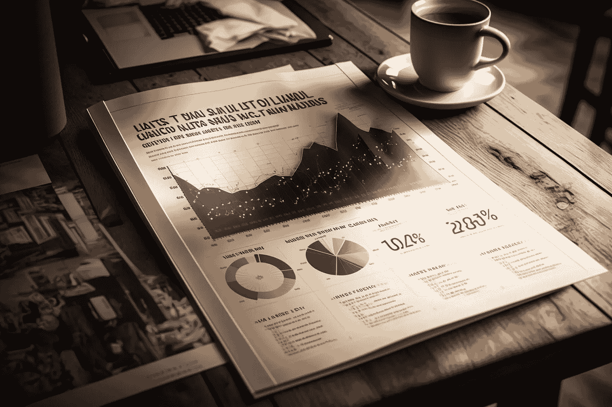

# Streamlit 教程：为数据科学项目创建 Word 报告

> 原文：[`towardsdatascience.com/streamlit-tutorial-creating-word-reports-for-data-science-projects-96a749483cb3?source=collection_archive---------9-----------------------#2023-04-17`](https://towardsdatascience.com/streamlit-tutorial-creating-word-reports-for-data-science-projects-96a749483cb3?source=collection_archive---------9-----------------------#2023-04-17)

## 结合 python-docx 和 Streamlit 进行数据科学报告自动化

 [Andy McDonald](https://andymcdonaldgeo.medium.com/?source=post_page-----96a749483cb3--------------------------------)

·

[关注](https://medium.com/m/signin?actionUrl=https%3A%2F%2Fmedium.com%2F_%2Fsubscribe%2Fuser%2F9c280f85f15c&operation=register&redirect=https%3A%2F%2Ftowardsdatascience.com%2Fstreamlit-tutorial-creating-word-reports-for-data-science-projects-96a749483cb3&user=Andy+McDonald&userId=9c280f85f15c&source=post_page-9c280f85f15c----96a749483cb3---------------------post_header-----------) 发表在 [Towards Data Science](https://towardsdatascience.com/?source=post_page-----96a749483cb3--------------------------------) ·12 分钟阅读·2023 年 4 月 17 日

--

报告图像由作者使用 Midjourney Basic Plan 生成。

在与数据相关的项目结束时，无论是石油物理学还是数据科学，创建报告都是非常常见的。生成的报告向客户和最终用户提供了研究过程中获得的关键结果和结论的信息，并详细说明了使用的方法论。

然而，创建结构化报告可能是一个繁琐且耗时的过程，特别是在确保报告格式正确且数据以最佳方式呈现时。

本文将展示如何使用流行的[Streamlit](https://streamlit.io/)库，结合[python-docx](https://python-docx.readthedocs.io/en/latest/)库，来实现自动化报告过程的第一步。

[python-docx](https://python-docx.readthedocs.io/en/latest/)库将使我们能够创建一个 Microsoft Word 报告。拥有这种格式的报告将使我们在将其转换为 PDF 之前进行编辑和润色。

尽管本文中的示例大部分需要手动输入，但可以调整以利用大型语言模型的力量来总结数据并生成所需文本。
