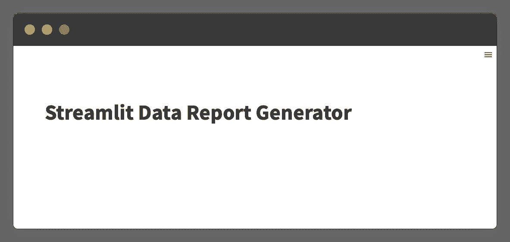

# Streamlit 教程：为数据科学项目创建 Word 报告

> 原文：[`towardsdatascience.com/streamlit-tutorial-creating-word-reports-for-data-science-projects-96a749483cb3`](https://towardsdatascience.com/streamlit-tutorial-creating-word-reports-for-data-science-projects-96a749483cb3)

## 将 python-docx 和 Streamlit 结合用于数据科学报告自动化

[](https://andymcdonaldgeo.medium.com/?source=post_page-----96a749483cb3--------------------------------)[](https://towardsdatascience.com/?source=post_page-----96a749483cb3--------------------------------) [Andy McDonald](https://andymcdonaldgeo.medium.com/?source=post_page-----96a749483cb3--------------------------------)

·发表于[Towards Data Science](https://towardsdatascience.com/?source=post_page-----96a749483cb3--------------------------------) ·12 分钟阅读·2023 年 4 月 17 日

--


报告图像由作者使用 Midjourney 基础计划生成。

在数据相关项目的结束阶段，无论是石油物理学还是数据科学，创建报告是非常常见的。生成的报告为客户和最终用户提供了在研究过程中获得的关键结果和结论的信息，并详细说明了使用的方法。

然而，创建结构化报告可能是一个繁琐且耗时的过程，特别是在确保报告格式正确和数据以最佳方式呈现时。

本文将展示我们如何使用流行的[Streamlit](https://streamlit.io/)库，结合[python-docx](https://python-docx.readthedocs.io/en/latest/)，来创建自动化报告过程的第一步。

[python-docx](https://python-docx.readthedocs.io/en/latest/)库将允许我们创建一个 Microsoft Word 报告。将报告以这种格式呈现将使我们能够进行编辑，并在转换为 PDF 之前完成最后的润色。

尽管本文中的示例需要主要的手动输入，但它可以适应大语言模型的强大功能，以总结数据并创建所需的文本。

让我们开始构建一个 Streamlit Word 文档报告生成器吧。

# 导入库和数据

首先，我们将导入我们要使用的主要库。这些库包括[Streamlit](https://streamlit.io/)、[pandas](https://pandas.pydata.org/)、[matplotlib](https://matplotlib.org/)和[python-docx](https://python-docx.readthedocs.io/en/latest/)。

```py
import streamlit as st
import pandas as pd
import matplotlib.pyplot as plt
import docx
```

接下来，我们将设置 Streamlit 页面布局为宽幅。这使得应用程序能够占据浏览器窗口的整个宽度，而不是位于中间的窄列中。

```py
st.set_page_config(layout='wide')
```

# 设置 Streamlit 用户界面（UI）

现在我们可以开始构建用户界面（UI）。

我们将从为我们的应用程序添加标题开始。

```py
st.title('Streamlit Data Report Generator')
```



报告生成器的起始点。图片来源：作者。

为了简化操作，我们将使用 `pd.read_csv()` 预加载我们的数据并传入一个文件名。

```py
df = pd.read_csv('Xeek_Well_15-9-15.csv')
```

本教程使用的数据集是 [**Xeek 和 FORCE 2020 举办的机器学习竞赛**](https://doi.org/10.5281/zenodo.4351156)（Bormann 等，2020）中的一个子集。该数据集在 Creative Commons Attribution 4.0 International 许可证下授权。

为了使应用程序更具灵活性，我们可以添加一个文件上传器，允许用户加载他们自己的数据。

你可以在我的文章 [**上传和读取 Streamlit 文件**](https://medium.com/@andymcdonaldgeo/uploading-and-reading-files-with-streamlit-92885ac3a1b6) 中了解更多关于如何做到这一点的信息。

## 使用 st.form 创建报告表单

当小部件包含在 Streamlit 应用程序中时，每次编辑或选择它们时，Streamlit 应用程序都会重新运行。为了防止这种情况，我们可以创建一个表单。

这将允许我们输入值，应用程序只会在按下按钮时运行。

我们可以使用 `with st.form('report')` 创建一个表单，然后添加我们想要的输入。


带有报告详细部分的 Streamlit 报告生成器。图片来源：作者。

我们将使用应用程序的上部来创建报告元数据。这包括报告的标题、作者、客户以及报告的日期。

这些元素中的每一个都与来自 Streamlit 的用户输入小部件相关联。

```py
 report_title = col1.text_input("Enter report title")
    report_author = col1.text_input("Enter the report author's name")
    report_date = col2.date_input("Select a date for the report")
    report_client = col2.text_input("Enter the client's name")
```

为了显示表单，我们需要添加一个提交按钮。使用 `st.form_submit_button()` 可以完成这一点。在这里，我们可以传递一个将出现在按钮上的标签。

```py
if st.form_submit_button('Generate'):
        generate_report(report_title)
```

在此之下，我放置了一个 `generate_report` 函数调用，我们将很快创建这个函数。目前，这将作为一个占位符。

这是目前表单的代码。

```py
with st.form('report'):
    st.write("### Report Details")
    col1, col2 = st.columns(2, gap='large')

    report_title = col1.text_input("Enter report title")
    report_author = col1.text_input("Enter the report author's name")
    report_date = col2.date_input("Select a date for the report")
    report_client = col2.text_input("Enter the client's name")

    if st.form_submit_button('Generate'):
        generate_report(report_title)
```

## 在 Streamlit 表单中创建报告部分

报告通常由多个部分或章节组成。

为了说明如何在我们的应用程序中创建一个非常简单的部分，我们将添加一些输入，让用户输入部分标题和摘要。


带有部分输入框的 Streamlit 报告生成器。图片来源：作者。

在上图中，我添加了两个新的输入小部件。

一个部分标题，这是一个简单的文本输入（`st.text_input`），和该部分的摘要，这是一个文本区域（`st.text_area`）。

此外，我创建了两个新的列，以将它们与上面的列分开。如果我们想在这些表单部分之间添加任何全宽的文本/信息，这一点非常重要。

这是我们目前的表单代码：

```py
with st.form('report'):
    st.write("### Report Details")
    col1, col2 = st.columns(2, gap='large')

    report_title = col1.text_input("Enter report title")
    report_author = col1.text_input("Enter the report author's name")
    report_date = col2.date_input("Select a date for the report")
    report_client = col2.text_input("Enter the client's name")

    sect_col1, sect_col2 = st.columns(2, gap='large')

    sect_col1.write("### Section Details")
    section_title = sect_col1.text_input("Enter section title")
    section_text_summary = sect_col1.text_area("Section Summary")
```

我们可以扩展此功能，以便用户可以添加多个部分。每个部分都可以被编码为在新页面上开始，使用分页符。

此外，为了使其更全面，我们可以在应用程序中生成报告的预览。

可能性非常多！

## 在 Word 文档中包含数据框使用 docx

表格在报告中至关重要，因为它们有助于以清晰、简单和有组织的方式展示信息。这使读者能够快速理解数据，并将其与同一或不同表中的其他数据值/类别进行比较。

为了说明在报告中包含一个表格，我们可以使用 pandas `describe()` 函数生成的统计摘要作为示例。

在 UI 中，我们可以添加一个多选选项，允许用户从数据框中选择列。如果我们有许多列且只对其中一些感兴趣，这将特别方便。


Streamlit 报告生成器允许用户从数据框中选择列。图片由作者提供。

在创建多选条目框之前，我们首先需要从数据框中获取列名，这可以通过创建一个新变量并将其分配给 `df.columns` 来完成。

然后我们使用 `st.multiselect()` 创建多选框。由于我们在处理列，因此需要调用所需的列。在这种情况下，是 `sect_col2`。

```py
with st.form('report'):
    st.write("### Report Details")
    col1, col2 = st.columns(2, gap='large')

    report_title = col1.text_input("Enter report title")
    report_author = col1.text_input("Enter the report author's name")
    report_date = col2.date_input("Select a date for the report")
    report_client = col2.text_input("Enter the client's name")

    sect_col1, sect_col2 = st.columns(2, gap='large')

    sect_col1.write("### Section Details")
    section_title = sect_col1.text_input("Enter section title")
    section_text_summary = sect_col1.text_area("Section Summary")

    data_features = df.columns

    sect_col2.write("### Data Summary")
    data_to_summarise = sect_col2.multiselect("Select features to include in statistical summary", 
                                              options=data_features)

    if st.form_submit_button('Generate'):
        generate_report(report_title)
```

接下来，我们需要创建两个函数。

第一个函数将获取我们感兴趣的特征和数据框，并生成数据的统计摘要。

```py
def create_df_stats_summary(dataframe, features_to_include):
    sub_df = dataframe[features_to_include].copy()
    return sub_df.describe()
```

第二个函数要复杂一些。

由于 python-docx 不原生支持数据框，我们需要使用 docx 创建一个表格，如下所示：

```py
def add_df_to_docx(doc, dataframe):
    # Reset the index and get the new shape
    dataframe = dataframe.reset_index()
    num_rows, num_cols = dataframe.shape

    # Add a table to the document with the necessary number 
    # of rows and columns
    table = doc.add_table(rows=num_rows + 1, cols=num_cols)

    # Add the header row
    for i, col in enumerate(dataframe.columns):
        table.cell(0, i).text = str(col)

    # Add the data rows
    for i, row in dataframe.iterrows():
        for j, value in enumerate(row):
            table.cell(i + 1, j).text = str(value)

    return table
```

当按钮被按下时，我们将调用这些函数。

## 将图表添加到 Word 文档

图表是报告的另一个重要部分。它们使我们能够简明扼要地传达大量数据。

为了说明在最终 Word 文档中创建和包含图表，我们将允许用户从数据集中选择三列。然后，这些将用于创建一个散点图，并添加到报告中。


在包括散点图选项后，Streamlit 报告生成器。图片由作者提供。

如上图所示，我们将在前面两个部分下方添加三个选择框。这些将添加到三个新列中，并使用 Streamlit 的 `selectbox()` 创建。

```py
with st.form('report'):
    st.write("### Report Details")
    col1, col2 = st.columns(2, gap='large')

    report_title = col1.text_input("Enter report title")
    report_author = col1.text_input("Enter the report author's name")
    report_date = col2.date_input("Select a date for the report")
    report_client = col2.text_input("Enter the client's name")

    sect_col1, sect_col2 = st.columns(2, gap='large')

    sect_col1.write("### Section Details")
    section_title = sect_col1.text_input("Enter section title")
    section_text_summary = sect_col1.text_area("Section Summary")

    data_features = df.columns

    sect_col2.write("### Data Summary")
    data_to_summarise = sect_col2.multiselect("Select features to include in statistical summary", 
                                              options=data_features)

    st.write("### Scatterplot Setup")
    sub_col1, sub_col2, sub_col3 = st.columns(3)

    chart_x = sub_col1.selectbox('X axis', options=data_features)
    chart_y = sub_col2.selectbox('Y axis', options=data_features)
    chart_z = sub_col3.selectbox('Z axis', options=data_features)

    if st.form_submit_button('Generate'):
        generate_report(report_title)
```

然后我们将创建一个新的函数，称为 `create_scatterplot`，用于生成我们的图形。

我们将设置我们的函数以接受多个参数：

+   `dataframe`：包含数据的数据框对象

+   `xaxis`：要在 x 轴上绘制的特征

+   `yaxis`：要在 y 轴上绘制的特征

+   `colour`：用于为数据点上色的特征

+   `plot_name`：我们图表的名称。这将用作文件名

+   `xaxis_scale`：一个包含两个元素的列表，用于定义 x 轴的最小值和最大值范围

+   `yaxis_scale`：一个包含两个元素的列表，用于定义 y 轴的最小值和最大值范围

默认情况下，`xaxis_scale` 和 `yaxis_scale` 都会设置为 `None`。如果用户没有提供这些，matplotlib 将使用数据绘制的最小值和最大值作为轴的范围。

Python-docx 本身不支持 matplotlib 图形。作为一种解决方法，我们需要将我们的图保存为文件，然后在开始写入 Word 文档时使用。

```py
def create_scatterplot(dataframe, xaxis, yaxis, colour, plot_name,
                       xaxis_scale= None, yaxis_scale=None):
    fig, ax = plt.subplots()

    ax.scatter(dataframe[xaxis], dataframe[yaxis],
                c=dataframe[colour], cmap='viridis')

    ax.set_xlabel(xaxis)
    ax.set_ylabel(yaxis)

    if xaxis_scale is not None:
        ax.set_xlim(xmin=xaxis_scale[0], xmax=xaxis_scale[1])

    if yaxis_scale is not None:
        ax.set_ylim(ymin=yaxis_scale[0], ymax=yaxis_scale[1])

    filename = f'{plot_name}.png'
    plt.savefig(filename)
```

## 向 Streamlit UI 添加分隔水平线

为了帮助分隔 UI 并使每个部分突出显示，我们可以使用 `st.write('---')` 添加水平线。

这将从 Markdown 语言转换为实际的行。

如果你想了解更多关于 `st.write` 函数的信息，可以查看：[**如何使用 Streamlit 的 st.write 函数来改善你的 Streamlit 仪表板。**](https://medium.com/p/1586333eb24d)

我们的最终代码如下：

```py
with st.form('report'):
    st.write("### Report Details")
    col1, col2 = st.columns(2, gap='large')

    report_title = col1.text_input("Enter report title")
    report_author = col1.text_input("Enter the report author's name")
    report_date = col2.date_input("Select a date for the report")
    report_client = col2.text_input("Enter the client's name")

    st.write("---")
    sect_col1, sect_col2 = st.columns(2, gap='large')

    sect_col1.write("### Section Details")
    section_title = sect_col1.text_input("Enter section title")
    section_text_summary = sect_col1.text_area("Section Summary")

    data_features = df.columns

    sect_col2.write("### Data Summary")
    data_to_summarise = sect_col2.multiselect("Select features to include in statistical summary", 
                                              options=data_features)

    st.write("---")

    st.write("### Scatterplot Setup")
    sub_col1, sub_col2, sub_col3 = st.columns(3)

    chart_x = sub_col1.selectbox('X axis', options=data_features)
    chart_y = sub_col2.selectbox('Y axis', options=data_features)
    chart_z = sub_col3.selectbox('Z axis', options=data_features)

    if st.form_submit_button('Generate'):
        generate_report(report_title)
```

# 创建 Word 报告生成函数

我们的最后一步是创建 `generate_report` 函数。

这个函数将接收我们从用户那里收集的所有内容，然后将其写入我们的 Word 文档中。

如下代码所示，我们首先需要创建我们的 docx 对象，通过调用 `docx.Document()` 来完成。

然后，我们开始使用标题和段落的组合来创建报告的每个部分。其中一些利用 f-strings，以便我们可以将文本与输入变量结合起来。

接着，我们将添加之前创建的散点图，这可以通过 `doc.add_picture()` 完成。

最后一部分包含我们的 dataframe 统计摘要，它调用 `add_df_to_docx` 函数。

最后，我们将报告保存到 `docx` 文件中。

```py
def generate_report(report_title, report_author, report_date, report_client,
                    section_title=None, 
                    section_text_summary=None, 
                    data_stats_summary=None, 
                    graph_figure=None):

    doc = docx.Document()

    # Add Title Page followed by section summary
    doc.add_heading(report_title, 0)
    doc.add_paragraph(f'Authored By: {report_author}')
    doc.add_paragraph(f'Created On: {str(report_date)}')
    doc.add_paragraph(f'Created For: {report_client}')
    doc.add_heading(section_title, 1)
    doc.add_paragraph(section_text_summary)

    # Add Scatter plot
    doc.add_heading('Data Visualisation', 2)
    doc.add_picture(graph_figure)

    # Add dataframe summary
    doc.add_heading('Data Summary', 2)
    summary_table = add_df_to_docx(doc, data_stats_summary)
    summary_table.style = 'LightShading-Accent1'

    doc.save('report.docx')

    return st.info('Report Generated')
```

一旦写入函数创建完毕，我们就可以填充用户点击生成按钮时的操作。

首先，我们需要调用 `summary_stats` 和 `scatter_plot_file` 函数。这些函数的结果将被传递到 `generate_report` 函数中。

```py
 if st.form_submit_button('Generate'):
        summary_stats = create_df_stats_summary(df, data_to_summarise)
        scatter_plot_file = create_scatterplot(df, chart_x, chart_y, chart_z, 
                                               plot_name='scatter', yaxis_scale=[3,1], )

        generate_report(report_title, report_author, report_date, report_client, 
                        section_title, section_text_summary, summary_stats,
                        graph_figure='scatter.png')
```

当我们查看我们的应用时，可以填写输入框中的所需信息并点击生成。


Streamlit Word 报告生成器的最终视图。图像由作者提供。

这将创建我们下面看到的 Word 文档。


从 Streamlit 应用生成的报告的第一页。图像由作者提供。


从 Streamlit 应用生成的报告的第二页。图像由作者提供。

# 摘要

创建报告是任何数据科学或岩石物理工作流程中的关键部分。然而，创建这些报告往往是耗时且繁琐的。

结合使用 Streamlit 创建用户界面和 docx 创建 Word 文档，我们可以帮助减少报告生成的负担，并开始自动化这一过程。

随着大型语言模型（LLMs）的到来，我们可能将这些模型集成到此应用中，以进一步提升其功能，并将自动化提升到一个新的水平。

# 参考文献

Bormann, Peter, Aursand, Peder, Dilib, Fahad, Manral, Surrender, & Dischington, Peter. (2020). FORCE 2020 Well well log and lithofacies dataset for machine learning competition [数据集]. Zenodo. [`doi.org/10.5281/zenodo.4351156`](https://doi.org/10.5281/zenodo.4351156)

# Streamlit Word 文档报告生成器的完整代码

以下是生成 Word 报告的 Streamlit 应用的完整代码：

```py
import streamlit as st
import pandas as pd
import matplotlib.pyplot as plt
import docx

st.set_page_config(layout='wide')

def create_df_stats_summary(dataframe, features_to_include):
    sub_df = dataframe[features_to_include].copy()
    return sub_df.describe()

def create_scatterplot(dataframe, xaxis, yaxis, colour, plot_name,
                       xaxis_scale= None, yaxis_scale=None):
    fig, ax = plt.subplots()

    ax.scatter(dataframe[xaxis], dataframe[yaxis],
                c=dataframe[colour], cmap='viridis')

    ax.set_xlabel(xaxis)
    ax.set_ylabel(yaxis)

    if xaxis_scale is not None:
        ax.set_xlim(xmin=xaxis_scale[0], xmax=xaxis_scale[1])

    if yaxis_scale is not None:
        ax.set_ylim(ymin=yaxis_scale[0], ymax=yaxis_scale[1])

    filename = f'{plot_name}.png'
    plt.savefig(filename)

def add_df_to_docx(doc, dataframe):
    # Reset the index and get the new shape
    dataframe = dataframe.reset_index()
    num_rows, num_cols = dataframe.shape

    # Add a table to the document with the necessary number 
    # of rows and columns
    table = doc.add_table(rows=num_rows + 1, cols=num_cols)

    # Add the header row
    for i, col in enumerate(dataframe.columns):
        table.cell(0, i).text = str(col)

    # Add the data rows
    for i, row in dataframe.iterrows():
        for j, value in enumerate(row):
            table.cell(i + 1, j).text = str(value)

    return table

def generate_report(report_title, report_author, report_date, report_client,
                    section_title=None, 
                    section_text_summary=None, 
                    data_stats_summary=None, 
                    graph_figure=None):

    doc = docx.Document()

    # Add Title Page followed by section summary
    doc.add_heading(report_title, 0)
    doc.add_paragraph(f'Authored By: {report_author}')
    doc.add_paragraph(f'Created On: {str(report_date)}')
    doc.add_paragraph(f'Created For: {report_client}')
    doc.add_heading(section_title, 1)
    doc.add_paragraph(section_text_summary)

    # Add Scatter plot
    doc.add_heading('Data Visualisation', 2)
    doc.add_picture(graph_figure)

    # Add dataframe summary
    doc.add_heading('Data Summary', 2)
    summary_table = add_df_to_docx(doc, data_stats_summary)
    summary_table.style = 'LightShading-Accent1'

    doc.save('report.docx')

    return st.info('Report Generated')

st.title('Streamlit Data Report Generator')
df = pd.read_csv('Xeek_Well_15-9-15.csv')

with st.form('report'):
    st.write("### Report Details")
    col1, col2 = st.columns(2, gap='large')

    # Setup the title and associated data
    report_title = col1.text_input("Enter report title")
    report_author = col1.text_input("Enter the report author's name")
    report_date = col2.date_input("Select a date for the report")
    report_client = col2.text_input("Enter the client's name")

    st.write("---")
    sect_col1, sect_col2 = st.columns(2, gap='large')

    # Setup the first report section and associated data
    sect_col1.write("### Section Details")
    section_title = sect_col1.text_input("Enter section title")
    section_text_summary = sect_col1.text_area("Section Summary")

    data_features = df.columns

    sect_col2.write("### Data Summary")
    data_to_summarise = sect_col2.multiselect("Select features to include in statistical summary", 
                                              options=data_features)

    st.write("---")

    st.write("### Scatterplot Setup")
    sub_col1, sub_col2, sub_col3 = st.columns(3)

    chart_x = sub_col1.selectbox('X axis', options=data_features)
    chart_y = sub_col2.selectbox('Y axis', options=data_features)
    chart_z = sub_col3.selectbox('Z axis', options=data_features)

    if st.form_submit_button('Generate'):
        summary_stats = create_df_stats_summary(df, data_to_summarise)
        scatter_plot_file = create_scatterplot(df, chart_x, chart_y, chart_z, 
                                               plot_name='scatter', yaxis_scale=[3,1], )

        generate_report(report_title, report_author, report_date, report_client, 
                        section_title, section_text_summary, summary_stats,
                        graph_figure='scatter.png')
```

*感谢阅读。在你离开之前，你应该订阅我的内容，将我的文章直接送到你的邮箱。* [***你可以在这里操作！***](https://andymcdonaldgeo.medium.com/subscribe)*或者，你也可以* [***注册我的通讯***](https://fabulous-founder-2965.ck.page/2ca286e572) *以获取额外内容，直接免费送到你的邮箱。*

*其次，通过注册会员，你可以获得完整的 Medium 体验，并支持我和其他成千上万的作家。每月仅需 $5，你可以完全访问所有精彩的 Medium 文章，还可以通过写作赚钱。*

*如果你通过* [***我的链接***](https://andymcdonaldgeo.medium.com/membership)***注册，*** *你将直接用你的一部分费用支持我，并且不会额外增加你的费用。如果你这么做了，非常感谢你的支持。*
