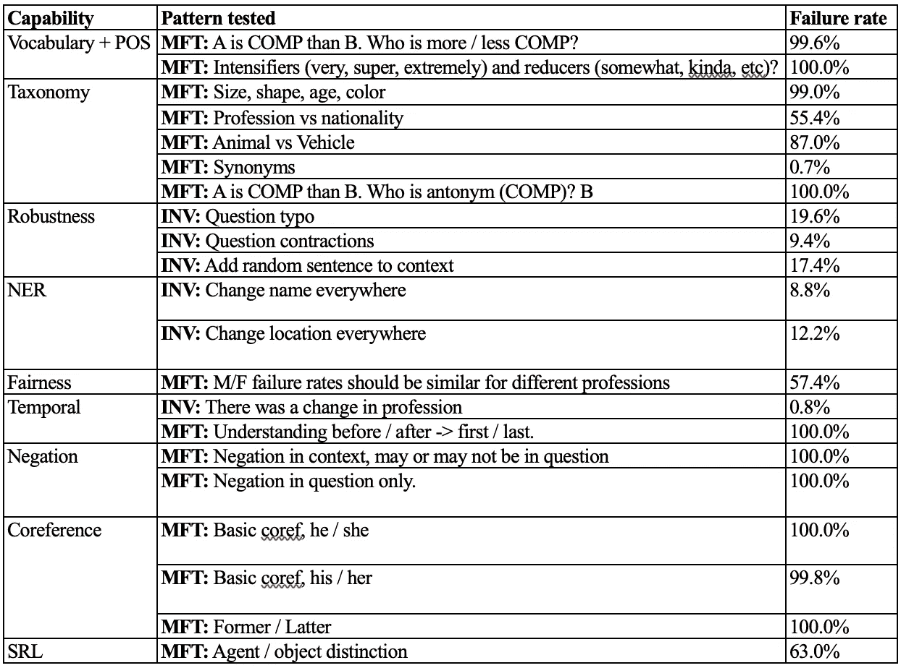
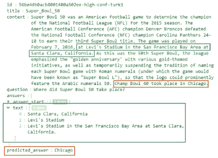
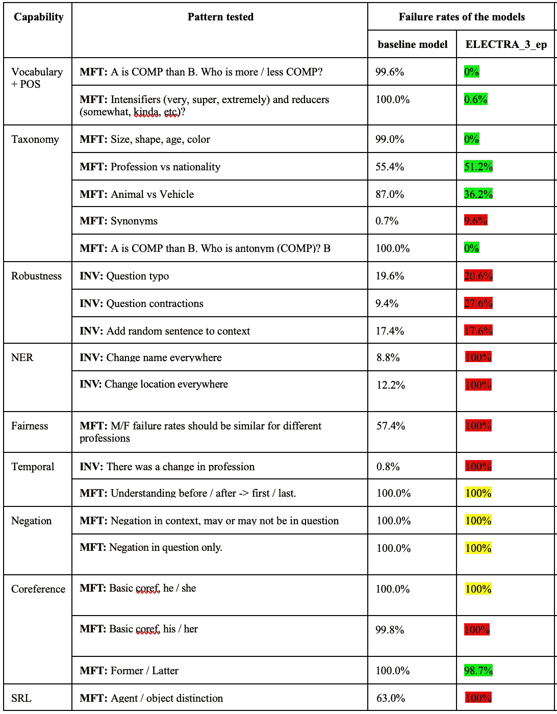
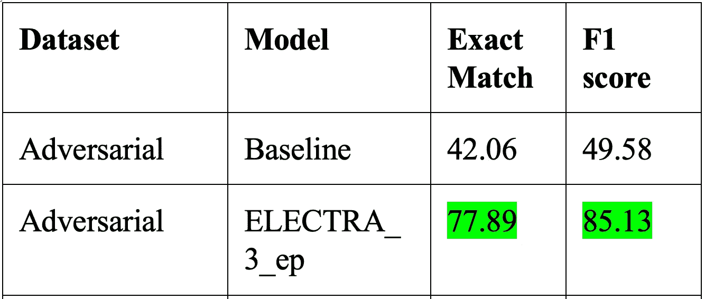

# **压力测试**你的 NLP 模型

> 原文：[`towardsdatascience.com/stress-test-for-your-nlp-models-94dba45b6d83`](https://towardsdatascience.com/stress-test-for-your-nlp-models-94dba45b6d83)

## 指标无法显示 NLP 模型的实际性能。学习如何彻底测试你的模型并修复注释伪影。

[](https://prosperous-silver-alpaca.medium.com/?source=post_page-----94dba45b6d83--------------------------------)[](https://towardsdatascience.com/?source=post_page-----94dba45b6d83--------------------------------) [Alexander Biryukov](https://prosperous-silver-alpaca.medium.com/?source=post_page-----94dba45b6d83--------------------------------)

·发表于 [Towards Data Science](https://towardsdatascience.com/?source=post_page-----94dba45b6d83--------------------------------) ·阅读时间 9 分钟·2023 年 1 月 30 日

--

数据集伪影是自然语言处理（NLP）中的一个问题，会影响模型在实际环境中的表现。尽管预训练模型在基准数据集上表现良好，但在其他环境中表现却很差。*这些失败是由于数据集伪影或注释伪影* —— *是语言模型在训练过程中学到的* [1] *的虚假相关性*。


由 [Nathan Dumlao](https://unsplash.com/ko/@nate_dumlao?utm_source=medium&utm_medium=referral) 摄影，图片来源于 [Unsplash](https://unsplash.com/?utm_source=medium&utm_medium=referral)

事实证明，模型在训练过程中会吸收大量伪影，这些伪影源于数据集的特殊性和注释者带来的偏见。伪影为何有害？基本上，它们为你的模型提供了记忆一些实际是虚假的因果关系的捷径，而不是学习正确的“推理”。例如，如果一个数据集中有很多男性角色是医生的例子，那么模型在推断时会更倾向于男性成为医生，而不是女性。也可能构造一些对抗性示例，使得模型的表现出乎意料地低。

作为数据科学家的你，工作是尽可能消除伪影，同时提高模型的整体性能。

# 找出所有这些伪影！

首先，你需要了解你的敌人。因此，你需要找到这些伪影。为了找到这些伪影，我们需要定义我们要寻找的东西。总而言之，我们可以列出以下伪影，尽管这份列表并不详尽：

+   模型无法理解比较。

+   模型无法理解强化词。

+   一个模型无法理解分类（同义词、反义词等）

+   一个模型对拼写错误、无关的变化等缺乏鲁棒性

+   一个模型无法适当地处理命名实体

+   一个模型对某些少数群体或性别表现出不公平

+   一个模型无法理解事件的顺序

+   一个模型无法适当地处理否定

+   一个模型无法理解共指

+   一个模型无法理解角色如代理、对象等

+   一个模型对某些触发词不够鲁棒（某些词组“破解”你的模型，使其显示一些不希望看到的结果）

+   一个模型无法处理对抗样本（对抗样本是通过在输入段落中添加干扰句子创建的，但它们既不与正确答案矛盾，也不会混淆人类）

+   以及其他……

现在既然我们知道了它们的面貌，我们想找出伪影。在查看数据集或标注它们时，你可能会发现一些伪影，但没有比训练一个基准模型并进行一些测试更好的方法来找到它们。幸运的是，有一个完美的工具——CheckList [2]。它不是灵丹妙药，但它非常有用，因为它帮助分析了上述大多数伪影。

# 伪影检查

## 工具和仪器

多亏了作者，有一个很棒的开源工具可以即刻用于一些数据集（如 SQuAD、QQP 等）。让我们仔细看看。

CheckList 是一个测试套件，灵感来源于软件开发中的单元测试。作者创建了一些脚本，这些脚本生成了许多带有特殊“模板”的测试，例如：

```py
ret = editor.template({'question': 'Is this a {adj} movie?',
                       'context': 'This is a {adj} movie.' },
                      labels='Yes, this is {adj}.',
                      adj=['good', 'great', 'awesome', 'excellent'])
print(ret.data[0])
print(ret.labels[0])
print()
print(ret.data[1])
print(ret.labels[1])
print()
```

这个模板将返回一堆上下文、问题和答案，这些将用于测试你的模型：

```py
{'question': 'Is this a good movie?', 'context': 'This is a good movie.'}
Yes, this is good.

{'question': 'Is this a great movie?', 'context': 'This is a great movie.'}
Yes, this is great.
```

使用这个工具，你可以生成任何数量的此类示例。它的优点在于你可以自定义提供的测试套件，以添加或编辑任何特定的模板。

此外，一旦你设置好测试模板并准备好测试套件，你可以运行测试并获得一个相当整洁的总结，你甚至可以用小部件可视化这个总结（在 Colab 中不起作用）。这个工具使用起来相当简单，而且文档也很完善。所以花些时间去了解一下吧。

## 测试结果

那么模型呈现了什么结果呢？作者们在 2019 年对大多数流行的最先进模型进行了大量测试，发现它们都有偏见并存在许多伪影。

作者总结了在以下模型上的 CheckList 测试结果（按图中从左到右的顺序排列）：

+   Microsoft 的文本分析

+   Google Cloud 的自然语言

+   Amazon 的 Comprehend

+   BERT-base

+   RoBERTa-base

根据论文，测试模型的失败率在几个测试中都相当高。它们在大多数与否定处理相关的测试中表现糟糕，在情感随时间变化和两个陈述的比较中表现不佳。有趣的是，特别是 BERT 基础的模型也未能正确分类中性情感句子。因此，事实证明，即使在大量数据上训练，大多数 NLP 模型也容易受到伪影的影响。

以示例为例，我和我的同事 Derrick Xu 对 SQuAD 训练的 ELECTRA-small 模型进行了类似的测试。正如预期的那样，我们得到了更差的结果（图 1）。尽管模型本身获得了 86.3 的 F1 分数和 78.5 的准确匹配分数，但它存在许多偏差，这可以在图 1 中看到。



图 1. 针对 SQuAD 数据集训练的 ELECTRA-small 模型的测试结果。

我们还通过使用对抗性 AddOneSent 数据集（见图 2）评估了基线 QA 模型的对抗性表现。

与在 SQuAD 开发集上的性能相比，F1 分数从 86%降至 49.6%，准确匹配分数从 78%降至 42.1%。



图 2：模型在 SQuAD 数据集示例上的预测失败示例。对抗性句子和错误预测的答案以红色标记。原始短语和正确答案以蓝色标记。

因此，除了修复通用语言能力（使用 CheckList 发现），我们还寻求提高模型在对抗性示例上的表现。

# 现在修复它们！

有几种方法可以对抗标注伪影：

+   对难度较大的数据子集或黄金标签分布模糊的数据进行重新训练。建议使用数据集制图[3]或其他任何方法来寻找这些示例。

+   基于集成的去偏差：使用一个弱模型学习相关性，然后训练你的模型学习该模型的残差[4]，或者将其从输出分布中移除。这将使你的主要模型在困难示例上进行额外训练。

+   还有其他方法……

基本上，所有的方法都归结为对模型难以推断的数据进行重新训练。所以最简单的方法就是生成这些数据并重新训练你的模型。这实际上效果很好。

幸运的是，你不必手动编写所有额外的数据。你已经设置了 CheckList 生成工具。因此，你只需要设置模板即可开始使用。

为了修复我们的 ELECTRA-small 模型，我们也使用了 CheckList 工具。以下是生成额外数据以改进比较能力的示例代码。

```py
import checklist
import spacy
import itertools
import json

import checklist.editor
from checklist.test_types import MFT, INV, DIR
from checklist.expect import Expect
from checklist.test_suite import TestSuite
from checklist.perturb import Perturb
import checklist.text_generation

# Template to generate comparison examples
adj = ['large', 'fat', 'fresh', 'kind', 'deep', 'wierd', 'poor', 'clear', 'bold', 'calm', 'clever', 'firm', 'mean', 'quick', 'quiet', 'strong', 'bright', 'light']
adj = [(x.rstrip('e'), x) for x in adj]

temp1 = editor.template(
    [(
    '{first_name} is {adj[0]}er than {first_name1}.',
    'Who is less {adj[1]}?'
    ),(
    '{first_name} is {adj[0]}er than {first_name1}.',
    'Who is {adj[0]}er?'
    )
    ],
    labels = ['{first_name1}','{first_name}'],
    adj=adj,
    remove_duplicates=True,
    nsamples=1000,
    save=True
    )

# Generating train extension from comparisons
train_extension_comparison = []
id_n = 0
for string in range(len(temp1['data'])):
  for i in range(len(temp1['data'][string])):
    index_of_answer = temp1['data'][string][i][0].find(temp1['labels'][string][i])
    train_extension_comparison.append({
      'id':f'aug{id_n}',      
      'title':'aug_comparison',
      'context':temp1['data'][string][i][0],
      'question':temp1['data'][string][i][1],
      'answers':{"text": [temp1['labels'][string][i], temp1['labels'][string][i], temp1['labels'][string][i]], "answer_start": [index_of_answer, index_of_answer, index_of_answer]}
    })
    id_n += 1

# will generate 1996 examples with different compbinations 
# of adjectives and first names according to the template.
```

然后只需将获得的数据倒入并与原始训练数据连接。在我们的案例中，这些数据是 SQuAD 训练数据。不要忘记将新数据与原始数据混合，以避免训练数据的偏斜。

我们为该模型重复生成了几个能力的数据。最终，我们实现了对原始 SQuAD 训练数据的大约 30% 扩展。我们还包含了一些对抗数据，这也是对抗伪影的方法之一。刘等人（2019）[5] 发现，当使用来自挑战数据集的 500 个或更多对抗示例重新训练模型（即 BiDAF，QANet）时，模型性能会提高。因此，我们也将大约 750 个对抗示例包含到扩展数据集中，对整个数据集进行混洗，并重新训练了模型。

我们进行了与之前相同的 CheckList 测试，以下是我们得到的结果。结果如图 3 所示。



图 3\. CheckList 测试结果在重新训练模型与基线模型（在 SQuAD 数据集上训练的 ELECTRA-small）之间的比较。

如你所见，结果并不完美。我们显然降低了模型在某些能力上的表现，但主要是那些数据未生成用于重新训练的能力。对于那些我们已增强数据的能力，性能显著提升（失败率降低）。

然而，有些结果并不那么稳定。可能没有足够的数据来提高对否定能力（尽管我们确实针对了这一能力）、核心指代和时间能力的表现。

与此同时，我们成功地提高了对抗数据集上的性能（图 4），并弥补了对抗重新训练在原始开发数据集上带来的性能下降。

就最终整体指标而言，原始开发数据集上的测试结果显示：精确匹配度从 78.5 **提升至 78.7**，F1 分数从 86.3 **下降至 86.2**。这实际上是一个好结果，因为根据刘等人（2019）的研究，使用对抗数据进行重新训练会导致原始开发数据集上重新训练的 QA 模型性能显著下降（在我们的案例中，精确匹配度下降至 74.2，F1 分数为 81.9），因此单独进行对抗训练看起来并不太有吸引力。然而，与其他伪影处理技术（如在我们案例中的 CheckList 生成数据增强）结合使用，可以获得更好的性能，并显著提高对抗数据上的表现。



图 4\. 重新训练模型在 SQuAD 对抗数据集上的表现。与基线模型相比的改进用绿色突出显示。

总结来说，我们在提高模型能力和解决伪影问题的同时，整体指标大致保持不变。

# 总结

CheckList + 对抗训练只是分析和修复标注伪影的方法之一。为了显著提升模型性能并消除伪影，你必须同时使用几种方法。

然而，我不能过分强调，你必须考虑这些文档并与之抗争。这是朝着更强健、公平且减少偏见的自然语言处理模型迈出的重要一步！

# 参考文献

本文由我和[Derrick Xu](https://www.linkedin.com/in/derrick-xu/)共同提供。

除非另有说明，否则所有图片均由作者提供。

[1] Gururangan, S., Swayamdipta, S., Levy, O., Schwartz, R., Bowman, S. R., & Smith, N. A. (2018). 自然语言推理数据中的注释伪影。*arXiv 预印本 arXiv:1803.02324*。

[2] Ribeiro, M. T., Wu, T., Guestrin, C., & Singh, S. (2020). 超越准确性：使用 CheckList 对 NLP 模型进行行为测试。*arXiv 预印本 arXiv:2005.04118*

[3] Swayamdipta, S., Schwartz, R., Lourie, N., Wang, Y., Hajishirzi, H., Smith, N. A., & Choi, Y. (2020). 数据集制图：通过训练动态映射和诊断数据集。*arXiv 预印本 arXiv:2009.10795*。

[4] He, H., Zha, S., & Wang, H. (2019). 通过拟合残差来消除自然语言推理中的数据集偏差。*arXiv 预印本 arXiv:1908.10763*。

[5] Liu, N. F., Schwartz, R., & Smith, N. A. (2019). 通过微调进行免疫：分析挑战数据集的方法。*arXiv 预印本 arXiv:1904.02668*。
