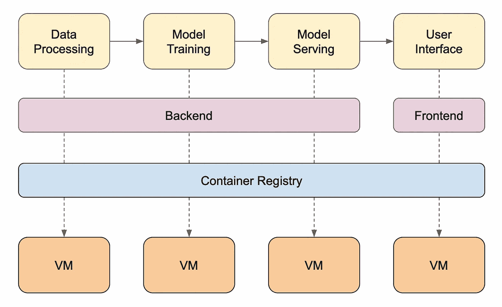
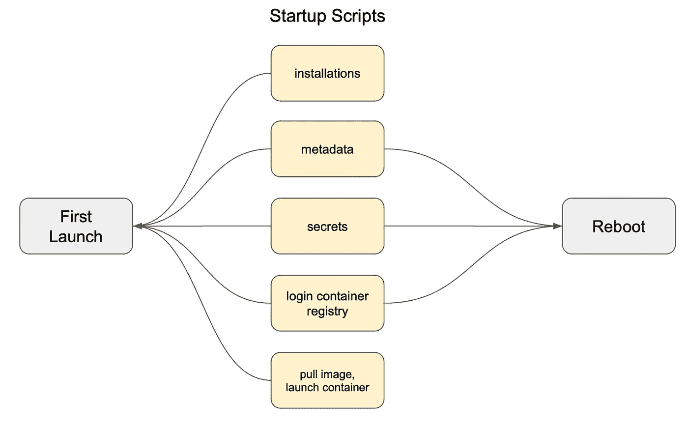

# 结构化您的云实例启动脚本

> 原文：[`towardsdatascience.com/structuring-your-cloud-instances-startup-scripts-2ce981825b8d`](https://towardsdatascience.com/structuring-your-cloud-instances-startup-scripts-2ce981825b8d)

## 区分首次启动与重启

[](https://medium.com/@teosiyang?source=post_page-----2ce981825b8d--------------------------------)[](https://towardsdatascience.com/?source=post_page-----2ce981825b8d--------------------------------) [Jake Teo](https://medium.com/@teosiyang?source=post_page-----2ce981825b8d--------------------------------)

·发布于 [Towards Data Science](https://towardsdatascience.com/?source=post_page-----2ce981825b8d--------------------------------) ·阅读时间 7 分钟·2023 年 11 月 9 日

--

大多数机器学习任务通常在初步探索阶段后，会被打包成镜像并部署到本地或云服务器上。这将促进快速迭代，以建立支持 MLOps 管道运行的基础设施，涉及整个开发团队，包括数据科学家、数据、软件和云工程师等。



示例图展示了机器学习任务典型的服务器部署（VM = 虚拟机）。图片由作者提供

启动脚本用于在云服务器实例启动时执行自动化配置或其他任务。这在 **AWS EC2** 中被称为 **用户数据**，在 **Google Cloud Engine** 中称为 **启动脚本**，在 **Azure Virtual Machine** 中称为 **自定义脚本扩展**。启动脚本中的内容可以包括安装、元数据设置、环境变量等。其主要目的是确保每个实例在启动时始终配置为准备好服务于内部或相邻服务的应用程序。

就像我们编写的所有脚本一样，我们应始终使其保持整洁、结构化和集中，以便可以将其作为模板重复使用。这将使您在管理项目中不同实例的多个应用程序时更加轻松。在接下来的部分中，我将展示如何做到这一点。

*虽然后面的部分专门针对 AWS EC2 的用户数据，但可以很容易地将其适应于其他提供商，只需使用相同的概念。*

# 1) 首次启动与重启启动脚本

在实例首次启动时使用启动脚本是相当直观的，但重启呢？如果我们使用的是按需实例，并且它们不用于生产环境（例如开发、测试、系统集成测试、用户验收测试），那么在开发人员不在工作时（例如周末或下班后）让它们运行是没有经济意义的。因此，它们会被安排在需要时关闭和重启。在打补丁时也有需要重启的情况。

在这些关闭期间，可能会有应用程序需要的元数据更新。因此，在重启后，这些数据应该被刷新，以反映最新的信息。



实例首次启动和重启所需的示例。图片来源：作者。

从现在开始，用户数据可以在实例首次启动时进行配置，也可以在重启时进行配置。通常，这两种启动方式所需的配置并不相同，但问题在于我们只能将一个用户数据文件附加到每个实例上。那么，我们如何在同一个用户数据文件中区分它们呢？

## 多部分格式

如果我们只要求在实例首次启动时执行用户数据，脚本只需包含 shell 命令。然而，要使其在每次实例重启时也能执行，则需要一个 cloud-config 命令。这是一个单独的格式，因此 AWS 使用 MIME（多用途互联网邮件扩展）多部分格式来包含这两种信息。

```py
Content-Type: multipart/mixed; boundary="//"
MIME-Version: 1.0

--//
Content-Type: text/cloud-config; charset="us-ascii"
MIME-Version: 1.0
Content-Transfer-Encoding: 7bit
Content-Disposition: attachment; filename="cloud-config.txt"

#cloud-config
cloud_final_modules:
- [scripts-user, always]

--//
Content-Type: text/x-shellscript; charset="us-ascii"
MIME-Version: 1.0
Content-Transfer-Encoding: 7bit
Content-Disposition: attachment; filename="userdata.txt"

# your script here

--//--
```

从上面可以看到 MIME 的定义，随后是云配置，其中 `[scripts-user, always]` 表示用户数据将在实例首次启动和随后的重启时执行。下一个格式是为 shell 命令量身定制的。

## 区分首次启动和重启

从技术上讲，AWS 没有用户数据配置来根据首次启动和重启分隔你的脚本。幸运的是，我们可以使用一些简单的脚本优雅地完成这一任务，如下面的伪代码所示。

```py
Content-Type: multipart/mixed; boundary="//"
MIME-Version: 1.0

--//
Content-Type: text/cloud-config; charset="us-ascii"
MIME-Version: 1.0
Content-Transfer-Encoding: 7bit
Content-Disposition: attachment; filename="cloud-config.txt"

#cloud-config
cloud_final_modules:
- [scripts-user, always]

--//
Content-Type: text/x-shellscript; charset="us-ascii"
MIME-Version: 1.0
Content-Transfer-Encoding: 7bit
Content-Disposition: attachment; filename="userdata.txt"

#!/bin/bash

# --------------- define functions --------------- #

function install_docker() {
  # some installations
}

function create_dotenv() {
  # create .env file
}

function setup_docker_compose() {
  # setup docker-compose.yml
}

function launch_docker_compose() {
  # launch your container
}

# --------------- execute script --------------- #

if [ ! -e "STARTED" ]; then
  # on first launch
  install_docker
  create_dotenv
  setup_docker_compose
  launch_docker_compose
  touch "STARTED";
else
  # on restart
  create_dotenv
  setup_docker_compose
fi

--//--
```

首先，我们需要将脚本结构化为函数，以便它们可以在首次启动或重启时调用。你可以看到我定义了 `install_docker`、`create_dotenv`、`setup_docker_compose` 和 `launch_docker_compose` 四个函数。应设置适当的参数，使其尽可能可重用。

其次，我们有一个简单的 if-else 语句，当 `STARTED` 文件不存在时，它将执行所有四个函数，并在末尾创建 `STARTED` 文件。在该实例重启时，由于 `STARTED` 文件存在，它将仅运行两个配置函数，而不是其他函数。

这很简单，对吧？下面是一个使用 Ubuntu 虚拟机进一步说明的实际示例。

```py
Content-Type: multipart/mixed; boundary="//"
MIME-Version: 1.0

--//
Content-Type: text/cloud-config; charset="us-ascii"
MIME-Version: 1.0
Content-Transfer-Encoding: 7bit
Content-Disposition: attachment; filename="cloud-config.txt"

#cloud-config
cloud_final_modules:
- [scripts-user, always]

--//
Content-Type: text/x-shellscript; charset="us-ascii"
MIME-Version: 1.0
Content-Transfer-Encoding: 7bit
Content-Disposition: attachment; filename="userdata.txt"

#!/bin/bash

# --------------- define functions --------------- #

function install_docker() {
  # https://docs.docker.com/engine/install/ubuntu/
  sudo apt-get update;
  sudo apt-get install -y ca-certificates gnupg lsb-release;

  sudo mkdir -p /etc/apt/keyrings
  curl -fsSL https://download.docker.com/linux/ubuntu/gpg | sudo gpg --yes --dearmor -o /etc/apt/keyrings/docker.gpg
  echo \
    "deb [arch=$(dpkg --print-architecture) signed-by=/etc/apt/keyrings/docker.gpg] https://download.docker.com/linux/ubuntu \
    $(lsb_release -cs) stable" | sudo tee /etc/apt/sources.list.d/docker.list > /dev/null
  sudo apt update
  sudo apt-get -y install docker-ce docker-ce-cli containerd.io docker-compose-plugin
}

function create_dotenv() {
  ENV=$(curl -s http://169.254.169.254/latest/meta-data/tags/instance/Env)
  cd $1
  rm -f .env

  # Calculate memory limit & reservation for docker container
  # 90% limit, 70% reserved
  total_memory=$(free -m | awk '/^Mem:/{print $2}')
  MEM_LIMIT=$(echo "$total_memory * 0.9" | bc)
  MEM_LIMIT=$(printf "%.0f" "$MEM_LIMIT")
  MEM_RES=$(echo "$total_memory * 0.7" | bc)
  MEM_RES=$(printf "%.0f" "$MEM_RES")
  echo "Memory limit: $MEM_LIMIT $MEM_RES MB"

  echo MEM_LIMIT=${MEM_LIMIT}M >> .env
  echo MEM_RES=${MEM_RES}M >> .env  
  echo ENV=$ENV >> .env
  echo -e "[INFO] dotenv created ==========\n"
}

function setup_docker_compose() {
  # pull docker-compose file
  CI_TOKEN="get from secrets-manager"
  curl --header "PRIVATE-TOKEN: $CI_TOKEN" "https://gitlab.com/api/v4/projects/${1}/repository/files/docker-compose.yml/raw?ref=main" -o ${2}docker-compose.yml

  # pull image
  AWS_ACCOUNT=$(curl -s http://169.254.169.254/latest/dynamic/instance-identity/document | jq -r .accountId)
  AWS_REGION=$(curl -s http://169.254.169.254/latest/meta-data/placement/region)
  aws ecr get-login-password --region $AWS_REGION | docker login --username AWS --password-stdin
  echo -e "[INFO] docker-compose downloaded & docker logged in ==========\n"
}

function launch_docker_compose() {
  docker compose pull
  docker compose up -d
  echo -e "[INFO] docker image pulled and up ==========\n"
}

# --------------- execute script --------------- #

PROJECTID=12345678
HOMEDIR=/home/ubuntu/

if [ ! -e "STARTED" ]; then
  # on first launch
  install_docker
  create_dotenv $HOMEDIR
  setup_docker_compose $PROJECTID $HOMEDIR
  launch_docker_compose
  touch "STARTED";
else
  # on restart
  create_dotenv $HOMEDIR
  setup_docker_compose $PROJECTID $HOMEDIR
fi

--//--
```

每个函数的简短描述已经提供。请注意参数的使用，使每个函数都可以重用。

+   **install_docker()**：更新包管理器，安装基础库以及 docker 和 docker-compose。

+   **create_dotenv()**：从实例元数据标签中获取环境的元数据，例如开发、暂存、生产，并将其放入`.env`文件中。

+   **set_docker_compose()**：从源代码库中获取最新的`docker-compose.yml`文件，使用文件中的环境设置镜像标签，然后登录到容器注册表。

+   **launch_docker_compose()**：将镜像部署为容器

# 2) 集中启动脚本与克服字符限制

用户数据的字符或大小限制分别为 16K 和 16KB。这在大多数使用案例中是一个合理的长度。然而，如果超过此限制，你可以轻松地将脚本存储在像 S3 桶这样的 Blob 存储中，并在用户数据中拉取并执行这些脚本。这也是通过中央存储更新所有用户数据脚本的首选方法。

```py
Content-Type: multipart/mixed; boundary="//"
MIME-Version: 1.0

--//
Content-Type: text/cloud-config; charset="us-ascii"
MIME-Version: 1.0
Content-Transfer-Encoding: 7bit
Content-Disposition: attachment; filename="cloud-config.txt"

#cloud-config
cloud_final_modules:
- [scripts-user, always]

--//
Content-Type: text/x-shellscript; charset="us-ascii"
MIME-Version: 1.0
Content-Transfer-Encoding: 7bit
Content-Disposition: attachment; filename="userdata.txt"

#!/bin/bash

# --------------- define functions --------------- #

function install_aws_cli() {
  sudo apt-get update;
  sudo apt-get install -y curl unzip;

  sudo curl "https://awscli.amazonaws.com/awscli-exe-linux-x86_64.zip" -o "awscliv2.zip";
  sudo unzip awscliv2.zip;
  sudo ./aws/install;
  rm -f awscliv2.zip; rm -rf aws;
}

function download_scripts() {
  # download template functions from S3
  aws s3 cp s3://<s3.bucket.name>/userdata_template.sh userdata_template.sh
  source userdata_template.sh
}

# --------------- execute script --------------- #

PROJECTID=12345678
HOMEDIR=/home/ubuntu/

cd $HOMEDIR
if [ ! -e "STARTED" ]; then
  # on first launch
  install_aws_cli
  download_scripts
  install_docker
  create_dotenv $HOMEDIR
  setup_docker_compose $PROJECTID $HOMEDIR
  launch_docker_compose
  touch "STARTED";
else
  # on restart
  download_scripts
  create_dotenv $HOMEDIR
  setup_docker_compose $PROJECTID $HOMEDIR
fi
```

我们可以将上述四个函数存储在名为`userdata_template.sh`的文件中，并将其放置在你选择的 S3 桶中。

要访问 S3 桶，我们需要确保 1) 实例在实例配置文件中具有读取该桶的相关权限，以及 2) 实例已安装`aws-cli`以便使用适当的命令从 S3 中拉取启动脚本。

有了这些，我们可以轻松下载脚本，`source`它以访问之前的函数，并根据需要执行它们。

# 3) 调试

如果用户数据没有按预期执行任务，你可以查看实例中的日志文件，以查看是否捕获到任何错误消息。日志文件位于`/var/log/cloud-init-output.log`。

```py
# print the last 100 lines of log file
tail -n 100 /var/log/cloud-init-output.log
```

如果你需要检查用户数据脚本本身，可以使用以下两种方法。

```py
# print the user data script
curl -s http://169.254.169.254/latest/user-data

# the script itself is stored in this directory
cd /var/lib/cloud/instance/scripts
```

# 总结

就这样！希望你从虚拟机的首次启动和重启中学到一些优雅的结构化用户数据的技巧。希望你觉得这些技巧有用且直观。

# 参考资料

+   [`docs.aws.amazon.com/AWSEC2/latest/UserGuide/user-data.html`](https://docs.aws.amazon.com/AWSEC2/latest/UserGuide/user-data.html)

+   [`docs.aws.amazon.com/AWSEC2/latest/UserGuide/instancedata-add-user-data.html#`](https://docs.aws.amazon.com/AWSEC2/latest/UserGuide/instancedata-add-user-data.html#)
