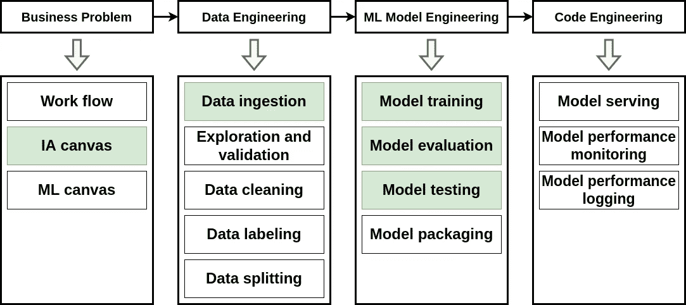
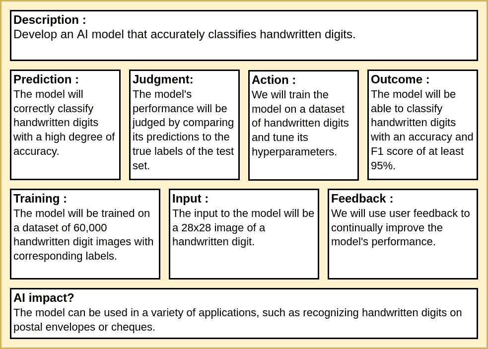
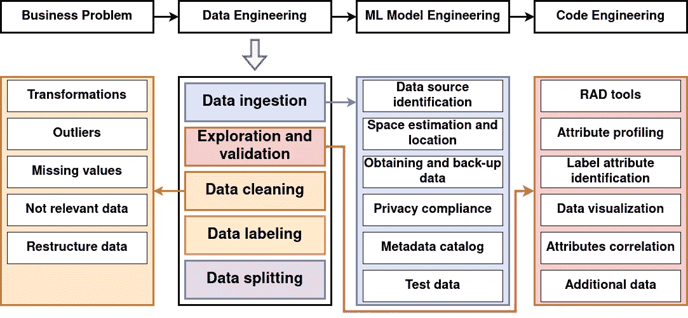
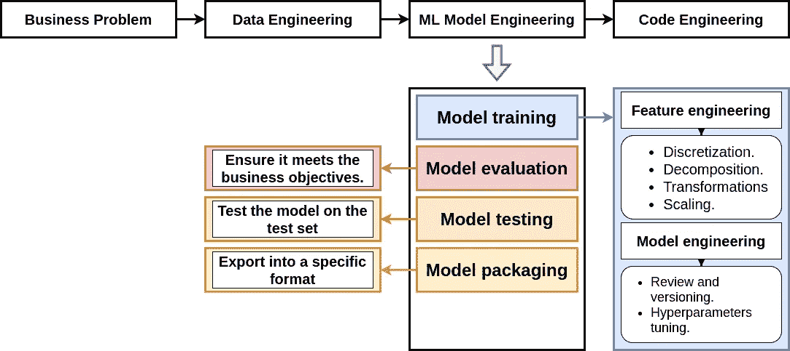
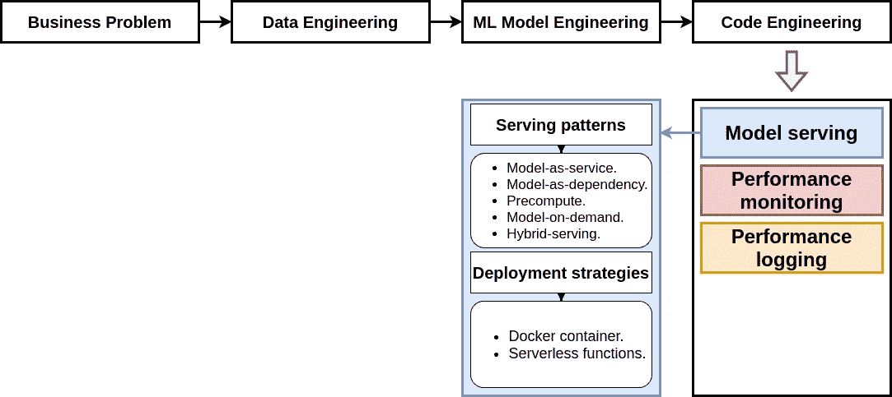
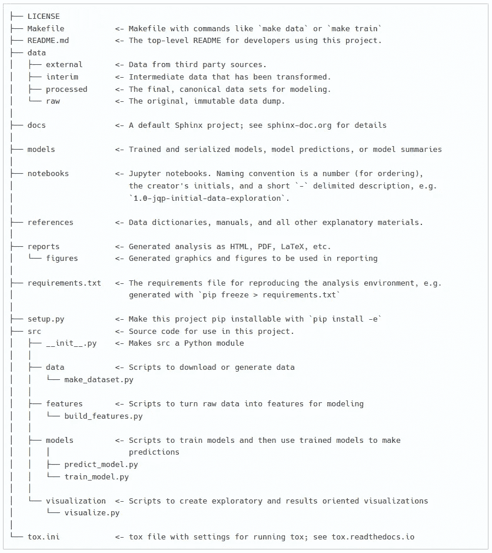
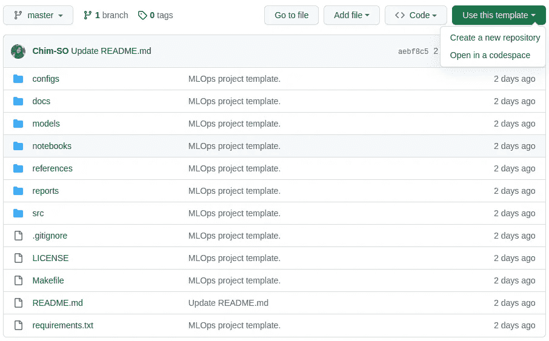
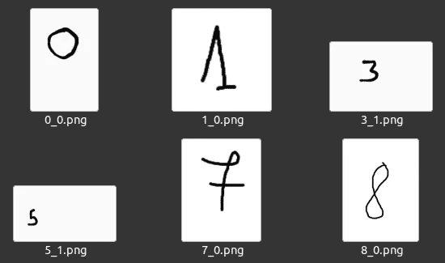
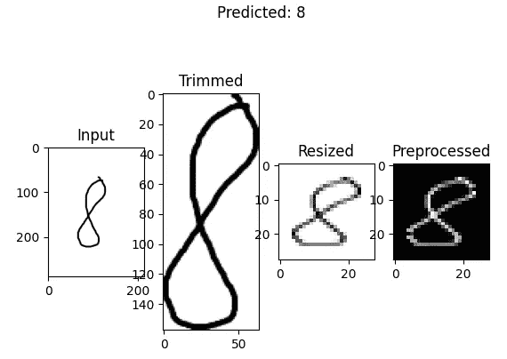

# 将你的机器学习项目与 MLOps 思维相结合进行结构化

> 原文：[`towardsdatascience.com/structuring-your-machine-learning-project-with-mlops-in-mind-41a8d65987c9`](https://towardsdatascience.com/structuring-your-machine-learning-project-with-mlops-in-mind-41a8d65987c9)

## MLOps 实践：项目结构化

[](https://medium.com/@chimso1994?source=post_page-----41a8d65987c9--------------------------------)[](https://towardsdatascience.com/?source=post_page-----41a8d65987c9--------------------------------) [Chayma Zatout](https://medium.com/@chimso1994?source=post_page-----41a8d65987c9--------------------------------)

· 发布于 [Towards Data Science](https://towardsdatascience.com/?source=post_page-----41a8d65987c9--------------------------------) ·14 分钟阅读·2023 年 3 月 16 日

--


图片由 [Priscilla Du Preez](https://unsplash.com/@priscilladupreez?utm_source=medium&utm_medium=referral) 提供，来源于 [Unsplash](https://unsplash.com/?utm_source=medium&utm_medium=referral)

如果你希望将机器学习项目提升到一个新的水平，MLOps 是过程中的重要部分。本文将为你提供一个实用的教程，教你如何为 MLOps 结构化你的项目，以经典的手写数字分类问题为例。我们将逐步带你完成创建一个基本项目模板的过程，你可以用来组织自己的项目。通过这个教程，你将对 MLOps 原则有一个扎实的理解，并学会如何将它们应用到自己的项目中。然而，如果你对 MLOps 不熟悉，我们建议你先从我的 [适合初学者的教程](https://medium.com/towards-data-science/a-beginner-friendly-introduction-to-mlops-95282f25325c) 开始，以便快速上手。让我们开始吧，将你的机器学习项目提升到一个新水平！

**目录：**

· 1\. 介绍

· 2\. MLOps

∘ 2.1\. 业务问题

∘ 2.2\. 数据工程

∘ 2.3\. 机器学习模型工程

∘ 2.4\. 代码工程

· 3\. 项目结构

∘ 3.1\. Cookiecutter 数据科学

· 4\. MLOps 项目结构

∘ 4.1\. 开始一个新的 MLOps 项目

∘ 4.2\. 使用 MLOps 项目模板进行手写数字分类

∘ 4.3\. 如何运行你的项目？

· 5\. 结论

**我的 MLOps 教程：**

+   *教程 1：MLOps 的关键入门：探索其核心组件*

+   *教程 2：初学者友好的 MLOps 工作流程介绍*

+   [*教程 3：MLOps 原则介绍*](https://medium.com/towards-data-science/introduction-to-mlops-principles-c5d73a00aa76)

+   [*教程 4：以 MLOps 为核心构建机器学习项目结构*](https://medium.com/towards-data-science/structuring-your-machine-learning-project-with-mlops-in-mind-41a8d65987c9)

+   [*教程 5：实践中的版本控制：数据、ML 模型和代码*](https://medium.com/towards-data-science/version-controlling-in-practice-data-ml-model-and-code-e13c518067dc)

+   *教程 6：实践中的测试：代码、数据和 ML 模型*

+   教程 7：实践中的跟踪：代码、数据和 ML 模型

*[我会在发布相关文章时更新此列表]*

# 1\. 介绍

在之前的教程中，我们将 MLOps 定义为一种以高效、优化和有序的方式设计、构建和部署机器学习模型的方法。这是通过结合一组技术、实践和工具来实现的，这些技术、实践和工具通常在 MLOps 生命周期的背景下进行讨论。

在 MLOps 生命周期中，了解问题后的第一步是构建您的项目。这通常通过使用模板完成，无论是公司模板、公共模板还是您自己的模板，如我们将在本教程中看到的那样。

在本教程中，我们将以手写数字分类为例。 在之前的教程中，我为 MNIST 分类创建了一个 Github 仓库，项目结构如下：

```py
MNIST_classification
├── dataset_scripts
│   ├── construct_dataset_csv.py
│   ├── construct_dataset_folders.py
│   ├── describe_dataset_csv.py
│   ├── explore_dataset_idx.py
│   └── README.md
├── main_classification_convnet.py
├── main_classification_onehot.py
├── main_classification_single_output.py
├── .gitignore
└── README.md
```

项目文件夹包括“dataset_scripts”文件夹，该文件夹包含用于操作原始 IDX 格式数据集的脚本（有关更多信息，您可以查看我之前的教程“[如何轻松探索您的 IDX 数据集](https://medium.com/mlearning-ai/how-to-effortlessly-explore-your-idx-dataset-97753246031f)”），用于训练三种不同类型模型的 Python 脚本，一个.gitignore 文件，以及一个 README 文件。由于该项目结构是为教程目的设计的，因此它非常简单。在本教程中，我将介绍我在 MLOps 项目中的项目结构。请注意，如果您想了解有关模型和训练的编程细节，您可以随时参考我的教程“[神经网络简要介绍：分类问题](https://medium.com/towards-data-science/a-brief-introduction-to-neural-networks-a-classification-problem-43e68c770081#ebb1)”。

# 2\. MLOps

机器学习过程中的不同步骤在 MLOps 工作流程中进行了概述，该工作流程包括业务问题、数据工程、机器学习模型工程和代码工程。在本节中，我们将探讨如何实现每一步。然而，由于我们正在解决的问题（手写数字分类）不需要某些步骤，我们不会深入讨论这些步骤。我们将重点关注用绿色突出显示的步骤（见下图）。剩余步骤将在未来的教程中覆盖。如果你想了解更多关于 MLOps 工作流程的内容，你可以查看我的[入门友好教程](https://medium.com/towards-data-science/a-beginner-friendly-introduction-to-mlops-95282f25325c#73c3)。



MLOps 工作流程。

## 2.1\. 业务问题

本教程中解决的问题是手写数字分类，这是一个多类分类任务。具体而言，给定一个手写数字的输入图像（范围从 0 到 9），模型需要识别数字并输出其对应的标签。

AI 画布包含以下组件：任务描述、预测（模型输出）、判断、行动、结果、训练、输入、反馈和模型对问题的影响。对于当前的手写数字分类问题，我们的 AI 画布将按如下方式构建和填写：



用于手写数字分类的 AI 画布。

## 2.2\. 数据工程



数据工程

数据工程涵盖了各种任务，如数据摄取、探索和验证、清理、标注和拆分。在这个项目中，我们执行了以下数据工程任务：

+   **数据摄取：** 我们从其[官方网站](http://yann.lecun.com/exdb/mnist/)下载了 MNIST 数据集的原始格式，并将其转换为 CSV 文件。

+   **数据探索和验证：** 我们可视化了一些数据集中的图像，并展示了一些洞见。

+   **数据清理：** 数据集已经很干净，无需进一步清理。

+   **数据标注：** 数据集已经标注完毕，因此不需要额外的标注。

+   **数据拆分：** 数据集已经被拆分为训练集和测试集。我们将从训练集中提取验证集。

值得注意的是，这个项目涉及的相对简单的数据工程过程，因为数据集已经准备和处理好了。然而，我们将在未来的文章中探讨更复杂的例子。

## 2.3\. 机器学习模型工程



机器学习模型工程

机器学习模型工程是 MLOps 工作流程中的第三步。它包括各种任务，如模型训练、评估、测试和打包。在这个项目中，我们执行了以下机器学习模型工程任务：

+   **模型训练**：在特征工程中，我们使用了数据缩放（将像素缩放到[0,1]范围内）、数据重塑（将图像表示为 1D 向量或 2D 矩阵）和数据编码（独热编码）。在模型工程中，我们实现了两种不同类型的模型并应用了超参数调优。

+   **模型评估**：除了准确率，我们还使用了召回率、精确度和 F1 分数等其他评估指标，以确保模型符合 AI 画布中描述的业务目标（结果）。

+   **模型测试**：在评估模型之后，我们在两种不同类型的数据上进行了测试：第一种是 MNIST 数据集的测试集，第二种是从应用程序生成的一些手写数字图像。

+   **模型打包和版本控制**将在下一教程中讨论，我们将更详细地介绍机器学习管道。

如果你想了解更多编程细节，可以随时查看[我之前的教程](https://medium.com/towards-data-science/a-brief-introduction-to-neural-networks-a-classification-problem-43e68c770081#ebb1)。

## 2.4\. 代码工程



代码工程

在代码工程步骤中，选择的模型会被部署到应用中，其性能需要被监控和记录。在部署模型之前，需要仔细选择服务模式和部署策略。部署后，需要管理和维护其行为，以确保其正常运行。尽管这一部分在本教程中没有详细说明，但我计划在不久的将来专门写一篇文章。

# 3\. 项目结构

现在我们已经突出展示了在手写数字分类中应用的不同 MLOps 步骤，接下来让我们着手结构化项目，以满足项目需求，同时考虑这些步骤。为此，我将首先介绍一个著名的项目结构，然后展示我的 MLOps 项目结构模板。该模板将在我们添加更多组件时进行更新。

但为什么正确结构化你的机器学习项目很重要呢？好吧，有几个好处：

+   **良好的透明度：** 组织有序的项目不仅对你自己，而且对他人也更易于理解。

+   **简单的维护：** 结构良好的项目更易于维护和更新，从而节省时间和精力。

+   **提高效率：** 清晰的计划减少了浪费的时间，最小化了偏离方向或丢失重要信息的风险。

+   **良好的可复现性和可重用性：** 一个良好的项目结构确保项目结果可以轻松复现，并且其组件可以重用。

+   **便捷的协作：** 当项目组织得清晰且逻辑性强时，其他人更容易理解和参与。

总之，正确构建机器学习项目的结构可以带来更大的透明度、效率、可维护性和协作。

## 3.1. Cookiecutter 数据科学

正如本文之前提到的，在编写任何代码之前，我们首先需要定义项目结构。这可以通过使用项目结构模板来实现。模板可以是公司为响应公司/项目需求而制定的公司模板，也可以是一个团体或个人创建并发布的公共模板，或者是您自己感觉舒适的自定义模板。

在该领域最著名的项目结构之一是[Cookiecutter 数据科学](https://drivendata.github.io/cookiecutter-data-science/)，其结构如下：

> 一种逻辑合理、标准化但灵活的项目结构，用于进行和共享数据科学工作。

您可以在下面找到此模板的项目结构，以及每个文件的描述：



# 4. MLOps 项目结构

现在我们已经解释了 MLOps 工作流程的不同步骤是如何执行的，让我们定义一个与 MLOps 工作流程对齐的项目结构模板。[Cookiecutter MLOps](https://github.com/Chim-SO/cookiecutter-mlops) 模板基于我们之前介绍的 Cookiecutter 数据科学模板。与 Cookiecutter 数据科学类似，我的 Cookiecutter MLOps 模板包括 LICENSE、README、Makefile 和 requirements 文件；以及 docs、models、notebooks、references、reports、visualization 和 source 文件夹。然而，新增了一个文件夹 (configs)，并且 source 和 visualization 文件夹得到了增强。

MLOps 项目结构模板具有以下结构：

```py
{{ cookiecutter.repo_name }}/
├── LICENSE
├── README.md
├── Makefile        # Makefile with commands like `make data` or `make train`
├── configs         # Config files (models and training hyperparameters)
│   └── model1.yaml
│
├── data
│   ├── external    # Data from third party sources.
│   ├── interim     # Intermediate data that has been transformed.
│   ├── processed   # The final, canonical data sets for modeling.
│   └── raw         # The original, immutable data dump.
│
├── docs            # Project documentation.
│
├── models          # Trained and serialized models.
│
├── notebooks       # Jupyter notebooks.
│
├── references      # Data dictionaries, manuals, and all other explanatory
│                   # materials.
│
├── reports         # Generated analysis as HTML, PDF, LaTeX, etc.
│   └── figures     # Generated graphics and figures to be used in reporting.
│
├── requirements.txt # The requirements file for reproducing the environment.
└── src              # Source code for use in this project.
    ├── __init__.py  # Makes src a Python module.
    │
    ├── data         # Data engineering scripts.
    │   ├── build_features.py
    │   ├── cleaning.py
    │   ├── ingestion.py
    │   ├── labeling.py
    │   ├── splitting.py
    │   └── validation.py
    │
    ├── models       # ML model engineering (a folder for each model).
    │   └── model1
    │       ├── dataloader.py
    │       ├── hyperparameters_tuning.py
    │       ├── model.py
    │       ├── predict.py
    │       ├── preprocessing.py
    │       └── train.py
    │
    └── visualization # Scripts to create exploratory and results
        │             # oriented visualizations.
        ├── evaluation.py
        └── exploration.py
```

**configs** 文件夹包含所有配置文件，例如模型超参数。

**data** 文件夹（src 的子文件夹）包括以下文件：

+   ingestion.py: 用于收集数据。如果需要创建备份、保护私人信息或创建元数据目录，最好在这里完成。

+   cleaning.py: 用于通过减少离群值/噪声、处理缺失值等来清理数据。

+   labeling.py: 如果需要，使用该文件对数据进行标注。

+   splitting.py: 用于将数据分为测试集和训练集。

+   validation.py: 用于验证数据（以确保其准备好进行训练）。

+   build_features.py: 该文件已移动到此文件夹，因为构建特征意味着将数据集组织成特定结构。

在 **models** 文件夹（src 的子文件夹）中，每个模型的脚本都在模型的文件夹中组织，包括：

+   model.py: 用于定义模型架构。

+   dataloader.py: 用于加载数据，以供模型使用。

+   preprocessing.py: 用于在将数据输入模型之前进行预处理。

+   train.py: 用于训练模型。

+   hyperparameters_tuning.py: 用于调整模型和/或训练超参数。

+   predict.py：用于对随机图像进行预测（不是来自数据集）。

**可视化** 文件夹包括以下内容：

+   exploration.py：此文件包括在数据工程过程中用于可视化数据的函数。

+   evaluation.py：此文件包括用于可视化训练结果的函数。

这是 MLOps 模板，有一些重要的注意事项需要考虑：

+   这是一个基本模板，因此根据你的项目需求，可以删除或添加一些文件和文件夹。

+   一些预处理函数可以在所有模型中使用，因此可以创建一个单独的预处理文件，并将其移动到数据文件夹中，以避免函数重复。然而，建议将预处理文件分开，以提高模型的可重用性，并防止未来潜在的问题。

+   在预测脚本中，假设数据来自应用程序而不是数据集，因此可能需要额外的预处理步骤。

## 4.1\. 启动一个新的 MLOps 项目

如果你想使用此模板启动你的机器学习项目，你可以使用[GitHub 模板](https://github.com/Chim-SO/mlops-template)或使用[Cookiecutter 模板](https://github.com/Chim-SO/cookiecutter-mlops)，如下所示：

+   要使用**GitHub 模板**，首先，你需要访问这里的模板页面。然后，点击绿色的按钮‘使用此模板’，你将需要选择是‘创建一个新仓库’还是‘在代码空间中打开’：



GitHub 模板

+   要使用**Cookiecutter 模板**，你首先需要安装 C[ookiecutter](https://cookiecutter.readthedocs.io/en/latest/installation.html#install-cookiecutter)，使用：

```py
pip install cookiecutter
```

或者：

```py
conda config --add channels conda-forge
conda install cookiecutter
```

然后在命令行中运行此命令：

```py
cookiecutter https://github.com/Chim-SO/cookiecutter-mlops
```

这里是手写数字分类的示例配置，你可以通过填写所需的参数来进行自定义。按下 Enter 键将保留你不想更改的任何参数的默认值：

```py
project_name [project_name]: MLOps_MLflow_mnist_classification

repo_name [mlops_mlflow_mnist_classification]: 

author_name [Your name (or your organization/company/team)]: Chim SO

description [A short description of the project.]: MNIST classification

Select open_source_license:
1 - MIT
2 - BSD-3-Clause
3 - No license file
Choose from 1, 2, 3 [1]: 1

s3_bucket [[OPTIONAL] your-bucket-for-syncing-data (do not include 's3://')]: 

aws_profile [default]:

Select python_interpreter:
1 - python3
2 - python
Choose from 1, 2 [1]:
```

## 4.2\. 使用 MLOps 项目模板进行手写数字分类

在第二部分，我们讨论了手写数字分类任务中 MLOps 工作流的不同步骤。使用 MLOps 模板实现该管道将导致以下项目结构：

```py
MLOps_MLflow_mnist_classification
├── configs
│   ├── cnnbased.yaml
│   └── singleoutput.yaml
├── data
│   ├── external
│   │   └── test
│   │       ├── 0_0.png
│   │       ├── 1_0.png
│   │       ├── 1_1.png
│   │       ├── 3_1.png
│   │       ├── 5_1.png
│   │       ├── 7_0.png
│   │       └── 8_0.png
│   ├── interim
│   ├── processed
│   │   ├── test.csv
│   │   └── train.csv
│   └── raw
│       ├── test_images.gz
│       ├── test_labels.gz
│       ├── train_images.gz
│       └── train_labels.gz
├── LICENSE
├── Makefile
├── MLproject
├── mlruns
├── models
├── README.md
├── requirements.txt
└── src
    ├── data
    │   ├── build_features.py
    │   ├── dataloader.py
    │   └── ingestion.py
    ├── models
    │   ├── cnnbased
    │   │   ├── hyperparameters_tuning.py
    │   │   ├── model.py
    │   │   ├── predict.py
    │   │   ├── preprocessing.py
    │   │   └── train.py
    │   └── singleoutput
    │       ├── hyperparameters_tuning.py
    │       ├── model.py
    │       ├── predict.py
    │       ├── preprocessing.py
    │       └── train.py
    └── visualization
        ├── evaluation.py
        └── exploration.py
```

由于我们已经描述了每个文件和文件夹的内容，现在我将重点介绍一些可能有点模糊的最重要步骤。

+   `configs` 文件夹包含两个配置文件，每个模型一个。例如，`singleoutput.yaml` 文件包括模型配置、训练参数、日志参数（将在下一个教程中讨论）以及模型调优参数。

```py
# Data parameters
data:
  dataset_path : 'data/processed/'

# Model parameters
model:
  name: 'singleoutput'
  num_units: 224
  num_layers: 5
  activation_function : 'sigmoid'

# Training parameters
training:
  batch_size: 128
  num_epochs: 200
  loss_function: 'mae'
  metric: 'mse'

# Logging and output parameters
mlflow:
  mlruns_path: 'file:models/mlruns'
  experiment_name: 'singleOutput'

# Tuning
hyperparameter_tuning:
  num_layers: [3, 5]
  num_units: [16, 64, 224]
  activation_function: ['relu', 'sigmoid']
  batch_size: [128, 256]
  loss_function: ['mae']
  metric: ['mse']
  num_epochs: [200]
```

+   使用`src/data/ingestion.py`，数据首先被下载并存储在`data/raw/`中。然后，使用`src/data/build_features.py`将其转换为记录结构，并直接存储到`data/processed`中。

+   在`data/external`文件夹中，我添加了一个`test`子文件夹，其中包括一些随机的手写数字图像。这些图像将由`predict.py`脚本用于测试训练模型对新、未见数据的预测。



+   对于这个示例，data/interim 文件夹是空的，因为数据处理管道中没有中间步骤。

+   由于数据集是经典数据集，数据加载器被移动到了`src/data/`，而不是为每个模型重复使用。

+   `src/models/<model>/predict.py`脚本概述了预测随机图像类别的管道。与用于训练模型的预处理管道（包括调整大小和缩放）不同，预测管道首先对图像进行裁剪，反转像素，然后调整大小和缩放。



随机图像的数据预处理管道。

+   `MLproject`文件和`mlruns`文件夹由 MLflow 库使用，MLflow 是一个用于管理机器学习管道的平台。下一篇文章将详细介绍这个主题，所以如果你不熟悉它，也不用担心。

## 4.3\. 如何运行你的项目？

执行 Python 项目有几种方法：交互式运行（逐行执行），批处理运行（安排定时任务或使用作业调度器），容器化运行（使用 Docker 或 Kubernetes），自动化运行（例如使用 MLflow），或分布式运行（使用像 Apache Spark 这样的分布式计算框架）。由于这不是本文的主要内容，我们将使用最简单的方法：从项目目录执行这些命令。

```py
python src/data/ingestion.py -r data/raw/ # Download data
python src/data/build_features.py -r data/raw/ -p data/processed/ # Create csv files
python -m src.models.cnnbased.train -c configs/cnnbased.yaml # Train CNN model
```

# 5\. 结论

在这篇文章中，我们提供了一个 MLOps 项目结构模板，并应用于手写数字分类问题。我们展示了如何将 MLOps 工作流应用于解决这个问题，并制定了一个你可以作为[Cookiecutter 项目](https://github.com/Chim-SO/cookiecutter-mlops/tree/master/%7B%7B%20cookiecutter.repo_name%20%7D%7D)或[GitHub 模板](https://github.com/Chim-SO/mlops-template)使用的项目结构模板。如果你觉得这个模板有帮助，请在 GitHub 上给它一个星标，以便其他人也能发现。如果你是 MLOps 的新手，可以阅读我的初学者友好教程。

在接下来的文章中，我们将继续使用这个示例来覆盖所有 MLOps 工作流和原则。我会写更多关于 MLOps 及其各种技术的教程，并提供示例，请继续关注。

感谢阅读这篇文章。你可以在我的[GitHub 个人资料](https://github.com/Chim-SO?tab=repositories)中找到示例项目。如果你有任何问题或建议，请随时留言。

# 图像来源

文章中所有未在标题中提到来源的图像和图表均为作者提供。
