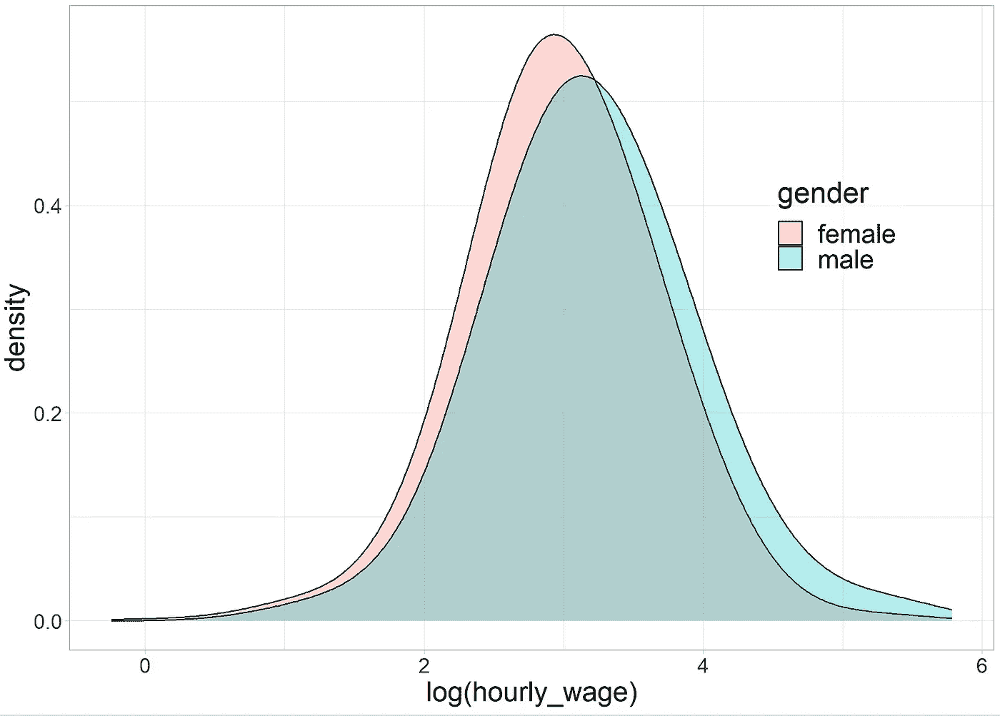

# 使用分布式随机森林研究美国性别工资差距

> 原文：[`towardsdatascience.com/studying-the-gender-wage-gap-in-the-us-using-distributional-random-forests-ec4c2a69abf0?source=collection_archive---------6-----------------------#2023-02-18`](https://towardsdatascience.com/studying-the-gender-wage-gap-in-the-us-using-distributional-random-forests-ec4c2a69abf0?source=collection_archive---------6-----------------------#2023-02-18)

## 分布式随机森林（DRF）的真实数据分析示例

[](https://medium.com/@jeffrey_85949?source=post_page-----ec4c2a69abf0--------------------------------)[](https://towardsdatascience.com/?source=post_page-----ec4c2a69abf0--------------------------------) [Jeffrey Näf](https://medium.com/@jeffrey_85949?source=post_page-----ec4c2a69abf0--------------------------------)

·

[关注](https://medium.com/m/signin?actionUrl=https%3A%2F%2Fmedium.com%2F_%2Fsubscribe%2Fuser%2Fca780798011a&operation=register&redirect=https%3A%2F%2Ftowardsdatascience.com%2Fstudying-the-gender-wage-gap-in-the-us-using-distributional-random-forests-ec4c2a69abf0&user=Jeffrey+N%C3%A4f&userId=ca780798011a&source=post_page-ca780798011a----ec4c2a69abf0---------------------post_header-----------) 发表在 [Towards Data Science](https://towardsdatascience.com/?source=post_page-----ec4c2a69abf0--------------------------------) · 13 分钟阅读 · 2023 年 2 月 18 日[](https://medium.com/m/signin?actionUrl=https%3A%2F%2Fmedium.com%2F_%2Fvote%2Ftowards-data-science%2Fec4c2a69abf0&operation=register&redirect=https%3A%2F%2Ftowardsdatascience.com%2Fstudying-the-gender-wage-gap-in-the-us-using-distributional-random-forests-ec4c2a69abf0&user=Jeffrey+N%C3%A4f&userId=ca780798011a&source=-----ec4c2a69abf0---------------------clap_footer-----------)

--

[](https://medium.com/m/signin?actionUrl=https%3A%2F%2Fmedium.com%2F_%2Fbookmark%2Fp%2Fec4c2a69abf0&operation=register&redirect=https%3A%2F%2Ftowardsdatascience.com%2Fstudying-the-gender-wage-gap-in-the-us-using-distributional-random-forests-ec4c2a69abf0&source=-----ec4c2a69abf0---------------------bookmark_footer-----------)

图片由 [Ehimetalor Akhere Unuabona](https://unsplash.com/@mettyunuabona?utm_source=medium&utm_medium=referral) 拍摄，发布于 [Unsplash](https://unsplash.com/?utm_source=medium&utm_medium=referral)

在之前的两篇文章中，我解释了分布式随机森林（DRFs），这是一种能够估计条件分布的随机森林，以及一种[方法的扩展](https://medium.com/@jeffrey_85949/inference-for-distributional-random-forests-64610bbb3927)，它允许进行不确定性量化，如置信区间等。这里我展示了一个实际应用的例子，数据来自 2018 年美国社区调查，由美国人口普查局提供。 在第一篇[DRF 论文](https://www.jmlr.org/papers/v23/21-0585.html)中，我们获得了来自 2018 年美国社区调查的大约 100 万名全职员工的数据，从中提取了薪资信息和所有可能与薪资相关的协变量。这些数据非常适合用来实验 DRF 这种方法（实际上我们将在本分析中只使用一个微小的子集）。

当研究原始时薪数据时，两个性别之间存在一致的差距，即男性往往赚得更多。一个有趣的问题是，男性（*G=1*）和女性（*G=0*）之间观察到的时薪差距（*W*）是否仅仅由于性别，还是可以通过一些其他混杂变量***X***来解释，这些变量受性别影响并反过来影响工资。也就是说，我们想研究与以下因果图中的粗体箭头对应的效应大小：


假设因果图，G=性别，W=工资，**X**是混杂变量

例如，假设***X***仅包括职业，并且女性倾向于选择不涉及高 monetary 奖励的职业，如医生、护士或教师，而男性则倾向于从事专业赌博工作，时薪极高。如果仅凭这一点来解释性别之间的时薪差异，我们仍然会看到直接观察到的时薪差距。然而，如果我们将职业固定为***X***的医生，并比较这两种工资分布，那么任何统计上显著的差异只能来自性别本身。

我们关注于两阶段分析：

+   我们将***X***固定为一个特定值，并比较在***X****=****x***固定的协变量下两个组的工资分布。这从两个方面来看都很有趣：首先，如果***X***确实包含所有影响工资且与性别相关的其他因素，那么固定***X****=****x***并查看两性工资，就意味着我们真正观察到了性别对工资的影响。其次，它允许对具有给定特征***x***的个体进行整个工资分布的预测。

+   我们使用上面假设的因果图和因果规则，通过 DRF 估计一个反事实分布：女性工资的分布，假如她们被当作男性来设定工资。如果***X***包含所有相关协变量，并且不存在性别工资差距，这个分布应该与男性的工资分布相同（忽略统计随机性）。

这篇文章是几个人工作的**最终成果**：代码和数据集来自原始的[DRF 仓库](https://github.com/lorismichel/drf)，然后与我们新论文中在[arXiv](https://arxiv.org/abs/2302.05761)上开发的方法结合，这篇论文由[Corinne Emenegger](http://www.linkedin.com/in/corinne-rahel-emmenegger)共同撰写。

在继续之前，我想指出这*仅仅是一个用来说明 DRF 使用的例子*。我并不打算在这里做出任何严肃的（因果）声明，因为分析肯定在某些方面存在缺陷，我们下面假设的因果图肯定是错误的。此外，我们只使用了可用数据中的一小部分。


此外，请注意代码运行速度较慢。这是因为，虽然 DRF 本身是用 C 语言编写的，但用于置信区间的重复拟合目前是用 R 实现的。

话虽如此，让我们*深入了解*。接下来，除非另有说明，所有图片均由作者提供。

## 数据

来自 2018 年 1 年期美国社区调查的 PUMS（公共使用微数据区域）数据来自[美国人口普查局 API](https://www.census.gov/content/dam/Census/data/developers/api-user-guide/api-guide.pdf)。该调查每年发送给约 350 万人，旨在提供比每十年进行一次的官方普查更为最新的数据。2018 年的数据集包含大约 300 万条匿名数据点，涵盖了 51 个州和哥伦比亚特区。对于上面链接的 DRF 论文，我们仅提取了可能与工资相关的变量子集，如个人的性别、年龄、种族、婚姻状况、教育水平和英语水平。

预处理的数据可以在[这里](https://github.com/lorismichel/drf/tree/master/applications/wage_data/data/datasets)找到。我们首先进行一些进一步的清理：

```py
##Further data cleaning ##

which = rep(TRUE, nrow(wage))
which = which & (wage$age >= 17)
which = which & (wage$weeks_worked > 48)
which = which & (wage$hours_worked > 16)
which = which & (wage$employment_status == 'employed')
which = which & (wage$employer != 'self-employed')
which[is.na(which)] = FALSE

data = wage[which, ]
sum(is.na(data))
colSums(is.na(data))
rownames(data) = 1:nrow(data)
#data = na.omit(data)

data$log_wage = log(data$salary / (data$weeks_worked * data$hours_worked))

## Prepare data and fit drf
## Define X and Y
X = data[,c(
  'age',
  'race',
  'hispanic_origin',
  'citizenship',
  'nativity', 
  'marital',
  'family_size',
  'children',
  'education_level',
  'english_level',
  'economic_region'
)]
X$occupation = unlist(lapply(as.character(data$occupation), function(s){return(substr(s, 1, 2))}))
X$occupation = as.factor(X$occupation)
X$industry = unlist(lapply(as.character(data$industry), function(s){return(substr(s, 1, 2))}))
X$industry[X$industry %in% c('32', '33', '3M')] = '31'
X$industry[X$industry %in% c('42')] = '41'
X$industry[X$industry %in% c('45', '4M')] = '44'
X$industry[X$industry %in% c('49')] = '48'
X$industry[X$industry %in% c('92')] = '91'
X$industry = as.factor(X$industry)
X=dummy_cols(X, remove_selected_columns = TRUE)
X = as.matrix(X)

Y = data[,c('sex', 'log_wage')]
Y$sex = (Y$sex == 'male')
Y = as.matrix(Y)
```

实际上，这些观察值远远超过我们需要的，我们在此分析中随机抽样了 4'000 个训练数据点。

```py
train_idx = sample(1:nrow(data), 4000, replace = FALSE)

## Focus on training data
Ytrain=Y[train_idx,]
Xtrain=X[train_idx,]
```

再次说明，这是因为它只是一个示例——实际上，你会希望获取尽可能多的数据点。这 4'000 个数据点的两性工资估计密度绘制在图 1 中，使用了以下代码：

```py
## Plot the test data without adjustment
plotdfunadj = data[train_idx, ]
plotdfunadj$weight=1
plotdfunadj$plotweight[plotdfunadj$sex=='female'] = plotdfunadj$weight[plotdfunadj$sex=='female']/sum(plotdfunadj$weight[plotdfunadj$sex=='female'])
plotdfunadj$plotweight[plotdfunadj$sex=='male'] = plotdfunadj$weight[plotdfunadj$sex=='male']/sum(plotdfunadj$weight[plotdfunadj$sex=='male'])

#pooled data
ggplot(plotdfunadj, aes(log_wage)) +
  geom_density(adjust=2.5, alpha = 0.3, show.legend = TRUE,  aes(fill=sex, weight=plotweight)) +
  theme_light()+
  scale_fill_discrete(name = "gender", labels = c('female', "male"))+
  theme(legend.position = c(0.83, 0.66),
        legend.text=element_text(size=18),
        legend.title=element_text(size=20),
        legend.background = element_rect(fill=alpha('white', 0.5)),
        axis.text.x = element_text(size=14),
        axis.text.y = element_text(size=14),
        axis.title.x = element_text(size=19),
        axis.title.y = element_text(size=19))+
  labs(x='log(hourly_wage)')
```



每小时工资的（无条件）原始对数的估计密度

计算两者工资的百分比中位差，即

（男性中位工资 - 女性中位工资）/（女性中位工资）*100，

我们获得了约 18%的结果。也就是说，在未经调整的数据中，男性的中位薪资比女性高 18%（!）

```py
## Median Difference before adjustment!
quantile_maleunadj = wtd.quantile(x=plotdfunadj$log_wage, weights=plotdfunadj$plotweight*(plotdfunadj$sex=='male'), normwt=TRUE, probs=0.5)
quantile_femaleunadj = wtd.quantile(x=plotdfunadj$log_wage, weights=plotdfunadj$plotweight*(plotdfunadj$sex=='female'), normwt=TRUE, probs=0.5)
(1-exp(quantile_femaleunadj)/exp(quantile_maleunadj))
```

## 分析

问题现在变成了这是否真的“不公平”。也就是说，我们假设上述因果图，其中性别(*G*)影响工资(*W*)，以及协变量***X***，这些协变量反过来影响*W*。我们想知道的是性别是否直接影响工资（粗体箭头）。也就是说，如果一个女性和一个具有完全相同特征的男性***X****=****x***获得相同的工资，还是因为她的性别她获得了更少的工资。

我们将在两种情况下进行研究。第一种情况是将***X****=****x***保持不变，并使用在[早期文章](https://medium.com/@jeffrey_85949/inference-for-distributional-random-forests-64610bbb3927)中解释的机制。直观地说，如果我们固定性别之外可能影响工资的所有其他协变量，然后比较这两种工资分布，那么任何观察到的差异必须仅由工资造成。

第二种方法尝试对所有可能的**X**值量化这种差异。通过计算反事实分布来实现这一点。

W（男性，**X**（女性））。

这个量是一个男性如果具有女性的特征时得到的反事实工资。也就是说，我们询问一个女性在像男性一样对待时的工资。

请注意，这假设了上述因果图是正确的。特别是，它假设***X***捕捉到除了性别之外的所有相关因素，这些因素会决定工资。可能情况并非如此，因此在本文开头的免责声明。

## 研究条件分布差异

接下来，我们将***x***固定到一个任意点：

```py
i<-47

# Important: Test point needs to be a matrix
test_point<-X[i,, drop=F]
```

以下图片展示了一些包含在该测试点***x***中的值——我们正在查看具有高中学历、已婚且有 1 个孩子的保育员。使用 DRF，我们可以估计并绘制条件于***X****=****x***的两个组的密度：

```py
# Load all relevant functions (the CIdrf.R file can be found at the end of this 
# article
source('CIdrf.R')

# predict with the new framework
DRF = predictdrf(drf_fit, x=x)
weights <- DRF$weights

## Conditional Density Plotting
plotdfx = data[train_idx, ]

propensity = sum(weights[plotdfx$sex=='female'])
plotdfx$plotweight = 0
plotdfx$plotweight[plotdfx$sex=='female'] = weights[plotdfx$sex=='female']/propensity
plotdfx$plotweight[plotdfx$sex=='male'] = weights[plotdfx$sex=='male']/(1-propensity)

gg = ggplot(plotdfx, aes(log_wage)) +
  geom_density(adjust=5, alpha = 0.3, show.legend=TRUE,  aes(fill=sex, weight=plotweight)) +
  labs(x='log(hourly wage)')+
  theme_light()+
  scale_fill_discrete(name = "gender", labels = c(sprintf("F: %g%%", round(100*propensity, 1)), sprintf("M: %g%%", round(100*(1-propensity), 1))))+
  theme(legend.position = c(0.9, 0.65),
        legend.text=element_text(size=18),
        legend.title=element_text(size=20),
        legend.background = element_rect(fill=alpha('white', 0)),
        axis.text.x = element_text(size=14),
        axis.text.y = element_text(size=14),
        axis.title.x = element_text(size=19),
        axis.title.y = element_text(size=19))+
  annotate("text", x=-1, y=Inf, hjust=0, vjust=1, size=5, label = point_description(data[i,]))
plot(gg)
```


给定**X**=**x**的两个性别的对数（每小时工资）密度的估计。此图的代码可以在文章末尾找到。

在这个图中，即使在固定的***x***情况下，也明显存在工资差异（记住，在这种情况下所有假定的混杂因素都被固定，因此我们实际上只是直接比较工资）。使用 DRF，我们现在估计并测试*中位差异*。

```py
## Getting the respective weights
weightsmale<-weights*(Ytrain[, "sex"]==1)/sum(weights*(Ytrain[, "sex"]==1))
weightsfemale<-weights*(Ytrain[, "sex"]==0)/sum(weights*(Ytrain[, "sex"]==0))

## Choosing alpha:
alpha<-0.05

# Step 1: Doing Median comparison for fixed x

quantile_male = wtd.quantile(x=data$log_wage[train_idx], weights=matrix(weightsmale), normwt=TRUE, probs=0.5)
quantile_female = wtd.quantile(x=data$log_wage[train_idx], weights=matrix(weightsfemale), normwt=TRUE, probs=0.5)

(medianx<-unname(1-exp(quantile_female)/exp(quantile_male)))

mediandist <- sapply(DRF$weightsb, function(wb) {

  wbmale<-wb*(Ytrain[, "sex"]==1)/sum(wb*(Ytrain[, "sex"]==1))
  wbfemale<-wb*(Ytrain[, "sex"]==0)/sum(wb*(Ytrain[, "sex"]==0))

  quantile_maleb = wtd.quantile(x=data$log_wage[train_idx], weights=matrix(wbmale), normwt=TRUE, probs=0.5)
  quantile_femaleb = wtd.quantile(x=data$log_wage[train_idx], weights=matrix(wbfemale), normwt=TRUE, probs=0.5)

  return( unname(1-exp(quantile_femaleb)/exp(quantile_maleb)) ) 
})

varx<-var(mediandist)

## Use Gaussian CI:
(upper<-medianx + qnorm(1-alpha/2)*sqrt(varx))
(lower<-medianx - qnorm(1-alpha/2)*sqrt(varx)) 
```

这给出了中位差异的置信区间。

(0.06, 0.40) 或 (6%, 40%)

这个区间非常明显地不包含零，因此中位差异确实是显著的。

使用 Witobj 函数，我们可以更清楚地显示这种差异。

```py
 Witobj<-Witdrf(drf_fit, x=test_point, groupingvar="sex", alpha=0.05)

hatmun<-function(y,Witobj){

  c<-Witobj$c
  k_Y<-Witobj$k_Y
  Y<-Witobj$Y
  weightsall1<-Witobj$weightsall1
  weightsall0<-Witobj$weightsall0
  Ky=t(kernelMatrix(k_Y, Y , y = y))

  out<-list()
  out$val <- tcrossprod(Ky, weightsall1  ) - tcrossprod(Ky, weightsall0  )
  out$upper<-  out$val+sqrt(c)
  out$lower<-  out$val-sqrt(c)

  return( out )

}

all<-hatmun(sort(Witobj$Y),Witobj)

plot(sort(Witobj$Y),all$val , type="l", col="darkblue", lwd=2, ylim=c(min(all$lower), max(all$upper)),
     xlab="log(wage)", ylab="witness function")
lines(sort(Witobj$Y),all$upper , type="l", col="darkgreen", lwd=2 )
lines(sort(Witobj$Y),all$lower , type="l", col="darkgreen", lwd=2 )
abline(h=0)
```

这导致了图示：


工资的条件见证函数的估计，男性减去女性的工资。

我们参考[相关文章](https://medium.com/@jeffrey_85949/inference-for-distributional-random-forests-64610bbb3927)以获得对该概念的更详细解释。本质上，它可以被视为

*在给定* ***x*** *的情况下，男性的工资对数的条件密度* — *在给定* ***x*** *的情况下，女性的工资对数的条件密度*

即，条件见证函数显示了一个组的密度高于另一个组的位置，而无需实际估计密度。在这个例子中，负值表示女性工资的密度在给定***x***的情况下高于男性工资的密度，正值表示女性工资的密度较低。由于我们已经估计了上述的条件密度，条件见证函数本身并不会增加太多信息。但它对于说明情况很有用。确实，我们看到它在开始时是负的，对于条件密度的女性工资高于条件密度的男性工资的值。相反，它在更大的值下变为正值，对于这些值，男性工资的条件密度高于女性工资。因此，关于两个密度的相关信息在见证函数图中总结：我们看到女性工资的密度在较低工资值时较高，而在较高工资值时较低，表明密度向左偏移，女性赚得更少！此外，我们还可以提供包含真实函数 95%的 95%置信区间（绿色），*在所有 y 值上均匀分布*。 （尽管实际上需要大量的数据才能使其有效）由于这个均匀置信区间在 2 到 2.5 左右的零线之间不包含，我们再次看到这两个分布之间的差异在统计上是显著的。

对特定的***x***进行条件化，使我们能够详细研究个体效应，并具有不确定性的概念。然而，研究整体效应也很有趣。我们将在下一节中通过估计反事实分布来实现这一点。

## 估计反事实分布

使用我们假设的因果图的因果性计算法则，可以推导出：


即，我们寻找的反事实分布是通过对性别为女性的***x***，平均条件分布*W | G=male*，***X****=****x***获得的。

由于分布被给定为简单的权重，这可以通过以下方式轻松完成：DRF

```py
## Add code

## Male is 1, Female is 0

# obtain all X from the female test population
Xtestf<-Xtest[Ytest[,"sex"]==0,]

# Obtain the conditional distribution of W | G=male, X=x, for x in the female
# population.

# These weights correspond to P(W, G=male | X=x  )
weightsf<-predictdrf(drf_fit, x=Xtestf)$weights*(Ytrain[, "sex"]==1)
weightsf<-weightsf/rowSums(weightsf)

# The counterfactual distribution is the average over those weights/distributions 
counterfactualw<-colMeans(weightsf)
```

这导致了以下的反事实密度估计：

```py
plotdfc<-rbind(plotdfc, plotdfunadj[plotdfunadj$sex=='female',])
plotdfc$sex2<-c(rep(1, length(train_idx)), rep(0,nrow(plotdfunadj[plotdfunadj$sex=='female',])))

plotdfc$sex2<-factor(plotdfc$sex2)

#interventional distribution
ggplot(plotdfc, aes(log_wage)) +
  geom_density(adjust=2.5, alpha = 0.3, show.legend=TRUE,  aes(fill=sex2, weight=plotweight)) +
  theme_light()+
  scale_fill_discrete(name = "", labels = c("observed women's wages", "wages if treated as men"))+
  theme(legend.position = c(0.2, 0.98),
        legend.text=element_text(size=16),
        legend.title=element_text(size=20),
        legend.background = element_rect(fill=alpha('white', 0)),
        axis.text.x = element_text(size=14),
        axis.text.y = element_text(size=14),
        axis.title.x = element_text(size=19),
        axis.title.y = element_text(size=19))+
  labs(x='log(hourly wage)')
```


这两个密度现在分别是红色的女性工资密度，以及如果女性被当作男性来设置工资的话的绿色-蓝绿色密度。显然，现在这些密度比之前更接近——调整了混杂因素使得性别薪酬差异变小。然而，中位数差异仍然

```py
quantile_male = wtd.quantile(x=plotdfc$log_wage[plotdfc$sex2==1], weights=counterfactualw, normwt=TRUE, probs=0.5)
quantile_female = wtd.quantile(x=plotdfunadj$log_wage, weights=plotdfunadj$plotweight*(plotdfunadj$sex=='female'), normwt=TRUE, probs=0.5)
(1-exp(quantile_female)/exp(quantile_male)) 
```

0.11 或 11 百分比！

因此，如果我们的分析是正确的，那么 11%的薪资差异仍然可以归因于性别。换句话说，虽然我们将未调整数据中 18%的中位收入差异减少到 11%，但仍然存在实质性的差异，表明性别之间存在“非公平”的工资差距（至少如果***X***确实捕捉到了相关的混杂因素）。

## 结论

在这篇文章中，我们研究了如何将 DRF 应用于实际数据分析的一个例子。我们探讨了固定的***x***的情况，对于这种情况，本文讨论的方法允许构建不确定性度量，以及反事实量的分布。在这两种情况下，我们都看到在调整可用的混杂变量时，仍然存在实质性差异，在固定的***x***情况下尤其显著。

虽然我没有检查，但看到这个小实验的结果与更严肃的分析相比可能会很有趣。无论如何，我希望这篇文章展示了 DRF 如何在实际数据分析中使用。

## 额外代码

```py
## Functions in CIdrf.R that is loaded above ##

drfCI <- function(X, Y, B, sampling = "binomial",...) {

### Function that uses DRF with subsampling to obtain confidence regions as
### as described in https://arxiv.org/pdf/2302.05761.pdf
### X: Matrix of predictors
### Y: Matrix of variables of interest
### B: Number of half-samples/mini-forests

  n <- dim(X)[1]

  # compute point estimator and DRF per halfsample S
  # weightsb: B times n matrix of weights
  DRFlist <- lapply(seq_len(B), function(b) {

    # half-sample index
    indexb <- if (sampling == "binomial") {
      seq_len(n)[as.logical(rbinom(n, size = 1, prob = 0.5))]
    } else {
      sample(seq_len(n), floor(n / 2), replace = FALSE)
    }

    ## Using refitting DRF on S
    DRFb <- 
      drf(X = X[indexb, , drop = F], Y = Y[indexb, , drop = F],
          ci.group.size = 1, ...)

    return(list(DRF = DRFb, indices = indexb))
  })

  return(list(DRFlist = DRFlist, X = X, Y = Y) )
}

predictdrf<- function(DRF, x, ...) {

### Function to predict from DRF with Confidence Bands
### DRF: DRF object
### x: Testpoint

  ntest <- nrow(x)
  n <- nrow(DRF$Y)

  ## extract the weights w^S(x)
  weightsb <- lapply(DRF$DRFlist, function(l) {

    weightsbfinal <- Matrix(0, nrow = ntest, ncol = n , sparse = TRUE)

    weightsbfinal[, l$indices] <- predict(l$DRF, x)$weights 

    return(weightsbfinal)
  })

  ## obtain the overall weights w
  weights<- Reduce("+", weightsb) / length(weightsb)

return(list(weights = weights, weightsb = weightsb ))
}

Witdrf<- function(DRF, x, groupingvar, alpha=0.05, ...){

### Function to calculate the conditional witness function with
### confidence bands from DRF
### DRF: DRF object
### x: Testpoint

  if (is.null(dim(x)) ){

  stop("x needs to have dim(x) > 0")
  }

  ntest <- nrow(x)
  n <- nrow(DRF$Y)
  coln<-colnames(DRF$Y)

  ## Collect w^S
  weightsb <- lapply(DRF$DRFlist, function(l) {

    weightsbfinal <- Matrix(0, nrow = ntest, ncol = n , sparse = TRUE)

    weightsbfinal[, l$indices] <- predict(l$DRF, x)$weights 

    return(weightsbfinal)
  })

  ## Obtain w
  weightsall <- Reduce("+", weightsb) / length(weightsb)

  #weightsall0<-weightsall[, DRF$Y[, groupingvar]==0, drop=F]
  #weightsall1<-weightsall[,DRF$Y[, groupingvar]==1, drop=F]

  # Get the weights of the respective classes (need to standardize by propensity!)
  weightsall0<-weightsall*(DRF$Y[, groupingvar]==0)/sum(weightsall*(DRF$Y[, groupingvar]==0))
  weightsall1<-weightsall*(DRF$Y[, groupingvar]==1)/sum(weightsall*(DRF$Y[, groupingvar]==1))

  bandwidth_Y <- drf:::medianHeuristic(DRF$Y)
  k_Y <- rbfdot(sigma = bandwidth_Y)

  K<-kernelMatrix(k_Y, DRF$Y[,coln[coln!=groupingvar]], y = DRF$Y[,coln[coln!=groupingvar]])

  nulldist <- sapply(weightsb, function(wb){
    # iterate over class 1

    wb0<-wb*(DRF$Y[, groupingvar]==0)/sum(wb*(DRF$Y[, groupingvar]==0))
    wb1<-wb*(DRF$Y[, groupingvar]==1)/sum(wb*(DRF$Y[, groupingvar]==1))

    diag( ( wb0-weightsall0 - (wb1-weightsall1) )%*%K%*%t( wb0-weightsall0 - (wb1-weightsall1) )  )

  })

  # Choose the right quantile
  c<-quantile(nulldist, 1-alpha)

  return(list(c=c, k_Y=k_Y, Y=DRF$Y[,coln[coln!=groupingvar]], nulldist=nulldist, weightsall0=weightsall0, weightsall1=weightsall1))

}
```

```py
### Code to generate plots

## Step 0: Choosing x

point_description = function(test_point){
  out = ''

  out = paste(out, 'job: ', test_point$occupation_description[1], sep='')
  out = paste(out, '\nindustry: ', test_point$industry_description[1], sep='')

  out = paste(out, '\neducation: ', test_point$education[1], sep='')
  out = paste(out, '\nemployer: ', test_point$employer[1], sep='')
  out = paste(out, '\nregion: ', test_point$economic_region[1], sep='')

  out = paste(out, '\nmarital: ', test_point$marital[1], sep='')
  out = paste(out, '\nfamily_size: ', test_point$family_size[1], sep='')
  out = paste(out, '\nchildren: ', test_point$children[1], sep='')

  out = paste(out, '\nnativity: ', test_point$nativity[1], sep='')
  out = paste(out, '\nhispanic: ', test_point$hispanic_origin[1], sep='')
  out = paste(out, '\nrace: ', test_point$race[1], sep='')
  out = paste(out, '\nage: ', test_point$age[1], sep='')

  return(out)
}
```
