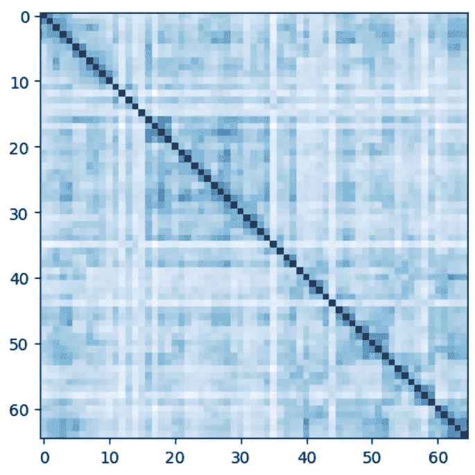
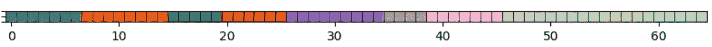
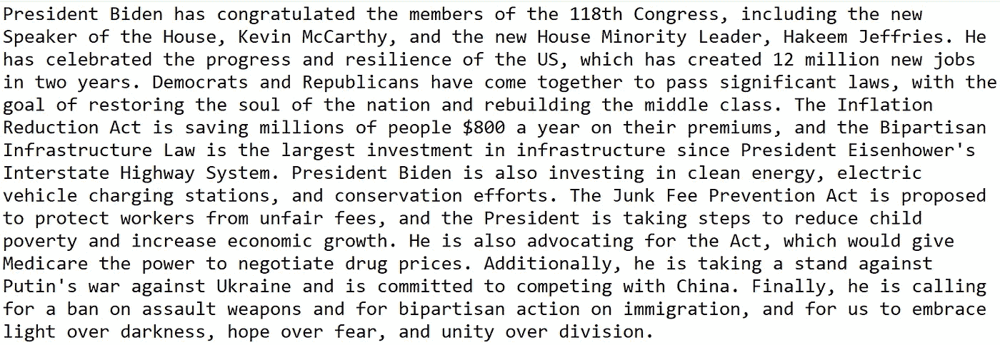
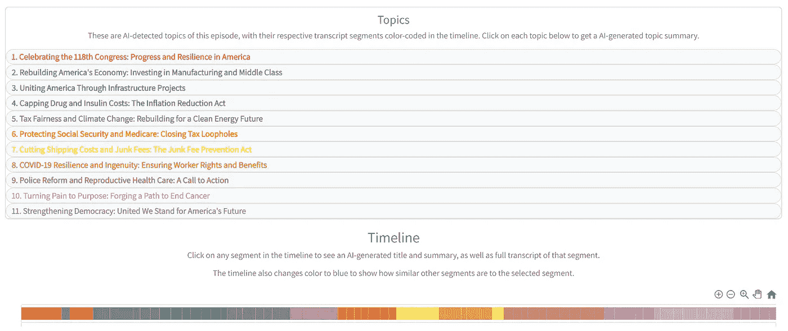

# 使用 NLP 和 AI 更好地总结播客文字记录和长文本

> 原文：[`towardsdatascience.com/summarize-podcast-transcripts-and-long-texts-better-with-nlp-and-ai-e04c89d3b2cb?source=collection_archive---------0-----------------------#2023-05-03`](https://towardsdatascience.com/summarize-podcast-transcripts-and-long-texts-better-with-nlp-and-ai-e04c89d3b2cb?source=collection_archive---------0-----------------------#2023-05-03)

## 为什么现有的总结方法存在缺陷，以及如何改进的详细步骤

[](https://iztham.medium.com/?source=post_page-----e04c89d3b2cb--------------------------------)[](https://towardsdatascience.com/?source=post_page-----e04c89d3b2cb--------------------------------) [Isaac Tham](https://iztham.medium.com/?source=post_page-----e04c89d3b2cb--------------------------------)

·

[关注](https://medium.com/m/signin?actionUrl=https%3A%2F%2Fmedium.com%2F_%2Fsubscribe%2Fuser%2F8177b59b4815&operation=register&redirect=https%3A%2F%2Ftowardsdatascience.com%2Fsummarize-podcast-transcripts-and-long-texts-better-with-nlp-and-ai-e04c89d3b2cb&user=Isaac+Tham&userId=8177b59b4815&source=post_page-8177b59b4815----e04c89d3b2cb---------------------post_header-----------) 发表在 [Towards Data Science](https://towardsdatascience.com/?source=post_page-----e04c89d3b2cb--------------------------------) · 11 分钟阅读 · 2023 年 5 月 3 日[](https://medium.com/m/signin?actionUrl=https%3A%2F%2Fmedium.com%2F_%2Fvote%2Ftowards-data-science%2Fe04c89d3b2cb&operation=register&redirect=https%3A%2F%2Ftowardsdatascience.com%2Fsummarize-podcast-transcripts-and-long-texts-better-with-nlp-and-ai-e04c89d3b2cb&user=Isaac+Tham&userId=8177b59b4815&source=-----e04c89d3b2cb---------------------clap_footer-----------)

--

[](https://medium.com/m/signin?actionUrl=https%3A%2F%2Fmedium.com%2F_%2Fbookmark%2Fp%2Fe04c89d3b2cb&operation=register&redirect=https%3A%2F%2Ftowardsdatascience.com%2Fsummarize-podcast-transcripts-and-long-texts-better-with-nlp-and-ai-e04c89d3b2cb&source=-----e04c89d3b2cb---------------------bookmark_footer-----------)

图片来源于 Unsplash。

像 GPT-4 这样的 LLM 已经席卷了世界，而生成文本模型特别擅长于长文本的摘要，如书籍或播客转录。然而，使用 LLM 来总结长文本的传统方法实际上存在根本性的缺陷。在这篇文章中，我将告诉你现有摘要方法的问题，并提出一种更好的摘要方法，实际上考虑了文本的结构！更棒的是，这种方法还会给我们文本的主要话题——一举两得！

我将引导你如何通过对现有方法进行几个小调整，在 Python 中轻松实现这一点。这是我们在[Podsmart](http://podsmartai.com)中使用的方法，我们新推出的 AI 驱动的播客摘要应用，帮助忙碌的知识分子节省听取的时间。

**现有解决方案的问题**

总结长文本的经典方法是**递归摘要**，其中长文本被平分成较短的块，这些块可以适应 LLM 的上下文窗口。每个块都被总结，摘要被连接在一起，然后传递给 GPT-3 进行进一步总结。这个过程会重复进行，直到获得所需长度的最终摘要。

然而，主要的缺点是现有实现，例如 LangChain 的[summarize chain using map_reduce](https://python.langchain.com/en/latest/modules/chains/index_examples/summarize.html)，将文本分割成块，而不考虑文本的逻辑和结构流。

例如，如果文章长 1000 字，200 字的块大小意味着我们将获得 5 个块。如果作者有几个主要点，其中第一个占据了前 250 字？最后 50 字会被放入第二个块中，与作者的下一个观点的文本一起处理，传递这个块给 GPT-3 的摘要器可能会导致遗漏第一个观点的潜在重要信息。此外，一些关键点可能比其他点更长，并且事先无法知道这一点。

另一种方法是“精炼”方法，它将每一段文本以及来自前几段的摘要传递给 LLM，这样随着看到更多的文本，摘要会逐步被精炼（请参见[这里](https://github.com/hwchase17/langchain/blob/master/langchain/chains/summarize/refine_prompts.py)的提示）。然而，该过程的顺序特性意味着它无法并行处理，且所需时间是线性的，远长于递归方法的对数时间。此外，直觉上初始部分的意义在最终摘要中会被过度代表。对于播客转录，其中前几分钟是与播客其余部分完全无关的广告，这成为一个绊脚石。因此，这种方法并不被广泛使用。

即使出现了更先进的语言模型，具有更长的上下文窗口，它仍然会在许多总结用例（整个书籍）中显得极其不足，因此不可避免地需要一些分块和递归总结。

本质上，如果总结过程未能识别文本的意义层次结构，并且与之不兼容，那么生成的总结很可能不足以准确传达作者的意图。

**更好的前进方式**

更好的解决方案是将总结和主题建模过程在同一个算法中一起处理。在这里，我们将递归总结的一个步骤的总结输出拆分为块，然后将这些块输入到下一步。我们可以通过将块在语义上进行主题聚类，并将主题传递到下一次总结迭代中来实现这一点。让我们来看看如何在 Python 中实现这一点吧！

**要求**

Python 包：

+   scipy — 用于余弦距离度量

+   networkx — 用于 Louvain 社区检测算法

+   langchain — 一个实用功能包，允许你调用像 OpenAI 的 GPT-3 这样的 LLMs。

**数据和预处理**

包含 Jupyter notebook 和数据的 GitHub 仓库可以在这里找到：[`github.com/thamsuppp/llm_summary_medium`](https://github.com/thamsuppp/llm_summary_medium)

我们今天总结的文本是 2023 年美国总统乔·拜登的国情咨文演讲。文本文件在 GitHub 仓库中，[这里](https://www.whitehouse.gov/briefing-room/speeches-remarks/2023/02/07/remarks-of-president-joe-biden-state-of-the-union-address-as-prepared-for-delivery/#:~:text=We%20are%20the%20only%20country,ever%20created%20in%20four%20years.) 是原始来源。演讲，像所有美国政府出版物一样，属于[公有领域](https://www.copyrightlaws.com/copyright-laws-in-u-s-government-works/)。请注意，确保你被允许使用源文本很重要——《Towards Data Science》发布了一些有用的提示，关于如何检查数据集的版权和许可证。

我们将原始文本拆分为句子，限制句子的最小长度为 20 个单词，最大长度为 80 个单词。

**创建块**

与其创建足够大以适应上下文窗口的块，我建议块的大小应为表达一个离散思想通常需要的句子数量。这是因为我们随后将嵌入这个文本块，本质上将其语义意义提炼成一个向量。我目前使用 5 个句子（但你可以尝试其他数量）。我倾向于在块之间有 1 句重叠，以确保连续性，使每个块都能包含一些关于前一个块的上下文信息。对于给定的文本文件，共有 65 个块，平均块长 148 个单词，范围从 46 到 197 个单词。

**获取每个块的标题和摘要**

现在，这是我开始偏离 LangChain 的总结链的地方。

**用 1 次 LLM 调用获得 2 个：标题 + 摘要**

我想要既获得一个信息丰富的标题，又要对每个块进行总结（标题的重要性会在后面变得更加明确）。因此，我创建了一个自定义提示，改编了 Langchain 的 [默认总结链提示](https://github.com/hwchase17/langchain/blob/master/langchain/chains/summarize/map_reduce_prompt.py)。正如你在 `map_prompt_template` 中看到的 - `text` 是一个将被插入到提示中的参数 - 这将是每个块的原始文本。我创建了一个 LLM，目前是 GPT-3，并创建了一个 LLMChain，将 LLM 与提示模板结合起来。然后，`map_llm_chain.apply()` 调用 GPT-3，并将插入文本的提示模板传入，返回每个块的标题和摘要，我将这些解析为字典输出。注意，所有块可以并行处理，因为它们彼此独立，从而带来了巨大的速度优势。

你可以使用 ChatGPT 以更便宜的价格和类似的性能，但我尝试过的时候，只有 GPT-3 LLM 能并行运行查询，而使用 ChatGPT 则是逐个运行，这非常缓慢，因为我通常会同时传入 ~100 个块。并行运行 ChatGPT 需要异步实现。

```py
def summarize_stage_1(chunks_text):

  # Prompt to get title and summary for each chunk
  map_prompt_template = """Firstly, give the following text an informative title. Then, on a new line, write a 75-100 word summary of the following text:
  {text}
  Return your answer in the following format:
  Title | Summary...
  e.g. 
  Why Artificial Intelligence is Good | AI can make humans more productive by automating many repetitive processes.
  TITLE AND CONCISE SUMMARY:"""
  map_prompt = PromptTemplate(template=map_prompt_template, input_variables=["text"])
  # Define the LLMs
  map_llm = OpenAI(temperature=0, model_name = 'text-davinci-003')
  map_llm_chain = LLMChain(llm = map_llm, prompt = map_prompt)
  map_llm_chain_input = [{'text': t} for t in chunks_text]
  # Run the input through the LLM chain (works in parallel)
  map_llm_chain_results = map_llm_chain.apply(map_llm_chain_input)
  stage_1_outputs = parse_title_summary_results([e['text'] for e in map_llm_chain_results])
  return {
    'stage_1_outputs': stage_1_outputs
  }
```

**嵌入块并按主题进行聚类**

在获得每个块的摘要后，我将使用 OpenAI 的嵌入将它们嵌入到 1536 维向量中。传统的递归总结方法不需要嵌入，因为它们按均匀长度任意拆分文本。对我们来说，我们的目标是通过将语义上相似的块分组到一起，来改进这一方法。

将文本按主题分组是 NLP 中一个研究较多的问题，许多传统方法如 Latent Dirichlet Allocation 早于深度学习时代。我记得在 2017 年使用 LDA 来为我大学报纸的文章进行聚类——它估计的速度非常慢，并且只使用词频，这不能捕捉语义含义。

现在，我们可以利用 OpenAI 的嵌入即服务 API 来获取在一秒钟内捕捉句子语义含义的嵌入。这里还有许多其他可能的嵌入模型，例如 HuggingFace 的 `sentence-transformers`，据报道它比 OpenAI 的嵌入表现更好，但这涉及到下载模型并在你自己的服务器上运行。

在获得块的嵌入向量后，我们将相似的向量聚集在一起。

我创建了一个块相似性矩阵，其中 `(i,j)th` 条目表示第 i 个和第 j 个块的嵌入向量之间的余弦相似性，即块之间的语义相似性。



国情咨文演讲的片段相似度矩阵。你可以看到某些片段组在语义上彼此相似——这正是话题检测算法随后会揭示的内容。图片由作者提供。

我们可以将其视为节点之间的相似度图，其中节点是片段，边的权重是两个片段之间的相似度。我们使用 Louvain 社区检测算法 从片段中检测话题。这是因为在图分析中，社区被定义为具有密集的内部社区连接和稀疏的社区间连接，这正是我们想要的：话题内的片段彼此非常语义相似，而每个片段与其他检测到的话题中的片段的语义相似度较低。

Louvain 社区检测算法有一个超参数叫做分辨率——较小的分辨率会导致较小的簇。此外，我增加了一个超参数 `proximity_bonus` —— 如果原始文本中片段的位置彼此接近，它会提高片段的相似度分数。你可以将此解释为将文本的时间结构视为先验（即，彼此接近的片段更可能在语义上相似）。我加入这个参数是为了避免检测到的话题中包含来自文本各处的片段，这种情况不太可能。该函数还试图最小化簇大小的方差，防止出现一个簇有 1 个片段而另一个簇有 13 个片段的情况。

对于国情咨文演讲，输出是 10 个簇，这些簇之间的连贯性很好。



检测到的国情咨文演讲的话题簇。图片由作者提供。


检测到的 Bloomberg Surveillance 播客转录的话题簇。紫色和橙色的话题识别了广告。图片由作者提供。

第二张图片是另一个播客节目中的话题聚类。正如你所见，开始和结束部分被检测为相同的话题，这在开头和结尾有广告的播客中很常见。一些话题，比如紫色的，也是不连续的——我们的算法允许这种情况很不错，因为文本可能回到之前提到的话题，而这也是传统文本拆分未考虑的另一种可能性。

**话题标题和总结**

现在，我们得到的是语义一致的话题，可以进入递归总结的下一步。对于这个例子，这将是最后一步，但对于更长的文本如书籍，你可以想象重复这个过程几次，直到剩下大约 10 个话题，其话题总结可以适应上下文窗口。

下一步涉及三个不同的部分。

**主题标题**：对于每个主题，我们生成了该主题中块的标题列表。我们将所有主题的标题列表传递给 GPT-3，并要求其聚合这些标题以得出每个主题的一个标题。我们对所有主题同时进行此操作，以防主题标题之间过于相似。以前，当我单独生成主题标题时，GPT-3 没有其他主题标题的上下文，因此出现了 7 个标题中有 4 个是‘联邦储备的货币政策’的情况。这就是我们希望生成块标题的原因——试图将所有块摘要放入上下文窗口在非常长的文本中可能不可行。

如下所示，标题看起来很好！描述性强，但彼此独特。

```py
1\. Celebrating American Progress and Resilience
2\. US Economy Strengthening and Inflation Reduction
3\. Inflation Reduction Act: Lowering Health Care Costs
4\. Confronting an Existential Threat: Making Big Corporations Pay
5\. Junk Fee Prevention Act: Stopping Unfair Charges
6\. COVID-19 Resilience and Vigilance
7\. Fighting Fraud and Public Safety
8\. United States' Support for Ukraine and Global Peace
9\. Progress Made in Healthcare and Gun Safety
10\. United States of America: A Bright Future
```

**主题摘要：** 没有新意，这涉及将每个主题的块摘要结合在一起，并要求 GPT-3 将其总结为主题摘要。

**最终摘要：** 为了得到文本的总体摘要，我们再次将主题摘要连接在一起，并提示 GPT-3 进行总结。



国情咨文的最终摘要。图像由作者提供。

**总结**

我们的方法有哪些好处？

文本被分层拆分为主题、块和句子。随着层级的深入，我们得到越来越详细和具体的摘要，从最终摘要，到每个主题的摘要，再到每个块的摘要。

正如我上面提到的，摘要准确地捕捉了文本的语义结构——其中有一个总体主题，分成几个主要主题，每个主题包含若干关键思想（块），确保在各层摘要中保留了关键信息。

这比仅仅提供总体摘要更具灵活性。不同的人对文本的不同部分更感兴趣，因此他们会选择适合自己需求的详细程度。

当然，这需要将生成的摘要与直观且连贯的界面配对，该界面可视化文本的层级特性。此类可视化的一个示例见 Podsmart—— [点击这里](https://www.podsmartai.com/examples/26e50d5d) 查看演讲的互动摘要。



提取的主题及其时间线的可视化。图像由作者提供。

请注意，这并不会显著增加 LLM 的费用——我们仍然将与传统方法相同的输入传递给 LLM，但我们获得了更丰富的摘要。

**TLDR** —— 这里是生成优质文本摘要的秘密法宝

1.  语义一致的主题——通过对文本的小块进行语义嵌入并按语义相似性拆分文本

1.  从数据块中获取标题和摘要——这需要自定义提示，而不是使用默认的 LangChain 摘要链

1.  校准 Louvain 社区检测算法——如分辨率和接近度奖励等超参数确保生成的话题簇是合理的

1.  不同的话题标题——同时生成所有话题标题，这需要块标题

再次提醒，你可以在 [GitHub 仓库](https://github.com/thamsuppp/llm_summary_medium) 查看整个源代码

如果你觉得这篇文章对你有帮助：

1.  请查看我在 Medium 上的其他文章：作为数据科学家构建 AI 应用的技术提示、[使用深度学习生成音乐](https://medium.com/towards-data-science/generating-music-using-deep-learning-cb5843a9d55e)

1.  试试我的 [app](http://podsmartai.com)——[Podsmart](http://podsmartai.com) 可以转录和总结播客和 YouTube 视频，为忙碌的知识分子节省听音时间

1.  关注我在 [LinkedIn](https://www.linkedin.com/in/isaacthamhy/) 或 [Twitter/X](https://twitter.com/thamsuppp)，通过消息或评论与我联系！我很乐意讨论关于数据科学和 AI 的各种想法

感谢阅读！
