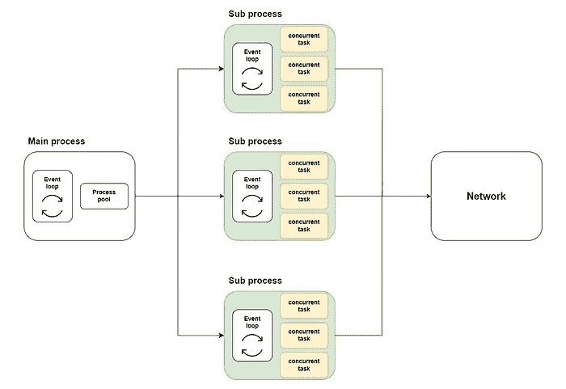
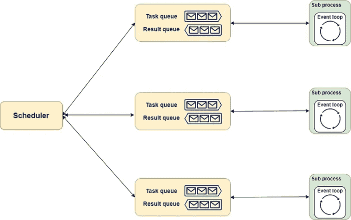
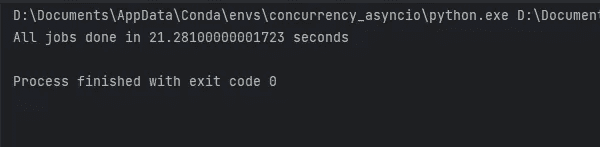
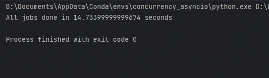

# 用`aiomultiprocess`超级增强你的 Python Asyncio：一份全面指南

> 原文：[`towardsdatascience.com/supercharge-your-python-asyncio-with-aiomultiprocess-a-comprehensive-guide-571ee0e2f416`](https://towardsdatascience.com/supercharge-your-python-asyncio-with-aiomultiprocess-a-comprehensive-guide-571ee0e2f416)

## [PYTHON TOOLBOX](https://medium.com/@qtalen/list/python-toolbox-4289824c6407)

## 利用`asyncio`和`multiprocessing`的力量来加速你的应用程序

[](https://qtalen.medium.com/?source=post_page-----571ee0e2f416--------------------------------)[](https://towardsdatascience.com/?source=post_page-----571ee0e2f416--------------------------------) [Peng Qian](https://qtalen.medium.com/?source=post_page-----571ee0e2f416--------------------------------)

·发表于[Towards Data Science](https://towardsdatascience.com/?source=post_page-----571ee0e2f416--------------------------------) ·阅读时间 9 分钟·2023 年 7 月 5 日

--


图片来源：作者创作，[Canva](https://www.canva.com/)

在这篇文章中，我将带你深入了解`aiomultiprocess`，一个结合了 Python `asyncio`和`multiprocessing`强大功能的库。

这篇文章将通过丰富的代码示例和最佳实践进行解释。

在文章结束时，你将理解如何利用 aiomultiprocess 的强大功能来增强你的 Python 应用程序，就像主厨带领一组厨师来准备一顿丰盛的宴席。

# 引言

想象一下你想在周末邀请你的同事们来一顿大餐。你会怎么做？

作为一名经验丰富的厨师，你肯定不会一次只做一道菜；那样太慢了。你会高效地利用时间，让多个任务同时进行。

例如，当你等待水开时，你可以离开去洗菜。这样，当水开时，你可以把菜放进锅里。这就是并发的魅力。

然而，食谱常常很残酷：你需要在做汤时不停搅拌；蔬菜需要洗净并切碎；你还需要烤面包、煎牛排等等。

当有很多菜需要准备时，你会感到不知所措。

幸运的是，你的同事们不会只是坐在那等着吃。他们会进厨房来帮助你，每多一个人就像增加一个工作进程。这就是多进程和并发的强大结合。

代码也是如此。即使使用 asyncio，你的 Python 应用程序是否仍然遇到瓶颈？你是否在寻找进一步提高并发代码性能的方法？如果是的话，`aiomultiprocess` 是你一直在寻找的答案。

# 如何安装和基本用法

## 安装

如果你使用 pip，按照如下方式安装：

```py
python -m pip install aiomultiprocess
```

如果你使用 Anaconda，从 conda-forge 安装：

```py
conda install -c conda-forge aiomultiprocess
```

## 基本用法

`aiomultiprocess` 由三个主要类组成：

`Process` 是其他两个类的基类，用于启动一个进程并执行协程函数。通常你不需要使用这个类。

`Worker` 用于启动一个进程，执行一个协程函数，并返回结果。我们也不会使用这个类。

`Pool` 是我们将重点关注的核心类。与 `multiprocessing.Pool` 类似，它启动一个进程池，但其上下文需要使用 `async with` 来管理。我们将使用 Pool 的两个方法：`map` 和 `apply`。

`map` 方法接受一个协程函数和一个可迭代对象。`Pool` 将遍历可迭代对象，并将协程函数分配给不同的进程运行。`map` 方法的结果可以使用 `async for:` 进行异步迭代

```py
import asyncio
import random

import aiomultiprocess

async def coro_func(value: int) -> int:
    await asyncio.sleep(random.randint(1, 3))
    return value * 2

async def main():
    results = []
    async with aiomultiprocess.Pool() as pool:
        async for result in pool.map(coro_func, [1, 2, 3]):
            results.append(result)

        print(results)

if __name__ == "__main__":
    asyncio.run(main())
```

`apply` 方法接受一个协程函数和该函数所需的参数元组。根据调度器的规则，`Pool` 将协程函数分配给适当的进程进行执行。

```py
import asyncio
import random

import aiomultiprocess

async def coro_func(value: int) -> int:
    await asyncio.sleep(random.randint(1, 3))
    return value * 2

async def main():
    tasks = []
    async with aiomultiprocess.Pool() as pool:
        tasks.append(pool.apply(coro_func, (1,)))
        tasks.append(pool.apply(coro_func, (2,)))
        tasks.append(pool.apply(coro_func, (3,)))

        results = await asyncio.gather(*tasks)
        print(results)  # Output: [2, 4, 6]

if __name__ == "__main__":
    asyncio.run(main())
```

# 实现原理和实际示例

## aiomultiprocess.Pool 的实现原理

在上一篇文章中，我解释了如何将 asyncio 任务分布到多个 CPU 核心上。

通用方法是在主进程中使用 `[loop.run_in_executor](https://docs.python.org/3/library/asyncio-eventloop.html#asyncio.loop.run_in_executor)` 启动一个进程池。然后，在进程池中的每个进程中创建一个 [asyncio 事件循环](https://docs.python.org/3/library/asyncio-eventloop.html#)，并在各自的循环中执行协程函数。示意图如下：



此图展示了 asyncio 和 multiprocessing 的集成方式。图片由作者提供

`aiomultiprocess.Pool` 的实现类似。它包括 `scheduler`、`queue` 和 `process` 作为其三个组件。

+   `scheduler` 可以理解为大厨，负责以合适的方式将任务分配给每个厨师。当然，你可以雇佣（实现）一个适合你需求的大厨。

+   `queue` 就像厨房的流水线。严格来说，它包括一个订单线和一个交付线。大厨通过订单线将菜单传递给厨师，厨师通过交付线返回完成的菜肴。

+   `process` 就像餐厅里的厨师。他们根据分配同时处理几个菜肴。每当一道菜准备好时，它将按照分配的顺序交付。

整个示意图如下所示：



Aiomultiprocess 由三个组件组成：调度器、队列和进程。图片由作者提供

## 现实世界的示例

基于之前提供的介绍，您现在应该理解如何使用`aiomultiprocess`。让我们深入一个现实世界的示例，以体验它的强大功能。

首先，我们将使用远程调用和循环计算来模拟实际数据检索和处理过程。这个方法展示了 IO 绑定和 CPU 绑定任务通常混合在一起，它们之间的界限并不那么明确。

```py
import asyncio
import random
import time

from aiohttp import ClientSession
from aiomultiprocess import Pool

def cpu_bound(n: int) -> int:
    result = 0
    for i in range(n*100_000):
        result += 1
    return result

async def invoke_remote(url: str) -> int:
    await asyncio.sleep(random.uniform(0.2, 0.7))
    async with ClientSession() as session:
        async with session.get(url) as response:
            status = response.status
            result = cpu_bound(status)
            return result
```

接下来，我们将使用传统的 asyncio 方法调用此任务 30 次作为基线：

```py
async def main():
    start = time.monotonic()
    tasks = [asyncio.create_task(invoke_remote("https://www.example.com"))
             for _ in range(30)]
    await asyncio.gather(*tasks)
    print(f"All jobs done in {time.monotonic() - start} seconds")

if __name__ == "__main__":
    asyncio.run(main())
```



代码使用传统的 asyncio 方法运行。截图由作者提供

代码执行结果如图所示，耗时约 21 秒。现在让我们看看 aiomultiprocess 能带来多大的改进。

使用 aiomultiprocess 很简单。原始的并发代码无需修改。您只需调整主方法中的代码，使其在 Pool 内部运行：

```py
async def main():
    start = time.monotonic()
    async with Pool() as pool:
        tasks = [pool.apply(invoke_remote, ("https://www.example.com",)) 
                 for _ in range(30)]
        await asyncio.gather(*tasks)
    print(f"All jobs done in {time.monotonic() - start} seconds")

if __name__ == "__main__":
    asyncio.run(main())
```



仅需使用修改后的 aiomultiprocess 版本。截图由作者提供

如您所见，使用 aiomultiprocess 的代码在我的笔记本电脑上只需 14 秒即可完成。性能提升在更强大的计算机上会更大。

# 详细的最佳实践

最后，基于我的经验，我将分享一些更实用的最佳实践。

## 仅使用池

尽管`aiomultiprocess`也提供了`Process`和`Worker`类供我们选择，但由于创建进程会消耗大量资源，我们应始终使用`Pool`类以确保最大效率。

## 如何使用队列

在上一篇文章中，我解释了如何使用`asyncio.Queue`实现生产者-消费者模式来平衡资源和性能。

在`aiomultiprocess`中，我们也可以使用队列。然而，由于我们处于进程池中，不能使用`asyncio.Queue`。同时，我们也不能在进程池中直接使用`multiprocessing.Queue`。

在这种情况下，您应该使用`multiprocessing.Manager().Queue()`来创建队列，代码如下：

```py
import random
import asyncio
from multiprocessing import Manager
from multiprocessing.queues import Queue

from aiomultiprocess import Pool

async def worker(name: str, queue: Queue):
    while True:
        item = queue.get()
        if not item:
            print(f"worker: {name} got the end signal, and will stop running.")
            queue.put(item)
            break
        await asyncio.sleep(random.uniform(0.2, 0.7))
        print(f"worker: {name} begin to process value {item}", flush=True)

async def producer(queue: Queue):
    for i in range(20):
        await asyncio.sleep(random.uniform(0.2, 0.7))
        queue.put(random.randint(1, 3))
    queue.put(None)

async def main():
    queue: Queue = Manager().Queue()
    producer_task = asyncio.create_task(producer(queue))

    async with Pool() as pool:
        c_tasks = [pool.apply(worker, args=(f"worker-{i}", queue)) 
                   for i in range(5)]
        await asyncio.gather(*c_tasks)

        await producer_task

if __name__ == "__main__":
    asyncio.run(main())
```

## 使用`initializer`初始化资源

假设您需要在协程方法中使用`aiohttp`会话或数据库连接池，但由于这些对象无法被序列化，因此我们不能在主进程中创建任务时传递参数。

另一种选择是定义一个全局对象和一个初始化方法。在这个初始化方法中，访问全局对象并进行初始化。

就像 `[multiprocessing.Pool](https://docs.python.org/3/library/multiprocessing.html#module-multiprocessing.pool)` 一样，`aiomultiprocess.Pool` 在初始化时可以接受一个初始化方法和相应的初始化参数。每个进程启动时都会调用这个方法来完成初始化：

```py
import asyncio

from aiomultiprocess import Pool
import aiohttp
from aiohttp import ClientSession, ClientTimeout

session: ClientSession | None = None

def init_session(timeout: ClientTimeout = None):
    global session
    session = aiohttp.ClientSession(timeout=timeout)

async def get_status(url: str) -> int:
    global session
    async with session.get(url) as response:
        status_code = response.status
        return status_code

async def main():
    url = "https://httpbin.org/get"
    timeout = ClientTimeout(2)
    async with Pool(initializer=init_session, initargs=(timeout,)) as pool:
        tasks = [asyncio.create_task(pool.apply(get_status, (url,))) 
                 for i in range(3)]
        status = await asyncio.gather(*tasks)
    print(status)

if __name__ == "__main__":
    asyncio.run(main())
```

## 异常处理和重试

尽管 `aiomultiprocess.Pool` 提供了 `exception_handler` 参数来帮助处理异常，但如果你需要更多的灵活性，你需要将它与 `asyncio.wait` 结合使用。关于 `asyncio.wait` 的使用，你可以参考 我之前的文章。

使用 `asyncio.wait`，你可以获取遇到异常的任务。提取任务后，你可以进行一些调整，然后重新执行任务，如下代码所示：

```py
import asyncio
import random

from aiomultiprocess import Pool

async def worker():
    await asyncio.sleep(0.2)
    result = random.random()
    if result > 0.5:
        print("will raise an exception")
        raise Exception("something error")
    return result

async def main():
    pending, results = set(), []
    async with Pool() as pool:
        for i in range(7):
            pending.add(asyncio.create_task(pool.apply(worker)))
        while len(pending) > 0:
            done, pending = await asyncio.wait(pending, return_when=asyncio.FIRST_EXCEPTION)
            print(f"now the count of done, pending is {len(done)}, {len(pending)}")
            for result in done:
                if result.exception():
                    pending.add(asyncio.create_task(pool.apply(worker)))
                else:
                    results.append(await result)
        print(results)

if __name__ == "__main__":
    asyncio.run(main())
```

## 使用 Tenacity 进行重试

当然，我们还有更灵活和强大的异常处理和重试选项，比如使用 `Tenacity` 库，我在 这篇文章 中解释了它。

使用 `Tenacity`，上述代码可以大大简化。你只需要在协程方法上添加一个装饰器，该方法在抛出异常时会自动重试。

```py
import asyncio
from random import random

from aiomultiprocess import Pool
from tenacity import *

@retry()
async def worker(name: str):
    await asyncio.sleep(0.3)
    result = random()
    if result > 0.6:
        print(f"{name} will raise an exception")
        raise Exception("something wrong")
    return result

async def main():
    async with Pool() as pool:
        tasks = pool.map(worker, [f"worker-{i}" for i in range(5)])
        results = await tasks
        print(results)

if __name__ == "__main__":
    asyncio.run(main())
```

## 使用 tqdm 指示进度

我喜欢 `tqdm`，因为它总是能告诉我在屏幕前等待时代码执行的进度。这篇文章 也解释了如何使用它。

由于 `aiomultiprocess` 使用 asyncio 的 API 等待任务完成，它也与 `tqdm` 兼容：

```py
import asyncio
from random import uniform

from aiomultiprocess import Pool
from tqdm.asyncio import tqdm_asyncio

async def worker():
    delay = uniform(0.5, 5)
    await asyncio.sleep(delay)
    return delay * 10

async def main():
    async with Pool() as pool:
        tasks = [asyncio.create_task(pool.apply(worker)) for _ in range(1000)]
        results = await tqdm_asyncio.gather(*tasks)

        print(results[:10])

if __name__ == "__main__":
    asyncio.run(main())
```

# 结论

运行 asyncio 代码就像厨师做饭一样。即使你可以通过并发执行不同的任务来提高效率，但最终你还是会遇到瓶颈。

在这一点上，最简单的解决方案是增加更多的厨师，以提高烹饪过程的并行性。

`Aiomultiprocess` 是一个强大的 Python 库。它通过允许并发任务在多个进程中运行，完美地突破了 asyncio 单线程特性造成的性能瓶颈。

本文中 `aiomultiprocess` 的使用和最佳实践基于我的工作经验。如果你对任何方面感兴趣，欢迎评论和参与讨论。

除了提高代码执行速度和性能，使用各种工具来提高工作效率也是一种性能提升：


[彭茜](https://qtalen.medium.com/?source=post_page-----571ee0e2f416--------------------------------)

## Python 工具箱

[查看列表](https://qtalen.medium.com/list/python-toolbox-4289824c6407?source=post_page-----571ee0e2f416--------------------------------)6 个故事！Seaborn 0.12：对象接口和声明式图形的深度指南[](https://qtalen.medium.com/membership?source=post_page-----571ee0e2f416--------------------------------) [## 通过我的推荐链接加入 Medium - 彭乾

### 作为 Medium 的会员，您的部分会员费用会分配给您阅读的作者，并且您可以完全访问每一个故事……

[qtalen.medium.com](https://qtalen.medium.com/membership?source=post_page-----571ee0e2f416--------------------------------)

本文最初发表于：[`www.dataleadsfuture.com/supercharge-your-python-asyncio-with-aiomultiprocess-a-comprehensive-guide/`](https://www.dataleadsfuture.com/supercharge-your-python-asyncio-with-aiomultiprocess-a-comprehensive-guide/)
