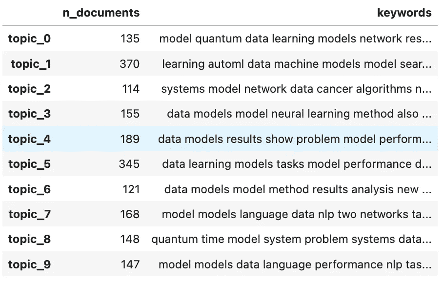

# Python 中的监督与非监督主题建模方法

> 原文：[`towardsdatascience.com/supervised-unsupervised-approach-to-topic-modelling-in-python-d03e0b9da1dc`](https://towardsdatascience.com/supervised-unsupervised-approach-to-topic-modelling-in-python-d03e0b9da1dc)

## 从头开始在 Python 中构建主题建模管道

[](https://vatsal12-p.medium.com/?source=post_page-----d03e0b9da1dc--------------------------------)[](https://towardsdatascience.com/?source=post_page-----d03e0b9da1dc--------------------------------) [Vatsal](https://vatsal12-p.medium.com/?source=post_page-----d03e0b9da1dc--------------------------------)

·发表在 [Towards Data Science](https://towardsdatascience.com/?source=post_page-----d03e0b9da1dc--------------------------------) ·11 分钟阅读·2023 年 1 月 31 日

--


图片来源于 [Unsplash](https://unsplash.com/photos/c9OfrVeD_tQ) 由 [v2osk](https://unsplash.com/@v2osk)

本文将提供关于主题建模及其相关应用的高层次直观理解。将深入探讨解决需要主题建模的问题的各种方法，以及如何在监督和非监督方式下解决这些问题。我强调了数据和初始问题的重构，以便可以通过多种方法执行解决方案。下表详细说明了本文的内容。

**目录**

+   什么是主题建模？

+   主题建模的应用

+   监督学习与非监督学习

+   问题拆解

+   需求

+   数据

    - 加载数据

    - 清洗与预处理

    - 数据统计

+   非监督学习

    - 训练模型

    - 可视化

    - 主题分析

+   监督学习

    - 关键词统计

    - 生成标签

    - 训练模型

    - 评估

+   结论

+   资源

# 什么是主题建模？

主题建模是自然语言处理（NLP）或文本挖掘的一个子领域，旨在建立模型以解析各种文本，以识别与文本相关的主题。这些模型有助于识别与文档相关的大致主题，适用于大规模的文档处理。它是理解和组织大量文本数据的有用工具，并能帮助组织理解大量非结构化数据。

# 主题建模的应用

+   文档分类 — 将文档归类为各种主题

+   [社交媒体分析](https://medium.com/towards-data-science/mining-modelling-character-networks-part-i-e37e4878c467) — 识别用户在社交媒体上发帖的主要话题

+   [推荐系统](https://medium.com/towards-data-science/recommendation-systems-explained-a42fc60591ed) — 根据用户感兴趣的主题推荐产品。一个常见的应用是根据用户感兴趣的主题推荐定制广告。例如，如果用户对汽车感兴趣，他们可能会喜欢来自像本田/丰田这样有前景的汽车品牌的广告。

# 监督学习与非监督学习

监督学习与非监督学习之间有明确的区别。监督学习涉及在给定标签的情况下训练模型以映射到初始数据集。相反，非监督学习涉及在没有标签信息的情况下训练模型。主题建模通常是非监督学习方法，但本文将涵盖监督学习和非监督学习方法的主题建模。

监督学习方法将包括二分类。二分类是将输入数据映射到恰好 2 个目标，而多类分类是将输入数据映射到超过 2 个目标。二分类主题模型将指示输入文章是否映射到我们已标记的主题中。多类分类主题模型将识别该文章最有可能归属的主题。本文将展示二分类方法的实现。

# 问题分析

本文旨在解决的问题是，给定论文的摘要，识别与之相关的主要主题。根据识别出的主题，用户可以推断这篇论文是否对他们感兴趣。我们将使用 arXiv 数据库查询并获取多个领域的研究论文。

# 需求

以下是跟随本教程所需的模块及版本。我的环境中的 Python 版本是 `3.10.0.` 如果执行过程中发生错误，请注意您引用的模块的版本，因为这是跨平台协作中的常见问题。

```py
pandas>=1.3.5
numpy>=1.22.4
arxiv>=1.4.2
Unidecode>=1.3.6
nltk>=3.7
gensim>=4.2.0
wordcloud>=1.8.2.2
pyLDAvis==2.1.2
```

如果您尚未安装 gensim 包，[这里](https://pypi.org/project/gensim/) 是通过命令行安装它的库文档。类似地，您可以按照以下说明在 Python 中安装 arXiv 包，[这里](https://pypi.org/project/arxiv/) 是相关文档。

# 数据

根据 arXiv 的 API 使用条款，它是完全免费的，并且鼓励使用。有关使用条款的更多信息，请参考其文档，您可以在[这里](https://arxiv.org/help/api/tou)找到。

在本文中，我将展示如何通过 Python 访问 API 来收集构建今天模型所需的以下信息。如果你想通过其他编程语言访问这个 API，或者想了解如何使用 API 的更多信息，我强烈建议你参考他们的文档，你可以在[这里](https://arxiv.org/help/api/user-manual)找到。

## 加载数据

下列代码包括导入所需模块、设置在整个项目中使用的常量以及定义一个函数，通过一组提示从 arXiv 查询和加载数据。

该脚本应生成一个类似于下方截图的 pandas DataFrame：


从 arXiv 查询的数据。图像由作者提供。

## 清理与预处理

现在我们可以清理和预处理与每篇文章相关的摘要信息。处理文本数据的清理和预处理阶段对于优化底层模型的性能至关重要。你喂给模型的数据质量越低，模型在生产环境中的性能也会越低。此外，你清理、预处理和减少的数据量将影响模型的训练和推理时间。这将整体提高你运行的实验和生产中的性能。话题建模算法依赖于文档中词语的频率来识别模式和主题，因此任何传入的无关信息都可能扭曲结果。

我们将进行的文本预处理包括以下内容：

+   对输入数据进行 Unicode 编码。这在处理不同语言的数据时至关重要。它会将`à`转换为`á`，这在清理阶段非常关键。

+   将文本转换为小写，使所有大写字符都变为小写。

我们将进行的文本清理包括以下内容：

+   移除标点符号

+   移除停用词

在删除停用词时，请注意你正在处理的数据。你想删除停用词的原因是因为它们不会提供任何新信息，并且有助于优化模型的性能。不想删除停用词的情况是当句子周围的上下文很重要时。不删除停用词对于情感分析和摘要等任务很有用。然而，对于我们的话题建模用例，我们可以继续删除停用词。

清理后的数据输出应生成一个名为`cleaned_summary`的新列。结果数据集应类似于下图所示的样子。


通过清理和预处理摘要列转换初始数据集。图像由作者提供。

## 数据统计

现在让我们调查与清理后的数据集相关的词频分布，并识别与词频相关的潜在分布。


基于从 arXiv 中的研究论文样本的清理总结的字数分布。图片由作者提供。

基于此，我们从 arXiv 查询的 1548 篇文章中，大约有 700 篇文章少于 100 个字。这对应于 45.1% 的数据少于 100 个字。

# 无监督学习

我们将使用 LDA 作为 Python 中无监督学习方法的主题建模算法，用于识别研究论文的主题。LDA 是一种常见的主题建模方法，大型组织如 AWS 提供的 `Comprehend` 工具也使用这种方法。这种方法将基本展示 AWS 用于处理文档并以无监督方式生成每个主题的后台代码。至少这样，你就不必为此付费（除了计算成本——这取决于你处理的数据量）。

## 训练模型

## 可视化

现在我们已经拥有与我们准备训练的数据相关的模型对象。我们可以创建几个独特的可视化，这将有助于提供与模型为每篇文章识别的主题和关键词相关的见解。

我们将使用 `pyLDAvis` 库进行以下可视化。请注意，这个库的较新版本不支持在 JupyterNotebooks 中进行可视化。我强烈建议安装文章要求部分中提到的特定版本 `2.1.2`。[这个](https://stackoverflow.com/questions/66096149/pyldavis-visualization-from-gensim-not-displaying-the-result-in-google-colab) Stack Overflow 线程突出了在不同版本中生成此可视化的难度。


LDA 主题可视化，显示每个主题的前 30 个最频繁的术语。图片由作者提供。


LDA 模型识别的主题词云。图片由作者提供。

通过上述脚本创建了 10 个词云图像，但本文仅展示了 2 个。如你所见，主题之间存在相当大的重叠（例如模型和模型等术语）。基于此，可以看出需要进一步预处理和清理，例如提取词干，去除像 `use, show, first, also, may, one, number, etc...` 这样的停用词。模型开发过程是一个迭代过程，但这高度突显了将高质量数据输入模型的重要性。

尽管如此，我们也可以看到，采用这种方法识别的两个主题是相当独特的。第一个主题似乎深入探讨了围绕量子计算和深度学习的内容，而第二个主题则集中于机器学习、自动化机器学习和数据。

## 主题分析


学习到的主题频率，阈值大于 0.3。图像由作者提供。

看起来模型训练所用的大多数文章属于第一个和第五个主题。


前 30 个词的词频。图像由作者提供。

显然，根据这些结果，似乎可以进行进一步的数据清理和预处理。由于`数据、模型和模型`是最常见的术语，我们不希望模型受到这些词的影响，因为它们不够具有区分性。



与每个主题相关的顶级关键词及其文档计数。图像由作者提供。

如前两张图所证实，最常预测的主题是 5 和 0。这两个主题使用了诸如`模型`和`数据`之类的词汇，这些词在进一步迭代中应该被移除。这是该方法的模型开发过程的第一次迭代。投入生产的模型永远不会是你训练的第一个模型，必须利用前几次迭代模型的结果来影响未来迭代中模型所需的变化。

# 监督学习

主题建模的监督学习方法将包括生成主题标签来训练一个二分类模型。这可以通过识别我们感兴趣的标记和预测的主题的相关关键词来完成。我将主要关注`机器学习、自然语言处理（NLP）和数学`这三个主题。

这是我为每个主题识别出的关键词集。这个列表绝不是详尽无遗，但足以作为起点。

```py
topics_dct = {
    'machinelearning': [
        'machinelearning', 'clustering', 'classification', 'regression',
        'supervised machine learning', 'unsupervised machine learning'
    ],
    'mathematics': [
        'mathematics', 'graph theory', 'combinatorics', 'calculus',
        'linear algebra', 'probability', 'statistics', 'trigonometry', 
        'topology', 'differential equations', 'differentiate', 'algebra'
    ],
    'nlp': [
        'natural language', 'topic modelling', 'sentiment analysis', 
        'translation', 'chat bot', 'text analysis', 'text mining', 
        'semantic analysis', 'summarization', 'linguistic processing', 
        'language recognition', 'text processing', 'language models', 
        'linguistic', 'sequencetosequence', 'neural machine translation', 
        'word embeddings', 'word2vec'
    ]
}
```

我们可以解析与每篇文章相关的清理后的摘要，识别出包含我们感兴趣的关键词的摘要，并将其链接回这些关键词所映射的原始主题。这将为上述每个主题提供标签。我们可以使用 TF-IDF 将输入摘要转换为与输入模型的文章相对应的向量。

## 关键词统计


具有相应关键词计数的文章计数。图像由作者提供。


文章中关键词出现的频率。图像由作者提供。

## **生成标签**


从我们处理的 1548 篇文档中，根据上述定义的主题相关关键词，这是拥有正标签的文档计数。图像由作者提供。


标签生成后的数据框。图像由作者提供。

## **训练模型**


上述脚本将生成以下 sklearn 管道，对应于我们上面生成的清理后的摘要和标签。图片由作者提供。

## 评价

由于我们在训练阶段生成了一个保留集，我们现在可以将训练好的模型应用于保留集，以识别模型的性能。请注意，由于我们处理的是一个小样本数据且存在类别不平衡，训练模型很可能会过拟合。这可以通过增加我们标记的文章数量并用来训练模型来比较容易解决。这意味着我们应该查询 arXiv 以获取更大的数据集，并生成更好的关键词和标记文章。如果你处理的是不同的数据集，这可能不是一个容易解决的问题。

我也强烈建议你尝试多个分类模型，而不仅仅是梯度提升分类器。如前所述，迭代是机器学习开发周期的一个重要部分！

# 结论

这篇文章旨在为读者提供一个教程，旨在提供监督学习和无监督学习两种主题建模方法。我希望我能够概述在查看底层数据时思维方式的变化，以及这种变化如何影响和拓宽解决特定问题的方法。

我还希望这篇文章概述了机器学习中迭代的重要性。投入生产的模型永远不会是你训练的第一个模型，重要的是利用之前迭代模型的结果来影响未来迭代中模型所需的变更。

我希望也能清楚的是，无监督学习方法的结果可以影响监督学习方法。这也可能引发一种半监督学习方法来进行主题建模，你可以在 LDA 模型的结果上训练一个二分类模型。

如果你想下载与本教程相关的 jupyter notebook，我已经在[这里](https://github.com/vatsal220/medium_articles/blob/main/topic_modelling/topic_model.ipynb)提供了它。

# 资源

+   [`en.wikipedia.org/wiki/Topic_model`](https://en.wikipedia.org/wiki/Topic_model)

+   [`docs.aws.amazon.com/comprehend/latest/dg/topic-modeling.html`](https://docs.aws.amazon.com/comprehend/latest/dg/topic-modeling.html)

如果你喜欢今天我写的文章，这里还有一些我写的关于自然语言处理的其他文章，你可能也会喜欢！

[](/text-similarity-w-levenshtein-distance-in-python-2f7478986e75?source=post_page-----d03e0b9da1dc--------------------------------) ## Python 中的文本相似度与 Levenshtein 距离

### 使用 Python 构建剽窃检测管道

towardsdatascience.com [](/word2vec-explained-49c52b4ccb71?source=post_page-----d03e0b9da1dc--------------------------------) ## 解释 Word2Vec

### 解释 Word2Vec 的直觉及其在 Python 中的实现

towardsdatascience.com [](/text-summarization-in-python-with-jaro-winkler-and-pagerank-72d693da94e8?source=post_page-----d03e0b9da1dc--------------------------------) ## 使用 Jaro-Winkler 和 PageRank 进行 Python 文本摘要

### 使用 Jaro-Winkler 和 PageRank 构建文本摘要器

towardsdatascience.com [](/identifying-tweet-sentiment-in-python-7c37162c186b?source=post_page-----d03e0b9da1dc--------------------------------) ## 用 Python 识别推文情感

### 如何使用 Tweepy 和 Textblob 识别推文情感

towardsdatascience.com
