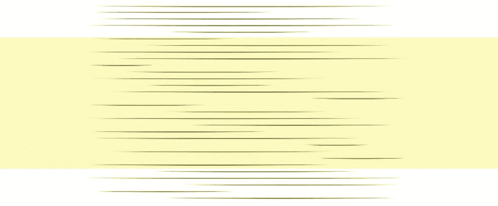
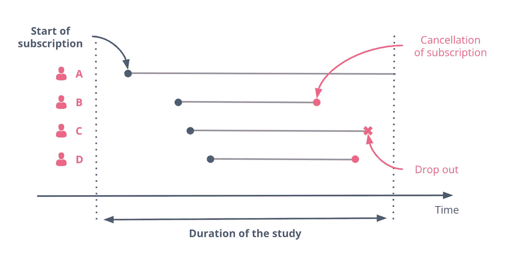
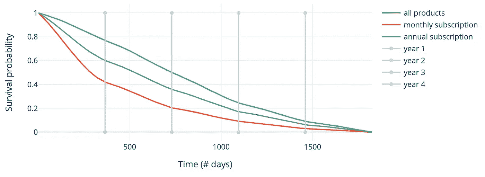
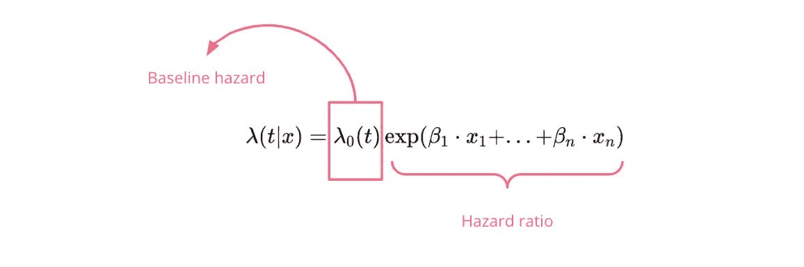
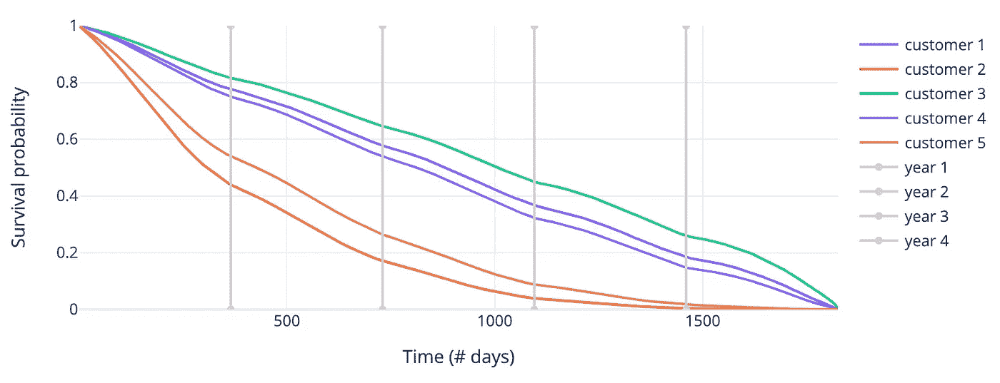
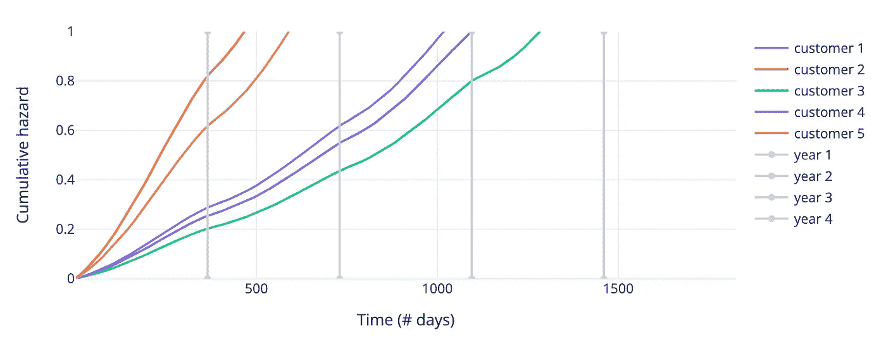
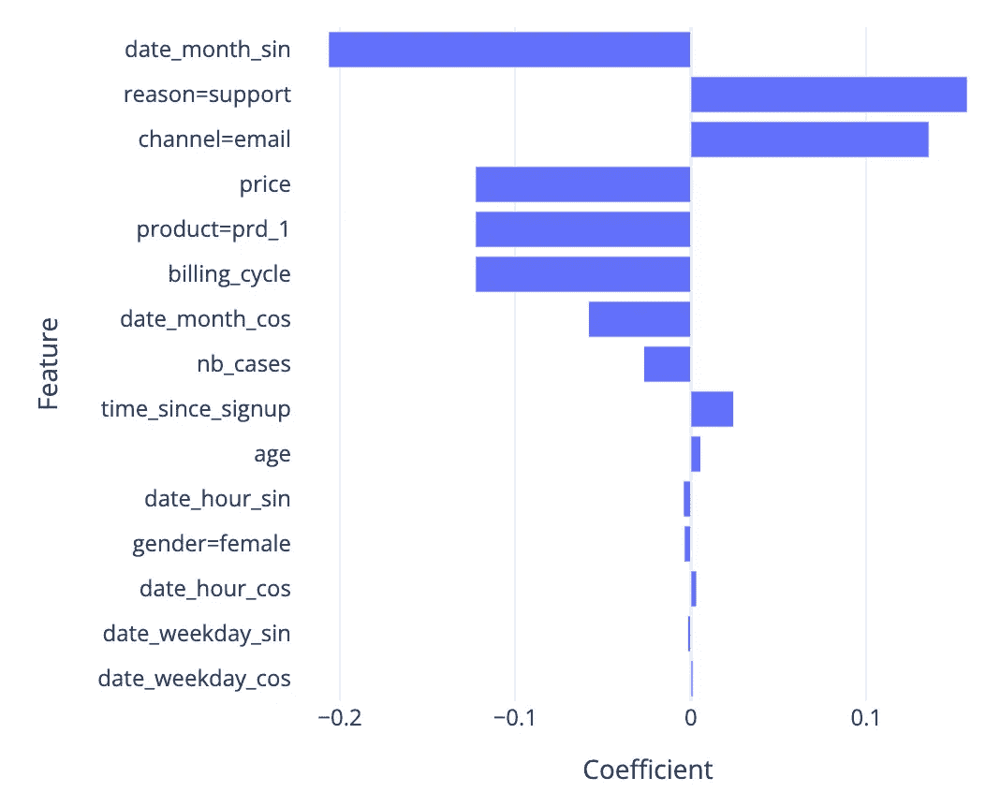
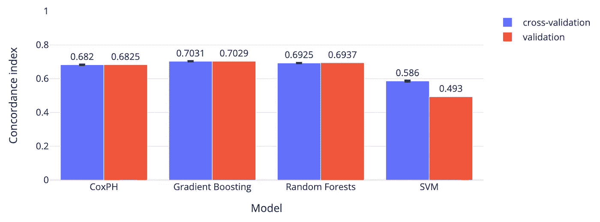
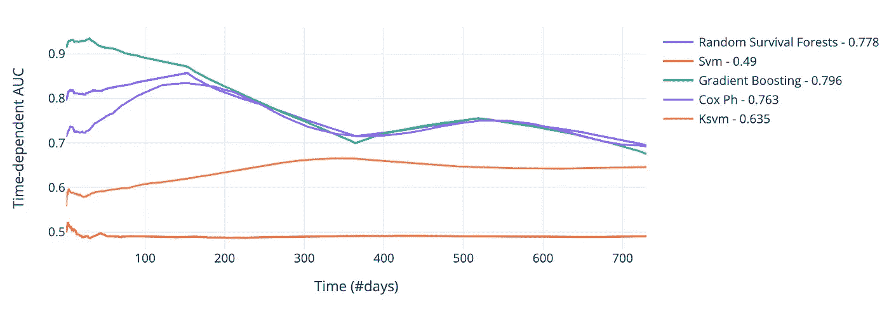

# 生存分析：用机器学习预测事件时间（第一部分）

> 原文：[`towardsdatascience.com/survival-analysis-predict-time-to-event-with-machine-learning-part-i-ba52f9ab9a46`](https://towardsdatascience.com/survival-analysis-predict-time-to-event-with-machine-learning-part-i-ba52f9ab9a46)

作者插图

## 客户流失预测的实际应用

 [Lina Faik](https://linafaik.medium.com/?source=post_page-----ba52f9ab9a46--------------------------------)

·发布于 [Towards Data Science](https://towardsdatascience.com/?source=post_page-----ba52f9ab9a46--------------------------------) ·11 分钟阅读·2023 年 2 月 9 日

--

预测事件发生的概率很好，预测事件发生前的剩余时间更好！

以客户流失为例。如果不是预测客户在接下来的几个月内离开公司的概率，而是能够在接下来的几个月中多个时间点预测这一概率，这种方法的好处是显而易见的。它将使你能够更有效地预测和优先考虑营销行动，*最终*减少流失率。

这正好属于**生存分析**的领域，也称为事件时间分析。它指的是一种学习框架和一套技术，用于根据观察估计某一感兴趣事件发生的时间。

生存分析的名称来源于其首次应用的典型用例：预测临床研究中的死亡时间。然而，不应被其名称误导：它并不限于医学领域，还可以应用于多个行业的用例。随着数据科学的最新进展，生存分析已从经典统计学领域重新出现，纳入了更先进的机器学习方法。

## 目标

这篇文章集中讲述了如何将机器学习与生存分析框架结合，解决诸如预测流失等用例。

阅读完这篇文章后，你将了解：

1.  生存分析到底是什么？

1.  主要的生存模型是什么，它们是如何工作的？

1.  这些模型如何具体应用于流失预测？

> *本文是围绕生存分析系列的第一部分。理解本文不需要任何先前知识。文章中描述的实验使用了* [*scikit-survival*](https://scikit-survival.readthedocs.io/en/stable/install.html) *和* [*plotly*](https://plotly.com/)*库进行。你可以在 GitHub 上找到代码* [*这里*](https://github.com/linafaik08/survival_analysis/) *。*

# 1\. 生存分析是关于什么的？

## 1.1\. 问题陈述

乍一看，生存分析可能只是另一个回归问题，因为目标是预测事件发生的时间（一个连续变量）。然而，问题有一个转折：部分训练数据可能是部分观察到的——它是被审查的。

为了说明这一点，我们以一个按订阅方式提供服务的公司为例。该公司希望预测每个向支持部门求助的客户在一段时间内取消订阅的概率。在数据收集期间：

+   客户 A 在研究结束前没有取消订阅。

+   客户 B 和 D 在几个月后取消了他们的订阅。

+   客户 C 决定限制平台对其数据的访问。

在这种情况下，客户 A 和 C 的记录是**审查的**。

图 1 — 生存分析数据，由作者插图

更正式地说，每个观测包含一组协变量 *X = (x_1, …, x_n)*，事件发生的时间 *t*，或审查时间 *c>0*。我们引入一个事件指示符 δ∈{0;1}。右审查样本的可观察时间 y 定义为：

在我们预测客户流失的案例中，数据包括客户的支持联系历史。每个观测包含以下信息：

+   互动：日期、呼叫原因（注册/支持）和渠道（电子邮件/电话）。

+   客户：年龄和性别。

+   订阅：产品、价格、计费周期（月度/年度）、注册。

数据通过额外特征进行了丰富，包括客户过去联系公司的次数、自客户订阅以来的时长以及周期性日期相关特征。

## 1.2\. 用例

生存分析可以用于广泛的应用场景，其中目标是预测两个事件之间的时间。以下是一些其他示例：

+   **预测性维护：** 预测机器在开启后何时可能会发生故障。如果机器因外部因素（如火警警报等）不得不停止，数据可能会被审查。

+   **患者监测：** 预测患者在首次诊断或住院后何时可能再次住院。如果患者离开了研究的地理范围，数据可能会被审查。

+   **市场营销分析：** 预测潜在客户从第一次通话开始的转化时间。如果在观察期间个人去世，数据可能会被删失。

+   **经济学：** 预测被裁员的人找到工作的时间。如果一个人退出了研究，数据可能会被删失。

# 2. 应对生存案例的常见方法是什么？

## 2.1. Kaplan-Meier 估计器

解决这个问题最简单的方法之一是使用 Kaplan-Meier 估计器。这是一种非参数方法，专注于逼近生存函数。在检查应用案例的结果之前，我们先讨论一下基本的理论。

**生存函数**

生存函数 *S(t)* 表示一个被试在时间 *t* 之后生存的概率，或者类似地，持续时间至少等于 *t* 的概率。

其中 *T* 是从研究人群中取出的随机寿命。

*S* 在时间 *t=0* 时从 1 开始，因为在开始时没有被试经历事件。它减少并趋近于 0，因为每个人都可能在某个时刻经历感兴趣的事件。

**Kaplan-Meier 估计器**

为了逼近生存函数，Kaplan-Meier 模型将估计过程分解为小步骤。对于每个区间，概率计算如下：

其中 *n_i* 是在时间点 *t_i* 处面临风险的个体数量，*d_i* 是在时间点 *t_i* 处经历事件的个体数量。

这是一种非常简单的方法，不考虑协变量。

+   它可以作为一个简单的基线模型使用。

+   它也可以作为数据探索方法。在这种情况下，它提供了整个群体生存函数的概述，或帮助比较某些群体之间的差异。

例如，在我们的案例研究中，我们可能会根据订阅计费周期比较估计值。下面的图表确认了这样的直觉：每月订阅的客户更具波动性。他们在订阅后的头几年内更频繁、更快地流失。

图 2 — Kaplan-Meier 模型估计的生存函数

## 2.2. Cox 比例风险模型

最广泛使用的估计器无疑是 Cox 比例风险（Cox PH）模型。它易于实现，考虑了协变量，并提供了可解释的结果。这是一种半参数方法，旨在建模风险函数。

**风险函数**

风险函数 *h(t)* 表示在时间 *t* 发生死亡事件的概率，前提是被试在时间 *t* 之前没有经历死亡事件。

因此，风险函数在找到最安全或最风险的时间段方面非常有用。

**Cox 比例风险**

CoxPH 模型的风险函数如下：

作者插图

模型由两部分组成：

+   **基线风险**：它描述了风险随时间的演变。

+   **风险比**：它建模了解释变量对风险的影响。

使用这个参数函数，模型依赖于一个强大的比例假设：在某一时间点，主体的风险函数与基线或其他主体保持相同比例。

+   例如，如果客户在初始观察时的流失风险是另一位客户的两倍，那么在所有后续时间观察中，流失风险仍然是两倍。

**应用**

模型的输出具有很高的解释性。

在**实例级别**，模型为每个观察提供：

+   **风险评分**：风险越高，客户取消订阅的可能性就越大。

+   **生存函数**：它使分析师能够评估在时间点 *t* 之前生存的概率。例如，下面的图表显示，客户 2 最有可能在前几天内流失，而客户 1、3 和 4 则没有风险。

图 3 — 5 位随机选择的客户的生存函数

+   **风险函数**：它具有相同的目的。下面的图表确认了之前的结论。

图 4 — 5 位随机选择的客户的累积风险函数

在全球级别，模型可以通过其系数进行解释（见上方公式）。对于正系数，系数越高，对流失风险的影响越强。

例如，下面的图表显示模型通常将寻求支持的联系视为流失的风险因素。

图 5 — 由 Cox PH 模型获得的系数

# 3. 机器学习如何用于生存分析？

## 3.1. 基于机器学习的生存模型

在比较我们关于流失预测的案例研究中的模型性能之前，我们先来了解生存分析中的机器学习模型的基本原理。

# 随机生存森林

就像标准的[随机森林](https://en.wikipedia.org/wiki/Random_forest)一样，随机生存森林的核心在于对数据集的多个子样本（通常带有替换地抽取）训练若干生存树，并使用平均化来提高预测准确性和限制过拟合。

主要区别在于用于评估分裂质量的指标：[log-rank](https://en.wikipedia.org/wiki/Logrank_test)，它通常用于比较两个或多个组之间的生存曲线。

有关模型的更多信息可以在[这里](https://scikit-survival.readthedocs.io/en/stable/api/generated/sksurv.ensemble.RandomSurvivalForest.html)找到。

# 梯度提升生存分析

应用于生存分析的梯度提升也非常相似：它通过将多个基本学习器的预测以加法方式结合起来，从而获得一个强大的整体模型。基本学习器，也称为弱学习器，通常是非常简单的模型。与随机森林不同的是，生存树不是独立训练的，而是以贪婪的阶段性方式顺序训练的。

该模型是一个非常通用的框架：它可以优化许多损失函数，包括：

+   纽曼的部分似然损失

+   平方回归损失

+   删失加权最小二乘误差。

    这种损失允许模型通过一个常数因子来加速或减缓事件的发生时间。这被称为加速失效时间（AFT）。与仅特征影响风险函数的 Cox 比例风险模型不同。

关于该模型的更多信息可以在[这里](https://scikit-survival.readthedocs.io/en/stable/api/generated/sksurv.ensemble.GradientBoostingSurvivalAnalysis.html)找到。

# 3.3. 生存支持向量机

[生存支持向量机](https://en.wikipedia.org/wiki/Support_vector_machine)（SVM）也可以扩展到生存分析。它也是一个非常通用的模型，因为它可以通过所谓的核技巧来考虑特征与生存之间的复杂非线性关系。

然而，其预测不能很容易地与生存分析的标准量相关联，即生存函数和累积风险函数。

关于该模型的更多信息可以在[这里](https://scikit-survival.readthedocs.io/en/stable/api/generated/sksurv.svm.FastKernelSurvivalSVM.html)找到。

# 3.2. 比较

# 方法论

为了比较模型的性能，初始数据集包含大约 320,000 个观测值，被划分为两个集合：一个训练集（70%）和一个验证集（30%），它们具有相同的删失分布。模型通过 5 折交叉验证进行训练和微调，然后在验证集上进行评估。

# 一致性指数

最常用的评估指标是一致性指数，也称为 c 指数。它衡量模型根据个体风险评分提供可靠的生存时间排名的能力。它的计算方法是数据集中一致对的比例。

更具体地说，我们来考虑两个观测值*(i,j)*：

+   首先，为了进行比较，较低时间的观测值需要经历事件。

+   其次，如果可比的话，当生存模型估计的风险对生存时间较短的个体更高时，它就是一致的。

下图显示了模型在 5 折交叉测试和验证集上的结果。梯度提升是表现最好的模型，在 5 折交叉测试和验证集上的一致性指数均约为 0.70。

图 6— 模型的一致性指数

一致性指数计算和解释都很简单。然而，它有两个主要缺点：

1.  当审查量增加时，它往往过于有利。另一种方法是使用逆审查概率权重。审查分布是通过对训练数据应用 Kaplan-Meier 估计器获得的。

1.  当主要目标是衡量特定时间段内的表现时（例如预测在订阅的第一年内的流失），这并不是很有用。

第二个缺点可以通过使用其他指标如累计/动态 AUC 来克服。

# 累计/动态 AUC

众所周知的接收器操作特征曲线（ROC 曲线）可以扩展到审查生存时间。其思路是考虑几个时间点。在每个时间点，我们分别考虑：

+   累计病例：在时间 *t* 之前或时间 *t* 发生事件的所有个体。

+   动态控制：那些将在某时间点后经历事件的个体。

我们可以评估模型在区分会经历事件的个体（灵敏度）和不会经历事件的个体（特异性）方面的能力。

使用这种方法，可以仅在上下文中最重要的时间点上评估估计器（例如前两年）。

下图展示了模型在验证集上的结果。梯度提升依然是表现最好的模型，在 2 年期间的平均 AUC 约为 0.80。虽然随机森林和 Cox PH 的平均表现相似，但在订阅的前几个月，它们远远落后于梯度提升。

图 7— 模型在验证集上随时间变化的 AUC

# 关键要点

✔️ 生存分析指的是一种学习框架和一系列技术，用于根据观察数据估计事件发生所需的时间。

✔️ 这不仅仅是一个简单的回归预测问题，因为部分训练数据可能是部分观察到的——它是被审查的。

✔️ 常见的机器学习模型，如随机森林、梯度提升或 SVM，可以扩展到生存分析，从而得到更好的且仍可解释的模型。

✔️ 将生存分析框架与机器学习的预测能力相结合，可以为包括预测性维护、患者监测、营销分析、经济学等在内的广泛应用带来显著的商业价值。

# 参考文献

[1] [使用 scikit-survival 的生存分析介绍](https://scikit-survival.readthedocs.io/en/stable/user_guide/00-introduction.html)

[2] Scikit survival [文档](https://scikit-survival.readthedocs.io/en/stable/)

[3] 维基百科，[比例风险模型](https://en.wikipedia.org/wiki/Proportional_hazards_model)

[4] 维基百科，[肯德尔秩相关系数](https://en.wikipedia.org/wiki/Kendall_rank_correlation_coefficient)

[5] 劳拉·勒施曼，达里亚·斯莫罗迪纳，[生存分析中的深度学习](https://humboldt-wi.github.io/blog/research/information_systems_1920/group2_survivalanalysis/)，洪堡大学，2020 年 2 月
