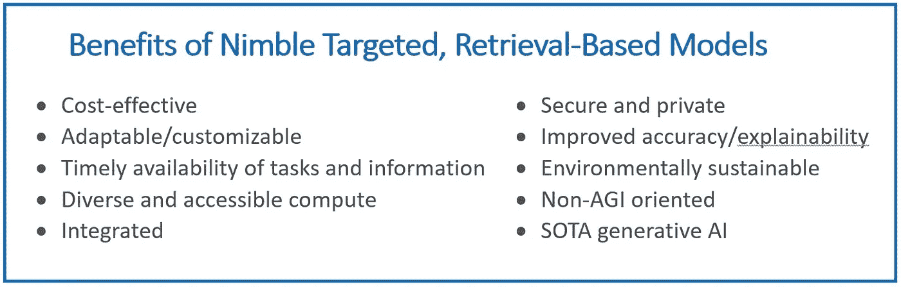

# 适者生存：紧凑型生成式 AI 模型是规模化成本效益 AI 的未来

> 原文：[`towardsdatascience.com/survival-of-the-fittest-compact-generative-ai-models-are-the-future-for-cost-effective-ai-at-scale-6bbdc138f618?source=collection_archive---------6-----------------------#2023-07-25`](https://towardsdatascience.com/survival-of-the-fittest-compact-generative-ai-models-are-the-future-for-cost-effective-ai-at-scale-6bbdc138f618?source=collection_archive---------6-----------------------#2023-07-25)

图片来源：Adobe Stock。

## 支持灵活、针对性强的检索式模型作为规模化部署生成式 AI 应用的最佳解决方案。

 [Gadi Singer](https://gadi-singer.medium.com/?source=post_page-----6bbdc138f618--------------------------------)

·

[关注](https://medium.com/m/signin?actionUrl=https%3A%2F%2Fmedium.com%2F_%2Fsubscribe%2Fuser%2F51de1f48d0b&operation=register&redirect=https%3A%2F%2Ftowardsdatascience.com%2Fsurvival-of-the-fittest-compact-generative-ai-models-are-the-future-for-cost-effective-ai-at-scale-6bbdc138f618&user=Gadi+Singer&userId=51de1f48d0b&source=post_page-51de1f48d0b----6bbdc138f618---------------------post_header-----------) 发表在 [Towards Data Science](https://towardsdatascience.com/?source=post_page-----6bbdc138f618--------------------------------) ·18 分钟阅读·2023 年 7 月 25 日

--

在人工智能 (AI) 模型复杂性和计算能力快速增长了十年之后，2023 年标志着对效率和生成 AI (GenAI) 广泛应用的关注转变。因此，一批参数少于 150 亿的新型模型被称为灵活 AI，可以在特定领域中接近 ChatGPT 风格的大型模型（参数超过 1000 亿）的能力。尽管 GenAI 已经在各行业广泛应用于各种商业用途，但紧凑且智能的模型使用率正在上升。在不久的将来，我预计将会有少量的大型模型和大量的小型、更灵活的 AI 模型嵌入到无数应用中。

尽管较大的模型取得了巨大进展，但在训练和环境成本方面，大型模型未必更好。[TrendForce](https://www.trendforce.com/presscenter/news/20230301-11584.html) 估计，仅 GPT-4 的 ChatGPT 训练费用就超过 1 亿美元，而灵活模型的预训练成本则低得多（例如，MosaicML 的 MPT-7B 的预训练费用约为 [20 万美元](https://www.mosaicml.com/blog/mpt-7b)）。大部分计算成本发生在持续的推断执行过程中，但这与大型模型面临的类似挑战有关，包括高昂的计算费用。此外，托管在第三方环境中的大型模型会带来安全性和隐私问题。灵活模型的运行成本大大降低，并提供了额外的好处，如适应性、硬件灵活性、在更大应用中的集成性、安全性和隐私、可解释性等（见图 1）。对较小模型表现不如大型模型的看法也在改变。较小的、针对性的模型并不缺乏智能——它们可以在商业、消费和科学领域提供等效或更优的性能，增加了其价值，同时减少了时间和成本投资。

越来越多的这些灵活模型大致匹配了 ChatGPT-3.5 级别的大型模型的性能，并且在性能和范围上持续快速提升。而且，当灵活模型配备了即时检索策划的特定领域私人数据和基于查询的网络内容有针对性的检索时，它们比记忆广泛数据集的大型模型更加准确且更具成本效益。

*图 1\. 灵活 GenAI 模型的好处。图片来源：Intel Labs。*

随着灵活的开源 GenAI 模型不断推进领域的快速发展，这一“iPhone 时刻”——当一种革命性技术变得主流——正受到“Android 革命”的挑战，因为一个强大的研究和开发社区在彼此的开源努力基础上进行构建，创造出越来越强大的灵活模型。

## **思考、执行、了解：目标领域的灵活模型可以像巨型模型一样表现**

*图 2\. 生成型人工智能能力分类。图像来源：Intel Labs。*

要更深入地了解何时以及如何让较小的模型在生成型人工智能中提供高度竞争的结果，重要的是观察到，无论是灵活的还是巨型的生成型人工智能模型，都需要三类能力才能表现出色：

1.  **认知能力以思考：** 包括语言理解、总结、推理、规划、从经验中学习、长篇阐述和互动对话。

1.  **功能技能以执行：** 例如——在自然环境中阅读文本、阅读图表/图形、视觉识别、编程（编码和调试）、图像生成和语音。

1.  **信息（记忆或检索）以了解：** 网页内容，包括社交媒体、新闻、研究和其他一般内容，和/或策划的领域特定内容，如医学、金融和企业数据。

**思考的认知能力。** 基于其认知能力，模型可以“思考”并理解、总结、综合、推理和构建语言及其他符号表示。无论是灵活模型还是巨型模型，在这些认知任务中表现良好，并且这些核心能力是否需要庞大的模型规模尚不清楚。例如，像[微软研究的 Orca](https://arxiv.org/pdf/2306.02707.pdf)这样的灵活模型已经在多个基准测试中展示了与 ChatGPT 相匹配或超越的理解、逻辑和推理技能。此外，Orca 还表明，推理技能可以从作为教师的大型模型中提炼出来。然而，目前用于评估模型认知技能的基准仍然很初级。需要进一步的研究和基准测试来验证灵活模型是否可以通过预训练或微调来完全匹配巨型模型的“思考”能力。

**执行功能技能。** 较大的模型由于其作为全能模型的一般关注，可能具有更多的功能技能和信息。然而，对于大多数业务用途来说，每个应用程序所需的功能技能有特定的范围。用于业务应用的模型应具备灵活性和扩展性，但通常不需要无限的功能技能。GPT-4 可以生成多种语言的文本、代码和图像，但说几百种语言并不一定意味着这些巨型模型本质上具有更多的认知能力——它主要是给模型增加了更多的“执行”功能技能。此外，功能专用引擎将与 GenAI 模型关联，并在需要该功能时使用——例如，[将数学“Wolfram 超能力”添加到 ChatGPT](https://writings.stephenwolfram.com/2023/03/chatgpt-gets-its-wolfram-superpowers/) 模块化可以提供最佳的功能，而不会给模型带来不必要的规模负担。例如，[GPT-4 正在部署插件](https://openai.com/blog/chatgpt-plugins)，这些插件实质上利用了较小的模型来提供附加功能。此外，[据传 GPT-4](https://the-decoder.com/gpt-4-architecture-datasets-costs-and-more-leaked/) 模型本身是由多个巨型（少于 100B 参数）“专家混合”模型组成，这些模型在不同的数据和任务分布上进行训练，而不是像 GPT-3.5 那样的单一密集模型。为了获得最佳的能力和模型效率组合，未来的多功能模型可能会使用每个小于 15B 参数的更小、更专注的专家混合模型。

*图 3\. 基于检索的功能扩展模型可以提供广泛的功能和相关信息，与模型大小基本无关。图片来源：Intel Labs。*

**需要了解的信息（记忆的或检索的）。** 巨型模型通过在参数记忆中记忆大量数据来“知道”更多内容，但这不一定使它们更聪明。它们只是比小模型更具一般知识。在零-shot 环境下，巨型模型具有较高的价值，对于新用例提供了通用消费者基础，当不需要进行目标定位时，以及在提炼和微调灵活模型（如 Orca）时作为教师模型。然而，目标明确的灵活模型可以为特定领域进行训练和/或微调，从而提供所需能力的更锐利技能。

*图 4\. 检索在允许小模型匹配更大模型的价值（使用* [*Contriever*](https://arxiv.org/abs/2112.09118) *检索方法）。图片来源：Intel Labs，基于* [*Mallen et al*](https://doi.org/10.48550/arxiv.2212.10511)*的工作。*

例如，一个针对编程的模型可以专注于与医疗 AI 系统不同的能力集。此外，通过使用针对内部和外部数据的检索，模型的准确性和时效性可以大大提高。[最近的一项研究](https://arxiv.org/abs/2212.10511) 显示，在[PopQA 基准](https://paperswithcode.com/dataset/popqa)上，参数只有 1.3B 的模型通过检索可以与参数高达 175B 的模型表现相当（见图 4）。在这种意义上，具有高质量索引的可访问数据的针对性系统的相关知识可能远比全能的通用系统更广泛。这对于需要用例或应用程序特定数据的多数企业应用程序来说可能更为重要——在许多情况下，还需要本地知识而不是广泛的通用知识。这就是灵活模型未来将显现其价值的地方。

## **三大因素推动灵活模型的爆炸性增长**

评估灵活模型的好处和价值时需要考虑三个方面：

1.  中等模型尺寸的高效率。

1.  开源或专有的许可。

1.  模型的专门化包括通用或针对性检索。

在尺寸方面，灵活的通用模型，如[Meta 的 LLaMA-7B 和 -13B](https://ai.facebook.com/blog/large-language-model-llama-meta-ai/) 或 [技术创新研究所的 Falcon 7B](https://falconllm.tii.ae/) 开源模型，以及专有模型如[MosaicML 的 MPT-7B](https://www.mosaicml.com/blog/mpt-7b)、[微软研究院的 Orca-13B](https://arxiv.org/pdf/2306.02707.pdf) 和 [Salesforce AI Research 的 XGen-7B](https://blog.salesforceairesearch.com/xgen/) 正在迅速改进（见图 6）。选择高性能的小型模型对操作成本以及计算环境的选择有重大影响。ChatGPT 的 175B 参数模型和 [GPT-4 的估计 1.8 万亿参数](https://the-decoder.com/gpt-4-architecture-datasets-costs-and-more-leaked/) 需要大量的加速器安装，如具有足够计算能力的 GPU 以处理训练和微调工作负载。相比之下，灵活的模型通常可以在任何选择的硬件上运行推理，从单插槽 CPU，到入门级 GPU，再到最大加速机架。灵活 AI 的定义目前已基于 13B 参数或更小模型的出色结果经验性地设定为 15B 参数。总体而言，灵活模型提供了一种更具成本效益和可扩展性的方法来处理新的用例（见灵活模型的优缺点部分）。

开源许可的第二个方面允许大学和公司互相迭代模型，从而推动了创造性创新的蓬勃发展。开源模型允许小型模型能力的惊人进步，如图 5 所示。

*图 5\. 灵活的开源非商业和商业 GenAI 模型在 2023 年上半年迅速崛起。图片来源：英特尔实验室。*

从 2023 年初开始，有多个例子显示了通用灵活生成性 AI 模型的出现，比如[Meta 的 LLaMA](https://ai.facebook.com/blog/large-language-model-llama-meta-ai/)，该模型包括 7B、13B、33B 和 65B 参数。以下在 7B 和 13B 参数范围内的模型是通过微调 LLaMA 创建的：斯坦福大学的[Alpaca](https://crfm.stanford.edu/2023/03/13/alpaca.html)，伯克利人工智能研究所的[Koala](https://bair.berkeley.edu/blog/2023/04/03/koala/)，以及由加州大学伯克利分校、卡内基梅隆大学、斯坦福大学、加州大学圣地亚哥分校和 MBZUAI 的研究人员创建的[Vicuna](https://lmsys.org/blog/2023-03-30-vicuna/)。最近，微软研究院发布了一篇关于尚未发布的 Orca 的[论文](https://arxiv.org/pdf/2306.02707.pdf)，这是一个基于 LLaMA 的 13B 参数模型，模拟了大型模型的推理过程，并在针对特定领域进行微调之前取得了令人印象深刻的结果。

*图 6\. 使用 Vicuna 评估集，通过 GPT-4 评估的开源聊天机器人的相对响应质量比较。图片来源：* [*微软研究院*](https://arxiv.org/pdf/2306.02707.pdf)*。*

Vicuna 可以作为近期从 LLaMA 衍生出的开源灵活模型的一个良好代表。Vicuna-13B 是一个由大学合作创建的聊天机器人，旨在“[解决现有模型如 ChatGPT 中训练和架构细节的缺乏](https://pub.towardsai.net/meet-vicuna-the-latest-metas-llama-model-that-matches-chatgpt-performance-e23b2fc67e6b)。”在 ShareGPT 上进行用户共享对话微调后，Vicuna 的响应质量相比于 ChatGPT 和 Google Bard 的 GPT-4 判定结果[超过 90%](https://lmsys.org/blog/2023-03-30-vicuna/)。然而，这些早期的开源模型尚不可用于商业用途。[MosaicML 的 MPT-7B](https://www.mosaicml.com/blog/mpt-7b)和[技术创新研究所的 Falcon 7B](https://falconllm.tii.ae/)为商业可用的开源模型，其质量 reportedly 与 LLaMA-7B 相当。

*图 7\. Orca-13B 在* BIG-bench Hard 的*复杂零样本推理任务上表现与 ChatGPT 相当。图片来源：* [*微软研究院*](https://arxiv.org/pdf/2306.02707.pdf)*。*

Orca 在复杂的零-shot 推理基准测试中，如[Big-Bench Hard](https://github.com/suzgunmirac/BIG-Bench-Hard)（BBH），**超越**了传统的指令调优模型，如 Vicuna-13B，超过了 100%。在 BBH 基准测试中，它与 ChatGPT-3.5 达到了相同的水平，”[根据研究人员](https://arxiv.org/pdf/2306.02707.pdf)的说法。**Orca-13B** 在其他通用模型中的顶级表现强化了这样的观点，即巨型模型的巨大规模可能来源于早期模型的暴力破解。巨型基础模型的规模对一些较小的模型，如 Orca-13B，用于提炼知识和方法可能很重要，但大小不一定是推理所必需的——即使对于一般情况也是如此。需要注意的是——对模型的认知能力、功能技能和知识记忆的全面评估，只有在广泛部署和应用时才有可能。

截至撰写本博客时，[Meta 发布了他们的 Llama 2 模型](https://about.fb.com/news/2023/07/llama-2/)，包含 7B、13B 和 70B 参数。该模型在首代发布四个月后问世，提供了显著的改进。在[对比图表](https://ai.meta.com/llama/)中，灵活的 Llama 2 13B 达到了与前一代 LLaMA 更大模型以及 MPT-30B 和 Falcon 40B 相似的结果。Llama 2 是开源的，可用于研究和商业用途。它在与微软及包括英特尔在内的多个合作伙伴的紧密合作下推出。Meta 对开源模型的承诺及其广泛的合作将无疑为我们看到的这种模型的跨行业/学术快速改进周期提供额外的推动力。

灵活模型的第三个方面涉及专业化。许多新推出的灵活模型都是通用的——例如 LLaMA、Vicuna 和 Orca。通用灵活模型可能完全依赖于它们的参数记忆，通过细调方法进行低成本更新，包括[LoRA: 大型语言模型的低秩适应](https://arxiv.org/abs/2106.09685)以及[检索增强生成](https://proceedings.neurips.cc/paper/2020/hash/6b493230205f780e1bc26945df7481e5-Abstract.html)，在推理时实时从策划的语料库中提取相关知识。检索增强的解决方案正在建立并不断通过 GenAI 框架如[LangChain](https://python.langchain.com/docs/get_started/introduction.html)和[Haystack](https://www.haystackteam.com/core/knowledge)进行增强。这些[框架允许轻松灵活的集成](https://mantiumai.com/blog/how-haystack-and-langchain-are-empowering-large-language-models/)索引和有效访问大型语料库以进行基于语义的检索。

大多数商业用户更倾向于针对其特定领域的定制模型。这些针对性模型通常也是基于检索的，以利用所有关键的信息资产。例如，医疗保健用户可能希望自动化患者沟通。

针对性模型使用两种方法：

1.  对模型本身进行专业化以满足目标使用案例所需的任务和数据类型。这可以通过多种方式实现，包括在特定领域知识上对模型进行预训练（如[phi-1](https://arxiv.org/abs/2306.11644)在来自网络的教科书质量数据上进行预训练）、对相同规模的通用基础模型进行微调（如[Clinical Camel](https://arxiv.org/abs/2305.12031)微调了 LLaMA-13B），或将巨型模型的知识提炼并学习到学生型灵活模型中（如[Orca](https://arxiv.org/pdf/2306.02707.pdf)学习模仿 GPT-4 的推理过程，包括解释痕迹、逐步思维过程和其他复杂指令）。

1.  为即时检索策划和索引相关数据，这可能是大量的，但仍在目标使用案例的范围/空间内。模型可以检索持续更新的公共网络和私有消费者或企业内容。用户确定索引哪些来源，从而选择来自网络的高质量资源以及更完整的资源，如个人的私人数据或公司的企业数据。虽然检索现在已集成到巨型和灵活系统中，但在小型模型中发挥着关键作用，因为它提供了模型性能所需的所有必要信息。它还允许企业将其所有私有和本地信息提供给在其计算环境中运行的灵活模型。

## **灵活生成性 AI 模型的优点和缺点**

在未来，紧凑模型的规模可能会增加到 20B 或 25B 参数，但仍远低于 100B 参数范围。也有许多中等规模的模型，如 MPT-30B、Falcon 40B 和 Llama 2 70B。虽然这些模型在零样本任务上预计表现会比小模型更好，但我不认为它们在任何特定功能集上的表现会显著优于灵活的、针对性的、基于检索的模型。

与巨型模型相比，灵活模型有许多优点，尤其是当模型是针对性的和基于检索的时，这些优点会得到进一步增强。这些好处包括：

+   **可持续且成本较低的模型：** 模型在[训练和推理计算](https://www.semianalysis.com/p/google-we-have-no-moat-and-neither)上具有显著较低的成本。推理运行时计算成本可能是 24x7 使用的商业导向模型可行性的决定因素，并且在广泛部署中整体环境影响的大幅减少也很显著。最后，凭借其可持续、特定和功能导向的系统，灵活模型并不试图解决人工通用智能（AGI）的雄心勃勃的目标，因此在与后者相关的公共和监管辩论中参与较少。

+   **更快的微调迭代：** 较小的模型可以在几小时（或更短时间）内完成微调，通过[类似 LoRA 的适应方法](https://arxiv.org/pdf/2106.09685.pdf)向模型添加新信息或功能，这在灵活模型中非常有效。这使得改进周期更频繁，使模型始终与其使用需求保持同步。

+   **基于检索的模型优点：** 检索系统重新组织知识，从直接来源引用大部分信息，而不是模型的参数记忆。这改善了以下方面：

    – **可解释性：** 检索模型使用源属性，提供来源或能够追溯到信息来源的能力，以提供可信度。

    – **时效性：** 一旦索引了最新的来源，模型可以立即使用，无需任何训练或微调。这允许在接近实时的情况下不断添加或更新相关信息。

    – **数据范围：** 为按需检索编制的信息可以非常广泛和详细。当集中在目标领域时，模型可以覆盖大量的私有和公共数据的范围和深度。它可能在其目标空间中包含比巨型基础模型训练数据集更多的量和细节。

    – **准确性：** 直接访问数据的原始形式、细节和上下文可以减少幻觉和数据近似。只要在检索范围内，就可以提供可靠和完整的答案。使用较小的模型时，按需检索的可追溯策划信息和（如巨型模型中）可能过时、部分且未标注来源的记忆信息之间的冲突也更少。

+   **硬件选择：** 灵活模型的推理可以在任何硬件上实际完成，包括可能已经是计算设置一部分的普遍解决方案。例如，Meta 的 Llama 2 灵活模型（7B 和 13B 参数）[在英特尔的数据中心产品](https://www.intel.com/content/www/us/en/developer/articles/news/llama2.html)上运行良好，包括 Xeon、Gaudi2 和 Intel 数据中心 GPU Max 系列。

+   **集成、安全和隐私：** 今天的 ChatGPT 和其他巨型 GenAI 模型是独立模型，通常在第三方平台上的大型加速器设施上运行，并通过接口访问。灵活的 AI 模型可以作为嵌入到更大业务应用程序中的引擎运行，并且可以完全集成到本地计算环境中。这对于安全和隐私有重大影响，因为不需要与第三方模型和计算环境交换/暴露信息，而且更广泛应用的所有安全机制都可以应用于 GenAI 引擎。

+   **优化和模型缩减：** 优化和模型缩减技术，如量化，通过将输入值转换为较小的输出值来减少计算需求，在增加功率效率的灵活模型上已经显示出了强大的初步结果。

**检索模型需要对所有源数据进行索引：** 模型在推断期间通过索引映射获取所需信息，但存在错过信息源的风险，使其对模型不可用。为了确保来源可追溯性、可解释性和其他属性，针对检索型模型不应依赖于存储在参数记忆中的详细信息，而应主要依赖于在需要时可用于提取的索引信息。

+   **任务范围减少：** 通用巨型模型具有出色的多功能性，特别擅长于未曾考虑的零-shot 新用途。灵活系统能够实现的广度和范围目前仍在评估中，但似乎随着最近的模型而有所改善。目标模型假定任务范围在预训练和/或微调期间已知和定义，因此范围的缩减不应影响任何相关能力。目标模型不是单一任务，而是一组相关能力。这可能会导致由于任务或业务特定的灵活模型而产生的碎片化。

+   **可能通过少量样本的精细调整来改进：** 为了有效地解决目标空间的模型，不总是需要进行精细调整，但可以通过调整模型以适应应用程序所需的任务和信息来提高 AI 的效果。现代技术使得这一过程可以用少量示例完成，而无需深入的数据科学专业知识。

+   [在 Intel CPU 上的生成 AI 模型已经显示了强大的初步结果](https://huggingface.co/blog/generative-ai-models-on-intel-cpu)。

## **摘要**

生成 AI 的重大飞跃使得新的能力成为可能，例如 AI 代理以自然语言交谈、引人入胜的文本总结和生成、图像创作、利用先前迭代的上下文等。本文介绍了“灵活 AI”这一术语，并阐述了为什么它将成为大规模部署生成 AI 的主要方法。简单来说，灵活 AI 模型运行更快，通过持续微调更新更迅速，并且通过开源社区的集体创新，更容易进行快速技术改进。

通过多个示例展示，随着最大模型的进化，表现出的卓越性能表明，灵活模型不需要像巨型模型那样的庞大体积。一旦掌握了基本认知能力，调整了所需功能，并根据需要提供数据，灵活模型为商业世界提供了最高的价值。

尽管如此，灵活模型不会使巨型模型灭绝。巨型模型在零-shot、开箱即用的设置中仍然有更好的表现。这些大型模型也可能被用作蒸馏成较小灵活模型的来源（教师模型）。虽然巨型模型拥有大量额外的记忆信息来处理任何潜在的用途，并且配备了多种技能，但这种通用性不被期望在大多数生成 AI 应用中需要。相反，将模型微调到与领域相关的信息和技能，并能够从策划的本地和全球来源中检索最新信息，将为许多应用提供更好的价值主张。

将灵活、针对性的 AI 模型视为可以集成到任何现有应用中的模块，提供了非常有吸引力的价值主张，包括：

+   部署和操作成本仅为其一小部分。

+   适应任务和私人/企业数据。

+   每晚更新，并且可以在从 CPU 到 GPU 或加速器的任何硬件上运行。

+   集成到当前计算环境和应用中。

+   运行在本地或私有云中。

+   受益于所有的安全和隐私设置。

+   更高的准确性和可解释性。

+   在提供类似生成 AI 能力的同时，更具环保责任感。

在少量巨型模型上取得的令人印象深刻的进展将继续。然而，行业最可能需要的只是几十个通用的灵活基础模型，这些模型可以用来构建无数的目标版本。我预见到不久的将来，广泛扩展的高级生成 AI 将渗透到所有行业，主要通过将灵活、针对性的安全智能模块作为增长引擎。

## **参考资料**

1.  Tseng, P. K. (2023 年 3 月 1 日). TrendForce 表示，由于云公司发起 AI 军备竞赛，ChatGPT 对 GPU 的需求可能达到 30,000 芯片，为商业化做好准备。*TrendForce*。 [`www.trendforce.com/presscenter/news/20230301-11584.html`](https://www.trendforce.com/presscenter/news/20230301-11584.html)

1.  介绍 MPT-7B：开源、商业可用 LLM 的新标准。 (2023 年 5 月 5 日)。 [`www.mosaicml.com/blog/mpt-7b`](https://www.mosaicml.com/blog/mpt-7b)

1.  Mukherjee, S., Mitra, A., Jawahar, G., Agarwal, S., Palangi, H., & Awadallah, A. (2023). Orca：从 GPT-4 的复杂解释轨迹中逐步学习。*arXiv (康奈尔大学)*。 [`doi.org/10.48550/arxiv.2306.02707`](https://doi.org/10.48550/arxiv.2306.02707)

1.  Wolfram, S. (2023 年 3 月 23 日). ChatGPT 获得了“Wolfram 超能力”！*Stephen Wolfram Writings*。 [`writings.stephenwolfram.com/2023/03/chatgpt-gets-its-wolfram-superpowers/`](https://writings.stephenwolfram.com/2023/03/chatgpt-gets-its-wolfram-superpowers/)

1.  Schreiner, M. (2023 年 7 月 11 日). GPT-4 架构、数据集、成本等泄露。*THE DECODER*。 [`the-decoder.com/gpt-4-architecture-datasets-costs-and-more-leaked/`](https://the-decoder.com/gpt-4-architecture-datasets-costs-and-more-leaked/)

1.  *ChatGPT 插件*。 (无日期)。 [`openai.com/blog/chatgpt-plugins`](https://openai.com/blog/chatgpt-plugins)

1.  Izacard, G., Caron, M., Hosseini, L., Riedel, S., Bojanowski, P., Joulin, A., & Grave, E. (2021). 使用对比学习进行无监督密集信息检索。*arXiv (康奈尔大学)*。 [`doi.org/10.48550/arxiv.2112.09118`](https://doi.org/10.48550/arxiv.2112.09118)

1.  Mallen, A., Asai, A., Zhong, V., Das, R., Hajishirzi, H., 和 Khashabi, D. (2022). 何时不信任语言模型：调查参数化和非参数化记忆的有效性。*arXiv (康奈尔大学)*。 [`doi.org/10.48550/arxiv.2212.10511`](https://doi.org/10.48550/arxiv.2212.10511)

1.  *Papers with Code — PopQA 数据集*。 (无日期)。 [`paperswithcode.com/dataset/popqa`](https://paperswithcode.com/dataset/popqa)

1.  介绍 LLaMA：一个基础的 65 亿参数的大型语言模型。 (2023 年 2 月 24 日)。 [`ai.facebook.com/blog/large-language-model-llama-meta-ai/`](https://ai.facebook.com/blog/large-language-model-llama-meta-ai/)

1.  介绍 Falcon LLM。 (无日期)。 [`falconllm.tii.ae/`](https://falconllm.tii.ae/)

1.  Nijkamp, E., Hayashi, H., Xie, T., Xia, C., Pang, B., Meng, R., Kryscinski, W., Tu, L., Bhat, M., Yavuz, S., Xing, C., Vig, J., Murakhovs’ka, L., Wu, C. S., Zhou, Y., Joty, S. R., Xiong, C., 和 Savarese, S. (2023). 使用 XGen 进行长序列建模：一个在 8K 输入序列长度上训练的 7B LLM。*Salesforce AI Research*。 [`blog.salesforceairesearch.com/xgen/`](https://blog.salesforceairesearch.com/xgen/)

1.  Hu, E. J., Shen, Y., Wallis, P., Allen-Zhu, Z., Li, Y., Wang, S., Wang, L., 和 Chen, W. (2021 年 6 月 17 日). LoRA：大型语言模型的低秩适应。*arXiv (康奈尔大学)*. [`doi.org/10.48550/arXiv.2106.09685`](https://doi.org/10.48550/arXiv.2106.09685)

1.  Lewis, P., Perez, E., Piktus, A., Petroni, F., Karpukhin, V., Goyal, N., Küttler, H., Lewis, M., Yih, W., Rocktäschel, T., Riedel, S., 和 Kiela, D. (2020). 针对知识密集型 NLP 任务的检索增强生成。*NeurIPS 2020*. [`proceedings.neurips.cc/paper/2020/hash/6b493230205f780e1bc26945df7481e5-Abstract.html`](https://proceedings.neurips.cc/paper/2020/hash/6b493230205f780e1bc26945df7481e5-Abstract.html)

1.  Introduction LangChain. (无日期). [`python.langchain.com/docs/get_started/introduction.html`](https://python.langchain.com/docs/get_started/introduction.html)

1.  Haystack. (无日期). [`www.haystackteam.com/core/knowledge`](https://www.haystackteam.com/core/knowledge)

1.  Mantium. (2023). Haystack 和 LangChain 如何赋能大型语言模型。*Mantium*. [`mantiumai.com/blog/how-haystack-and-langchain-are-empowering-large-language-models/`](https://mantiumai.com/blog/how-haystack-and-langchain-are-empowering-large-language-models/)

1.  Taori, R., Gulrajani, I., Zhang, T., Dubois, Y., Li, X., Guestrin, C., Liang, P., 和 Hashimoto, T. B. (2023 年 3 月 13 日). Alpaca：一个强大且可复制的指令跟随模型。*斯坦福大学 CRFM*. [`crfm.stanford.edu/2023/03/13/alpaca.html`](https://crfm.stanford.edu/2023/03/13/alpaca.html)

1.  Geng, X., Gudibande, A., Liu, H., Wallace, E., Abbeel, P., Levine, S. 和 Song, D. (2023 年 4 月 3 日). Koala：一个用于学术研究的对话模型。*伯克利人工智能研究博客*. [`bair.berkeley.edu/blog/2023/04/03/koala/`](https://bair.berkeley.edu/blog/2023/04/03/koala/)

1.  Chiang, W. L., Li, Z., Lin, Z., Sheng, Y., Wu, Z., Zhang, H., Zheng, L., Zhuang, S., Zhuang, Y., Gonzalez, J. E., Stoica, I., 和 Xing, E. P. (2023 年 3 月 30 日). Vicuna：一个令人印象深刻的开源聊天机器人，媲美 GPT-4，*质量达到 90%*的 ChatGPT。*LMSYS Org*. [`lmsys.org/blog/2023-03-30-vicuna/`](https://lmsys.org/blog/2023-03-30-vicuna/)

1.  Rodriguez, J. (2023 年 4 月 5 日). 认识 Vicuna：最新的 Meta 的 Llama 模型，与 ChatGPT 性能相当。*Medium*. [`pub.towardsai.net/meet-vicuna-the-latest-metas-llama-model-that-matches-chatgpt-performance-e23b2fc67e6b`](https://pub.towardsai.net/meet-vicuna-the-latest-metas-llama-model-that-matches-chatgpt-performance-e23b2fc67e6b)

1.  *Papers with Code — BIG-bench 数据集*. (无日期). [`paperswithcode.com/dataset/big-bench`](https://paperswithcode.com/dataset/big-bench)

1.  Meta. (2023 年 7 月 18 日). Meta 和微软推出下一代 Llama。Meta. [`about.fb.com/news/2023/07/llama-2/`](https://about.fb.com/news/2023/07/llama-2/)

1.  Meta AI. (无日期). 介绍 Llama 2。 [`ai.meta.com/llama/`](https://ai.meta.com/llama/)

1.  Gunasekar, S., Zhang, Y., Aneja, J., Mendes, C. C. T., Allie, D. G., Gopi, S., Javaheripi, M., Kauffmann, P., Gustavo, D. R., Saarikivi, O., Salim, A., Shah, S., Behl, H. S., Wang, X., Bubeck, S., Eldan, R., Kalai, A. T., Lee, Y. T., 和 Li, Y. (2023). 教科书就是你所需的一切。*arXiv (康奈尔大学)*。 [`doi.org/10.48550/arxiv.2306.11644`](https://doi.org/10.48550/arxiv.2306.11644)

1.  Toma, A., Lawler, P. R., Ba, J., Krishnan, R. G., Rubin, B. B., 和 Wang, B. (2023). Clinical Camel: 一个开源的专家级医疗语言模型，具有基于对话的知识编码。*arXiv (康奈尔大学)*。 [`doi.org/10.48550/arxiv.2305.12031`](https://doi.org/10.48550/arxiv.2305.12031)

1.  Patel, D., 和 Ahmad, A. (2023 年 5 月 4 日). Google “我们没有护城河，OpenAI 也没有。” SemiAnalysis。 [`www.semianalysis.com/p/google-we-have-no-moat-and-neither`](https://www.semianalysis.com/p/google-we-have-no-moat-and-neither)

1.  *加速 Llama 2 通过英特尔 AI 硬件和软件优化*。（无日期）。英特尔。 [`www.intel.com/content/www/us/en/developer/articles/news/llama2.html`](https://www.intel.com/content/www/us/en/developer/articles/news/llama2.html)

1.  *更小更好：Q8-Chat，在 Xeon 上的高效生成 AI 体验*。（无日期）。Hugging Face。 [`huggingface.co/blog/generative-ai-models-on-intel-cpu`](https://huggingface.co/blog/generative-ai-models-on-intel-cpu)
