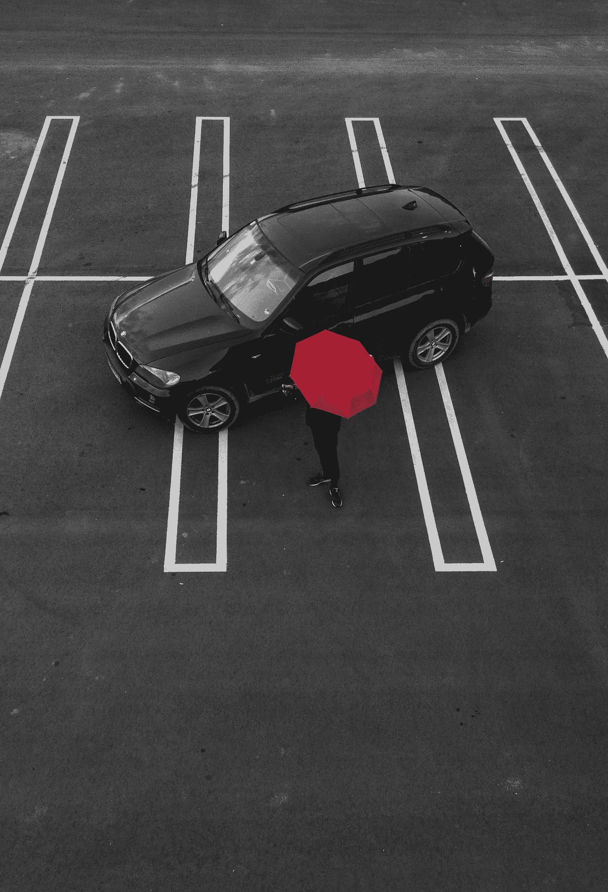

# 分析车辆大小与行人安全

> 原文：[`towardsdatascience.com/suvs-are-killing-people-de6ce08bac3d?source=collection_archive---------13-----------------------#2023-01-10`](https://towardsdatascience.com/suvs-are-killing-people-de6ce08bac3d?source=collection_archive---------13-----------------------#2023-01-10)

## 公开的交通事故数据表明，SUV 对行人的致死率和伤害率高于小型汽车

 [Danny Cunningham](https://medium.com/@djcunningham0?source=post_page-----de6ce08bac3d--------------------------------)

·

[关注](https://medium.com/m/signin?actionUrl=https%3A%2F%2Fmedium.com%2F_%2Fsubscribe%2Fuser%2Faaad94971fba&operation=register&redirect=https%3A%2F%2Ftowardsdatascience.com%2Fsuvs-are-killing-people-de6ce08bac3d&user=Danny+Cunningham&userId=aaad94971fba&source=post_page-aaad94971fba----de6ce08bac3d---------------------post_header-----------) 发表在 [Towards Data Science](https://towardsdatascience.com/?source=post_page-----de6ce08bac3d--------------------------------) · 8 min read · 2023 年 1 月 10 日

--

图片由 [Alexandru Acea](https://unsplash.com/@alexacea?utm_source=medium&utm_medium=referral) 提供，[来源于 Unsplash](https://unsplash.com/?utm_source=medium&utm_medium=referral)

《纽约时报》[最近强调](https://www.nytimes.com/2022/11/27/upshot/road-deaths-pedestrians-cyclists.html)了上升的道路死亡问题是“异常美国”的问题。除了美国外，几乎所有发达国家的道路都变得更加安全。即使在 COVID-19 疫情高峰期，当时路上的汽车大幅减少，[交通死亡率仍持续上升](https://www.nytimes.com/2021/01/01/nyregion/nyc-traffic-deaths.html)。

美国的道路对于行人来说特别危险。[保险公路安全研究所（IIHS）2022 年 3 月的研究](https://www.iihs.org/news/detail/suvs-other-large-vehicles-often-hit-pedestrians-while-turning)发现，自 2009 年以来，行人死亡率增加了 59%，而 2020 年所有机动车死亡人数中有 20%是行人。几个因素导致了这些严峻的统计数据，但一个重要因素（字面意思上也是）是道路上车辆的大小。

大型 SUV 和皮卡车由于其更大的重量和更高的前端，受伤或致死行人的可能性明显高于较小的汽车。正如你如果在美国生活就会发现的那样，美国人喜欢大型车辆。一些报告显示，现在[美国新车销售中超过 80%是 SUV 或皮卡车](https://jalopnik.com/trucks-and-suvs-are-now-over-80-percent-of-new-car-sale-1848427797)。这对行人来说是个坏消息。很快我们还将面临[荒谬沉重的电动汽车](https://www.google.com/search?q=hummer+ev+weight&client=safari&rls=en&sxsrf=AJOqlzXQvjl37e6JayYntx6U_ZmVu3H1iw%3A1673159351587&ei=t2K6Y_jCI4GcptQPiaCbKA&ved=0ahUKEwi4-ramrLf8AhUBjokEHQnQBgUQ4dUDCA8&uact=5&oq=hummer+ev+weight&gs_lcp=Cgxnd3Mtd2l6LXNlcnAQAzIICAAQgAQQsQMyBQgAEIAEMgUIABCABDIFCAAQgAQyBggAEBYQHjIGCAAQFhAeMgkIABAWEB4Q8QQyBggAEBYQHjIGCAAQFhAeMgYIABAWEB46CggAEEcQ1gQQsAM6DQgAEEcQ1gQQsAMQiwM6CggAELADEEMQiwM6DQgAEOQCENYEELADGAE6FQguEMcBENEDENQCEMgDELADEEMYAjoSCC4QxwEQ0QMQyAMQsAMQQxgCOgwILhDIAxCwAxBDGAI6EAgAEIAEEIcCELEDEIMBEBQ6CwgAEIAEELEDEIMBOgoIABCABBCHAhAUOgQIABBDOgUIABCRAjoICAAQsQMQkQI6CAgAEBYQHhAKOgsIABAWEB4Q8QQQCkoECEEYAEoECEYYAVCcAli8CmCXC2gBcAF4AIABZ4gByAOSAQM2LjGYAQCgAQHIARO4AQLAAQHaAQYIARABGAnaAQYIAhABGAg&sclient=gws-wiz-serp)的问题…
