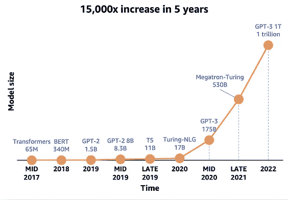
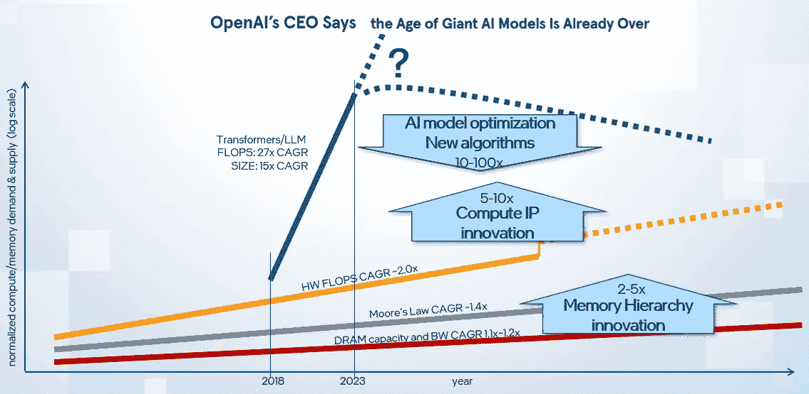
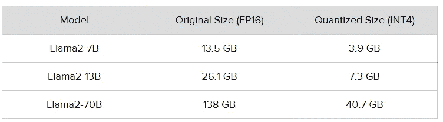
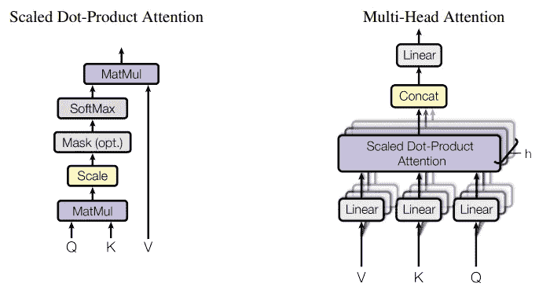
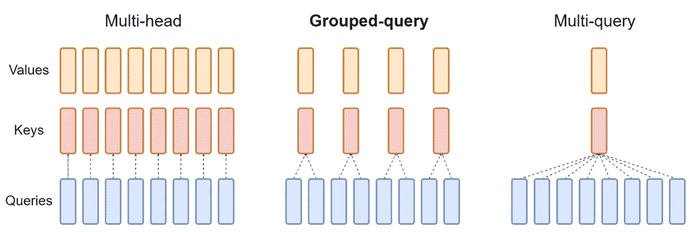
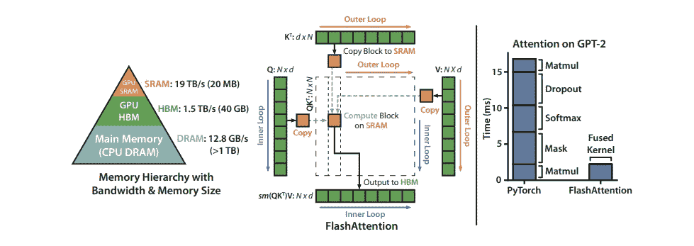
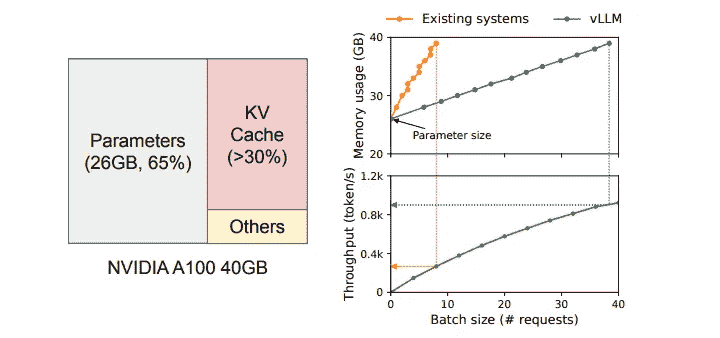
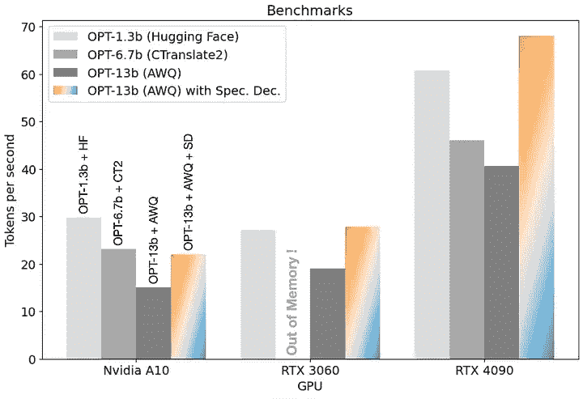

# 大型语言模型（LLMs）的软件/硬件协同优化策略

> 原文：[`towardsdatascience.com/sw-hw-co-optimization-strategy-for-large-language-models-llms-855f20a14629`](https://towardsdatascience.com/sw-hw-co-optimization-strategy-for-large-language-models-llms-855f20a14629)

## 如何最大限度地发挥系统性能以加速运行 LLMs？— 最佳实践

 [Liz Li](https://medium.com/@LizLiAI?source=post_page-----855f20a14629--------------------------------)

·发表在[Towards Data Science](https://towardsdatascience.com/?source=post_page-----855f20a14629--------------------------------) ·5 分钟阅读·2023 年 12 月 16 日

--

领先的大型语言模型（LLMs）如 ChatGPT、Llama 等正在革新科技行业并影响每个人的生活。然而，它们的成本构成了一个重大障碍。使用 OpenAI API 的应用会产生持续的高费用（每 1,000 个提示令牌$0.03，每 1,000 个采样令牌$0.06）。

为了降低成本，公司倾向于托管自己的 LLMs，费用因模型大小而异（100–200B 参数的大型 LLMs 成本约为 7–15B 参数的小型模型的 10 倍）。这一趋势催生了 AI 芯片竞赛，各大科技公司旨在开发自己的 AI 芯片，减少对昂贵硬件的依赖。

模型大小的趋势。来源：AWS reInvent

如何挤压每一丝计算能力以运行 LLMs？在这篇文章中，我将对 LLM 的优化策略进行深入分析，涵盖模型、软件和硬件。这将遵循我在之前文章中编写的 AI SW/HW 协同设计方法论，并对 LLM 特有的成本和性能优化进行更深入的探讨。

 ## 如何在新时代共同设计 AI/ML 的软件/硬件架构？

### 对 AI/ML 高效架构设计的全面视角

towardsdatascience.com 

来源：作者及其他同事制作

运行 LLM 模型的计算和内存需求正在呈指数级增长，而计算/内存能力却在较慢的轨迹上滞后，如上图所示。为了弥补这种性能差距，探索三个关键领域的改进是至关重要的：

1.  **算法改进与模型压缩：** 我们如何通过增强模型特性来减少计算和内存需求而不影响质量？最新的 LLM 量化技术有哪些进展，能在保持质量的同时减少模型大小？

1.  **高效的软件栈与加速库：** 在构建能够无缝连接 AI 模型和硬件的软件栈时，哪些考虑因素至关重要？我们如何利用硬件特性来优化 LLM 加速？现有的软件挑战和潜在的改进有哪些？

1.  **强大的 AI 硬件加速与先进的内存层次结构：** 当前有哪些针对 LLM 的硬件加速器？我们如何通过内存层次结构的潜在改进来缓解高内存需求？

我将为上述每个主题撰写一篇文章。在这篇文章中，我们将深入探讨第一个主题（**算法改进与模型压缩**）！

LLM 基于变换器架构（编码器-解码器），其中包括仅解码器模型架构如 Llama、ChatGPT 等，以及编码器-解码器模型架构如 Whisper、T5 等。新兴模型每天都在出现。在这篇文章中，我们将重点关注以下四个新特性来加速变换器的性能。

## 1\. 量化

将 FP32 模型转换为 INT8 模型可以将内存大小缩小约 4 倍，而 INT4 量化则能实现大约 8 倍的模型大小减少。此外，整数矩阵乘法的计算成本显著降低，因为其速度超过了浮点计算。量化分为两类——后训练量化（PTQ）和量化感知训练（QAT）。对于推理，推荐使用 PTQ。Hugging Face 托管了大量利用各种量化方法如 GPTQ、GGUF、AWQ 等的量化 LLM 模型。

通过量化实现模型大小的减少。来源：[`huggingface.co/TheBloke`](https://huggingface.co/TheBloke)

## 2\. 注意力机制

缩放点积注意力计算密集，涉及多次矩阵乘法键、查询和数值。在多头注意力中，存在多个注意力层（称为头），每个头生成的输出都会被拼接在一起。

一个缩放点积注意力（左）和多头注意力（右）的示意图，多头注意力实际上是多个 SDPA 头并行。来源：[注意力机制就是一切](https://arxiv.org/pdf/1706.03762.pdf) [参考 1]

为了优化注意力推理，引入了**多查询注意力**的概念（参考 [2] [快速变换器解码](https://arxiv.org/abs/1911.02150)）。在这种方法中，键和值在不同的注意力头之间共享，减少了为每个注意力头获取新键值对的需求，最小化了数据传输。

此外，在多头注意力和多查询注意力之间存在一种中间机制，称为**分组查询注意力**。它涉及将键和值投影到不同的组中，这与多查询注意力中的单一投影不同。这种方法在保持模型质量的同时有效减少了内存需求。

*不同注意力机制的比较。来源：* [GQA: 从多头检查点训练通用多查询变换器模型](https://arxiv.org/pdf/2305.13245v2.pdf) [Ref 3]

**Flash Attention**（参考 [[4]](https://arxiv.org/abs/2205.14135)）。与传统的逐层计算方法不同，Flash Attention 使用平铺技术将多个层融合在一起，并在单次操作中计算出最终结果。平铺大小考虑了系统内存层次结构，优化了 IO 操作。下图演示了 Flash Attention 与 PyTorch 原生实现相比的概念和延迟改进。

在 40 GB GPU 上使用的平铺 Flash 注意力计算模式和内存层次结构。来源：[Flash Attention: 快速且内存高效的精确注意力与 IO 感知](https://arxiv.org/abs/2205.14135)

## 3\. 分页 KV 缓存

随着输入和输出标记数量的增加，键值缓存可能变得非常庞大，具有动态长度，这导致由于碎片化和冗余复制而造成的内存访问效率低下。受到操作系统中虚拟内存机制的启发，Paged Attention 旨在最小化 KV 缓存内存中的冗余，并促进 KV 缓存在请求内和跨请求的灵活共享。

左侧：参数（灰色）在每次服务请求中保持在内存和 KV 缓存（红色）中。右侧：vLLM 有助于减缓内存需求以提升系统吞吐量。来源：[大语言模型服务的高效内存管理与 PagedAttention](https://arxiv.org/pdf/2309.06180.pdf) [Ref 5]

## 4\. 推测采样 [参考 [6](https://arxiv.org/abs/2302.01318)]

在自回归生成模型中，生成单个标记需要完整的模型推理，这会导致重复的权重加载，耗时较长。推测采样旨在缩小小型模型和大型模型之间的差距，通过提供类似于大型模型的高质量结果，同时具有类似于小型模型的更快速度。

AWQ 引擎显著加快了猜测性解码的速度。来源：[在快速车道上！猜测性解码 — 10 倍更大的模型，无额外成本](https://medium.com/@TitanML/in-the-fast-lane-speculative-decoding-10x-larger-model-no-extra-cost-f33ea39d065a#:~:text=Speculative%20decoding%20introduces%20an%20innovative,plenty%20more%20room%20for%20improvement.)

除了从算法和模型的角度提到的四大推理加速技术，还有许多其他特性可以加速 LLM 模型的推理。这些包括模型/张量并行、模型稀疏性、知识蒸馏等，新的研究也在不断涌现。利用这些技术对加速 LLM 解决方案至关重要。

需要注意的是，优化 AI 工作负载总是涉及模型、软件和硬件方面的协同。在即将发布的文章中，我们将深入探讨 LLM 加速的软件栈/库和硬件架构方面，敬请关注！

## 参考文献

[1] Ashish Vaswani 等人，[注意力即你所需](https://arxiv.org/pdf/1706.03762.pdf)，NIPS 2017，加州长滩

[2] Noam Shazeer，[快速 Transformer 解码：一个写头就足够](https://arxiv.org/abs/1911.02150)，2019，arxiv

[3] Joshua Ainslie 等人，[GQA：从多头检查点训练通用多查询 Transformer 模型](https://arxiv.org/pdf/2305.13245v2.pdf)，2023

[4] Tri Dao 等人，[Flash Attention：具有 IO 感知的快速且内存高效的精确注意力](https://arxiv.org/abs/2205.14135)，2022，arxiv

[5] Woosuk Kwon 等人，[大语言模型服务的高效内存管理与 PagedAttention](https://arxiv.org/pdf/2309.06180.pdf)，2023，arxiv

[6] Charlie Chen 等人，[使用猜测性采样加速大语言模型解码](https://arxiv.org/abs/2302.01318)，2023，arxiv
