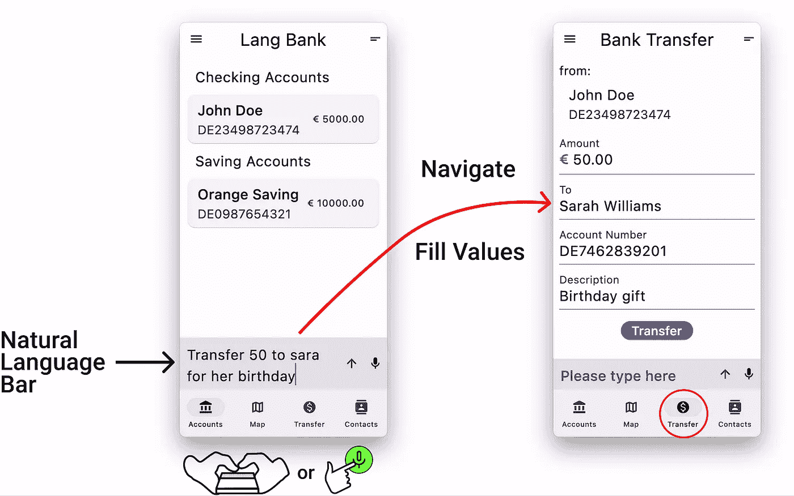
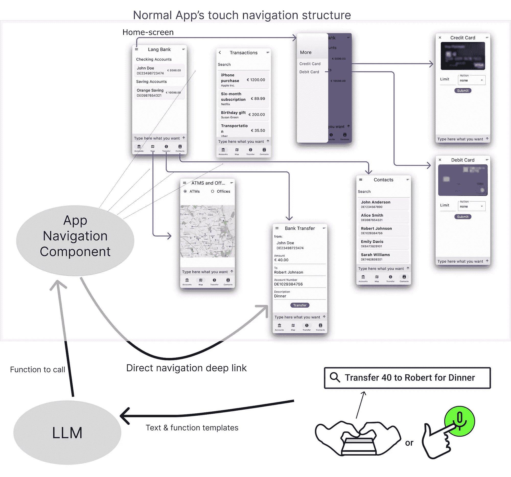
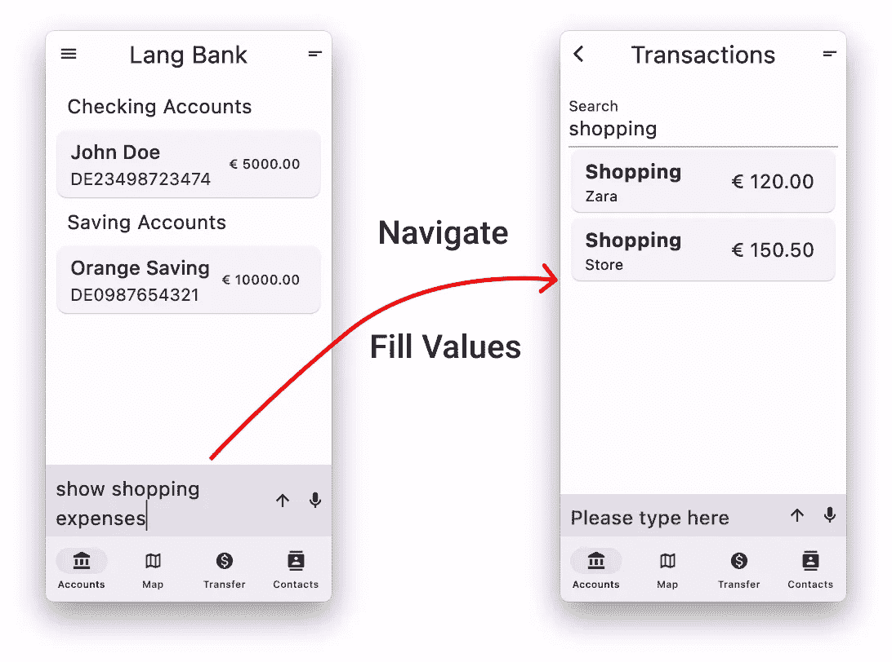
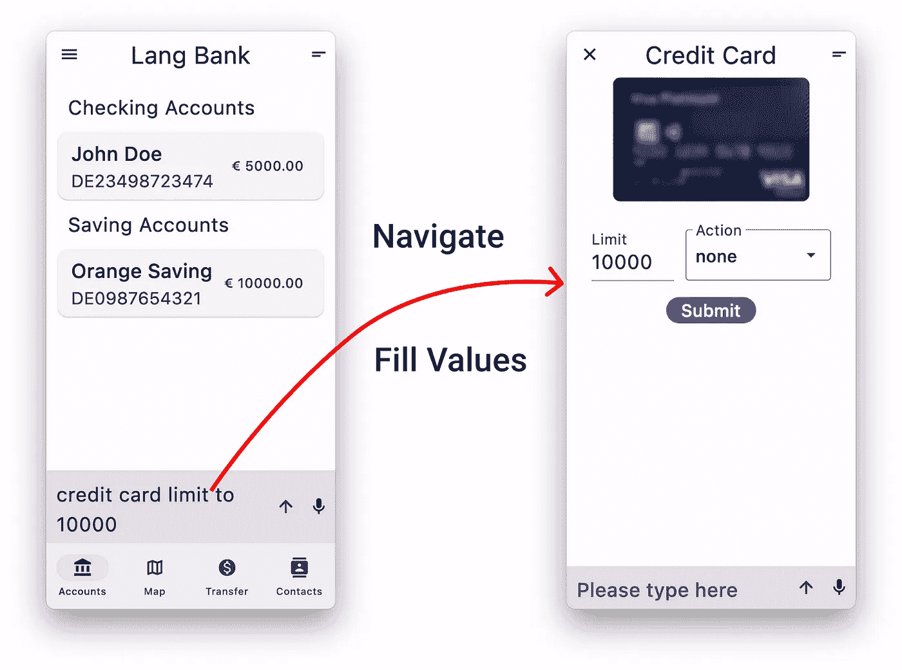
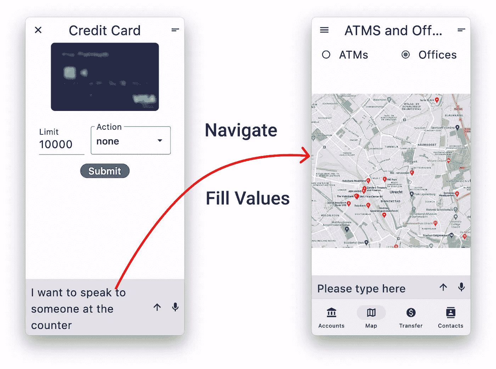
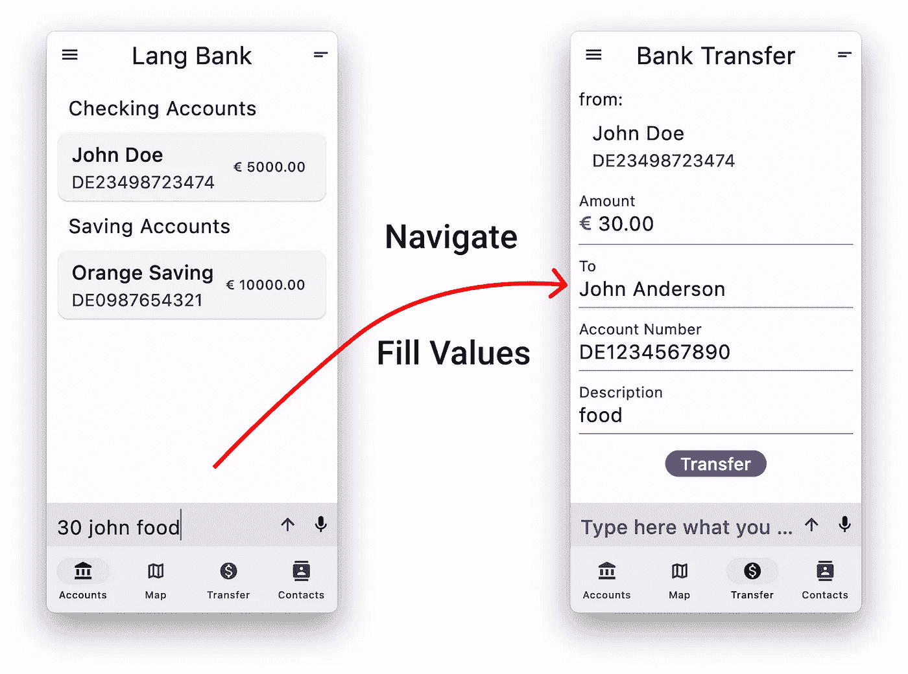
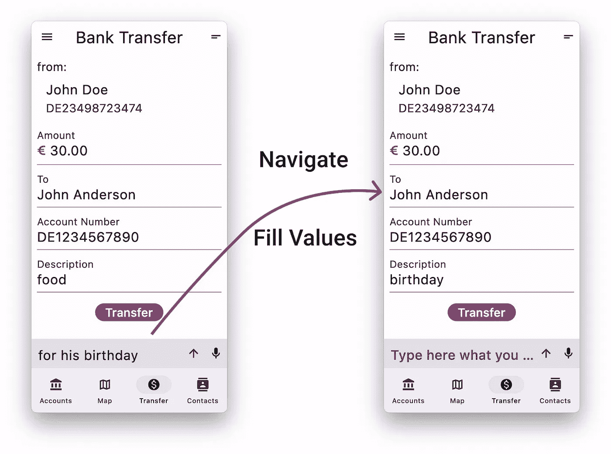
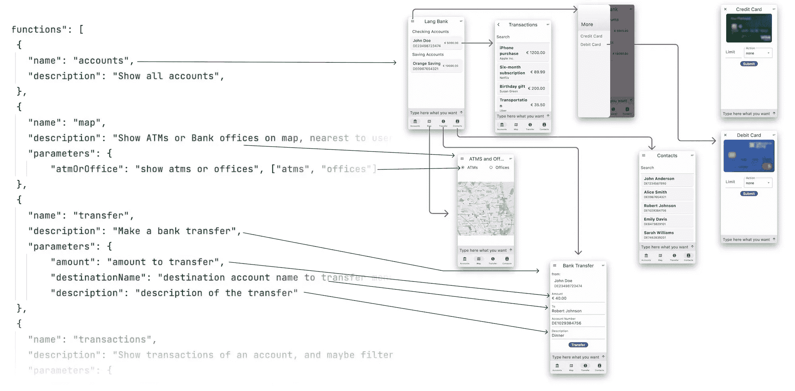
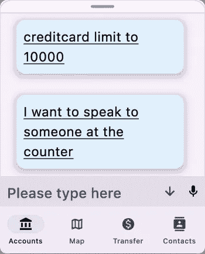
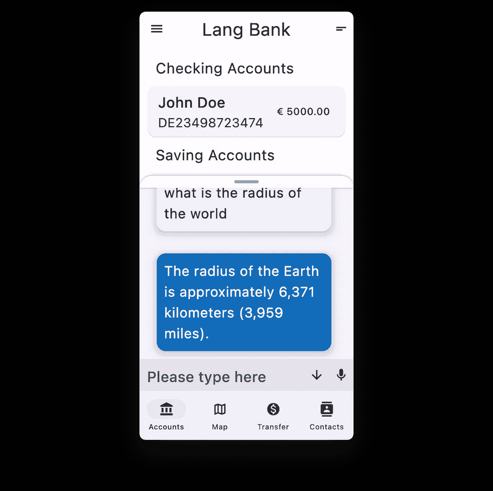

# LLM 和 GUI 的协同作用，超越聊天机器人

> 原文：[`towardsdatascience.com/synergy-of-llm-and-gui-beyond-the-chatbot-c8b0e08c6801?source=collection_archive---------3-----------------------#2023-10-20`](https://towardsdatascience.com/synergy-of-llm-and-gui-beyond-the-chatbot-c8b0e08c6801?source=collection_archive---------3-----------------------#2023-10-20)

## 使用 OpenAI GPT 功能调用来驱动你的移动应用

[](https://medium.com/@hgwvandam?source=post_page-----c8b0e08c6801--------------------------------)[](https://towardsdatascience.com/?source=post_page-----c8b0e08c6801--------------------------------) [汉斯·范·达姆](https://medium.com/@hgwvandam?source=post_page-----c8b0e08c6801--------------------------------)

·

[关注](https://medium.com/m/signin?actionUrl=https%3A%2F%2Fmedium.com%2F_%2Fsubscribe%2Fuser%2F6ce6c6116a37&operation=register&redirect=https%3A%2F%2Ftowardsdatascience.com%2Fsynergy-of-llm-and-gui-beyond-the-chatbot-c8b0e08c6801&user=Hans+van+Dam&userId=6ce6c6116a37&source=post_page-6ce6c6116a37----c8b0e08c6801---------------------post_header-----------) 发布于 [Towards Data Science](https://towardsdatascience.com/?source=post_page-----c8b0e08c6801--------------------------------) ·10 分钟阅读·2023 年 10 月 20 日[](https://medium.com/m/signin?actionUrl=https%3A%2F%2Fmedium.com%2F_%2Fvote%2Ftowards-data-science%2Fc8b0e08c6801&operation=register&redirect=https%3A%2F%2Ftowardsdatascience.com%2Fsynergy-of-llm-and-gui-beyond-the-chatbot-c8b0e08c6801&user=Hans+van+Dam&userId=6ce6c6116a37&source=-----c8b0e08c6801---------------------clap_footer-----------)

--

[](https://medium.com/m/signin?actionUrl=https%3A%2F%2Fmedium.com%2F_%2Fbookmark%2Fp%2Fc8b0e08c6801&operation=register&redirect=https%3A%2F%2Ftowardsdatascience.com%2Fsynergy-of-llm-and-gui-beyond-the-chatbot-c8b0e08c6801&source=-----c8b0e08c6801---------------------bookmark_footer-----------)

图片由 Midjourney 创建

# 介绍

我们引入了一种激进的用户体验（UX）方法，以最佳方式将对话式人工智能（Conversational AI）与图形用户界面（GUI）交互融合，形式为自然语言条。它位于每个屏幕的底部，允许用户通过一个入口点与整个应用程序进行交互。用户始终可以选择语言或直接操作。他们无需搜索如何完成任务，可以用自己的语言表达意图，同时保持 GUI 的速度、紧凑性和可操作性。GUI 的屏幕定义与用户的请求一起发送到大型语言模型（LLM），让 LLM 引导 GUI 朝向用户的意图。我们在[上一篇文章](https://medium.com/towards-data-science/speech-and-natural-language-input-for-your-mobile-app-using-llms-e79e23d3c5fd)中介绍了这一概念，并在此基础上进行了优化，实施了一个 Flutter 示例应用程序，[点击这里试用](https://langbar-1d3b9.web.app/home)。完整的 Flutter 代码[可以在 GitHub 上找到](https://github.com/hansvdam/langbar)，因此你可以在自己的上下文中探索这一概念。一个简短的视频解释了该功能，[点击这里观看](https://youtu.be/vJy0HI_mH7w)。本文面向产品负责人、UX 设计师和移动开发人员。



# 背景

自然语言接口和图形用户界面（GUIs）将人类用户与计算机系统的能力连接起来。自然语言允许人们在即时性之外交流，而指点允许对世界上具体事物进行沟通。指点相对于产生和处理自然语言来说，要求对方的认知努力更少，也减少了混淆的可能。然而，自然语言可以传达关于整个世界的信息：具体的、抽象的、过去的、现在的、未来的，以及元世界，提供对一切的随机访问。

随着 ChatGPT 的兴起，自然语言处理（NLP）的解读质量已达到了高水平，利用‘功能调用’，现在可以创建完整的自然语言接口，减少误解的发生。当前 LLM 社区的趋势集中在聊天界面作为主要的对话用户界面。这种方法源于聊天是书面的人际交互的主要形式，并在滚动窗口中保留对话历史。许多信息适合图形表示。一种常见的方法是将 GUI 元素融入聊天对话中。然而，这样的成本是聊天历史变得庞大，并且在聊天历史中管理 GUI 元素的状态是复杂的。此外，通过完全采用聊天范式，我们失去了向用户提供菜单驱动交互路径的选项，使他们在应用程序的功能方面更加模糊。

这里采用的方法可以应用于各种应用程序，例如银行、购物和旅行应用。移动应用的最重要功能位于主屏幕上，但其他选项卡或菜单中的功能可能让用户很难找到。当用户可以用自己的语言表达请求时，他们自然会被引导到最有可能满足需求的屏幕上。当最重要的功能在主屏幕上时，针对这一核心功能的可选项数量可能会使人不知所措。自然语言从另一端接近这一点：用户主动表达他们想要的内容。将这两者结合起来，可以实现最佳状态，即两者互补，用户可以选择最适合其任务或子任务的选项。

# 自然语言条

自然语言条（NLB）允许用户输入或说出他们想要从应用程序中得到什么。与他们的请求一起，所有屏幕的定义都通过 OpenAI 创造的“函数调用”技术发送到 LLM。在我们的概念中，我们将 GUI 屏幕视为应用程序中的一个函数，其中屏幕上的用户输入小部件被视为该函数的参数。

我们将以银行应用程序为例来说明这一概念。当用户用自然语言发出请求时，LLM 会告诉我们应用中的导航组件打开哪个屏幕以及设置哪些值。这在以下图中进行了说明：



以下图像提供了一些交互示例：



以下图像展示了 LLM 得出的结论。它得出的最佳方式是展示您附近的银行网点：



以下示例展示了即使显著缩短的表达也可能达到用户期望的结果：



因此，自由输入也可以是一种非常快速的交互模式。这种缩略语的正确解释取决于其背后意图的明确性。在这种情况下，应用程序没有其他屏幕可以转移，因此 LLM 可以做出明确的决定。

另一个额外功能是交互有历史记录，因此用户可以继续输入以纠正之前的意图：



因此，LLM 可以结合几条消息，其中一条纠正或增强另一条，以产生所需的函数调用。这对于旅行规划应用程序非常方便，用户最初只提到出发地和目的地，然后在后续消息中添加额外的要求，如日期、时间、仅直达连接、仅头等舱等。

[点击这里](https://langbar-1d3b9.web.app/home)亲自尝试示例应用程序。语音输入在 Chrome 浏览器以及 Android 和 iOS 本地环境中有效。使用的是平台提供的语音识别，因此如果质量不足以满足您的目的，还有改进的空间。

# 工作原理

当用户在自然语言栏中提出问题时，会向 LLM 的提示中添加一个[JSON 模式](https://www.tutorialspoint.com/json/json_schema.htm)。JSON 模式定义了所有屏幕及其输入元素的结构和目的。LLM 尝试将用户的自然语言表达映射到这些屏幕定义中的一个。它返回一个 JSON 对象，以便您的代码可以进行‘函数调用’以激活相应的屏幕。

功能和屏幕之间的对应关系在下图中进行了说明：



完整的功能规范可以在[这里](https://gist.github.com/hansvdam/3783bfc35e19e96849187e634272b366)查看。

自然语言栏的 Flutter 实现基于[LangChain Dart](https://langchaindart.com)，这是 LangChain 生态系统的 Dart 版本。所有提示工程都发生在客户端。将屏幕、导航逻辑和功能模板保存在一起更有意义。由于一对一关系，功能模板被整合到导航结构中。以下展示了激活并导航到信用卡屏幕的代码：

```py
DocumentedGoRoute(
   name: 'creditcard',
   description: 'Show your credit card and maybe perform an action on it',
   parameters: [
     UIParameter(
       name: 'limit',
       description: 'New limit for the card',
       type: 'integer',
     ),
     UIParameter(
       name: 'action',
       description: 'Action to perform on the card',
       enumeration: ['replace', 'cancel'],
     ),
   ],
   pageBuilder: (context, state) {
     return MaterialPage(
         fullscreenDialog: true,
         child: LangBarWrapper(
             body: CreditCardScreen(
                 label: 'Credit Card',
                 action: ActionOnCard.fromString(
                     state.uri.queryParameters['action']),
                 limit:
                     int.tryParse(state.uri.queryParameters['limit'] ?? ''))));
   }),
```

在顶部，我们看到这是一个路由：应用程序路由系统中的一个目标，可以通过超链接激活。描述部分是 LLM 用来将屏幕与用户意图匹配的部分。下面的参数（信用卡额度和要采取的操作）定义了自然语言中的屏幕字段，以便 LLM 可以从用户的问题中提取这些字段。然后，pageBuilder-item 决定如何使用深层链接的查询参数来激活屏幕。可以在[`langbar-1d3b9.web.app/home`](https://langbar-1d3b9.web.app/home)中识别这些参数：在 NLB 中输入‘信用卡额度为 10000’，浏览器的地址栏将显示：[`langbar-1d3b9.web.app/creditcard?limit=10000`](https://langbar-1d3b9.web.app/creditcard?limit=10000)。

使用了 LangChain 代理，这使得这种方法独立于 GPT，因此也可以使用其他 LLM 如 Llama、Gemini、Falcon 等。此方法还便于添加基于 LLM 的辅助功能。

# 历史面板

自然语言栏提供了一个可折叠的互动历史面板，用户可以轻松重复以前的陈述。这样，互动历史会被保存，类似于聊天界面，但以紧凑、可折叠的形式出现，节省屏幕空间并防止混乱。用户之前的语言陈述会以用户使用的语言显示。系统响应会作为超链接包含在用户陈述中，可以点击以重新激活对应的屏幕：



当 LLM 无法完全确定要激活的屏幕时，系统响应会被明确显示，此时历史面板会自动展开。这种情况可能发生在用户提供的信息过少、用户的请求超出应用程序的范围，或发生错误时：



# 未来

历史面板是提供客户支持和上下文敏感帮助的绝佳场所，采用聊天机器人形式。写作时，有关 RAG（检索增强生成）技术的讨论和演变非常活跃，这些技术使聊天机器人能够根据贵组织提供的大量文本内容回答用户的问题。此外，自然语言栏是想象如何利用自然语言赋予应用程序更多力量和便捷的良好起点。

# 客户支持

互动的历史面板是嵌入客户支持对话的好地方。这些对话占用的垂直空间比文本中大多数示例更多。在客户支持对话中，贵组织的回答是语言表达，无论是由聊天机器人还是人工服务人员生成。它们需要完全显示，而不是嵌入超链接中。但这没关系，因为否则这些空间会被其他地方占用。贵组织可能已经在网站或应用程序上拥有一个聊天机器人。将其与自然语言栏的历史面板统一是合乎逻辑的。

# 上下文敏感的帮助

在上述描述的背景下，我们保持与应用程序的语言互动历史。未来，我们可能（隐形地）将直接用户交互的轨迹添加到该历史序列中。通过将用户交互的历史轨迹与 RAG 结合在应用程序的帮助文档中，可以提供上下文敏感的帮助。用户的问题将更能根据应用程序当前状态得到回答。

# 超越移动应用程序的静态辅助

当前提议是一个 MVP（最简可行产品）。它提供了一个静态模板，用于在应用程序的上下文中解释用户的语言请求。这种技术为未来的广泛改进打开了广阔的前景：

+   当用户在特定屏幕上提问时，我们可能能够动态地将更多具体的解释模板（功能）添加到提示中，这些模板依赖于该屏幕的状态，例如‘为什么提交按钮变灰/禁用？’。

+   使用自然语言栏进行功能调用可以作为创意应用的助手，例如执行像‘调整为相同大小’或‘转变为可重用组件’这样的操作。微软 Copilot 365 已经在使用类似的功能。本文中采用的方法也可以帮助您的组织利用这些功能。

与系统每个方面的自然语言交互将迅速成为每个 UI 的主要组成部分。在使用‘功能调用’时，您必须在提示中包含系统能力，但很快会有更经济和更强大的方法上市。例如，OpenAI 最近开放了[模型微调与功能调用](https://platform.openai.com/docs/guides/fine-tuning/fine-tuning-examples)，允许您创建一个具有系统能力的 LLM 版本。即使这些能力非常广泛，提示的负担仍然有限。

# 结论

LLMs 可以通过‘功能调用’成为与基于 GUI 的应用程序进行自然语言交互的绝佳桥梁。引入了一个自然语言栏，允许用户输入或说出他们的意图。系统将通过导航到正确的屏幕并预填正确的值来回应。示例应用程序使您实际体验到这一点，提供的源代码使得如果您使用 Flutter，可以快速将其应用到自己的应用程序中。自然语言栏不仅适用于 Flutter 或移动应用程序，还可以应用于任何具有 GUI 的应用程序。它的最大优势是可以从一个单一的访问点打开应用程序的全部功能，而无需用户知道如何操作、在哪里找到功能，甚至不需要了解应用程序的术语。从应用开发的角度来看，您只需简单地记录屏幕的目的和屏幕上的输入小部件，就可以向用户提供这一切。

请在评论中分享您的想法。我非常好奇。

请在[LinkedIn](https://www.linkedin.com/in/hans-van-dam-71a7866/)或[UXX.AI](https://uxx.ai)上关注我。

特别感谢[David Miguel Lozano](https://www.linkedin.com/in/davidmigloz/)帮助我完成[LangChain Dart](https://github.com/davidmigloz/langchain_dart)。

一些有趣的文章：[多模态对话](https://masterofcode.com/blog/multimodal-conversation-design-tutorial-part-2-best-practices-use-cases-and-future-outlook)、[谷歌关于 GUI 和 LLM 的博客](https://ai.googleblog.com/2023/05/enabling-conversational-interaction-on.html)、[将 GUI 交互解释为语言](https://pure.tue.nl/ws/files/3655721/200612175.pdf)、[LLM 驱动的助手](https://nickarner.com/notes/llm-powered-assistants-for-complex-interfaces-february-26-2023/)、[语言与 GUI](https://medium.com/swlh/a-natural-language-user-interface-is-just-a-user-interface-4a6d898e9721)、[聊天机器人与 GUI](https://medium.com/@aradzinski/the-future-ai-based-cx-has-nothing-to-do-with-chatbots-c8be20352f9d)

*除非另有说明，本文中的所有图片均由作者提供*
