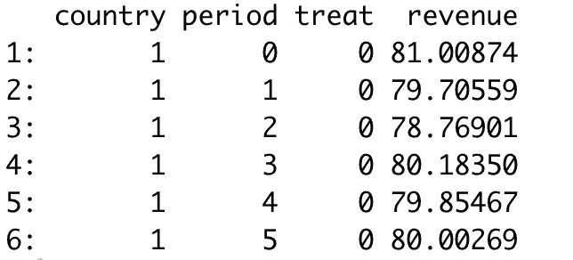
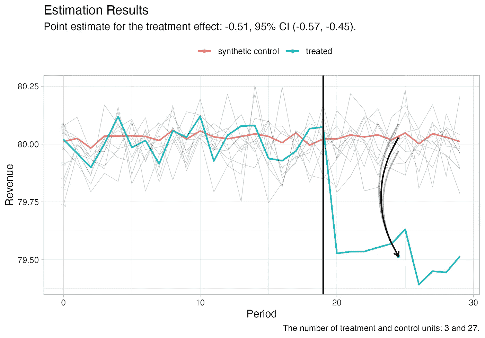
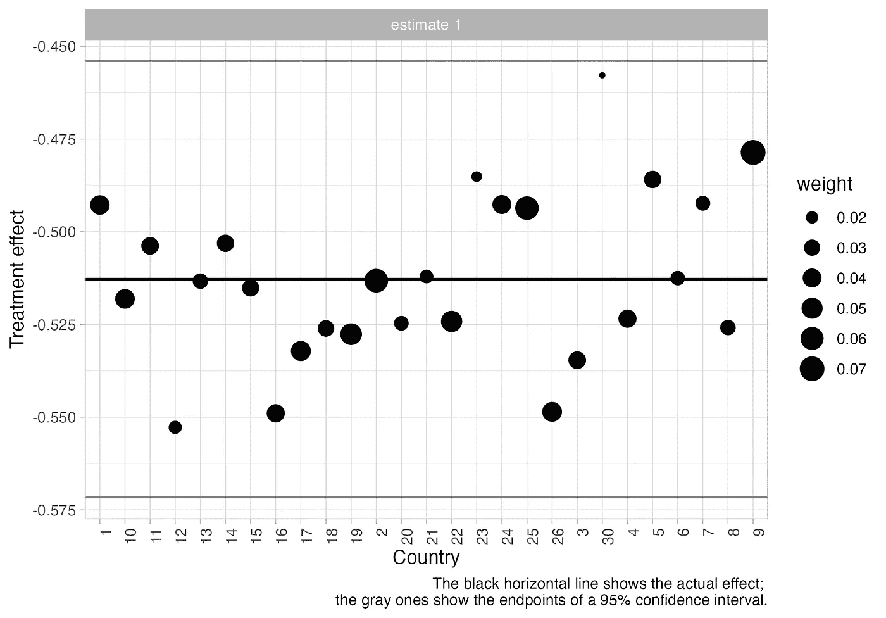

# SynthDiD 101：Synthetic Difference-in-Differences 初学者指南

> 原文：[`towardsdatascience.com/synthdid-101-a-beginners-guide-to-synthetic-difference-in-differences-84fed9b730ae`](https://towardsdatascience.com/synthdid-101-a-beginners-guide-to-synthetic-difference-in-differences-84fed9b730ae)

## 关于该方法的优缺点，使用 R 中的 synthdid 包进行演示

[](https://medium.com/@nalagoz13?source=post_page-----84fed9b730ae--------------------------------)[](https://towardsdatascience.com/?source=post_page-----84fed9b730ae--------------------------------) [Nazlı Alagöz](https://medium.com/@nalagoz13?source=post_page-----84fed9b730ae--------------------------------)

·发表于 [Towards Data Science](https://towardsdatascience.com/?source=post_page-----84fed9b730ae--------------------------------) ·阅读时间 8 分钟·2023 年 4 月 26 日

--


由作者使用[Nightcafe](https://creator.nightcafe.studio/)生成的标题图像

在这篇博客文章中，我简要介绍了 Synthetic Difference-in-Differences（SynthDiD）方法，并讨论了它与传统的 Difference-in-Differences（DiD）和 Synthetic Control Method（SCM）的关系。SynthDiD 是 SCM 和 DiD 的一个概括版本，结合了两种方法的优势。它可以在大面板数据下进行因果推断，即使在短期的前处理期间也能有效。我讨论了这种方法的优缺点，并使用 R 中的[synthdi](https://synth-inference.github.io/synthdid/index.html)包演示了这种方法。我提供了简要的要点介绍。

## Synthetic Control Method 与 Synthetic Difference-in-Differences

Synthetic Control Method 和 Synthetic Difference-in-Differences 方法紧密相关，但在估计因果效应的方式上有所不同。Synthetic Control Method 是一种统计技术，通过结合多个与处理单元在所有相关特征上相似的对照单元，创建一个“合成”的对照组。合成对照组的构建旨在尽可能接近处理单元的前处理结果。然后，通过将处理单元的后处理结果与合成对照组的结果进行比较，来估计处理效应。

另一方面，合成 DiD 结合了合成控制方法和差分中的差分方法[1]。在这种方法中，使用与合成控制方法相同的方法构建一个合成控制组。然而，通过比较处理单位和合成控制组在处理前后结果的变化来估计处理效果。这种方法通过考虑处理组和控制组之间的先前差异来允许对处理效果进行更稳健的估计。

总结来说，尽管两种方法都使用合成控制组，但合成控制方法通过比较处理单位和合成控制组的后处理结果来估计处理效果，而合成 DiD 通过比较处理单位和合成控制组在引入处理前后的结果变化来估计处理效果。

## 合成 DiD 的要点：

+   SynthDiD 是 SCM 和 DiD 的广义版本。

+   它借鉴了 DiD 方法和合成控制方法的优点[2][3]。

+   它通过最优加权控制组单位来构建处理组的反事实，以最小化处理组和控制组在处理前阶段的差异，就像在 SCM 中一样。

+   然后，通过比较处理单位和合成控制组在干预前后结果的变化来估计处理效果，就像在 DiD 方法中一样。

+   SynthDiD 考虑了单位级别的结果变化，就像 DiD 方法一样[4]。

+   即使在处理阶段很短的情况下，它也能在广泛的面板数据中进行推断，这使其与合成控制方法有所区别（SCM 需要较长的处理阶段）。

+   与 SCM 相同，单位变成了“变量”，我们将结果表示为单位的加权平均值（即，合成控制）。

## 示例

假设我们是一家销售植物性食品产品的公司，例如豆奶或豆酸奶，我们在多个国家运营。一些国家实施了新法规，禁止我们将植物性产品标记为“牛奶”或“酸奶”，因为声明只有动物产品可以被标记为“牛奶”或“酸奶”（感谢我的一位前学生提供这个示例的灵感 :)。因此，由于这些国家的新规定，我们必须将豆奶标记为豆饮料，而不是豆奶等。我们想知道这项立法对我们收入的影响，因为这可能有助于指导我们在不同国家的游说和营销活动。

我模拟了一个平衡的面板数据集，显示了我们公司在 30 个不同国家 30 个时期的收入。三个国家在 20 期实施了这项立法。下图中可以看到数据的快照。`treat`是一个虚拟变量，指示一个国家是否在给定时期实施了立法。`revenue`是以百万欧元计的收入。你可以在[这个 Gist](https://gist.github.com/nazlialagoz/f061e10e156581e15661b87157803f44)中找到模拟和估计代码。

```py
# Install and load the required packages
# devtools::install_github("synth-inference/synthdid")
library(synthdid)
library(ggplot2)
library(data.table)

# Set seed for reproducibility
set.seed(12345)

source('sim_data.R') # Import simulation function and some utilities

dt <- sim_data()
head(dt)
```



数据快照，图片由作者提供。

接下来，我们将面板数据转换为`synthdid`包所需的矩阵。给定结果、处理和对照单元以及处理前期，创建一个合成对照，并使用`synthdid_estimate`函数估计治疗效果。为了进行推断，我们还需要计算标准误差。如果有多个处理单元，我使用`jacknife`方法。如果只有一个处理单元，`placebo`方法是唯一的选择。根据标准误差，我还计算了治疗效果的 95%置信区间。我将在下图中报告这些结果。

```py
# Convert the data into a matrix
setup = panel.matrices(dt, unit = 'country', time = 'period', 
                       outcome = 'revenue', treatment = 'treat')

# Estimate treatment effect using SynthDiD
tau.hat = synthdid_estimate(setup$Y, setup$N0, setup$T0)

# Calculate standard errors 
se = sqrt(vcov(tau.hat, method='jackknife'))
te_est <- sprintf('Point estimate for the treatment effect: %1.2f', tau.hat)
CI <- sprintf('95%% CI (%1.2f, %1.2f)', tau.hat - 1.96 * se, tau.hat + 1.96 * se)\
```

我们还将结果绘制一些附加数据。

```py
# Check the number of treatment and control countries to report
num_treated <- length(unique(dt[treat==1]$country))
num_control <- length(unique(dt$country))-num_treated

# Create spaghetti plot with top 10 control units
top.controls = synthdid_controls(tau.hat)[1:10, , drop=FALSE]
plot(tau.hat, spaghetti.units=rownames(top.controls),
     trajectory.linetype = 1, line.width=.75, 
     trajectory.alpha=.9, effect.alpha=.9,
     diagram.alpha=1, onset.alpha=.9, ci.alpha = .3, spaghetti.line.alpha =.2,
     spaghetti.label.alpha = .1, overlay = 1) + 
  labs(x = 'Period', y = 'Revenue', title = 'Estimation Results', 
       subtitle = paste0(te_est, ', ', CI, '.'), 
       caption = paste0('The number of treatment and control units: ', num_treated, ' and ', num_control, '.'))
```

在下图中，展示了估计结果。观察治疗国家和合成对照的平均趋势如何相对平行（它可能看起来不完全平行，但对于本示例而言并不必要）。治疗国家的平均值变动较大，主要由于只有三个这样的国家，导致趋势不够平滑。透明的灰色线条代表不同的对照国家。自 20 期的处理开始后，治疗国家的收入下降，估计为 0.51 百万欧元，如图所示。这意味着新法规对我们公司的收入有负面影响，应采取必要措施以防止进一步下降。



结果，图片由作者提供。

让我们绘制用于估计合成对照的权重。

```py
# Plot control unit contributions
synthdid_units_plot(tau.hat, se.method='jackknife') +
  labs(x = 'Country', y = 'Treatment effect', 
       caption = 'The black horizontal line shows the actual effect; 
       the gray ones show the endpoints of a 95% confidence interval.')
```

在下图中，你可以观察到每个国家在构建合成对照时的加权情况。治疗效果根据选定的未处理国家作为对照单元有所不同。



国家权重，图片由作者提供。

现在我们对 SynthDiD 有了更多的了解，接下来讨论一下这种方法的优缺点。每种方法都有其优缺点，SynthDiD 也不例外。以下是开始使用这种方法时需要注意的一些优缺点。

## SynthDiD 方法的优点：

+   合成控制方法通常用于少量处理和控制单位，并且需要处理前的长期平衡数据。而 SynthDiD，即使在处理前的数据周期较短的情况下也能很好地工作，这与合成控制方法不同[4]。

+   该方法之所以被优先考虑，特别是因为它不像 DiD 那样有严格的平行趋势假设（PTA）要求。

+   SynthDiD 保证了控制单位的适当数量，考虑了可能的干预前模式，并可能容纳一定程度的内生处理时机[4]。

## SynthDiD 方法的缺点：

+   计算可能比较昂贵（即使只有一个处理组/区块）。

+   需要一个平衡面板（即，你只能使用在所有时间段都被观察到的单位），并且处理时机对所有处理单位是相同的。

+   需要足够的处理前时间段以获得良好的估计，因此，如果没有足够的处理前时间段，可能更适合使用普通的 DiD。

+   计算和比较子组的平均处理效应很棘手。一个选择是将样本拆分为子组，并计算每个子组的平均处理效应。

+   实施 SynthDiD 时，如果处理时机各不相同，可能会很棘手。对于错峰处理时机，可以考虑为每个处理队列估计平均处理效应，然后将队列特定的平均处理效应汇总为总体平均处理效应。

这里还有一些其他你可能想知道的起步时要点。

## 需要注意的事项：

+   SynthDiD 采用正则化岭回归（L2），同时确保结果权重的总和为 1。

+   在处理前匹配的过程中，SynthDiD 尝试确定整个样本的平均处理效应。这种方法可能会导致个别时间段的估计不够精确。然而，总体平均值能提供一个无偏的评估。

+   处理效应的标准误差是通过抛弃法（jacknife）估计的，或者如果一个队列只有一个处理单位，则使用安慰剂方法。

+   估计量被认为是一致且渐近正态的，前提是控制单位数量和处理前时间段的组合相对于处理单位数量和处理后时间段的组合足够大。

+   在实践中，处理前变量在合成 DiD 中作用较小，因为滞后结果具有更强的预测能力，使得这些变量的处理不那么重要。

## 结论

在这篇博客文章中，我介绍了 SynthDiD 方法，并讨论了它与传统 DiD 和 SCM 的关系。SynthDiD 结合了 SCM 和 DiD 的优势，即使在处理期较短的情况下也能进行因果推断。我使用 R 中的 synthdid 包来演示该方法。尽管它有几个优点，比如不需要严格的平行趋势假设，但也有缺点，如计算开销大且需要平衡面板。总体而言，SynthDiD 是一个对有兴趣使用观察数据估计因果效应的研究人员非常有价值的工具，为传统的 DiD 和 SCM 方法提供了替代方案。

## 参考文献

[1] D. Arkhangelsky, S. Athey, D.A. Hirshberg, G.W. Imbens, 和 S. Wager, [合成差分法](https://www-aeaweb-org.tilburguniversity.idm.oclc.org/articles?id=10.1257%2Faer.20190159) (2021)，*美国经济评论*。

[2] A. Abadie, A. Diamond, J. Hainmueller, [比较案例研究的合成控制方法：估计加州烟草控制计划的效果](https://www.tandfonline.com/doi/abs/10.1198/jasa.2009.ap08746) (2010)，*美国统计协会杂志*。

[3] A. Abadie, [使用合成控制：可行性、数据要求和方法论方面](https://www.aeaweb.org/articles?id=10.1257%2Fjel.20191450) (2021)，*经济学视角杂志*。

[4] Berman, R., & Israeli, A., [描述性分析的价值：来自在线零售商的证据](https://pubsonline.informs.org/doi/abs/10.1287/mksc.2022.1352?casa_token=cpJvJ14f3W8AAAAA%3AQGoH8r1D3_MYDjZDApVXh2wmlQJnreZaVpA6TNuJpCWbssV_Kxqll3nX4JolW_nsJ5fyMtU0Fd8v) (2022)，*营销科学*。

## 有用的链接

[勇敢和真实的因果推断，合成差分法。](https://matheusfacure.github.io/python-causality-handbook/25-Synthetic-Diff-in-Diff.html)

[Matteo Courthhoud, 了解合成控制方法。](https://matteocourthoud.github.io/post/synth/)

# 感谢阅读！

*如果你喜欢这篇文章并希望看到更多我的文章，可以考虑* [*关注我*](https://medium.com/@nalagoz13)*。*

***免责声明***：我写作是为了学习，因此你可能会在文章或代码中发现错误。如果发现，请告知我。
