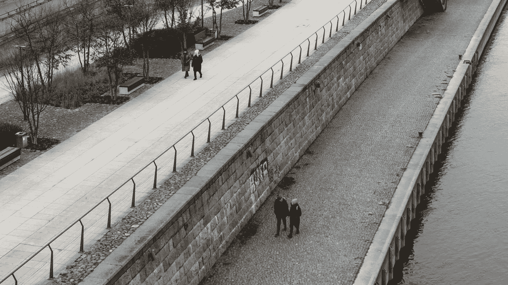

# 合成控制：如果我们能模拟不同的现实会怎样？

> 原文：[`towardsdatascience.com/synthetic-control-what-if-we-could-simulate-alternate-realities-4e88eb69d7b9?source=collection_archive---------5-----------------------#2023-06-10`](https://towardsdatascience.com/synthetic-control-what-if-we-could-simulate-alternate-realities-4e88eb69d7b9?source=collection_archive---------5-----------------------#2023-06-10)

## 一种更好的政策评估方法

 [Bruno Ponne](https://medium.com/@bruno.ponne?source=post_page-----4e88eb69d7b9--------------------------------)

·

[关注](https://medium.com/m/signin?actionUrl=https%3A%2F%2Fmedium.com%2F_%2Fsubscribe%2Fuser%2F2819bc6617ce&operation=register&redirect=https%3A%2F%2Ftowardsdatascience.com%2Fsynthetic-control-what-if-we-could-simulate-alternate-realities-4e88eb69d7b9&user=Bruno+Ponne&userId=2819bc6617ce&source=post_page-2819bc6617ce----4e88eb69d7b9---------------------post_header-----------) 发表在 [Towards Data Science](https://towardsdatascience.com/?source=post_page-----4e88eb69d7b9--------------------------------) · 6 分钟阅读 · 2023 年 6 月 10 日 

--

图片由 [Hubert Buratynski](https://unsplash.com/@hubatxz?utm_source=medium&utm_medium=referral) 提供，来源于 [Unsplash](https://unsplash.com/?utm_source=medium&utm_medium=referral)

> 看呀，看那边
> 
> 太阳到哪里去了
> 
> ***莫比 — 最后一日***

高中时，我清楚地记得曾问我的历史老师：“如果罗马帝国没有衰落，我们的技术今天会有多先进？”她对我的问题并不特别欣赏。实际上，历史学家常常对“如果”问题表示保留，这些问题有时被称为反事实历史。他们更愿意解释和分析发生的事件，而不是可能发生的事件。他们的工作基于事实、来源和证据，而“如果”情景可能导致推测或猜测，削弱了对历史现实的严谨分析。

作为一个在青少年时期内省的白日梦者，我常常在想如果我们没有经历中世纪会发生什么。实证主义科学会更早发展吗？几个世纪以来的战争会更频繁吗？我们会更好地照顾地球吗？

这些问题仍然悬而未决，因为一旦某项发展发生，就不可能体验到一个没有发生那项发展的替代现实。这本质上是因果关系的根本问题……
