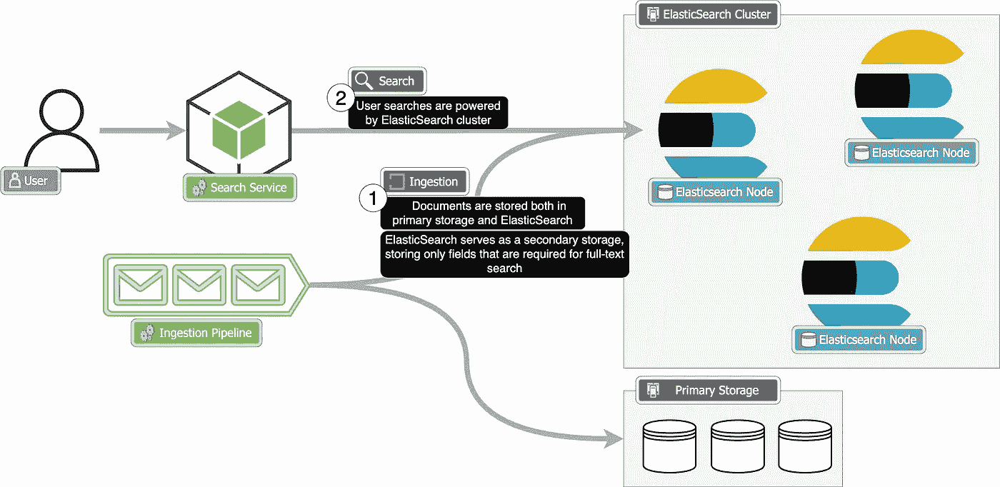
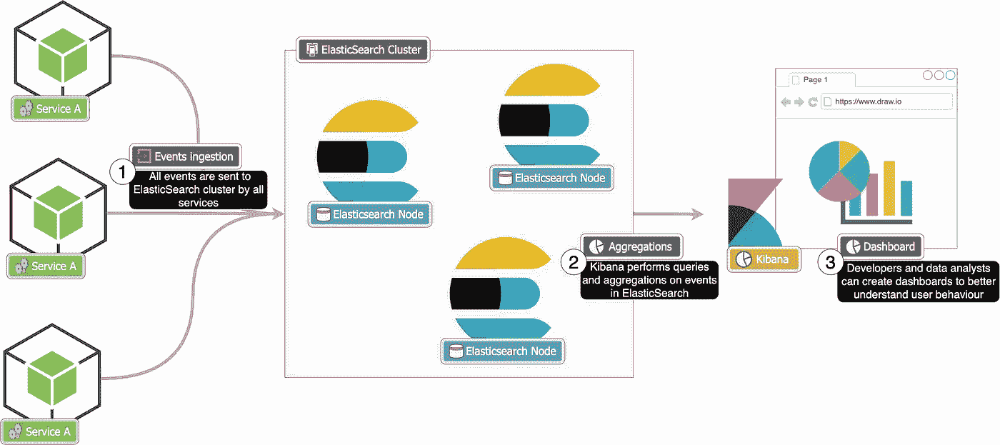

# 系统设计备忘单：ElasticSearch

> 原文：[`towardsdatascience.com/system-design-cheatsheets-elasticsearch-673b98eebfff?source=collection_archive---------0-----------------------#2023-11-28`](https://towardsdatascience.com/system-design-cheatsheets-elasticsearch-673b98eebfff?source=collection_archive---------0-----------------------#2023-11-28)

## 了解如何以及何时在系统中使用 ElasticSearch，并通过三个实际的系统设计示例进行说明

[](https://medium.com/@sanilkhurana7?source=post_page-----673b98eebfff--------------------------------)[](https://towardsdatascience.com/?source=post_page-----673b98eebfff--------------------------------) [Sanil Khurana](https://medium.com/@sanilkhurana7?source=post_page-----673b98eebfff--------------------------------)

·

[关注](https://medium.com/m/signin?actionUrl=https%3A%2F%2Fmedium.com%2F_%2Fsubscribe%2Fuser%2F2bda56b80bb9&operation=register&redirect=https%3A%2F%2Ftowardsdatascience.com%2Fsystem-design-cheatsheets-elasticsearch-673b98eebfff&user=Sanil+Khurana&userId=2bda56b80bb9&source=post_page-2bda56b80bb9----673b98eebfff---------------------post_header-----------) 发表在 [Towards Data Science](https://towardsdatascience.com/?source=post_page-----673b98eebfff--------------------------------) ·13 分钟阅读·2023 年 11 月 28 日[](https://medium.com/m/signin?actionUrl=https%3A%2F%2Fmedium.com%2F_%2Fvote%2Ftowards-data-science%2F673b98eebfff&operation=register&redirect=https%3A%2F%2Ftowardsdatascience.com%2Fsystem-design-cheatsheets-elasticsearch-673b98eebfff&user=Sanil+Khurana&userId=2bda56b80bb9&source=-----673b98eebfff---------------------clap_footer-----------)

--

[](https://medium.com/m/signin?actionUrl=https%3A%2F%2Fmedium.com%2F_%2Fbookmark%2Fp%2F673b98eebfff&operation=register&redirect=https%3A%2F%2Ftowardsdatascience.com%2Fsystem-design-cheatsheets-elasticsearch-673b98eebfff&source=-----673b98eebfff---------------------bookmark_footer-----------)

# 引言

## 什么是搜索？它为何重要？

如果你阅读过我之前关于搜索的文章，你会知道搜索对于应用程序的重要性。想一想：在你每天使用的各种网络应用和移动应用中，无论是 Netflix、Amazon 还是 Swiggy，搜索框可能是唯一一个在所有这些应用中都存在的通用 UI 元素，而且它通常都位于主页的顶部。如果你在设计一个系统，十有九九，你会考虑如何支持搜索功能。

建立一个搜索系统不是小事，但一个很好的起点是 ElasticSearch。如果你对搜索或推荐系统的工作原理一无所知，这篇博客文章是一个很好的起点。我们将讨论 ElasticSearch 是什么，它的适用场景和不适用场景，以及 ElasticSearch 常见的三种设计。搜索系统还有很多其他属性，但这些内容将在文章的后面详细讨论。

## 什么是 ElasticSearch？

ElasticSearch 是一个流行的数据库，它处理的是大多数数据库难以应对的任务：搜索。搜索对于 ElasticSearch 来说至关重要，它甚至体现在它的名字里！

但是如果你还没有听说过 ElasticSearch，你可能会想：为什么搜索这么困难？为什么关系型数据库无法进行搜索？大多数关系型数据库支持多种搜索和过滤数据的方法，比如 `WHERE` 查询、`LIKE` 关键字或索引。或者为什么像 MongoDB 这样的文档数据库无法工作？你也可以在 MongoDB 中编写 `find` 查询。

要理解这个答案，想象你正在建立一个新闻网站。当用户使用你的搜索框搜索新闻时，例如“新德里 COVID19 感染”，用户对所有 *讨论* 新德里 COVID 感染的文章感兴趣。在一个简单的搜索系统中，这意味着扫描数据库中的所有文章，并返回那些包含“COVID19”、“感染”或“新德里”这些词的文章。你不能用关系型数据库做到这一点。关系型数据库允许你基于特定属性搜索文章，比如特定作者撰写的文章或今天发布的文章等，但它不能（至少不能高效地）执行一个扫描 *每一篇* 新闻文章（通常是数千万篇）并返回那些包含特定单词的搜索。

此外，还有许多复杂的细节需要考虑。你如何对这些文章进行评分？也许有一篇文章讨论了 COVID19 的传播，也许有一篇讨论了新感染，你如何知道哪一篇与用户查询更相关，换句话说，你如何根据相关性对这些文章进行排序？

答案是：ElasticSearch！ElasticSearch 可以立即提供所有这些功能和更多。

但是，和世界上其他一切事物一样，它也有其自身的缺点。让我们来探讨一下 ElasticSearch 是什么，什么时候使用它，最重要的是，什么时候不适合使用它。

# ElasticSearch

## 搜索能力

ElasticSearch 提供了一种执行“全文搜索”的方法。全文搜索指的是在大量文档中搜索一个短语或单词。继续我们之前的例子，假设你正在构建一个包含数百万篇新闻文章的新闻网站。每篇文章包含一些数据，比如标题、副标题、文章内容、发布时间等。在 ElasticSearch 的上下文中，每篇文章被存储为一个 JSON 文档。

你可以将所有这些文档加载到 ElasticSearch 中，然后在几毫秒内搜索每个文档中的特定单词或短语。因此，如果你加载所有新闻文章，然后执行一个搜索，比如“COVID19 感染在德里”，ElasticSearch 会返回所有包含“COVID19”、“感染”或“德里”这些词的文章。

为了演示在 ElasticSearch 中的搜索，我们来设置 Elasticsearch 并加载一些数据。对于本文，我将使用[我在 Kaggle 上找到的这个新闻数据集](https://www.kaggle.com/datasets/rmisra/news-category-dataset)(Misra, Rishabh. “News Category Dataset.” arXiv 预印本 arXiv:2209.11429 (2022)) (来源) ([许可证](https://creativecommons.org/licenses/by/4.0/))。该数据集非常简单，包含约 210,000 篇新闻文章，涵盖标题、简短描述、作者以及一些我们不太关注的其他字段。我们并不需要所有 210,000 篇文档，因此我会加载大约 10,000 篇文档到 ES 中并开始搜索。

这些是数据集中一些文档的示例——

```py
[
  {
    "link": "https://www.huffpost.com/entry/new-york-city-board-of-elections-mess_n_60de223ee4b094dd26898361",
    "headline": "Why New York City’s Board Of Elections Is A Mess",
    "short_description": "“There’s a fundamental problem having partisan boards of elections,” said a New York elections attorney.",
    "category": "POLITICS",
    "authors": "Daniel Marans",
    "country": "IN",
    "timestamp": 1689878099
  },
  ....
]
```

每个文档代表一篇新闻文章。每篇文章包含一个 `link`、`headline`、一个 `short_description`、一个 `category`、`authors`、`country`（随机值，由我添加）和 `timestamp`（同样是随机值，由我添加）。

Elasticsearch 查询是用 JSON 编写的。在深入探讨所有不同的语法之前，我们先从简单的开始，逐步构建。

最简单的全文查询之一是 `multi_match` 查询（不用太担心在 ElasticSearch 中查询数据，它非常简单，我们将在文章末尾讨论）。其思想很简单，你编写一个查询，Elasticsearch 执行全文搜索，实质上扫描你数据库中的所有文档，找到包含查询中单词的文档，给它们分配一个评分，并返回这些文档。例如，

```py
GET news/_search
{
  "query": {
    "multi_match": {
      "query": "COVID19 infections"
    }
  }
}
```

上述查询找到了与“COVID19 感染”相关的文章。这些是我得到的结果 -

```py
 [
      {
        "_index" : "news",
        "_id" : "czrouIsBC1dvdsZHkGkd",
        "_score" : 8.842152,
        "_source" : {
          "link" : "https://www.huffpost.com/entry/china-shanghai-lockdown-coronavirus_n_62599aa1e4b0723f8018b9c2",
          "headline" : "Strict Coronavirus Shutdowns In China Continue As Infections Rise",
          "short_description" : "Access to Guangzhou, an industrial center of 19 million people near Hong Kong, was suspended this week.",
          "category" : "WORLD NEWS",
          "authors" : "Joe McDonald, AP",
          "country" : "IN",
          "timestamp" : 1695106458
        }
      },
      {
        "_index" : "news",
        "_id" : "ODrouIsBC1dvdsZHlmoc",
        "_score" : 8.064016,
        "_source" : {
          "link" : "https://www.huffpost.com/entry/who-covid-19-pandemic-report_n_6228912fe4b07e948aed68f9",
          "headline" : "COVID-19 Cases, Deaths Continue To Drop Globally, WHO Says",
          "short_description" : "The World Health Organization said new infections declined by 5 percent in the last week, continuing the downward trend in COVID-19 infections globally.",
          "category" : "WORLD NEWS",
          "authors" : "",
          "country" : "US",
          "timestamp" : 1695263499
        }
      },
      ....
]
```

正如你所见，它返回了讨论 COVID19 感染的文档。它还按相关性顺序对这些文档进行排序（`_score` 字段表示特定文档的相关性）。

ElasticSearch 具有丰富的查询语言和大量功能，但目前只需知道构建一个简单的搜索系统非常容易，只需将所有数据加载到 ElasticSearch 中，并使用我们讨论过的简单查询即可。我们有许多选项可以改进、配置和调整搜索性能和相关性（关于搜索查询的更多内容将在本文末尾讨论）。

## 分布式架构

ElasticSearch 作为分布式数据库工作。这意味着在一个 ElasticSearch 集群中有多个节点。如果一个节点变得不可用或失败，这通常不会导致系统停机，其他节点通常会接管额外的工作并继续服务用户请求。因此，多个节点有助于提高可用性。

多个节点还帮助我们扩展系统，数据和用户请求可以在这些节点之间划分，从而减少每个节点的负载。例如，如果你想在 ElasticSearch 中存储 1 亿篇新闻文章，你可以将这些数据分割到多个节点上，每个节点存储一部分文章。实际上，这非常简单，ElasticSearch 提供了内置功能来使这一过程尽可能简单和无缝。

## 扩展性

ElasticSearch 横向扩展，能够将数据分区到多个节点。这意味着你可以通过增加更多节点来始终提高查询性能。

关于架构你的 ElasticSearch 集群，思考的过程远不止于增加更多服务器。不同类型的节点运行着称为“shards”的进程，每个 shard、节点，可以有多种类型和配置选项。关于 ElasticSearch 集群的架构及其工作原理有很多内容可以讨论，如果你想更深入了解，可以查看我写的完整文章 [这里](https://betterprogramming.pub/system-design-series-elasticsearch-architecting-for-search-5d5e61360463)。

总结：你可以添加更多机器来扩展你的集群并提高性能。数据和查询会被分配到多个机器上，这有助于提高性能和扩展性。

## 基于文档的数据建模

ElasticSearch 是一个文档数据库，它以 JSON 文档格式存储数据，类似于 MongoDB。因此，在我们的例子中，每篇新闻文章都作为 JSON 文档存储在集群中。

## 实时数据分析

实时数据分析是实时查看用户行为并了解用户模式和行为。我们可以绘制用户行为图表，更好地理解我们的用户，从而改进我们的产品。例如，假设我们测量每个用户在新闻网站上的每一次点击、滚动事件和阅读时间。我们将这些指标绘制在仪表板上并观察几天。通过这些数据，我们可以收集大量可操作的见解来改进我们的新闻应用。我们发现用户通常在早上 9-10 点使用网站，并且发现用户通常点击与他们国家相关的文章。利用这些信息，我们可以在高峰期（早上 9-10 点）超配资源，并可能在用户的首页上显示来自他们国家的文章。

Elasticsearch 由于其分布式架构和强大的搜索能力，非常适合实时数据分析。当处理实时数据时，如日志、指标或社交媒体更新，Elasticsearch 能高效地索引和存储这些信息。它的近实时索引使得数据在摄取后几乎可以立即被搜索。Elasticsearch 还可以很好地与其他工具配合使用，如用于可视化的 Kibana 或用于收集指标的 Logstash 和 Beats。

在文章的末尾，我们将探讨一种有助于实现这一点的架构。

## 成本

ElasticSearch 的运行和维护成本很高。正如世上所有美好事物都需付出代价一样，为了执行全文搜索，ElasticSearch 会在 RAM 中保持大量数据并构建复杂的索引。这意味着它需要大量的 RAM 来运行，这也是一笔不小的开支。

简而言之，ElasticSearch 在执行全文搜索时提供了惊人的性能，但它并不便宜。

# 什么时候不该使用 ElasticSearch

## ACID 合规性

ElasticSearch 像大多数 NoSQL 数据库一样，对 ACID 的支持非常有限，因此如果你需要强一致性或事务支持，ElasticSearch 可能不是适合你的数据库选择。其后果是，如果你在 ElasticSearch 中插入一个文档（称为“索引”一个文档），该文档可能不会立即对其他节点可见，并且可能需要几毫秒才能被其他节点看到。

比如说，你正在构建一个银行系统；如果用户向其账户中存款，你希望这些数据能立即对用户执行的其他交易可见。另一方面，如果你使用 ElasticSearch 为你的新闻网站提供搜索服务，当一篇新文章发布时，文章在前几毫秒内对所有用户不可见可能是可以接受的。

## 当你需要复杂的联接时

ElasticSearch 不支持 JOIN 操作或不同表之间的关系。如果你习惯使用关系型数据库，这可能会让你感到有些震惊，但大多数 NoSQL 数据库对这些类型的操作支持有限。

如果你需要执行 JOIN 操作或使用外键来处理高度相关的结构化数据，ElasticSearch 可能不是你用例的最佳选择。

## 小型数据集或简单查询需求

ElasticSearch 复杂且成本高昂。运行和管理大型 ElasticSearch 集群不仅需要软件工程师和 DevOps 工程师的知识和技能，还可能需要擅长管理和架构 ElasticSearch 集群的专家，称为“ElasticSearch 架构师”。有大量的配置选项和架构选择可以尝试，每一个都对你的查询和摄取产生重要影响，从而间接影响系统核心流程中的用户体验。

如果你只需要执行简单的查询或数据量相对较少，那么简单的数据库可能更适合你的应用程序。

# 如何在系统设计中使用 ElasticSearch

一个单一的软件系统通常需要多个数据库，每个数据库支持不同的功能。让我们通过一个例子来更好地理解使用 ElasticSearch 的设计选择。

假设你想构建一个视频流媒体服务，比如 Netflix。让我们看看 ElasticSearch 在这个例子中可以适应的地方。

## 作为搜索系统

ElasticSearch 的一个非常常见的用例是作为支持全文搜索查询的辅助数据库。这对我们的在线视频应用非常有用。我们不能将视频存储在 ElasticSearch 中，并且我们可能也不想将与计费或用户相关的数据存储在 ElasticSearch 中。

为此，我们可以使用其他数据库，但我们可以将电影标题、描述、类型、评分等信息存储在 ElasticSearch 中。

我们可以有一个类似这样的架构：



作者提供的图片

我们可以将我们希望支持全文搜索的数据摄取到 ElasticSearch 中。当用户执行搜索操作时，我们可以查询 ElasticSearch 集群。这样，我们就可以利用 ElasticSearch 的全文搜索功能，当我们需要更新用户信息时，可以在我们的主要存储中执行这些更新。

## 作为实时数据分析管道

正如我们讨论的，了解用户行为和模式是决定如何发展产品的关键步骤。我们可以发布事件，例如点击流事件和滚动事件，以更好地理解用户如何使用我们的产品。

例如，在我们的在线视频应用中，我们可以在用户点击电影或节目时发布包含用户和电影数据的事件。然后我们可以分析和绘制汇总图表，以更好地理解用户如何使用我们的产品。例如，我们可能会注意到用户在晚上使用我们的产品的频率比在下午高，或者用户可能更喜欢用本国语言而非其他语言的节目或电影。利用这些信息，我们可以改进我们的产品，提升用户体验。

这就是使用 ElasticSearch 和 Kibana（一个与 ElasticSearch 配合良好的仪表板工具）的实时数据分析基本系统的样子：



作者提供的图片

## 作为推荐系统

我们可以在 ElasticSearch 中构建查询，以对某些属性给予更多优先级（称为提升）。例如，与简单查询相比

我们可以使用 ElasticSearch 构建基本的推荐系统。我们可以存储有关用户的信息，例如用户的国家、年龄、偏好等，并生成查询，以获取该用户的热门电影节目或系列。

理解查询语言和如何提升某些字段以及执行汇总是一个较大的主题，但我在这里写了一篇涵盖基础知识的博客文章：

[](/mastering-elasticsearch-a-beginners-guide-to-powerful-searches-and-precision-part-1-87686fec9808?source=post_page-----673b98eebfff--------------------------------) ## 掌握 Elasticsearch: 初学者强大的搜索与精准指南 — 第一部分

### 在第一部分解锁 Elasticsearch 的力量：深入了解 Elasticsearch，掌握基本的搜索查询，并探索词汇…

towardsdatascience.com

# 结论

## 如何构建 ElasticSearch 集群？

构建 ElasticSearch 集群绝非易事，它需要了解节点、分片、索引以及如何协调它们。选择几乎是无限的，且领域不断发展（尤其是随着 AI 和 AI 驱动搜索的流行）。为了深入探讨，我写了一篇完整的博客文章，从基础知识到构建搜索集群所需了解的一切：

[](https://betterprogramming.pub/system-design-series-elasticsearch-architecting-for-search-5d5e61360463?source=post_page-----673b98eebfff--------------------------------) [## 系统设计系列: ElasticSearch, 搜索架构设计

### 理解 Elasticsearch 架构和全文搜索

betterprogramming.pub](https://betterprogramming.pub/system-design-series-elasticsearch-architecting-for-search-5d5e61360463?source=post_page-----673b98eebfff--------------------------------)

## 理解搜索查询并改进搜索系统

搜索是复杂的，非常复杂。有很多方法可以改进搜索系统，使其更强大并更理解用户需求。你已经了解了 ElasticSearch 及其功能。从这里开始，构建一个基本的搜索查询，理解查询和系统中的问题，并通过示例一步一步地演变和改进系统。

[](/mastering-elasticsearch-a-beginners-guide-to-powerful-searches-and-precision-part-1-87686fec9808?source=post_page-----673b98eebfff--------------------------------) ## 掌握 Elasticsearch: 初学者强大的搜索与精准指南 — 第一部分

### 在第一部分解锁 Elasticsearch 的力量：深入了解 Elasticsearch，掌握基本的搜索查询，并探索词汇…

towardsdatascience.com

## 上下文感知搜索

我最近读到一个很好的搜索系统类比。你可以把我们讨论的搜索系统看作是一个机械而僵化的搜索。当用户输入一个词时，我们找到所有包含该词的文档并返回它们。

或者你可以把搜索系统想象成一个图书管理员。当用户问一个问题，比如“温斯顿·丘吉尔在第二次世界大战中的角色是什么？”，图书管理员不会仅仅告诉他包含“温斯顿”、“丘吉尔”或“第二次世界大战”这些词的书籍。相反，图书管理员会*评估和理解*客户及其背景。也许是一个小学生，所以她不会推荐一本大教科书，而是找到一本更适合年轻孩子的书。或者她可能没有任何关于温斯顿·丘吉尔的书籍，于是她会找到一本讲述第二次世界大战或英国首相的书籍，并推荐这本书。图书管理员甚至可能会为考试和暑假作业推荐不同的书籍（你们中的一些人可能不知道，但在一些国家，暑假作业量非常大）。

对你我来说这很容易理解，但我们的系统如何知道温斯顿·丘吉尔是英国首相并推荐关于第二次世界大战期间英国的书籍，或者我们的系统如何理解讨论的背景、理解用户并推荐合适的书籍呢？

尽管看起来很困难，但实际上并没有那么难。这叫做语义搜索，它是大多数大型科技公司构建搜索系统的方式。

语义搜索是一组搜索技术，旨在理解用户查询背后的含义和内容的上下文，通过考虑单词之间的关系和搜索意图，从而提供更准确、更相关的搜索结果。

这是一个广泛的话题，我仍在阅读和理解更多内容，但即将发布一篇从基础开始的博客文章，如果你想了解更多这个话题，可以在 Medium 上关注我。

## 其他数据库

我写关于系统设计概念的文章，例如数据库、队列和发布-订阅系统，所以可以在 Medium 上关注我，获取类似的文章。我还在 LinkedIn 上写了很多简短的内容（例如，[这篇文章](https://www.linkedin.com/posts/sanil-khurana-a2503513b_system-design-series-apache-kafka-from-10000-activity-7128222185164341248-D-D9?utm_source=share&utm_medium=member_desktop)讲述了 RabbitMQ 和 Kafka 的区别），所以可以在 LinkedIn 上关注我，获取更短的内容形式[在这里](https://www.linkedin.com/in/sanil-khurana-a2503513b/)。

同时，你可以查看我关于其他数据库和系统设计概念的博客文章-

[](https://medium.com/@sanilkhurana7/lists?source=post_page-----673b98eebfff--------------------------------) [## Sanil Khurana 在 Medium 上策划了一些列表

### 开始探索 Linux、Cassandra、面试问题等

medium.com](https://medium.com/@sanilkhurana7/lists?source=post_page-----673b98eebfff--------------------------------)
