# 系统设计系列：从零开始构建高性能数据流系统的终极指南！

> 原文：[`towardsdatascience.com/system-design-series-0-to-100-guide-to-data-streaming-systems-3dd584bd28fa?source=collection_archive---------0-----------------------#2023-12-17`](https://towardsdatascience.com/system-design-series-0-to-100-guide-to-data-streaming-systems-3dd584bd28fa?source=collection_archive---------0-----------------------#2023-12-17)

 [Sanil Khurana](https://medium.com/@sanilkhurana7?source=post_page-----3dd584bd28fa--------------------------------)

·

[关注](https://medium.com/m/signin?actionUrl=https%3A%2F%2Fmedium.com%2F_%2Fsubscribe%2Fuser%2F2bda56b80bb9&operation=register&redirect=https%3A%2F%2Ftowardsdatascience.com%2Fsystem-design-series-0-to-100-guide-to-data-streaming-systems-3dd584bd28fa&user=Sanil+Khurana&userId=2bda56b80bb9&source=post_page-2bda56b80bb9----3dd584bd28fa---------------------post_header-----------) 发表在 [Towards Data Science](https://towardsdatascience.com/?source=post_page-----3dd584bd28fa--------------------------------) ·12 分钟阅读·2023 年 12 月 17 日

--

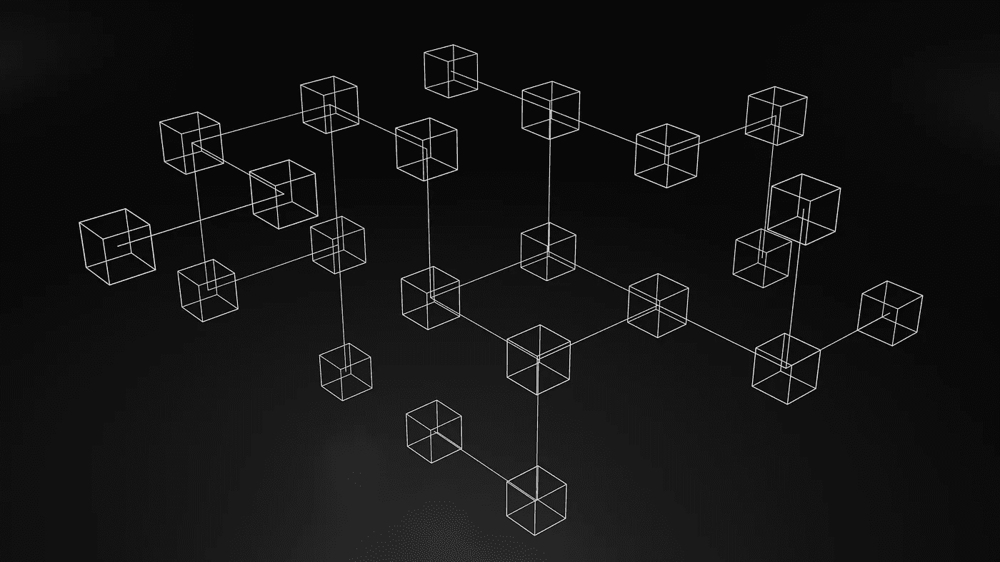

来源：[Unsplash](https://unsplash.com/photos/a-black-and-white-photo-of-a-bunch-of-cubes-gC_aoAjQl2Q)

# 设定一个示例问题：推荐系统

“数据流”听起来非常复杂，而“数据流管道”则更为复杂。在我们讨论这意味着什么并陷入术语之前，让我们从任何软件系统存在的原因——一个问题——开始。

我们的问题非常简单，我们需要为一个电子商务网站（类似于亚马逊）建立一个推荐系统，即一个根据用户偏好返回一组产品的服务。我们暂时不需要为它如何工作而感到疲惫（稍后会详细讨论），现在我们将专注于数据如何发送到这个服务中，以及它如何返回数据。

数据以“事件”的形式发送到服务中。这些事件都是用户执行的特定操作。例如，点击特定产品或搜索查询。简单来说，我们网站上所有的用户互动，从简单的滚动到昂贵的购买，都被视为一个“事件”。

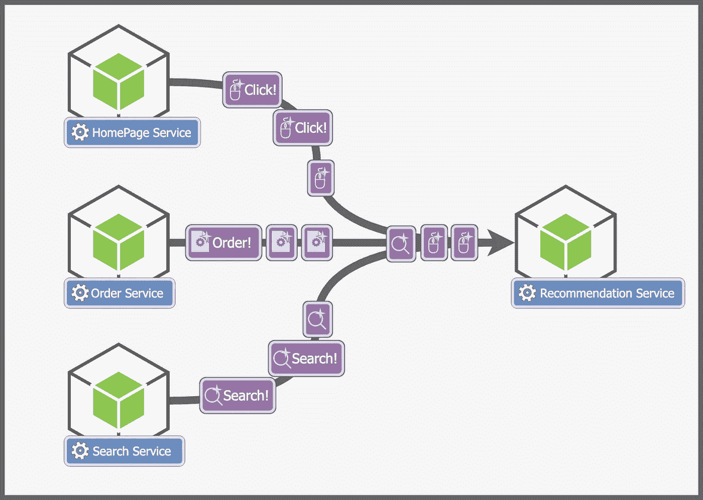

图片来源：作者

这些事件本质上告诉我们有关用户的信息。例如，一个有意购买游戏 PC 的用户可能也会对游戏键盘或鼠标感兴趣。

我们的服务不时会收到获取用户推荐的请求，它的工作很简单，响应用户感兴趣的产品列表。

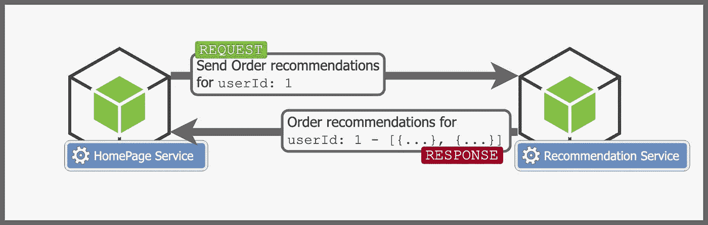

图片来源：作者

目前，我们不关心这些推荐列表是如何生成的，假设这个“推荐服务”执行了一些神奇的步骤（关于这些魔法的更多内容将在文章末尾讨论，现在我们不太关心这些步骤的逻辑），并找出用户的偏好。

推荐在许多系统中通常是事后的考虑，但它比你想象的要重要得多。几乎你使用的每个应用程序都依赖于像这样的推荐服务来驱动用户行为。例如，根据[这篇论文](https://library.ucsd.edu/dc/object/bb8503744c/_2_1.pdf)，35%的亚马逊网络销售是通过推荐商品生成的。

然而，问题在于数据的巨大规模。即使我们运行的是一个中等流行的网站，在高峰时段，我们仍可能每秒接收到数十万（甚至可能是百万）个事件！如果有新产品或大型促销活动，那么这个数量可能会更高。

但我们面临的问题不仅仅如此。我们必须实时处理这些数据（执行之前讨论的魔法），并实时向用户提供推荐！如果有促销活动，即使是几分钟的推荐更新延迟也可能对业务造成重大财务损失。

# 什么是数据流处理管道？

数据流处理管道就是我上面描述的那样。它是一个接收连续数据（如事件）、执行多个处理步骤并存储结果以备未来使用的系统。

在我们的案例中，事件将来自多个服务，我们的处理步骤将涉及几个“神奇”的步骤来计算用户的推荐，然后我们将在数据存储中更新每个用户的推荐。当我们收到对特定用户推荐的查询时，我们只需获取之前存储的推荐并返回它们。

这篇文章的目的是了解如何处理这种规模的数据，如何摄取、处理和输出这些数据以供以后使用，而不是了解处理步骤的实际逻辑（但我们仍会稍微探讨一下，增加一些趣味）。

# 创建数据流管道：逐步指南

这涉及到许多方面，如数据摄取、处理、输出和查询，因此我们一步一步来。把每一步看作是一个较小的、孤立的问题。在每一步，我们将从最直观的解决方案开始，看看它为什么不起作用，然后构建一个有效的解决方案。

## 数据摄取

让我们从管道的起点开始，数据摄取。数据摄取问题相对容易理解，目标只是从多个来源摄取事件。

作者提供的图片

但虽然问题看起来简单，它也有其复杂的方面，

1.  数据的规模非常大，轻松达到每秒数十万事件。

1.  所有这些事件必须实时摄取，我们不能有哪怕几秒钟的延迟。

我们从简单的开始，实现这一目标的最直观方法是将每个事件作为请求发送到推荐系统，但这个解决方案存在许多问题。

1.  发送事件的服务不应等待我们的推荐服务的响应。这会增加服务的延迟，并在推荐服务发送 200 状态码之前阻塞它们。它们应该改为发送“火并忘”的请求。

1.  事件的数量会高度波动，一整天都会上下波动（例如，晚上或促销期间会增加），我们需要根据事件的规模来扩展我们的推荐服务。这是我们需要管理和计算的内容。

1.  如果我们的推荐服务崩溃，我们将会在其停机期间丢失事件。在这种架构中，我们的推荐服务是一个单点故障。

我们可以通过使用消息代理或像 Apache Kafka 这样的“事件流平台”来解决这个问题。如果你不知道这是什么，它简单来说就是一个工具，可以从“发布者”那里接收消息并发布到特定主题上。“订阅者”监听或订阅这些主题，每当在主题上发布消息时，订阅者就会收到消息。我们将在下一节中进一步讨论 Kafka 主题。

你需要了解关于 Kafka 的一点是，它促进了生产者和消费者之间的解耦架构。生产者可以在 Kafka 主题上发布消息，而不需要关心消费者何时、如何或是否消费消息。消费者可以在自己的时间消费消息并处理它。Kafka 也能够实现非常高的扩展，因为它可以水平扩展，并且线性扩展，提供几乎无限的扩展能力（只要我们继续增加更多机器）。

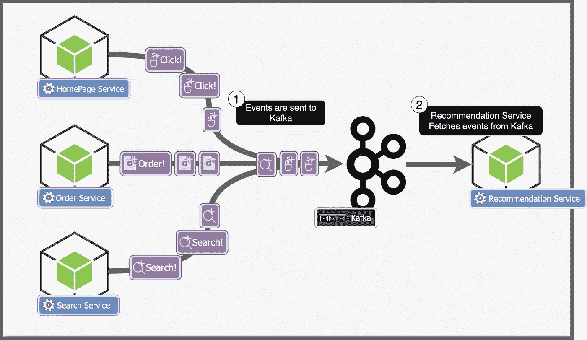

作者提供的图片

所以每个服务将事件发送到 Apache Kafka。推荐服务从 Kafka 中获取这些事件。让我们看看这对我们有什么帮助 —

1.  事件是异步处理的，服务不再需要等待推荐服务的响应。

1.  扩展 Kafka 更加容易，如果事件的规模增加，Kafka 将简单地存储更多事件，同时我们也扩展我们的推荐服务。

1.  即使推荐服务崩溃，我们也不会丢失任何事件。事件被持久化在 Kafka 中，因此我们不会丢失任何数据。

现在我们知道如何将事件引入我们的服务，让我们转到架构的下一部分——处理事件。

## 数据处理

数据处理是我们数据管道的一个组成部分。一旦我们接收到事件，我们需要为用户生成新的推荐。例如，如果用户搜索“显示器”，我们需要基于这个搜索更新该用户的推荐，也许会添加用户对显示器感兴趣的信息。

在我们进一步讨论架构之前，让我们忘记这些，稍微谈谈如何生成推荐。这也是机器学习发挥作用的地方，虽然理解这些内容对继续阅读文章并不是非常重要，但它非常有趣，所以我会尝试给出一个非常基础的简要描述。

让我们更好地理解用户互动及其含义。当用户通过搜索、点击或滚动事件与我们的网站互动时，用户是在告诉我们他/她的兴趣。我们的目标是理解这些互动，并利用它们来了解用户。

当你想到一个用户时，你可能会想到一个有姓名、年龄等个人信息的人。然而，为了我们的目的，将每个用户视为一个向量，或者简单地说是一组数字会更容易理解。听起来可能有些令人困惑（毕竟用户怎么能用一组数字来表示呢），但请耐心看下去，我们来看看这是怎么工作的。

假设我们可以将每个用户（或他的/她的兴趣）表示为二维空间中的一个点。每个轴表示用户的一个特征。假设 X 轴表示他/她喜欢旅行的程度，Y 轴表示他/她喜欢摄影的程度。用户的每个行为都会影响这个用户在二维空间中的位置。

假设一个用户在我们的二维空间中从以下点开始 —

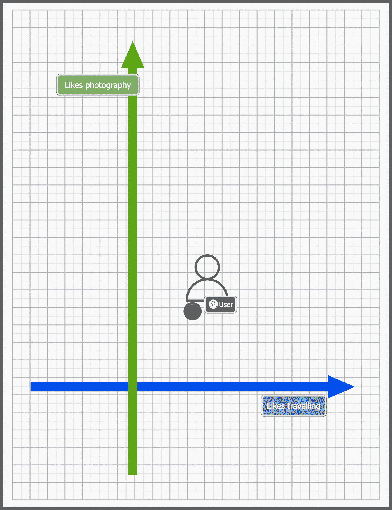

作者提供的图片

当用户搜索“旅行包”时，我们将点向右移动，因为这表明用户喜欢旅行。

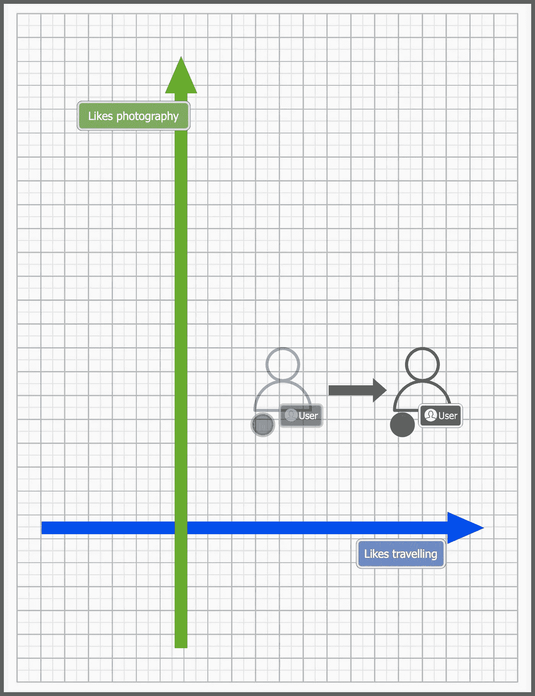

作者提供的图片

如果用户搜索了相机，我们将把用户向 Y 轴方向上移。

我们还将每个产品表示为相同二维空间中的一个点。

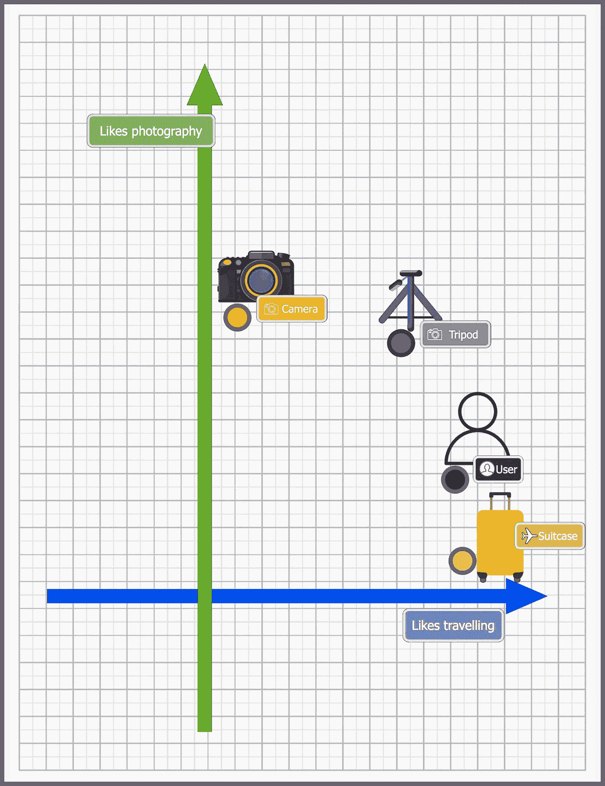

作者提供的图片

上图中用户的位置表明用户喜欢旅行，并且也有一点喜欢摄影。每个产品的位置也是根据它们与摄影和旅行的相关性来放置的。

由于用户和产品只是二维空间中的点，我们可以对它们进行比较和数学运算。例如，从上面的图表中，我们可以找到离用户最近的产品，在这种情况下是行李箱，并自信地说它是用户的一个好推荐。

上面是推荐系统的一个非常基础的介绍（更多内容请参见文章末尾）。这些向量（通常比 2 维大得多）被称为嵌入（用户嵌入表示我们的用户，产品嵌入表示我们网站上的产品）。我们可以使用不同类型的机器学习模型生成它们，虽然它们比我描述的要复杂得多，但基本原理是一样的。

回到我们的问题。对于每个事件，我们需要更新用户的嵌入（在我们的 n 维图表上移动用户），并返回相关的产品作为推荐。

让我们考虑一下生成这些嵌入所需的几个基本步骤，

1.  `update-embeddings`：更新用户的嵌入

1.  `gen-recommendations`：获取与用户嵌入相关（或接近）的产品

1.  `save`：保存生成的推荐和事件

我们可以为每种类型的事件构建一个 Python 服务。

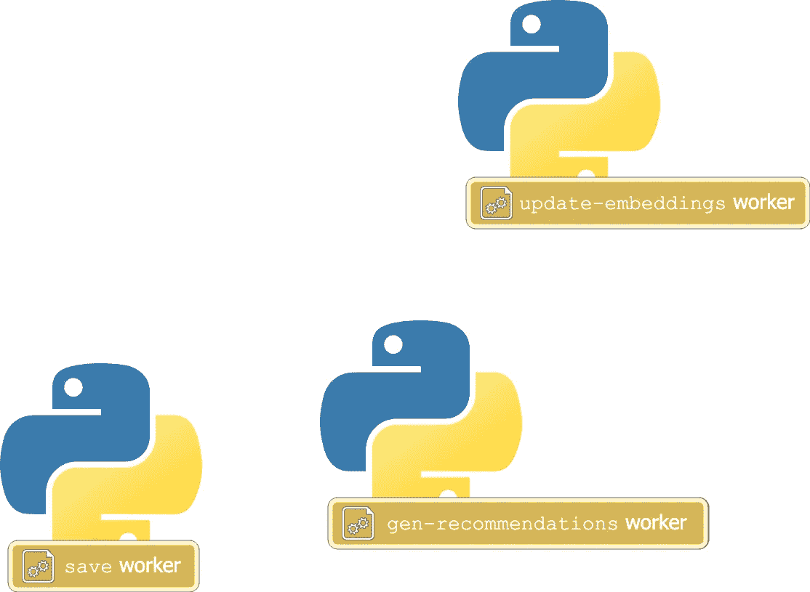

作者提供的图片

每个微服务会监听一个 Kafka 主题，处理事件，然后将其发送到下一个主题，在那里一个不同的服务会监听。

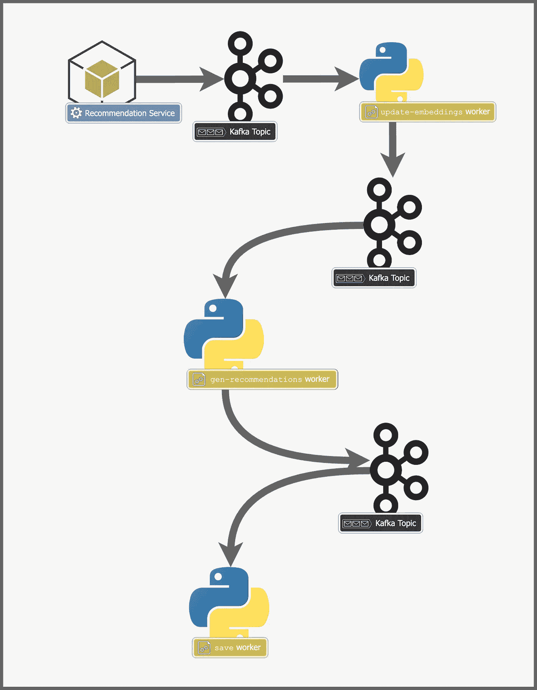

作者提供的图片

由于我们再次使用 Kafka 而不是发送请求，这种架构也给我们带来了之前讨论的所有优势。没有单一的 Python 微服务是单点故障，处理规模也更容易。最后一个服务`save-worker`需要保存推荐以供将来使用。让我们看看它是如何工作的。

## 数据接收端

一旦我们处理了一个事件，并生成了推荐，我们需要存储事件和推荐数据。在决定将事件和推荐数据存储在哪里之前，让我们考虑数据存储的要求。

1.  可扩展性和高写入吞吐量 — 记住我们有大量的事件到达，每个事件还会更新用户推荐。这意味着我们的数据存储应该能够处理非常高数量的写入。我们的数据库应该具有高度的可扩展性，并且能够线性扩展。

1.  简单查询 — 我们不会执行复杂的 JOIN 操作，也不会进行各种类型的查询。我们的查询需求相对简单，对于给定的用户，返回预计算的推荐列表。

1.  无 ACID 要求 — 我们的数据库不需要强 ACID 合规性。它不需要对一致性、原子性、隔离性和持久性提供任何保证。

简单来说，我们关注的是一个可以处理极大规模的数据库，没有额外的花里胡哨。

Cassandra 是满足这些要求的完美选择。由于其去中心化的架构，它可以线性扩展，并且能够处理非常高的写入吞吐量，这正是我们需要的。

我们可以使用两个表，一个用于存储每个用户的推荐，另一个用于存储事件。最后的 Python 微服务 `save` 工作人员将把事件和推荐数据保存在 Cassandra 中。

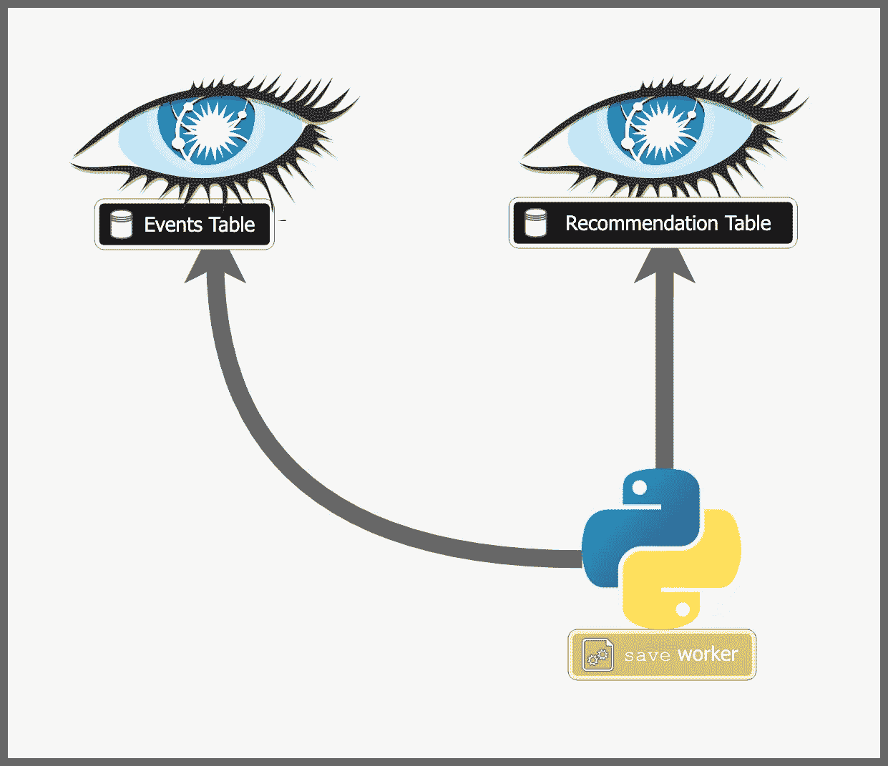

图片来源于作者

## 查询

查询非常简单。我们已经为每个用户计算并持久化了推荐。要查询这些推荐，我们只需查询我们的数据库并获取特定用户的推荐。

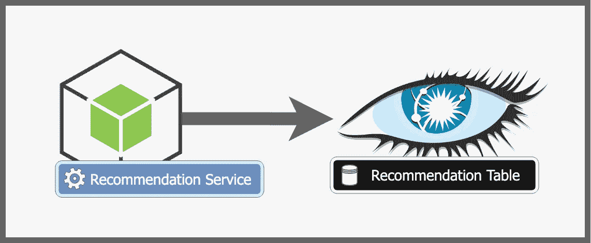

图片来源于作者

# 完整架构

就这样！我们完成了整个架构，让我们画出完整的架构，看看它是什么样子的。

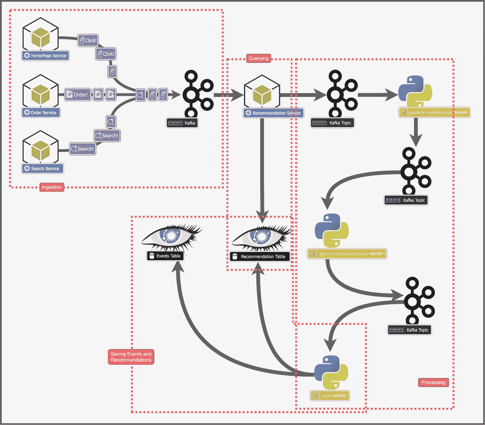

图片来源于作者

# 进一步学习

## Kafka

Kafka 是 LinkedIn 开发的一个惊人的工具，用于处理极大的规模（[这篇](https://engineering.linkedin.com/kafka/running-kafka-scale) LinkedIn 在 2015 年的博客文章讨论了每秒约 1300 万条消息！）。

Kafka 在线性扩展和处理极高规模方面非常出色，但要构建这样的系统，工程师需要了解和理解 Kafka，它是什么，它如何工作，以及与其他工具的对比。

我写了一篇博客文章，解释了 Kafka 是什么，它与消息代理的不同之处，以及 LinkedIn 工程师撰写的原始 Kafka 论文的摘录。如果你喜欢这篇文章，看看我关于 Kafka 的文章 —

 [## 系统设计系列：从 10,000 英尺看 Apache Kafka

### 让我们来看看 Kafka 是什么，它是如何工作的以及我们什么时候应该使用它！

betterprogramming.pub](https://betterprogramming.pub/system-design-series-apache-kafka-from-10-000-feet-9c95af56f18d?source=post_page-----3dd584bd28fa--------------------------------)

## Cassandra

Cassandra 是一种独特的数据库，旨在处理非常高的写入吞吐量。它能够处理如此高吞吐量的原因在于其高度可扩展的去中心化架构。我最近写了一篇博客文章讨论 Cassandra、它是如何工作的，以及最重要的何时使用它和何时不使用它 —

[## 系统设计解决方案：何时使用 Cassandra 以及何时不使用](https://medium.com/geekculture/system-design-solutions-when-to-use-cassandra-and-when-not-to-496ba51ef07a?source=post_page-----3dd584bd28fa--------------------------------)

### 关于何时使用 Cassandra 以及何时不使用 Cassandra 的所有信息

[medium.com](https://medium.com/geekculture/system-design-solutions-when-to-use-cassandra-and-when-not-to-496ba51ef07a?source=post_page-----3dd584bd28fa--------------------------------)

## 推荐系统

推荐系统是非常出色的技术，它们几乎在你我今天使用的所有应用程序中都得到了应用。在任何系统中，个性化和推荐系统形成了用户搜索和发现流程的核心。

我一直在写关于搜索系统的内容，并稍微涉及了一下如何在搜索系统中构建基础的个性化功能，但我的下一个话题将深入探讨推荐引擎的细节，它们是如何工作的，以及如何设计它们。如果这对你感兴趣，请在 Medium 上关注我以获取更多内容！我也在 LinkedIn 上发布了很多简短的内容，例如，[这篇](https://www.linkedin.com/posts/sanil-khurana-a2503513b_database-tech-softwareengineer-activity-7064441910639161344-1mQz?utm_source=share&utm_medium=member_desktop)关于 Kafka Connect 的帖子，描述了它的工作原理以及为什么它如此受欢迎，仅用一个简单的图表。

# 结论

我喜欢讨论有趣且复杂的话题，并将其分解成 10 分钟的阅读内容。如果你喜欢这篇文章，请在 Medium 上关注我以获取更多类似的内容！ [在 LinkedIn 上关注我](https://www.linkedin.com/in/sanil-khurana-a2503513b?utm_source=share&utm_campaign=share_via&utm_content=profile&utm_medium=android_app) ，每天获取更小、更常规的指南，逐步提升你的技术和设计知识。

希望你喜欢这篇文章，如果你对这篇文章有任何反馈或对我接下来应该讨论的内容有任何想法，可以在评论中发表！
