# 从头实现 t-SNE（配合 NumPy）

> 原文：[`towardsdatascience.com/t-sne-from-scratch-ft-numpy-172ee2a61df7?source=collection_archive---------2-----------------------#2023-04-14`](https://towardsdatascience.com/t-sne-from-scratch-ft-numpy-172ee2a61df7?source=collection_archive---------2-----------------------#2023-04-14)

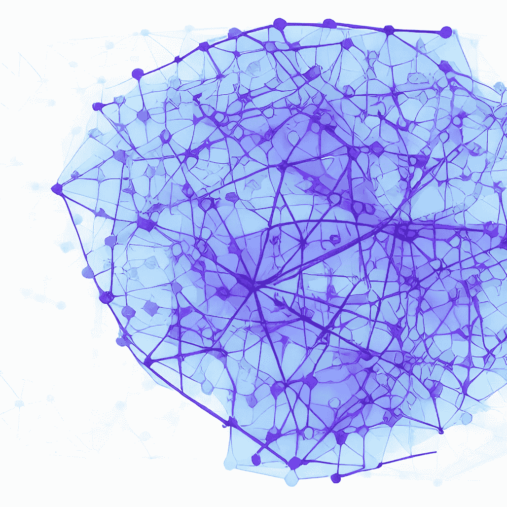

封面图片由作者提供

## 通过从头实现 t-SNE 并使用 Python，深入理解其内部工作原理

[](https://medium.com/@jakepenzak?source=post_page-----172ee2a61df7--------------------------------)[](https://towardsdatascience.com/?source=post_page-----172ee2a61df7--------------------------------) [Jacob Pieniazek](https://medium.com/@jakepenzak?source=post_page-----172ee2a61df7--------------------------------)

·

[关注](https://medium.com/m/signin?actionUrl=https%3A%2F%2Fmedium.com%2F_%2Fsubscribe%2Fuser%2F6f0948d99b1c&operation=register&redirect=https%3A%2F%2Ftowardsdatascience.com%2Ft-sne-from-scratch-ft-numpy-172ee2a61df7&user=Jacob+Pieniazek&userId=6f0948d99b1c&source=post_page-6f0948d99b1c----172ee2a61df7---------------------post_header-----------) 发表在 [Towards Data Science](https://towardsdatascience.com/?source=post_page-----172ee2a61df7--------------------------------) ·17 分钟阅读·2023 年 4 月 14 日 [](https://medium.com/m/signin?actionUrl=https%3A%2F%2Fmedium.com%2F_%2Fvote%2Ftowards-data-science%2F172ee2a61df7&operation=register&redirect=https%3A%2F%2Ftowardsdatascience.com%2Ft-sne-from-scratch-ft-numpy-172ee2a61df7&user=Jacob+Pieniazek&userId=6f0948d99b1c&source=-----172ee2a61df7---------------------clap_footer-----------)

--

[](https://medium.com/m/signin?actionUrl=https%3A%2F%2Fmedium.com%2F_%2Fbookmark%2Fp%2F172ee2a61df7&operation=register&redirect=https%3A%2F%2Ftowardsdatascience.com%2Ft-sne-from-scratch-ft-numpy-172ee2a61df7&source=-----172ee2a61df7---------------------bookmark_footer-----------)

我发现，*真正*理解任何统计算法或方法的最佳方式之一就是亲自实现它。另一方面，编写这些算法有时会很耗时且非常麻烦，如果别人已经完成了，为什么我还要花时间去做呢——这似乎不太高效，不是吗？这两个观点都很公平，我并不是要为其中一个观点辩护。

本文旨在通过将 [原始论文](https://jmlr.org/papers/volume9/vandermaaten08a/vandermaaten08a.pdf) — 由 Laurens van der Maaten 和 Geoffrey Hinton 合作编写 — 中的数学翻译成 Python 代码实现来帮助读者理解 t-SNE。[1] 我发现这类练习对于揭示统计算法/模型的内部工作机制非常有启发性，并真正测试你对这些算法/模型的理解和假设。你几乎可以肯定地带着比以前更好的理解离开。至少，成功的实现总是非常令人满意的！

本文对任何程度接触 t-SNE 的读者都是可访问的。然而，请注意这篇文章绝对**不是**：

1.  对 t-SNE 的*严格*概念性介绍和探索，因为有很多其他很棒的资源已经做到了这一点；尽管如此，我将尽力将数学方程式与其直观/概念性对应物在每个实现阶段连接起来。

1.  对 t-SNE 的应用及优缺点的*全面*讨论，以及 t-SNE 与其他降维技术的直接比较。我将会在本文中简要提及这些话题，但绝不会深入探讨。

言归正传，让我们开始对 t-SNE 的*简要*介绍。

## t-SNE 简要介绍

*t-分布随机邻居嵌入*（*t-SNE）是一个降维工具，主要用于具有大维度特征空间的数据集，能够将数据可视化到更低维度的空间（通常是 2-D）。它特别适用于可视化非线性可分数据，其中线性方法如[主成分分析](https://en.m.wikipedia.org/wiki/Principal_component_analysis)（PCA）会失败。将线性降维框架（如 PCA）推广到非线性方法（如 t-SNE）也称为[流形学习](https://en.m.wikipedia.org/wiki/Nonlinear_dimensionality_reduction)。这些方法对于可视化和理解高维非线性数据集的基础结构非常有用，并且对解开和分组在高维空间中相似的观察值很有帮助。有关 t-SNE 和其他流形学习技术的更多信息，[scikit-learn 文档](https://scikit-learn.org/stable/modules/manifold.html) 是一个很好的资源。此外，要了解 t-SNE 的一些有趣应用领域，[维基百科页面](https://en.wikipedia.org/wiki/T-distributed_stochastic_neighbor_embedding#cite_note-3) 列出了这些领域及其相关工作的参考资料。

让我们先把名字 *t-distributed stochastic neighbor embedding* 拆解成它的组成部分。t-SNE 是对 6 年前 Geoffrey Hinton 和 Sam Roweis 在这篇[论文](https://cs.nyu.edu/~roweis/papers/sne_final.pdf)中提出的随机邻域嵌入 (SNE) 的扩展。让我们从那里开始。名字中的 *stochastic* 部分源于目标函数不是凸的，因此不同的初始化可能会产生不同的结果。*neighbor embedding* 突出了算法的特性——在尽可能保留点的“邻域”结构的同时，将原始高维空间中的点最佳映射到相应的低维空间。SNE 包含以下（简化的）步骤：

1.  *获得原始空间中点之间的相似性矩阵：* 计算每个数据点 *j* 相对于每个数据点 *i* 的条件概率。这些条件概率是在原始高维空间中使用以 *i* 为中心的高斯分布计算的，并具有以下解释：*i* 选择 *j* 作为其在原始空间中邻居的概率。这会创建一个表示点之间相似性的矩阵。

1.  *初始化：* 在低维空间（例如 2-D）中为每个原始空间中的数据点选择随机起点，并在这个新空间中类似地计算新的条件概率。

1.  *映射：* 迭代改进低维空间中的点，直到所有条件概率之间的*[Kullback-Leibler](https://en.wikipedia.org/wiki/Kullback%E2%80%93Leibler_divergence)* 发散度最小化。本质上，我们正在最小化两个空间的相似性矩阵之间的概率差异，以确保在将原始高维数据集映射到低维数据集时，尽可能保留相似性。

t-SNE 主要通过两种方式改进 SNE：

1.  它最小化了*[Kullback-Leibler](https://en.wikipedia.org/wiki/Kullback%E2%80%93Leibler_divergence)* 发散度，而不是条件概率之间的发散度。作者称之为“对称 SNE”，因为他们的方法确保了联合概率 *p_ij* = *p_ji*。**这使得成本函数的表现大大改善，更易于优化。**

1.  它使用具有一个自由度的[Student-t 分布](https://en.wikipedia.org/wiki/Student%27s_t-distribution)（也就是[柯西分布](https://en.wikipedia.org/wiki/Cauchy_distribution)）来计算点之间的相似性，而不是在*低维*空间中使用高斯分布（上面的第 2 步）。在这里我们可以看到 t-SNE 中的“t”来自哪里。**这一改进有助于缓解作者所强调的“拥挤问题”，并进一步改善优化问题。** “拥挤问题”可以这样理解：假设我们有一个 10 维空间，那么在 2 维空间中可用的空间将不足以准确捕捉那些适度不相似的点，而与 10 维空间中相邻点所占用的空间相比，2 维空间的空间远远不够。更简单地说，只需设想将 3 维空间投影到 2 维空间，3 维空间将有更多的整体空间来建模相似性，相对于投影到 2 维的空间。Student-t 分布通过具有比正态分布更重的尾部来帮助缓解这个问题。有关这个问题的更深入的讨论，请参见[原始论文](https://jmlr.org/papers/volume9/vandermaaten08a/vandermaaten08a.pdf)。

如果这些内容没有立即跟上，那也没关系！我希望当我们在代码中实现这些时，所有部分都会迎刃而解。主要的要点是：**t-SNE 在高维空间中通过“数据点选择其他点作为邻居”的联合概率来建模数据点之间的相似性，然后尝试找到这些点映射到低维空间的最佳方式，同时尽可能保留原始高维相似性。**

## 从头开始的实现

现在让我们继续了解 t-SNE，方法是实现 Laurens van der Maaten 和 Geoffrey Hinton 在[论文](https://lvdmaaten.github.io/publications/papers/JMLR_2008.pdf)中提出的算法原版。我们将首先逐步实现下面的算法 1，这将涵盖主算法的 95%。作者还提到了两个额外的改进：1) 早期夸张和 2) 自适应学习率。我们将仅讨论添加早期夸张，因为这有助于解释实际算法的内部工作原理，而自适应学习率则侧重于提高收敛速度。

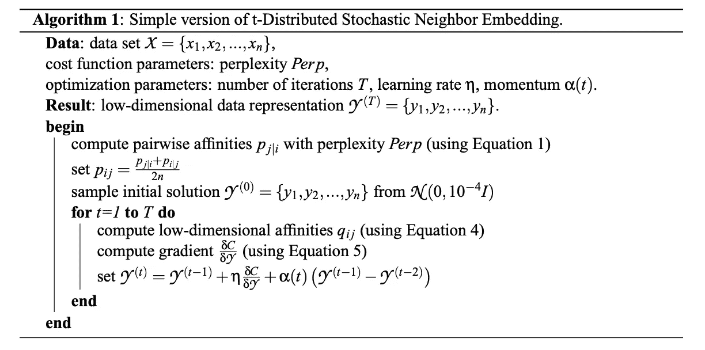

算法 1（见[论文](https://lvdmaaten.github.io/publications/papers/JMLR_2008.pdf)）

**1\. 输入和输出**

根据原始[论文](https://lvdmaaten.github.io/publications/papers/JMLR_2008.pdf)，我们将使用来自 OpenML 的公开 MNIST [数据集](https://www.openml.org/search?type=data&status=active&id=554)，该数据集包含从 0 到 9 的手写数字图像。[2] 我们还将从数据集中随机抽取 1000 张图像，并使用主成分分析 (PCA) 降维，将组件数保留为 30。这两者都是为了提高算法的计算时间，因为这里的代码没有针对速度进行优化，而是为了可解释性和学习。

```py
from sklearn.datasets import fetch_openml
from sklearn.decomposition import PCA
import pandas as pd

# Fetch MNIST data
mnist = fetch_openml('mnist_784', version=1, as_frame=False)
mnist.target = mnist.target.astype(np.uint8)

X_total = pd.DataFrame(mnist["data"])
y_total = pd.DataFrame(mnist["target"])

X_reduced = X_total.sample(n=1000)
y_reduced = y_total.loc[X_total.index]

# PCA to keep 30 components
X = PCA(n_components=30).fit_transform(X_reduced) 
```

这将是我们的 *X* 数据集，每一*行*是一个图像，每一*列*是一个特征，或者在这种情况下是主成分（即原始像素的线性组合）：

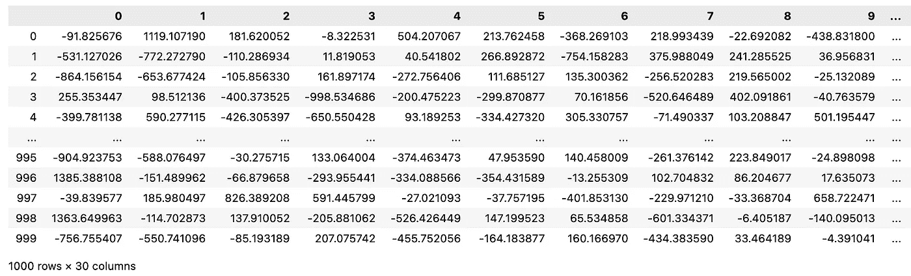

从 MNIST 数据集中抽取的 1000 个样本及前 30 个主成分

我们还需要指定代价函数参数——困惑度——以及优化参数——迭代次数、学习率和动量。我们现在暂时不讨论这些参数，而是在每个阶段出现时再进行处理。

就输出而言，请记住，我们寻求的是原始数据集 *X* 的低维映射。在整个示例中，我们将把原始空间映射到二维空间。因此，我们的新输出将是现在以二维空间表示的 1000 张图像，而不是原始的 30 维空间：

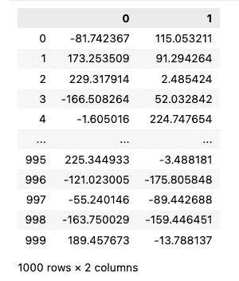

所需的二维空间输出

**2\. 计算原始空间中 *X* 的亲和力/相似度**

现在我们有了输入，第一步是计算原始高维空间中的成对相似度。即，对于每个图像 *i*，我们计算 *i* 在原始空间中选择图像 *j* 作为其邻居的概率。这些概率是通过围绕每个点的正态分布计算的，然后归一化为总和为 1。数学上，我们有：


Eq. (1) — 高维亲和力

请注意，在我们的例子中，*n = 1000*，这些计算将产生一个 *1000* x *1000* 的相似度评分矩阵。注意，我们在 *i = j* 时将 *p = 0*，因为我们正在建模成对相似度。然而，你可能会注意到，我们没有提到如何确定 σ。这个值是通过基于用户指定的期望[困惑度](https://en.wikipedia.org/wiki/Perplexity)的网格搜索为每个观察值 *i* 确定的。我们将立即讨论这个问题，但首先让我们看看如何编写上述公式（1）的代码：

```py
def get_original_pairwise_affinities(X: np.ndarray, perplexity: int = 10) -> np.ndarray:
    """
    Function to obtain affinities matrix.

    Parameters:
    X (np.ndarray): The input data array.
    perplexity (int): The perplexity value for the grid search.

    Returns:
    np.ndarray: The pairwise affinities matrix.
    """

    n = len(X)

    print("Computing Pairwise Affinities....")

    p_ij = np.zeros(shape=(n, n))
    for i in range(0, n):
        # Equation 1 numerator
        diff = X[i] - X
        σ_i = grid_search(diff, i, perplexity)  # Grid Search for σ_i
        norm = np.linalg.norm(diff, axis=1)
        p_ij[i, :] = np.exp(-(norm**2) / (2 * σ_i**2))

        # Set p = 0 when j = i
        np.fill_diagonal(p_ij, 0)

        # Equation 1
        p_ij[i, :] = p_ij[i, :] / np.sum(p_ij[i, :])

    # Set 0 values to minimum numpy value (ε approx. = 0)
    ε = np.nextafter(0, 1)
    p_ij = np.maximum(p_ij, ε)

    print("Completed Pairwise Affinities Matrix. \n")

    return p_ij
```

在我们查看这段代码的结果之前，让我们讨论一下如何通过 grid_search() 函数确定 σ 的值。给定一个指定的 perplexity 值（在这种情况下可以大致理解为每个点的最近邻数量），我们对一系列 σ 值进行网格搜索，以便使以下方程对于每个 *i* 尽可能接近等式：


Perplexity

其中 H(P) 是 P 的香农 [熵](https://en.wikipedia.org/wiki/Entropy_(information_theory))。


P 的香农熵

在我们的案例中，我们将 perplexity 设置为 10，并将搜索空间定义为 [0.01 * 图像 *i* 和 *j* 之间差异的范数的标准差，5 * 图像 *i* 和 *j* 之间差异的范数的标准差]，分成 200 个相等的步长。知道这一点后，我们可以按如下方式定义我们的 grid_search() 函数：

```py
def grid_search(diff_i: np.ndarray, i: int, perplexity: int) -> float:
    """
    Helper function to obtain σ's based on user-specified perplexity.

    Parameters:
        diff_i (np.ndarray): Array containing the pairwise differences between data points.
        i (int): Index of the current data point.
        perplexity (int): User-specified perplexity value.

    Returns:
        float: The value of σ that satisfies the perplexity condition.
    """

    result = np.inf  # Set first result to be infinity

    norm = np.linalg.norm(diff_i, axis=1)
    std_norm = np.std(norm)  # Use standard deviation of norms to define search space

    for σ_search in np.linspace(0.01 * std_norm, 5 * std_norm, 200):
        # Equation 1 Numerator
        p = np.exp(-(norm**2) / (2 * σ_search**2))

        # Set p = 0 when i = j
        p[i] = 0

        # Equation 1 (ε -> 0)
        ε = np.nextafter(0, 1)
        p_new = np.maximum(p / np.sum(p), ε)

        # Shannon Entropy
        H = -np.sum(p_new * np.log2(p_new))

        # Get log(perplexity equation) as close to equality
        if np.abs(np.log(perplexity) - H * np.log(2)) < np.abs(result):
            result = np.log(perplexity) - H * np.log(2)
            σ = σ_search

    return σ
```

有了这些函数，我们可以通过`p_ij = get_original_pairwise_affinities(X)`计算亲和矩阵，从而得到以下矩阵：

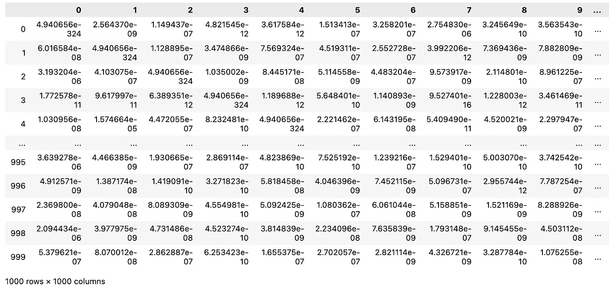

原始高维空间中条件概率的亲和矩阵

请注意，主对角线元素按构造设置为 ε ≈ 0（每当 *i = j* 时）。请记住，t-SNE 算法的一个关键扩展是计算联合概率而不是条件概率。这可以简单地按如下方式计算：


将条件概率转换为联合概率

因此，我们可以定义一个新函数：

```py
def get_symmetric_p_ij(p_ij: np.ndarray) -> np.ndarray:
    """
    Function to obtain symmetric affinities matrix utilized in t-SNE.

    Parameters:
    p_ij (np.ndarray): The input affinity matrix.

    Returns:
    np.ndarray: The symmetric affinities matrix.

    """
    print("Computing Symmetric p_ij matrix....")

    n = len(p_ij)
    p_ij_symmetric = np.zeros(shape=(n, n))
    for i in range(0, n):
        for j in range(0, n):
            p_ij_symmetric[i, j] = (p_ij[i, j] + p_ij[j, i]) / (2 * n)

    # Set 0 values to minimum numpy value (ε approx. = 0)
    ε = np.nextafter(0, 1)
    p_ij_symmetric = np.maximum(p_ij_symmetric, ε)

    print("Completed Symmetric p_ij Matrix. \n")

    return p_ij_symmetric
```

将上面的`p_ij`代入，我们得到`p_ij_symmetric = get_symmetric_p_ij(p_ij)`，从而获得以下*symmetric*亲和矩阵：

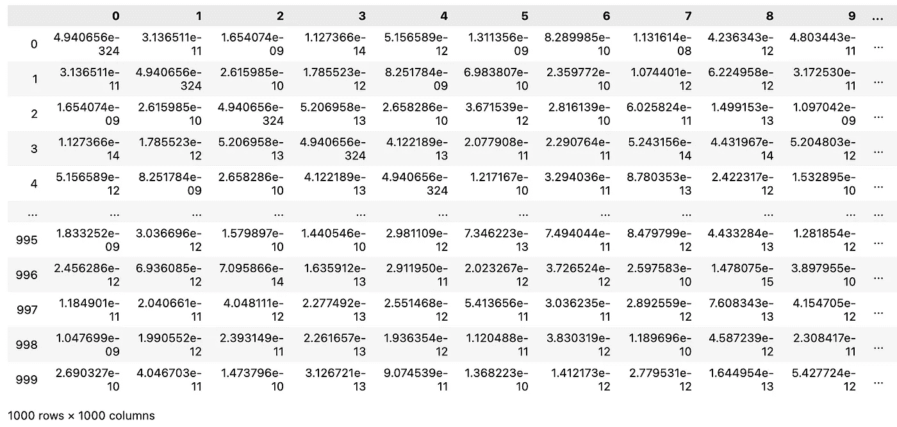

原始高维空间中联合概率的对称亲和矩阵

现在我们已经完成了 t-SNE 中的第一个主要步骤！我们计算了原始高维空间中的对称亲和矩阵。在我们深入优化阶段之前，我们将在接下来的两个步骤中讨论优化问题的主要组件，然后将它们结合到我们的 for 循环中。

**3\. 样本初始解决方案及计算低维亲和矩阵**

现在我们想在低维空间中随机抽样一个初始解决方案，如下所示：

```py
def initialization(
    X: np.ndarray, n_dimensions: int = 2, initialization: str = "random"
) -> np.ndarray:
    """
    Obtain initial solution for t-SNE either randomly or using PCA.

    Parameters:
        X (np.ndarray): The input data array.
        n_dimensions (int): The number of dimensions for the output solution. Default is 2.
        initialization (str): The initialization method. Can be 'random' or 'PCA'. Default is 'random'.

    Returns:
        np.ndarray: The initial solution for t-SNE.

    Raises:
        ValueError: If the initialization method is neither 'random' nor 'PCA'.
    """

    # Sample Initial Solution
    if initialization == "random" or initialization != "PCA":
        y0 = np.random.normal(loc=0, scale=1e-4, size=(len(X), n_dimensions))
    elif initialization == "PCA":
        X_centered = X - X.mean(axis=0)
        _, _, Vt = np.linalg.svd(X_centered)
        y0 = X_centered @ Vt.T[:, :n_dimensions]
    else:
        raise ValueError("Initialization must be 'random' or 'PCA'")

    return y0
```

其中调用 `y0 = initialization(X)` 我们得到一个随机的起始解决方案：

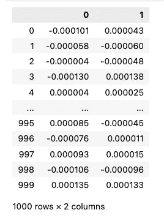

2-D 初始随机解决方案

现在，我们想在这个低维空间中计算亲和矩阵。然而，请记住，我们是利用具有 1 个自由度的学生-t 分布来完成的：


方程 (4) — 低维亲和

同样地，我们设置 *q = 0* 当 *i = j*。注意这个方程与公式 (1) 的不同之处在于分母涉及所有 *i*，因此按照构造是对称的。将其转化为代码，我们得到：

```py
def get_low_dimensional_affinities(Y: np.ndarray) -> np.ndarray:
    """
    Obtain low-dimensional affinities.

    Parameters:
    Y (np.ndarray): The low-dimensional representation of the data points.

    Returns:
    np.ndarray: The low-dimensional affinities matrix.
    """

    n = len(Y)
    q_ij = np.zeros(shape=(n, n))

    for i in range(0, n):
        # Equation 4 Numerator
        diff = Y[i] - Y
        norm = np.linalg.norm(diff, axis=1)
        q_ij[i, :] = (1 + norm**2) ** (-1)

    # Set p = 0 when j = i
    np.fill_diagonal(q_ij, 0)

    # Equation 4
    q_ij = q_ij / q_ij.sum()

    # Set 0 values to minimum numpy value (ε approx. = 0)
    ε = np.nextafter(0, 1)
    q_ij = np.maximum(q_ij, ε)

    return q_ij
```

这里我们正在寻找一个 *1000* x *1000* 的亲和矩阵，但现在是在低维空间中。调用 `q_ij = get_low_dimensional_affinities(y0)` 我们得到：

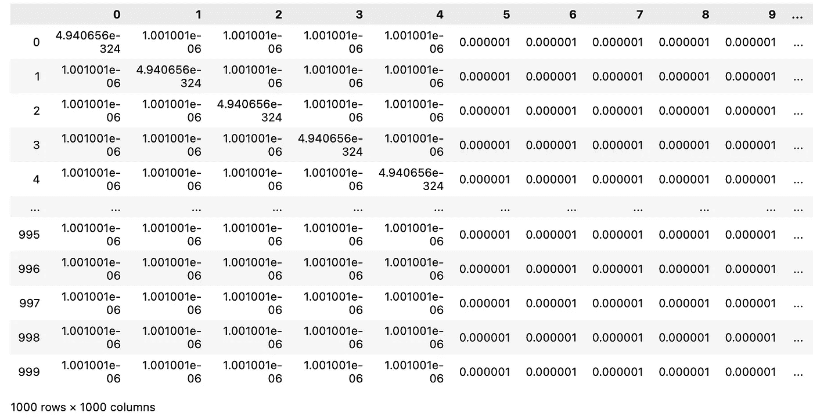

新低维空间中联合概率的对称亲和矩阵

**4. 计算成本函数的梯度**

回顾一下，我们的成本函数是高维空间和低维空间中联合概率分布的 Kullback-Leibler 散度：


联合概率分布的 Kullback-Leibler 散度

直观上，我们希望最小化亲和矩阵 `p_ij` 和 `q_ij` 之间的差异，从而最好地保留原始空间的“邻域”结构。使用梯度下降法来解决优化问题，但首先让我们看看如何计算上面成本函数的梯度。作者推导了成本函数的梯度（见 [论文](https://lvdmaaten.github.io/publications/papers/JMLR_2008.pdf) 的附录 A）如下：


成本函数的梯度（公式 5，但来自附录）

在 Python 中，我们有：

```py
def get_gradient(p_ij: np.ndarray, q_ij: np.ndarray, Y: np.ndarray) -> np.ndarray:
    """
    Obtain gradient of cost function at current point Y.

    Parameters:
    p_ij (np.ndarray): The joint probability distribution matrix.
    q_ij (np.ndarray): The Student's t-distribution matrix.
    Y (np.ndarray): The current point in the low-dimensional space.

    Returns:
    np.ndarray: The gradient of the cost function at the current point Y.
    """

    n = len(p_ij)

    # Compute gradient
    gradient = np.zeros(shape=(n, Y.shape[1]))
    for i in range(0, n):
        # Equation 5
        diff = Y[i] - Y
        A = np.array([(p_ij[i, :] - q_ij[i, :])])
        B = np.array([(1 + np.linalg.norm(diff, axis=1)) ** (-1)])
        C = diff
        gradient[i] = 4 * np.sum((A * B).T * C, axis=0)

    return gradient
```

输入相关参数，我们通过 `gradient = get_gradient(p_ij_symmetric,q_ij,y0)` 得到在 `y0` 处的梯度及相应输出：

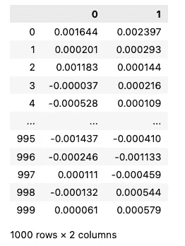

初始解（y0）下成本函数的梯度

现在，我们已经准备好解决优化问题的所有部分！

**5. 迭代与优化低维映射**

为了更新我们的低维映射，我们使用 [带动量的梯度下降](https://en.wikipedia.org/wiki/Gradient_descent)，正如作者所述：


更新规则（带动量的梯度下降）

其中 *η* 是我们的 [学习率](https://en.wikipedia.org/wiki/Learning_rate)，*α(t)* 是我们随时间变化的动量项。学习率控制每次迭代的步长，而动量项使优化算法在搜索空间的平滑方向上获得惯性，同时不被梯度的噪声部分所困扰。我们将例子中的 *η=200*，并且如果 *t < 250* 时将 *α(t)=0.5*，否则将 *α(t)=0.8*。以上是计算更新规则所需的所有组件，因此我们可以在设定的迭代次数 *T* 上进行优化（我们将 *T=1000*）。

在设置迭代方案之前，首先介绍作者所称的“早期夸张”增强。这一术语是一个常数，用于缩放原始的亲和度矩阵 `p_ij`。这将更多地强调在新空间中早期建模非常相似的点（原始空间中 `p_ij` 的高值），从而形成高度相似点的“簇”。早期夸张在迭代方案的开始阶段 (*T<250*) 中开启，然后关闭。在我们的情况下，早期夸张将设置为 4。我们将在下面的可视化中看到它的实际效果。

现在，将所有算法部分结合起来，我们得到了如下内容：

```py
def tsne(
    X: np.ndarray,
    perplexity: int = 10,
    T: int = 1000,
    η: int = 200,
    early_exaggeration: int = 4,
    n_dimensions: int = 2,
) -> list[np.ndarray, np.ndarray]:
    """
    t-SNE (t-Distributed Stochastic Neighbor Embedding) algorithm implementation.

    Args:
        X (np.ndarray): The input data matrix of shape (n_samples, n_features).
        perplexity (int, optional): The perplexity parameter. Default is 10.
        T (int, optional): The number of iterations for optimization. Default is 1000.
        η (int, optional): The learning rate for updating the low-dimensional embeddings. Default is 200.
        early_exaggeration (int, optional): The factor by which the pairwise affinities are exaggerated
            during the early iterations of optimization. Default is 4.
        n_dimensions (int, optional): The number of dimensions of the low-dimensional embeddings. Default is 2.

    Returns:
        list[np.ndarray, np.ndarray]: A list containing the final low-dimensional embeddings and the history
            of embeddings at each iteration.

    """
    n = len(X)

    # Get original affinities matrix
    p_ij = get_original_pairwise_affinities(X, perplexity)
    p_ij_symmetric = get_symmetric_p_ij(p_ij)

    # Initialization
    Y = np.zeros(shape=(T, n, n_dimensions))
    Y_minus1 = np.zeros(shape=(n, n_dimensions))
    Y[0] = Y_minus1
    Y1 = initialization(X, n_dimensions)
    Y[1] = np.array(Y1)

    print("Optimizing Low Dimensional Embedding....")
    # Optimization
    for t in range(1, T - 1):
        # Momentum & Early Exaggeration
        if t < 250:
            α = 0.5
            early_exaggeration = early_exaggeration
        else:
            α = 0.8
            early_exaggeration = 1

        # Get Low Dimensional Affinities
        q_ij = get_low_dimensional_affinities(Y[t])

        # Get Gradient of Cost Function
        gradient = get_gradient(early_exaggeration * p_ij_symmetric, q_ij, Y[t])

        # Update Rule
        Y[t + 1] = Y[t] - η * gradient + α * (Y[t] - Y[t - 1])  # Use negative gradient

        # Compute current value of cost function
        if t % 50 == 0 or t == 1:
            cost = np.sum(p_ij_symmetric * np.log(p_ij_symmetric / q_ij))
            print(f"Iteration {t}: Value of Cost Function is {cost}")

    print(
        f"Completed Low Dimensional Embedding: Final Value of Cost Function is {np.sum(p_ij_symmetric * np.log(p_ij_symmetric / q_ij))}"
    )
    solution = Y[-1]

    return solution, Y
```

调用 `solution, Y = tSNE(X)` 我们得到以下输出：

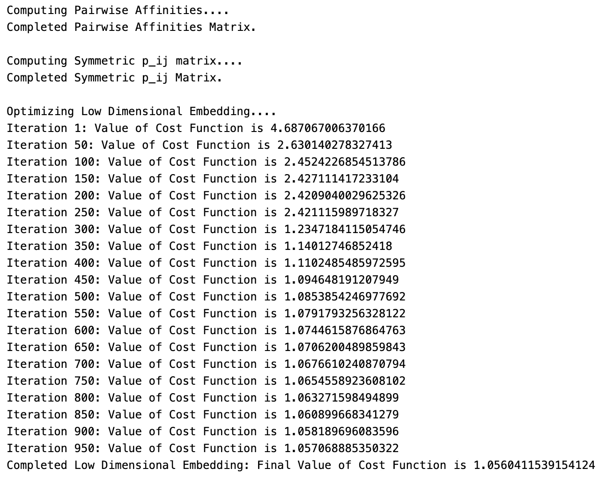

其中 `solution` 是最终的 2-D 映射，`Y` 是我们在每次迭代步骤中的 2-D 映射值。绘制 `Y` 的演变，其中 `Y[-1]` 是我们的最终 2-D 映射，我们得到（注意算法在早期夸张开启和关闭时的表现）：

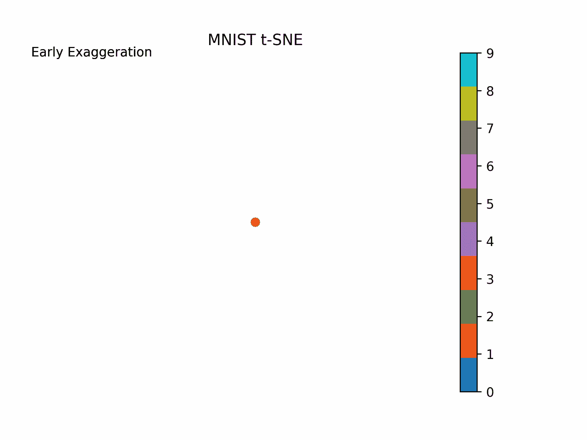

t-SNE 算法中的 2-D 映射演变

我建议尝试不同的参数值（如困惑度、学习率、早期夸张等），看看解决方案如何变化（参见[原始论文](https://lvdmaaten.github.io/publications/papers/JMLR_2008.pdf)和[scikit-learn 文档](https://scikit-learn.org/stable/modules/generated/sklearn.manifold.TSNE.html)获取使用这些参数的指南）。

## 结论

就这样，我们从零开始实现了 t-SNE！我希望你发现这个练习对 t-SNE 的内部工作有启发，至少是令人满意的。请注意，这个实现并不旨在优化速度，而是为了理解。t-SNE 算法的改进包括提高计算速度和性能，例如[Barnes-Hut 算法的变体](https://lvdmaaten.github.io/publications/papers/JMLR_2014.pdf)（基于树的方法）、使用 PCA 作为嵌入的初始化，或使用如自适应学习率等额外的梯度下降扩展。[scikit-learn](https://scikit-learn.org/stable/modules/generated/sklearn.manifold.TSNE.html)中的实现采用了许多这些增强功能。

一如既往，我希望你阅读这篇文章的乐趣与我写作时的乐趣一样。

## 资源

[1] van der Maaten, L.J.P.; Hinton, G.E. 使用 t-SNE 可视化高维数据。《机器学习研究期刊》9:2579–2605, 2008。

[2] LeCun *et al.* (1999)：手写数字 (图像) 的 MNIST 数据集 许可证：CC BY-SA 3.0

*通过这个 GitHub 仓库访问所有代码：* [`github.com/jakepenzak/Blog-Posts`](https://github.com/jakepenzak/Blog-Posts)

*感谢你阅读我的帖子！我在 Medium 上的帖子旨在探讨利用* ***计量经济学*** *和* ***统计学/机器学习*** *技术的实际和理论应用。此外，我还希望通过理论和模拟提供有关各种方法论的理论基础的帖子。最重要的是，我写作是为了学习并帮助他人学习！我希望使复杂的主题对大家稍微更加易懂。如果你喜欢这篇帖子，请考虑* [***在 Medium 上关注我***](https://medium.com/@jakepenzak)*！*
