# T5：文本到文本的变换器（第一部分）

> 原文：[`towardsdatascience.com/t5-text-to-text-transformers-part-one-6b655f27c79a`](https://towardsdatascience.com/t5-text-to-text-transformers-part-one-6b655f27c79a)

## 创建一个统一的语言建模框架

 [Cameron R. Wolfe, Ph.D.](https://wolfecameron.medium.com/?source=post_page-----6b655f27c79a--------------------------------)

·发表于[Towards Data Science](https://towardsdatascience.com/?source=post_page-----6b655f27c79a--------------------------------) ·14 分钟阅读·2023 年 6 月 27 日

--

（照片由[Patrick Tomasso](https://unsplash.com/@impatrickt?utm_source=unsplash&utm_medium=referral&utm_content=creditCopyText)拍摄，来源于[Unsplash](https://unsplash.com/s/photos/text?utm_source=unsplash&utm_medium=referral&utm_content=creditCopyText)）

迁移学习范式包括两个主要阶段。首先，我们在一大堆数据上对深度神经网络进行预训练。然后，我们在一个更具体的下游数据集上对这个模型进行微调（即，再训练它一段时间）。这些阶段的具体实现可能有多种形式。例如，在计算机视觉中，我们通常使用有监督学习目标在 ImageNet 数据集上对模型进行预训练。然后，这些模型在下游数据集上进行有监督微调（即，我们实际尝试解决的任务）。而在自然语言处理（NLP）中，我们通常在未标记的文本语料库上进行[自监督](https://cameronrwolfe.substack.com/i/76273144/self-supervised-learning)预训练。

结合大型深度神经网络和庞大的（预）训练数据集通常会产生令人印象深刻的结果。这一发现对自然语言处理（NLP）尤其适用。由于原始文本数据在互联网上可以自由获得，我们可以简单地下载大量文本语料库，先在这些数据上预训练一个大型神经网络，然后在各种下游任务上微调模型（或仅使用零/少样本学习技术）。这一大规模迁移学习方法最初由 BERT 探索，该方法在未标记的数据上使用[掩蔽目标](https://cameronrwolfe.substack.com/i/76273144/training-bert)预训练了一个[变换器编码器](https://cameronrwolfe.substack.com/i/76273144/transformer-encoders)，然后在下游语言任务上进行微调。

BERT [2] 的成功不可小觑（即，在几乎所有语言基准上都取得了新的最先进性能）。因此，自然语言处理（NLP）社区开始深入研究迁移学习这一主题，提出了许多新的扩展和改进。由于这一领域的发展迅速，各种方法的比较变得困难。文本到文本转换器（T5）模型 [1] 提出了一个统一的框架，用于研究 NLP 中的迁移学习方法，使我们能够分析不同的设置并得出一套最佳实践。这套最佳实践包括 T5，这是一种用于语言理解任务的最先进模型和训练框架。

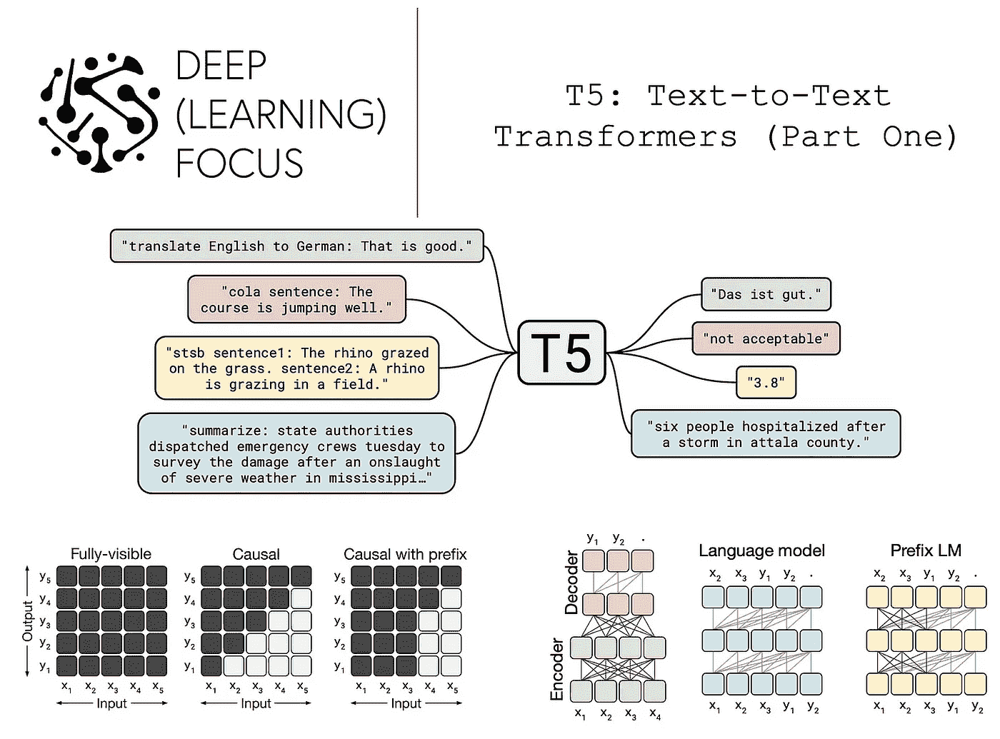

（来自 [1]）

# 相关历史和背景

T5 将现有的迁移学习技术重新定义为统一的格式，进行比较，并确定最佳实践以获得高性能结果。*但这意味着什么？迁移学习是什么，为什么我们应该关注它？* 为了回答这些问题，我们将首先概述一些重要的概念，包括迁移学习和不同的 Transformer 架构变体，这些对于理解 [1] 中的分析至关重要。从这里开始，我们将通过解释 [BERT](https://cameronrwolfe.substack.com/p/language-understanding-with-bert) [2] 架构来提供一些历史背景，这一架构使得迁移学习在自然语言处理（NLP）任务中变得流行。

## 什么是迁移学习？

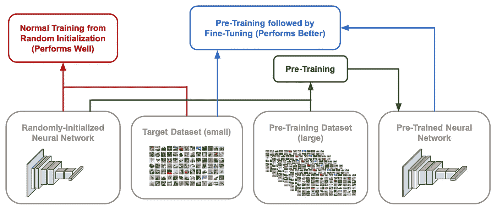

训练神经网络的不同选项（由作者创建）

如果我们想训练一个神经网络来解决某个任务，我们有两个基本的选择。

1.  *从头开始训练*：随机初始化你的神经网络，并在你的目标任务上进行训练（以监督方式）。

1.  *迁移学习*：在一个独立的数据集上进行预训练，然后在目标任务上进行微调（即，进一步训练）。

通常，预训练是在比下游目标数据集大得多的数据集上进行的。一般而言，预训练会大幅提高数据效率。模型在微调期间学习得更快，甚至可能表现更好。迁移学习过程可以有许多不同的形式。例如，在计算机视觉中，我们可能会在 ImageNet 上进行模型预训练（使用[监督学习](https://www.geeksforgeeks.org/supervised-unsupervised-learning/)），然后在像 CIFAR-10/100 这样的较小数据集上进行微调。对于自然语言处理（NLP）任务，情况稍有不同。通常，我们使用[自监督](https://cameronrwolfe.substack.com/i/76273144/self-supervised-learning)预训练目标（例如，[掩蔽语言建模](https://cameronrwolfe.substack.com/i/76273144/training-bert)或[因果语言建模](https://cameronrwolfe.substack.com/i/85568430/language-modeling)）与未标记的文本。

## 不同的 Transformer 架构

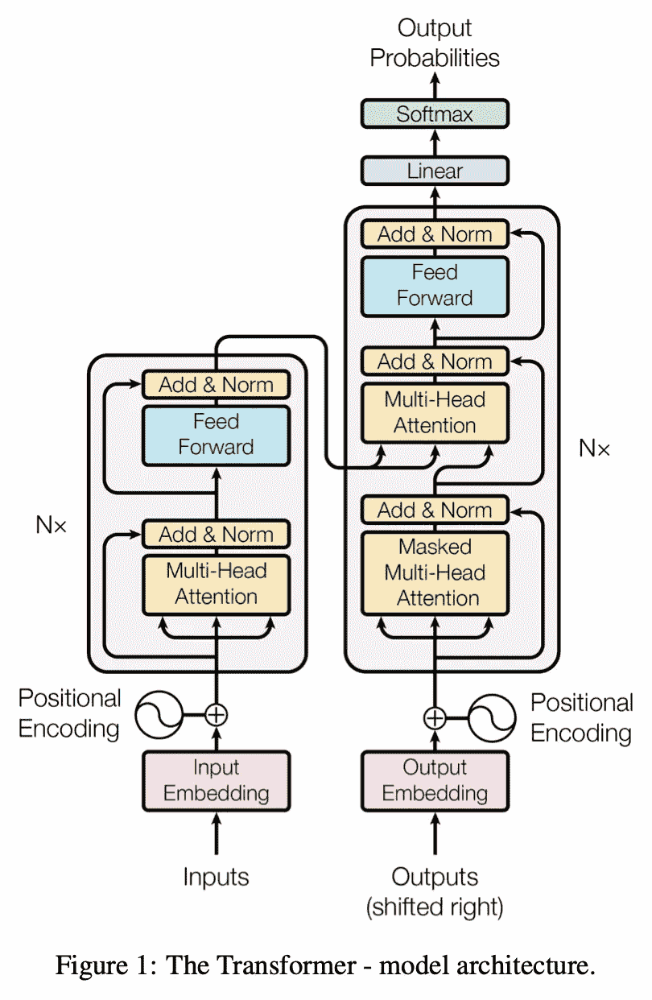

（来自 [6]）

Transformer，如在 [1] 中最初提出的，使用编码器-解码器架构，如上所示。有关此架构的更深入概述，请查看链接 [here](https://newsletter.artofsaience.com/p/vision-transformers-from-idea-to)。然而，编码器-解码器 Transformer 架构并不是我们唯一的选择！BERT 使用 [仅编码器架构](https://cameronrwolfe.substack.com/i/76273144/transformer-encoders)，而大多数 [现代大型语言模型](https://cameronrwolfe.substack.com/p/modern-llms-mt-nlg-chinchilla-gopher)（LLMs）基于 [仅解码器的 Transformers](https://cameronrwolfe.substack.com/i/85568430/decoder-only-transformers)。让我们花一点时间了解这些架构变体之间的区别。

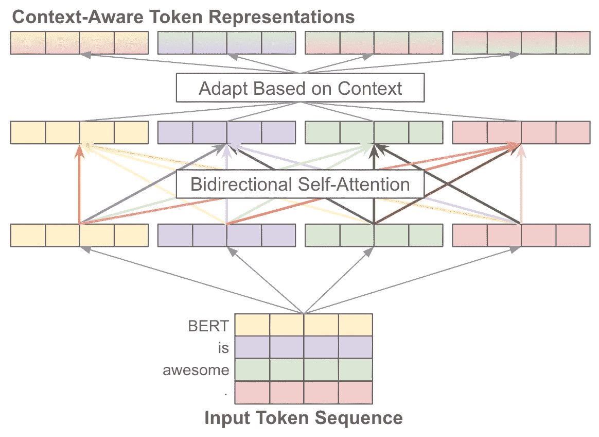

Transformer 编码器中的双向自注意力（由作者创建）

**自注意力的简介。** 自注意力操作将一个令牌向量序列作为输入，并生成一个长度相同的新的变换后令牌向量序列作为输出；如上所示。这个新序列的每个条目都是输入序列中向量的加权平均值。具体而言，我们计算输出序列中每个令牌向量的方法如下，其中 `y_i` 和 `x_j` 分别是输出和输入序列的元素。

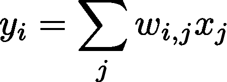

（由作者创建）

上述权重 `w_{i, j}` 是一个注意力分数，它是 `x_i` 和 `x_j` 的函数。简单来说，这个分数捕捉了当前令牌在计算其新表示时应该“关注”序列中的其他令牌的程度。

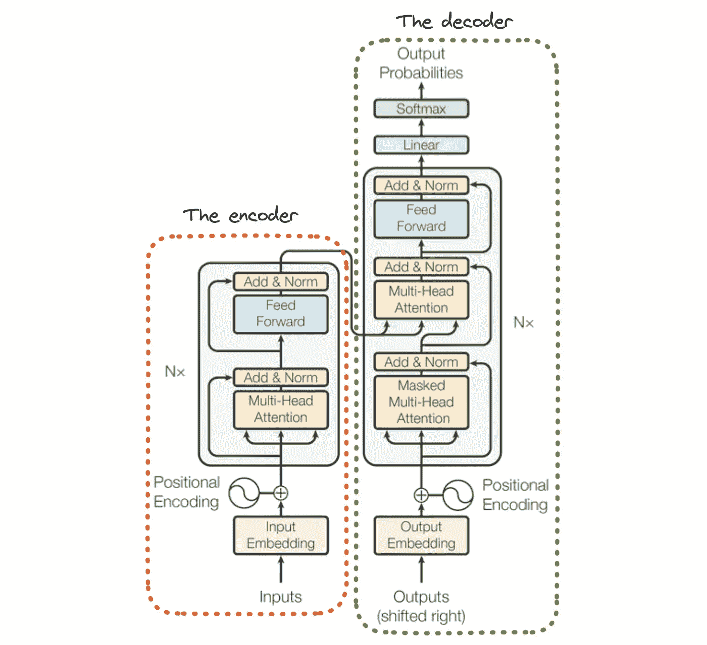

（来自 [6]）

**单堆栈还是双堆栈？** 原始 Transformer 架构使用两个“堆栈” 的 Transformer 层；见上文。第一个堆栈（编码器模块）由几个包含双向自注意力和 [前馈神经网络](https://cameronrwolfe.substack.com/i/94634004/feed-forward-neural-networks) 的块组成。第二个堆栈（解码器模块）非常相似，但它使用 [掩码自注意力](https://cameronrwolfe.substack.com/i/76273144/self-attention)，并增加了一个“交叉注意力”机制，该机制在执行自注意力时考虑对应编码器层中的激活。Transformer 最初用于 [序列到序列](https://en.wikipedia.org/wiki/Seq2seq) 任务（例如语言翻译）。对于其他任务，单堆栈 Transformer 模型变得非常流行：

+   语言模型使用仅解码器架构

+   BERT 风格的模型使用仅编码器架构

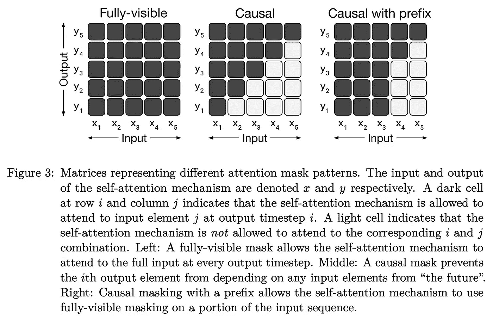

（来自 [1]）

**注意力掩码。** 变压器架构的变体有一个主要区别：*在其注意力层中使用的掩码类型*。在这里，当我们说“掩码”时，我们指的是在自注意力计算过程中某些标记被掩盖（或忽略）。简单来说，某些标记可能仅查看完整输入序列中的一部分其他标记。上图描绘了自注意力的不同掩码选项。

仅编码器模型利用双向（或完全可见）自注意力，这在自注意力过程中考虑了整个序列中的所有标记。自注意力中的每个标记表示是通过序列中所有其他标记的加权平均来计算的。相比之下，仅解码器模型使用因果自注意力，其中每个标记仅考虑序列中其之前的标记。

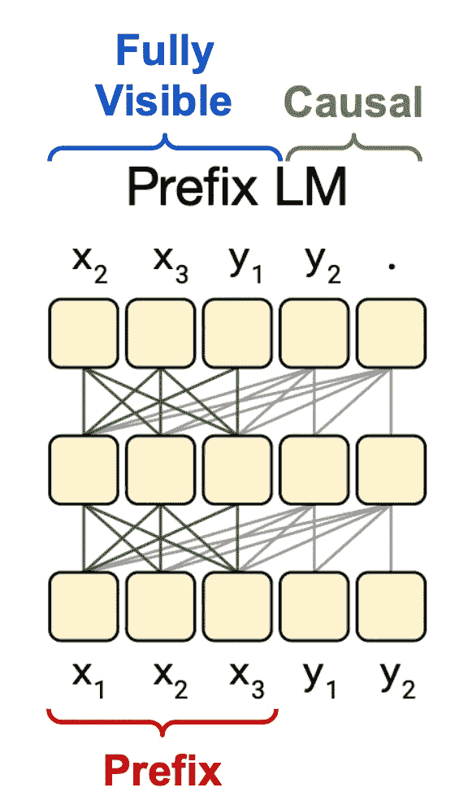

(来自 [1])

我们还可以通过定义“前缀”来采用混合方法。更具体地说，我们可以对序列开头的一组标记（即前缀）执行双向自注意力，然后对序列中其余的标记执行因果自注意力；见上文。完全可见（或双向）自注意力对于处理前缀或执行分类任务非常有用。然而，某些应用（例如，语言建模）在训练过程中需要因果自注意力，以防止变压器“看到未来”（即在生成输出时仅复制正确的标记）。

**T5 使用什么？** 尽管[1]中的分析考虑了许多变压器架构，但 T5 主要使用的是标准的编码器-解码器架构。除了少数小修改外，该模型与最初提出的变压器[6]非常相似。由于编码器仅架构设计用于标记或序列级分类，而不是像翻译或总结这样的生成任务，[1]中没有探索它们。T5 旨在找到一种统一的方法（基于迁移学习）来解决许多语言理解任务。

## BERT：NLP 的迁移学习

在早期，NLP 中的迁移学习通常使用经过 [因果语言建模目标](https://cameronrwolfe.substack.com/i/85568430/language-modeling) 预训练的递归神经网络。然而，随着 [BERT](https://cameronrwolfe.substack.com/p/language-understanding-with-bert) [2] 的提出，一切发生了变化。BERT 是一种基于变换器的模型 [6]，其使用 [自监督目标](https://cameronrwolfe.substack.com/i/76273144/self-supervised-learning) 进行预训练。BERT 可以在大量未标记的文本上进行预训练，然后微调以对句子（甚至句子中的单个标记）进行高精度分类。在提出时，BERT 在几乎所有被考虑的 NLP 任务上都设立了新的最先进水平，巩固了迁移学习在 NLP 中的主导地位。

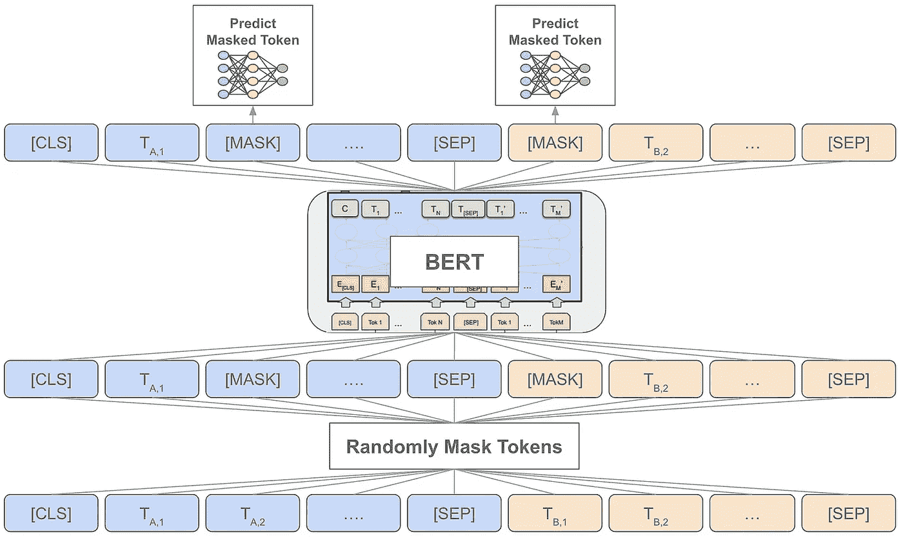

使用 BERT 执行自监督 MLM 预训练（由作者创建）

为了使这一点更加具体，BERT 在预训练过程中依赖于一种“去噪”目标，称为 [掩码语言建模 (MLM)](https://cameronrwolfe.substack.com/i/76273144/self-supervised-learning)；见上文。虽然这听起来可能有些复杂，但其核心思想很简单，我们只需：

1.  将输入序列中的一些标记掩盖，用特殊的 `[MASK]` 标记替代

1.  使用 BERT 处理这些被破坏/修改过的序列

1.  训练 BERT 以准确预测掩码标记

精确的实现要复杂一些。我们随机选择 15% 的标记，然后将它们替换为 `[MASK]` 标记（90% 的概率）或随机标记（10% 的概率）。通过在足够大的预训练语料库上使用这一目标，BERT 可以学习大量的一般语言学知识，使其成为一个高效的迁移学习模型。

**T5 与 BERT 有什么关系？** BERT 的提出展示了迁移学习是一种解决 NLP 问题的有效方法。许多人很快开始使用 BERT，尝试新技术并提出改进建议。因此，该领域充斥着各种使用类似 BERT 模型进行迁移学习的选项。T5 [1] 在这一研究方向上继续前进，但试图使用统一的框架来分析所有这些不同的提案，从而为我们提供了关于 NLP 中迁移学习最佳实践的更清晰的视角。最终的 T5 模型利用这些最佳实践进行训练，以达到最先进的性能。

**T5 与 LLMs 的关系是什么？** 目前，我们正在看到生成 AI 领域的重大革命，其中 [LLMs](https://cameronrwolfe.substack.com/p/specialized-llms-chatgpt-lamda-galactica)（基于仅解码器的变压器架构）被用于通过语言模型预训练解决语言任务，然后进行 [零/少样本学习](https://cameronrwolfe.substack.com/i/88082618/language-models-are-few-shot-learners)。LLMs 很出色，但 T5 存在于一个相对独特的工具和研究领域。即，T5 主要关注那些明确通过编码器处理输入，然后通过单独的解码器生成输出的模型。此外，T5 采用迁移学习方法（即，预训练后在每个目标任务上进行微调），而不是零/少样本学习。

## 其他有用的链接

+   变压器架构 [[link](https://cameronrwolfe.substack.com/i/74325854/the-transformer-architecture)]

+   自注意力 [[link](https://cameronrwolfe.substack.com/i/74325854/self-attention)]

+   BERT 模型 [[link](https://cameronrwolfe.substack.com/p/language-understanding-with-bert)]

+   语言模型的基础 [[link](https://cameronrwolfe.substack.com/p/language-models-gpt-and-gpt-2)]

# T5：统一的文本到文本变压器

T5 的贡献并不是一种新颖的架构或训练方法。相反，[1]中进行的研究完全基于现有技术。T5 考虑了 NLP 领域中迁移学习管道的各个方面，例如不同的（未标记的）数据集、预训练目标、基准测试和微调方法。然而，所有这些方面都是通过统一的文本到文本格式进行研究的。T5 的目标是 *i)* 分析迁移学习设置和 *ii)* 确定最有效的方法。

## 文本到文本框架

T5 将所有文本处理问题转换为“文本到文本”格式（即，将文本作为输入并生成文本作为输出）。这种通用结构也被采用于具有零/少样本学习的 LLMs，使我们能够用统一的方法建模和解决各种不同的任务。*我们可以将相同的模型、目标、训练程序和解码过程应用于我们考虑的每个任务*！我们只需采用 [提示](https://cameronrwolfe.substack.com/i/91134599/a-primer-on-language-modeling) 方法，并要求我们的语言模型以文本格式生成答案。

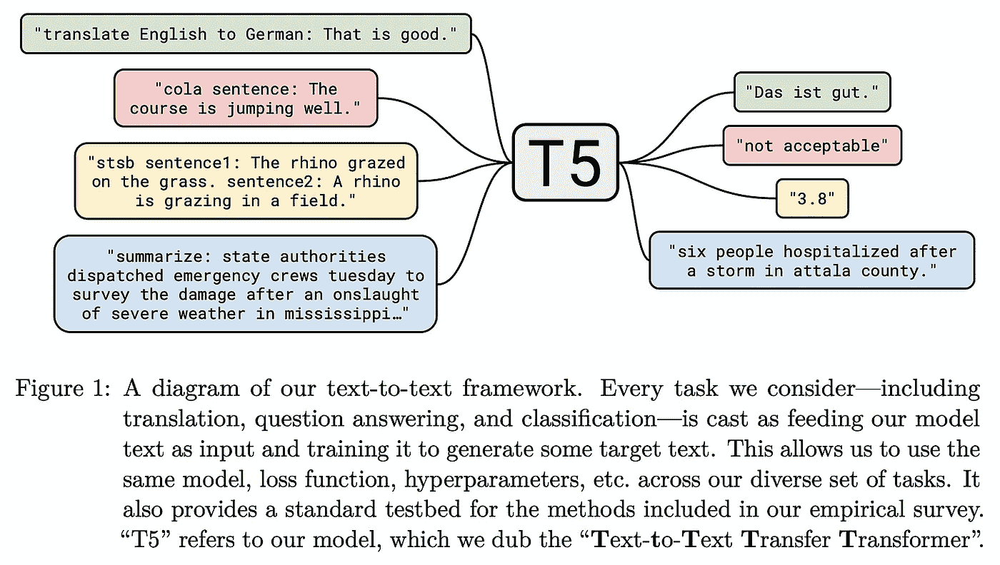

（来自 [1]）

为了让这一点更加具体，T5 解决的所有任务都可以转换为文本到文本格式，如下所示：

1.  为原始输入序列添加任务特定的前缀

1.  将这个序列输入到变压器中

1.  将模型的目标形式化为文本序列

使用这种格式，我们可以轻松执行诸如总结或翻译（即目标自然是一个序列）之类的任务。此外，我们可以通过仅训练模型生成与正确类别相关的文本来进行分类。这一过程在回归问题（即我们必须将实值输出舍入到最近的小数并将其视为分类问题）时会变得有些复杂，但对于大多数语言任务，它往往效果很好。示例见上图。

> *“如果我们的模型在文本分类任务中输出的文本与任何可能的标签都不对应，那么会出现问题……在这种情况下，我们总是将模型的输出视为错误，尽管我们在任何训练模型中都没有观察到这种行为。”* — 来自[1]

T5 会针对它解决的每个任务进行微调。这与使用少样本学习的 LLM 和使用[多任务学习](https://www.ruder.io/multi-task/)一次性解决多个任务的 NLP 十项全能[3]形成对比。

## T5 是如何研究的？

所有在[1]中进行的分析都使用了上述统一的文本到文本框架，因为它允许将各种不同的语言理解任务转换为共享格式。此外，T5 的分析使用了相同的基础变换器架构和预训练数据集。

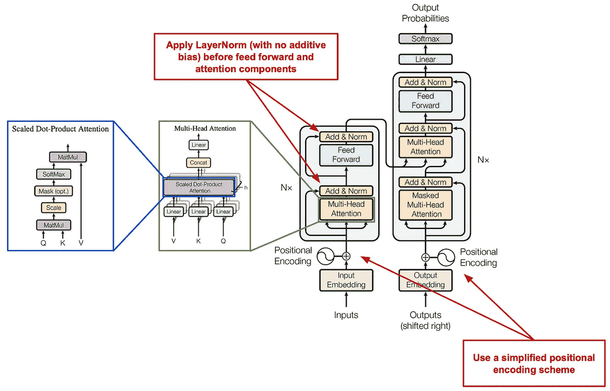

（来自[6]）

**模型。** 如前所述，变换器架构，正如[6]中最初提出的那样，包含编码器和解码器模块。最近对语言建模的研究探讨了只使用编码器或解码器的架构变体；例如，[BERT](https://cameronrwolfe.substack.com/i/76273144/transformer-encoders)只使用编码器[2]，而大多数[(大型)语言模型](https://cameronrwolfe.substack.com/i/85568430/decoder-only-transformers)只使用解码器。T5 使用了一个与原始变换器非常相似的编码器-解码器架构。不同之处在于：

1.  [LayerNorm](https://pytorch.org/docs/stable/generated/torch.nn.LayerNorm.html)在每次注意力和前馈变换之前立即应用（即，位于残差路径之外）

1.  对于 LayerNorm 未使用加性偏置（即，见[这里](https://pytorch.org/docs/stable/generated/torch.nn.LayerNorm.html)；我们只使用缩放并消除加性偏置）

1.  使用了一个简单的位置嵌入方案，将一个标量添加到计算注意力权重时使用的相应[logit](https://stackoverflow.com/questions/41455101/what-is-the-meaning-of-the-word-logits-in-tensorflow)中。

1.  在整个网络中应用了 Dropout（例如，注意力权重、前馈网络、跳跃连接等）

这些修改在上图中有所说明。使用该模型（以及其他一些模型），T5 可以测试许多不同的迁移学习设置，以得出一套最佳实践。

**预训练数据集。** T5 在 Colossal Clean Crawled Corpus（C4）上进行预训练，这是一个 750GB 的“相对干净”的英文文本数据集，详见[1]。尽管先前的工作中提出了各种预训练数据集，[1]中的作者选择构建自己的数据集，因为先前的数据集不可公开获取，使用的过滤规则有限，范围有限（例如，仅来自[Creative Commons](https://creativecommons.org/)），或仅专注于机器翻译的平行数据（即多个不同语言中的相同句子版本）。

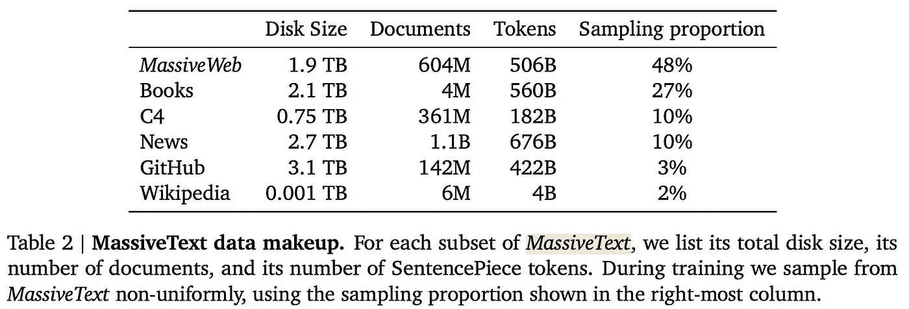

（来自[4]）

值得注意的是，C4 后来被用作 MassiveText 数据集的一个子集，该数据集用于预训练[Gopher](https://cameronrwolfe.substack.com/i/91134599/scaling-language-models-methods-analysis-and-insights-from-training-gopher)和[Chinchilla](https://cameronrwolfe.substack.com/i/91134599/training-compute-optimal-llms)[4, 5]。请参见上表，以了解该数据集的规模指标，这有助于更好地理解 C4 与用于训练现代 LLM 的预训练数据集的相对大小。对于 LLM，我们已经看到，预训练仅解码器模型在足够大的数据集上是其成功的关键。不同架构的变换器，如 T5，亦是如此。在大型未标记数据集上的广泛预训练有利于更好的下游表现。

**实验设置。** T5 在 C4 上进行预训练，然后微调以解决各种下游任务。然而，在这个框架中使用的确切设置是可变的。即，我们可以更改：

+   变换器架构

+   预训练设置（即任务或数据量）

+   微调设置

+   模型的规模/大小

通过逐一更改这些设置并评估结果，我们可以为 NLP 中的迁移学习开发一套最佳实践，从而将 BERT 之后的众多提议提炼成一个有效的管道，用于创建有效的语言理解模型。

# 要点

本文涵盖了与 T5 模型相关的所有初步信息，包括重要的背景信息和使用的基本实验框架。在下一篇文章中，我们将详细介绍[1]中进行的广泛分析，揭示 NLP 中迁移学习的最佳实践。目前，T5 的主要要点概述如下。

**迁移学习是强大的。** 迁移学习是指在某些独立数据集上预训练深度学习模型，然后在下游目标数据集（即我们实际要解决的任务）上微调（或进一步训练）该模型。如果在足够大且对齐（即，与下游任务类似）的数据集上进行，预训练是非常有效的。模型在微调期间可以学习得更快，甚至达到更高的准确率。这种技术在不同领域（例如计算机视觉和自然语言处理）中都有效，但用于预训练或微调的确切方法可能会有所不同。

> *“虽然我们在本文中没有明确测量数据效率的提升，但我们强调这是迁移学习范式的主要好处之一。”* — 来源于 [1]

**BERT 之后是什么？** BERT [2] 的提出是一个巨大的突破，普及了迁移学习在自然语言处理任务中的应用。事实上，BERT 在几乎所有涉及的任务上都设置了新的最先进性能。由于其成功，研究社区采纳并迭代了 BERT 的方法。T5 尝试统一 BERT 提出后的所有后续工作和分析，提供了对最有效迁移学习方法的更清晰视角。

**通用任务制定。** 为了创建一个统一的框架，以便研究多种不同的迁移学习方法，T5 提出了一个通用的文本到文本框架。类似于用于大型语言模型（LLM）的提示和少样本学习技术，这个文本到文本框架可以将任何语言任务重组为文本输入和输出。具体来说，这通过在文本输入中附加特定任务的前缀（即，让 T5 知道它正在解决什么任务）来完成，并使用 T5 的解码器模块生成与期望目标（例如标签、回归值或文本序列）对应的文本。

## 结束语

感谢阅读本文。我是 [Cameron R. Wolfe](https://cameronrwolfe.me/)，[Rebuy](https://www.rebuyengine.com/) 的 AI 总监。我研究深度学习的实证和理论基础。你也可以查看我在 Medium 上的 [其他文章](https://medium.com/@wolfecameron)！如果你喜欢，请在 [twitter](https://twitter.com/cwolferesearch) 上关注我，或订阅我的 [Deep (Learning) Focus 电子通讯](https://cameronrwolfe.substack.com/)，我在其中通过易于理解的热门论文概述帮助读者深入了解 AI 研究中的主题。

## 参考文献

[1] Raffel, Colin, et al. “Exploring the limits of transfer learning with a unified text-to-text transformer.” *The Journal of Machine Learning Research* 21.1 (2020): 5485–5551.

[2] Devlin, Jacob, et al. “Bert: Pre-training of deep bidirectional transformers for language understanding.” *arXiv preprint arXiv:1810.04805* (2018).

[3] McCann, Bryan, 等人。“自然语言十项全能：将多任务学习应用于问答。” *arXiv 预印本 arXiv:1806.08730* (2018)。

[4] Rae, Jack W., 等人。“语言模型的扩展：训练 Gopher 的方法、分析与见解。” *arXiv 预印本 arXiv:2112.11446* (2021)。

[5] Hoffmann, Jordan, 等人。“训练计算最优的大型语言模型。” *arXiv 预印本 arXiv:2203.15556* (2022)。

[6] Vaswani, Ashish, 等人。“注意力机制才是你所需要的。” *神经信息处理系统进展* 30 (2017)。
